# Chat State Management

<cite>
**Referenced Files in This Document**
- [chat.ts](file://src/stores/chat.ts)
- [chat.ts](file://src/api/modules/chat.ts)
- [detail.vue](file://src/pages/chat/detail.vue)
- [list.vue](file://src/pages/chat/list.vue)
- [MessageBubble.vue](file://src/components/business/MessageBubble.vue)
- [websocket.ts](file://src/utils/websocket.ts)
- [auth.ts](file://src/stores/auth.ts)
- [backend-types.ts](file://src/types/api/backend-types.ts)
- [api.ts](file://src/types/api.ts)
- [enums.ts](file://src/types/enums.ts)
</cite>

## Table of Contents
1. [Introduction](#introduction)
2. [Project Structure](#project-structure)
3. [Core Components](#core-components)
4. [Architecture Overview](#architecture-overview)
5. [Detailed Component Analysis](#detailed-component-analysis)
6. [Dependency Analysis](#dependency-analysis)
7. [Performance Considerations](#performance-considerations)
8. [Troubleshooting Guide](#troubleshooting-guide)
9. [Conclusion](#conclusion)
10. [Appendices](#appendices)

## Introduction
This document explains the chat state management built with Pinia stores in a cross-platform uni-app TypeScript project. It covers the chat store architecture, active chat tracking, message history management, conversation state, message lifecycle (from sending to delivery confirmation and read receipts), state mutations, API integration patterns, reactive UI updates, and strategies for multi-device synchronization. It also outlines concurrency, optimistic updates, and WebSocket-driven real-time updates.

## Project Structure
The chat feature spans several layers:
- Stores: Pinia stores manage reactive state for conversations, current chat, messages, and unread counts.
- Pages: Chat list and chat detail pages consume the store and render reactive UI.
- Components: MessageBubble renders individual messages and reacts to status changes.
- API: Strongly typed chat API module encapsulates backend endpoints.
- WebSocket: Centralized manager handles connection, heartbeats, and message routing.
- Types: Shared interfaces for Message, Conversation, and enums.

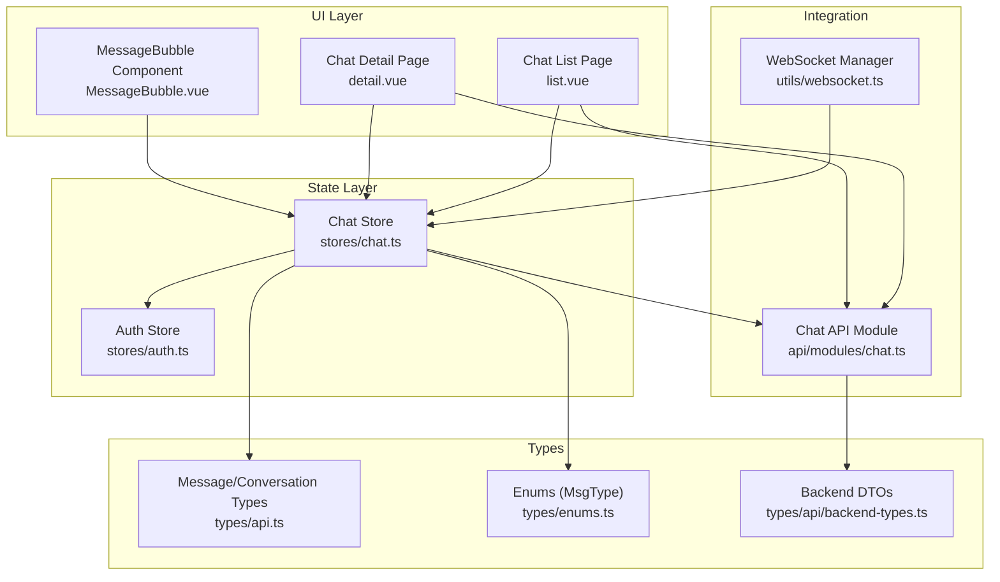

**Diagram sources**
- [list.vue:1-311](file://src/pages/chat/list.vue#L1-L311)
- [detail.vue:1-299](file://src/pages/chat/detail.vue#L1-L299)
- [MessageBubble.vue:1-309](file://src/components/business/MessageBubble.vue#L1-L309)
- [chat.ts:1-234](file://src/stores/chat.ts#L1-L234)
- [chat.ts:1-42](file://src/api/modules/chat.ts#L1-L42)
- [websocket.ts:1-171](file://src/utils/websocket.ts#L1-L171)
- [auth.ts:1-137](file://src/stores/auth.ts#L1-L137)
- [api.ts:26-43](file://src/types/api.ts#L26-L43)
- [enums.ts:7-11](file://src/types/enums.ts#L7-L11)
- [backend-types.ts:538-547](file://src/types/api/backend-types.ts#L538-L547)

**Section sources**
- [chat.ts:1-234](file://src/stores/chat.ts#L1-L234)
- [chat.ts:1-42](file://src/api/modules/chat.ts#L1-L42)
- [detail.vue:1-299](file://src/pages/chat/detail.vue#L1-L299)
- [list.vue:1-311](file://src/pages/chat/list.vue#L1-L311)
- [MessageBubble.vue:1-309](file://src/components/business/MessageBubble.vue#L1-L309)
- [websocket.ts:1-171](file://src/utils/websocket.ts#L1-L171)
- [auth.ts:1-137](file://src/stores/auth.ts#L1-L137)
- [api.ts:26-43](file://src/types/api.ts#L26-L43)
- [enums.ts:7-11](file://src/types/enums.ts#L7-L11)
- [backend-types.ts:538-547](file://src/types/api/backend-types.ts#L538-L547)

## Core Components
- Chat Store: Reactive state for conversations, current chat, messages, and unread count. Provides actions to fetch conversations, fetch message history, send messages (optimistic), mark as read, add received messages, confirm sent messages, set current chat, and clear messages.
- Chat API: Typed wrappers around HTTP endpoints for sending messages, fetching history, conversations, and marking as read.
- WebSocket Manager: Connects via Socket.IO, manages reconnection, heartbeats, and routes incoming events to the store.
- Chat Pages: Chat list and detail pages subscribe to store state and drive UI updates.
- MessageBubble: Renders messages, shows status indicators, and supports retry actions.

Key responsibilities:
- Active chat tracking: currentChat tracks the selected conversation.
- Message history: messages array holds ordered message records.
- Conversation state: conversations array maintains per-user metadata including last message, last message time, and unread count.
- Real-time updates: WebSocket events trigger addMessage and confirmSentMessage to keep UI and state synchronized.

**Section sources**
- [chat.ts:8-234](file://src/stores/chat.ts#L8-L234)
- [chat.ts:18-41](file://src/api/modules/chat.ts#L18-L41)
- [websocket.ts:6-171](file://src/utils/websocket.ts#L6-L171)
- [detail.vue:50-172](file://src/pages/chat/detail.vue#L50-L172)
- [list.vue:59-98](file://src/pages/chat/list.vue#L59-L98)
- [MessageBubble.vue:68-115](file://src/components/business/MessageBubble.vue#L68-L115)

## Architecture Overview
The system follows a unidirectional data flow:
- UI triggers actions (send, navigate, mark as read).
- Store mutations update reactive state.
- API requests and WebSocket events update state asynchronously.
- UI reactivity reflects state changes immediately.

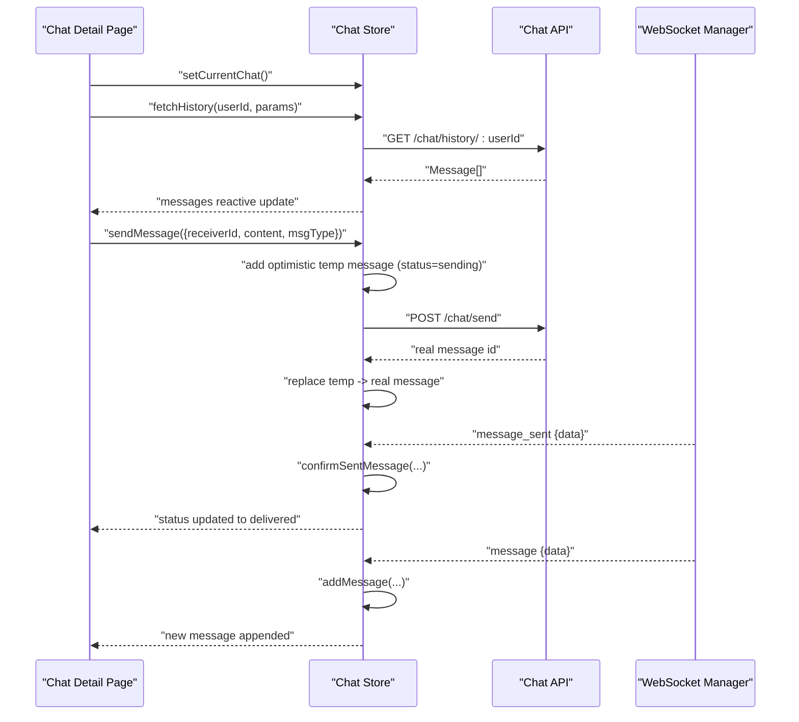

**Diagram sources**
- [detail.vue:77-148](file://src/pages/chat/detail.vue#L77-L148)
- [chat.ts:27-90](file://src/stores/chat.ts#L27-L90)
- [chat.ts:100-210](file://src/stores/chat.ts#L100-L210)
- [chat.ts:19-26](file://src/api/modules/chat.ts#L19-L26)
- [websocket.ts:93-111](file://src/utils/websocket.ts#L93-L111)

## Detailed Component Analysis

### Chat Store: State and Actions
The store defines:
- Reactive state: conversations, currentChat, messages, unreadCount.
- Actions:
  - fetchConversations: loads conversation list and unread counts.
  - fetchHistory: loads paginated message history and marks self-sent flags.
  - sendMessage: optimistic update with temporary message, then replaces with server response.
  - markAsRead: marks a conversation’s unread count to zero.
  - addMessage: handles incoming WebSocket messages, deduplicates, updates current chat visibility, and increments unread counts for other chats.
  - confirmSentMessage: replaces optimistic “sending” messages with server-confirmed messages.
  - setCurrentChat/clearMessages: lifecycle helpers.

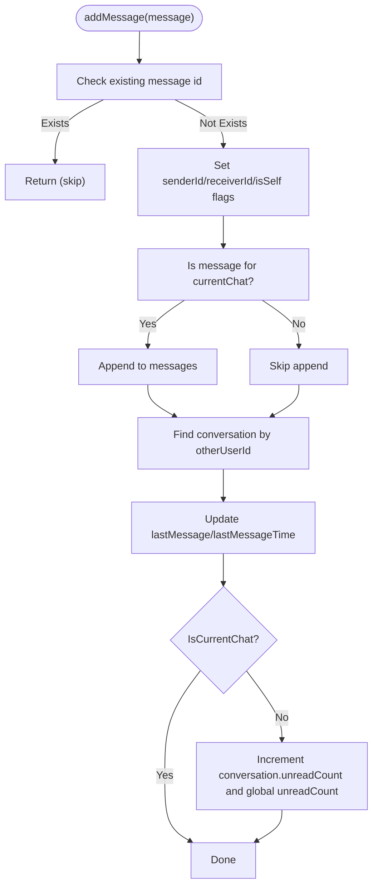

**Diagram sources**
- [chat.ts:100-158](file://src/stores/chat.ts#L100-L158)

**Section sources**
- [chat.ts:8-234](file://src/stores/chat.ts#L8-L234)

### Message Lifecycle: From Send to Delivery Confirmation
Optimistic UI update pattern:
- UI calls sendMessage with receiverId, content, and optional msgType.
- Store creates a temporary message with status “sending” and pushes it immediately.
- Store sends POST /chat/send to backend.
- On success, store replaces the temporary message with the server-provided record.
- On failure, store sets the temporary message status to “failed”.
- WebSocket message_sent confirms delivery; store replaces “sending” with the confirmed message and updates conversation metadata.

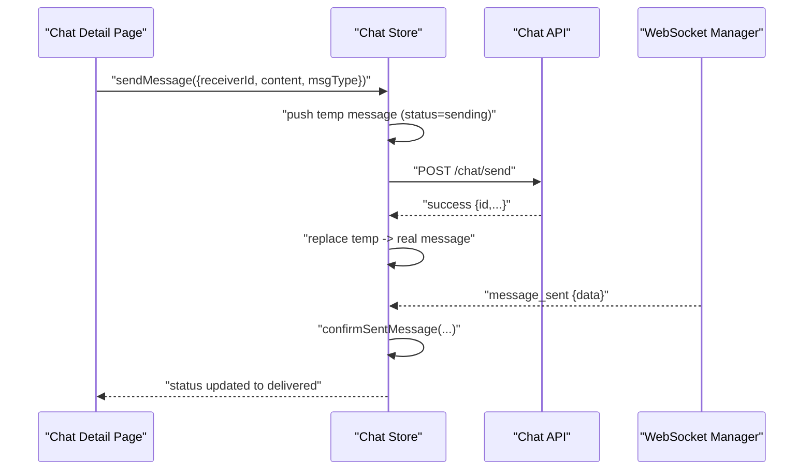

**Diagram sources**
- [chat.ts:50-90](file://src/stores/chat.ts#L50-L90)
- [chat.ts:161-210](file://src/stores/chat.ts#L161-L210)
- [chat.ts:19-20](file://src/api/modules/chat.ts#L19-L20)
- [websocket.ts:93-111](file://src/utils/websocket.ts#L93-L111)

**Section sources**
- [chat.ts:50-90](file://src/stores/chat.ts#L50-L90)
- [chat.ts:161-210](file://src/stores/chat.ts#L161-L210)
- [chat.ts:19-20](file://src/api/modules/chat.ts#L19-L20)
- [websocket.ts:93-111](file://src/utils/websocket.ts#L93-L111)

### API Integration Patterns
- sendMessage: POST /chat/send with typed SendMessageDto.
- getHistory: GET /chat/history/:userId with pagination params.
- getConversations: GET /chat/conversations returning data and unreadCount.
- getMessages: GET /chat/messages for global messages (if used).
- markAsRead: PUT /chat/read/:userId to reset unread count.

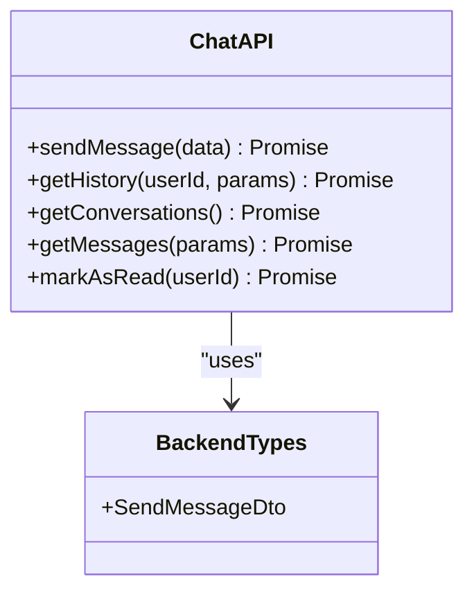

**Diagram sources**
- [chat.ts:18-41](file://src/api/modules/chat.ts#L18-L41)
- [backend-types.ts:538-547](file://src/types/api/backend-types.ts#L538-L547)

**Section sources**
- [chat.ts:1-42](file://src/api/modules/chat.ts#L1-L42)
- [backend-types.ts:538-547](file://src/types/api/backend-types.ts#L538-L547)

### Reactive UI Updates and State Persistence
- Chat list page subscribes to conversations and renders skeletons/loading states, badges, and timestamps.
- Chat detail page subscribes to messages and scrolls to bottom after updates.
- MessageBubble renders message content, sender avatar, and status indicators (sending, failed).
- Auth store persists credentials and user info; WebSocket manager requires a token from auth store.

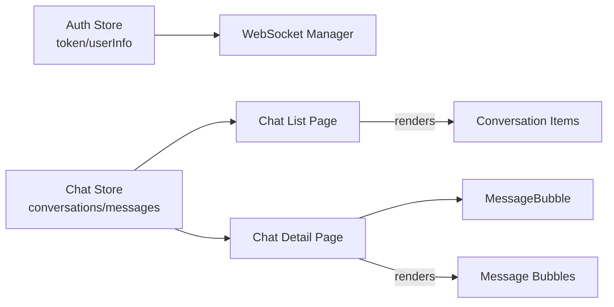

**Diagram sources**
- [auth.ts:1-137](file://src/stores/auth.ts#L1-L137)
- [websocket.ts:23-32](file://src/utils/websocket.ts#L23-L32)
- [list.vue:59-98](file://src/pages/chat/list.vue#L59-L98)
- [detail.vue:50-172](file://src/pages/chat/detail.vue#L50-L172)
- [MessageBubble.vue:68-115](file://src/components/business/MessageBubble.vue#L68-L115)

**Section sources**
- [list.vue:1-311](file://src/pages/chat/list.vue#L1-L311)
- [detail.vue:1-299](file://src/pages/chat/detail.vue#L1-L299)
- [MessageBubble.vue:1-309](file://src/components/business/MessageBubble.vue#L1-L309)
- [auth.ts:1-137](file://src/stores/auth.ts#L1-L137)
- [websocket.ts:1-171](file://src/utils/websocket.ts#L1-L171)

### State Mutations and Concurrency
- Optimistic updates: immediate UI feedback during send.
- Deduplication: prevents duplicate messages from WebSocket or retries.
- Multi-device synchronization: confirmSentMessage handles replacing optimistic messages even when another device confirms first.
- Current chat boundary: only messages matching currentChat participants are appended to the visible list; others update unread counters.

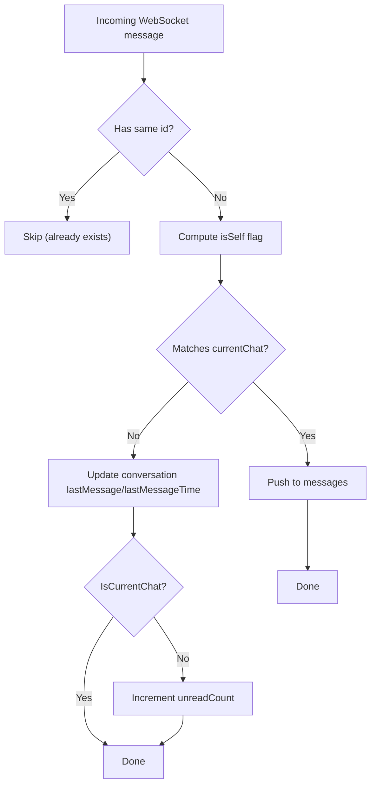

**Diagram sources**
- [chat.ts:100-158](file://src/stores/chat.ts#L100-L158)

**Section sources**
- [chat.ts:100-158](file://src/stores/chat.ts#L100-L158)

### Offline Message Queuing and Retry
- Sending failures: temporary message remains with status “failed”; UI enables retry.
- Retry action: re-invokes sendMessage with the same content and receiver.
- Network checks: detail page composable validates network state before sending.

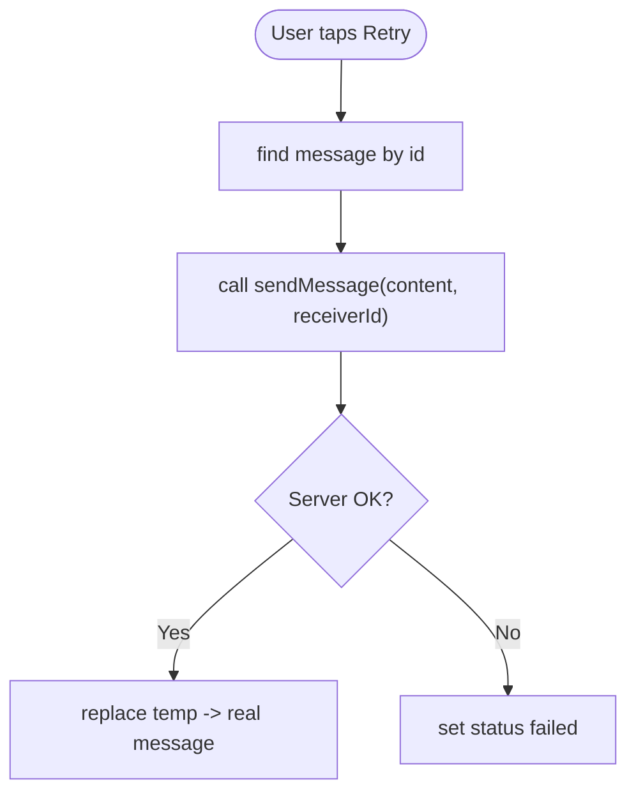

**Diagram sources**
- [detail.vue:150-163](file://src/pages/chat/detail.vue#L150-L163)
- [chat.ts:50-90](file://src/stores/chat.ts#L50-L90)

**Section sources**
- [detail.vue:150-163](file://src/pages/chat/detail.vue#L150-L163)
- [chat.ts:50-90](file://src/stores/chat.ts#L50-L90)

### State Synchronization Across Devices
- WebSocket message_sent events replace optimistic messages with server-confirmed ones.
- WebSocket message events update conversation metadata even when not in current chat, keeping lists accurate.
- Heartbeat and reconnection ensure continuity.

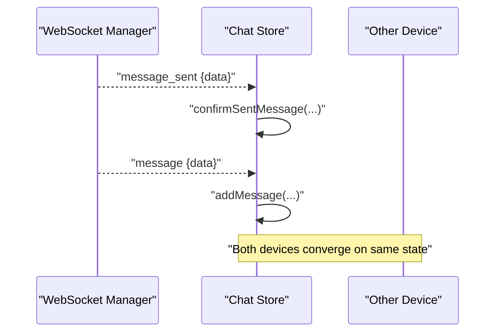

**Diagram sources**
- [websocket.ts:93-111](file://src/utils/websocket.ts#L93-L111)
- [chat.ts:161-210](file://src/stores/chat.ts#L161-L210)
- [chat.ts:100-158](file://src/stores/chat.ts#L100-L158)

**Section sources**
- [websocket.ts:93-111](file://src/utils/websocket.ts#L93-L111)
- [chat.ts:161-210](file://src/stores/chat.ts#L161-L210)
- [chat.ts:100-158](file://src/stores/chat.ts#L100-L158)

## Dependency Analysis
- UI depends on Pinia stores for reactive state.
- Chat store depends on:
  - Auth store for user identity and token retrieval.
  - Chat API for HTTP endpoints.
  - WebSocket manager for real-time updates.
- Types define Message, Conversation, and MsgType consistently across store, API, and components.

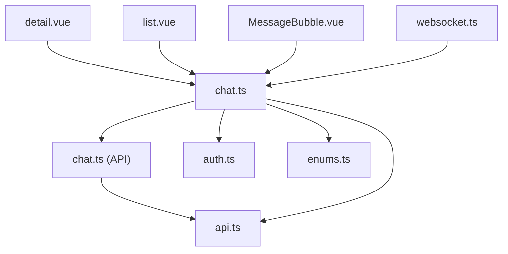

**Diagram sources**
- [detail.vue:50-172](file://src/pages/chat/detail.vue#L50-L172)
- [list.vue:59-98](file://src/pages/chat/list.vue#L59-L98)
- [MessageBubble.vue:68-115](file://src/components/business/MessageBubble.vue#L68-L115)
- [chat.ts:1-234](file://src/stores/chat.ts#L1-L234)
- [chat.ts:1-42](file://src/api/modules/chat.ts#L1-L42)
- [auth.ts:1-137](file://src/stores/auth.ts#L1-L137)
- [websocket.ts:1-171](file://src/utils/websocket.ts#L1-L171)
- [api.ts:26-43](file://src/types/api.ts#L26-L43)
- [enums.ts:7-11](file://src/types/enums.ts#L7-L11)

**Section sources**
- [detail.vue:50-172](file://src/pages/chat/detail.vue#L50-L172)
- [list.vue:59-98](file://src/pages/chat/list.vue#L59-L98)
- [MessageBubble.vue:68-115](file://src/components/business/MessageBubble.vue#L68-L115)
- [chat.ts:1-234](file://src/stores/chat.ts#L1-L234)
- [chat.ts:1-42](file://src/api/modules/chat.ts#L1-L42)
- [auth.ts:1-137](file://src/stores/auth.ts#L1-L137)
- [websocket.ts:1-171](file://src/utils/websocket.ts#L1-L171)
- [api.ts:26-43](file://src/types/api.ts#L26-L43)
- [enums.ts:7-11](file://src/types/enums.ts#L7-L11)

## Performance Considerations
- Virtual scrolling: Consider virtualizing long message lists to reduce DOM nodes.
- Debounced send: Use debounced button to avoid rapid repeated sends.
- Efficient deduplication: Keep message id lookup O(n) with Set for very large lists if needed.
- Minimal reactivity: Prefer shallow refs for large arrays and deep mutations only when necessary.
- Network-aware actions: Gate send operations based on connectivity to reduce failed optimistic updates.

## Troubleshooting Guide
Common issues and resolutions:
- No WebSocket connection:
  - Verify token availability in auth store/local storage.
  - Check wsURL and path configuration.
  - Inspect reconnection attempts and heartbeat logs.
- Duplicate messages:
  - Ensure message id deduplication logic runs before appending.
- Read receipts not clearing:
  - Confirm markAsRead is called after initial load and that conversation ids match.
- Status not updating:
  - Verify message_sent events arrive and confirmSentMessage executes.
- UI not reflecting changes:
  - Ensure reactive refs are accessed in templates and watchers trigger updates.

**Section sources**
- [websocket.ts:15-53](file://src/utils/websocket.ts#L15-L53)
- [chat.ts:100-158](file://src/stores/chat.ts#L100-L158)
- [chat.ts:92-98](file://src/stores/chat.ts#L92-L98)
- [detail.vue:116-129](file://src/pages/chat/detail.vue#L116-L129)

## Conclusion
The chat state management leverages Pinia for centralized reactive state, a typed API layer for backend integration, and a robust WebSocket manager for real-time updates. Optimistic updates, deduplication, and multi-device synchronization provide a responsive and reliable chat experience. The modular design allows for scalable enhancements such as virtualized lists, advanced retry policies, and enhanced offline support.

## Appendices

### Data Models
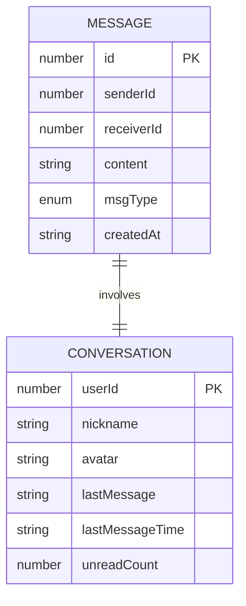

**Diagram sources**
- [api.ts:26-43](file://src/types/api.ts#L26-L43)
- [enums.ts:7-11](file://src/types/enums.ts#L7-L11)