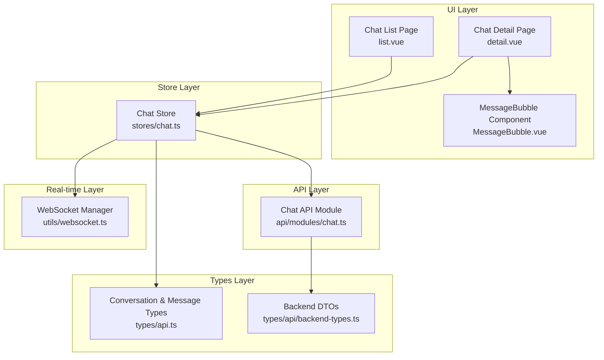
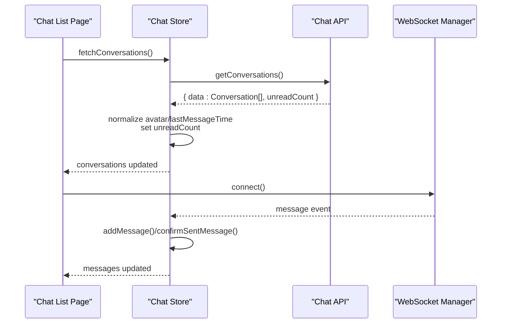
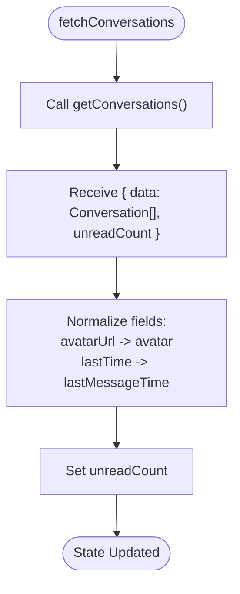
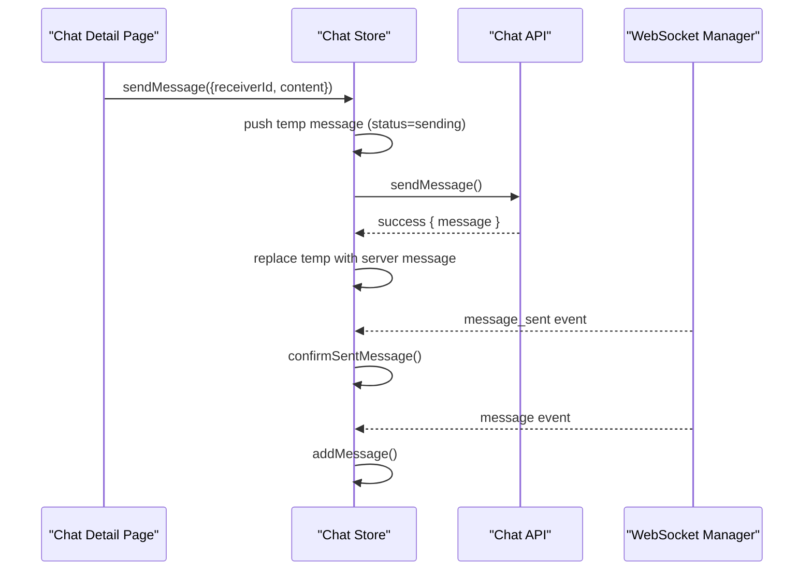
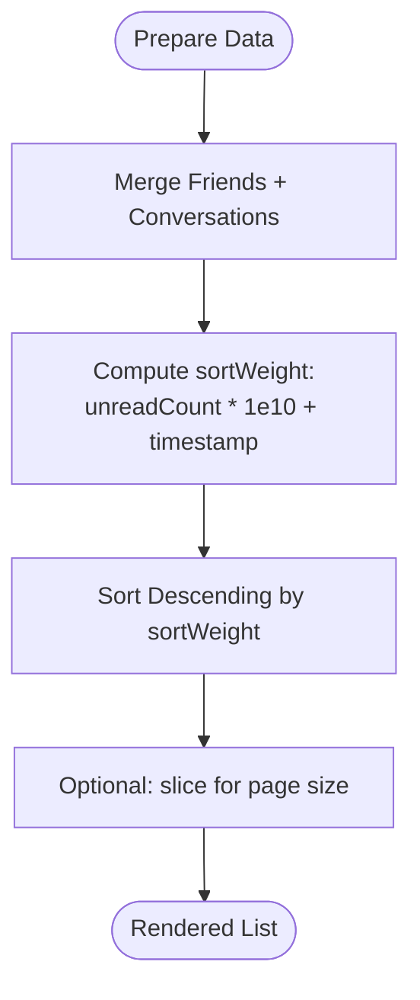
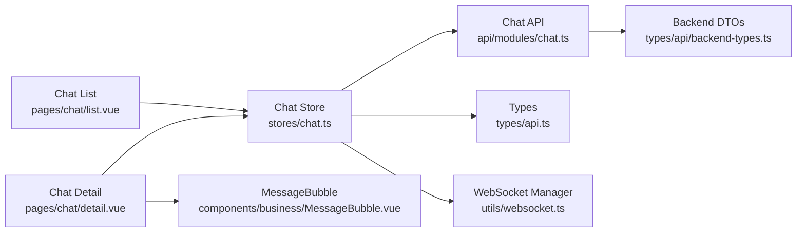

# Conversation Management

<cite>
**Referenced Files in This Document**
- [chat.ts](file://src/stores/chat.ts)
- [chat.ts](file://src/api/modules/chat.ts)
- [backend-types.ts](file://src/types/api/backend-types.ts)
- [api.ts](file://src/types/api.ts)
- [websocket.ts](file://src/utils/websocket.ts)
- [list.vue](file://src/pages/chat/list.vue)
- [detail.vue](file://src/pages/chat/detail.vue)
- [MessageBubble.vue](file://src/components/business/MessageBubble.vue)
- [message.vue](file://src/pages/tabbar/message.vue)
</cite>

## Table of Contents
1. [Introduction](#introduction)
2. [Project Structure](#project-structure)
3. [Core Components](#core-components)
4. [Architecture Overview](#architecture-overview)
5. [Detailed Component Analysis](#detailed-component-analysis)
6. [Dependency Analysis](#dependency-analysis)
7. [Performance Considerations](#performance-considerations)
8. [Troubleshooting Guide](#troubleshooting-guide)
9. [Conclusion](#conclusion)

## Introduction
This document explains the conversation management system in the chat module. It covers the conversation data model, state initialization and updates, mapping of backend responses to frontend structures, real-time synchronization via WebSocket, optimistic UI updates during messaging, and practical strategies for filtering, sorting, and pagination. It also outlines persistence and offline handling patterns to maintain a smooth user experience.

## Project Structure
The conversation management spans several layers:
- Store layer: centralized state for conversations, current chat, messages, and unread counts
- API layer: typed chat endpoints for fetching conversations, history, sending messages, and marking as read
- Types layer: shared interfaces for Conversation and Message
- Real-time layer: WebSocket manager for live message delivery and acknowledgments
- UI layer: list and detail pages, plus message bubbles for rendering

**Diagram sources**
- [list.vue:1-311](file://src/pages/chat/list.vue#L1-L311)
- [detail.vue:1-299](file://src/pages/chat/detail.vue#L1-L299)
- [MessageBubble.vue:1-309](file://src/components/business/MessageBubble.vue#L1-L309)
- [chat.ts:1-234](file://src/stores/chat.ts#L1-L234)
- [chat.ts:1-46](file://src/api/modules/chat.ts#L1-L46)
- [api.ts:26-43](file://src/types/api.ts#L26-L43)
- [backend-types.ts:538-547](file://src/types/api/backend-types.ts#L538-L547)
- [websocket.ts:1-171](file://src/utils/websocket.ts#L1-L171)

**Section sources**
- [chat.ts:1-234](file://src/stores/chat.ts#L1-L234)
- [chat.ts:1-46](file://src/api/modules/chat.ts#L1-L46)
- [api.ts:26-43](file://src/types/api.ts#L26-L43)
- [backend-types.ts:538-547](file://src/types/api/backend-types.ts#L538-L547)
- [websocket.ts:1-171](file://src/utils/websocket.ts#L1-L171)
- [list.vue:1-311](file://src/pages/chat/list.vue#L1-L311)
- [detail.vue:1-299](file://src/pages/chat/detail.vue#L1-L299)
- [MessageBubble.vue:1-309](file://src/components/business/MessageBubble.vue#L1-L309)

## Core Components
- Conversation data structure
  - Fields: userId, nickname, avatar, lastMessage, lastMessageTime, unreadCount
  - Purpose: represent a chat thread with metadata for UI rendering and sorting
- Message data structure
  - Fields: id, senderId, receiverId, content, msgType, createdAt, sender (optional)
  - Purpose: represent individual chat messages with sender association
- Store state
  - conversations: array of Conversation
  - currentChat: Conversation|null
  - messages: array of Message
  - unreadCount: number
- API endpoints
  - getConversations(): returns { data: Conversation[], unreadCount }
  - getHistory(userId, params): returns { data: Message[], total }
  - sendMessage(data): posts to /chat/send
  - markAsRead(userId): PUT /chat/read/{userId}
  - getMessages(params): GET /chat/messages?friendId=...&page=...&limit=...
- WebSocket events
  - message: incoming message payload
  - message_sent: server acknowledgment for sent message
  - ping/pong: heartbeat

**Section sources**
- [api.ts:36-43](file://src/types/api.ts#L36-L43)
- [api.ts:26-34](file://src/types/api.ts#L26-L34)
- [chat.ts:9-12](file://src/stores/chat.ts#L9-L12)
- [chat.ts:18-45](file://src/api/modules/chat.ts#L18-L45)
- [websocket.ts:93-111](file://src/utils/websocket.ts#L93-L111)

## Architecture Overview
The system follows a unidirectional data flow:
- UI triggers actions (load conversations, load history, send message)
- Store orchestrates API calls and updates local state
- WebSocket receives real-time events and updates state accordingly
- UI reacts to reactive state changes

**Diagram sources**
- [list.vue:78-91](file://src/pages/chat/list.vue#L78-L91)
- [chat.ts:14-25](file://src/stores/chat.ts#L14-L25)
- [chat.ts:28-31](file://src/api/modules/chat.ts#L28-L31)
- [websocket.ts:93-111](file://src/utils/websocket.ts#L93-L111)

## Detailed Component Analysis

### Conversation Data Model and State Initialization
- Conversation fields
  - userId: identifies the chat partner
  - nickname: display name
  - avatar/avatarUrl: normalized to avatar for UI compatibility
  - lastMessage/lastMessageTime: latest message content and timestamp
  - unreadCount: number of unread messages
- State initialization
  - conversations: empty array
  - currentChat: null
  - messages: empty array
  - unreadCount: 0
- Backend-to-frontend mapping
  - avatarUrl -> avatar and avatarUrl
  - lastTime -> lastMessageTime and lastTime

**Diagram sources**
- [chat.ts:14-25](file://src/stores/chat.ts#L14-L25)
- [chat.ts:28-31](file://src/api/modules/chat.ts#L28-L31)

**Section sources**
- [api.ts:36-43](file://src/types/api.ts#L36-L43)
- [chat.ts:9-12](file://src/stores/chat.ts#L9-L12)
- [chat.ts:17-24](file://src/stores/chat.ts#L17-L24)

### Fetch Conversations and Mapping
- Implementation highlights
  - Calls getConversations()
  - Maps backend fields to frontend-friendly keys
  - Sets global unreadCount
- Frontend compatibility
  - Ensures avatar and lastMessageTime are present regardless of backend field names

**Section sources**
- [chat.ts:14-25](file://src/stores/chat.ts#L14-L25)
- [chat.ts:28-31](file://src/api/modules/chat.ts#L28-L31)

### Message History Loading and Normalization
- fetchHistory(userId, params)
  - Loads paginated message history
  - Normalizes senderId/receiverId to numbers (handling bigint strings)
  - Adds isSelf flag based on current user
- UI integration
  - Called from chat detail page with page and pageSize parameters

**Section sources**
- [chat.ts:27-48](file://src/stores/chat.ts#L27-L48)
- [detail.vue:116-129](file://src/pages/chat/detail.vue#L116-L129)

### Optimistic Messaging and Real-time Updates
- sendMessage(data)
  - Generates a temporary message with status "sending"
  - Immediately pushes to messages for instant feedback
  - On success, replaces temp message with server response
  - On failure, marks message as failed
- WebSocket handling
  - addMessage(message): deduplicates, sets isSelf, appends to current chat, updates conversation lastMessage/lastMessageTime, increments unreadCount if not current chat
  - confirmSentMessage(message): replaces pending "sending" message with server-confirmed message; also updates conversation lastMessage/lastMessageTime

**Diagram sources**
- [chat.ts:50-90](file://src/stores/chat.ts#L50-L90)
- [chat.ts:100-158](file://src/stores/chat.ts#L100-L158)
- [chat.ts:161-210](file://src/stores/chat.ts#L161-L210)
- [websocket.ts:93-111](file://src/utils/websocket.ts#L93-L111)

**Section sources**
- [chat.ts:50-90](file://src/stores/chat.ts#L50-L90)
- [chat.ts:100-158](file://src/stores/chat.ts#L100-L158)
- [chat.ts:161-210](file://src/stores/chat.ts#L161-L210)
- [websocket.ts:93-111](file://src/utils/websocket.ts#L93-L111)

### Mark as Read and Unread Count Management
- markAsRead(userId)
  - Calls backend to mark as read
  - Resets unreadCount for the target conversation
- Global unread count
  - Maintained in store unreadCount
  - Incremented when receiving messages in non-current chats

**Section sources**
- [chat.ts:92-98](file://src/stores/chat.ts#L92-L98)
- [chat.ts:146-157](file://src/stores/chat.ts#L146-L157)

### UI Rendering and User Experience
- Chat list
  - Renders conversations with avatar, nickname, last message, last message time, and unread badges
  - Uses skeleton loaders while loading
- Chat detail
  - Displays messages via MessageBubble
  - Auto-scrolls to bottom on new messages
  - Shows sending status and retry on failure
- MessageBubble
  - Renders self vs other messages with distinct styles
  - Displays status indicators for sending/failed states

**Section sources**
- [list.vue:1-311](file://src/pages/chat/list.vue#L1-L311)
- [detail.vue:1-299](file://src/pages/chat/detail.vue#L1-L299)
- [MessageBubble.vue:1-309](file://src/components/business/MessageBubble.vue#L1-L309)

### Filtering, Sorting, and Pagination Strategies
- Filtering
  - Use conversation.userId to filter by chat partner
- Sorting
  - Sort by unreadCount descending, then by lastMessageTime descending
  - Example approach: compute a sortWeight combining unreadCount and timestamp
- Pagination
  - getHistory supports page and pageSize parameters
  - getMessages supports friendId, page, limit for per-friend message lists
  - Infinite scrolling can be implemented by incrementing page on reach end

**Diagram sources**
- [message.vue:66-87](file://src/pages/tabbar/message.vue#L66-L87)
- [chat.ts:12-16](file://src/api/modules/chat.ts#L12-L16)

**Section sources**
- [message.vue:66-87](file://src/pages/tabbar/message.vue#L66-L87)
- [chat.ts:12-16](file://src/api/modules/chat.ts#L12-L16)

### Persistence, Offline Handling, and State Restoration
- Local persistence
  - Keep conversations, messages, and unreadCount in Pinia store for fast UI updates
- Offline handling
  - sendMessage uses optimistic updates; failed sends set status to failed for retry
  - UI shows retry affordance on failed messages
- State restoration
  - On page mount, load conversations and messages as needed
  - Clear messages on detail page unmount to avoid stale data
  - Maintain currentChat context per session

**Section sources**
- [chat.ts:50-90](file://src/stores/chat.ts#L50-L90)
- [chat.ts:216-218](file://src/stores/chat.ts#L216-L218)
- [detail.vue:104-108](file://src/pages/chat/detail.vue#L104-L108)

## Dependency Analysis

**Diagram sources**
- [chat.ts:1-234](file://src/stores/chat.ts#L1-L234)
- [chat.ts:1-46](file://src/api/modules/chat.ts#L1-L46)
- [api.ts:1-83](file://src/types/api.ts#L1-L83)
- [backend-types.ts:538-547](file://src/types/api/backend-types.ts#L538-L547)
- [websocket.ts:1-171](file://src/utils/websocket.ts#L1-L171)
- [list.vue:1-311](file://src/pages/chat/list.vue#L1-L311)
- [detail.vue:1-299](file://src/pages/chat/detail.vue#L1-L299)
- [MessageBubble.vue:1-309](file://src/components/business/MessageBubble.vue#L1-L309)

**Section sources**
- [chat.ts:1-234](file://src/stores/chat.ts#L1-L234)
- [chat.ts:1-46](file://src/api/modules/chat.ts#L1-L46)
- [api.ts:1-83](file://src/types/api.ts#L1-L83)
- [backend-types.ts:538-547](file://src/types/api/backend-types.ts#L538-L547)
- [websocket.ts:1-171](file://src/utils/websocket.ts#L1-L171)
- [list.vue:1-311](file://src/pages/chat/list.vue#L1-L311)
- [detail.vue:1-299](file://src/pages/chat/detail.vue#L1-L299)
- [MessageBubble.vue:1-309](file://src/components/business/MessageBubble.vue#L1-L309)

## Performance Considerations
- Minimize reactivity churn
  - Batch updates for unreadCount and conversation fields
- Efficient rendering
  - Virtualize long message lists
  - Use shallow refs for large arrays when appropriate
- Network efficiency
  - Use pagination (page/pageSize) for history and messages
  - Debounce frequent UI actions (e.g., send button)
- Real-time efficiency
  - Deduplicate messages by id
  - Avoid unnecessary re-computation of sort weights

## Troubleshooting Guide
- Messages not appearing
  - Verify WebSocket is connected and receiving events
  - Check addMessage deduplication logic and currentChat context
- Sending fails
  - Inspect status transitions: "sending" -> "failed"
  - Confirm network connectivity and retry action
- Unread counts incorrect
  - Ensure markAsRead is called after viewing a chat
  - Verify unreadCount increments only for non-current chats
- Field mismatches
  - Confirm avatarUrl/lastTime normalization in fetchConversations
  - Validate numeric conversion for senderId/receiverId in history and WebSocket handlers

**Section sources**
- [websocket.ts:55-91](file://src/utils/websocket.ts#L55-L91)
- [chat.ts:100-158](file://src/stores/chat.ts#L100-L158)
- [chat.ts:50-90](file://src/stores/chat.ts#L50-L90)
- [chat.ts:92-98](file://src/stores/chat.ts#L92-L98)
- [chat.ts:17-24](file://src/stores/chat.ts#L17-L24)

## Conclusion
The conversation management system combines a robust store layer, typed API contracts, and real-time WebSocket updates to deliver a responsive chat experience. By normalizing backend responses, implementing optimistic UI updates, and managing unread counts effectively, the system ensures consistent state across sessions and network conditions. Applying the recommended filtering, sorting, and pagination strategies further enhances usability and performance.