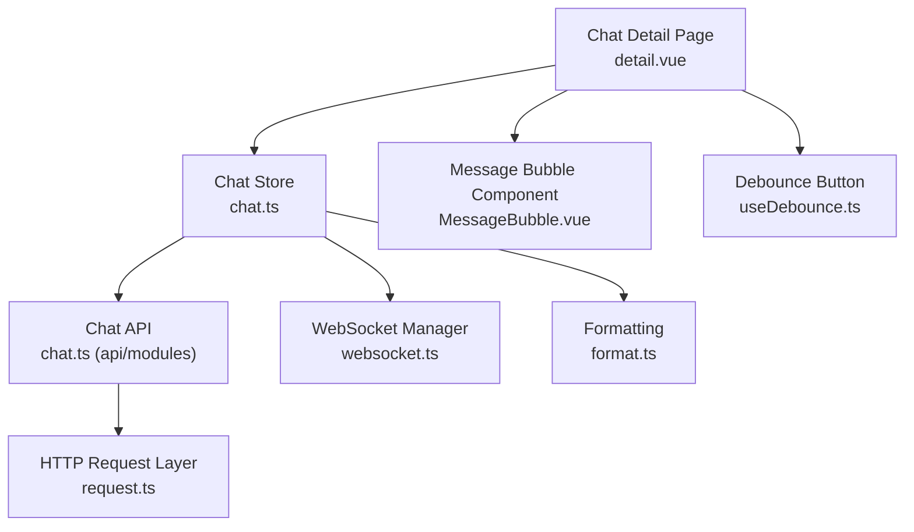
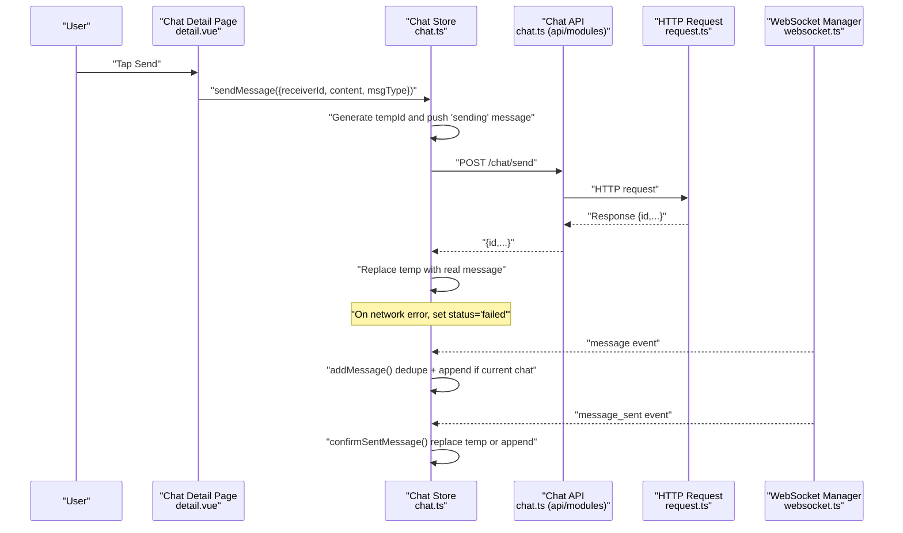
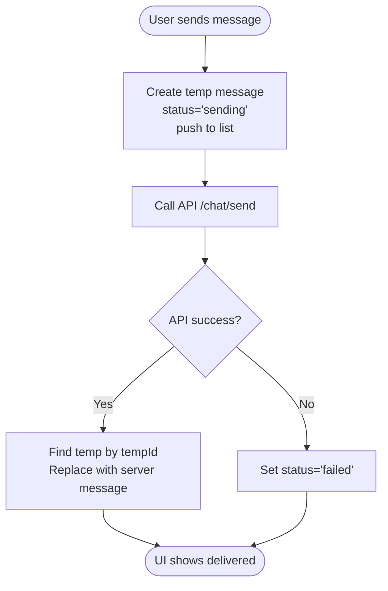
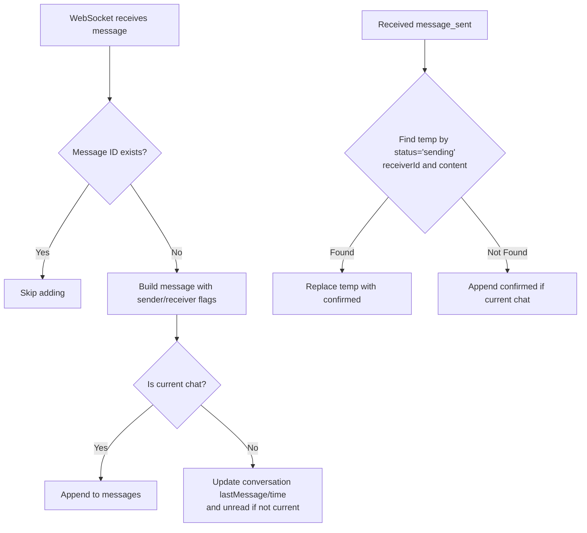
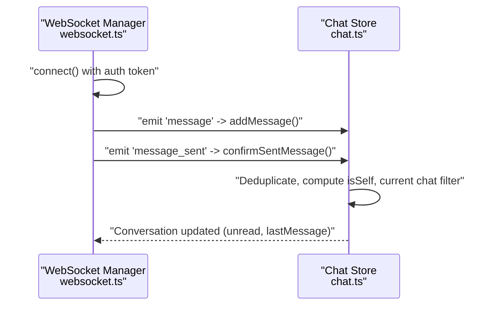
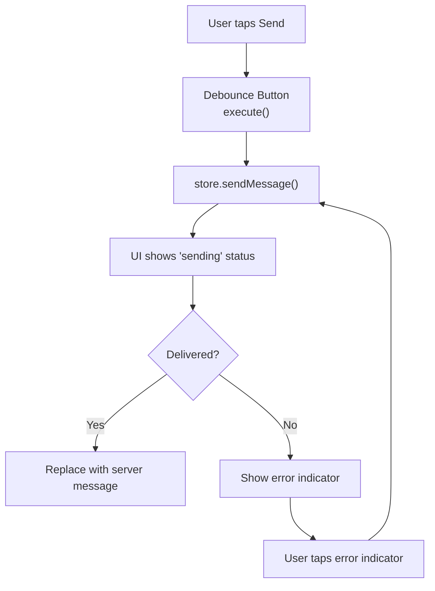
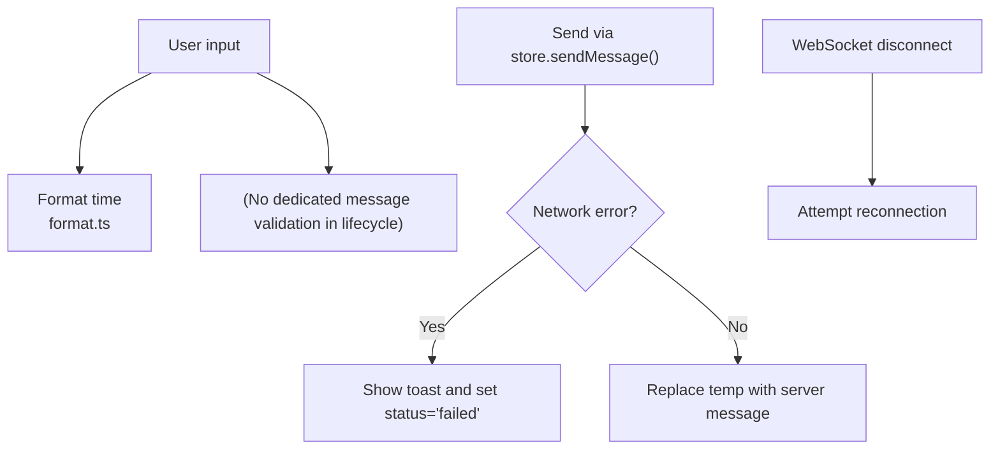
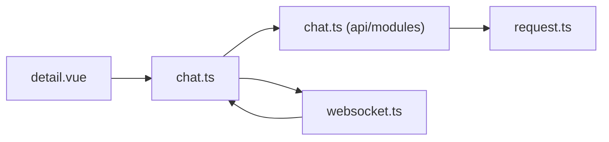

# Message Lifecycle

<cite>
**Referenced Files in This Document**
- [chat.ts](file://src/stores/chat.ts)
- [chat.ts](file://src/api/modules/chat.ts)
- [backend-types.ts](file://src/types/api/backend-types.ts)
- [enums.ts](file://src/types/enums.ts)
- [websocket.ts](file://src/utils/websocket.ts)
- [detail.vue](file://src/pages/chat/detail.vue)
- [MessageBubble.vue](file://src/components/business/MessageBubble.vue)
- [request.ts](file://src/api/request.ts)
- [useDebounce.ts](file://src/composables/useDebounce.ts)
- [format.ts](file://src/utils/format.ts)
</cite>

## Table of Contents
1. [Introduction](#introduction)
2. [Project Structure](#project-structure)
3. [Core Components](#core-components)
4. [Architecture Overview](#architecture-overview)
5. [Detailed Component Analysis](#detailed-component-analysis)
6. [Dependency Analysis](#dependency-analysis)
7. [Performance Considerations](#performance-considerations)
8. [Troubleshooting Guide](#troubleshooting-guide)
9. [Conclusion](#conclusion)

## Introduction
This document explains the complete message lifecycle from creation to delivery in the chat system. It covers the optimistic update pattern used during send, message state transitions, deduplication and conflict resolution, WebSocket integration for real-time reception, and the addMessage function implementation. It also includes examples of message formatting, content validation, and error handling across the lifecycle.

## Project Structure
The message lifecycle spans several layers:
- UI page and component for composing and displaying messages
- Store for managing conversations, messages, and lifecycle actions
- API module for backend communication
- WebSocket manager for real-time updates
- Utilities for formatting and validation

**Diagram sources**
- [detail.vue:1-299](file://src/pages/chat/detail.vue#L1-L299)
- [chat.ts:1-234](file://src/stores/chat.ts#L1-L234)
- [chat.ts:18-45](file://src/api/modules/chat.ts#L18-L45)
- [websocket.ts:1-170](file://src/utils/websocket.ts#L1-L170)
- [MessageBubble.vue:1-309](file://src/components/business/MessageBubble.vue#L1-L309)
- [format.ts:1-38](file://src/utils/format.ts#L1-L38)
- [useDebounce.ts:1-153](file://src/composables/useDebounce.ts#L1-L153)
- [request.ts:1-228](file://src/api/request.ts#L1-L228)

**Section sources**
- [chat.ts:1-234](file://src/stores/chat.ts#L1-L234)
- [chat.ts:18-45](file://src/api/modules/chat.ts#L18-L45)
- [websocket.ts:1-170](file://src/utils/websocket.ts#L1-L170)
- [detail.vue:1-299](file://src/pages/chat/detail.vue#L1-L299)
- [MessageBubble.vue:1-309](file://src/components/business/MessageBubble.vue#L1-L309)
- [format.ts:1-38](file://src/utils/format.ts#L1-L38)
- [useDebounce.ts:1-153](file://src/composables/useDebounce.ts#L1-L153)
- [request.ts:1-228](file://src/api/request.ts#L1-L228)

## Core Components
- Chat Store: Manages conversations, current chat, messages, and lifecycle actions (send, receive, confirm).
- Chat API: Encapsulates HTTP endpoints for sending messages, fetching history, conversations, and marking as read.
- WebSocket Manager: Handles connection, reconnection, heartbeats, and dispatching incoming events to the store.
- UI Page and Component: Provide input, optimistic rendering, retry UX, and status indicators.
- Utilities: Formatting helpers and debounce composables for UX and reliability.

Key responsibilities:
- Optimistic update on send with temporary IDs and immediate UI feedback
- Real-time message reception via WebSocket with deduplication
- Confirmation of sent messages replacing temporary entries
- Conflict resolution for multi-device scenarios
- Error handling and user feedback

**Section sources**
- [chat.ts:50-90](file://src/stores/chat.ts#L50-L90)
- [chat.ts:100-158](file://src/stores/chat.ts#L100-L158)
- [chat.ts:161-210](file://src/stores/chat.ts#L161-L210)
- [chat.ts:18-45](file://src/api/modules/chat.ts#L18-L45)
- [websocket.ts:93-111](file://src/utils/websocket.ts#L93-L111)
- [detail.vue:131-148](file://src/pages/chat/detail.vue#L131-L148)
- [MessageBubble.vue:29-39](file://src/components/business/MessageBubble.vue#L29-L39)

## Architecture Overview
The lifecycle integrates UI, store, API, and WebSocket:

**Diagram sources**
- [detail.vue:131-148](file://src/pages/chat/detail.vue#L131-L148)
- [chat.ts:50-90](file://src/stores/chat.ts#L50-L90)
- [chat.ts:100-158](file://src/stores/chat.ts#L100-L158)
- [chat.ts:161-210](file://src/stores/chat.ts#L161-L210)
- [chat.ts:18-45](file://src/api/modules/chat.ts#L18-L45)
- [request.ts:75-208](file://src/api/request.ts#L75-L208)
- [websocket.ts:93-111](file://src/utils/websocket.ts#L93-L111)

## Detailed Component Analysis

### Optimistic Update Pattern and State Transitions
- Creation: A temporary message with a unique tempId is pushed immediately with status "sending".
- Delivery: On successful backend send, the temporary message is replaced with the server-provided message object.
- Failure: On error, the temporary message status is set to "failed", enabling user retry.

**Diagram sources**
- [chat.ts:50-90](file://src/stores/chat.ts#L50-L90)

**Section sources**
- [chat.ts:50-90](file://src/stores/chat.ts#L50-L90)
- [MessageBubble.vue:29-39](file://src/components/business/MessageBubble.vue#L29-L39)

### Message Deduplication and Conflict Resolution
- Incoming messages: The store checks if a message with the same ID already exists before adding.
- Sent confirmations: If a "message_sent" event arrives, the store finds a matching "sending" message by receiverId and content, replaces it, and avoids duplicates.
- Multi-device sync: If no temporary message matches, the confirmed message is appended only if it belongs to the current chat.

**Diagram sources**
- [chat.ts:100-158](file://src/stores/chat.ts#L100-L158)
- [chat.ts:161-210](file://src/stores/chat.ts#L161-L210)
- [websocket.ts:93-111](file://src/utils/websocket.ts#L93-L111)

**Section sources**
- [chat.ts:100-158](file://src/stores/chat.ts#L100-L158)
- [chat.ts:161-210](file://src/stores/chat.ts#L161-L210)
- [websocket.ts:93-111](file://src/utils/websocket.ts#L93-L111)

### WebSocket Integration and addMessage Implementation
- Connection: The manager connects with Socket.IO, authenticates with a token, and starts a heartbeat.
- Event routing: Incoming events are dispatched to either addMessage (for received messages) or confirmSentMessage (for sent confirmations).
- addMessage: Applies deduplication, sets isSelf flag, appends only for current chat, and updates conversation metadata.

**Diagram sources**
- [websocket.ts:15-53](file://src/utils/websocket.ts#L15-L53)
- [websocket.ts:93-111](file://src/utils/websocket.ts#L93-L111)
- [chat.ts:100-158](file://src/stores/chat.ts#L100-L158)
- [chat.ts:161-210](file://src/stores/chat.ts#L161-L210)

**Section sources**
- [websocket.ts:15-53](file://src/utils/websocket.ts#L15-L53)
- [websocket.ts:93-111](file://src/utils/websocket.ts#L93-L111)
- [chat.ts:100-158](file://src/stores/chat.ts#L100-L158)
- [chat.ts:161-210](file://src/stores/chat.ts#L161-L210)

### UI Feedback, Retry, and Status Indicators
- The page uses a debounced send action to prevent rapid submissions.
- The message bubble displays:
  - Sending indicator for outgoing "sending" messages
  - Error indicator with retry tap for "failed" messages
- Auto-scroll ensures new messages are visible.

**Diagram sources**
- [detail.vue:131-148](file://src/pages/chat/detail.vue#L131-L148)
- [MessageBubble.vue:29-39](file://src/components/business/MessageBubble.vue#L29-L39)
- [useDebounce.ts:26-44](file://src/composables/useDebounce.ts#L26-L44)

**Section sources**
- [detail.vue:131-148](file://src/pages/chat/detail.vue#L131-L148)
- [MessageBubble.vue:29-39](file://src/components/business/MessageBubble.vue#L29-L39)
- [useDebounce.ts:26-44](file://src/composables/useDebounce.ts#L26-L44)

### Message Formatting, Content Validation, and Error Handling
- Formatting: Relative or absolute timestamps are rendered in bubbles.
- Validation: While dedicated validation utilities exist for other domains, message content validation is not implemented in the lifecycle code shown here.
- Error handling:
  - UI disables send button while sending and shows toast on failures.
  - WebSocket handles disconnects with exponential backoff and reconnection.
  - HTTP requests handle 401 refresh tokens and propagate errors to the UI.

**Diagram sources**
- [format.ts:8-23](file://src/utils/format.ts#L8-L23)
- [chat.ts:50-90](file://src/stores/chat.ts#L50-L90)
- [websocket.ts:128-141](file://src/utils/websocket.ts#L128-L141)
- [request.ts:100-147](file://src/api/request.ts#L100-L147)

**Section sources**
- [format.ts:8-23](file://src/utils/format.ts#L8-L23)
- [chat.ts:50-90](file://src/stores/chat.ts#L50-L90)
- [websocket.ts:128-141](file://src/utils/websocket.ts#L128-L141)
- [request.ts:100-147](file://src/api/request.ts#L100-L147)

## Dependency Analysis
- UI depends on the store for state and actions.
- Store depends on API for HTTP operations and on WebSocket for real-time updates.
- API depends on the HTTP request layer for transport and token handling.
- WebSocket depends on the auth store for token retrieval.

**Diagram sources**
- [detail.vue:1-299](file://src/pages/chat/detail.vue#L1-L299)
- [chat.ts:1-234](file://src/stores/chat.ts#L1-L234)
- [chat.ts:18-45](file://src/api/modules/chat.ts#L18-L45)
- [websocket.ts:1-170](file://src/utils/websocket.ts#L1-L170)
- [request.ts:1-228](file://src/api/request.ts#L1-L228)

**Section sources**
- [detail.vue:1-299](file://src/pages/chat/detail.vue#L1-L299)
- [chat.ts:1-234](file://src/stores/chat.ts#L1-L234)
- [chat.ts:18-45](file://src/api/modules/chat.ts#L18-L45)
- [websocket.ts:1-170](file://src/utils/websocket.ts#L1-L170)
- [request.ts:1-228](file://src/api/request.ts#L1-L228)

## Performance Considerations
- Optimistic updates reduce perceived latency by avoiding round-trips for UI feedback.
- Deduplication prevents redundant renders and memory growth.
- Heartbeat and reconnection minimize downtime and improve resilience.
- Avoid unnecessary re-renders by filtering incoming messages to current chat only.

## Troubleshooting Guide
Common issues and remedies:
- Messages stuck as "sending": Verify backend response and ensure the store replaces the temp message. Check for network errors and UI disabling logic.
- Duplicate messages after reconnect: Confirm deduplication logic by message ID and that current chat filtering is applied.
- Failed sends: Inspect error propagation from the HTTP layer and ensure the store marks status as "failed".
- WebSocket disconnects: Review reconnection attempts and heartbeat intervals; ensure token availability.

**Section sources**
- [chat.ts:50-90](file://src/stores/chat.ts#L50-L90)
- [chat.ts:100-158](file://src/stores/chat.ts#L100-L158)
- [chat.ts:161-210](file://src/stores/chat.ts#L161-L210)
- [websocket.ts:128-141](file://src/utils/websocket.ts#L128-L141)
- [request.ts:100-147](file://src/api/request.ts#L100-L147)

## Conclusion
The message lifecycle combines optimistic updates, robust deduplication, and real-time synchronization to deliver a responsive and reliable chat experience. The store centralizes state transitions, the API encapsulates transport, and the WebSocket manager ensures continuous connectivity with reconnection logic. Together, these components provide clear feedback, conflict-free updates, and resilient error handling.