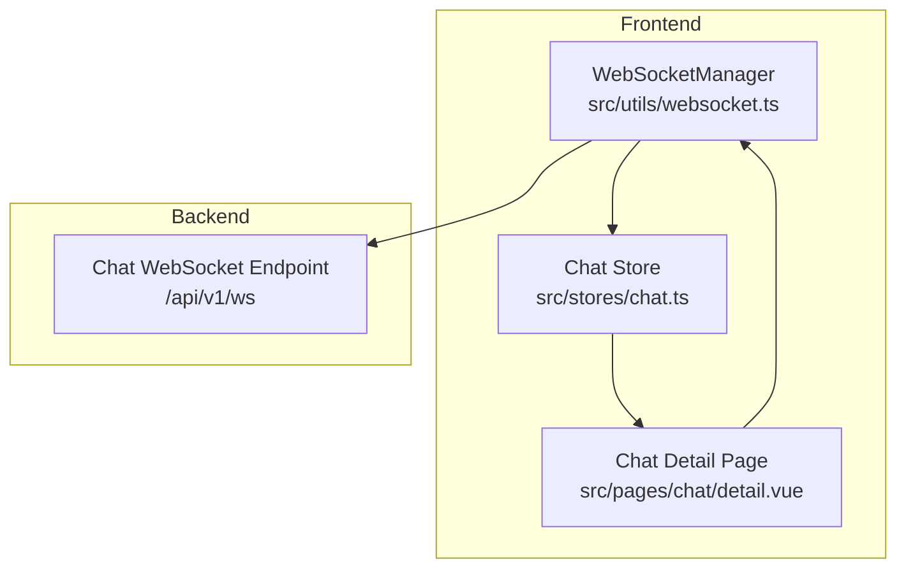
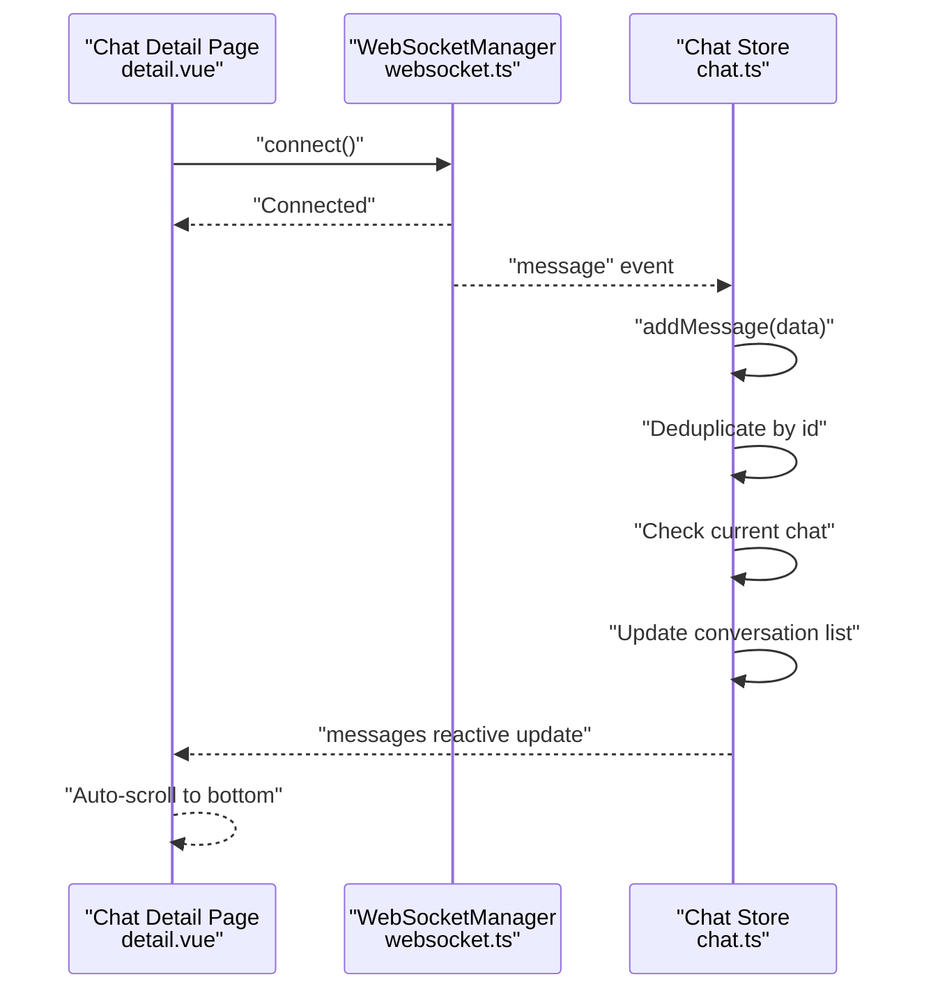
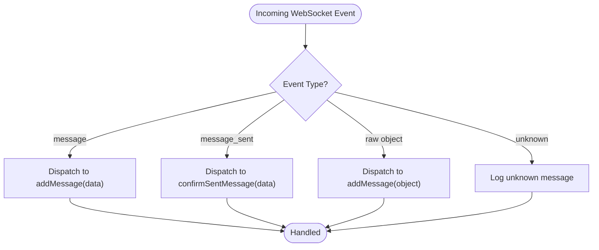
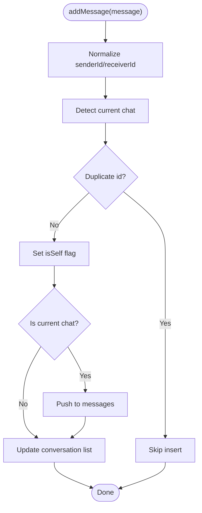
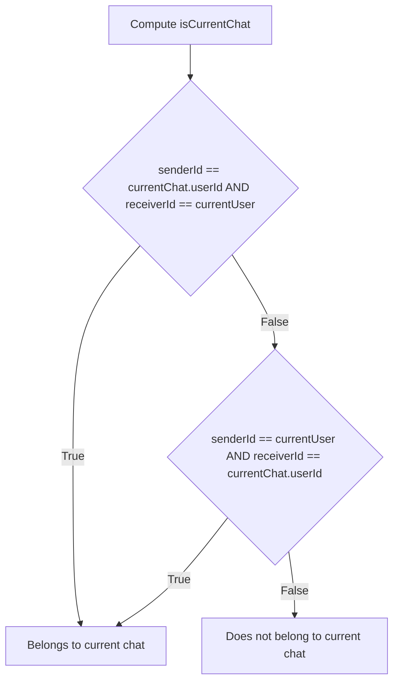
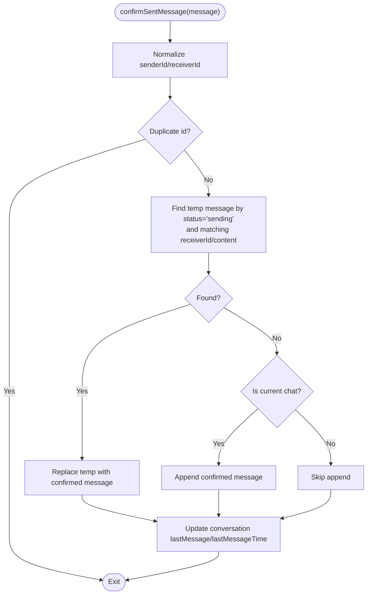
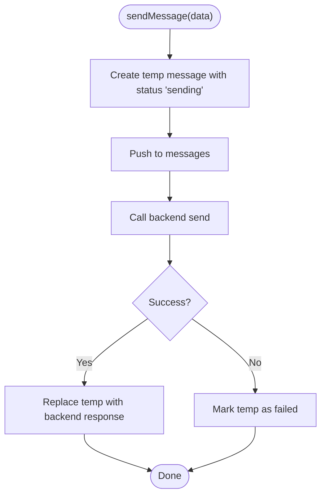
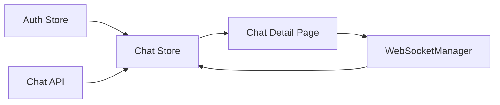

# Real-time Synchronization

<cite>
**Referenced Files in This Document**
- [chat.ts](file://src/stores/chat.ts)
- [websocket.ts](file://src/utils/websocket.ts)
- [detail.vue](file://src/pages/chat/detail.vue)
- [chat.ts](file://src/api/modules/chat.ts)
- [backend-types.ts](file://src/types/api/backend-types.ts)
</cite>

## Table of Contents
1. [Introduction](#introduction)
2. [Project Structure](#project-structure)
3. [Core Components](#core-components)
4. [Architecture Overview](#architecture-overview)
5. [Detailed Component Analysis](#detailed-component-analysis)
6. [Dependency Analysis](#dependency-analysis)
7. [Performance Considerations](#performance-considerations)
8. [Troubleshooting Guide](#troubleshooting-guide)
9. [Conclusion](#conclusion)

## Introduction
This document explains the real-time chat synchronization mechanisms implemented in the frontend. It covers WebSocket message handling patterns, how incoming messages are processed and integrated into the chat state, deduplication logic, current chat detection, and conversation list updates. It also documents the confirmSentMessage function for handling backend confirmations and replacing temporary messages. Finally, it provides examples of multi-device synchronization, offline message queuing, and maintaining state consistency across concurrent sessions.

## Project Structure
The real-time chat system spans three primary areas:
- WebSocket client manager that connects to the backend and routes events to the chat store
- Chat store that manages conversations, current chat, messages, and synchronization logic
- Chat detail page that initializes the current chat session and subscribes to WebSocket events

**Diagram sources**
- [websocket.ts:6-171](file://src/utils/websocket.ts#L6-L171)
- [chat.ts:8-234](file://src/stores/chat.ts#L8-L234)
- [detail.vue:50-108](file://src/pages/chat/detail.vue#L50-L108)

**Section sources**
- [websocket.ts:15-53](file://src/utils/websocket.ts#L15-L53)
- [chat.ts:14-48](file://src/stores/chat.ts#L14-L48)
- [detail.vue:77-102](file://src/pages/chat/detail.vue#L77-L102)

## Core Components
- WebSocketManager: Establishes and maintains a persistent connection, handles reconnection, heartbeats, and routes incoming messages to the chat store.
- Chat Store: Central state for conversations, current chat, and messages. Implements message ingestion, deduplication, current chat detection, conversation updates, optimistic sends, and backend confirmations.
- Chat Detail Page: Initializes the current chat context, loads history, marks as read, and subscribes to WebSocket events.

Key responsibilities:
- Incoming message handling: addMessage
- Outgoing message handling: sendMessage (optimistic update) and confirmSentMessage (replace temporary with backend-confirmed)
- Conversation list updates: unread counts and last message metadata
- Current chat detection: ensures only relevant messages are appended to the active conversation

**Section sources**
- [websocket.ts:93-111](file://src/utils/websocket.ts#L93-L111)
- [chat.ts:100-158](file://src/stores/chat.ts#L100-L158)
- [chat.ts:161-210](file://src/stores/chat.ts#L161-L210)
- [detail.vue:89-98](file://src/pages/chat/detail.vue#L89-L98)

## Architecture Overview
The real-time pipeline integrates frontend state management with a WebSocket channel. Messages arrive via the WebSocketManager, which dispatches them to the chat store. The chat store applies deduplication, determines whether a message belongs to the current chat, updates conversation metadata, and renders the UI accordingly.

**Diagram sources**
- [websocket.ts:58-72](file://src/utils/websocket.ts#L58-L72)
- [chat.ts:100-158](file://src/stores/chat.ts#L100-L158)
- [detail.vue:111-114](file://src/pages/chat/detail.vue#L111-L114)

## Detailed Component Analysis

### WebSocket Message Handling Patterns
The WebSocketManager listens for multiple message types and delegates to the chat store:
- message: standard incoming message payload
- message_sent: backend confirmation for sent messages
- raw message object: compatibility fallback

It also manages connection lifecycle, reconnection, and heartbeats.

**Diagram sources**
- [websocket.ts:93-111](file://src/utils/websocket.ts#L93-L111)

**Section sources**
- [websocket.ts:55-91](file://src/utils/websocket.ts#L55-L91)
- [websocket.ts:113-126](file://src/utils/websocket.ts#L113-L126)
- [websocket.ts:128-141](file://src/utils/websocket.ts#L128-L141)

### Incoming Message Processing and Chat State Integration
The addMessage function performs:
- Logging for observability
- Sender/receiver ID normalization (string to number)
- Current chat detection using the currentChat context
- Deduplication by message id
- Conditional insertion into messages array (only for current chat)
- Conversation list updates (last message, last message time, unread count if not current chat)

**Diagram sources**
- [chat.ts:100-158](file://src/stores/chat.ts#L100-L158)

**Section sources**
- [chat.ts:108-158](file://src/stores/chat.ts#L108-L158)

### Message Deduplication Logic
Both addMessage and confirmSentMessage implement deduplication:
- addMessage checks messages.value for existing id
- confirmSentMessage checks messages.value for existing id
- Both skip processing if a duplicate is found

This prevents duplicate UI entries and inconsistent state when messages are received from multiple sources or during reconnection.

**Section sources**
- [chat.ts:123-128](file://src/stores/chat.ts#L123-L128)
- [chat.ts:169-174](file://src/stores/chat.ts#L169-L174)

### Current Chat Detection
Current chat detection ensures that only messages belonging to the active conversation are appended to the messages array. It considers bidirectional matches between the logged-in user and the other party.

**Diagram sources**
- [chat.ts:117-121](file://src/stores/chat.ts#L117-L121)

**Section sources**
- [chat.ts:117-121](file://src/stores/chat.ts#L117-L121)

### Conversation List Updates
When a message arrives:
- The other user’s conversation is located
- lastMessage and lastMessageTime are updated
- If the message does not belong to the current chat, unreadCount is incremented
- Global unreadCount is also incremented

This keeps the conversation list accurate and reflects unread indicators.

**Section sources**
- [chat.ts:146-157](file://src/stores/chat.ts#L146-L157)

### confirmSentMessage Function
The confirmSentMessage function handles backend confirmations:
- Deduplicates by id
- Locates a pending temporary message with matching receiverId and content
- Replaces the temporary message with the backend-confirmed message
- If no temporary message is found, inserts the confirmed message into the current chat
- Updates conversation list last message metadata

**Diagram sources**
- [chat.ts:161-210](file://src/stores/chat.ts#L161-L210)

**Section sources**
- [chat.ts:161-210](file://src/stores/chat.ts#L161-L210)

### Optimistic Send and Temporary Messages
The sendMessage function implements optimistic updates:
- Generates a temporary id based on timestamp
- Immediately pushes a temporary message with status "sending"
- Sends the message to the backend
- On success, replaces the temporary message with the backend response
- On failure, marks the temporary message as failed

**Diagram sources**
- [chat.ts:50-90](file://src/stores/chat.ts#L50-L90)

**Section sources**
- [chat.ts:50-90](file://src/stores/chat.ts#L50-L90)

### Multi-device Synchronization Examples
- Device A sends a message (optimistic temporary appears immediately)
- Device B receives message_sent confirmation and replaces its temporary with the confirmed message
- Device C (offline) receives the message via WebSocket after reconnect and updates conversation metadata
- All devices converge on the same message set and conversation state

This relies on:
- confirmSentMessage replacing temporaries
- addMessage deduplicating by id
- Conversation list updates for last message and unread counts

**Section sources**
- [chat.ts:161-210](file://src/stores/chat.ts#L161-L210)
- [chat.ts:100-158](file://src/stores/chat.ts#L100-L158)

### Offline Message Queuing and State Consistency
- The WebSocketManager automatically reconnects and resumes message delivery
- Heartbeat mechanism ensures liveness
- On reconnect, the UI remains consistent because:
  - Deduplication prevents duplicates
  - confirmSentMessage ensures temporaries are replaced
  - Conversation metadata is updated for last message and unread counts

**Section sources**
- [websocket.ts:113-126](file://src/utils/websocket.ts#L113-L126)
- [websocket.ts:128-141](file://src/utils/websocket.ts#L128-L141)
- [chat.ts:161-210](file://src/stores/chat.ts#L161-L210)
- [chat.ts:100-158](file://src/stores/chat.ts#L100-L158)

### API Contracts and Types
- Message and Conversation types are defined in backend types
- Chat API module exposes endpoints for sending, fetching history, conversations, and marking as read
- Frontend types align with backend shapes for seamless integration

**Section sources**
- [backend-types.ts:54-57](file://src/types/api/backend-types.ts#L54-L57)
- [chat.ts:18-45](file://src/api/modules/chat.ts#L18-L45)

## Dependency Analysis
The WebSocketManager depends on the chat store for message routing. The chat store depends on the auth store for user identity and on the chat API for history and send operations. The chat detail page orchestrates initialization and lifecycle.

**Diagram sources**
- [chat.ts:6-6](file://src/stores/chat.ts#L6-L6)
- [chat.ts:14-48](file://src/stores/chat.ts#L14-L48)
- [websocket.ts:23-24](file://src/utils/websocket.ts#L23-L24)
- [detail.vue:59-62](file://src/pages/chat/detail.vue#L59-L62)

**Section sources**
- [chat.ts:6-6](file://src/stores/chat.ts#L6-L6)
- [websocket.ts:23-24](file://src/utils/websocket.ts#L23-L24)
- [detail.vue:59-62](file://src/pages/chat/detail.vue#L59-L62)

## Performance Considerations
- Deduplication by id minimizes redundant DOM updates and state mutations.
- Current chat filtering reduces unnecessary appends to inactive conversations.
- Optimistic updates improve perceived latency; confirmSentMessage ensures eventual consistency.
- Heartbeats and reconnection reduce downtime and maintain state continuity.

## Troubleshooting Guide
Common scenarios and diagnostics:
- No messages appear after reconnect:
  - Verify WebSocketManager reconnection logs and heartbeat activity
  - Ensure addMessage deduplication is functioning
- Duplicate messages:
  - Check message id uniqueness and confirmSentMessage replacement logic
- Unread counts incorrect:
  - Confirm conversation list updates occur only when not in current chat
- Temporary messages remain:
  - Ensure confirmSentMessage is invoked and finds matching temporary by receiverId and content

Operational hooks:
- WebSocketManager logs for connect/disconnect/connect_error and ping/pong
- Chat store logs for addMessage and confirmSentMessage paths

**Section sources**
- [websocket.ts:58-90](file://src/utils/websocket.ts#L58-L90)
- [websocket.ts:114-118](file://src/utils/websocket.ts#L114-L118)
- [chat.ts:108-115](file://src/stores/chat.ts#L108-L115)
- [chat.ts:161-174](file://src/stores/chat.ts#L161-L174)

## Conclusion
The real-time chat synchronization leverages a robust WebSocket pipeline, strict deduplication, precise current chat detection, and optimistic updates with backend confirmations. Together, these mechanisms ensure reliable multi-device synchronization, consistent state across sessions, and a responsive user experience.