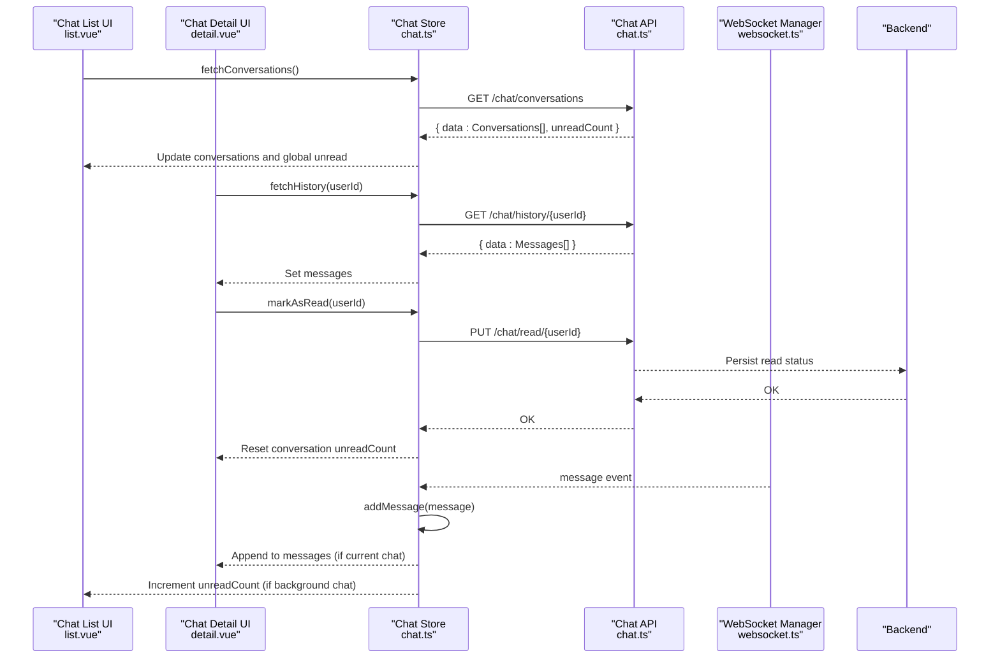
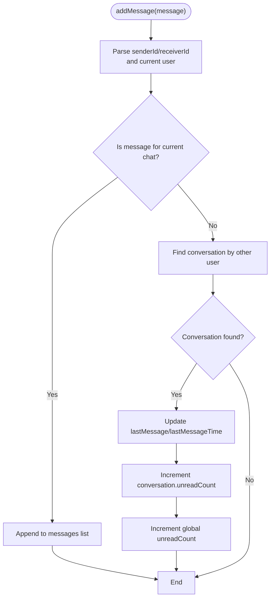
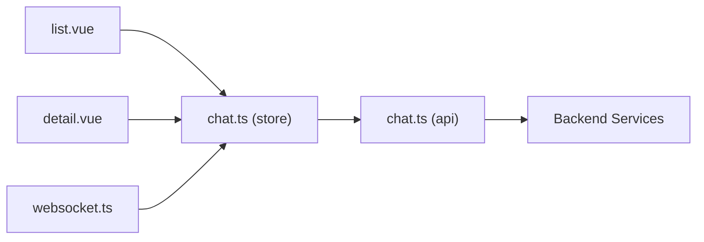

# Unread Message Tracking

<cite>
**Referenced Files in This Document**
- [chat.ts](file://src/stores/chat.ts)
- [chat.ts](file://src/api/modules/chat.ts)
- [detail.vue](file://src/pages/chat/detail.vue)
- [list.vue](file://src/pages/chat/list.vue)
- [websocket.ts](file://src/utils/websocket.ts)
</cite>

## Table of Contents
1. [Introduction](#introduction)
2. [Project Structure](#project-structure)
3. [Core Components](#core-components)
4. [Architecture Overview](#architecture-overview)
5. [Detailed Component Analysis](#detailed-component-analysis)
6. [Dependency Analysis](#dependency-analysis)
7. [Performance Considerations](#performance-considerations)
8. [Troubleshooting Guide](#troubleshooting-guide)
9. [Conclusion](#conclusion)

## Introduction
This document explains the unread message tracking system, covering how unread counts are managed per conversation and globally, how read receipts are handled, and how the system synchronizes read/unread states across devices. It also documents the markAsRead function, automatic unread increments for background chats, global unread aggregation, backend API integration, and UI display patterns for badges and notifications.

## Project Structure
The unread tracking spans three primary areas:
- Store-level state and logic for conversations, messages, and unread counts
- API module for backend endpoints related to chat and read status
- UI pages that render unread indicators and trigger read actions

```mermaid
graph TB
subgraph "UI"
LIST["Chat List Page<br/>list.vue"]
DETAIL["Chat Detail Page<br/>detail.vue"]
end
subgraph "Store"
STORE["Chat Store<br/>chat.ts"]
end
subgraph "API"
API["Chat API Module<br/>chat.ts"]
end
subgraph "Backend"
WS["WebSocket Server"]
READ_API["Read Status API<br/>PUT /chat/read/{userId}"]
CONV_API["Conversations API<br/>GET /chat/conversations"]
end
LIST --> STORE
DETAIL --> STORE
STORE --> API
API --> READ_API
API --> CONV_API
WS --> STORE
STORE --> LIST
STORE --> DETAIL
```

**Diagram sources**
- [chat.ts:1-234](file://src/stores/chat.ts#L1-L234)
- [chat.ts:1-46](file://src/api/modules/chat.ts#L1-L46)
- [list.vue:1-311](file://src/pages/chat/list.vue#L1-L311)
- [detail.vue:1-299](file://src/pages/chat/detail.vue#L1-L299)
- [websocket.ts:1-171](file://src/utils/websocket.ts#L1-L171)

**Section sources**
- [chat.ts:1-234](file://src/stores/chat.ts#L1-L234)
- [chat.ts:1-46](file://src/api/modules/chat.ts#L1-L46)
- [list.vue:1-311](file://src/pages/chat/list.vue#L1-L311)
- [detail.vue:1-299](file://src/pages/chat/detail.vue#L1-L299)
- [websocket.ts:1-171](file://src/utils/websocket.ts#L1-L171)

## Core Components
- Chat Store: Manages conversations, messages, current chat context, and unread counts. Provides functions to fetch conversations, fetch message history, send messages, mark as read, add incoming messages, and confirm sent messages.
- Chat API: Wraps backend endpoints for chat operations, including read status updates and conversation retrieval.
- WebSocket Manager: Connects to the backend via Socket.IO, receives real-time events, and dispatches them to the store.
- UI Pages: Render unread badges and trigger read actions when entering a chat.

Key responsibilities:
- Unread count management per conversation and globally
- Automatic increment for background chats (non-current chats)
- Global unread aggregation from per-conversation counters
- Read receipt handling via markAsRead and backend PUT endpoint
- Multi-device synchronization through WebSocket confirmations

**Section sources**
- [chat.ts:8-234](file://src/stores/chat.ts#L8-L234)
- [chat.ts:18-45](file://src/api/modules/chat.ts#L18-L45)
- [websocket.ts:55-111](file://src/utils/websocket.ts#L55-L111)
- [list.vue:18-56](file://src/pages/chat/list.vue#L18-L56)
- [detail.vue:116-129](file://src/pages/chat/detail.vue#L116-L129)

## Architecture Overview
The system integrates frontend stores, API layer, and WebSocket events to maintain accurate unread states across devices.



**Diagram sources**
- [chat.ts:14-25](file://src/stores/chat.ts#L14-L25)
- [chat.ts:27-48](file://src/stores/chat.ts#L27-L48)
- [chat.ts:92-98](file://src/stores/chat.ts#L92-L98)
- [chat.ts:28-45](file://src/api/modules/chat.ts#L28-L45)
- [websocket.ts:93-111](file://src/utils/websocket.ts#L93-L111)
- [list.vue:82-91](file://src/pages/chat/list.vue#L82-L91)
- [detail.vue:116-129](file://src/pages/chat/detail.vue#L116-L129)

## Detailed Component Analysis

### Unread Count Management
- Per-conversation unread count: maintained in each Conversation object and updated when new messages arrive in background chats.
- Global unread count: aggregated from all conversations’ unread counts and set during fetchConversations.

Behavior highlights:
- Background chat increment: when a new message arrives and the receiving chat is not the current chat, both the conversation’s unreadCount and the global unreadCount are incremented.
- Current chat handling: messages for the currently viewed chat are appended to the message list without increasing unread counts.

**Section sources**
- [chat.ts:14-25](file://src/stores/chat.ts#L14-L25)
- [chat.ts:146-158](file://src/stores/chat.ts#L146-L158)

### Read Receipt Handling
- markAsRead(userId): Calls the backend PUT endpoint to mark a conversation as read, then resets the target conversation’s unreadCount in the store.
- UI integration: The detail page invokes markAsRead after loading history to ensure read receipts are sent immediately upon opening a chat.

**Section sources**
- [chat.ts:92-98](file://src/stores/chat.ts#L92-L98)
- [chat.ts:43-44](file://src/api/modules/chat.ts#L43-L44)
- [detail.vue](file://src/pages/chat/detail.vue#L120)

### Automatic Unread Count Increment for Background Chats
- Incoming message handling: The WebSocket manager routes message events to the store’s addMessage handler.
- Decision logic: If the incoming message does not belong to the current chat, the unread count for that conversation and the global unread count are incremented.



**Diagram sources**
- [chat.ts:100-158](file://src/stores/chat.ts#L100-L158)

**Section sources**
- [chat.ts:100-158](file://src/stores/chat.ts#L100-L158)
- [websocket.ts:93-111](file://src/utils/websocket.ts#L93-L111)

### Global Unread Count Aggregation
- On fetching conversations, the store assigns the backend-provided global unreadCount to its reactive state.
- During runtime, the store increments/decrements the global unreadCount alongside per-conversation updates.

**Section sources**
- [chat.ts:14-25](file://src/stores/chat.ts#L14-L25)
- [chat.ts:146-158](file://src/stores/chat.ts#L146-L158)

### Backend Read Status API Integration
- Endpoint: PUT /chat/read/{userId}
- Purpose: Marks a conversation as read on the backend and returns success status.
- Frontend usage: Called by markAsRead after loading chat history to synchronize read state across devices.

**Section sources**
- [chat.ts:43-44](file://src/api/modules/chat.ts#L43-L44)
- [chat.ts:92-98](file://src/stores/chat.ts#L92-L98)

### Synchronization Across Multiple Devices
- Real-time confirmations: The WebSocket manager listens for message_sent events and calls confirmSentMessage to reconcile multi-device message states.
- Read receipts: After marking a chat as read, the backend persists the read status; subsequent device connections will reflect updated unread counts.

**Section sources**
- [websocket.ts:93-111](file://src/utils/websocket.ts#L93-L111)
- [chat.ts:161-210](file://src/stores/chat.ts#L161-L210)
- [chat.ts:92-98](file://src/stores/chat.ts#L92-L98)

### Unread Badge Display Logic
- Chat list: Renders an unread badge when a conversation has unreadCount > 0 and caps display at 99+.
- Detail page: Uses a small unread dot indicator near the avatar when a conversation has unread messages.

**Section sources**
- [list.vue](file://src/pages/chat/list.vue#L30)
- [list.vue:43-45](file://src/pages/chat/list.vue#L43-L45)
- [list.vue:200-210](file://src/pages/chat/list.vue#L200-L210)

### Notification Triggering Mechanisms
- Background messages: When a message arrives in a background chat, unreadCount increases, enabling UI to show badges and potentially trigger native notifications depending on platform-specific logic.
- Current chat messages: Appended to the message list without increasing unreadCount, so no badge appears until the user navigates away.

Note: The repository does not include explicit notification APIs. Badge rendering is handled by the UI; platform-level push notifications would require additional integration not present here.

**Section sources**
- [chat.ts:146-158](file://src/stores/chat.ts#L146-L158)
- [list.vue](file://src/pages/chat/list.vue#L30)
- [list.vue:43-45](file://src/pages/chat/list.vue#L43-L45)

## Dependency Analysis
The unread tracking system exhibits clear separation of concerns:
- UI depends on the store for reactive state and actions
- Store depends on the API module for backend calls
- WebSocket manager depends on the store to process real-time events
- Backend provides endpoints for read status and conversation metadata



**Diagram sources**
- [list.vue:60-91](file://src/pages/chat/list.vue#L60-L91)
- [detail.vue:59-129](file://src/pages/chat/detail.vue#L59-L129)
- [chat.ts:1-234](file://src/stores/chat.ts#L1-L234)
- [chat.ts:1-46](file://src/api/modules/chat.ts#L1-L46)
- [websocket.ts:1-171](file://src/utils/websocket.ts#L1-L171)

**Section sources**
- [list.vue:60-91](file://src/pages/chat/list.vue#L60-L91)
- [detail.vue:59-129](file://src/pages/chat/detail.vue#L59-L129)
- [chat.ts:1-234](file://src/stores/chat.ts#L1-L234)
- [chat.ts:1-46](file://src/api/modules/chat.ts#L1-L46)
- [websocket.ts:1-171](file://src/utils/websocket.ts#L1-L171)

## Performance Considerations
- Optimistic UI updates: Sending messages adds a temporary message immediately, improving perceived responsiveness. Real message replaces the temporary one upon confirmation.
- Deduplication: Incoming messages and sent confirmations are deduplicated to prevent redundant UI updates and state inconsistencies.
- Efficient unread updates: Incrementing only unreadCount for background chats avoids unnecessary DOM reflows in the message list.

[No sources needed since this section provides general guidance]

## Troubleshooting Guide
Common issues and resolutions:
- Mark as read not resetting unread count:
  - Verify that markAsRead is called after loading history and that the backend response is successful.
  - Ensure the conversation exists in the store before attempting to reset unreadCount.

- Unread count not incrementing for background chats:
  - Confirm that addMessage is invoked by the WebSocket manager and that the message is not for the current chat.
  - Check that the target conversation exists and that unreadCount is being incremented.

- Duplicate messages appearing:
  - Ensure message deduplication logic runs before adding messages to the list.

- Read receipts not synchronized across devices:
  - Confirm WebSocket connectivity and that message_sent events are handled by confirmSentMessage.

**Section sources**
- [chat.ts:92-98](file://src/stores/chat.ts#L92-L98)
- [chat.ts:100-158](file://src/stores/chat.ts#L100-L158)
- [chat.ts:161-210](file://src/stores/chat.ts#L161-L210)
- [websocket.ts:93-111](file://src/utils/websocket.ts#L93-L111)

## Conclusion
The unread message tracking system combines store-managed state, API-backed persistence, and real-time WebSocket events to provide accurate, synchronized read/unread status across devices. The markAsRead function ensures backend read receipts are recorded, while automatic increments for background chats keep users informed. The UI renders unread badges consistently, and deduplication and optimistic updates improve user experience.