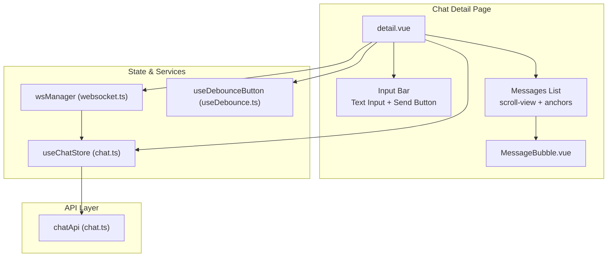
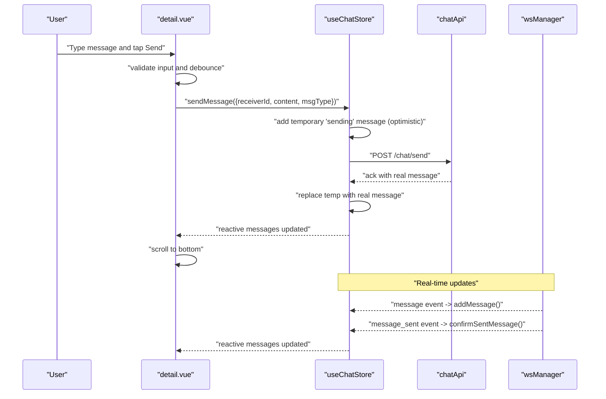
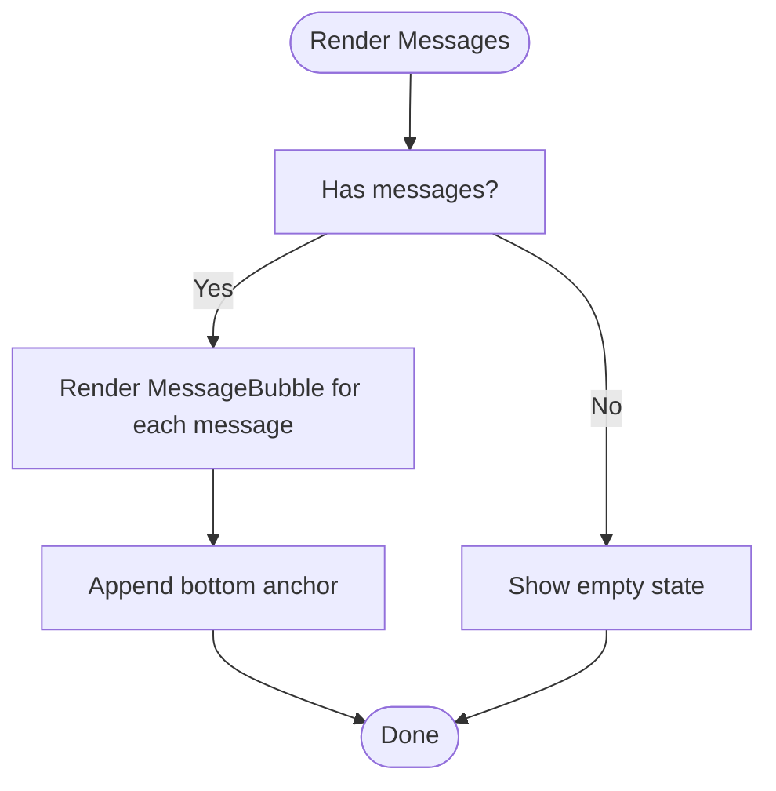
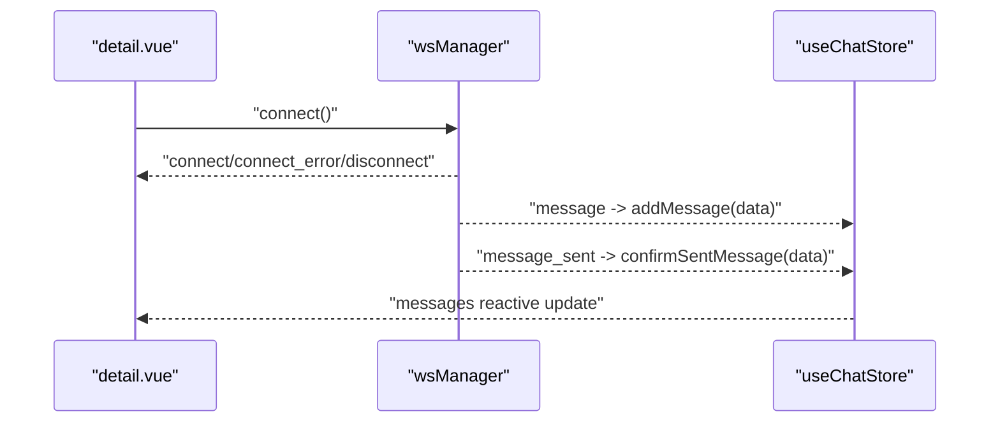
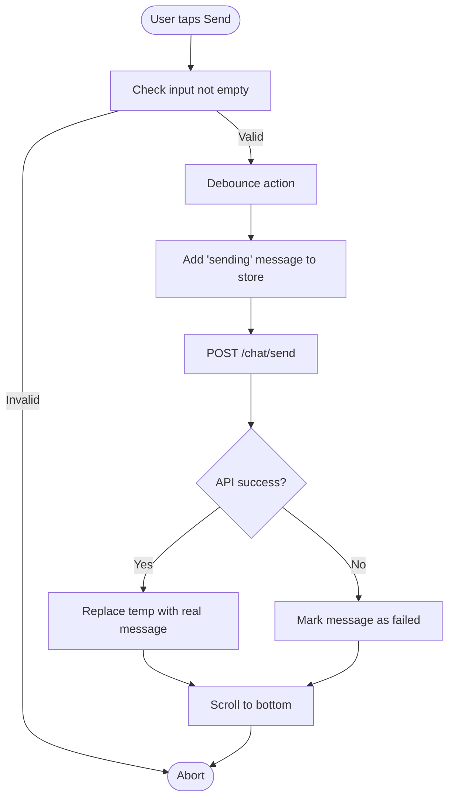
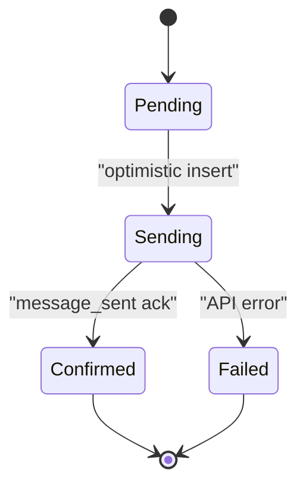
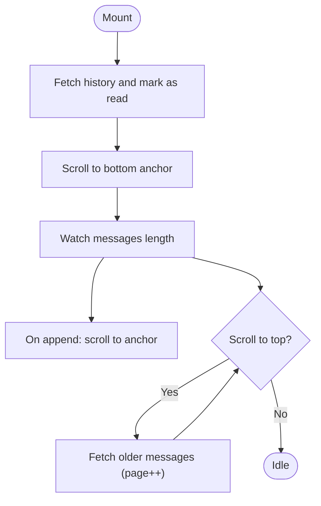
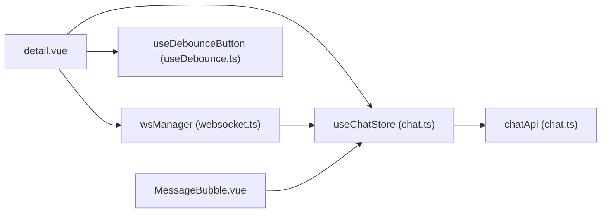

# Chat Detail Page

<cite>
**Referenced Files in This Document**
- [detail.vue](file://src/pages/chat/detail.vue)
- [MessageBubble.vue](file://src/components/business/MessageBubble.vue)
- [chat.ts](file://src/stores/chat.ts)
- [websocket.ts](file://src/utils/websocket.ts)
- [chat.ts](file://src/api/modules/chat.ts)
- [enums.ts](file://src/types/enums.ts)
- [backend-types.ts](file://src/types/api/backend-types.ts)
- [list.vue](file://src/pages/chat/list.vue)
- [useDebounce.ts](file://src/composables/useDebounce.ts)
- [avatar.ts](file://src/utils/avatar.ts)
</cite>

## Table of Contents
1. [Introduction](#introduction)
2. [Project Structure](#project-structure)
3. [Core Components](#core-components)
4. [Architecture Overview](#architecture-overview)
5. [Detailed Component Analysis](#detailed-component-analysis)
6. [Dependency Analysis](#dependency-analysis)
7. [Performance Considerations](#performance-considerations)
8. [Troubleshooting Guide](#troubleshooting-guide)
9. [Conclusion](#conclusion)
10. [Appendices](#appendices)

## Introduction
This document describes the chat detail page component, focusing on message thread rendering, real-time message display via WebSocket, input handling for sending messages, message status tracking, attachment support, scroll management, infinite loading, typing indicators, and cross-platform considerations for H5 and mini-program environments. It also outlines extension points for reactions, forward/reply, and context menu options.

## Project Structure
The chat detail page is implemented as a Vue Single File Component with supporting store, WebSocket manager, and reusable UI components. The structure integrates with the global Pinia store for chat state, the WebSocket manager for real-time updates, and a dedicated message bubble component for rendering individual messages.

**Diagram sources**
- [detail.vue:1-299](file://src/pages/chat/detail.vue#L1-L299)
- [MessageBubble.vue:1-309](file://src/components/business/MessageBubble.vue#L1-L309)
- [chat.ts:1-234](file://src/stores/chat.ts#L1-L234)
- [websocket.ts:1-171](file://src/utils/websocket.ts#L1-L171)
- [chat.ts:18-45](file://src/api/modules/chat.ts#L18-L45)
- [useDebounce.ts:63-73](file://src/composables/useDebounce.ts#L63-L73)

**Section sources**
- [detail.vue:1-299](file://src/pages/chat/detail.vue#L1-L299)
- [chat.ts:1-234](file://src/stores/chat.ts#L1-L234)
- [websocket.ts:1-171](file://src/utils/websocket.ts#L1-L171)
- [chat.ts:18-45](file://src/api/modules/chat.ts#L18-L45)
- [useDebounce.ts:63-73](file://src/composables/useDebounce.ts#L63-L73)

## Core Components
- Chat Detail Page (detail.vue): Orchestrates message rendering, input handling, scroll management, and lifecycle hooks.
- MessageBubble (MessageBubble.vue): Renders individual messages with status indicators, timestamps, and avatar display.
- useChatStore (chat.ts): Manages conversation and message lists, optimistic updates, and WebSocket-driven synchronization.
- wsManager (websocket.ts): Handles connection, reconnection, heartbeat, and dispatching server events to the store.
- chatApi (chat.ts): Encapsulates chat endpoints for sending messages, fetching history, and marking as read.
- useDebounceButton (useDebounce.ts): Prevents rapid send button clicks and manages button text/state.
- Enums and Types (enums.ts, backend-types.ts): Define message types and DTOs for backend compatibility.

**Section sources**
- [detail.vue:50-172](file://src/pages/chat/detail.vue#L50-L172)
- [MessageBubble.vue:68-115](file://src/components/business/MessageBubble.vue#L68-L115)
- [chat.ts:8-234](file://src/stores/chat.ts#L8-L234)
- [websocket.ts:6-171](file://src/utils/websocket.ts#L6-L171)
- [chat.ts:18-45](file://src/api/modules/chat.ts#L18-L45)
- [useDebounce.ts:63-73](file://src/composables/useDebounce.ts#L63-L73)
- [enums.ts:7-11](file://src/types/enums.ts#L7-L11)
- [backend-types.ts:54-57](file://src/types/api/backend-types.ts#L54-L57)

## Architecture Overview
The chat detail page follows a unidirectional data flow:
- UI triggers actions (send, retry, load history).
- Actions update the store (optimistic updates for outgoing messages).
- WebSocket receives real-time events and updates the store.
- Store updates reactive lists, triggering re-rendering.
- Scroll management ensures the latest message remains visible.

**Diagram sources**
- [detail.vue:131-148](file://src/pages/chat/detail.vue#L131-L148)
- [chat.ts:50-90](file://src/stores/chat.ts#L50-L90)
- [chat.ts:100-158](file://src/stores/chat.ts#L100-L158)
- [chat.ts:161-210](file://src/stores/chat.ts#L161-L210)
- [websocket.ts:93-111](file://src/utils/websocket.ts#L93-L111)

## Detailed Component Analysis

### Message Thread Rendering
- The message list is rendered using a scrollable container and a wrapper that hosts MessageBubble instances for each message in the store.
- A bottom anchor element enables smooth scrolling to the latest message.
- A loading indicator appears during initial history load.

**Diagram sources**
- [detail.vue:10-28](file://src/pages/chat/detail.vue#L10-L28)
- [MessageBubble.vue:1-66](file://src/components/business/MessageBubble.vue#L1-L66)

**Section sources**
- [detail.vue:10-28](file://src/pages/chat/detail.vue#L10-L28)
- [MessageBubble.vue:1-66](file://src/components/business/MessageBubble.vue#L1-L66)

### Real-Time Message Display and WebSocket Integration
- The WebSocket manager connects on mount and handles connection, reconnection, and heartbeat.
- Incoming events are dispatched to the store:
  - Standard message events are added to the current chat.
  - Confirmation events replace temporary “sending” messages with real ones.
- The store ensures deduplication and updates conversation metadata.

**Diagram sources**
- [detail.vue:97-101](file://src/pages/chat/detail.vue#L97-L101)
- [websocket.ts:15-53](file://src/utils/websocket.ts#L15-L53)
- [websocket.ts:93-111](file://src/utils/websocket.ts#L93-L111)
- [chat.ts:100-158](file://src/stores/chat.ts#L100-L158)
- [chat.ts:161-210](file://src/stores/chat.ts#L161-L210)

**Section sources**
- [websocket.ts:15-171](file://src/utils/websocket.ts#L15-L171)
- [chat.ts:100-210](file://src/stores/chat.ts#L100-L210)

### Input Handling and Sending Messages
- Text input is bound to a local reactive variable.
- The send button is debounced to prevent rapid submissions and reflects loading states.
- On submit:
  - Input is validated.
  - An optimistic “sending” message is inserted.
  - A request is made to the backend.
  - On success, the temporary message is replaced with the real one.
  - On failure, the status is set to “failed” for retry.

**Diagram sources**
- [detail.vue:131-148](file://src/pages/chat/detail.vue#L131-L148)
- [chat.ts:50-90](file://src/stores/chat.ts#L50-L90)
- [useDebounce.ts:63-73](file://src/composables/useDebounce.ts#L63-L73)

**Section sources**
- [detail.vue:131-148](file://src/pages/chat/detail.vue#L131-L148)
- [chat.ts:50-90](file://src/stores/chat.ts#L50-L90)
- [useDebounce.ts:63-73](file://src/composables/useDebounce.ts#L63-L73)

### Message Status Tracking (Sent, Delivered, Read)
- Sent: Optimistic insertion of a “sending” message followed by replacement with the backend-acknowledged message.
- Delivered: Handled by the “message_sent” WebSocket event that replaces the temporary message with the confirmed one.
- Read: The page marks the conversation as read after loading history.

**Diagram sources**
- [chat.ts:50-90](file://src/stores/chat.ts#L50-L90)
- [chat.ts:161-210](file://src/stores/chat.ts#L161-L210)

**Section sources**
- [chat.ts:50-90](file://src/stores/chat.ts#L50-L90)
- [chat.ts:161-210](file://src/stores/chat.ts#L161-L210)

### Attachment Support (Images and Files)
- Message type enum supports TEXT, IMAGE, and EMOJI.
- The backend types define MessageType as 1|2|3.
- Current UI renders text content; image rendering would be added in MessageBubble by checking msgType and rendering appropriate media.

Implementation notes:
- Extend MessageBubble to render images when msgType equals IMAGE.
- Integrate file upload service and attach URLs to content.

**Section sources**
- [enums.ts:7-11](file://src/types/enums.ts#L7-L11)
- [backend-types.ts:54-57](file://src/types/api/backend-types.ts#L54-L57)
- [MessageBubble.vue:42-44](file://src/components/business/MessageBubble.vue#L42-L44)

### Scroll Management and Infinite Loading
- Auto-scroll to bottom after mounting and after each message update.
- Bottom anchor element ensures accurate positioning.
- Infinite loading for older messages can be implemented by:
  - Detecting scroll near top.
  - Calling fetchHistory with pagination.
  - Prepending messages while preserving scroll position.

**Diagram sources**
- [detail.vue:77-101](file://src/pages/chat/detail.vue#L77-L101)
- [detail.vue:110-114](file://src/pages/chat/detail.vue#L110-L114)
- [detail.vue:165-171](file://src/pages/chat/detail.vue#L165-L171)
- [chat.ts:27-48](file://src/stores/chat.ts#L27-L48)

**Section sources**
- [detail.vue:77-101](file://src/pages/chat/detail.vue#L77-L101)
- [detail.vue:110-114](file://src/pages/chat/detail.vue#L110-L114)
- [detail.vue:165-171](file://src/pages/chat/detail.vue#L165-L171)
- [chat.ts:27-48](file://src/stores/chat.ts#L27-L48)

### Typing Indicator Implementation
- The current implementation does not include a typing indicator.
- To add:
  - Listen for a “typing” event from wsManager.
  - Maintain a typingUsers map keyed by userId.
  - Render a typing indicator when users are typing in the current chat.

[No sources needed since this section proposes conceptual additions]

### Message Reactions, Forward/Reply, and Context Menu
- Reactions:
  - Add reaction buttons inside MessageBubble.
  - Emit an event to the parent to trigger API calls and UI updates.
- Forward/Reply:
  - Add context menu entries to copy text, reply, or forward.
  - Reply can reuse the input field with quoted content.
  - Forward can open a contact picker and send to another user.
- Context menu:
  - Long-press handlers can reveal a menu with actions.

[No sources needed since this section proposes conceptual additions]

### Cross-Platform Compatibility (H5 and Mini-Program)
- H5:
  - scroll-view and input behaviors are supported.
  - Debounce composable prevents rapid submissions.
- Mini-Program:
  - Uses uni-app APIs (e.g., uni.setNavigationBarTitle, uni.navigateTo).
  - WebSocket manager uses Socket.IO client compatible with uni-app runtime.
  - Ensure platform-specific adjustments for keyboard and safe areas.

**Section sources**
- [detail.vue:85-87](file://src/pages/chat/detail.vue#L85-L87)
- [list.vue:93-97](file://src/pages/chat/list.vue#L93-L97)
- [websocket.ts:34-50](file://src/utils/websocket.ts#L34-L50)

## Dependency Analysis
The chat detail page depends on:
- Store for state and side effects.
- WebSocket manager for real-time updates.
- API module for network requests.
- UI components for rendering and user interaction.

**Diagram sources**
- [detail.vue:50-172](file://src/pages/chat/detail.vue#L50-L172)
- [chat.ts:8-234](file://src/stores/chat.ts#L8-L234)
- [websocket.ts:6-171](file://src/utils/websocket.ts#L6-L171)
- [useDebounce.ts:63-73](file://src/composables/useDebounce.ts#L63-L73)
- [MessageBubble.vue:68-115](file://src/components/business/MessageBubble.vue#L68-L115)

**Section sources**
- [detail.vue:50-172](file://src/pages/chat/detail.vue#L50-L172)
- [chat.ts:8-234](file://src/stores/chat.ts#L8-L234)
- [websocket.ts:6-171](file://src/utils/websocket.ts#L6-L171)
- [useDebounce.ts:63-73](file://src/composables/useDebounce.ts#L63-L73)
- [MessageBubble.vue:68-115](file://src/components/business/MessageBubble.vue#L68-L115)

## Performance Considerations
- Virtual scrolling:
  - For very long histories, implement virtualized rendering to reduce DOM nodes.
- Efficient reactivity:
  - Keep message arrays immutable and avoid unnecessary re-renders.
- Debouncing:
  - Use the existing debounce composable to prevent redundant sends.
- Image optimization:
  - Lazy-load images and compress attachments before sending.
- WebSocket:
  - Heartbeat and exponential backoff are already implemented; ensure minimal payload sizes.

[No sources needed since this section provides general guidance]

## Troubleshooting Guide
- Messages not appearing:
  - Verify current chat is set and belongs to the target user.
  - Check WebSocket connection and event handling.
- Send button disabled:
  - Ensure input is not empty and not in a loading state.
- Retry not working:
  - Confirm the retry handler invokes sendMessage with the original content.
- Read receipts:
  - Ensure markAsRead is called after loading history.

**Section sources**
- [detail.vue:89-93](file://src/pages/chat/detail.vue#L89-L93)
- [detail.vue:150-163](file://src/pages/chat/detail.vue#L150-L163)
- [chat.ts:92-98](file://src/stores/chat.ts#L92-L98)

## Conclusion
The chat detail page integrates a robust real-time messaging system with optimistic UI updates, efficient scroll management, and a clean separation of concerns through the store and WebSocket manager. Extending support for attachments, reactions, and forward/reply requires minimal changes to the existing architecture, leveraging the store and UI components already in place.

## Appendices

### API Definitions
- Send Message
  - Endpoint: POST /chat/send
  - Request: { receiverId, content, msgType? }
  - Response: { id }
- Get History
  - Endpoint: GET /chat/history/:userId
  - Query: { page?, pageSize?, beforeId? }
  - Response: { data: Message[], total: number }
- Mark as Read
  - Endpoint: PUT /chat/read/:userId
  - Response: { success: boolean }

**Section sources**
- [chat.ts:18-45](file://src/api/modules/chat.ts#L18-L45)

### Message Type Reference
- TEXT: 1
- IMAGE: 2
- EMOJI: 3

**Section sources**
- [enums.ts:7-11](file://src/types/enums.ts#L7-L11)
- [backend-types.ts:54-57](file://src/types/api/backend-types.ts#L54-L57)