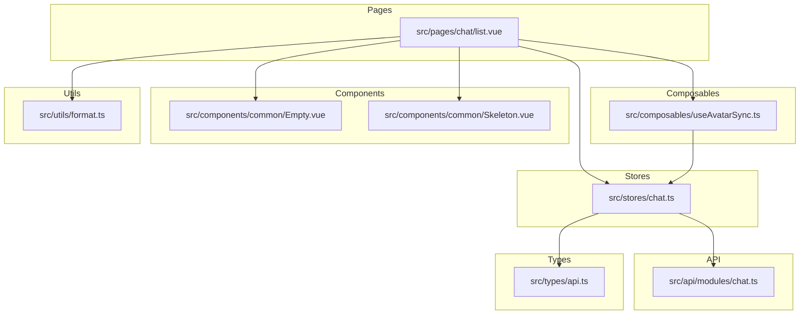
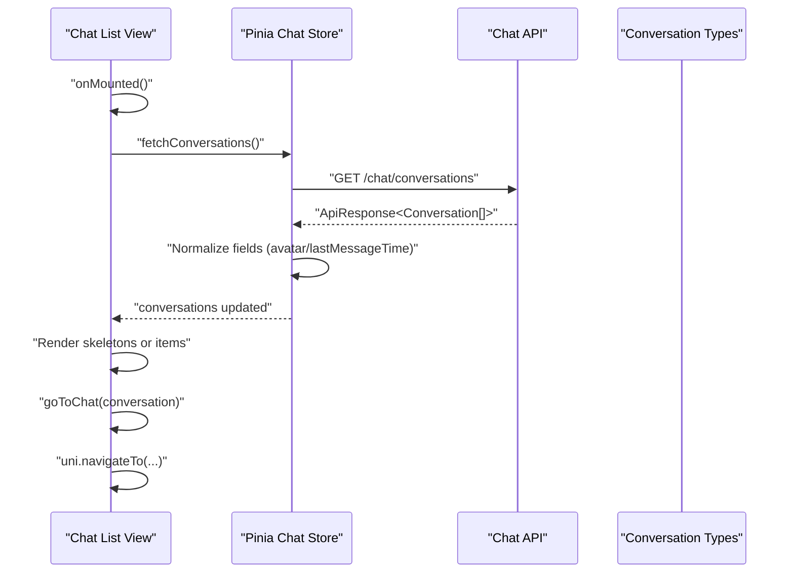
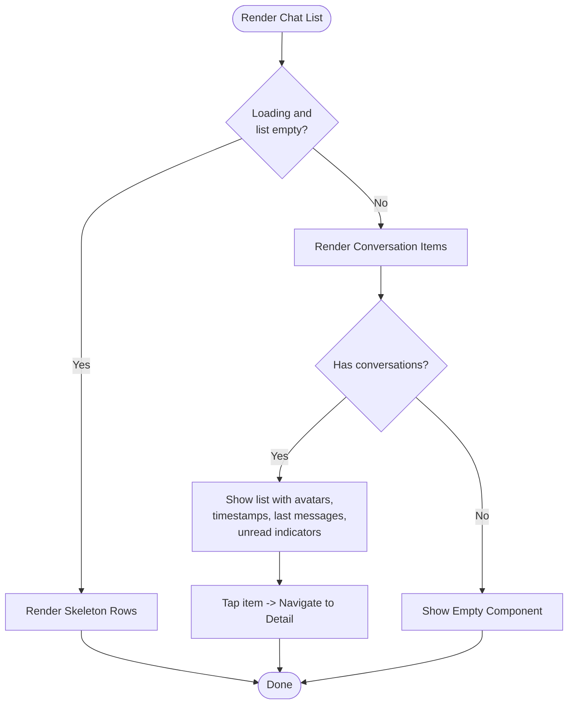
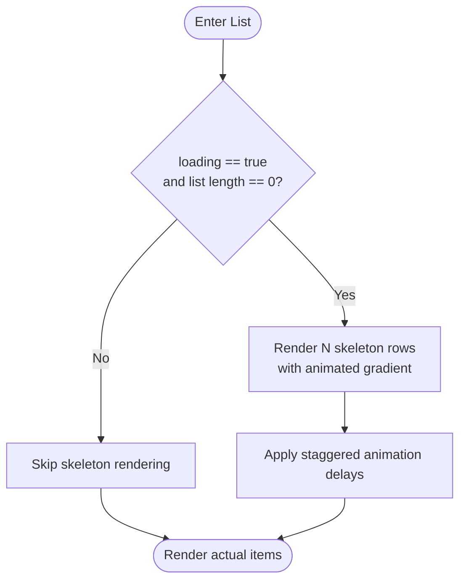
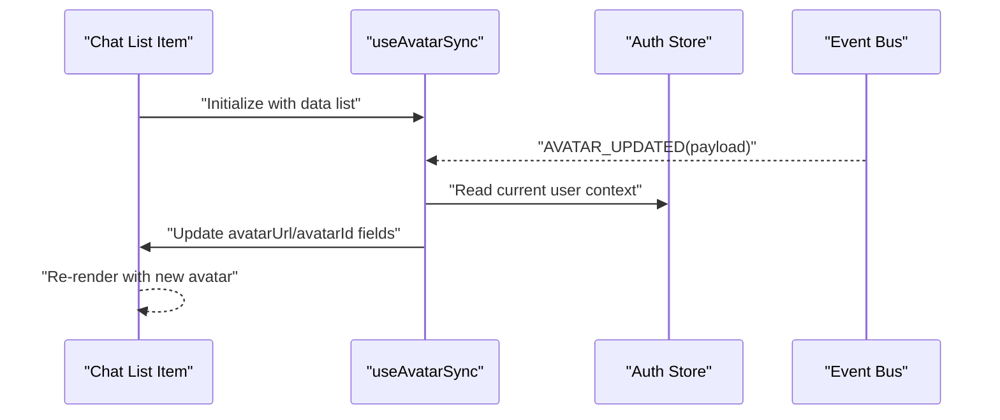
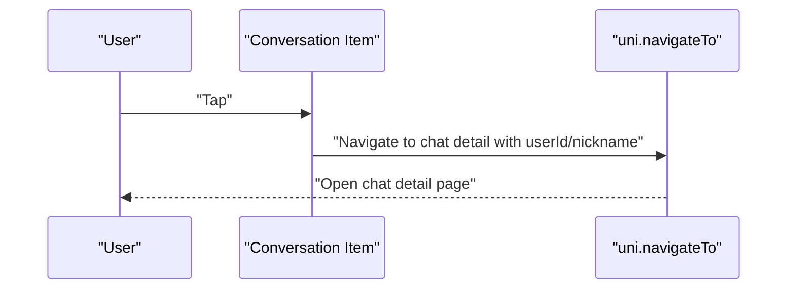
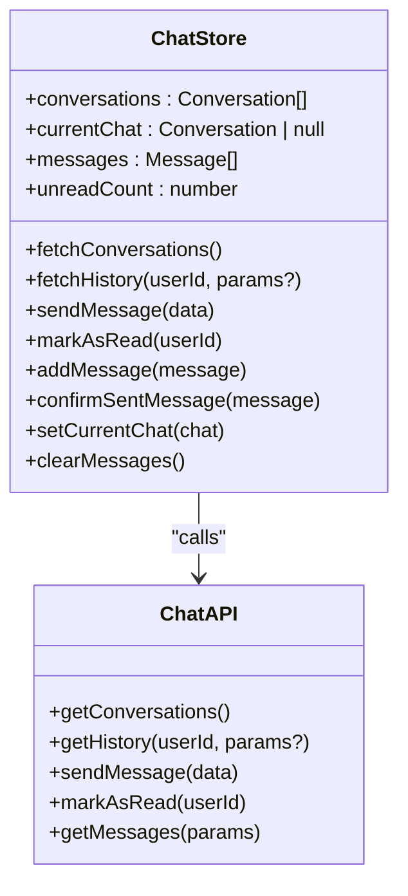
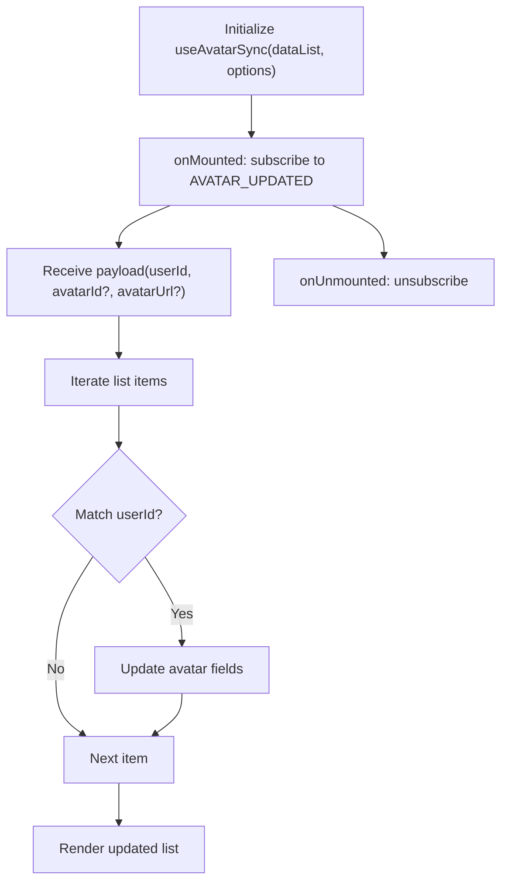
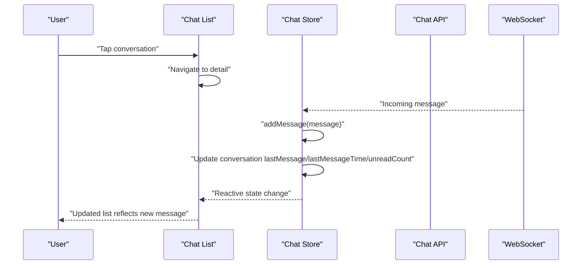
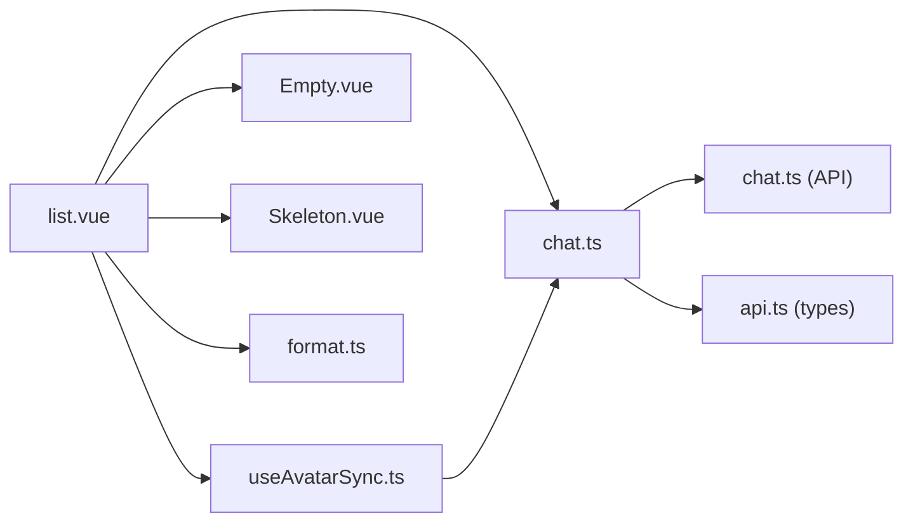

# Chat List Page

<cite>
**Referenced Files in This Document**
- [list.vue](file://src/pages/chat/list.vue)
- [chat.ts](file://src/stores/chat.ts)
- [useAvatarSync.ts](file://src/composables/useAvatarSync.ts)
- [chat.ts](file://src/api/modules/chat.ts)
- [format.ts](file://src/utils/format.ts)
- [Empty.vue](file://src/components/common/Empty.vue)
- [Skeleton.vue](file://src/components/common/Skeleton.vue)
- [api.ts](file://src/types/api.ts)
</cite>

## Table of Contents
1. [Introduction](#introduction)
2. [Project Structure](#project-structure)
3. [Core Components](#core-components)
4. [Architecture Overview](#architecture-overview)
5. [Detailed Component Analysis](#detailed-component-analysis)
6. [Dependency Analysis](#dependency-analysis)
7. [Performance Considerations](#performance-considerations)
8. [Troubleshooting Guide](#troubleshooting-guide)
9. [Conclusion](#conclusion)
10. [Appendices](#appendices)

## Introduction
This document describes the chat list page component, focusing on the conversation list implementation, skeleton loading states, avatar display with unread indicators, and conversation item rendering. It explains Pinia store integration for fetching conversations, the avatar synchronization composable for dynamic avatar updates, and the conversation item click navigation to chat detail. It also covers responsive design patterns, animation effects for loading states, empty state handling, and practical guidance for implementing conversation sorting, search functionality, and real-time updates. Accessibility considerations for screen readers are included.

## Project Structure
The chat list page is implemented as a Vue single-file component under the pages/chat directory. It integrates with a Pinia store for state management, uses a composable for avatar synchronization, and relies on shared UI components for empty and skeleton states. Utility functions format timestamps, and the API module encapsulates backend communication.

**Diagram sources**
- [list.vue:1-311](file://src/pages/chat/list.vue#L1-L311)
- [chat.ts:1-234](file://src/stores/chat.ts#L1-L234)
- [useAvatarSync.ts:1-72](file://src/composables/useAvatarSync.ts#L1-L72)
- [chat.ts:1-46](file://src/api/modules/chat.ts#L1-L46)
- [format.ts:1-38](file://src/utils/format.ts#L1-L38)
- [Empty.vue:1-34](file://src/components/common/Empty.vue#L1-L34)
- [Skeleton.vue:1-169](file://src/components/common/Skeleton.vue#L1-L169)
- [api.ts:36-43](file://src/types/api.ts#L36-L43)

**Section sources**
- [list.vue:1-311](file://src/pages/chat/list.vue#L1-L311)
- [chat.ts:1-234](file://src/stores/chat.ts#L1-L234)
- [useAvatarSync.ts:1-72](file://src/composables/useAvatarSync.ts#L1-L72)
- [chat.ts:1-46](file://src/api/modules/chat.ts#L1-L46)
- [format.ts:1-38](file://src/utils/format.ts#L1-L38)
- [Empty.vue:1-34](file://src/components/common/Empty.vue#L1-L34)
- [Skeleton.vue:1-169](file://src/components/common/Skeleton.vue#L1-L169)
- [api.ts:36-43](file://src/types/api.ts#L36-L43)

## Core Components
- Chat list page component: Renders skeleton loading, conversation list, and empty state; handles navigation to chat detail; integrates avatar synchronization.
- Pinia chat store: Fetches conversations, normalizes fields, manages unread counts, and exposes methods for real-time updates.
- Avatar synchronization composable: Subscribes to global avatar update events and updates list items dynamically.
- Empty and skeleton components: Provide visual feedback during loading and when no conversations exist.
- Timestamp formatting utility: Converts last message time to human-friendly strings.
- Types: Define the conversation model used across the component and store.

**Section sources**
- [list.vue:59-98](file://src/pages/chat/list.vue#L59-L98)
- [chat.ts:8-25](file://src/stores/chat.ts#L8-L25)
- [useAvatarSync.ts:9-71](file://src/composables/useAvatarSync.ts#L9-L71)
- [Empty.vue:1-34](file://src/components/common/Empty.vue#L1-L34)
- [Skeleton.vue:1-169](file://src/components/common/Skeleton.vue#L1-L169)
- [format.ts:8-23](file://src/utils/format.ts#L8-L23)
- [api.ts:36-43](file://src/types/api.ts#L36-L43)

## Architecture Overview
The chat list page follows a unidirectional data flow:
- On mount, the component triggers a store action to fetch conversations.
- The store normalizes backend responses and updates reactive state.
- The component renders skeletons while loading, then renders conversation items with avatar, nickname, last message, time, and unread indicators.
- Avatar synchronization listens for global avatar updates and refreshes displayed avatars.
- Navigation to chat detail is performed via uni-app navigation APIs.

**Diagram sources**
- [list.vue:78-97](file://src/pages/chat/list.vue#L78-L97)
- [chat.ts:14-25](file://src/stores/chat.ts#L14-L25)
- [chat.ts:28-31](file://src/api/modules/chat.ts#L28-L31)
- [api.ts:36-43](file://src/types/api.ts#L36-L43)

## Detailed Component Analysis

### Conversation List Rendering
- Skeleton loading: When loading and the conversation list is empty, a repeating set of skeleton rows is rendered to indicate content is being fetched.
- Conversation items: Each item displays an avatar, nickname, last message time, last message preview, and unread count badge. Unread dot appears when unread count is greater than zero.
- Empty state: When not loading and the list is empty, an empty state component is shown with a friendly message.
- Click behavior: Selecting a conversation navigates to the chat detail page with user identity parameters.

**Diagram sources**
- [list.vue:5-56](file://src/pages/chat/list.vue#L5-L56)
- [list.vue:93-97](file://src/pages/chat/list.vue#L93-L97)

**Section sources**
- [list.vue:5-56](file://src/pages/chat/list.vue#L5-L56)
- [list.vue:93-97](file://src/pages/chat/list.vue#L93-L97)

### Skeleton Loading States
- The component conditionally renders a skeleton block for each row when loading and the list is empty.
- Skeleton visuals use animated gradients to simulate loading activity.
- Animation timing is staggered per item to create a pleasing entrance effect.

**Diagram sources**
- [list.vue:5-13](file://src/pages/chat/list.vue#L5-L13)
- [list.vue:172-180](file://src/pages/chat/list.vue#L172-L180)

**Section sources**
- [list.vue:5-13](file://src/pages/chat/list.vue#L5-L13)
- [list.vue:100-310](file://src/pages/chat/list.vue#L100-L310)

### Avatar Display with Unread Indicators
- Avatar image: Uses either a provided avatar URL or a default placeholder.
- Unread indicator: A small dot overlays the avatar when unread count is greater than zero.
- Dynamic updates: Avatar synchronization composable listens for global avatar updates and refreshes the displayed avatar URL.

**Diagram sources**
- [list.vue:69-76](file://src/pages/chat/list.vue#L69-L76)
- [useAvatarSync.ts:27-58](file://src/composables/useAvatarSync.ts#L27-L58)

**Section sources**
- [list.vue:24-31](file://src/pages/chat/list.vue#L24-L31)
- [list.vue:69-76](file://src/pages/chat/list.vue#L69-L76)
- [useAvatarSync.ts:9-71](file://src/composables/useAvatarSync.ts#L9-L71)

### Conversation Item Click Navigation
- Tap handler: Calls uni-app navigation to open the chat detail page with user identity parameters.
- Parameters: Passes the selected user’s identifier and nickname to the detail page.

**Diagram sources**
- [list.vue:93-97](file://src/pages/chat/list.vue#L93-L97)

**Section sources**
- [list.vue:93-97](file://src/pages/chat/list.vue#L93-L97)

### Pinia Store Integration
- Fetch conversations: Invokes the API to retrieve the conversation list and normalizes field names for compatibility.
- Unread counts: Aggregates unread counts from the backend response.
- Real-time updates: The store exposes methods to add incoming messages and update conversation metadata, enabling live updates without page reload.

**Diagram sources**
- [chat.ts:8-25](file://src/stores/chat.ts#L8-L25)
- [chat.ts:18-45](file://src/api/modules/chat.ts#L18-L45)

**Section sources**
- [chat.ts:8-25](file://src/stores/chat.ts#L8-L25)
- [chat.ts:14-25](file://src/stores/chat.ts#L14-L25)
- [chat.ts:18-45](file://src/api/modules/chat.ts#L18-L45)

### Avatar Synchronization Composable
- Event-driven updates: Listens for a global avatar update event and updates matching items in the list.
- Flexible data shapes: Supports both flat items with a user ID field and nested user objects.
- Cleanup: Removes listeners on unmount to prevent memory leaks.

**Diagram sources**
- [useAvatarSync.ts:9-71](file://src/composables/useAvatarSync.ts#L9-L71)

**Section sources**
- [useAvatarSync.ts:9-71](file://src/composables/useAvatarSync.ts#L9-L71)

### Responsive Design Patterns and Animations
- Layout: Flexbox-based layout adapts to various screen sizes; paddings and margins use design tokens for consistency.
- Animations: Staggered fade-in for list items, pulsing unread dot, and bounce for unread badges enhance perceived responsiveness.
- Touch feedback: Active state scaling improves tactile feedback on item press.

**Section sources**
- [list.vue:100-310](file://src/pages/chat/list.vue#L100-L310)

### Empty State Handling
- Condition: When not loading and the conversation list is empty, the Empty component is displayed with a localized message.
- Visual: Large icon and muted text communicate the empty state clearly.

**Section sources**
- [list.vue:50-54](file://src/pages/chat/list.vue#L50-L54)
- [Empty.vue:1-34](file://src/components/common/Empty.vue#L1-L34)

### Timestamp Formatting
- Relative time: The utility formats timestamps to “HH:mm”, “昨天”, weekday, or MM-DD depending on recency.
- Consistent display: Ensures readability and saves horizontal space in compact list items.

**Section sources**
- [format.ts:8-23](file://src/utils/format.ts#L8-L23)

### Conceptual Overview
The following diagram illustrates the end-to-end flow from user interaction to UI updates, including real-time message handling.

[No sources needed since this diagram shows conceptual workflow, not actual code structure]

## Dependency Analysis
- Component dependencies:
  - list.vue depends on chat store, avatar sync composable, Empty and Skeleton components, and the format utility.
- Store dependencies:
  - chat store depends on the chat API module and auth store for user context.
- Type dependencies:
  - The conversation type defines the shape of list items.

**Diagram sources**
- [list.vue:60-64](file://src/pages/chat/list.vue#L60-L64)
- [chat.ts:1-6](file://src/stores/chat.ts#L1-L6)
- [useAvatarSync.ts:1-3](file://src/composables/useAvatarSync.ts#L1-L3)
- [chat.ts:1-4](file://src/api/modules/chat.ts#L1-L4)
- [api.ts:1-3](file://src/types/api.ts#L1-L3)

**Section sources**
- [list.vue:60-64](file://src/pages/chat/list.vue#L60-L64)
- [chat.ts:1-6](file://src/stores/chat.ts#L1-L6)
- [useAvatarSync.ts:1-3](file://src/composables/useAvatarSync.ts#L1-L3)
- [chat.ts:1-4](file://src/api/modules/chat.ts#L1-L4)
- [api.ts:1-3](file://src/types/api.ts#L1-L3)

## Performance Considerations
- Virtual scrolling: For very large conversation lists, consider implementing virtualized rendering to reduce DOM nodes and improve scroll performance.
- Debounced updates: Batch avatar and unread updates when receiving frequent events to minimize re-renders.
- Efficient normalization: Keep the conversation normalization logic lightweight and avoid unnecessary deep cloning.
- Lazy loading: Combine skeleton placeholders with pagination or infinite scroll to defer heavy operations until needed.
- Image optimization: Ensure avatar URLs are optimized and cached; consider using a CDN for avatar delivery.

[No sources needed since this section provides general guidance]

## Troubleshooting Guide
- Conversations not loading:
  - Verify the API endpoint returns the expected structure and that the store’s normalization logic matches the backend fields.
- Avatars not updating:
  - Confirm the global avatar update event is emitted and that the composable is initialized with the correct data list and field names.
- Unread indicators not appearing:
  - Ensure unread count is populated from the backend and that the UI condition checks for unread count greater than zero.
- Navigation issues:
  - Validate that the navigation parameters include required identifiers and that the target route exists.

**Section sources**
- [chat.ts:14-25](file://src/stores/chat.ts#L14-L25)
- [useAvatarSync.ts:27-58](file://src/composables/useAvatarSync.ts#L27-L58)
- [list.vue:30-46](file://src/pages/chat/list.vue#L30-L46)
- [list.vue:93-97](file://src/pages/chat/list.vue#L93-L97)

## Conclusion
The chat list page integrates Pinia for state management, a composable for dynamic avatar updates, and reusable UI components for loading and empty states. It provides a responsive, animated, and accessible experience for browsing conversations. Extending the implementation with virtual scrolling, debounced updates, and real-time message handling will further improve performance and user experience at scale.

## Appendices

### Implementing Sorting and Search
- Sorting:
  - Add a sort function that mutates the store’s conversation array based on criteria such as lastMessageTime or nickname.
  - Trigger the sort after fetching conversations or when the user selects a sort option.
- Search:
  - Filter the conversation list by nickname or last message content using a computed property or a method that updates a local filter term.
  - Debounce input to avoid excessive filtering during typing.

[No sources needed since this section provides general guidance]

### Real-Time Updates
- Incoming messages:
  - Use the store’s addMessage method to append new messages to the current chat and update conversation metadata.
- Unread counts:
  - Increment unread counts for conversations not currently active and maintain a global unread counter.
- Optimistic UI:
  - Temporarily render outgoing messages with a sending status and replace them upon confirmation from the backend.

**Section sources**
- [chat.ts:100-158](file://src/stores/chat.ts#L100-L158)
- [chat.ts:161-210](file://src/stores/chat.ts#L161-L210)

### Accessibility Features
- Screen reader support:
  - Provide meaningful labels for interactive elements and ensure proper focus order.
  - Announce state changes such as new unread counts using ARIA live regions.
- Touch targets:
  - Ensure tap targets meet minimum size requirements for easy interaction on mobile devices.

[No sources needed since this section provides general guidance]