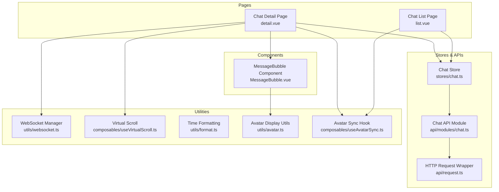
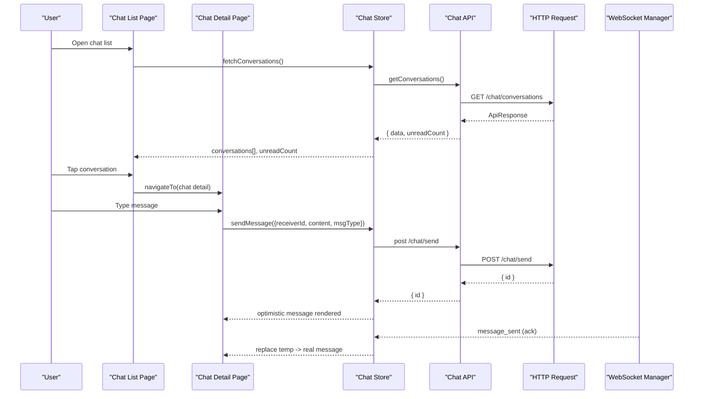
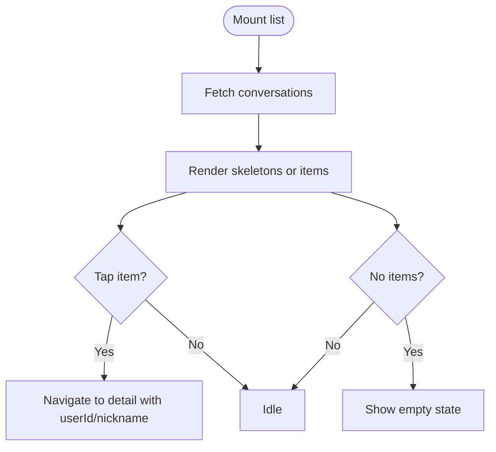
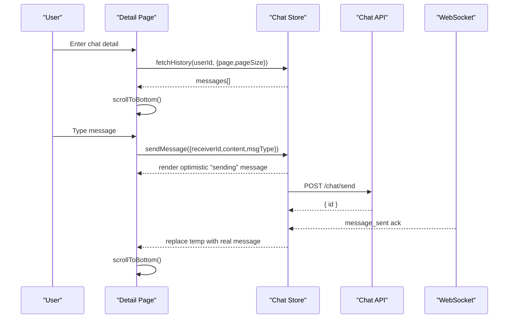
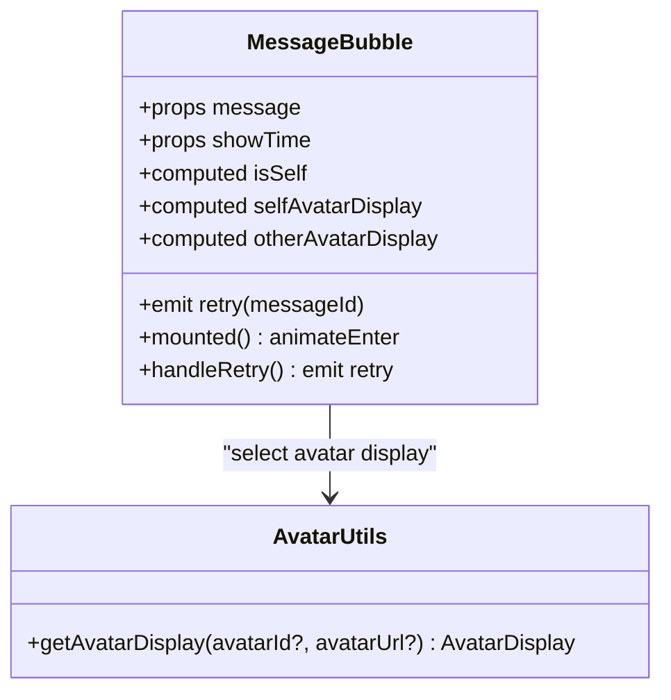
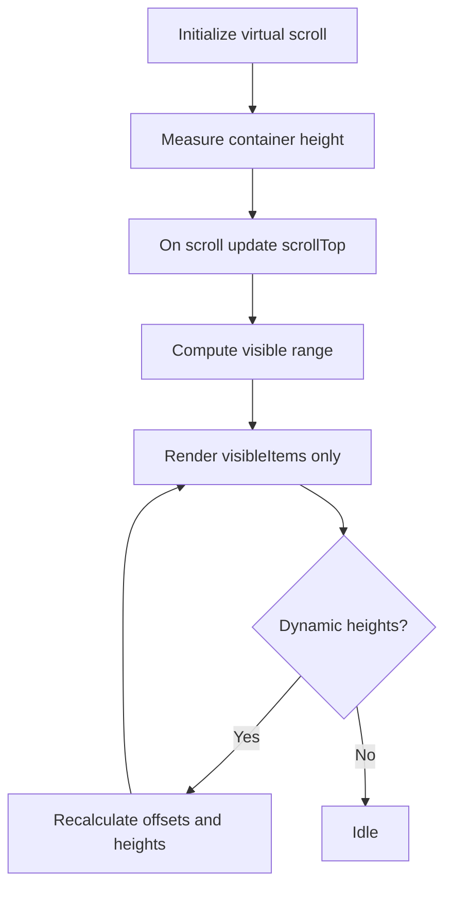
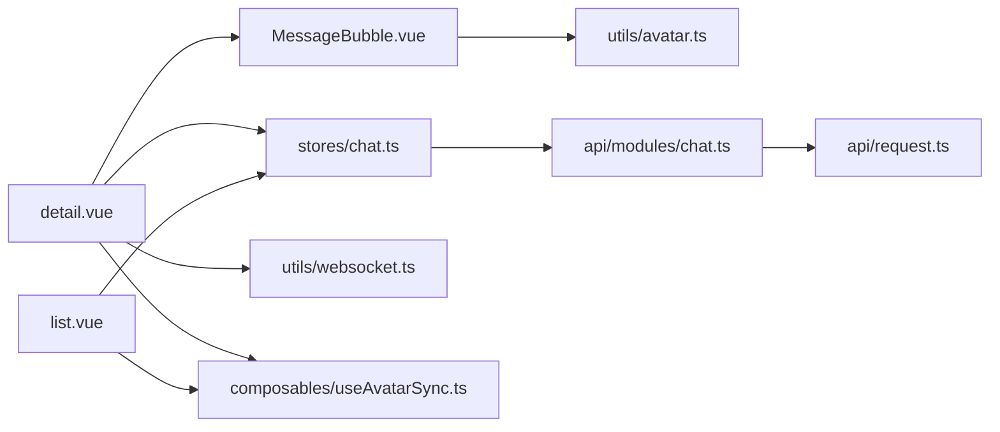

# Chat UI Components

<cite>
**Referenced Files in This Document**
- [list.vue](file://src/pages/chat/list.vue)
- [detail.vue](file://src/pages/chat/detail.vue)
- [MessageBubble.vue](file://src/components/business/MessageBubble.vue)
- [chat.ts](file://src/stores/chat.ts)
- [useVirtualScroll.ts](file://src/composables/useVirtualScroll.ts)
- [chat.ts](file://src/api/modules/chat.ts)
- [websocket.ts](file://src/utils/websocket.ts)
- [format.ts](file://src/utils/format.ts)
- [avatar.ts](file://src/utils/avatar.ts)
- [useAvatarSync.ts](file://src/composables/useAvatarSync.ts)
- [backend-types.ts](file://src/types/api/backend-types.ts)
- [enums.ts](file://src/types/enums.ts)
- [request.ts](file://src/api/request.ts)
</cite>

## Table of Contents
1. [Introduction](#introduction)
2. [Project Structure](#project-structure)
3. [Core Components](#core-components)
4. [Architecture Overview](#architecture-overview)
5. [Detailed Component Analysis](#detailed-component-analysis)
6. [Dependency Analysis](#dependency-analysis)
7. [Performance Considerations](#performance-considerations)
8. [Accessibility and Cross-Platform Compatibility](#accessibility-and-cross-platform-compatibility)
9. [Troubleshooting Guide](#troubleshooting-guide)
10. [Conclusion](#conclusion)

## Introduction
This document provides comprehensive documentation for the chat user interface components and pages in a cross-platform H5 and mini-program environment built with Vue 3 and Pinia. It covers:
- Chat list page: conversation previews, unread counts, and empty states
- Chat detail page: message threading, input handling, attachment support, and scroll management
- MessageBubble component: rendering for different message types and statuses
- Responsive design patterns and virtual scrolling for large histories
- Examples for typing indicators, message status icons, and context menus
- Accessibility, keyboard navigation, and cross-platform compatibility considerations

## Project Structure
The chat feature is organized around three primary areas:
- Pages: list and detail views for chat navigation and messaging
- Business components: reusable MessageBubble for rendering messages
- Stores and APIs: centralized state management and backend integration
- Utilities: formatting, avatar display, virtual scrolling, and WebSocket connectivity

**Diagram sources**
- [list.vue:1-311](file://src/pages/chat/list.vue#L1-L311)
- [detail.vue:1-299](file://src/pages/chat/detail.vue#L1-L299)
- [MessageBubble.vue:1-309](file://src/components/business/MessageBubble.vue#L1-L309)
- [chat.ts:1-234](file://src/stores/chat.ts#L1-L234)
- [chat.ts:1-42](file://src/api/modules/chat.ts#L1-L42)
- [request.ts:1-228](file://src/api/request.ts#L1-L228)
- [websocket.ts:1-171](file://src/utils/websocket.ts#L1-L171)
- [useVirtualScroll.ts:1-246](file://src/composables/useVirtualScroll.ts#L1-L246)
- [format.ts:1-38](file://src/utils/format.ts#L1-L38)
- [avatar.ts:1-93](file://src/utils/avatar.ts#L1-L93)
- [useAvatarSync.ts:1-72](file://src/composables/useAvatarSync.ts#L1-L72)

**Section sources**
- [list.vue:1-311](file://src/pages/chat/list.vue#L1-L311)
- [detail.vue:1-299](file://src/pages/chat/detail.vue#L1-L299)
- [MessageBubble.vue:1-309](file://src/components/business/MessageBubble.vue#L1-L309)
- [chat.ts:1-234](file://src/stores/chat.ts#L1-L234)
- [chat.ts:1-42](file://src/api/modules/chat.ts#L1-L42)
- [request.ts:1-228](file://src/api/request.ts#L1-L228)
- [websocket.ts:1-171](file://src/utils/websocket.ts#L1-L171)
- [useVirtualScroll.ts:1-246](file://src/composables/useVirtualScroll.ts#L1-L246)
- [format.ts:1-38](file://src/utils/format.ts#L1-L38)
- [avatar.ts:1-93](file://src/utils/avatar.ts#L1-L93)
- [useAvatarSync.ts:1-72](file://src/composables/useAvatarSync.ts#L1-L72)

## Core Components
- Chat List Page: renders conversation previews with avatars, nicknames, last message, timestamps, and unread indicators. Supports skeleton loading and empty states.
- Chat Detail Page: displays threaded messages, handles input and send actions, manages loading states, and scrolls to bottom automatically.
- MessageBubble Component: renders individual messages with sender avatar, content, status indicators, and optional time markers. Supports self vs other alignment and avatar display modes.
- Chat Store: orchestrates fetching conversations, message history, sending messages, marking as read, and WebSocket-driven updates.
- Virtual Scrolling: composable helpers to render large message lists efficiently.
- Utilities: time formatting, avatar display logic, avatar synchronization hook, and WebSocket manager.

**Section sources**
- [list.vue:1-311](file://src/pages/chat/list.vue#L1-L311)
- [detail.vue:1-299](file://src/pages/chat/detail.vue#L1-L299)
- [MessageBubble.vue:1-309](file://src/components/business/MessageBubble.vue#L1-L309)
- [chat.ts:1-234](file://src/stores/chat.ts#L1-L234)
- [useVirtualScroll.ts:1-246](file://src/composables/useVirtualScroll.ts#L1-L246)
- [format.ts:1-38](file://src/utils/format.ts#L1-L38)
- [avatar.ts:1-93](file://src/utils/avatar.ts#L1-L93)
- [useAvatarSync.ts:1-72](file://src/composables/useAvatarSync.ts#L1-L72)

## Architecture Overview
The chat architecture follows a unidirectional data flow:
- Pages trigger actions via store methods.
- Store interacts with API module and HTTP wrapper.
- WebSocket events update store state in real time.
- Components subscribe to reactive store state and render accordingly.

**Diagram sources**
- [list.vue:78-97](file://src/pages/chat/list.vue#L78-L97)
- [detail.vue:131-148](file://src/pages/chat/detail.vue#L131-L148)
- [chat.ts:14-90](file://src/stores/chat.ts#L14-L90)
- [chat.ts:18-41](file://src/api/modules/chat.ts#L18-L41)
- [request.ts:75-208](file://src/api/request.ts#L75-L208)
- [websocket.ts:93-111](file://src/utils/websocket.ts#L93-L111)

## Detailed Component Analysis

### Chat List Page
Responsibilities:
- Load and display conversation previews with avatar, nickname, last message, and timestamp
- Show unread dot and badge for unread counts
- Support skeleton loading and empty state
- Navigate to chat detail on selection

Key behaviors:
- Uses a computed wrapper for avatar sync to keep avatars up-to-date across list items
- Uses time formatting utility for human-friendly timestamps
- Emits retry action for failed messages in detail (via bubble component)

**Diagram sources**
- [list.vue:78-97](file://src/pages/chat/list.vue#L78-L97)
- [format.ts:8-23](file://src/utils/format.ts#L8-L23)

**Section sources**
- [list.vue:1-311](file://src/pages/chat/list.vue#L1-L311)
- [useAvatarSync.ts:1-72](file://src/composables/useAvatarSync.ts#L1-L72)
- [format.ts:1-38](file://src/utils/format.ts#L1-L38)

### Chat Detail Page
Responsibilities:
- Display message thread with time markers and status indicators
- Handle input, send button, and retry actions
- Auto-scroll to bottom on mount and new messages
- Manage loading states and network checks before sending
- Integrate with WebSocket for live updates

Key behaviors:
- Optimistic UI: adds temporary “sending” message immediately upon send
- Retry mechanism: re-sends failed messages
- Scroll management: uses anchor element and scroll-into-view to keep latest message in view
- Avatar sync for sender avatars

**Diagram sources**
- [detail.vue:77-102](file://src/pages/chat/detail.vue#L77-L102)
- [detail.vue:116-129](file://src/pages/chat/detail.vue#L116-L129)
- [detail.vue:131-148](file://src/pages/chat/detail.vue#L131-L148)
- [chat.ts:50-90](file://src/stores/chat.ts#L50-L90)
- [websocket.ts:93-111](file://src/utils/websocket.ts#L93-L111)

**Section sources**
- [detail.vue:1-299](file://src/pages/chat/detail.vue#L1-L299)
- [chat.ts:1-234](file://src/stores/chat.ts#L1-L234)
- [websocket.ts:1-171](file://src/utils/websocket.ts#L1-L171)

### MessageBubble Component
Responsibilities:
- Render message content with appropriate styling for self vs other
- Display sender avatar (custom or preset MBTI)
- Show message status indicators (sending, failed)
- Optional time marker above message
- Provide retry action for failed messages

Rendering logic:
- Self messages: right-aligned with own avatar on the right
- Other messages: left-aligned with sender avatar on the left
- Status indicators: small loading dots for sending, clickable error indicator for failed
- Avatar display: custom URL or preset MBTI icon fallback

**Diagram sources**
- [MessageBubble.vue:68-115](file://src/components/business/MessageBubble.vue#L68-L115)
- [avatar.ts:53-92](file://src/utils/avatar.ts#L53-L92)

**Section sources**
- [MessageBubble.vue:1-309](file://src/components/business/MessageBubble.vue#L1-L309)
- [avatar.ts:1-93](file://src/utils/avatar.ts#L1-L93)

### Virtual Scrolling for Large Histories
The virtual scrolling composable supports:
- Fixed-height items with buffer zones
- Dynamic-height items with measured heights and offset caches
- Scroll event handling and visible range calculation
- Helper functions to measure item height and scroll to index

Usage patterns:
- Wrap long message lists with virtualized container
- Measure dynamic item heights after mount
- Keep buffer size reasonable to avoid blank areas during fast scroll

**Diagram sources**
- [useVirtualScroll.ts:15-79](file://src/composables/useVirtualScroll.ts#L15-L79)
- [useVirtualScroll.ts:91-211](file://src/composables/useVirtualScroll.ts#L91-L211)

**Section sources**
- [useVirtualScroll.ts:1-246](file://src/composables/useVirtualScroll.ts#L1-L246)

### Attachment Support and Message Types
- Message types supported include text, image, and emoji (as per enums)
- Current detail page sends text messages; image/emoji support would require extending input and API integration
- Store and API module accept a message type field for future expansion

**Section sources**
- [enums.ts:7-11](file://src/types/enums.ts#L7-L11)
- [chat.ts:6-10](file://src/api/modules/chat.ts#L6-L10)
- [chat.ts:50-90](file://src/stores/chat.ts#L50-L90)

### Typing Indicators and Context Menus
- Typing indicators: can be implemented by rendering a dedicated UI element above the input bar when remote user is typing (requires backend signaling)
- Context menus: can be added to bubbles by exposing actions (copy, delete, retry) via bubble props and handlers

[No sources needed since this section provides conceptual guidance]

## Dependency Analysis
High-level dependencies:
- Pages depend on store for state and actions
- Store depends on API module and HTTP wrapper
- WebSocket manager updates store with real-time events
- Components depend on utilities for formatting and avatar display
- Avatar sync hook listens to global events to update list avatars

**Diagram sources**
- [list.vue:60-76](file://src/pages/chat/list.vue#L60-L76)
- [detail.vue:50-69](file://src/pages/chat/detail.vue#L50-L69)
- [MessageBubble.vue:68-104](file://src/components/business/MessageBubble.vue#L68-L104)
- [chat.ts:1-234](file://src/stores/chat.ts#L1-L234)
- [chat.ts:1-42](file://src/api/modules/chat.ts#L1-L42)
- [request.ts:1-228](file://src/api/request.ts#L1-L228)
- [websocket.ts:1-171](file://src/utils/websocket.ts#L1-L171)
- [useAvatarSync.ts:1-72](file://src/composables/useAvatarSync.ts#L1-L72)

**Section sources**
- [list.vue:1-311](file://src/pages/chat/list.vue#L1-L311)
- [detail.vue:1-299](file://src/pages/chat/detail.vue#L1-L299)
- [MessageBubble.vue:1-309](file://src/components/business/MessageBubble.vue#L1-L309)
- [chat.ts:1-234](file://src/stores/chat.ts#L1-L234)
- [chat.ts:1-42](file://src/api/modules/chat.ts#L1-L42)
- [request.ts:1-228](file://src/api/request.ts#L1-L228)
- [websocket.ts:1-171](file://src/utils/websocket.ts#L1-L171)
- [useAvatarSync.ts:1-72](file://src/composables/useAvatarSync.ts#L1-L72)

## Performance Considerations
- Prefer virtual scrolling for long message histories to reduce DOM nodes
- Debounce send actions to prevent rapid repeated submissions
- Use avatar sync to avoid redundant re-renders when avatars change globally
- Lazy-load images and limit heavy animations on low-end devices
- Avoid unnecessary watchers and computations; leverage computed properties

[No sources needed since this section provides general guidance]

## Accessibility and Cross-Platform Compatibility
- Keyboard navigation: ensure input fields receive focus and submit on Enter; provide skip links for long message lists
- Screen readers: label avatars and status indicators with meaningful alt text; announce message status changes
- Touch targets: ensure send button and retry controls are adequately sized
- Mini-program/H5 parity: use platform-agnostic APIs (uni-app) for scroll, input, and navigation; test on both environments
- Dark mode and contrast: verify readability of message bubbles and input areas

[No sources needed since this section provides general guidance]

## Troubleshooting Guide
Common issues and resolutions:
- Messages not appearing after send:
  - Verify optimistic update and WebSocket acknowledgment flow
  - Check for duplicate message prevention and message deduplication logic
- Unread count not resetting:
  - Ensure mark-as-read API is called when entering chat detail
- Avatars not updating:
  - Confirm avatar sync hook is mounted and listening to global avatar update events
- Scroll not reaching bottom:
  - Ensure bottom anchor is present and scroll-into-view is set after DOM updates
- Network errors:
  - Use network status checks before sending and handle token refresh failures gracefully

**Section sources**
- [chat.ts:92-158](file://src/stores/chat.ts#L92-L158)
- [chat.ts:161-210](file://src/stores/chat.ts#L161-L210)
- [detail.vue:110-114](file://src/pages/chat/detail.vue#L110-L114)
- [useAvatarSync.ts:60-66](file://src/composables/useAvatarSync.ts#L60-L66)
- [request.ts:100-147](file://src/api/request.ts#L100-L147)

## Conclusion
The chat UI components provide a robust foundation for a responsive, real-time messaging experience across H5 and mini-programs. By leveraging virtual scrolling, optimistic updates, and a centralized store, the system scales to large histories while maintaining smooth interactions. Extending support for images and emojis, adding typing indicators, and enhancing context menus will further improve the user experience.