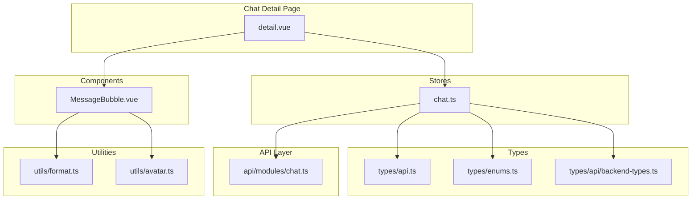
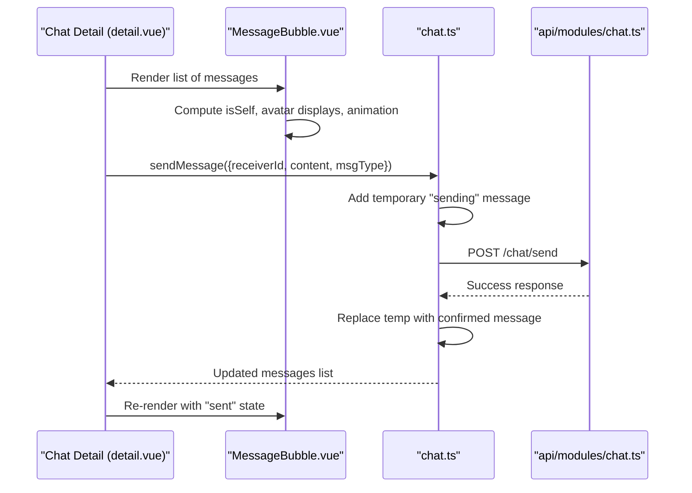
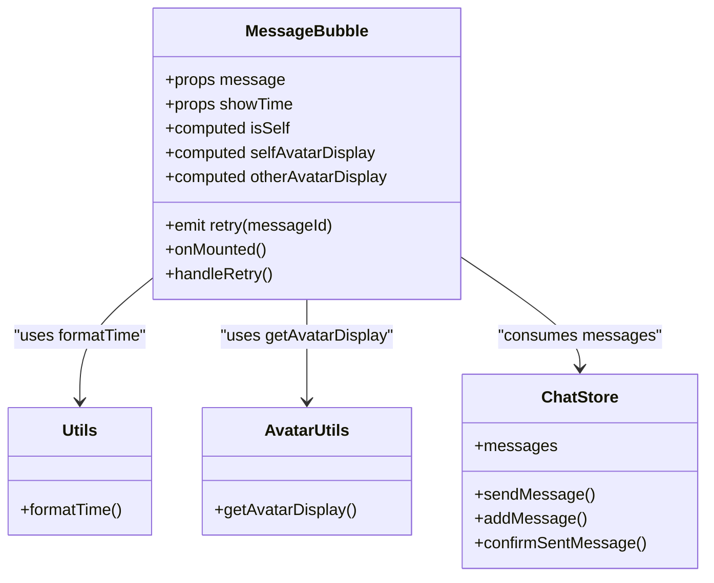

# Message Bubble Component

<cite>
**Referenced Files in This Document**
- [MessageBubble.vue](file://src/components/business/MessageBubble.vue)
- [detail.vue](file://src/pages/chat/detail.vue)
- [chat.ts](file://src/stores/chat.ts)
- [format.ts](file://src/utils/format.ts)
- [avatar.ts](file://src/utils/avatar.ts)
- [api.ts](file://src/types/api.ts)
- [enums.ts](file://src/types/enums.ts)
- [backend-types.ts](file://src/types/api/backend-types.ts)
- [chat.ts](file://src/api/modules/chat.ts)
- [useVirtualScroll.ts](file://src/composables/useVirtualScroll.ts)
</cite>

## Table of Contents
1. [Introduction](#introduction)
2. [Project Structure](#project-structure)
3. [Core Components](#core-components)
4. [Architecture Overview](#architecture-overview)
5. [Detailed Component Analysis](#detailed-component-analysis)
6. [Dependency Analysis](#dependency-analysis)
7. [Performance Considerations](#performance-considerations)
8. [Troubleshooting Guide](#troubleshooting-guide)
9. [Conclusion](#conclusion)

## Introduction
This document describes the MessageBubble component architecture used in the chat feature. It covers message types (text and image placeholders), message states (sending, sent, failed), props interface, styling variations for sent vs received messages, responsive design patterns, timestamp formatting, avatar integration, interactive elements, custom layout examples, animation effects, accessibility considerations, and performance/memory management for large message lists.

## Project Structure
The MessageBubble component is part of the business components and integrates with the chat store, API layer, and utilities for formatting and avatar display. The chat detail page renders a list of MessageBubble instances and handles user interactions such as sending and retrying messages.

**Diagram sources**
- [detail.vue:1-299](file://src/pages/chat/detail.vue#L1-L299)
- [MessageBubble.vue:1-309](file://src/components/business/MessageBubble.vue#L1-L309)
- [chat.ts:1-234](file://src/stores/chat.ts#L1-L234)
- [chat.ts:1-45](file://src/api/modules/chat.ts#L1-L45)
- [format.ts:1-38](file://src/utils/format.ts#L1-L38)
- [avatar.ts:1-93](file://src/utils/avatar.ts#L1-L93)
- [api.ts:26-34](file://src/types/api.ts#L26-L34)
- [enums.ts:7-11](file://src/types/enums.ts#L7-L11)
- [backend-types.ts:54-57](file://src/types/api/backend-types.ts#L54-L57)

**Section sources**
- [detail.vue:1-299](file://src/pages/chat/detail.vue#L1-L299)
- [MessageBubble.vue:1-309](file://src/components/business/MessageBubble.vue#L1-L309)
- [chat.ts:1-234](file://src/stores/chat.ts#L1-L234)
- [chat.ts:1-45](file://src/api/modules/chat.ts#L1-L45)
- [format.ts:1-38](file://src/utils/format.ts#L1-L38)
- [avatar.ts:1-93](file://src/utils/avatar.ts#L1-L93)
- [api.ts:26-34](file://src/types/api.ts#L26-L34)
- [enums.ts:7-11](file://src/types/enums.ts#L7-L11)
- [backend-types.ts:54-57](file://src/types/api/backend-types.ts#L54-L57)

## Core Components
- MessageBubble.vue: Renders individual chat messages with support for text content, avatar display, status indicators, and animations.
- detail.vue: Hosts the chat UI, renders the message list, and manages input and retry actions.
- chat.ts (store): Manages message lifecycle, optimistic updates, WebSocket handling, and status transitions.
- format.ts: Provides timestamp formatting helpers used by the component.
- avatar.ts: Computes avatar display logic for both preset and custom avatars.
- Types: Define message shape, message types, and related enums.

**Section sources**
- [MessageBubble.vue:74-114](file://src/components/business/MessageBubble.vue#L74-L114)
- [detail.vue:11-17](file://src/pages/chat/detail.vue#L11-L17)
- [chat.ts:50-90](file://src/stores/chat.ts#L50-L90)
- [format.ts:8-23](file://src/utils/format.ts#L8-L23)
- [avatar.ts:53-92](file://src/utils/avatar.ts#L53-L92)
- [api.ts:26-34](file://src/types/api.ts#L26-L34)
- [enums.ts:7-11](file://src/types/enums.ts#L7-L11)

## Architecture Overview
The MessageBubble component is a leaf-level UI element that depends on:
- Props: message object and optional showTime flag
- Computed logic: determines self vs other, avatar display, and entering animation
- Events: retry emission for failed messages
- Styles: responsive layout, sent/received variants, and animations

The chat detail page composes MessageBubble instances and wires retry events to the store’s send action. The store manages message states and optimistic updates during send/receive cycles.

**Diagram sources**
- [detail.vue:131-148](file://src/pages/chat/detail.vue#L131-L148)
- [MessageBubble.vue:74-114](file://src/components/business/MessageBubble.vue#L74-L114)
- [chat.ts:50-90](file://src/stores/chat.ts#L50-L90)
- [chat.ts:161-210](file://src/stores/chat.ts#L161-L210)
- [chat.ts:18-45](file://src/api/modules/chat.ts#L18-L45)

## Detailed Component Analysis

### Props Interface
- message: Object containing at least id, senderId, receiverId, content, msgType, createdAt, and optional sender info. The store adds isSelf for rendering decisions.
- showTime?: Boolean to conditionally render a centered timestamp above the bubble.

These props are consumed to compute styles, avatar display, and status indicators.

**Section sources**
- [MessageBubble.vue:74-77](file://src/components/business/MessageBubble.vue#L74-L77)
- [api.ts:26-34](file://src/types/api.ts#L26-L34)
- [chat.ts:34-47](file://src/stores/chat.ts#L34-L47)

### Message Types and States
- Text messages: Displayed as plain text inside the bubble.
- Image attachments: The component currently renders text content. Image rendering would require extending the template and props to include image URLs and metadata.
- System notifications: Not implemented in the current component; could be modeled as special message types with distinct styling.
- Special states:
  - Sending: Shown as animated dots for self-sent messages.
  - Sent: Default bubble appearance after successful send.
  - Failed: Shows an error indicator with retry capability.

The store manages optimistic updates and status transitions for sending/sent/failed states.

**Section sources**
- [MessageBubble.vue:29-39](file://src/components/business/MessageBubble.vue#L29-L39)
- [chat.ts:50-90](file://src/stores/chat.ts#L50-L90)
- [enums.ts:7-11](file://src/types/enums.ts#L7-L11)
- [backend-types.ts:54-57](file://src/types/api/backend-types.ts#L54-L57)

### Styling Variations (Sent vs Received)
- Self (sent):
  - Right-aligned layout with avatar on the right
  - Green background bubble
  - Status indicator on the left (dots or error icon)
- Other (received):
  - Left-aligned layout with avatar on the left
  - White background bubble with subtle shadow
  - No status indicator

Responsive patterns:
- Flexbox-based layout with avatar and content wrappers
- Max-width constraints on content to prevent overflow
- Relative units (rpx) for scalable sizing across devices

**Section sources**
- [MessageBubble.vue:240-284](file://src/components/business/MessageBubble.vue#L240-L284)
- [MessageBubble.vue:172-190](file://src/components/business/MessageBubble.vue#L172-L190)

### Timestamp Formatting
- Centered timestamp shown above the bubble when enabled
- Uses a helper that formats time differently depending on age:
  - Same day: HH:mm
  - Yesterday: “Yesterday”
  - Within a week: weekday name
  - Older: MM-DD

**Section sources**
- [MessageBubble.vue:4-6](file://src/components/business/MessageBubble.vue#L4-L6)
- [format.ts:8-23](file://src/utils/format.ts#L8-L23)

### Avatar Integration
- Two avatar modes:
  - Preset (MBTI): Displays an emoji icon within a gradient circle
  - Custom: Displays an image URL
- Avatar selection logic prioritizes custom avatar URL; falls back to MBTI icon if configured; otherwise defaults to a static fallback image.

**Section sources**
- [MessageBubble.vue:10-25](file://src/components/business/MessageBubble.vue#L10-L25)
- [MessageBubble.vue:48-63](file://src/components/business/MessageBubble.vue#L48-L63)
- [avatar.ts:53-92](file://src/utils/avatar.ts#L53-L92)

### Interactive Elements
- Retry button for failed messages:
  - Emits a retry event with message id
  - Parent retries sending via the store
- Reply button: Not present in the current component; can be added as a slot or prop-driven action.

**Section sources**
- [MessageBubble.vue:37-39](file://src/components/business/MessageBubble.vue#L37-L39)
- [MessageBubble.vue:112-114](file://src/components/business/MessageBubble.vue#L112-L114)
- [detail.vue:150-163](file://src/pages/chat/detail.vue#L150-L163)

### Animation Effects
- Slide-in animation on initial render
- Dots animation for sending status
- Press feedback for error indicator

**Section sources**
- [MessageBubble.vue:84-110](file://src/components/business/MessageBubble.vue#L84-L110)
- [MessageBubble.vue:287-307](file://src/components/business/MessageBubble.vue#L287-L307)

### Accessibility Features
- Semantic structure with text nodes for content
- Focusable elements for interactive controls (retry)
- Sufficient color contrast between backgrounds and text
- Screen reader-friendly labels via aria attributes can be added if needed

[No sources needed since this section provides general guidance]

### Custom Layout Examples
- Extend the template to render images alongside text by adding image slots and conditional rendering.
- Add message actions (reply, forward, delete) via additional slots or props.
- Introduce system notification bubbles by checking a special message type and applying distinct styling.

[No sources needed since this section provides general guidance]

### Message Model and Types
- Message interface includes id, senderId, receiverId, content, msgType, createdAt, and optional sender info.
- Enums define message types (TEXT, IMAGE, EMOJI) and related statuses.

**Section sources**
- [api.ts:26-34](file://src/types/api.ts#L26-L34)
- [enums.ts:7-11](file://src/types/enums.ts#L7-L11)
- [backend-types.ts:54-57](file://src/types/api/backend-types.ts#L54-L57)

## Dependency Analysis
MessageBubble depends on:
- Computed values for isSelf and avatar display
- Utility functions for time formatting
- Store-provided message list and retry handling

**Diagram sources**
- [MessageBubble.vue:68-114](file://src/components/business/MessageBubble.vue#L68-L114)
- [chat.ts:100-210](file://src/stores/chat.ts#L100-L210)
- [format.ts:8-23](file://src/utils/format.ts#L8-L23)
- [avatar.ts:53-92](file://src/utils/avatar.ts#L53-L92)

**Section sources**
- [MessageBubble.vue:68-114](file://src/components/business/MessageBubble.vue#L68-L114)
- [chat.ts:100-210](file://src/stores/chat.ts#L100-L210)
- [format.ts:8-23](file://src/utils/format.ts#L8-L23)
- [avatar.ts:53-92](file://src/utils/avatar.ts#L53-L92)

## Performance Considerations
- Rendering large message lists:
  - Use virtual scrolling to render only visible items and reduce DOM overhead.
  - The project includes a virtual scroll composable suitable for fixed-height items or dynamic heights.
- Image memory management:
  - Prefer compressed images and lazy loading.
  - Avoid storing large base64 blobs; use URLs and rely on platform caching.
- Optimistic updates:
  - The store adds temporary “sending” messages immediately, improving perceived responsiveness.
- Debouncing and throttling:
  - Use debounced actions for send/retry to avoid redundant network calls.

**Section sources**
- [useVirtualScroll.ts:15-79](file://src/composables/useVirtualScroll.ts#L15-L79)
- [useVirtualScroll.ts:91-211](file://src/composables/useVirtualScroll.ts#L91-L211)
- [chat.ts:50-90](file://src/stores/chat.ts#L50-L90)

## Troubleshooting Guide
- Messages not appearing:
  - Verify isSelf computation and senderId/createdAt normalization in the store.
- Avatar not displaying:
  - Check avatar URL validity and fallback logic.
- Retry not working:
  - Ensure retry event is emitted and handled by the parent page to re-send via the store.
- Timestamp not updating:
  - Confirm formatTime locale and dayjs plugin initialization.

**Section sources**
- [chat.ts:34-47](file://src/stores/chat.ts#L34-L47)
- [avatar.ts:53-92](file://src/utils/avatar.ts#L53-L92)
- [MessageBubble.vue:112-114](file://src/components/business/MessageBubble.vue#L112-L114)
- [format.ts:8-23](file://src/utils/format.ts#L8-L23)

## Conclusion
The MessageBubble component provides a robust foundation for chat messaging with clear separation of concerns between UI, store logic, and utilities. It supports text messages, avatar customization, status indicators, and animations. Extending it to support images and system notifications involves minimal template and prop changes. For large-scale chats, adopt virtual scrolling and image optimization strategies to maintain performance and memory efficiency.