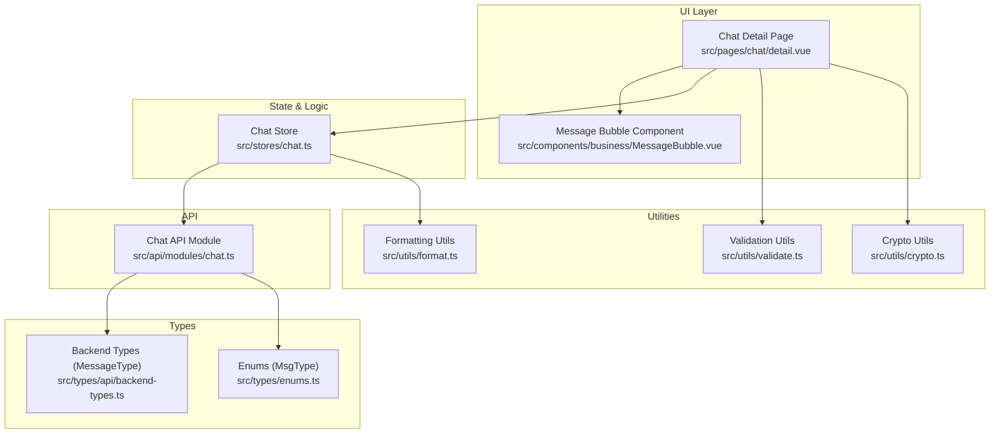
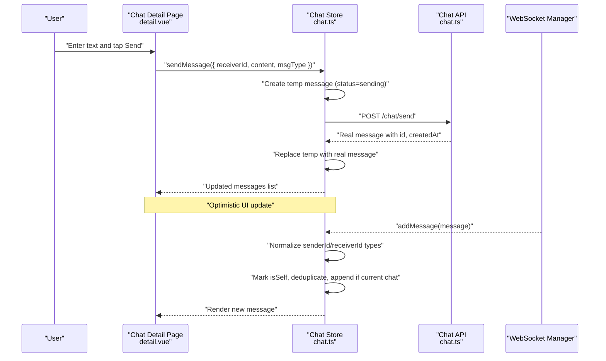
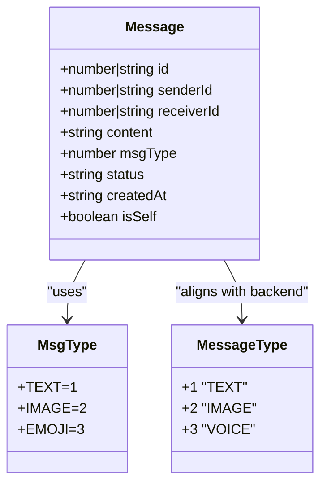
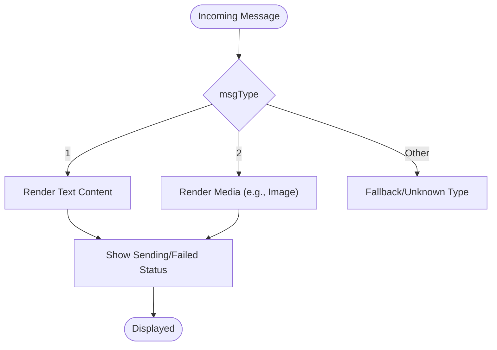
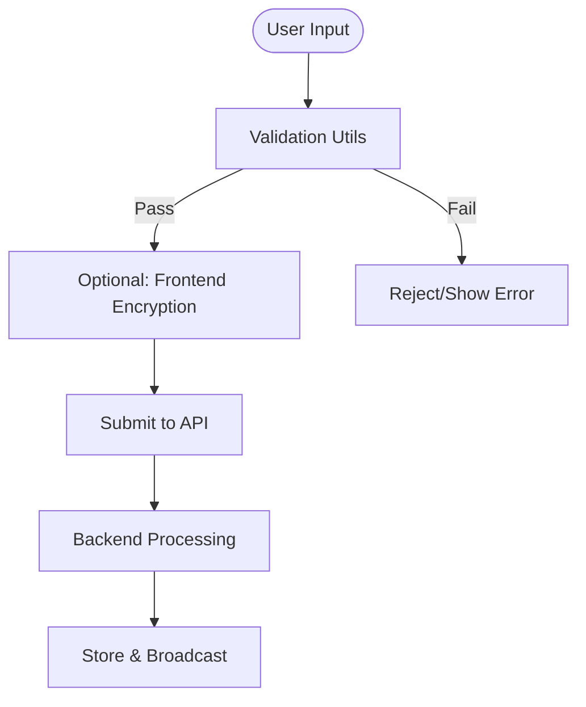
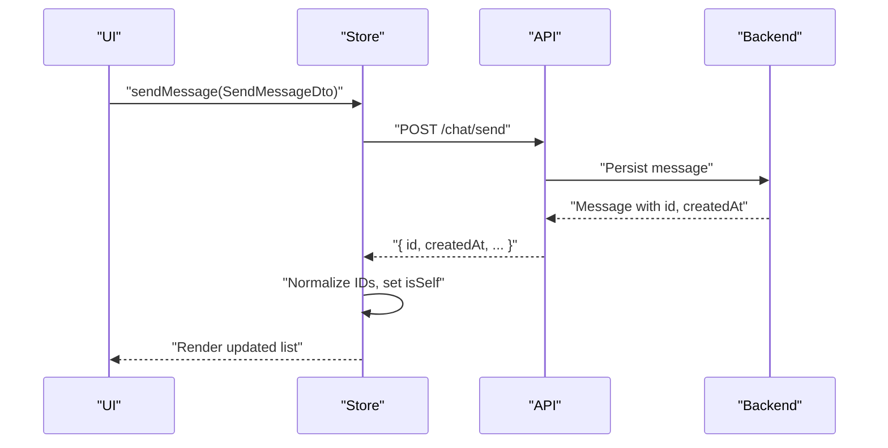
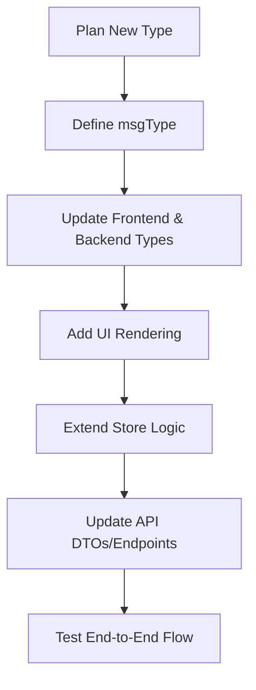
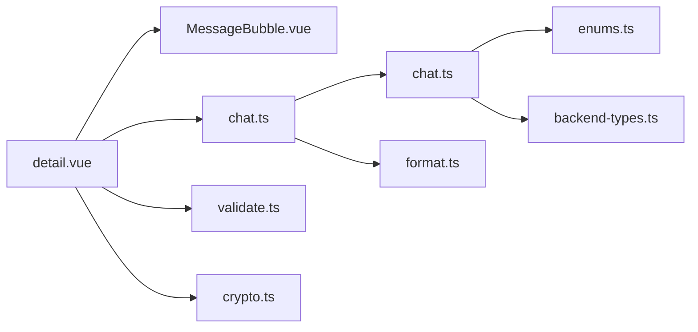

# Message Types & Formats

<cite>
**Referenced Files in This Document**
- [chat.ts](file://src/stores/chat.ts)
- [chat.ts](file://src/api/modules/chat.ts)
- [enums.ts](file://src/types/enums.ts)
- [backend-types.ts](file://src/types/api/backend-types.ts)
- [detail.vue](file://src/pages/chat/detail.vue)
- [MessageBubble.vue](file://src/components/business/MessageBubble.vue)
- [format.ts](file://src/utils/format.ts)
- [crypto.ts](file://src/utils/crypto.ts)
- [validate.ts](file://src/utils/validate.ts)
</cite>

## Table of Contents
1. [Introduction](#introduction)
2. [Project Structure](#project-structure)
3. [Core Components](#core-components)
4. [Architecture Overview](#architecture-overview)
5. [Detailed Component Analysis](#detailed-component-analysis)
6. [Dependency Analysis](#dependency-analysis)
7. [Performance Considerations](#performance-considerations)
8. [Troubleshooting Guide](#troubleshooting-guide)
9. [Conclusion](#conclusion)
10. [Appendices](#appendices)

## Introduction
This document describes the message types and data formats used by the WeTogether chat system. It covers the message object structure, supported content types, metadata, timestamps, categories (text, media, system notifications, ephemeral), validation and security checks, serialization/deserialization, internationalization and rich text considerations, emoji handling, and guidelines for extending the system with new message types and custom handlers. It also outlines current encryption and integrity mechanisms present in the codebase.

## Project Structure
The chat messaging feature spans several layers:
- UI pages and components render and collect user input for messages.
- Stores manage message state, optimistic updates, and WebSocket-driven synchronization.
- APIs define DTOs and endpoints for sending, retrieving, and marking messages as read.
- Types define message and enumeration structures used across the system.
- Utilities provide formatting, validation, and cryptographic helpers.

**Diagram sources**
- [detail.vue:1-299](file://src/pages/chat/detail.vue#L1-L299)
- [MessageBubble.vue:1-309](file://src/components/business/MessageBubble.vue#L1-L309)
- [chat.ts:1-234](file://src/stores/chat.ts#L1-L234)
- [chat.ts:1-42](file://src/api/modules/chat.ts#L1-L42)
- [enums.ts:1-41](file://src/types/enums.ts#L1-L41)
- [backend-types.ts:1-764](file://src/types/api/backend-types.ts#L1-L764)
- [format.ts:1-38](file://src/utils/format.ts#L1-L38)
- [crypto.ts:1-18](file://src/utils/crypto.ts#L1-L18)
- [validate.ts:1-15](file://src/utils/validate.ts#L1-L15)

**Section sources**
- [detail.vue:1-299](file://src/pages/chat/detail.vue#L1-L299)
- [MessageBubble.vue:1-309](file://src/components/business/MessageBubble.vue#L1-L309)
- [chat.ts:1-234](file://src/stores/chat.ts#L1-L234)
- [chat.ts:1-42](file://src/api/modules/chat.ts#L1-L42)
- [enums.ts:1-41](file://src/types/enums.ts#L1-L41)
- [backend-types.ts:1-764](file://src/types/api/backend-types.ts#L1-L764)
- [format.ts:1-38](file://src/utils/format.ts#L1-L38)
- [crypto.ts:1-18](file://src/utils/crypto.ts#L1-L18)
- [validate.ts:1-15](file://src/utils/validate.ts#L1-L15)

## Core Components
- Message object structure
  - Fields observed in the frontend store and UI:
    - id: number | string
    - senderId: number | string
    - receiverId: number | string
    - content: string
    - msgType: number (maps to MsgType)
    - status: string ('sending', 'failed', or backend-provided state)
    - createdAt: ISO string timestamp
    - isSelf: boolean flag derived from current user
    - Additional optional fields may be present (e.g., sender profile) depending on backend payload and mapping.
  - Backend types define MessageType as 1 | 2 | 3, aligning with MsgType enum.

- Supported message categories
  - Text messages: content is a UTF-8 string; msgType defaults to 1 (TEXT).
  - Media attachments: msgType 2 (IMAGE) is defined; content may carry a URL or structured payload depending on backend.
  - System notifications: not explicitly modeled in the current frontend store; could be delivered via special msgType or separate channels.
  - Ephemeral messages: not currently defined in the codebase; future extension would require new msgType and UI/behavior changes.

- Timestamps and metadata
  - createdAt is stored as an ISO string and formatted for display.
  - Additional metadata such as avatar info and sender profile may be attached conditionally.

- Validation and security checks
  - Input validation utilities exist for mobile, password, code, and nickname; while not directly applied to messages, they reflect the project’s validation patterns.
  - Password hashing uses SHA256 in the frontend crypto utility; note that backend typically applies stronger KDFs.

**Section sources**
- [chat.ts:36-47](file://src/stores/chat.ts#L36-L47)
- [chat.ts:50-90](file://src/stores/chat.ts#L50-L90)
- [chat.ts:100-158](file://src/stores/chat.ts#L100-L158)
- [chat.ts:161-210](file://src/stores/chat.ts#L161-L210)
- [enums.ts:7-11](file://src/types/enums.ts#L7-L11)
- [backend-types.ts:54-57](file://src/types/api/backend-types.ts#L54-L57)
- [format.ts:8-23](file://src/utils/format.ts#L8-L23)
- [validate.ts:1-15](file://src/utils/validate.ts#L1-L15)
- [crypto.ts:8-16](file://src/utils/crypto.ts#L8-L16)

## Architecture Overview
The chat flow integrates UI input, optimistic updates, API communication, and WebSocket-driven real-time synchronization.

**Diagram sources**
- [detail.vue:131-148](file://src/pages/chat/detail.vue#L131-L148)
- [chat.ts:50-90](file://src/stores/chat.ts#L50-L90)
- [chat.ts:100-158](file://src/stores/chat.ts#L100-L158)
- [chat.ts:18-26](file://src/api/modules/chat.ts#L18-L26)

**Section sources**
- [detail.vue:131-148](file://src/pages/chat/detail.vue#L131-L148)
- [chat.ts:50-90](file://src/stores/chat.ts#L50-L90)
- [chat.ts:100-158](file://src/stores/chat.ts#L100-L158)
- [chat.ts:18-26](file://src/api/modules/chat.ts#L18-L26)

## Detailed Component Analysis

### Message Object Model
The message object is normalized across the store and UI. The frontend converts backend string IDs to numbers for comparison and adds flags like isSelf. The UI renders content and status indicators.

**Diagram sources**
- [chat.ts:36-47](file://src/stores/chat.ts#L36-L47)
- [enums.ts:7-11](file://src/types/enums.ts#L7-L11)
- [backend-types.ts:54-57](file://src/types/api/backend-types.ts#L54-L57)

**Section sources**
- [chat.ts:36-47](file://src/stores/chat.ts#L36-L47)
- [enums.ts:7-11](file://src/types/enums.ts#L7-L11)
- [backend-types.ts:54-57](file://src/types/api/backend-types.ts#L54-L57)

### Message Categories and Rendering
- Text messages: rendered as plain text inside message bubbles; default msgType is 1.
- Media attachments: msgType 2 is defined; rendering depends on content interpretation (e.g., image URL).
- System notifications: not modeled in the current store; could be introduced via a dedicated msgType or separate channel.
- Ephemeral messages: not present; would require new msgType and lifecycle handling.

**Diagram sources**
- [MessageBubble.vue:42-44](file://src/components/business/MessageBubble.vue#L42-L44)
- [MessageBubble.vue:30-39](file://src/components/business/MessageBubble.vue#L30-L39)
- [enums.ts:7-11](file://src/types/enums.ts#L7-L11)

**Section sources**
- [MessageBubble.vue:42-44](file://src/components/business/MessageBubble.vue#L42-L44)
- [MessageBubble.vue:30-39](file://src/components/business/MessageBubble.vue#L30-L39)
- [enums.ts:7-11](file://src/types/enums.ts#L7-L11)

### Message Validation and Security
- Input validation: utilities exist for mobile, password, code, and nickname; while not directly applied to messages, they indicate validation patterns.
- Encryption: password hashing uses SHA256 in the frontend; backend typically applies stronger KDFs.
- Integrity: no explicit digital signature or end-to-end encryption is implemented in the current codebase.

**Diagram sources**
- [validate.ts:1-15](file://src/utils/validate.ts#L1-L15)
- [crypto.ts:8-16](file://src/utils/crypto.ts#L8-L16)
- [chat.ts:18-26](file://src/api/modules/chat.ts#L18-L26)

**Section sources**
- [validate.ts:1-15](file://src/utils/validate.ts#L1-L15)
- [crypto.ts:8-16](file://src/utils/crypto.ts#L8-L16)
- [chat.ts:18-26](file://src/api/modules/chat.ts#L18-L26)

### Serialization, Deserialization, and Transformations
- Serialization
  - Frontend sends SendMessageDto with receiverId, content, and optional msgType.
  - Backend responds with a normalized message including id and createdAt.
- Deserialization
  - Store maps backend fields to local keys and normalizes numeric IDs.
  - UI renders content and formats timestamps.
- Transformations
  - String IDs converted to numbers for comparisons.
  - isSelf flag derived from current user context.

**Diagram sources**
- [chat.ts:6-10](file://src/api/modules/chat.ts#L6-L10)
- [chat.ts:18-26](file://src/api/modules/chat.ts#L18-L26)
- [chat.ts:50-90](file://src/stores/chat.ts#L50-L90)
- [chat.ts:36-47](file://src/stores/chat.ts#L36-L47)

**Section sources**
- [chat.ts:6-10](file://src/api/modules/chat.ts#L6-L10)
- [chat.ts:18-26](file://src/api/modules/chat.ts#L18-L26)
- [chat.ts:50-90](file://src/stores/chat.ts#L50-L90)
- [chat.ts:36-47](file://src/stores/chat.ts#L36-L47)

### Internationalization Support, Rich Text, and Emoji
- Internationalization: the project includes an internationalization library; however, message content itself is not localized in the current chat implementation.
- Rich text: not implemented; content is treated as plain text.
- Emoji: not explicitly handled; UI renders content as-is, so emoji display depends on device/system support.

**Section sources**
- [format.ts:1-7](file://src/utils/format.ts#L1-L7)

### Extending Message Types and Handlers
Guidelines for adding new message types:
- Define a new msgType value and update both frontend and backend types.
- Add rendering logic in the message bubble component for the new type.
- Extend the store to handle new content shapes and statuses.
- Update API DTOs and endpoints accordingly.
- Consider security and validation for new content formats.

[No sources needed since this diagram shows conceptual workflow, not actual code structure]

## Dependency Analysis
The chat module exhibits clear separation of concerns:
- UI depends on store and components.
- Store depends on API and authentication state.
- API depends on shared types and DTOs.
- Utilities provide cross-cutting concerns (formatting, validation, crypto).

**Diagram sources**
- [detail.vue:1-299](file://src/pages/chat/detail.vue#L1-L299)
- [MessageBubble.vue:1-309](file://src/components/business/MessageBubble.vue#L1-L309)
- [chat.ts:1-234](file://src/stores/chat.ts#L1-L234)
- [chat.ts:1-42](file://src/api/modules/chat.ts#L1-L42)
- [enums.ts:1-41](file://src/types/enums.ts#L1-L41)
- [backend-types.ts:1-764](file://src/types/api/backend-types.ts#L1-L764)
- [format.ts:1-38](file://src/utils/format.ts#L1-L38)
- [validate.ts:1-15](file://src/utils/validate.ts#L1-L15)
- [crypto.ts:1-18](file://src/utils/crypto.ts#L1-L18)

**Section sources**
- [detail.vue:1-299](file://src/pages/chat/detail.vue#L1-L299)
- [MessageBubble.vue:1-309](file://src/components/business/MessageBubble.vue#L1-L309)
- [chat.ts:1-234](file://src/stores/chat.ts#L1-L234)
- [chat.ts:1-42](file://src/api/modules/chat.ts#L1-L42)
- [enums.ts:1-41](file://src/types/enums.ts#L1-L41)
- [backend-types.ts:1-764](file://src/types/api/backend-types.ts#L1-L764)
- [format.ts:1-38](file://src/utils/format.ts#L1-L38)
- [validate.ts:1-15](file://src/utils/validate.ts#L1-L15)
- [crypto.ts:1-18](file://src/utils/crypto.ts#L1-L18)

## Performance Considerations
- Optimistic updates reduce perceived latency by immediately appending outgoing messages.
- Deduplication prevents redundant rendering when receiving messages via WebSocket.
- Converting string IDs to numbers once per message improves equality checks.
- Consider virtualizing long message lists to limit DOM nodes.

[No sources needed since this section provides general guidance]

## Troubleshooting Guide
Common issues and remedies:
- Duplicate messages: the store deduplicates by message id; verify id uniqueness and network retries.
- Sending failures: status transitions to failed; provide retry action and error feedback.
- ID type mismatches: normalize senderId/receiverId to numbers for reliable comparisons.
- Timestamp display: ensure createdAt is parsed consistently; use provided formatting utilities.

**Section sources**
- [chat.ts:123-128](file://src/stores/chat.ts#L123-L128)
- [chat.ts:82-88](file://src/stores/chat.ts#L82-L88)
- [chat.ts:36-47](file://src/stores/chat.ts#L36-L47)
- [format.ts:8-23](file://src/utils/format.ts#L8-L23)

## Conclusion
The WeTogether chat system currently supports text and image messages with robust frontend state management, optimistic updates, and WebSocket-driven synchronization. While emoji and rich text are not implemented, the architecture is extensible for future enhancements. Security measures include basic input validation and frontend password hashing, with backend responsible for stronger cryptographic practices. Extending the system requires updating types, UI, store logic, and API endpoints consistently.

[No sources needed since this section summarizes without analyzing specific files]

## Appendices

### Appendix A: Message Object Reference
- Required fields
  - id: unique identifier
  - senderId: message author
  - receiverId: intended recipient
  - content: message body
  - msgType: message category
  - createdAt: ISO timestamp
- Optional/conditional fields
  - status: sending/failed/confirmed
  - isSelf: boolean flag
  - sender profile/avatar info (when included by backend)

**Section sources**
- [chat.ts:36-47](file://src/stores/chat.ts#L36-L47)
- [chat.ts:100-158](file://src/stores/chat.ts#L100-L158)

### Appendix B: Supported Message Types
- TEXT: 1
- IMAGE: 2
- EMOJI: 3 (enum present; rendering not implemented)

**Section sources**
- [enums.ts:7-11](file://src/types/enums.ts#L7-L11)
- [backend-types.ts:54-57](file://src/types/api/backend-types.ts#L54-L57)