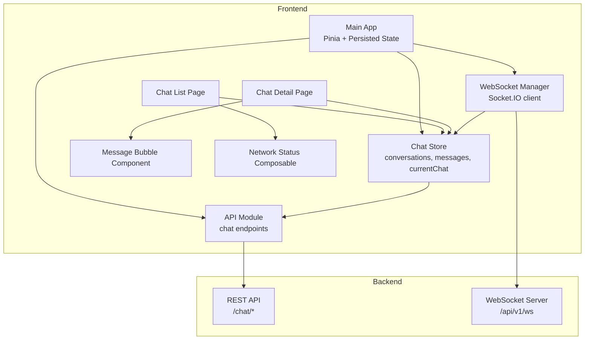
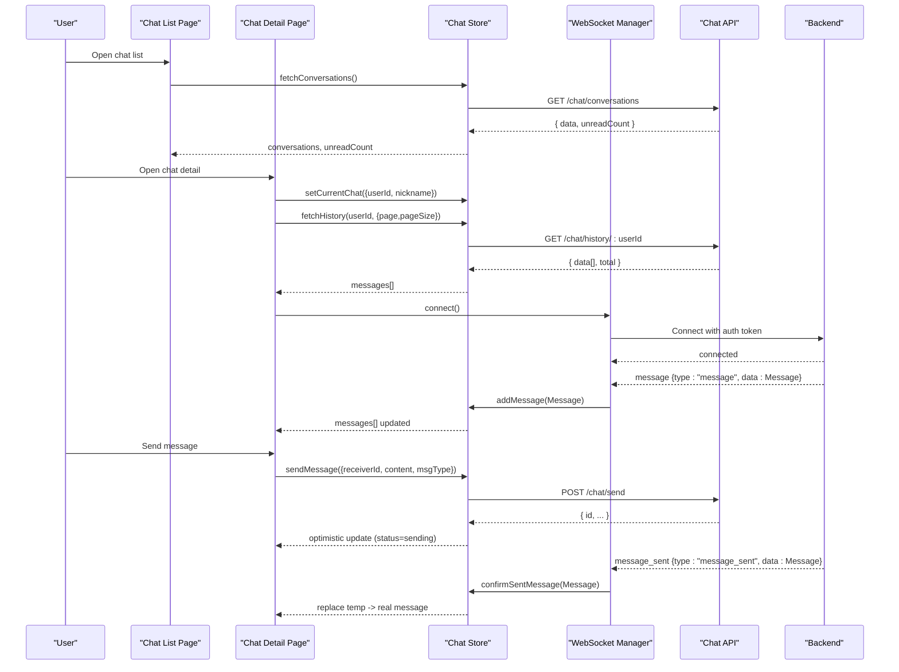
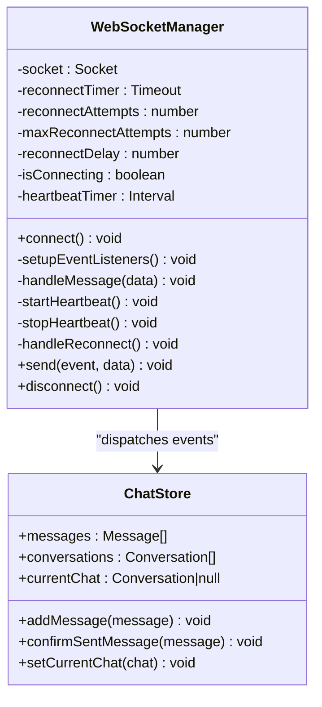
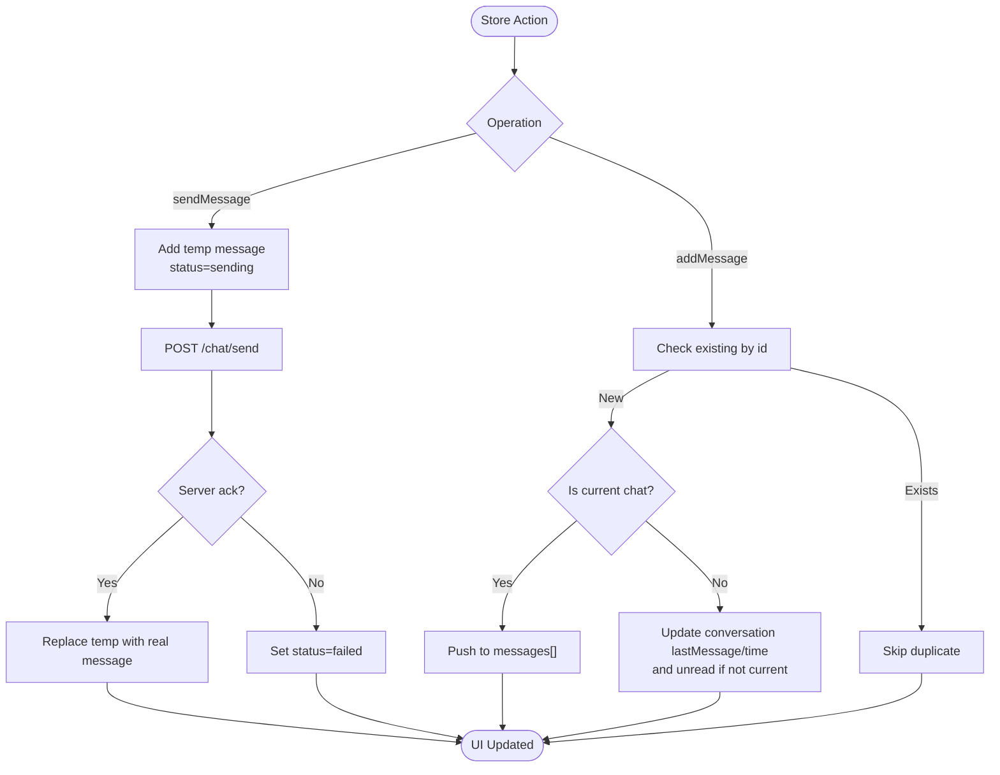
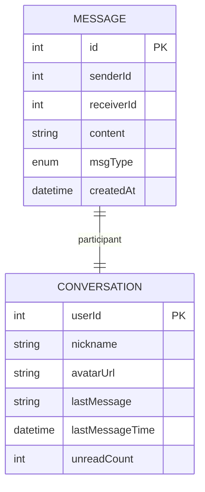
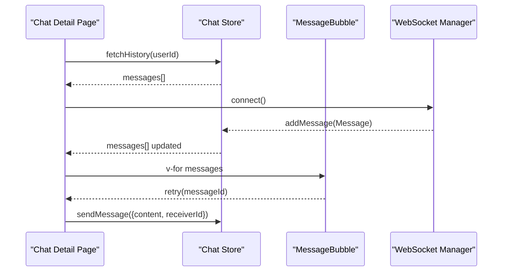
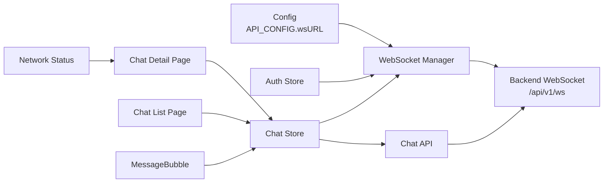

# Real-time Messaging

<cite>
**Referenced Files in This Document**
- [chat.ts](file://src/stores/chat.ts)
- [websocket.ts](file://src/utils/websocket.ts)
- [chat.ts](file://src/api/modules/chat.ts)
- [detail.vue](file://src/pages/chat/detail.vue)
- [list.vue](file://src/pages/chat/list.vue)
- [MessageBubble.vue](file://src/components/business/MessageBubble.vue)
- [useNetworkStatus.ts](file://src/composables/useNetworkStatus.ts)
- [index.ts](file://src/config/index.ts)
- [backend-types.ts](file://src/types/api/backend-types.ts)
- [enums.ts](file://src/types/enums.ts)
- [main.ts](file://src/main.ts)
</cite>

## Table of Contents
1. [Introduction](#introduction)
2. [Project Structure](#project-structure)
3. [Core Components](#core-components)
4. [Architecture Overview](#architecture-overview)
5. [Detailed Component Analysis](#detailed-component-analysis)
6. [Dependency Analysis](#dependency-analysis)
7. [Performance Considerations](#performance-considerations)
8. [Troubleshooting Guide](#troubleshooting-guide)
9. [Conclusion](#conclusion)
10. [Appendices](#appendices)

## Introduction
This document describes the real-time messaging architecture for the WeTogether chat system. It explains how WebSocket-based communication is implemented using Socket.IO for instant messaging, how chat rooms and message threading are managed, and how the frontend synchronizes messages with the backend. It also documents the API endpoints for chat operations, state management for active chats and message history, message types and formatting, and practical guidance for building chat UI components, typing indicators, read receipts, message persistence, offline messaging, and analytics. Security considerations for real-time communication and message encryption are included.

## Project Structure
The chat system spans several layers:
- Frontend stores manage state for conversations, current chat, and messages.
- API module defines typed endpoints for chat operations.
- WebSocket manager encapsulates Socket.IO client lifecycle and event handling.
- Pages implement chat list and chat detail views.
- UI components render message bubbles and integrate with stores and composables.
- Configuration provides base URLs for REST and WebSocket connections.

**Diagram sources**
- [main.ts:1-18](file://src/main.ts#L1-L18)
- [chat.ts:1-234](file://src/stores/chat.ts#L1-L234)
- [chat.ts:18-41](file://src/api/modules/chat.ts#L18-L41)
- [websocket.ts:6-171](file://src/utils/websocket.ts#L6-L171)
- [list.vue:1-311](file://src/pages/chat/list.vue#L1-L311)
- [detail.vue:50-172](file://src/pages/chat/detail.vue#L50-L172)
- [MessageBubble.vue:1-309](file://src/components/business/MessageBubble.vue#L1-L309)
- [useNetworkStatus.ts:1-62](file://src/composables/useNetworkStatus.ts#L1-L62)

**Section sources**
- [main.ts:1-18](file://src/main.ts#L1-L18)
- [index.ts:1-11](file://src/config/index.ts#L1-L11)

## Core Components
- Chat Store: Manages conversations, current chat, message history, unread counts, and provides actions to fetch history, send messages, mark as read, and handle incoming WebSocket events.
- WebSocket Manager: Initializes Socket.IO client with authentication, handles connection lifecycle, heartbeats, reconnection, and dispatches received messages to the store.
- API Module: Defines typed DTOs and endpoints for chat operations (send, history, conversations, messages, mark as read).
- Pages: Chat list and chat detail pages orchestrate store usage, UI rendering, and lifecycle hooks.
- UI Components: MessageBubble renders individual messages with status indicators and avatar handling.
- Network Composable: Provides network connectivity checks and toast feedback.

**Section sources**
- [chat.ts:8-234](file://src/stores/chat.ts#L8-L234)
- [websocket.ts:6-171](file://src/utils/websocket.ts#L6-L171)
- [chat.ts:18-41](file://src/api/modules/chat.ts#L18-L41)
- [detail.vue:50-172](file://src/pages/chat/detail.vue#L50-L172)
- [list.vue:59-98](file://src/pages/chat/list.vue#L59-L98)
- [MessageBubble.vue:68-115](file://src/components/business/MessageBubble.vue#L68-L115)
- [useNetworkStatus.ts:3-61](file://src/composables/useNetworkStatus.ts#L3-L61)

## Architecture Overview
The real-time messaging architecture integrates REST APIs for initial data and persistent operations with Socket.IO for live message delivery and server acknowledgments.

**Diagram sources**
- [chat.ts:14-48](file://src/stores/chat.ts#L14-L48)
- [chat.ts:50-90](file://src/stores/chat.ts#L50-L90)
- [chat.ts:100-210](file://src/stores/chat.ts#L100-L210)
- [websocket.ts:15-111](file://src/utils/websocket.ts#L15-L111)
- [chat.ts:19-41](file://src/api/modules/chat.ts#L19-L41)
- [detail.vue:77-148](file://src/pages/chat/detail.vue#L77-L148)
- [list.vue:78-91](file://src/pages/chat/list.vue#L78-L91)

## Detailed Component Analysis

### WebSocket Communication Layer
The WebSocket Manager encapsulates connection setup, authentication, event handling, heartbeats, and reconnection logic. It listens for message and message_sent events and forwards them to the Chat Store for state updates.

**Diagram sources**
- [websocket.ts:6-171](file://src/utils/websocket.ts#L6-L171)
- [chat.ts:100-210](file://src/stores/chat.ts#L100-L210)

**Section sources**
- [websocket.ts:15-171](file://src/utils/websocket.ts#L15-L171)

### Chat Store: State Management and Message Handling
The Chat Store manages:
- conversations: list of chat rooms with metadata (avatar, last message, last time, unread count).
- currentChat: the active conversation being viewed.
- messages: ordered message list for the current chat.
- unreadCount: global unread counter across conversations.

Key behaviors:
- Optimistic send: immediately inserts a temporary message with status=sending, then replaces it upon server confirmation.
- Incoming message deduplication and routing: only adds messages to the current chat; updates conversation metadata and unread counts otherwise.
- String-to-number normalization for sender/receiver IDs to ensure reliable comparisons.

**Diagram sources**
- [chat.ts:50-90](file://src/stores/chat.ts#L50-L90)
- [chat.ts:100-210](file://src/stores/chat.ts#L100-L210)

**Section sources**
- [chat.ts:14-48](file://src/stores/chat.ts#L14-L48)
- [chat.ts:50-90](file://src/stores/chat.ts#L50-L90)
- [chat.ts:100-210](file://src/stores/chat.ts#L100-L210)

### API Endpoints for Chat Operations
The API module defines typed endpoints for chat operations. These are consumed by the Chat Store and UI pages.

- POST /chat/send: Send a message to a user.
- GET /chat/history/:userId: Retrieve message history for a conversation.
- GET /chat/conversations: Fetch recent conversations and unread counts.
- GET /chat/messages: Fetch paginated messages (general listing).
- PUT /chat/read/:userId: Mark messages as read for a conversation.

**Diagram sources**
- [backend-types.ts:54-57](file://src/types/api/backend-types.ts#L54-L57)
- [chat.ts:18-41](file://src/api/modules/chat.ts#L18-L41)

**Section sources**
- [chat.ts:18-41](file://src/api/modules/chat.ts#L18-L41)
- [backend-types.ts:54-57](file://src/types/api/backend-types.ts#L54-L57)

### Chat UI Components and Message Rendering
The chat detail page renders a scrollable message list and an input area. It:
- Loads message history and marks as read when entering a chat.
- Connects to WebSocket on mount.
- Automatically scrolls to the bottom after new messages.
- Emits retry events for failed messages.

MessageBubble displays:
- Left-aligned for others, right-aligned for self.
- Status indicators for sending and failure.
- Avatar display for both sides.
- Optional time markers.

**Diagram sources**
- [detail.vue:77-148](file://src/pages/chat/detail.vue#L77-L148)
- [MessageBubble.vue:68-115](file://src/components/business/MessageBubble.vue#L68-L115)
- [chat.ts:100-210](file://src/stores/chat.ts#L100-L210)

**Section sources**
- [detail.vue:50-172](file://src/pages/chat/detail.vue#L50-L172)
- [MessageBubble.vue:1-309](file://src/components/business/MessageBubble.vue#L1-L309)

### Message Types, Formatting, and Multimedia Support
- Message types: Text, Image, Emoji are supported via an enum and backend DTO.
- Content formatting: Messages are rendered as plain text with word wrapping and pre-wrap behavior in the bubble component.
- Multimedia: The backend supports image messages; the UI currently renders content as text. To enable image rendering, extend the MessageBubble component to detect msgType and render images accordingly.

**Section sources**
- [enums.ts:7-11](file://src/types/enums.ts#L7-L11)
- [backend-types.ts:538-547](file://src/types/api/backend-types.ts#L538-L547)
- [MessageBubble.vue:42-44](file://src/components/business/MessageBubble.vue#L42-L44)

### Typing Indicators and Read Receipts
Typing indicators and read receipts are not implemented in the current codebase. To add:
- Typing indicator: Emit a "typing" event via WebSocket when the user starts typing; listen for a "typing" event from others and render a typing indicator in the UI.
- Read receipts: Track last read message per conversation; display a small checkmark or timestamp when the latest message is read.

[No sources needed since this section provides general guidance]

### Message Persistence and Offline Messaging
- Persistence: The backend persists messages and conversations; the frontend loads history via GET /chat/history/:userId and maintains state in Pinia.
- Offline messaging: The current implementation does not persist outgoing messages while offline. To support offline:
  - Queue unsent messages locally.
  - On reconnect, replay queued messages and reconcile with server acknowledgments.
  - Use persisted state to restore message lists after reload.

[No sources needed since this section provides general guidance]

### Chat Analytics
- Analytics hooks: Integrate analytics events for message sends, receives, read actions, and typing events.
- Metrics: Track message delivery latency, read time, and engagement metrics (e.g., average time to first reply).

[No sources needed since this section provides general guidance]

### Security Considerations
- Authentication: The WebSocket manager authenticates using a token from the auth store or storage; ensure tokens are rotated and stored securely.
- Transport security: Use secure WebSocket URLs (wss://) in production.
- Message encryption: Consider end-to-end encryption for sensitive content; implement encryption/decryption in the store or API layer.
- Rate limiting: Enforce rate limits on the backend to prevent spam and abuse.

**Section sources**
- [websocket.ts:23-32](file://src/utils/websocket.ts#L23-L32)
- [index.ts:1-11](file://src/config/index.ts#L1-L11)

## Dependency Analysis
The following diagram shows key dependencies among components involved in real-time messaging.

**Diagram sources**
- [index.ts:1-11](file://src/config/index.ts#L1-L11)
- [websocket.ts:23-50](file://src/utils/websocket.ts#L23-L50)
- [chat.ts:18-41](file://src/api/modules/chat.ts#L18-L41)
- [detail.vue:56-101](file://src/pages/chat/detail.vue#L56-L101)
- [list.vue:66-91](file://src/pages/chat/list.vue#L66-L91)
- [MessageBubble.vue:68-115](file://src/components/business/MessageBubble.vue#L68-L115)
- [useNetworkStatus.ts:3-61](file://src/composables/useNetworkStatus.ts#L3-L61)

**Section sources**
- [chat.ts:1-234](file://src/stores/chat.ts#L1-L234)
- [websocket.ts:6-171](file://src/utils/websocket.ts#L6-L171)
- [chat.ts:18-41](file://src/api/modules/chat.ts#L18-L41)
- [detail.vue:50-172](file://src/pages/chat/detail.vue#L50-L172)
- [list.vue:59-98](file://src/pages/chat/list.vue#L59-L98)
- [MessageBubble.vue:68-115](file://src/components/business/MessageBubble.vue#L68-L115)
- [useNetworkStatus.ts:3-61](file://src/composables/useNetworkStatus.ts#L3-L61)
- [index.ts:1-11](file://src/config/index.ts#L1-L11)

## Performance Considerations
- Virtual scrolling: For long message histories, implement virtualized lists to reduce DOM nodes.
- Debounced input: Use debounced typing events to avoid excessive server traffic.
- Efficient deduplication: Keep message IDs in a Set for O(1) lookup when checking duplicates.
- Heartbeat interval: Tune heartbeat intervals to balance liveness detection and battery usage.
- Pagination: Load older messages on demand to limit initial payload sizes.

[No sources needed since this section provides general guidance]

## Troubleshooting Guide
Common issues and remedies:
- No token available: The WebSocket manager logs an error and refuses to connect. Ensure the auth store has a valid token before calling connect().
- Duplicate messages: The store checks for existing message IDs before adding; verify IDs are unique and normalized.
- Sending failures: The store sets status=failed and exposes a retry mechanism; wire retry to the UI.
- Network disconnections: The manager reconnects automatically; use the network composable to inform users.

**Section sources**
- [websocket.ts:28-32](file://src/utils/websocket.ts#L28-L32)
- [chat.ts:100-158](file://src/stores/chat.ts#L100-L158)
- [chat.ts:82-89](file://src/stores/chat.ts#L82-L89)
- [useNetworkStatus.ts:35-45](file://src/composables/useNetworkStatus.ts#L35-L45)

## Conclusion
The WeTogether chat system combines REST APIs for persistent operations with Socket.IO for real-time messaging. The Chat Store centralizes state management, the WebSocket Manager handles transport concerns, and the UI components render messages and collect input. Extending the system to support multimedia, typing indicators, read receipts, offline messaging, and analytics involves minimal changes to the existing architecture.

## Appendices

### API Definitions
- POST /chat/send
  - Request body: SendMessageDto
  - Response: Message
- GET /chat/history/:userId
  - Query params: page, pageSize, beforeId
  - Response: { data: Message[], total: number }
- GET /chat/conversations
  - Response: { data: Conversation[], unreadCount: number }
- GET /chat/messages
  - Query params: page, pageSize
  - Response: { data: Message[], total: number }
- PUT /chat/read/:userId
  - Response: { success: boolean }

**Section sources**
- [chat.ts:18-41](file://src/api/modules/chat.ts#L18-L41)
- [backend-types.ts:538-547](file://src/types/api/backend-types.ts#L538-L547)