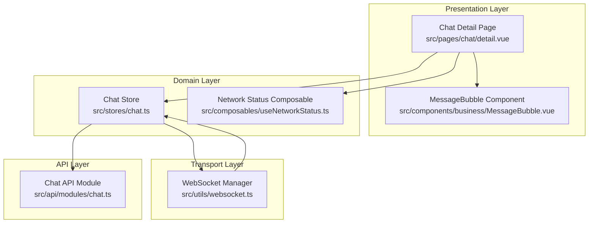
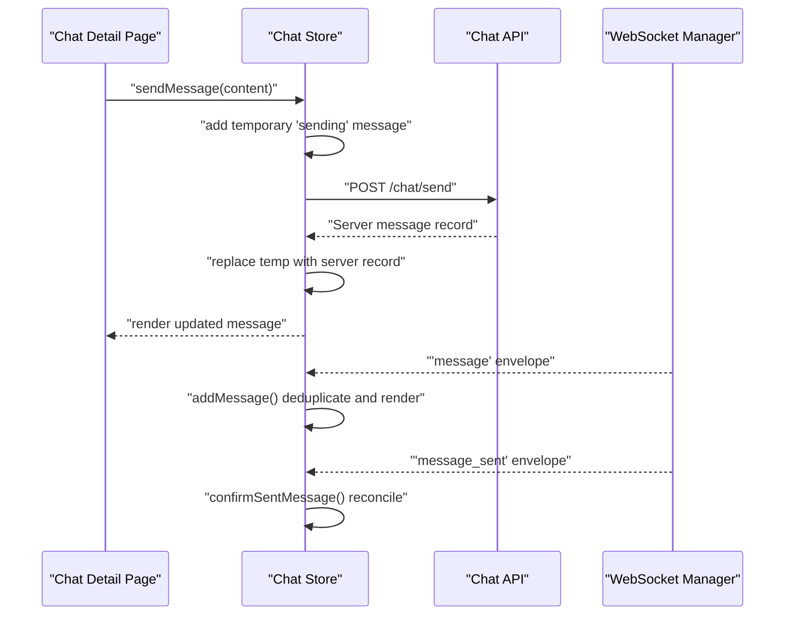
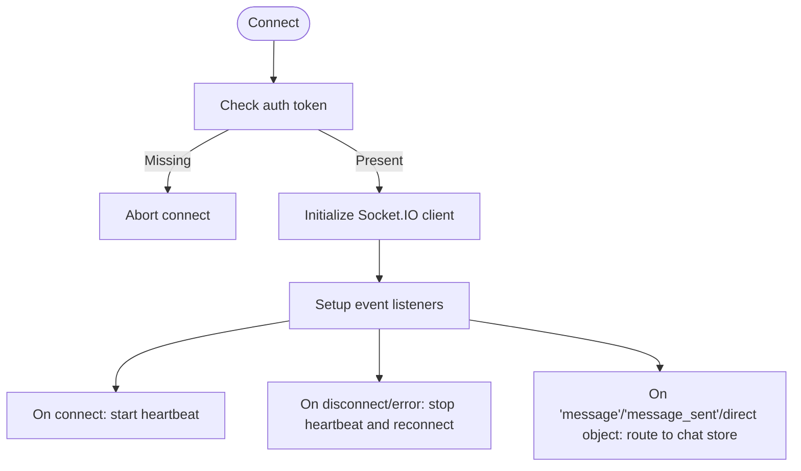
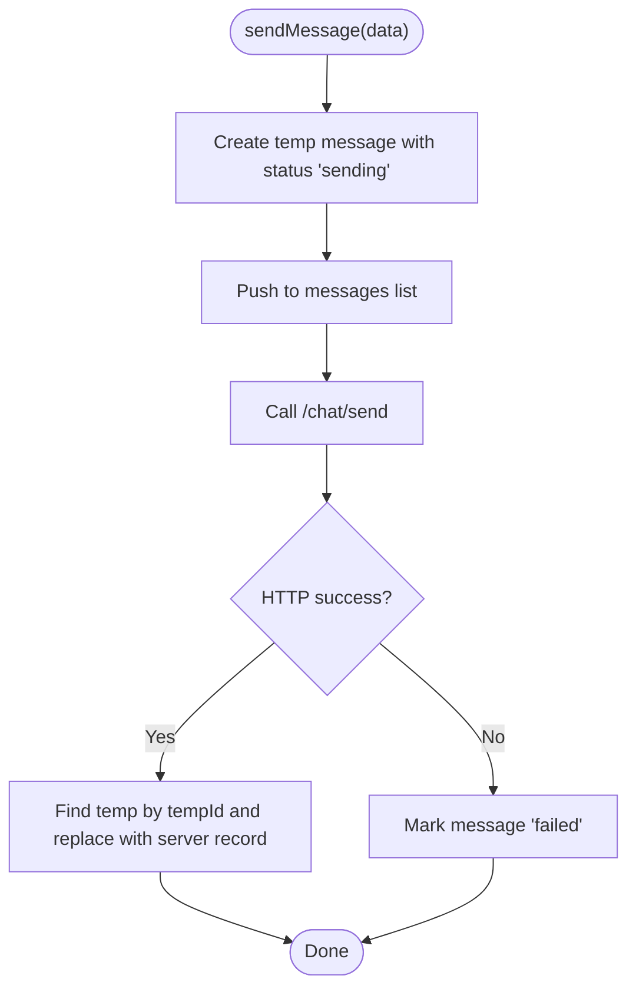
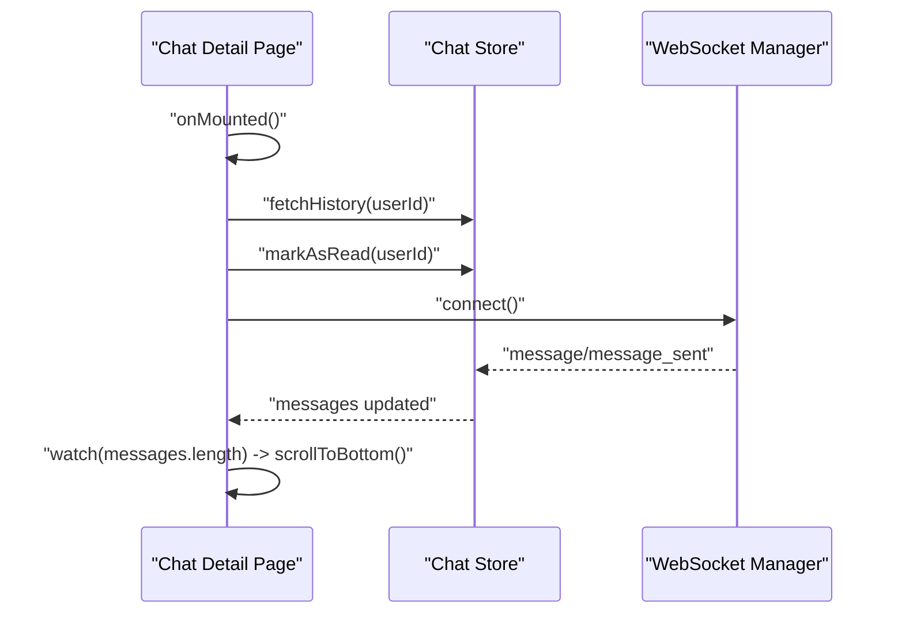
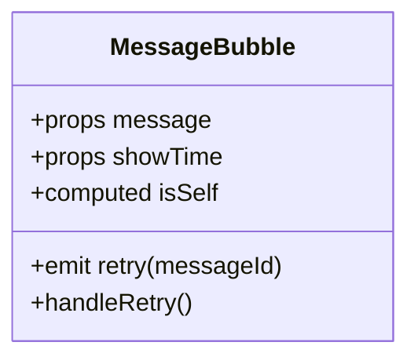
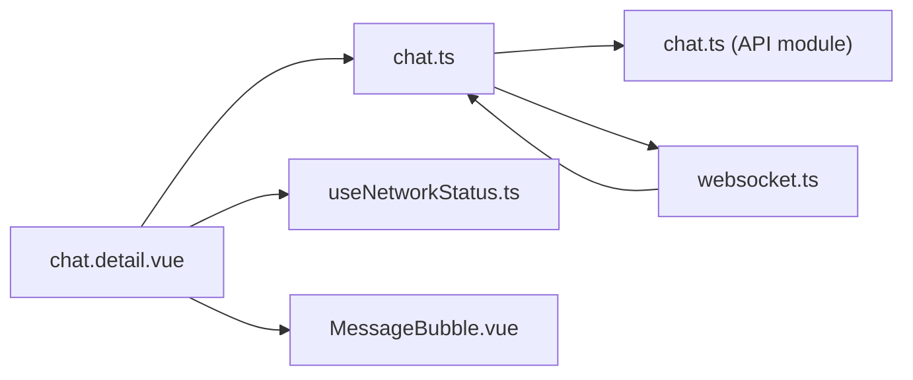

# Real-time Synchronization

<cite>
**Referenced Files in This Document**
- [websocket.ts](file://src/utils/websocket.ts)
- [chat.ts](file://src/stores/chat.ts)
- [chat.detail.vue](file://src/pages/chat/detail.vue)
- [MessageBubble.vue](file://src/components/business/MessageBubble.vue)
- [useNetworkStatus.ts](file://src/composables/useNetworkStatus.ts)
- [chat.ts (API module)](file://src/api/modules/chat.ts)
- [backend-types.ts](file://src/types/api/backend-types.ts)
- [event-bus.ts](file://src/utils/event-bus.ts)
</cite>

## Table of Contents
1. [Introduction](#introduction)
2. [Project Structure](#project-structure)
3. [Core Components](#core-components)
4. [Architecture Overview](#architecture-overview)
5. [Detailed Component Analysis](#detailed-component-analysis)
6. [Dependency Analysis](#dependency-analysis)
7. [Performance Considerations](#performance-considerations)
8. [Troubleshooting Guide](#troubleshooting-guide)
9. [Conclusion](#conclusion)

## Introduction
This document explains the real-time message synchronization mechanisms implemented in the project. It covers the event-driven architecture for message propagation, delivery confirmation, and read receipts; conflict resolution for simultaneous updates and offline scenarios; optimistic updates for immediate UI feedback; and reconciliation with server state. It also documents consistency models, eventual consistency patterns, and practical guidance for reliable delivery guarantees and duplicate prevention.

## Project Structure
The real-time chat system spans three layers:
- Presentation: Chat detail page and message UI components
- Domain: Pinia chat store orchestrating message lifecycle and state
- Transport: WebSocket manager handling connection, reconnection, heartbeats, and event routing

**Diagram sources**
- [chat.detail.vue:50-172](file://src/pages/chat/detail.vue#L50-L172)
- [chat.ts:1-234](file://src/stores/chat.ts#L1-L234)
- [websocket.ts:1-171](file://src/utils/websocket.ts#L1-L171)
- [chat.ts (API module):1-46](file://src/api/modules/chat.ts#L1-L46)
- [MessageBubble.vue:1-309](file://src/components/business/MessageBubble.vue#L1-L309)
- [useNetworkStatus.ts:1-62](file://src/composables/useNetworkStatus.ts#L1-L62)

**Section sources**
- [chat.detail.vue:50-172](file://src/pages/chat/detail.vue#L50-L172)
- [chat.ts:1-234](file://src/stores/chat.ts#L1-L234)
- [websocket.ts:1-171](file://src/utils/websocket.ts#L1-L171)
- [chat.ts (API module):1-46](file://src/api/modules/chat.ts#L1-L46)
- [MessageBubble.vue:1-309](file://src/components/business/MessageBubble.vue#L1-L309)
- [useNetworkStatus.ts:1-62](file://src/composables/useNetworkStatus.ts#L1-L62)

## Core Components
- WebSocket Manager: Establishes and maintains a persistent connection, handles reconnection, heartbeats, and routes incoming events to the chat store.
- Chat Store: Central state for conversations, current chat, messages, and unread counts. Implements optimistic updates, duplicate prevention, and reconciliation upon confirmations.
- Chat Detail Page: Initializes history, subscribes to live events, and renders messages with immediate feedback.
- MessageBubble Component: Renders individual messages, shows sending status and failure indicators, and supports retry.
- Network Status Composable: Detects connectivity changes and guards actions when offline.
- Chat API Module: Encapsulates HTTP endpoints for sending messages, fetching history, conversations, and marking as read.

**Section sources**
- [websocket.ts:6-171](file://src/utils/websocket.ts#L6-L171)
- [chat.ts:8-234](file://src/stores/chat.ts#L8-L234)
- [chat.detail.vue:77-172](file://src/pages/chat/detail.vue#L77-L172)
- [MessageBubble.vue:74-115](file://src/components/business/MessageBubble.vue#L74-L115)
- [useNetworkStatus.ts:3-61](file://src/composables/useNetworkStatus.ts#L3-L61)
- [chat.ts (API module):18-45](file://src/api/modules/chat.ts#L18-L45)

## Architecture Overview
The system follows an event-driven pattern:
- UI triggers send via the store’s optimistic update.
- Store sends via HTTP and immediately replaces temporary messages with server-provided records.
- WebSocket receives two primary events:
  - Incoming message envelope for new peer messages
  - Confirmation envelope for sent messages
- The store reconciles received events, prevents duplicates, and updates UI and conversation metadata.

**Diagram sources**
- [chat.ts:50-90](file://src/stores/chat.ts#L50-L90)
- [chat.ts:100-158](file://src/stores/chat.ts#L100-L158)
- [chat.ts:161-210](file://src/stores/chat.ts#L161-L210)
- [websocket.ts:93-111](file://src/utils/websocket.ts#L93-L111)
- [chat.ts (API module):19-20](file://src/api/modules/chat.ts#L19-L20)

## Detailed Component Analysis

### WebSocket Manager
Responsibilities:
- Connect with token-based auth and path configuration
- Manage reconnection with exponential-like delays and capped attempts
- Emit periodic ping and receive pong for liveness
- Route incoming envelopes to the chat store

Key behaviors:
- On connect, starts heartbeat and resets reconnect counters
- On disconnect/connect_error, stops heartbeat and schedules reconnect
- Handles three message types:
  - Envelope with type "message" containing a message payload
  - Envelope with type "message_sent" containing a confirmation payload
  - Direct message object (legacy compatibility)

**Diagram sources**
- [websocket.ts:15-53](file://src/utils/websocket.ts#L15-L53)
- [websocket.ts:55-91](file://src/utils/websocket.ts#L55-L91)
- [websocket.ts:93-111](file://src/utils/websocket.ts#L93-L111)

**Section sources**
- [websocket.ts:6-171](file://src/utils/websocket.ts#L6-L171)

### Chat Store
Responsibilities:
- Maintain conversations, current chat, messages, and unread count
- Optimistic updates for immediate UI feedback
- Duplicate prevention for both incoming and outgoing messages
- Reconciliation with server state on confirmations
- Conversation metadata updates (last message, last message time, unread counts)

Optimistic update flow:
- Generate a temporary local ID
- Insert a message with status "sending"
- On success, replace the temporary message with the server-provided record
- On failure, mark the message as failed

Duplicate prevention:
- Incoming addMessage checks existing IDs before insertion
- confirmSentMessage checks existence before adding or replacing

**Diagram sources**
- [chat.ts:50-90](file://src/stores/chat.ts#L50-L90)

**Section sources**
- [chat.ts:8-234](file://src/stores/chat.ts#L8-L234)

### Chat Detail Page
Responsibilities:
- Initialize current chat context
- Load message history and mark as read
- Connect WebSocket on mount
- Watch message list length to scroll to bottom automatically
- Trigger retries for failed messages

**Diagram sources**
- [chat.detail.vue:77-129](file://src/pages/chat/detail.vue#L77-L129)
- [chat.detail.vue:131-148](file://src/pages/chat/detail.vue#L131-L148)
- [chat.detail.vue:110-114](file://src/pages/chat/detail.vue#L110-L114)

**Section sources**
- [chat.detail.vue:50-172](file://src/pages/chat/detail.vue#L50-L172)

### MessageBubble Component
Responsibilities:
- Render message content and sender avatar
- Show sending indicator for "sending" status
- Show retry prompt for "failed" status
- Support retry action back to parent

**Diagram sources**
- [MessageBubble.vue:74-115](file://src/components/business/MessageBubble.vue#L74-L115)

**Section sources**
- [MessageBubble.vue:1-309](file://src/components/business/MessageBubble.vue#L1-L309)

### Network Status Composable
Responsibilities:
- Observe network connectivity changes
- Guard UI actions when offline
- Notify user on connectivity transitions

**Section sources**
- [useNetworkStatus.ts:3-61](file://src/composables/useNetworkStatus.ts#L3-L61)

### Chat API Module
Responsibilities:
- Define typed DTOs for send and query
- Expose endpoints for sending, history, conversations, and read receipts

**Section sources**
- [chat.ts (API module):6-45](file://src/api/modules/chat.ts#L6-L45)

### Types and Enums
- Message envelope and DTOs support structured payloads for message events
- Enums define message types and statuses used across components

**Section sources**
- [backend-types.ts:53-57](file://src/types/api/backend-types.ts#L53-L57)
- [backend-types.ts:538-547](file://src/types/api/backend-types.ts#L538-L547)

## Dependency Analysis

**Diagram sources**
- [chat.detail.vue:50-172](file://src/pages/chat/detail.vue#L50-L172)
- [chat.ts:1-234](file://src/stores/chat.ts#L1-L234)
- [websocket.ts:1-171](file://src/utils/websocket.ts#L1-L171)
- [chat.ts (API module):1-46](file://src/api/modules/chat.ts#L1-L46)
- [MessageBubble.vue:1-309](file://src/components/business/MessageBubble.vue#L1-L309)
- [useNetworkStatus.ts:1-62](file://src/composables/useNetworkStatus.ts#L1-L62)

**Section sources**
- [chat.detail.vue:50-172](file://src/pages/chat/detail.vue#L50-L172)
- [chat.ts:1-234](file://src/stores/chat.ts#L1-L234)
- [websocket.ts:1-171](file://src/utils/websocket.ts#L1-L171)
- [chat.ts (API module):1-46](file://src/api/modules/chat.ts#L1-L46)
- [MessageBubble.vue:1-309](file://src/components/business/MessageBubble.vue#L1-L309)
- [useNetworkStatus.ts:1-62](file://src/composables/useNetworkStatus.ts#L1-L62)

## Performance Considerations
- Optimistic updates reduce perceived latency by rendering immediately; ensure minimal work in UI to avoid jank.
- Deduplication checks prevent redundant DOM updates and state bloat.
- Heartbeat keeps the connection alive and helps detect stale connections promptly.
- Limit polling fallback to necessary; prefer WebSocket transport for low-latency updates.
- Debounce UI interactions where appropriate to reduce repeated API calls.

## Troubleshooting Guide
Common issues and resolutions:
- No token available: WebSocket connect aborts; ensure authentication flow completes and token is present before connecting.
- Duplicate messages: The store deduplicates by ID; verify envelopes carry unique IDs and that legacy direct objects are properly handled.
- Offline send failures: UI marks messages as failed; provide retry UX and guard actions with network status composable.
- Reconnection storms: The manager caps attempts and delays; monitor logs for repeated disconnects indicating server or network issues.
- Read receipts: The store exposes a read endpoint; ensure the UI calls it when switching chats or scrolling to mark as read.

Operational tips:
- Inspect WebSocket logs for connect/disconnect reasons and heartbeat intervals.
- Verify that message envelopes include type and data fields for proper routing.
- Confirm that confirmSent envelopes arrive and trigger reconciliation.

**Section sources**
- [websocket.ts:28-32](file://src/utils/websocket.ts#L28-L32)
- [websocket.ts:78-90](file://src/utils/websocket.ts#L78-L90)
- [chat.ts:123-128](file://src/stores/chat.ts#L123-L128)
- [chat.ts:169-174](file://src/stores/chat.ts#L169-L174)
- [useNetworkStatus.ts:35-45](file://src/composables/useNetworkStatus.ts#L35-L45)
- [chat.ts (API module):43-44](file://src/api/modules/chat.ts#L43-L44)

## Conclusion
The system combines optimistic UI updates with robust server-side reconciliation and event-driven synchronization. It ensures immediate feedback while maintaining eventual consistency through deduplication, confirmation envelopes, and conversation metadata updates. The WebSocket manager provides resilient connectivity with heartbeats and reconnection, while the store centralizes state transitions and UI reactions. Together, these patterns deliver a responsive and reliable real-time messaging experience.