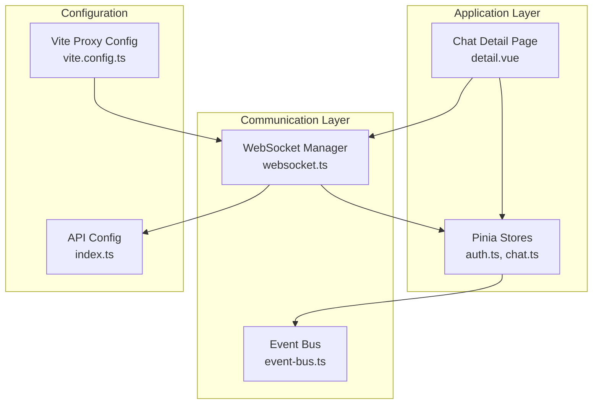
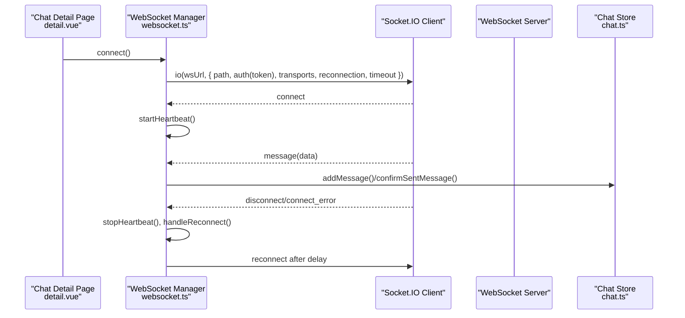
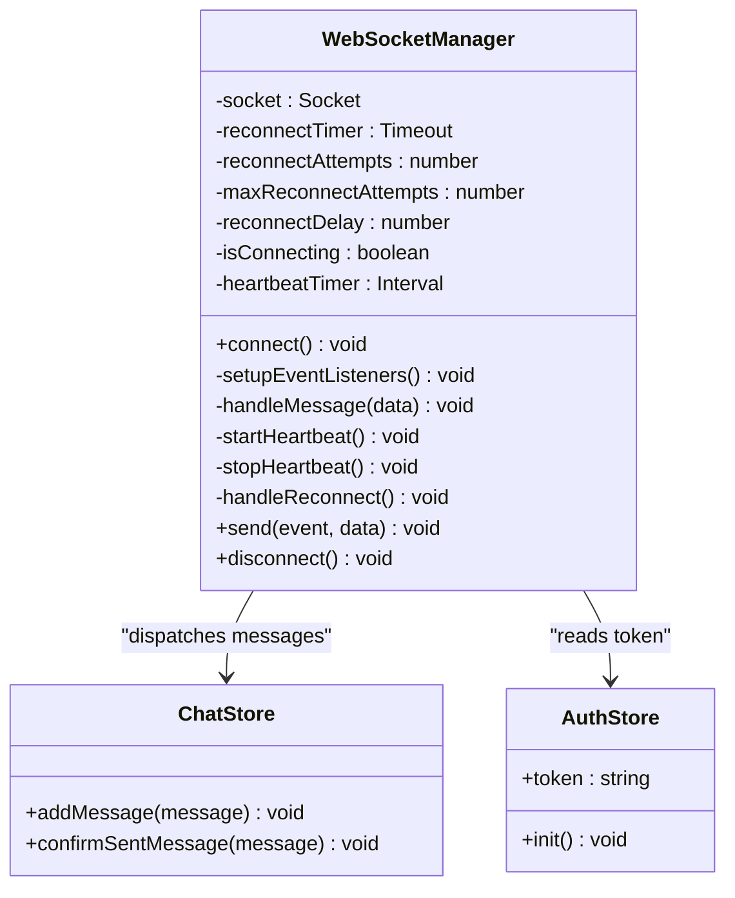
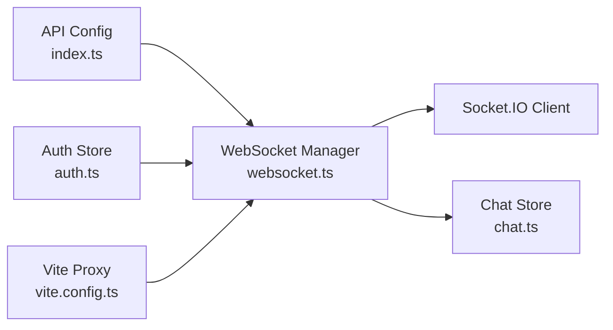

# WebSocket Architecture

<cite>
**Referenced Files in This Document**
- [websocket.ts](file://src/utils/websocket.ts)
- [index.ts](file://src/config/index.ts)
- [chat.ts](file://src/stores/chat.ts)
- [auth.ts](file://src/stores/auth.ts)
- [detail.vue](file://src/pages/chat/detail.vue)
- [event-bus.ts](file://src/utils/event-bus.ts)
- [vite.config.ts](file://vite.config.ts)
</cite>

## Table of Contents
1. [Introduction](#introduction)
2. [Project Structure](#project-structure)
3. [Core Components](#core-components)
4. [Architecture Overview](#architecture-overview)
5. [Detailed Component Analysis](#detailed-component-analysis)
6. [Dependency Analysis](#dependency-analysis)
7. [Performance Considerations](#performance-considerations)
8. [Troubleshooting Guide](#troubleshooting-guide)
9. [Conclusion](#conclusion)

## Introduction
This document describes the WebSocket architecture for the WeTogether real-time communication system. It focuses on the Socket.IO-based implementation, including connection establishment, authentication via token-based credentials, transport protocol selection, connection lifecycle management, automatic reconnection strategies, heartbeat-based health monitoring, and event-driven message handling. It also documents configuration options, environment variables, and practical guidance for secure connections, state handling, performance, and memory optimization.

## Project Structure
The WebSocket subsystem is implemented as a singleton manager that integrates with Pinia stores and the application configuration. The primary entry point is the WebSocket manager, which orchestrates connection, authentication, event handling, and reconnection. The chat and authentication stores coordinate message delivery and token availability, while the configuration module centralizes endpoint and timeout settings.

**Diagram sources**
- [websocket.ts:1-171](file://src/utils/websocket.ts#L1-L171)
- [index.ts:1-11](file://src/config/index.ts#L1-L11)
- [chat.ts:1-234](file://src/stores/chat.ts#L1-L234)
- [auth.ts:1-137](file://src/stores/auth.ts#L1-L137)
- [event-bus.ts:1-49](file://src/utils/event-bus.ts#L1-L49)
- [vite.config.ts:1-48](file://vite.config.ts#L1-L48)

**Section sources**
- [websocket.ts:1-171](file://src/utils/websocket.ts#L1-L171)
- [index.ts:1-11](file://src/config/index.ts#L1-L11)
- [chat.ts:1-234](file://src/stores/chat.ts#L1-L234)
- [auth.ts:1-137](file://src/stores/auth.ts#L1-L137)
- [event-bus.ts:1-49](file://src/utils/event-bus.ts#L1-L49)
- [vite.config.ts:1-48](file://vite.config.ts#L1-L48)

## Core Components
- WebSocketManager: Centralized singleton managing Socket.IO client lifecycle, authentication, event listeners, heartbeat, and reconnection.
- API_CONFIG: Provides base URLs and WebSocket endpoint used by the manager.
- Chat Store: Handles incoming and outgoing messages, optimistic updates, and UI synchronization.
- Auth Store: Manages tokens and user session state used for WebSocket authentication.
- Event Bus: Optional global event dispatch used elsewhere in the app.
- Vite Proxy: Development-time proxy configuration enabling WebSocket upgrades during local development.

Key implementation references:
- WebSocketManager class and methods: [websocket.ts:6-171](file://src/utils/websocket.ts#L6-L171)
- Configuration constants: [index.ts:1-11](file://src/config/index.ts#L1-L11)
- Chat store message handling: [chat.ts:100-210](file://src/stores/chat.ts#L100-L210)
- Auth store token management: [auth.ts:12-77](file://src/stores/auth.ts#L12-L77)
- Event bus utilities: [event-bus.ts:1-49](file://src/utils/event-bus.ts#L1-L49)
- Vite proxy for WebSocket: [vite.config.ts:37-45](file://vite.config.ts#L37-L45)

**Section sources**
- [websocket.ts:6-171](file://src/utils/websocket.ts#L6-L171)
- [index.ts:1-11](file://src/config/index.ts#L1-L11)
- [chat.ts:100-210](file://src/stores/chat.ts#L100-L210)
- [auth.ts:12-77](file://src/stores/auth.ts#L12-L77)
- [event-bus.ts:1-49](file://src/utils/event-bus.ts#L1-L49)
- [vite.config.ts:37-45](file://vite.config.ts#L37-L45)

## Architecture Overview
The WebSocket architecture follows an event-driven model:
- On mount of the chat detail page, the WebSocket manager is initialized and connects to the configured endpoint.
- Authentication is performed using a bearer-style token passed via Socket.IO’s auth option.
- The manager listens for connection events, incoming messages, and disconnections.
- Heartbeat pings are periodically emitted to maintain liveness.
- On disconnection or errors, the manager triggers exponential-like reconnection with bounded attempts.
- Incoming messages are dispatched to the chat store for UI updates.

**Diagram sources**
- [websocket.ts:15-91](file://src/utils/websocket.ts#L15-L91)
- [websocket.ts:113-141](file://src/utils/websocket.ts#L113-L141)
- [chat.ts:100-210](file://src/stores/chat.ts#L100-L210)
- [detail.vue:97](file://src/pages/chat/detail.vue#L97)

**Section sources**
- [websocket.ts:15-91](file://src/utils/websocket.ts#L15-L91)
- [websocket.ts:113-141](file://src/utils/websocket.ts#L113-L141)
- [chat.ts:100-210](file://src/stores/chat.ts#L100-L210)
- [detail.vue:97](file://src/pages/chat/detail.vue#L97)

## Detailed Component Analysis

### WebSocketManager Class
The WebSocketManager encapsulates all connection logic and state:
- Connection establishment: Uses the configured WebSocket URL and path, sets auth token, enables both WebSocket and polling transports, and configures reconnection and timeout.
- Authentication: Reads token from the auth store or persistent storage and passes it to Socket.IO’s auth hook.
- Event handling: Subscribes to connect, connected, message, pong, disconnect, and connect_error events.
- Heartbeat: Emits periodic ping events and clears timers on disconnect.
- Reconnection: Tracks attempts and delays, with a cap on retries.
- Send and disconnect: Provides safe emission and cleanup routines.

**Diagram sources**
- [websocket.ts:6-171](file://src/utils/websocket.ts#L6-L171)
- [chat.ts:100-210](file://src/stores/chat.ts#L100-L210)
- [auth.ts:12-77](file://src/stores/auth.ts#L12-L77)

**Section sources**
- [websocket.ts:6-171](file://src/utils/websocket.ts#L6-L171)
- [chat.ts:100-210](file://src/stores/chat.ts#L100-L210)
- [auth.ts:12-77](file://src/stores/auth.ts#L12-L77)

### Connection Establishment and Authentication
- Endpoint resolution: The WebSocket URL is derived from the configuration and normalized by removing the path suffix.
- Transport selection: Both WebSocket and long-polling transports are enabled to maximize compatibility.
- Authentication: A token is retrieved from the auth store or persistent storage and passed to Socket.IO’s auth hook.
- Timeout and reconnection: Connection timeout and reconnection parameters are set to balance responsiveness and resilience.

References:
- URL construction and Socket.IO initialization: [websocket.ts:37-50](file://src/utils/websocket.ts#L37-L50)
- Token retrieval and auth pass-through: [websocket.ts:23-44](file://src/utils/websocket.ts#L23-L44)
- Configuration constants: [index.ts:4](file://src/config/index.ts#L4)

**Section sources**
- [websocket.ts:37-50](file://src/utils/websocket.ts#L37-L50)
- [websocket.ts:23-44](file://src/utils/websocket.ts#L23-L44)
- [index.ts:4](file://src/config/index.ts#L4)

### Connection Lifecycle Management
- Connect guard: Prevents redundant connections when already connected or connecting.
- Event subscriptions: Registers handlers for connect, connected, message, pong, disconnect, and connect_error.
- Heartbeat start: Starts periodic ping emission upon successful connection.
- Disconnect handling: Stops heartbeat, cancels pending reconnect timer, and cleans up socket state.

References:
- Connection guard and connect(): [websocket.ts:15-53](file://src/utils/websocket.ts#L15-L53)
- Event listener setup: [websocket.ts:55-91](file://src/utils/websocket.ts#L55-L91)
- Heartbeat control: [websocket.ts:113-126](file://src/utils/websocket.ts#L113-L126)
- Disconnect cleanup: [websocket.ts:152-167](file://src/utils/websocket.ts#L152-L167)

**Section sources**
- [websocket.ts:15-53](file://src/utils/websocket.ts#L15-L53)
- [websocket.ts:55-91](file://src/utils/websocket.ts#L55-L91)
- [websocket.ts:113-126](file://src/utils/websocket.ts#L113-L126)
- [websocket.ts:152-167](file://src/utils/websocket.ts#L152-L167)

### Automatic Reconnection Strategies
- Attempt tracking: Tracks reconnect attempts and caps them at a configurable maximum.
- Delayed retry: Uses a fixed delay between attempts; a backoff strategy could be introduced by adjusting reconnectDelay incrementally.
- Timer management: Clears previous timers before scheduling a new reconnect attempt.

References:
- Reconnect loop: [websocket.ts:128-141](file://src/utils/websocket.ts#L128-L141)

**Section sources**
- [websocket.ts:128-141](file://src/utils/websocket.ts#L128-L141)

### Heartbeat Mechanism
- Periodic ping: Emits ping events at a fixed interval when the socket is connected.
- Health monitoring: The absence of corresponding pong responses can be used to infer connectivity issues; currently, pong events are logged but not explicitly validated for liveness checks.
- Cleanup: Heartbeat timer is cleared on disconnect and shutdown.

References:
- Heartbeat emission: [websocket.ts:113-118](file://src/utils/websocket.ts#L113-L118)
- Pong handler: [websocket.ts:74-76](file://src/utils/websocket.ts#L74-L76)
- Stop heartbeat: [websocket.ts:121-126](file://src/utils/websocket.ts#L121-L126)

**Section sources**
- [websocket.ts:113-118](file://src/utils/websocket.ts#L113-L118)
- [websocket.ts:74-76](file://src/utils/websocket.ts#L74-L76)
- [websocket.ts:121-126](file://src/utils/websocket.ts#L121-L126)

### Event-Driven Communication Patterns
- Incoming messages: The manager routes messages to the chat store based on message type or shape.
- Message deduplication: The chat store prevents duplicate entries when adding messages.
- Optimistic updates: Outgoing messages are immediately appended to the UI with a temporary status, later replaced by server-confirmed messages.

References:
- Message routing: [websocket.ts:93-111](file://src/utils/websocket.ts#L93-L111)
- Store message handling: [chat.ts:100-210](file://src/stores/chat.ts#L100-L210)

**Section sources**
- [websocket.ts:93-111](file://src/utils/websocket.ts#L93-L111)
- [chat.ts:100-210](file://src/stores/chat.ts#L100-L210)

### Configuration Options and Environment Variables
- WebSocket URL: Provided via configuration and used to construct the Socket.IO endpoint.
- Transports: Enabled for both WebSocket and polling.
- Reconnection: Enabled with a fixed delay and capped attempts.
- Timeout: Connection timeout is set to balance responsiveness and reliability.
- Development proxy: Vite proxy forwards WebSocket upgrades to the backend during local development.

References:
- Configuration constants: [index.ts:1-11](file://src/config/index.ts#L1-L11)
- Socket.IO options: [websocket.ts:40-50](file://src/utils/websocket.ts#L40-L50)
- Vite proxy for WebSocket: [vite.config.ts:37-45](file://vite.config.ts#L37-L45)

**Section sources**
- [index.ts:1-11](file://src/config/index.ts#L1-L11)
- [websocket.ts:40-50](file://src/utils/websocket.ts#L40-L50)
- [vite.config.ts:37-45](file://vite.config.ts#L37-L45)

### Examples: Secure Connections and State Handling
- Establishing a secure connection:
  - Ensure a valid token is present in the auth store or persistent storage before invoking connect().
  - The manager reads the token and passes it to Socket.IO’s auth hook.
  - The page-level integration calls connect() on mount.
- Handling connection states:
  - The manager logs connect/disconnect/connect_error events and manages heartbeat and reconnection accordingly.
  - UI remains responsive by watching message lists and scrolling to the latest item.

References:
- Token-based authentication: [websocket.ts:23-44](file://src/utils/websocket.ts#L23-L44)
- Page-level connection trigger: [detail.vue:97](file://src/pages/chat/detail.vue#L97)
- Heartbeat and reconnection: [websocket.ts:58-91](file://src/utils/websocket.ts#L58-L91), [websocket.ts:113-141](file://src/utils/websocket.ts#L113-L141)

**Section sources**
- [websocket.ts:23-44](file://src/utils/websocket.ts#L23-L44)
- [detail.vue:97](file://src/pages/chat/detail.vue#L97)
- [websocket.ts:58-91](file://src/utils/websocket.ts#L58-L91)
- [websocket.ts:113-141](file://src/utils/websocket.ts#L113-L141)

## Dependency Analysis
The WebSocket subsystem depends on configuration, stores, and the Socket.IO client. The chat store consumes messages emitted by the WebSocket manager, while the auth store supplies the token used for authentication.

**Diagram sources**
- [index.ts:1-11](file://src/config/index.ts#L1-L11)
- [websocket.ts:1-171](file://src/utils/websocket.ts#L1-L171)
- [auth.ts:1-137](file://src/stores/auth.ts#L1-L137)
- [chat.ts:1-234](file://src/stores/chat.ts#L1-L234)
- [vite.config.ts:1-48](file://vite.config.ts#L1-L48)

**Section sources**
- [index.ts:1-11](file://src/config/index.ts#L1-L11)
- [websocket.ts:1-171](file://src/utils/websocket.ts#L1-L171)
- [auth.ts:1-137](file://src/stores/auth.ts#L1-L137)
- [chat.ts:1-234](file://src/stores/chat.ts#L1-L234)
- [vite.config.ts:1-48](file://vite.config.ts#L1-L48)

## Performance Considerations
- Transport selection: Enabling both WebSocket and polling improves resilience but may increase overhead. Consider disabling polling in production environments where WebSocket is guaranteed.
- Heartbeat interval: The fixed 25-second interval balances liveness detection with minimal network traffic. Adjust based on latency and bandwidth constraints.
- Reconnection strategy: Fixed delay with capped attempts avoids thundering herd effects but may prolong downtime. Introduce exponential backoff with jitter for high-load scenarios.
- Memory management: Ensure heartbeat and reconnect timers are cleared on disconnect and shutdown to prevent lingering intervals. Clear message arrays and reset counters on route unmount.
- UI updates: Batch UI updates and avoid unnecessary reactivity churn by leveraging computed properties and watchers efficiently.

[No sources needed since this section provides general guidance]

## Troubleshooting Guide
Common issues and resolutions:
- No token available:
  - Cause: Token missing in auth store or persistent storage.
  - Resolution: Ensure login completes successfully and tokens are stored before calling connect().
  - Reference: [websocket.ts:23-32](file://src/utils/websocket.ts#L23-L32)
- Connection errors:
  - Symptoms: connect_error events and repeated reconnection attempts.
  - Resolution: Verify WebSocket URL, server availability, and network proxy settings.
  - References: [websocket.ts:85-90](file://src/utils/websocket.ts#L85-L90), [vite.config.ts:37-45](file://vite.config.ts#L37-L45)
- Disconnections:
  - Symptoms: disconnect events and heartbeat stop.
  - Resolution: Confirm server-side keepalive and client-side reconnection logic.
  - References: [websocket.ts:78-83](file://src/utils/websocket.ts#L78-L83), [websocket.ts:121-126](file://src/utils/websocket.ts#L121-L126)
- Message ordering and duplicates:
  - Symptoms: Duplicate messages or out-of-order updates.
  - Resolution: Use message IDs for deduplication and enforce ordering in the chat store.
  - References: [chat.ts:123-128](file://src/stores/chat.ts#L123-L128), [chat.ts:169-174](file://src/stores/chat.ts#L169-L174)

**Section sources**
- [websocket.ts:23-32](file://src/utils/websocket.ts#L23-L32)
- [websocket.ts:85-90](file://src/utils/websocket.ts#L85-L90)
- [websocket.ts:78-83](file://src/utils/websocket.ts#L78-L83)
- [websocket.ts:121-126](file://src/utils/websocket.ts#L121-L126)
- [vite.config.ts:37-45](file://vite.config.ts#L37-L45)
- [chat.ts:123-128](file://src/stores/chat.ts#L123-L128)
- [chat.ts:169-174](file://src/stores/chat.ts#L169-L174)

## Conclusion
The WeTogether WebSocket architecture leverages Socket.IO to deliver reliable, event-driven real-time messaging. The WebSocketManager centralizes connection, authentication, heartbeat, and reconnection logic, while the chat and auth stores manage message state and token availability. With configurable transports, timeouts, and reconnection parameters, the system balances robustness and performance. Following the recommended practices ensures secure, efficient, and maintainable real-time communication.