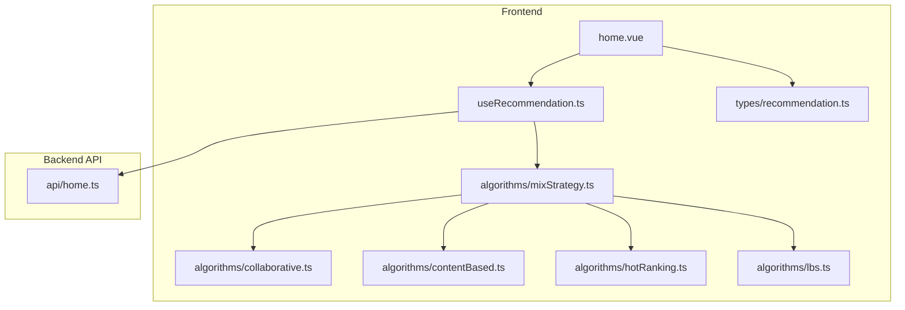
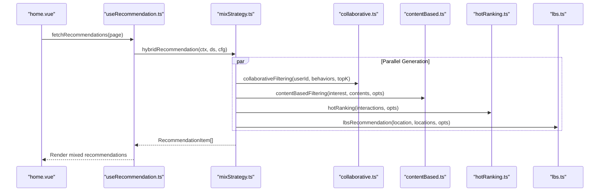
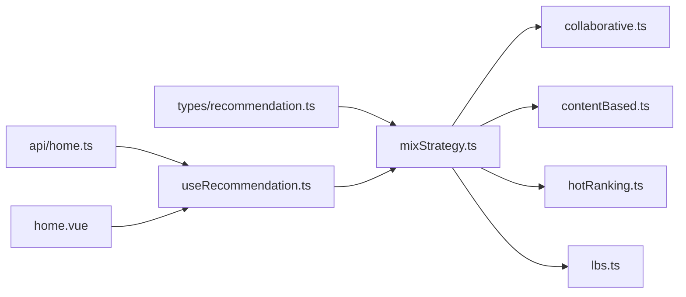

# Algorithm Overview

<cite>
**Referenced Files in This Document**
- [collaborative.ts](file://src/pages/tabbar/home/algorithms/collaborative.ts)
- [contentBased.ts](file://src/pages/tabbar/home/algorithms/contentBased.ts)
- [hotRanking.ts](file://src/pages/tabbar/home/algorithms/hotRanking.ts)
- [lbs.ts](file://src/pages/tabbar/home/algorithms/lbs.ts)
- [mixStrategy.ts](file://src/pages/tabbar/home/algorithms/mixStrategy.ts)
- [recommendation.ts](file://src/pages/tabbar/home/types/recommendation.ts)
- [useRecommendation.ts](file://src/pages/tabbar/home/composables/useRecommendation.ts)
- [home.ts](file://src/api/home.ts)
- [home.vue](file://src/pages/tabbar/home.vue)
</cite>

## Table of Contents
1. [Introduction](#introduction)
2. [Project Structure](#project-structure)
3. [Core Components](#core-components)
4. [Architecture Overview](#architecture-overview)
5. [Detailed Component Analysis](#detailed-component-analysis)
6. [Dependency Analysis](#dependency-analysis)
7. [Performance Considerations](#performance-considerations)
8. [Troubleshooting Guide](#troubleshooting-guide)
9. [Conclusion](#conclusion)

## Introduction
This document explains the recommendation algorithm suite used in WeTogether’s home feed. It covers four core algorithms:
- Collaborative filtering
- Content-based filtering
- Hot ranking
- Location-based services (LBS)

It also documents the hybrid strategy that combines them, their mathematical foundations, practical characteristics, selection criteria, and how they complement each other to improve overall recommendation quality.

## Project Structure
The recommendation system is implemented in the frontend under the “Home” tab and integrates with backend APIs for data and configuration.

**Diagram sources**
- [home.vue:129-439](file://src/pages/tabbar/home.vue#L129-L439)
- [useRecommendation.ts:14-202](file://src/pages/tabbar/home/composables/useRecommendation.ts#L14-L202)
- [mixStrategy.ts:1-482](file://src/pages/tabbar/home/algorithms/mixStrategy.ts#L1-L482)
- [collaborative.ts:1-222](file://src/pages/tabbar/home/algorithms/collaborative.ts#L1-L222)
- [contentBased.ts:1-297](file://src/pages/tabbar/home/algorithms/contentBased.ts#L1-L297)
- [hotRanking.ts:1-329](file://src/pages/tabbar/home/algorithms/hotRanking.ts#L1-L329)
- [lbs.ts:1-381](file://src/pages/tabbar/home/algorithms/lbs.ts#L1-L381)
- [recommendation.ts:1-119](file://src/pages/tabbar/home/types/recommendation.ts#L1-L119)
- [home.ts:1-195](file://src/api/home.ts#L1-L195)

**Section sources**
- [home.vue:129-439](file://src/pages/tabbar/home.vue#L129-L439)
- [useRecommendation.ts:14-202](file://src/pages/tabbar/home/composables/useRecommendation.ts#L14-L202)
- [mixStrategy.ts:1-482](file://src/pages/tabbar/home/algorithms/mixStrategy.ts#L1-L482)

## Core Components
- Collaborative filtering: Builds user vectors from behavior history and recommends items liked by similar users.
- Content-based filtering: Matches user interest tags to content tags and applies TF-IDF and diversity adjustments.
- Hot ranking: Computes a hot score using Wilson score, time decay, and interaction weights.
- LBS: Finds nearby users using geographic distance and distance weighting.
- Hybrid strategy: Distributes page-wide recommendations across types, merges personalized signals, and applies de-duplication and randomization.

**Section sources**
- [collaborative.ts:6-222](file://src/pages/tabbar/home/algorithms/collaborative.ts#L6-L222)
- [contentBased.ts:6-297](file://src/pages/tabbar/home/algorithms/contentBased.ts#L6-L297)
- [hotRanking.ts:6-329](file://src/pages/tabbar/home/algorithms/hotRanking.ts#L6-L329)
- [lbs.ts:6-381](file://src/pages/tabbar/home/algorithms/lbs.ts#L6-L381)
- [mixStrategy.ts:11-482](file://src/pages/tabbar/home/algorithms/mixStrategy.ts#L11-L482)

## Architecture Overview
The hybrid pipeline generates a page of recommendations by:
- Computing type distribution from configuration
- Parallelly generating personalized, hot, nearby, topic, and new-user recommendations
- Merging personalized signals (collaborative + content-based)
- Applying a fallback to hot content if needed
- Randomizing order and de-duplicating by content ID

**Diagram sources**
- [home.vue:164-178](file://src/pages/tabbar/home.vue#L164-L178)
- [useRecommendation.ts:32-82](file://src/pages/tabbar/home/composables/useRecommendation.ts#L32-L82)
- [mixStrategy.ts:363-416](file://src/pages/tabbar/home/algorithms/mixStrategy.ts#L363-L416)
- [collaborative.ts:170-222](file://src/pages/tabbar/home/algorithms/collaborative.ts#L170-L222)
- [contentBased.ts:259-297](file://src/pages/tabbar/home/algorithms/contentBased.ts#L259-L297)
- [hotRanking.ts:290-329](file://src/pages/tabbar/home/algorithms/hotRanking.ts#L290-L329)
- [lbs.ts:357-381](file://src/pages/tabbar/home/algorithms/lbs.ts#L357-L381)

## Detailed Component Analysis

### Collaborative Filtering
Purpose:
- Recommend items liked by similar users who share behavioral patterns with the current user.

Key characteristics:
- Uses a behavior-weighted user-vector model.
- Applies cosine similarity to find top-K similar users.
- Aggregates scores by multiplying similarity with action weights.

Mathematical foundation:
- Vector construction: each user gets a dense vector indexed by target IDs; entries are weighted sums of actions.
- Cosine similarity: dot product divided by product of norms.
- Score aggregation: similarity × action weight, summed per target.

Strengths:
- Captures implicit user preferences without explicit features.
- Effective when users have sufficient interaction history.

Limitations:
- Suffers from cold-start for new users with sparse behavior.
- Scalable with brute-force similarity; consider approximate nearest neighbors for large-scale.

Selection criteria:
- Use when user behavior is rich and diverse.
- Combine with content-based to mitigate cold-start.

Examples:
- A user who frequently likes posts with “travel” and “photography” will see items liked by similar users with comparable patterns.

**Section sources**
- [collaborative.ts:6-222](file://src/pages/tabbar/home/algorithms/collaborative.ts#L6-L222)

### Content-Based Filtering
Purpose:
- Recommend items whose tags match the user’s interest profile.

Key characteristics:
- Tag-based matching with weighted scores.
- TF-IDF extraction for textual content.
- Diversity adjustment to avoid repetitive tags.
- Cold-start fallback to popularity-based ranking.

Mathematical foundation:
- Match score = sum over matched tags of (user_weight × content_weight), normalized by maximum possible score.
- TF-IDF = term frequency × inverse document frequency.
- Diversity bonus = newly discovered tag count × factor; greedy selection maximizes adjusted score.

Strengths:
- Works well for new users with explicit interests.
- Provides explainability via tag overlap.

Limitations:
- Requires rich tagging; brittle if tags are sparse or inconsistent.
- May miss long-tail items outside the user’s known interests.

Selection criteria:
- Use when user interests are known or can be inferred.
- Pair with collaborative filtering to broaden coverage.

Examples:
- A user interested in “music” and “concerts” receives posts tagged accordingly, with diversity favoring varied genres.

**Section sources**
- [contentBased.ts:6-297](file://src/pages/tabbar/home/algorithms/contentBased.ts#L6-L297)

### Hot Ranking
Purpose:
- Surface trending and popular content considering quality and recency.

Key characteristics:
- Wilson score to estimate quality with confidence intervals.
- Exponential time decay to emphasize recent activity.
- Interaction weights to reflect engagement quality.
- Stratification and trend analysis for deeper insights.

Mathematical foundation:
- Positive interactions = weighted sum of likes/comments/favorites/shares.
- Total interactions = positive + skips + reports×weight.
- Wilson score = (p + z²/2n − z√(p(1−p)/n + z²/4n²)) / (1 + z²/n).
- Time decay = exp(−λ·hours).
- Hot score = Wilson × time_decay × log(1 + total_interactions).

Strengths:
- Robust against low-volume noise.
- Encourages fresh content.

Limitations:
- May amplify echo chambers if not balanced with personalization.
- Requires sufficient interaction volume.

Selection criteria:
- Use to highlight community favorites and trending topics.
- Combine with personalization to avoid monotony.

Examples:
- A post with high likes/comments and recent publish time ranks highly even if not personally relevant.

**Section sources**
- [hotRanking.ts:6-329](file://src/pages/tabbar/home/algorithms/hotRanking.ts#L6-L329)

### Location-Based Services (LBS)
Purpose:
- Recommend nearby users based on geographic proximity.

Key characteristics:
- Haversine distance calculation for accurate Earth distances.
- Distance weighting via inverse proportionality.
- Geofencing, bounding boxes, and grid indexing for efficient spatial queries.
- Heatmap generation for density visualization.

Mathematical foundation:
- Haversine formula computes great-circle distance.
- Distance weight = 1/(1 + distance/10) up to a max distance.
- Grid ID = floor(lat/Δlat), floor(lon/(Δlon×cos(lat))).

Strengths:
- Strong for local discovery and social meetups.
- Efficient spatial indexing reduces O(n) checks.

Limitations:
- Requires accurate and recent location updates.
- Privacy-sensitive; requires user consent.

Selection criteria:
- Use when users are open to meeting nearby people.
- Combine with personalization to avoid overwhelming proximity bias.

Examples:
- Users within 20 km receive proximity cards with formatted distance and weight.

**Section sources**
- [lbs.ts:6-381](file://src/pages/tabbar/home/algorithms/lbs.ts#L6-L381)

### Hybrid Strategy and Selection Criteria
Purpose:
- Integrate multiple algorithms into a single, coherent feed.

Key characteristics:
- Configurable type ratios (personalized, hot, nearby, topic, new).
- Parallel generation of recommendation streams.
- Personalized merge: collaborative (0.6) + content-based (0.4).
- Fallback to hot content if any stream is insufficient.
- Randomization and de-duplication by content ID.

Selection criteria:
- Balanced ratios tailored to platform goals (engagement, discovery, retention).
- Use hot content as a safety net to ensure variety.
- De-duplicate aggressively to prevent user fatigue.

Performance and resource requirements:
- Parallelism reduces latency; memory scales with candidate sets.
- Grid-based LBS reduces distance computations.
- Consider caching popularity scores and user vectors for reuse.

Examples:
- A user with rich behavior history sees personalized items dominate; otherwise, hot and nearby content help diversify.

**Section sources**
- [mixStrategy.ts:11-482](file://src/pages/tabbar/home/algorithms/mixStrategy.ts#L11-L482)

## Dependency Analysis
The hybrid strategy orchestrates the four algorithms and depends on shared data types and configuration.

**Diagram sources**
- [recommendation.ts:1-119](file://src/pages/tabbar/home/types/recommendation.ts#L1-L119)
- [home.ts:1-195](file://src/api/home.ts#L1-L195)
- [useRecommendation.ts:14-202](file://src/pages/tabbar/home/composables/useRecommendation.ts#L14-L202)
- [mixStrategy.ts:1-482](file://src/pages/tabbar/home/algorithms/mixStrategy.ts#L1-L482)
- [collaborative.ts:1-222](file://src/pages/tabbar/home/algorithms/collaborative.ts#L1-L222)
- [contentBased.ts:1-297](file://src/pages/tabbar/home/algorithms/contentBased.ts#L1-L297)
- [hotRanking.ts:1-329](file://src/pages/tabbar/home/algorithms/hotRanking.ts#L1-L329)
- [lbs.ts:1-381](file://src/pages/tabbar/home/algorithms/lbs.ts#L1-L381)
- [home.vue:129-439](file://src/pages/tabbar/home.vue#L129-L439)

**Section sources**
- [mixStrategy.ts:6-10](file://src/pages/tabbar/home/algorithms/mixStrategy.ts#L6-L10)
- [recommendation.ts:1-119](file://src/pages/tabbar/home/types/recommendation.ts#L1-L119)
- [home.ts:1-195](file://src/api/home.ts#L1-L195)

## Performance Considerations
- Computational complexity:
  - Collaborative filtering: O(U·T) for vector creation and O(U·K) for similarity search, where U is users, T targets, K similar users.
  - Content-based: O(C·T) for tag matching plus O(T log T) for TF-IDF extraction.
  - Hot ranking: O(I) for scoring and sorting per item I.
  - LBS: O(N) brute-force distance; use grid indexing to reduce to O(G) where G is neighbor grids.
- Memory:
  - Store user vectors and content tag maps; cache popularity scores and user interests.
- Network:
  - Batch requests and use cursors for pagination; fallback to mock data on failure.
- UI:
  - Infinite scroll and skeleton loaders improve perceived performance.

[No sources needed since this section provides general guidance]

## Troubleshooting Guide
Common issues and remedies:
- No recommendations for new users:
  - Ensure cold-start fallback is enabled in content-based filtering and that popularity scores are populated.
- Low diversity:
  - Increase diversity factor and personalize ratios; review de-duplication thresholds.
- Poor LBS results:
  - Verify location freshness threshold and max distance; confirm geofencing and grid indexing are configured.
- Hot content dominance:
  - Adjust hot ratio and add topic/new-user slots; ensure fallback logic is triggered.
- Backend failures:
  - The frontend gracefully falls back to mock data; monitor API responses and retry policies.

**Section sources**
- [contentBased.ts:235-250](file://src/pages/tabbar/home/algorithms/contentBased.ts#L235-L250)
- [mixStrategy.ts:389-416](file://src/pages/tabbar/home/algorithms/mixStrategy.ts#L389-L416)
- [lbs.ts:117-158](file://src/pages/tabbar/home/algorithms/lbs.ts#L117-L158)
- [useRecommendation.ts:66-82](file://src/pages/tabbar/home/composables/useRecommendation.ts#L66-L82)

## Conclusion
WeTogether’s recommendation system blends collaborative filtering, content-based filtering, hot ranking, and LBS through a configurable hybrid strategy. This combination balances personalization, discovery, locality, and popularity, delivering a robust and scalable feed. Tuning ratios, leveraging fallbacks, and optimizing spatial queries ensures high-quality recommendations across diverse user scenarios.