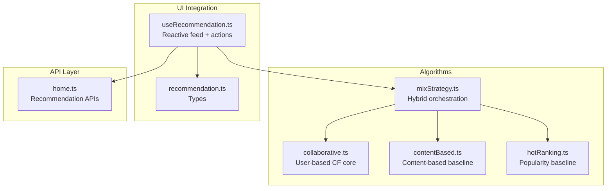
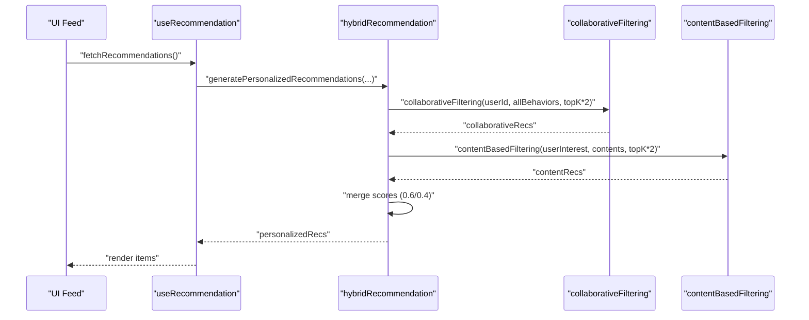
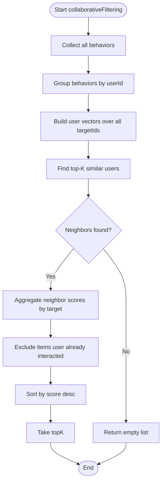
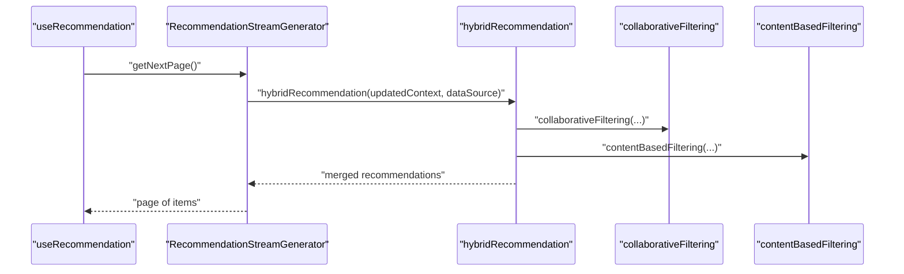
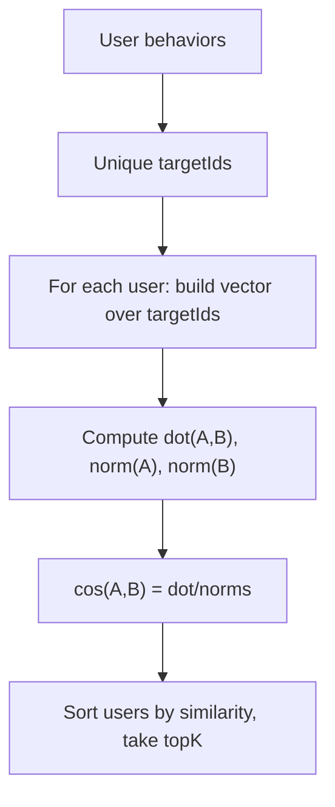
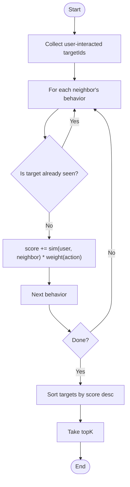
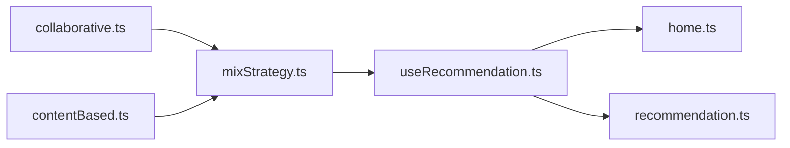

# Collaborative Filtering

<cite>
**Referenced Files in This Document**
- [collaborative.ts](file://src/pages/tabbar/home/algorithms/collaborative.ts)
- [mixStrategy.ts](file://src/pages/tabbar/home/algorithms/mixStrategy.ts)
- [recommendation.ts](file://src/pages/tabbar/home/types/recommendation.ts)
- [useRecommendation.ts](file://src/pages/tabbar/home/composables/useRecommendation.ts)
- [home.ts](file://src/api/home.ts)
</cite>

## Table of Contents
1. [Introduction](#introduction)
2. [Project Structure](#project-structure)
3. [Core Components](#core-components)
4. [Architecture Overview](#architecture-overview)
5. [Detailed Component Analysis](#detailed-component-analysis)
6. [Dependency Analysis](#dependency-analysis)
7. [Performance Considerations](#performance-considerations)
8. [Troubleshooting Guide](#troubleshooting-guide)
9. [Conclusion](#conclusion)

## Introduction
This document explains the collaborative filtering recommendation algorithm used in WeTogether. It focuses on the user-based collaborative filtering approach implemented in the frontend, including user-item matrix construction, similarity computation via cosine similarity, neighborhood selection, and scoring/prediction. It also covers how collaborative filtering is integrated into the hybrid recommendation pipeline, along with practical considerations for sparsity, scalability, cold start, and runtime performance.

## Project Structure
The collaborative filtering implementation resides in the frontend recommendation algorithms module and is orchestrated by a hybrid strategy that merges collaborative filtering with content-based, hot ranking, LBS, and new user signals.

**Diagram sources**
- [collaborative.ts:1-222](file://src/pages/tabbar/home/algorithms/collaborative.ts#L1-L222)
- [mixStrategy.ts:110-162](file://src/pages/tabbar/home/algorithms/mixStrategy.ts#L110-L162)
- [contentBased.ts:1-200](file://src/pages/tabbar/home/algorithms/contentBased.ts#L1-L200)
- [hotRanking.ts:1-173](file://src/pages/tabbar/home/algorithms/hotRanking.ts#L1-L173)
- [useRecommendation.ts:1-202](file://src/pages/tabbar/home/composables/useRecommendation.ts#L1-L202)
- [recommendation.ts:1-119](file://src/pages/tabbar/home/types/recommendation.ts#L1-L119)
- [home.ts:1-195](file://src/api/home.ts#L1-L195)

**Section sources**
- [collaborative.ts:1-222](file://src/pages/tabbar/home/algorithms/collaborative.ts#L1-L222)
- [mixStrategy.ts:110-162](file://src/pages/tabbar/home/algorithms/mixStrategy.ts#L110-L162)
- [useRecommendation.ts:1-202](file://src/pages/tabbar/home/composables/useRecommendation.ts#L1-L202)
- [home.ts:1-195](file://src/api/home.ts#L1-L195)
- [recommendation.ts:1-119](file://src/pages/tabbar/home/types/recommendation.ts#L1-L119)

## Core Components
- User behavior model and vectorization: Converts raw user actions into dense vectors for similarity computation.
- Cosine similarity: Measures user-user similarity based on behavior vectors.
- Neighborhood selection: Picks top-K most similar users.
- Scoring and recommendation: Aggregates scored targets from neighbors, excluding items the user has already interacted with.

Key implementation references:
- Behavior vectorization and weights: [calculateUserVector:36-51](file://src/pages/tabbar/home/algorithms/collaborative.ts#L36-L51)
- Cosine similarity: [cosineSimilarity:59-79](file://src/pages/tabbar/home/algorithms/collaborative.ts#L59-L79)
- Similar user selection: [findSimilarUsers:88-111](file://src/pages/tabbar/home/algorithms/collaborative.ts#L88-L111)
- Recommendation generation: [generateCollaborativeRecommendations:121-161](file://src/pages/tabbar/home/algorithms/collaborative.ts#L121-L161)
- End-to-end pipeline: [collaborativeFiltering:170-221](file://src/pages/tabbar/home/algorithms/collaborative.ts#L170-L221)

**Section sources**
- [collaborative.ts:36-221](file://src/pages/tabbar/home/algorithms/collaborative.ts#L36-L221)

## Architecture Overview
Collaborative filtering is part of a hybrid recommendation system. The hybrid orchestrator:
- Generates personalized recommendations by combining collaborative filtering and content-based signals.
- Merges with hot ranking, LBS, and new user signals.
- Applies distribution, deduplication, and randomization before serving.

**Diagram sources**
- [mixStrategy.ts:110-162](file://src/pages/tabbar/home/algorithms/mixStrategy.ts#L110-L162)
- [collaborative.ts:170-221](file://src/pages/tabbar/home/algorithms/collaborative.ts#L170-L221)
- [contentBased.ts:259-296](file://src/pages/tabbar/home/algorithms/contentBased.ts#L259-L296)
- [useRecommendation.ts:32-94](file://src/pages/tabbar/home/composables/useRecommendation.ts#L32-L94)

## Detailed Component Analysis

### User-Based Collaborative Filtering Core
- User behavior vectorization: Builds a user-item matrix row per user, where each cell is a weighted count of actions on a target. Action weights are defined in [ACTION_WEIGHTS:22-28](file://src/pages/tabbar/home/algorithms/collaborative.ts#L22-L28).
- Similarity: Uses cosine similarity between user vectors in [cosineSimilarity:59-79](file://src/pages/tabbar/home/algorithms/collaborative.ts#L59-L79).
- Neighborhood: Selects top-K similar users excluding the target user in [findSimilarUsers:88-111](file://src/pages/tabbar/home/algorithms/collaborative.ts#L88-L111).
- Scoring: Sums neighbor similarity × action weight for each target not yet interacted by the user in [generateCollaborativeRecommendations:121-161](file://src/pages/tabbar/home/algorithms/collaborative.ts#L121-L161).
- End-to-end: Orchestrates vectorization, similarity, neighbor selection, and scoring in [collaborativeFiltering:170-221](file://src/pages/tabbar/home/algorithms/collaborative.ts#L170-L221).

**Diagram sources**
- [collaborative.ts:170-221](file://src/pages/tabbar/home/algorithms/collaborative.ts#L170-L221)

**Section sources**
- [collaborative.ts:22-28](file://src/pages/tabbar/home/algorithms/collaborative.ts#L22-L28)
- [collaborative.ts:36-51](file://src/pages/tabbar/home/algorithms/collaborative.ts#L36-L51)
- [collaborative.ts:59-79](file://src/pages/tabbar/home/algorithms/collaborative.ts#L59-L79)
- [collaborative.ts:88-111](file://src/pages/tabbar/home/algorithms/collaborative.ts#L88-L111)
- [collaborative.ts:121-161](file://src/pages/tabbar/home/algorithms/collaborative.ts#L121-L161)
- [collaborative.ts:170-221](file://src/pages/tabbar/home/algorithms/collaborative.ts#L170-L221)

### Hybrid Orchestration and Integration
- Personalized pipeline: Calls collaborative filtering and content-based filtering, merges scores with fixed weights, and converts to recommendation items in [generatePersonalizedRecommendations:110-162](file://src/pages/tabbar/home/algorithms/mixStrategy.ts#L110-L162).
- Hybrid strategy: Distributes counts across types, runs generators in parallel, applies fallbacks, shuffles, deduplicates, and returns final page in [hybridRecommendation:363-416](file://src/pages/tabbar/home/algorithms/mixStrategy.ts#L363-L416).
- UI integration: Reactive feed composition and action tracking in [useRecommendation:14-201](file://src/pages/tabbar/home/composables/useRecommendation.ts#L14-L201).
- Types: Unified recommendation item typing in [recommendation.ts:76-95](file://src/pages/tabbar/home/types/recommendation.ts#L76-L95).
- API surface: Recommendation feed, action tracking, and configuration endpoints in [home.ts:68-181](file://src/api/home.ts#L68-L181).

**Diagram sources**
- [mixStrategy.ts:421-482](file://src/pages/tabbar/home/algorithms/mixStrategy.ts#L421-L482)
- [mixStrategy.ts:363-416](file://src/pages/tabbar/home/algorithms/mixStrategy.ts#L363-L416)
- [mixStrategy.ts:110-162](file://src/pages/tabbar/home/algorithms/mixStrategy.ts#L110-L162)
- [collaborative.ts:170-221](file://src/pages/tabbar/home/algorithms/collaborative.ts#L170-L221)
- [contentBased.ts:259-296](file://src/pages/tabbar/home/algorithms/contentBased.ts#L259-L296)

**Section sources**
- [mixStrategy.ts:110-162](file://src/pages/tabbar/home/algorithms/mixStrategy.ts#L110-L162)
- [mixStrategy.ts:363-416](file://src/pages/tabbar/home/algorithms/mixStrategy.ts#L363-L416)
- [mixStrategy.ts:421-482](file://src/pages/tabbar/home/algorithms/mixStrategy.ts#L421-L482)
- [useRecommendation.ts:14-201](file://src/pages/tabbar/home/composables/useRecommendation.ts#L14-L201)
- [recommendation.ts:76-95](file://src/pages/tabbar/home/types/recommendation.ts#L76-L95)
- [home.ts:68-181](file://src/api/home.ts#L68-L181)

### Matrix Operations and Similarity Computations
- Vectorization: [calculateUserVector:36-51](file://src/pages/tabbar/home/algorithms/collaborative.ts#L36-L51) builds a dense vector over all target IDs.
- Dot product and norms: Implemented in [cosineSimilarity:59-79](file://src/pages/tabbar/home/algorithms/collaborative.ts#L59-L79).
- Neighborhood: [findSimilarUsers:88-111](file://src/pages/tabbar/home/algorithms/collaborative.ts#L88-L111) filters out self, computes similarity, sorts, slices top-K.

**Diagram sources**
- [collaborative.ts:36-111](file://src/pages/tabbar/home/algorithms/collaborative.ts#L36-L111)

**Section sources**
- [collaborative.ts:36-111](file://src/pages/tabbar/home/algorithms/collaborative.ts#L36-L111)

### Recommendation Generation
- Excludes items already interacted by the user: [generateCollaborativeRecommendations:121-161](file://src/pages/tabbar/home/algorithms/collaborative.ts#L121-L161).
- Scores are aggregated as similarity × action weight, then sorted and truncated to top-K.

**Diagram sources**
- [collaborative.ts:121-161](file://src/pages/tabbar/home/algorithms/collaborative.ts#L121-L161)

**Section sources**
- [collaborative.ts:121-161](file://src/pages/tabbar/home/algorithms/collaborative.ts#L121-L161)

## Dependency Analysis
- collaborative.ts depends on:
  - Its own exported helpers: [cosineSimilarity:59-79](file://src/pages/tabbar/home/algorithms/collaborative.ts#L59-L79), [findSimilarUsers:88-111](file://src/pages/tabbar/home/algorithms/collaborative.ts#L88-L111), [generateCollaborativeRecommendations:121-161](file://src/pages/tabbar/home/algorithms/collaborative.ts#L121-L161), [collaborativeFiltering:170-221](file://src/pages/tabbar/home/algorithms/collaborative.ts#L170-L221).
- mixStrategy.ts composes:
  - [generatePersonalizedRecommendations:110-162](file://src/pages/tabbar/home/algorithms/mixStrategy.ts#L110-L162) uses collaborative filtering and content-based filtering.
  - [hybridRecommendation:363-416](file://src/pages/tabbar/home/algorithms/mixStrategy.ts#L363-L416) orchestrates parallel generation and post-processing.
- UI and API:
  - [useRecommendation:14-201](file://src/pages/tabbar/home/composables/useRecommendation.ts#L14-L201) drives pagination, fallbacks, and action tracking.
  - [home.ts:68-181](file://src/api/home.ts#L68-L181) defines the backend contract for feeds and actions.

**Diagram sources**
- [collaborative.ts:1-222](file://src/pages/tabbar/home/algorithms/collaborative.ts#L1-L222)
- [mixStrategy.ts:110-162](file://src/pages/tabbar/home/algorithms/mixStrategy.ts#L110-L162)
- [useRecommendation.ts:14-201](file://src/pages/tabbar/home/composables/useRecommendation.ts#L14-L201)
- [home.ts:68-181](file://src/api/home.ts#L68-L181)
- [recommendation.ts:76-95](file://src/pages/tabbar/home/types/recommendation.ts#L76-L95)

**Section sources**
- [collaborative.ts:1-222](file://src/pages/tabbar/home/algorithms/collaborative.ts#L1-L222)
- [mixStrategy.ts:110-162](file://src/pages/tabbar/home/algorithms/mixStrategy.ts#L110-L162)
- [useRecommendation.ts:14-201](file://src/pages/tabbar/home/composables/useRecommendation.ts#L14-L201)
- [home.ts:68-181](file://src/api/home.ts#L68-L181)
- [recommendation.ts:76-95](file://src/pages/tabbar/home/types/recommendation.ts#L76-L95)

## Performance Considerations
- Complexity and scaling:
  - Vectorization is O(U × T) where U is users and T is targets.
  - Pairwise cosine similarity across U users is O(U^2 × D) where D is dimensionality.
  - Neighborhood selection is O(U^2) comparisons plus sorting O(U log U).
- Practical mitigations in current implementation:
  - Top-K neighbor selection reduces downstream work.
  - Recommendation aggregation uses Map/Set for O(1) lookups and O(T) scan.
- Recommendations:
  - Prefer precomputing user vectors server-side and caching them to avoid recomputation on the client.
  - Use sparse representations for user vectors to reduce memory footprint.
  - Apply periodic re-ranking and incremental updates to keep vectors fresh without full rebuilds.
  - Cache similarity scores per user pair to avoid repeated dot products.
  - Batch compute and serve neighbor lists to the client to minimize repeated work.
- Memory management:
  - Limit topK and topK*2 factors to cap intermediate sets and maps.
  - Use typed arrays for dense vectors if feasible and memory-constrained.
- Real-time capability:
  - Track recent actions and update user vectors incrementally.
  - Defer heavy recomputation to off-peak periods or background tasks.
  - Use streaming pagination to progressively refine recommendations.

[No sources needed since this section provides general guidance]

## Troubleshooting Guide
- No recommendations returned:
  - Verify user has sufficient behaviors to form a vector and neighbors; otherwise, the pipeline returns empty. See [collaborativeFiltering:196-201](file://src/pages/tabbar/home/algorithms/collaborative.ts#L196-L201).
- Low diversity or repetitive items:
  - Ensure excluded seen items are properly computed and applied. See [generateCollaborativeRecommendations:121-161](file://src/pages/tabbar/home/algorithms/collaborative.ts#L121-L161).
- Cold start:
  - Collaborative filtering requires prior behavior; rely on content-based cold start or hot ranking fallbacks orchestrated by the hybrid strategy. See [generatePersonalizedRecommendations:110-162](file://src/pages/tabbar/home/algorithms/mixStrategy.ts#L110-L162) and [contentBased.ts cold start:235-250](file://src/pages/tabbar/home/algorithms/contentBased.ts#L235-L250).
- API integration issues:
  - Confirm backend endpoints for feeds and actions are reachable and return expected shapes. See [home.ts:68-181](file://src/api/home.ts#L68-L181).
- UI fallbacks:
  - The hook gracefully falls back to mock data on errors. See [useRecommendation:66-81](file://src/pages/tabbar/home/composables/useRecommendation.ts#L66-L81).

**Section sources**
- [collaborative.ts:196-201](file://src/pages/tabbar/home/algorithms/collaborative.ts#L196-L201)
- [collaborative.ts:121-161](file://src/pages/tabbar/home/algorithms/collaborative.ts#L121-L161)
- [mixStrategy.ts:110-162](file://src/pages/tabbar/home/algorithms/mixStrategy.ts#L110-L162)
- [contentBased.ts:235-250](file://src/pages/tabbar/home/algorithms/contentBased.ts#L235-L250)
- [home.ts:68-181](file://src/api/home.ts#L68-L181)
- [useRecommendation.ts:66-81](file://src/pages/tabbar/home/composables/useRecommendation.ts#L66-L81)

## Conclusion
WeTogether’s collaborative filtering is user-based, built on weighted behavior vectors and cosine similarity. It selects top-K neighbors and aggregates scores by similarity and action weights, excluding items already interacted by the user. The hybrid strategy integrates collaborative filtering with content-based, hot ranking, LBS, and new user signals, ensuring balanced, diverse, and scalable recommendations. For production, prioritize precomputation, caching, and incremental updates to address sparsity, scalability, and cold start challenges while maintaining real-time responsiveness.