# Content-Based Filtering

<cite>
**Referenced Files in This Document**
- [contentBased.ts](file://src/pages/tabbar/home/algorithms/contentBased.ts)
- [mixStrategy.ts](file://src/pages/tabbar/home/algorithms/mixStrategy.ts)
- [collaborative.ts](file://src/pages/tabbar/home/algorithms/collaborative.ts)
- [hotRanking.ts](file://src/pages/tabbar/home/algorithms/hotRanking.ts)
- [lbs.ts](file://src/pages/tabbar/home/algorithms/lbs.ts)
- [home.vue](file://src/pages/tabbar/home.vue)
- [useRecommendation.ts](file://src/pages/tabbar/home/composables/useRecommendation.ts)
- [recommendation.ts](file://src/pages/tabbar/home/types/recommendation.ts)
- [home.ts](file://src/api/home.ts)
</cite>

## Table of Contents
1. [Introduction](#introduction)
2. [Project Structure](#project-structure)
3. [Core Components](#core-components)
4. [Architecture Overview](#architecture-overview)
5. [Detailed Component Analysis](#detailed-component-analysis)
6. [Dependency Analysis](#dependency-analysis)
7. [Performance Considerations](#performance-considerations)
8. [Troubleshooting Guide](#troubleshooting-guide)
9. [Conclusion](#conclusion)
10. [Appendices](#appendices)

## Introduction
This document explains the content-based filtering recommendation algorithm implemented in the project. It covers how user preferences and content attributes are modeled, how features are extracted and represented, and how similarity is computed to produce recommendations. It also documents TF-IDF weighting, vector-space modeling, cosine similarity, and practical techniques such as preference learning, content feature engineering, and recommendation scoring. Finally, it addresses advantages like interpretability and cold-start handling, along with strategies for managing content drift and maintaining recommendation freshness.

## Project Structure
The content-based filtering implementation resides under the home recommendation algorithms module. It integrates with other recommendation strategies (collaborative filtering, hot ranking, LBS) via a hybrid strategy and is consumed by the home page UI and composables.

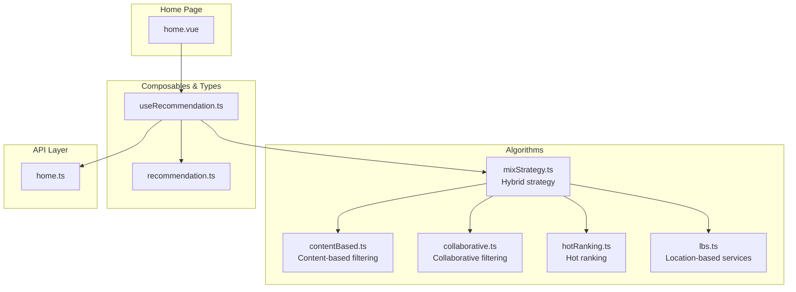

**Diagram sources**
- [home.vue:129-438](file://src/pages/tabbar/home.vue#L129-L438)
- [useRecommendation.ts:14-201](file://src/pages/tabbar/home/composables/useRecommendation.ts#L14-L201)
- [mixStrategy.ts:363-387](file://src/pages/tabbar/home/algorithms/mixStrategy.ts#L363-L387)
- [contentBased.ts:259-296](file://src/pages/tabbar/home/algorithms/contentBased.ts#L259-L296)
- [collaborative.ts:170-222](file://src/pages/tabbar/home/algorithms/collaborative.ts#L170-L222)
- [hotRanking.ts:290-329](file://src/pages/tabbar/home/algorithms/hotRanking.ts#L290-L329)
- [lbs.ts:357-381](file://src/pages/tabbar/home/algorithms/lbs.ts#L357-L381)
- [home.ts:68-134](file://src/api/home.ts#L68-L134)

**Section sources**
- [contentBased.ts:1-296](file://src/pages/tabbar/home/algorithms/contentBased.ts#L1-L296)
- [mixStrategy.ts:1-387](file://src/pages/tabbar/home/algorithms/mixStrategy.ts#L1-L387)
- [collaborative.ts:1-222](file://src/pages/tabbar/home/algorithms/collaborative.ts#L1-L222)
- [hotRanking.ts:1-329](file://src/pages/tabbar/home/algorithms/hotRanking.ts#L1-L329)
- [lbs.ts:1-381](file://src/pages/tabbar/home/algorithms/lbs.ts#L1-L381)
- [home.vue:129-438](file://src/pages/tabbar/home.vue#L129-L438)
- [useRecommendation.ts:14-201](file://src/pages/tabbar/home/composables/useRecommendation.ts#L14-L201)
- [recommendation.ts:1-119](file://src/pages/tabbar/home/types/recommendation.ts#L1-L119)
- [home.ts:68-134](file://src/api/home.ts#L68-L134)

## Core Components
- UserInterest and ContentItem models define preference and content attribute representations.
- Matching function computes a similarity score based on shared weighted tags.
- TF-IDF extractor builds keyword importance scores for textual content.
- Diversity adjustment improves recommendation variety.
- Cold-start fallback uses popularity scores for new users.
- Hybrid strategy orchestrates multiple algorithms and merges results.

**Section sources**
- [contentBased.ts:6-26](file://src/pages/tabbar/home/algorithms/contentBased.ts#L6-L26)
- [contentBased.ts:34-70](file://src/pages/tabbar/home/algorithms/contentBased.ts#L34-L70)
- [contentBased.ts:79-95](file://src/pages/tabbar/home/algorithms/contentBased.ts#L79-L95)
- [contentBased.ts:104-130](file://src/pages/tabbar/home/algorithms/contentBased.ts#L104-L130)
- [contentBased.ts:171-226](file://src/pages/tabbar/home/algorithms/contentBased.ts#L171-L226)
- [contentBased.ts:235-250](file://src/pages/tabbar/home/algorithms/contentBased.ts#L235-L250)
- [contentBased.ts:259-296](file://src/pages/tabbar/home/algorithms/contentBased.ts#L259-L296)

## Architecture Overview
The hybrid recommendation pipeline composes content-based, collaborative, hot-ranking, and LBS strategies. The home page uses a composable to fetch and render mixed recommendations, optionally falling back to mock data.

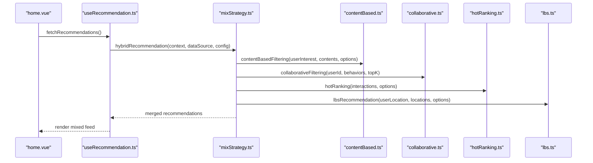

**Diagram sources**
- [home.vue:164-178](file://src/pages/tabbar/home.vue#L164-L178)
- [useRecommendation.ts:32-82](file://src/pages/tabbar/home/composables/useRecommendation.ts#L32-L82)
- [mixStrategy.ts:363-387](file://src/pages/tabbar/home/algorithms/mixStrategy.ts#L363-L387)
- [contentBased.ts:259-296](file://src/pages/tabbar/home/algorithms/contentBased.ts#L259-L296)
- [collaborative.ts:170-222](file://src/pages/tabbar/home/algorithms/collaborative.ts#L170-L222)
- [hotRanking.ts:290-329](file://src/pages/tabbar/home/algorithms/hotRanking.ts#L290-L329)
- [lbs.ts:357-381](file://src/pages/tabbar/home/algorithms/lbs.ts#L357-L381)

## Detailed Component Analysis

### Content-Based Filtering Core
- UserInterest: maps user ID to a set of tags with weights (1–5).
- ContentItem: identifies content by ID/type and carries tags with weights plus optional metadata.
- Matching: computes a normalized score by multiplying matching user and content tag weights, then dividing by the maximum possible score for matched tags.
- TF-IDF: computes term frequency and inverse document frequency to score keywords in textual content.
- Keyword extraction: tokenizes text, computes TF-IDF per unique term, and returns top-K terms.
- Diversity adjustment: greedily selects items to maximize both score and tag variety.
- Cold-start: falls back to popularity scores when user interest is missing.
- Main function: orchestrates filtering, diversity tuning, and top-K selection.

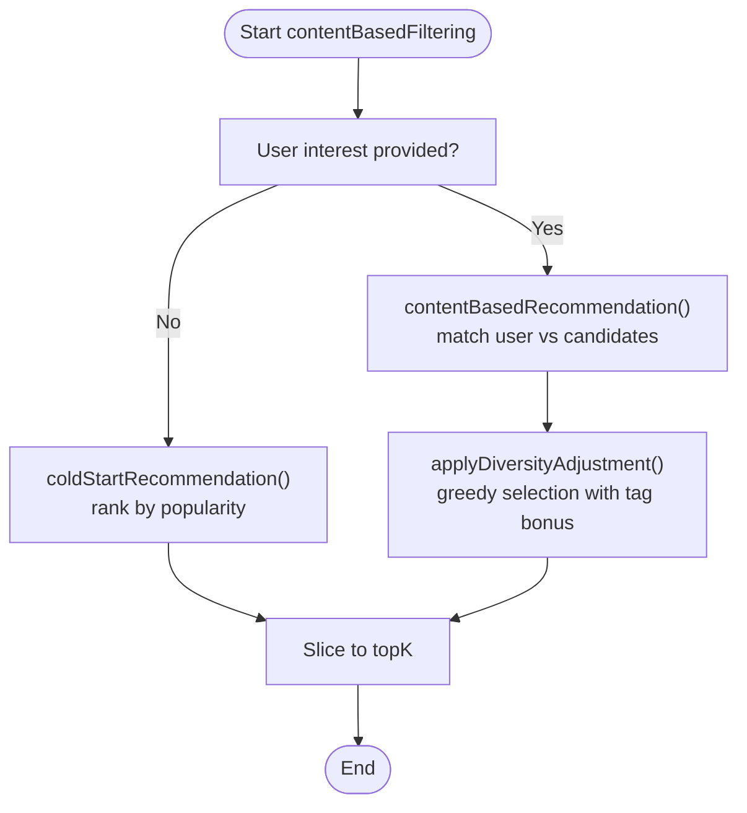

**Diagram sources**
- [contentBased.ts:259-296](file://src/pages/tabbar/home/algorithms/contentBased.ts#L259-L296)
- [contentBased.ts:140-163](file://src/pages/tabbar/home/algorithms/contentBased.ts#L140-L163)
- [contentBased.ts:171-226](file://src/pages/tabbar/home/algorithms/contentBased.ts#L171-L226)
- [contentBased.ts:235-250](file://src/pages/tabbar/home/algorithms/contentBased.ts#L235-L250)

**Section sources**
- [contentBased.ts:6-26](file://src/pages/tabbar/home/algorithms/contentBased.ts#L6-L26)
- [contentBased.ts:34-70](file://src/pages/tabbar/home/algorithms/contentBased.ts#L34-L70)
- [contentBased.ts:79-95](file://src/pages/tabbar/home/algorithms/contentBased.ts#L79-L95)
- [contentBased.ts:104-130](file://src/pages/tabbar/home/algorithms/contentBased.ts#L104-L130)
- [contentBased.ts:171-226](file://src/pages/tabbar/home/algorithms/contentBased.ts#L171-L226)
- [contentBased.ts:235-250](file://src/pages/tabbar/home/algorithms/contentBased.ts#L235-L250)
- [contentBased.ts:259-296](file://src/pages/tabbar/home/algorithms/contentBased.ts#L259-L296)

### Feature Extraction and Representation
- Tag-based model: both users and items are represented as sets of weighted tags. This enables fast matching and interpretable feature engineering.
- Text-based model: TF-IDF extracts keywords from textual content. Tokenization is basic; in production, integrate a robust tokenizer and stopword removal.
- Vector space model: while explicit vectors are not constructed here, the tag-matching formulation mirrors a sparse vector dot product with normalization.

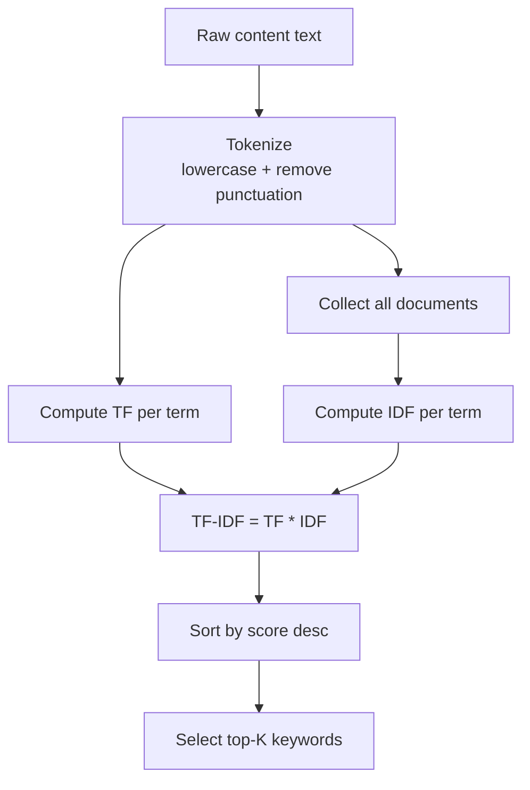

**Diagram sources**
- [contentBased.ts:104-130](file://src/pages/tabbar/home/algorithms/contentBased.ts#L104-L130)
- [contentBased.ts:79-95](file://src/pages/tabbar/home/algorithms/contentBased.ts#L79-L95)

**Section sources**
- [contentBased.ts:104-130](file://src/pages/tabbar/home/algorithms/contentBased.ts#L104-L130)
- [contentBased.ts:79-95](file://src/pages/tabbar/home/algorithms/contentBased.ts#L79-L95)

### Preference Learning and Scoring
- Preference learning: user interest tags are collected and stored via API endpoints. These tags drive the matching function.
- Scoring: the matching score is the sum of products of aligned user and content tag weights, normalized by the maximum possible score for matched tags. Diversity adjustment further refines the final ranking.

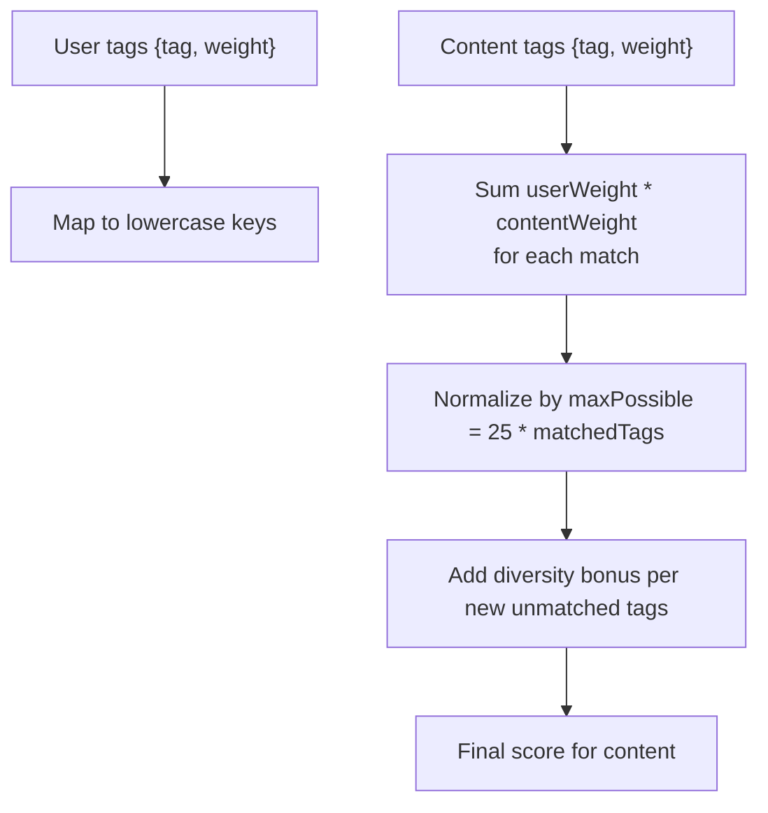

**Diagram sources**
- [contentBased.ts:34-70](file://src/pages/tabbar/home/algorithms/contentBased.ts#L34-L70)
- [contentBased.ts:171-226](file://src/pages/tabbar/home/algorithms/contentBased.ts#L171-L226)

**Section sources**
- [contentBased.ts:34-70](file://src/pages/tabbar/home/algorithms/contentBased.ts#L34-L70)
- [contentBased.ts:171-226](file://src/pages/tabbar/home/algorithms/contentBased.ts#L171-L226)
- [home.ts:119-134](file://src/api/home.ts#L119-L134)

### Similarity and Vector Space Concepts
- Cosine similarity: implemented in collaborative filtering for user vectors. While content-based filtering here uses tag matching, cosine similarity is a standard technique for vector-space models.
- TF-IDF and cosine similarity: TF-IDF weights can be assembled into term vectors; cosine similarity then measures angular distance between vectors.

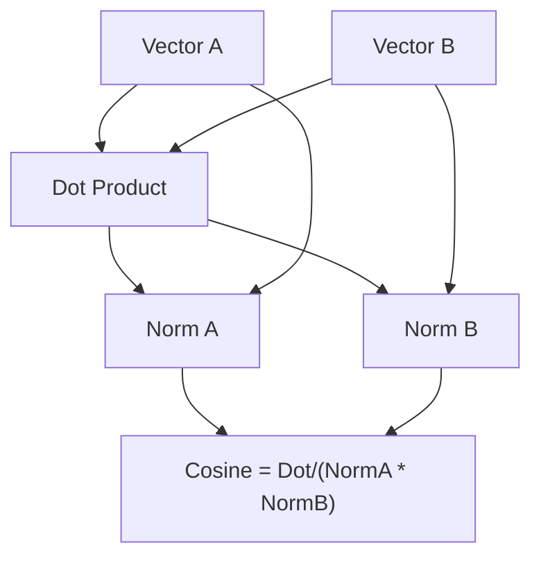

**Diagram sources**
- [collaborative.ts:59-79](file://src/pages/tabbar/home/algorithms/collaborative.ts#L59-L79)

**Section sources**
- [collaborative.ts:59-79](file://src/pages/tabbar/home/algorithms/collaborative.ts#L59-L79)

### Cold Start and Freshness Management
- Cold start: when user interest is absent, recommendations fall back to popularity scores and are sorted to present diverse yet popular content.
- Freshness: hot ranking applies time decay and Wilson score to keep recommendations timely and quality-aware. Hybrid strategy ensures periodic updates and variety.

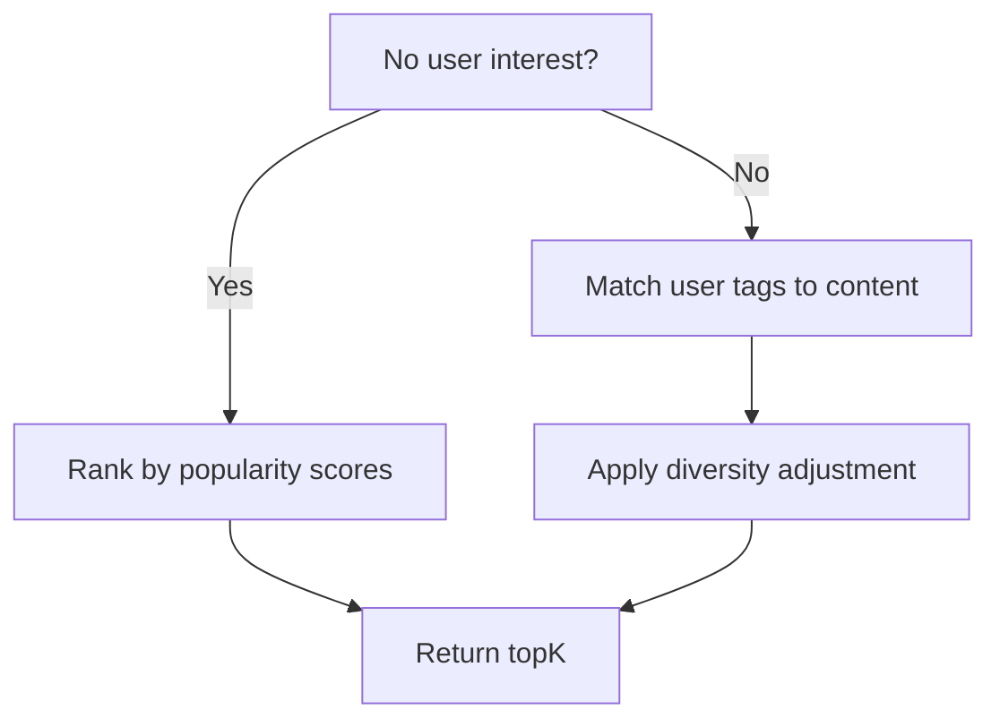

**Diagram sources**
- [contentBased.ts:276-279](file://src/pages/tabbar/home/algorithms/contentBased.ts#L276-L279)
- [contentBased.ts:235-250](file://src/pages/tabbar/home/algorithms/contentBased.ts#L235-L250)
- [contentBased.ts:259-296](file://src/pages/tabbar/home/algorithms/contentBased.ts#L259-L296)

**Section sources**
- [contentBased.ts:235-250](file://src/pages/tabbar/home/algorithms/contentBased.ts#L235-L250)
- [contentBased.ts:259-296](file://src/pages/tabbar/home/algorithms/contentBased.ts#L259-L296)
- [hotRanking.ts:80-135](file://src/pages/tabbar/home/algorithms/hotRanking.ts#L80-L135)

### Integration in the Home Page
- The home page uses a composable to fetch mixed recommendations, supports pagination and refresh, and renders different card types (personalized, hot, nearby, topic, new).
- The composable can use real APIs or mock data, and exposes a trackAction method for user behavior reporting.

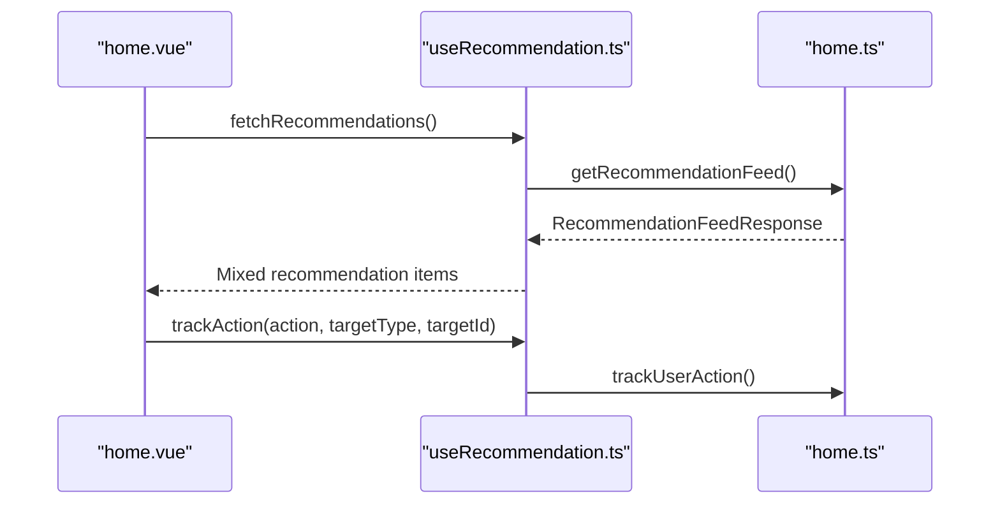

**Diagram sources**
- [home.vue:164-178](file://src/pages/tabbar/home.vue#L164-L178)
- [useRecommendation.ts:32-82](file://src/pages/tabbar/home/composables/useRecommendation.ts#L32-L82)
- [home.ts:68-104](file://src/api/home.ts#L68-L104)

**Section sources**
- [home.vue:129-438](file://src/pages/tabbar/home.vue#L129-L438)
- [useRecommendation.ts:14-201](file://src/pages/tabbar/home/composables/useRecommendation.ts#L14-L201)
- [home.ts:68-104](file://src/api/home.ts#L68-L104)

## Dependency Analysis
- contentBased.ts depends on:
  - Its own internal helpers (matching, TF-IDF, keyword extraction, diversity, cold-start).
  - Hybrid strategy (mixStrategy.ts) for orchestration and integration with other algorithms.
- mixStrategy.ts depends on:
  - contentBased.ts for personalized recommendations.
  - collaborative.ts for collaborative recommendations.
  - hotRanking.ts for hot content.
  - lbs.ts for nearby users.
- home.vue and useRecommendation.ts depend on:
  - mixStrategy.ts for recommendation generation.
  - home.ts for API calls and data types.

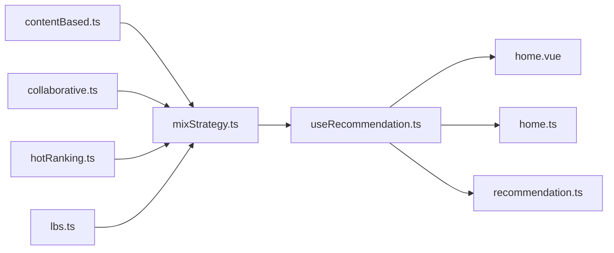

**Diagram sources**
- [mixStrategy.ts:363-387](file://src/pages/tabbar/home/algorithms/mixStrategy.ts#L363-L387)
- [contentBased.ts:259-296](file://src/pages/tabbar/home/algorithms/contentBased.ts#L259-L296)
- [collaborative.ts:170-222](file://src/pages/tabbar/home/algorithms/collaborative.ts#L170-L222)
- [hotRanking.ts:290-329](file://src/pages/tabbar/home/algorithms/hotRanking.ts#L290-L329)
- [lbs.ts:357-381](file://src/pages/tabbar/home/algorithms/lbs.ts#L357-L381)
- [useRecommendation.ts:14-201](file://src/pages/tabbar/home/composables/useRecommendation.ts#L14-L201)
- [home.vue:129-438](file://src/pages/tabbar/home.vue#L129-L438)
- [home.ts:68-134](file://src/api/home.ts#L68-L134)
- [recommendation.ts:1-119](file://src/pages/tabbar/home/types/recommendation.ts#L1-L119)

**Section sources**
- [mixStrategy.ts:363-387](file://src/pages/tabbar/home/algorithms/mixStrategy.ts#L363-L387)
- [contentBased.ts:259-296](file://src/pages/tabbar/home/algorithms/contentBased.ts#L259-L296)
- [collaborative.ts:170-222](file://src/pages/tabbar/home/algorithms/collaborative.ts#L170-L222)
- [hotRanking.ts:290-329](file://src/pages/tabbar/home/algorithms/hotRanking.ts#L290-L329)
- [lbs.ts:357-381](file://src/pages/tabbar/home/algorithms/lbs.ts#L357-L381)
- [useRecommendation.ts:14-201](file://src/pages/tabbar/home/composables/useRecommendation.ts#L14-L201)
- [home.vue:129-438](file://src/pages/tabbar/home.vue#L129-L438)
- [home.ts:68-134](file://src/api/home.ts#L68-L134)
- [recommendation.ts:1-119](file://src/pages/tabbar/home/types/recommendation.ts#L1-L119)

## Performance Considerations
- Matching complexity: for each candidate, iterate over its tags and check against user tag map; overall O(C × T) where C is candidates and T is average tags per candidate.
- Diversity adjustment: greedy selection with tag set maintenance; worst-case O(R^2) depending on remaining list size.
- Keyword extraction: TF-IDF per unique term; complexity proportional to total tokens across documents.
- Recommendations: sorting dominates; typical O(N log N) for top-K selection after scoring.
- Practical tips:
  - Precompute user tag map once per request.
  - Cache popularity scores and pre-filter candidates by coarse filters (e.g., categories).
  - Use efficient data structures (Maps/Sets) for tag lookups and diversity tracking.
  - Batch API calls and leverage caching for hot content and banners.

[No sources needed since this section provides general guidance]

## Troubleshooting Guide
- No recommendations returned:
  - Verify user interest exists and contains tags; otherwise cold-start fallback applies.
  - Ensure candidate contents have non-empty tags.
- Low diversity:
  - Increase diversity factor to encourage varied tags.
- Slow performance:
  - Reduce topK multiplier during initial scoring.
  - Pre-filter candidates by coarse criteria (e.g., type, category).
- Incorrect scoring:
  - Confirm tag normalization and matching logic.
  - Validate TF-IDF tokenization and stopword handling.

**Section sources**
- [contentBased.ts:276-279](file://src/pages/tabbar/home/algorithms/contentBased.ts#L276-L279)
- [contentBased.ts:171-226](file://src/pages/tabbar/home/algorithms/contentBased.ts#L171-L226)
- [contentBased.ts:104-130](file://src/pages/tabbar/home/algorithms/contentBased.ts#L104-L130)

## Conclusion
The content-based filtering implementation provides a clear, interpretable foundation for recommendations by aligning user interests with content attributes via weighted tags. It integrates seamlessly with a hybrid strategy that combines collaborative filtering, hot ranking, and LBS to deliver diverse, timely, and relevant recommendations. Robust feature extraction (TF-IDF), diversity adjustments, and cold-start handling ensure strong user experiences, while modular design and performance-conscious patterns support scalability.

[No sources needed since this section summarizes without analyzing specific files]

## Appendices

### Example Workflows

#### Content-Based Matching Workflow
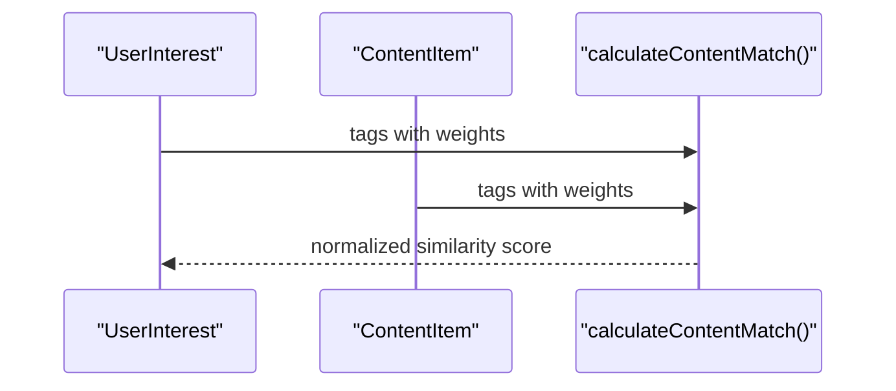

**Diagram sources**
- [contentBased.ts:34-70](file://src/pages/tabbar/home/algorithms/contentBased.ts#L34-L70)

#### TF-IDF Keyword Extraction
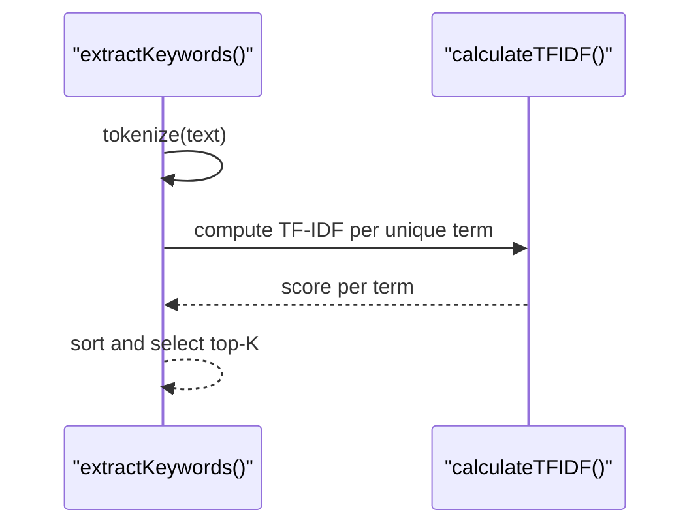

**Diagram sources**
- [contentBased.ts:104-130](file://src/pages/tabbar/home/algorithms/contentBased.ts#L104-L130)
- [contentBased.ts:79-95](file://src/pages/tabbar/home/algorithms/contentBased.ts#L79-L95)

### Data Models Overview
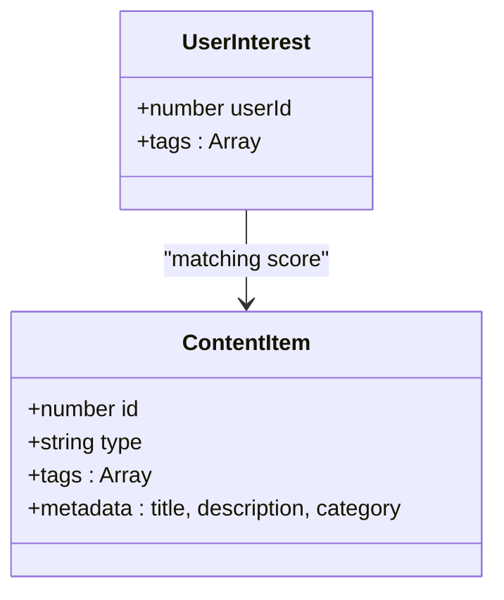

**Diagram sources**
- [contentBased.ts:6-26](file://src/pages/tabbar/home/algorithms/contentBased.ts#L6-L26)