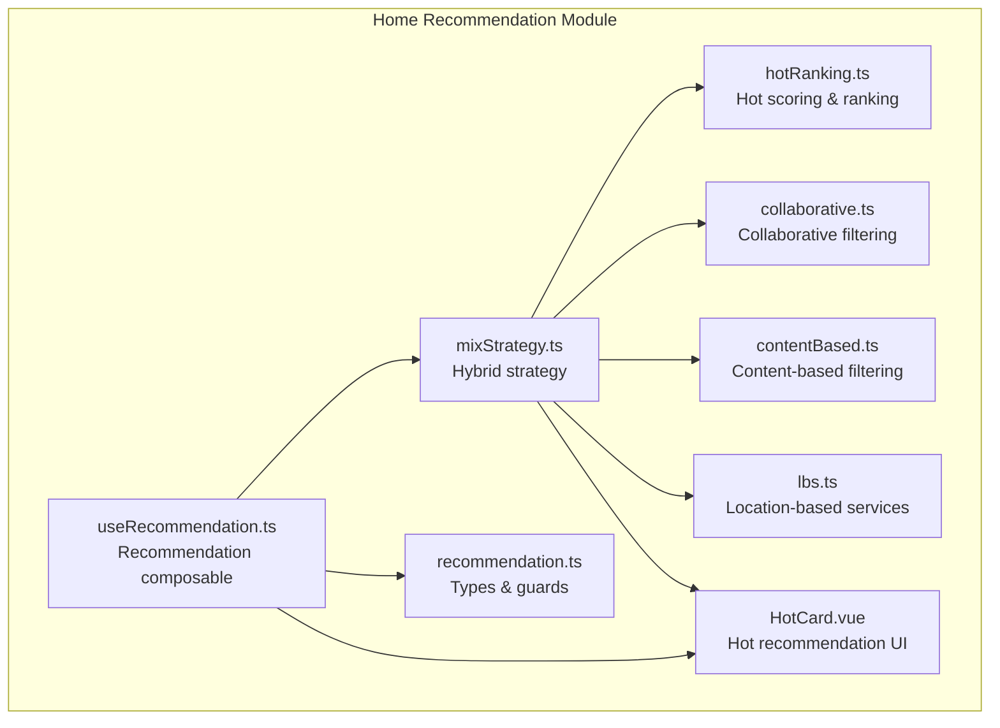
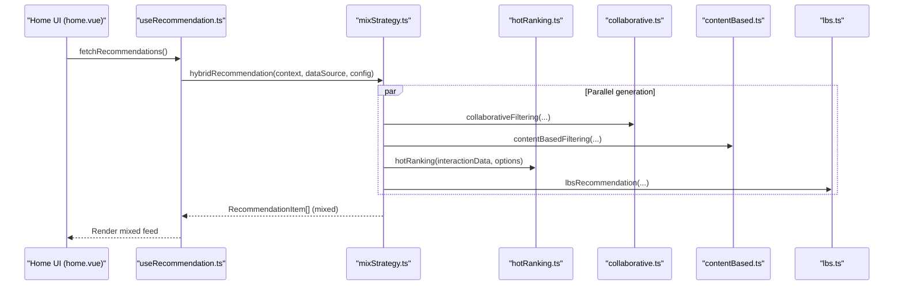
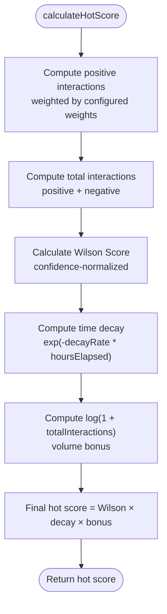
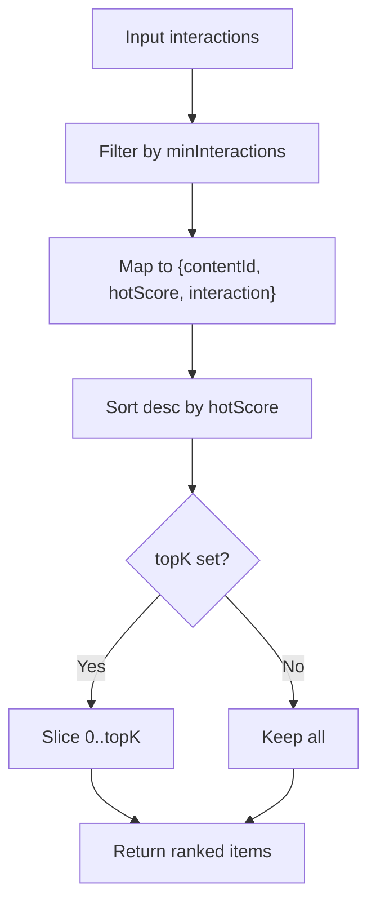
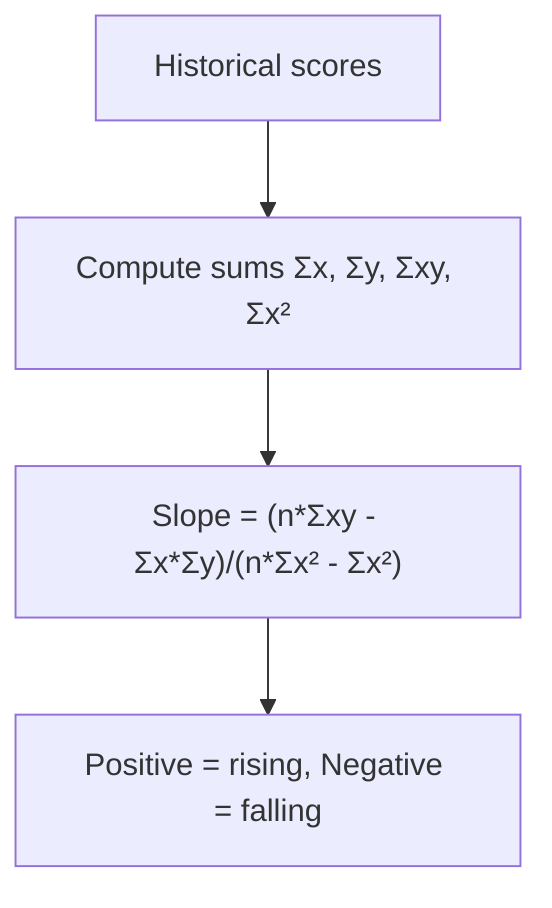
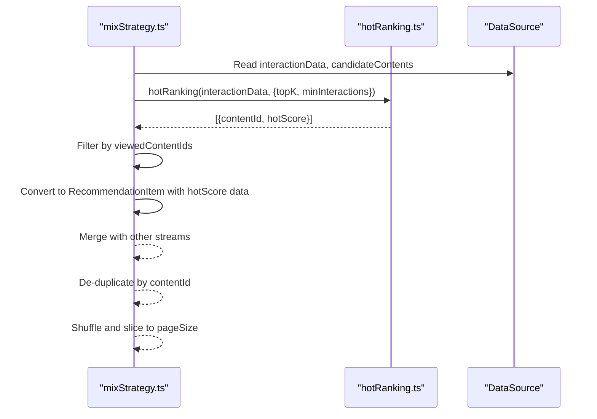
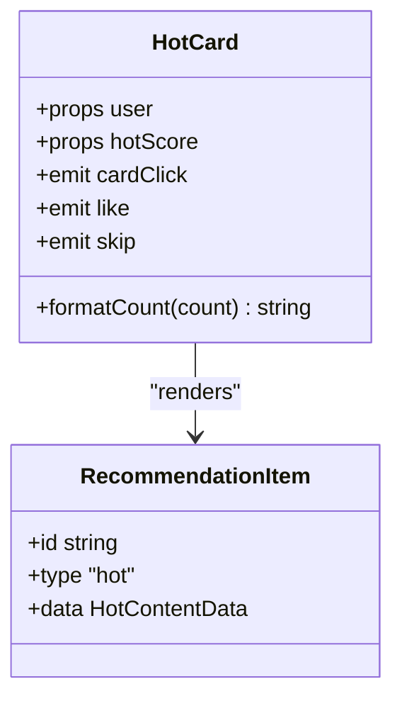
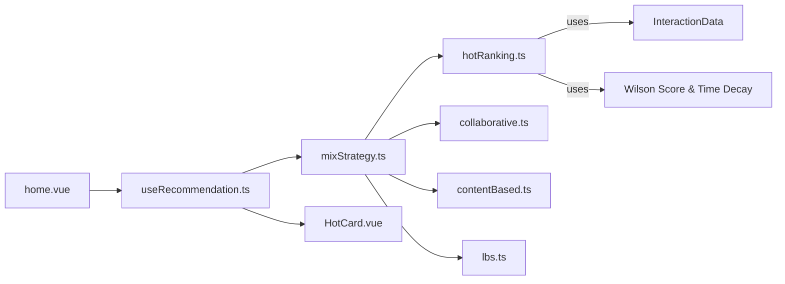

# Hot Ranking Algorithm

<cite>
**Referenced Files in This Document**
- [hotRanking.ts](file://src/pages/tabbar/home/algorithms/hotRanking.ts)
- [mixStrategy.ts](file://src/pages/tabbar/home/algorithms/mixStrategy.ts)
- [home.vue](file://src/pages/tabbar/home.vue)
- [useRecommendation.ts](file://src/pages/tabbar/home/composables/useRecommendation.ts)
- [recommendation.ts](file://src/pages/tabbar/home/types/recommendation.ts)
- [HotCard.vue](file://src/pages/tabbar/home/components/HotCard.vue)
- [collaborative.ts](file://src/pages/tabbar/home/algorithms/collaborative.ts)
- [contentBased.ts](file://src/pages/tabbar/home/algorithms/contentBased.ts)
- [lbs.ts](file://src/pages/tabbar/home/algorithms/lbs.ts)
</cite>

## Table of Contents
1. [Introduction](#introduction)
2. [Project Structure](#project-structure)
3. [Core Components](#core-components)
4. [Architecture Overview](#architecture-overview)
5. [Detailed Component Analysis](#detailed-component-analysis)
6. [Dependency Analysis](#dependency-analysis)
7. [Performance Considerations](#performance-considerations)
8. [Troubleshooting Guide](#troubleshooting-guide)
9. [Conclusion](#conclusion)

## Introduction
This document explains the hot ranking recommendation algorithm implemented in the project. It focuses on popularity-based ranking, the hot score calculation methodology (engagement metrics, recency factors, and decay functions), trending detection, time-sensitive ranking, and the integration with the broader hybrid recommendation system. It also covers optimization techniques, performance considerations, and balancing popular content discovery with personalization.

## Project Structure
The hot ranking algorithm resides under the home recommendation module and integrates with other recommendation strategies (collaborative filtering, content-based filtering, LBS, and topic/new user recommendations) through a hybrid strategy generator. The UI layer renders hot recommendations as dedicated cards.

**Diagram sources**
- [hotRanking.ts:1-329](file://src/pages/tabbar/home/algorithms/hotRanking.ts#L1-L329)
- [mixStrategy.ts:1-482](file://src/pages/tabbar/home/algorithms/mixStrategy.ts#L1-L482)
- [useRecommendation.ts:1-202](file://src/pages/tabbar/home/composables/useRecommendation.ts#L1-L202)
- [recommendation.ts:1-119](file://src/pages/tabbar/home/types/recommendation.ts#L1-L119)
- [HotCard.vue:1-287](file://src/pages/tabbar/home/components/HotCard.vue#L1-L287)
- [collaborative.ts:1-222](file://src/pages/tabbar/home/algorithms/collaborative.ts#L1-L222)
- [contentBased.ts:1-297](file://src/pages/tabbar/home/algorithms/contentBased.ts#L1-L297)
- [lbs.ts:1-381](file://src/pages/tabbar/home/algorithms/lbs.ts#L1-L381)

**Section sources**
- [hotRanking.ts:1-329](file://src/pages/tabbar/home/algorithms/hotRanking.ts#L1-L329)
- [mixStrategy.ts:1-482](file://src/pages/tabbar/home/algorithms/mixStrategy.ts#L1-L482)
- [useRecommendation.ts:1-202](file://src/pages/tabbar/home/composables/useRecommendation.ts#L1-L202)
- [recommendation.ts:1-119](file://src/pages/tabbar/home/types/recommendation.ts#L1-L119)
- [HotCard.vue:1-287](file://src/pages/tabbar/home/components/HotCard.vue#L1-L287)

## Core Components
- Hot scoring engine: Computes a popularity-based hot score using weighted engagement metrics, Wilson score confidence normalization, and exponential time decay.
- Ranking pipeline: Filters low-traffic content, computes scores, sorts, and optionally limits top-K results.
- Trending analytics: Provides trend analysis via simple linear regression on historical scores.
- Stratification: Divides ranked content into hot, trending, normal, and cold tiers.
- Hybrid integration: Supplies hot recommendations to the mixed recommendation stream with configurable ratio and de-duplication.
- UI rendering: Presents hot recommendations as visually distinct cards with engagement stats.

**Section sources**
- [hotRanking.ts:6-135](file://src/pages/tabbar/home/algorithms/hotRanking.ts#L6-L135)
- [hotRanking.ts:144-173](file://src/pages/tabbar/home/algorithms/hotRanking.ts#L144-L173)
- [hotRanking.ts:227-250](file://src/pages/tabbar/home/algorithms/hotRanking.ts#L227-L250)
- [hotRanking.ts:259-282](file://src/pages/tabbar/home/algorithms/hotRanking.ts#L259-L282)
- [mixStrategy.ts:171-210](file://src/pages/tabbar/home/algorithms/mixStrategy.ts#L171-L210)
- [HotCard.vue:65-101](file://src/pages/tabbar/home/components/HotCard.vue#L65-L101)

## Architecture Overview
The hybrid recommendation system orchestrates multiple algorithms. Hot ranking contributes a fixed proportion of the feed, with hot items generated from interaction data and filtered against previously viewed content.

**Diagram sources**
- [home.vue:164-172](file://src/pages/tabbar/home.vue#L164-L172)
- [useRecommendation.ts:32-82](file://src/pages/tabbar/home/composables/useRecommendation.ts#L32-L82)
- [mixStrategy.ts:363-416](file://src/pages/tabbar/home/algorithms/mixStrategy.ts#L363-L416)
- [hotRanking.ts:290-328](file://src/pages/tabbar/home/algorithms/hotRanking.ts#L290-L328)
- [collaborative.ts:170-221](file://src/pages/tabbar/home/algorithms/collaborative.ts#L170-L221)
- [contentBased.ts:259-296](file://src/pages/tabbar/home/algorithms/contentBased.ts#L259-L296)
- [lbs.ts:357-380](file://src/pages/tabbar/home/algorithms/lbs.ts#L357-L380)

## Detailed Component Analysis

### Hot Scoring Engine
The hot score combines quality and recency:
- Quality: Weighted positive interactions normalized by Wilson score to account for small sample sizes.
- Recency: Exponential time decay based on publish time and a decay rate.
- Volume: Logarithmic bonus for total interactions to cap extreme outliers.

**Diagram sources**
- [hotRanking.ts:80-135](file://src/pages/tabbar/home/algorithms/hotRanking.ts#L80-L135)

Key configuration options:
- decayRate: Controls how quickly older content loses relevance.
- wilsonConfidence: Adjusts the confidence band for Wilson score.
- interactionWeights: Assigns relative importance to likes, comments, favorites, shares.
- minInteractions: Threshold to filter out low-traffic content.

**Section sources**
- [hotRanking.ts:6-16](file://src/pages/tabbar/home/algorithms/hotRanking.ts#L6-L16)
- [hotRanking.ts:27-48](file://src/pages/tabbar/home/algorithms/hotRanking.ts#L27-L48)
- [hotRanking.ts:59-69](file://src/pages/tabbar/home/algorithms/hotRanking.ts#L59-L69)
- [hotRanking.ts:80-135](file://src/pages/tabbar/home/algorithms/hotRanking.ts#L80-L135)
- [hotRanking.ts:144-173](file://src/pages/tabbar/home/algorithms/hotRanking.ts#L144-L173)
- [hotRanking.ts:290-328](file://src/pages/tabbar/home/algorithms/hotRanking.ts#L290-L328)

### Ranking Pipeline
- Filters interactions below minInteractions threshold.
- Computes hot scores for valid items.
- Sorts descending by hot score.
- Optionally slices to topK.

**Diagram sources**
- [hotRanking.ts:144-173](file://src/pages/tabbar/home/algorithms/hotRanking.ts#L144-L173)
- [hotRanking.ts:290-328](file://src/pages/tabbar/home/algorithms/hotRanking.ts#L290-L328)

**Section sources**
- [hotRanking.ts:144-173](file://src/pages/tabbar/home/algorithms/hotRanking.ts#L144-L173)
- [hotRanking.ts:290-328](file://src/pages/tabbar/home/algorithms/hotRanking.ts#L290-L328)

### Trending Detection and Stratification
- Trending analysis: Uses simple linear regression on historical scores to infer upward/downward trends.
- Stratification: Divides ranked items into hot (top 10%), trending (next 20%), normal (next 40%), cold (bottom 30%).

**Diagram sources**
- [hotRanking.ts:227-250](file://src/pages/tabbar/home/algorithms/hotRanking.ts#L227-L250)

**Section sources**
- [hotRanking.ts:227-250](file://src/pages/tabbar/home/algorithms/hotRanking.ts#L227-L250)
- [hotRanking.ts:259-282](file://src/pages/tabbar/home/algorithms/hotRanking.ts#L259-L282)

### Hybrid Integration and Proportions
Hot ranking feeds a fixed proportion of the mixed recommendation stream. The hybrid strategy:
- Calculates per-type counts from a global ratio configuration.
- Generates hot recommendations from interaction data, filters by viewed content, and converts to RecommendationItem format.
- Merges with other streams, applies de-duplication, randomizes order, and caps to pageSize.

**Diagram sources**
- [mixStrategy.ts:171-210](file://src/pages/tabbar/home/algorithms/mixStrategy.ts#L171-L210)
- [hotRanking.ts:290-328](file://src/pages/tabbar/home/algorithms/hotRanking.ts#L290-L328)

**Section sources**
- [mixStrategy.ts:48-58](file://src/pages/tabbar/home/algorithms/mixStrategy.ts#L48-L58)
- [mixStrategy.ts:171-210](file://src/pages/tabbar/home/algorithms/mixStrategy.ts#L171-L210)
- [hotRanking.ts:290-328](file://src/pages/tabbar/home/algorithms/hotRanking.ts#L290-L328)

### UI Rendering of Hot Recommendations
Hot recommendations are rendered as visually distinct cards with engagement stats and actions. The UI emits events for user interactions and integrates with the recommendation tracking system.

**Diagram sources**
- [HotCard.vue:65-101](file://src/pages/tabbar/home/components/HotCard.vue#L65-L101)
- [recommendation.ts:48-55](file://src/pages/tabbar/home/types/recommendation.ts#L48-L55)

**Section sources**
- [HotCard.vue:1-287](file://src/pages/tabbar/home/components/HotCard.vue#L1-L287)
- [recommendation.ts:48-55](file://src/pages/tabbar/home/types/recommendation.ts#L48-L55)

## Dependency Analysis
- hotRanking.ts depends on:
  - InteractionData shape for input.
  - calculateWilsonScore and calculateTimeDecay for scoring primitives.
  - Optional external popularityScores map for cold-start fallbacks in higher-level content-based filtering.
- mixStrategy.ts depends on:
  - hotRanking.ts for hot recommendations.
  - collaborative.ts and contentBased.ts for personalized recommendations.
  - lbs.ts for nearby recommendations.
- home.vue integrates:
  - useRecommendation.ts for fetching and tracking.
  - HotCard.vue for rendering hot items.

**Diagram sources**
- [hotRanking.ts:6-16](file://src/pages/tabbar/home/algorithms/hotRanking.ts#L6-L16)
- [hotRanking.ts:27-69](file://src/pages/tabbar/home/algorithms/hotRanking.ts#L27-L69)
- [mixStrategy.ts:6-9](file://src/pages/tabbar/home/algorithms/mixStrategy.ts#L6-L9)
- [home.vue:144-172](file://src/pages/tabbar/home.vue#L144-L172)
- [HotCard.vue:65-101](file://src/pages/tabbar/home/components/HotCard.vue#L65-L101)

**Section sources**
- [hotRanking.ts:6-16](file://src/pages/tabbar/home/algorithms/hotRanking.ts#L6-L16)
- [hotRanking.ts:27-69](file://src/pages/tabbar/home/algorithms/hotRanking.ts#L27-L69)
- [mixStrategy.ts:6-9](file://src/pages/tabbar/home/algorithms/mixStrategy.ts#L6-L9)
- [home.vue:144-172](file://src/pages/tabbar/home.vue#L144-L172)
- [HotCard.vue:65-101](file://src/pages/tabbar/home/components/HotCard.vue#L65-L101)

## Performance Considerations
- Complexity:
  - Hot score computation per item: O(1).
  - Sorting N items: O(N log N).
  - Optional topK slicing: O(K).
- Memory:
  - Intermediate arrays for scored items and optional topK subset.
- Optimization techniques:
  - Pre-filter low-traffic content to reduce sorting cost.
  - Use topK to limit downstream processing.
  - Cache popularityScores for content-based fallbacks to avoid recomputation.
  - Batch process interactions and leverage parallelism in hybrid generation.
- Time sensitivity:
  - Exponential decay favors recent content; adjust decayRate to control shelf life.
  - Trending analysis enables dynamic re-ranking of emerging content.

[No sources needed since this section provides general guidance]

## Troubleshooting Guide
- Low hot scores despite high engagement:
  - Verify interactionWeights reflect platform priorities.
  - Check minInteractions threshold is not filtering intended content.
  - Confirm decayRate is appropriate for content lifecycle.
- Stale hot rankings:
  - Increase decayRate to reduce long-tail influence.
  - Consider trending analysis to detect and promote rising content.
- Mixed feed imbalance:
  - Adjust DEFAULT_CONFIG ratios to allocate more slots to hot.
  - Ensure de-duplication and randomization are functioning as expected.

**Section sources**
- [hotRanking.ts:83-103](file://src/pages/tabbar/home/algorithms/hotRanking.ts#L83-L103)
- [hotRanking.ts:292-304](file://src/pages/tabbar/home/algorithms/hotRanking.ts#L292-L304)
- [mixStrategy.ts:48-58](file://src/pages/tabbar/home/algorithms/mixStrategy.ts#L48-L58)
- [mixStrategy.ts:363-416](file://src/pages/tabbar/home/algorithms/mixStrategy.ts#L363-L416)

## Conclusion
The hot ranking algorithm provides a robust, time-aware popularity signal by combining weighted engagement metrics, confidence-normalized quality assessment, and exponential recency decay. Integrated into the hybrid recommendation system, it ensures timely discovery of trending content while maintaining balance with personalized, location-aware, and topic-driven recommendations. Tuning parameters such as decayRate, interactionWeights, and minInteractions allows operators to adapt the algorithm to different content lifecycles and platform goals.