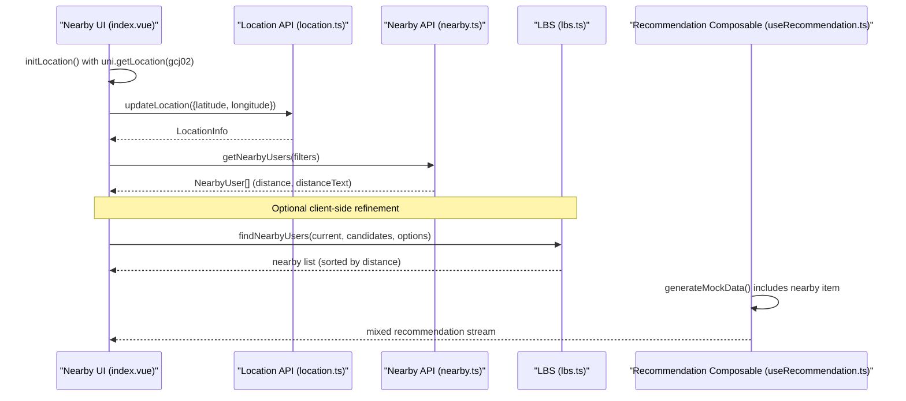
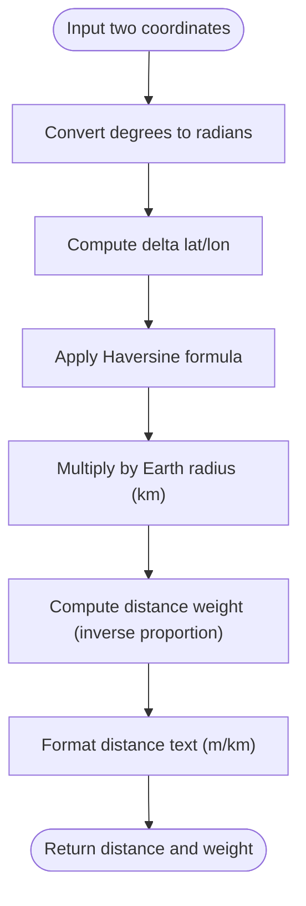
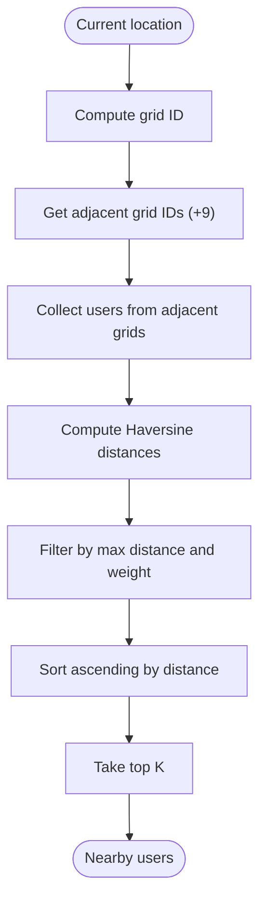
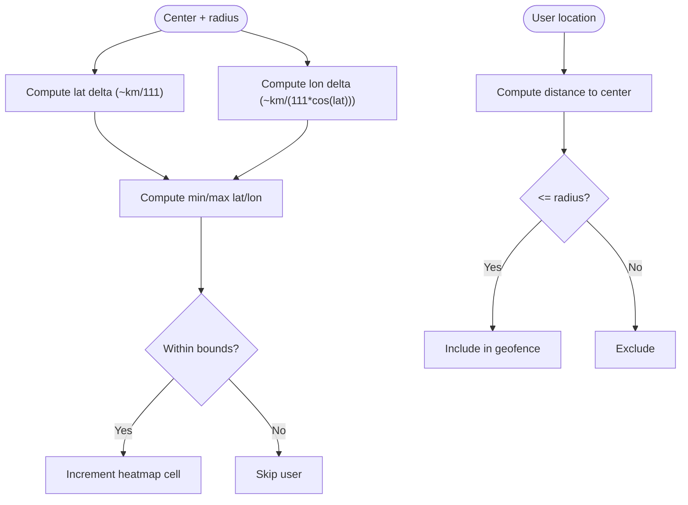
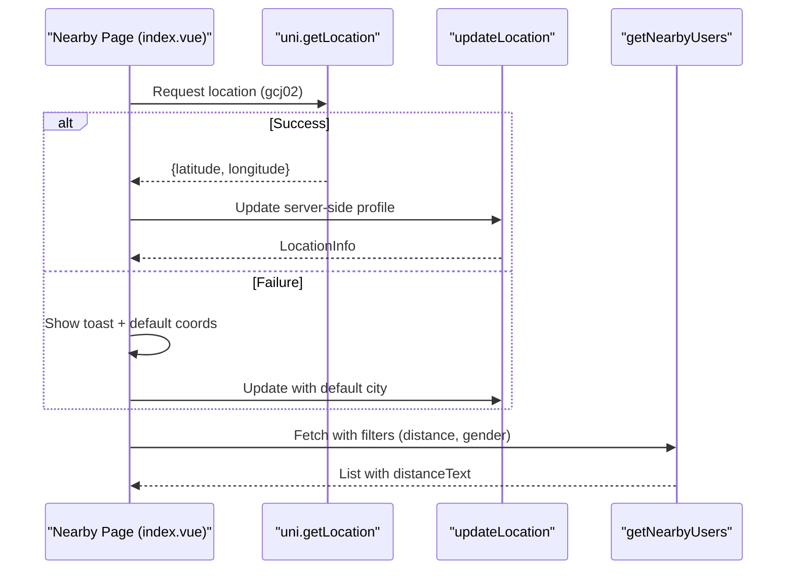
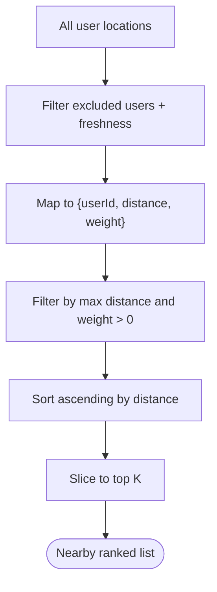
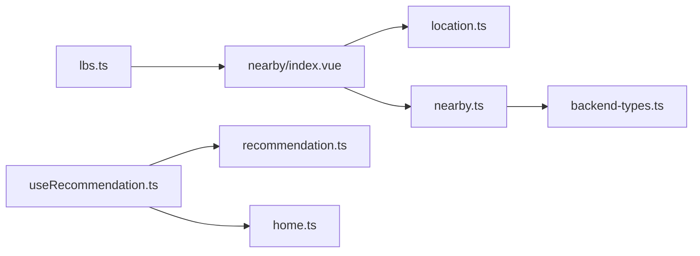

# Location-Based Services (LBS)

<cite>
**Referenced Files in This Document**
- [lbs.ts](file://src/pages/tabbar/home/algorithms/lbs.ts)
- [index.vue](file://src/pages/nearby/index.vue)
- [location.ts](file://src/api/modules/location.ts)
- [nearby.ts](file://src/api/modules/nearby.ts)
- [useRecommendation.ts](file://src/pages/tabbar/home/composables/useRecommendation.ts)
- [recommendation.ts](file://src/pages/tabbar/home/types/recommendation.ts)
- [backend-types.ts](file://src/types/api/backend-types.ts)
- [home.ts](file://src/api/home.ts)
- [homepage-refactoring-summary.md](file://docs/refactry/homepage-refactoring-summary.md)
- [nearby-people-development.md](file://docs/refactry/nearby-people-development.md)
</cite>

## Table of Contents
1. [Introduction](#introduction)
2. [Project Structure](#project-structure)
3. [Core Components](#core-components)
4. [Architecture Overview](#architecture-overview)
5. [Detailed Component Analysis](#detailed-component-analysis)
6. [Dependency Analysis](#dependency-analysis)
7. [Performance Considerations](#performance-considerations)
8. [Troubleshooting Guide](#troubleshooting-guide)
9. [Conclusion](#conclusion)
10. [Appendices](#appendices)

## Introduction
This document explains the Location-Based Services (LBS) recommendation algorithm implemented in the frontend. It covers geographic proximity matching, distance-based filtering, spatial indexing via grid hashing, proximity calculations using the Haversine formula, geographic boundary enforcement, and integration with device geolocation. It also documents how the LBS logic feeds into the broader recommendation pipeline and how the UI consumes location-aware results.

## Project Structure
The LBS implementation spans several modules:
- Algorithms: core geographic math and spatial indexing
- UI: nearby people page and recommendation composable
- APIs: location and nearby user endpoints
- Types: shared interfaces and enums

```mermaid
graph TB
subgraph "Algorithms"
LBS["lbs.ts<br/>Proximity, weights, grids, heatmaps"]
end
subgraph "UI"
NearUI["nearby/index.vue<br/>Nearby list UI + init location"]
RecComp["useRecommendation.ts<br/>Recommendation feed + nearby item generation"]
end
subgraph "API Layer"
LocAPI["location.ts<br/>updateLocation, getCurrentLocation, visibility"]
NearAPI["nearby.ts<br/>getNearbyUsers, stats, hello"]
HomeAPI["home.ts<br/>getUserLocation, updateUserLocation (placeholder)"]
end
subgraph "Types"
Types["recommendation.ts<br/>NearbyUserData"]
BT["backend-types.ts<br/>Gender, enums"]
end
NearUI --> LocAPI
NearUI --> NearAPI
RecComp --> HomeAPI
RecComp --> Types
LBS --> NearUI
LBS --> RecComp
```

**Diagram sources**
- [lbs.ts:1-381](file://src/pages/tabbar/home/algorithms/lbs.ts#L1-L381)
- [index.vue:1-712](file://src/pages/nearby/index.vue#L1-L712)
- [location.ts:1-79](file://src/api/modules/location.ts#L1-L79)
- [nearby.ts:1-82](file://src/api/modules/nearby.ts#L1-L82)
- [useRecommendation.ts:1-202](file://src/pages/tabbar/home/composables/useRecommendation.ts#L1-L202)
- [recommendation.ts:1-119](file://src/pages/tabbar/home/types/recommendation.ts#L1-L119)
- [backend-types.ts:1-764](file://src/types/api/backend-types.ts#L1-L764)
- [home.ts:1-197](file://src/api/home.ts#L1-L197)

**Section sources**
- [lbs.ts:1-381](file://src/pages/tabbar/home/algorithms/lbs.ts#L1-L381)
- [index.vue:1-712](file://src/pages/nearby/index.vue#L1-L712)
- [location.ts:1-79](file://src/api/modules/location.ts#L1-L79)
- [nearby.ts:1-82](file://src/api/modules/nearby.ts#L1-L82)
- [useRecommendation.ts:1-202](file://src/pages/tabbar/home/composables/useRecommendation.ts#L1-L202)
- [recommendation.ts:1-119](file://src/pages/tabbar/home/types/recommendation.ts#L1-L119)
- [backend-types.ts:1-764](file://src/types/api/backend-types.ts#L1-L764)
- [home.ts:1-197](file://src/api/home.ts#L1-L197)

## Core Components
- Proximity calculation: Haversine formula for accurate Earth-distance computation
- Distance weighting: inverse-proportion weight decay to emphasize closer matches
- Spatial indexing: grid hashing to accelerate neighbor queries
- Geographic boundary enforcement: bounding box and geofence checks
- Heatmap generation: density aggregation over a region
- UI integration: nearby list rendering and location initialization

**Section sources**
- [lbs.ts:39-77](file://src/pages/tabbar/home/algorithms/lbs.ts#L39-L77)
- [lbs.ts:101-158](file://src/pages/tabbar/home/algorithms/lbs.ts#L101-L158)
- [lbs.ts:186-207](file://src/pages/tabbar/home/algorithms/lbs.ts#L186-L207)
- [lbs.ts:217-241](file://src/pages/tabbar/home/algorithms/lbs.ts#L217-L241)
- [lbs.ts:308-348](file://src/pages/tabbar/home/algorithms/lbs.ts#L308-L348)

## Architecture Overview
The LBS pipeline connects device geolocation, server-side nearby queries, and client-side spatial algorithms.



**Diagram sources**
- [index.vue:213-244](file://src/pages/nearby/index.vue#L213-L244)
- [location.ts:32-42](file://src/api/modules/location.ts#L32-L42)
- [nearby.ts:41-49](file://src/api/modules/nearby.ts#L41-L49)
- [lbs.ts:101-158](file://src/pages/tabbar/home/algorithms/lbs.ts#L101-L158)
- [useRecommendation.ts:122-189](file://src/pages/tabbar/home/composables/useRecommendation.ts#L122-L189)

## Detailed Component Analysis

### Geographic Proximity Matching and Distance Metrics
- Distance metric: Haversine formula computes great-circle distance on a sphere, returning kilometers
- Distance weighting: inverse proportion to distance decays relevance for farther users
- Distance formatting: human-friendly units (meters/kilometers) for UI



**Diagram sources**
- [lbs.ts:39-53](file://src/pages/tabbar/home/algorithms/lbs.ts#L39-L53)
- [lbs.ts:63-77](file://src/pages/tabbar/home/algorithms/lbs.ts#L63-L77)
- [lbs.ts:84-92](file://src/pages/tabbar/home/algorithms/lbs.ts#L84-L92)

**Section sources**
- [lbs.ts:39-92](file://src/pages/tabbar/home/algorithms/lbs.ts#L39-L92)

### Spatial Indexing and Grid-Based Lookup
- Grid hashing: maps lat/lon to discrete grid cells based on grid size (default 1 km)
- Adjacent grids: collects a 3x3 neighborhood around the current location
- Fast lookup: reduces candidate set by scanning only adjacent grid buckets



**Diagram sources**
- [lbs.ts:217-241](file://src/pages/tabbar/home/algorithms/lbs.ts#L217-L241)
- [lbs.ts:250-297](file://src/pages/tabbar/home/algorithms/lbs.ts#L250-L297)

**Section sources**
- [lbs.ts:217-297](file://src/pages/tabbar/home/algorithms/lbs.ts#L217-L297)

### Geographic Boundary Enforcement
- Bounding box: estimates latitude/longitude deltas from radius assuming ~111 km/degree
- Geofencing: checks whether a user lies within a circular fence centered at a point
- Heatmap: aggregates user counts per grid cell within a rectangular region



**Diagram sources**
- [lbs.ts:186-207](file://src/pages/tabbar/home/algorithms/lbs.ts#L186-L207)
- [lbs.ts:169-176](file://src/pages/tabbar/home/algorithms/lbs.ts#L169-L176)
- [lbs.ts:308-348](file://src/pages/tabbar/home/algorithms/lbs.ts#L308-L348)

**Section sources**
- [lbs.ts:169-207](file://src/pages/tabbar/home/algorithms/lbs.ts#L169-L207)
- [lbs.ts:308-348](file://src/pages/tabbar/home/algorithms/lbs.ts#L308-L348)

### Proximity Filtering and Ranking in the UI
- Device geolocation: initializes location using GCJ-02 projection and updates server-side profile
- Nearby list: loads users with distance and distanceText, supports distance/gender filters
- Offline fallback: on location failure, falls back to a default city coordinate



**Diagram sources**
- [index.vue:213-244](file://src/pages/nearby/index.vue#L213-L244)
- [location.ts:32-42](file://src/api/modules/location.ts#L32-L42)
- [nearby.ts:41-49](file://src/api/modules/nearby.ts#L41-L49)

**Section sources**
- [index.vue:213-244](file://src/pages/nearby/index.vue#L213-L244)
- [nearby.ts:28-49](file://src/api/modules/nearby.ts#L28-L49)

### Location-Aware Ranking and Recommendation Scoring
- Distance-based weight: closer users receive higher weight for proximity relevance
- Mixed recommendation: nearby items are generated in the recommendation composable and mixed with other types
- Freshness filter: excludes stale locations beyond a configurable threshold



**Diagram sources**
- [lbs.ts:101-158](file://src/pages/tabbar/home/algorithms/lbs.ts#L101-L158)
- [useRecommendation.ts:122-189](file://src/pages/tabbar/home/composables/useRecommendation.ts#L122-L189)

**Section sources**
- [lbs.ts:101-158](file://src/pages/tabbar/home/algorithms/lbs.ts#L101-L158)
- [useRecommendation.ts:122-189](file://src/pages/tabbar/home/composables/useRecommendation.ts#L122-L189)

### Coordinate Systems and Map Integrations
- Device location: retrieved via uni.getLocation with gcj02 (Mars/GCJ-02) projection commonly used in China
- Backend updates: updateLocation accepts latitude/longitude and optional city/province/district/address
- UI consumption: distanceText is rendered directly from backend-provided fields

Integration notes:
- Map APIs: the codebase uses uni.getLocation; map rendering and routing would be integrated at the UI layer
- Offline handling: default coordinates are used when device location fails

**Section sources**
- [index.vue:216-224](file://src/pages/nearby/index.vue#L216-L224)
- [location.ts:32-42](file://src/api/modules/location.ts#L32-L42)
- [nearby.ts:41-49](file://src/api/modules/nearby.ts#L41-L49)

## Dependency Analysis
- UI depends on:
  - Location API for updating and retrieving location
  - Nearby API for fetching users near the current location
- Algorithms depend on:
  - Pure geometric functions (no external dependencies)
- Recommendation composable depends on:
  - Mock data generation for nearby items
  - Types for recommendation item shapes



**Diagram sources**
- [index.vue:142-144](file://src/pages/nearby/index.vue#L142-L144)
- [location.ts:1-79](file://src/api/modules/location.ts#L1-L79)
- [nearby.ts:1-82](file://src/api/modules/nearby.ts#L1-L82)
- [lbs.ts:1-381](file://src/pages/tabbar/home/algorithms/lbs.ts#L1-L381)
- [useRecommendation.ts:1-202](file://src/pages/tabbar/home/composables/useRecommendation.ts#L1-L202)
- [recommendation.ts:1-119](file://src/pages/tabbar/home/types/recommendation.ts#L1-L119)
- [home.ts:1-197](file://src/api/home.ts#L1-L197)
- [backend-types.ts:1-764](file://src/types/api/backend-types.ts#L1-L764)

**Section sources**
- [index.vue:142-144](file://src/pages/nearby/index.vue#L142-L144)
- [lbs.ts:1-381](file://src/pages/tabbar/home/algorithms/lbs.ts#L1-L381)
- [useRecommendation.ts:1-202](file://src/pages/tabbar/home/composables/useRecommendation.ts#L1-L202)

## Performance Considerations
- Prefer grid-based lookup for large datasets to reduce O(n) distance computations
- Apply bounding box pre-filtering to limit candidate sets before precise distance checks
- Cap maxResults/topK to avoid heavy sorting on large lists
- Cache recent location updates and avoid redundant network calls during quick refreshes
- Use distanceText and formatted weights to minimize UI reflows while maintaining readability

[No sources needed since this section provides general guidance]

## Troubleshooting Guide
Common issues and resolutions:
- Location permission denied: show a toast prompting the user to enable location permissions; fall back to default city coordinates
- Network errors when loading nearby users: display a friendly message and retry logic
- Stale location data: exclude users whose locationUpdateTime exceeds the configured freshness threshold

**Section sources**
- [index.vue:225-244](file://src/pages/nearby/index.vue#L225-L244)
- [lbs.ts:135-142](file://src/pages/tabbar/home/algorithms/lbs.ts#L135-L142)
- [nearby-people-development.md:566-579](file://docs/refactry/nearby-people-development.md#L566-L579)

## Conclusion
The LBS recommendation algorithm combines precise geographic calculations with efficient spatial indexing to deliver relevant nearby users. It integrates cleanly with the UI’s location initialization and nearby list rendering, while the recommendation composable can incorporate nearby items into a mixed recommendation stream. The design balances accuracy (Haversine), performance (grids), and user experience (distance formatting and freshness).

[No sources needed since this section summarizes without analyzing specific files]

## Appendices

### Privacy and Accuracy Considerations
- Location accuracy: device-reported accuracy varies; consider smoothing or caching to reduce jitter
- Visibility controls: expose location visibility toggles via setLocationVisibility
- Consent: ensure users understand how location is used; provide opt-out mechanisms

**Section sources**
- [location.ts:76-78](file://src/api/modules/location.ts#L76-L78)

### Battery Optimization Tips
- Batch location updates and throttle frequent refreshes
- Use background location sparingly; prefer foreground updates
- Combine with network-aware loading to minimize unnecessary requests

[No sources needed since this section provides general guidance]

### Example Workflows
- Proximity filtering: adjust distance slider to refine nearby results; observe distanceText updates
- Location-aware ranking: nearby users appear first due to distance-based sorting
- Geographic recommendation scoring: weight decreases with distance; users within maxDistance are prioritized

**Section sources**
- [index.vue:174-182](file://src/pages/nearby/index.vue#L174-L182)
- [lbs.ts:101-158](file://src/pages/tabbar/home/algorithms/lbs.ts#L101-L158)