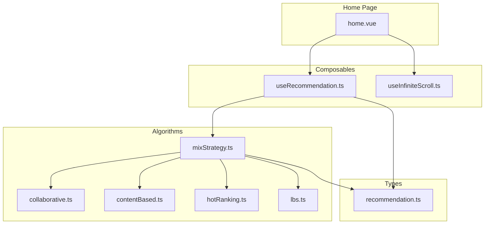
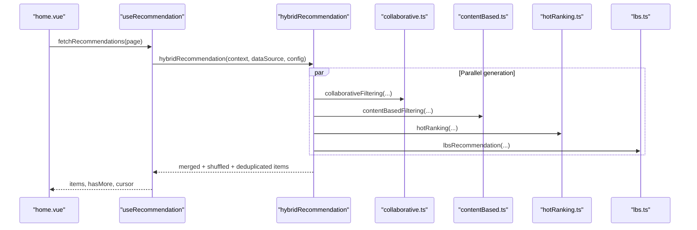
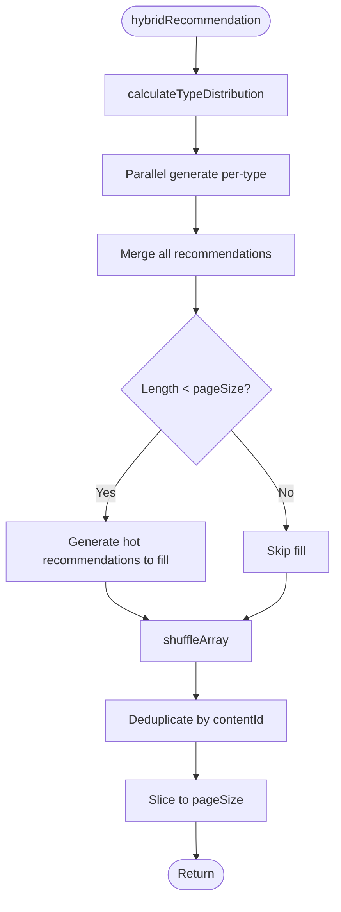
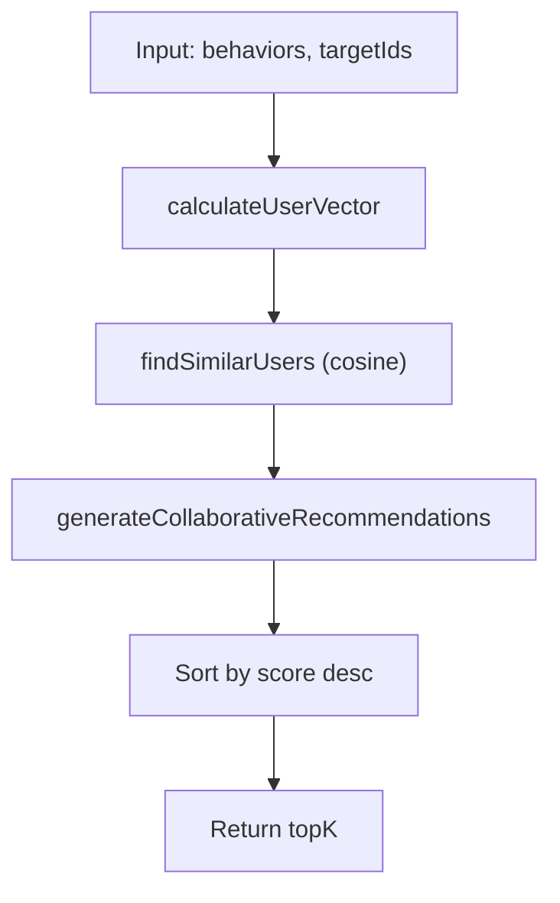
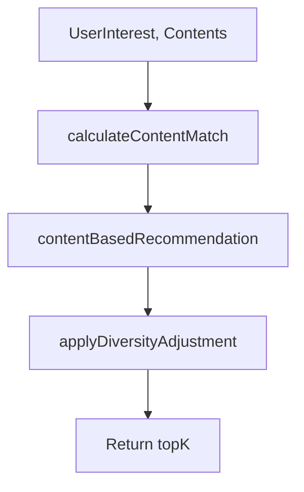
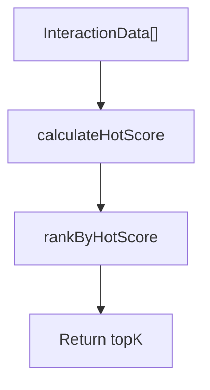
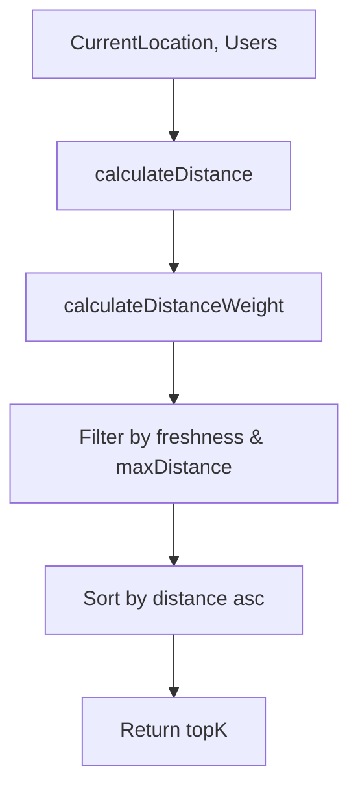
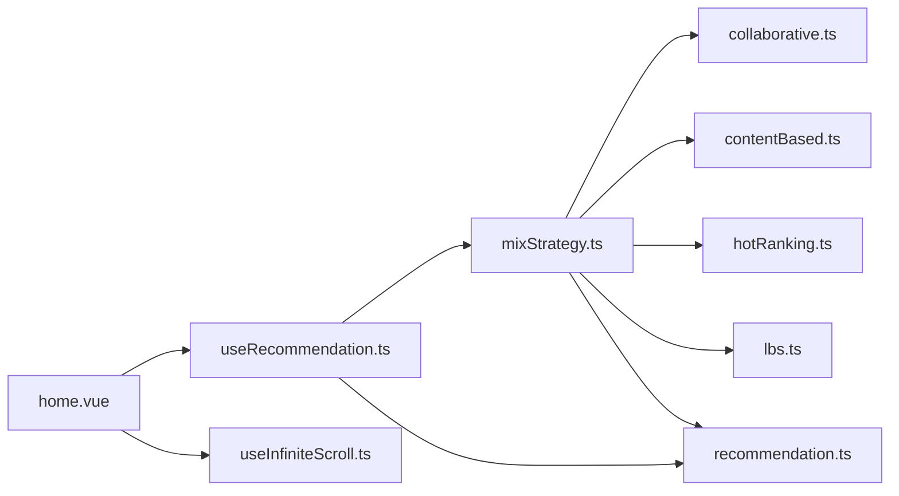

# Mixed Strategy Implementation

<cite>
**Referenced Files in This Document**
- [mixStrategy.ts](file://src/pages/tabbar/home/algorithms/mixStrategy.ts)
- [collaborative.ts](file://src/pages/tabbar/home/algorithms/collaborative.ts)
- [contentBased.ts](file://src/pages/tabbar/home/algorithms/contentBased.ts)
- [hotRanking.ts](file://src/pages/tabbar/home/algorithms/hotRanking.ts)
- [lbs.ts](file://src/pages/tabbar/home/algorithms/lbs.ts)
- [useRecommendation.ts](file://src/pages/tabbar/home/composables/useRecommendation.ts)
- [useInfiniteScroll.ts](file://src/pages/tabbar/home/composables/useInfiniteScroll.ts)
- [recommendation.ts](file://src/pages/tabbar/home/types/recommendation.ts)
- [home.vue](file://src/pages/tabbar/home.vue)
</cite>

## Table of Contents
1. [Introduction](#introduction)
2. [Project Structure](#project-structure)
3. [Core Components](#core-components)
4. [Architecture Overview](#architecture-overview)
5. [Detailed Component Analysis](#detailed-component-analysis)
6. [Dependency Analysis](#dependency-analysis)
7. [Performance Considerations](#performance-considerations)
8. [Troubleshooting Guide](#troubleshooting-guide)
9. [Conclusion](#conclusion)
10. [Appendices](#appendices)

## Introduction
This document explains the mixed strategy recommendation implementation used in the home feed. It details how multiple recommendation algorithms are composed to produce unified recommendations, including strategy composition, weight balancing, prioritization, ensemble methods, voting systems, dynamic switching, fusion techniques, conflict resolution, and strategy adaptation. It also covers composable hooks for recommendation integration and infinite scroll functionality.

## Project Structure
The recommendation system is organized around a hybrid strategy that orchestrates multiple specialized algorithms:
- Hybrid strategy orchestrator
- Individual algorithm modules (collaborative filtering, content-based, hot ranking, LBS)
- Composables for recommendation lifecycle and infinite scroll
- Type definitions for recommendation items
- Home page integration

**Diagram sources**
- [home.vue:129-439](file://src/pages/tabbar/home.vue#L129-L439)
- [useRecommendation.ts:14-201](file://src/pages/tabbar/home/composables/useRecommendation.ts#L14-L201)
- [useInfiniteScroll.ts:9-71](file://src/pages/tabbar/home/composables/useInfiniteScroll.ts#L9-L71)
- [mixStrategy.ts:363-416](file://src/pages/tabbar/home/algorithms/mixStrategy.ts#L363-L416)
- [collaborative.ts:170-222](file://src/pages/tabbar/home/algorithms/collaborative.ts#L170-L222)
- [contentBased.ts:259-297](file://src/pages/tabbar/home/algorithms/contentBased.ts#L259-L297)
- [hotRanking.ts:290-329](file://src/pages/tabbar/home/algorithms/hotRanking.ts#L290-L329)
- [lbs.ts:357-381](file://src/pages/tabbar/home/algorithms/lbs.ts#L357-L381)
- [recommendation.ts:76-119](file://src/pages/tabbar/home/types/recommendation.ts#L76-L119)

**Section sources**
- [home.vue:129-439](file://src/pages/tabbar/home.vue#L129-L439)
- [useRecommendation.ts:14-201](file://src/pages/tabbar/home/composables/useRecommendation.ts#L14-L201)
- [mixStrategy.ts:363-416](file://src/pages/tabbar/home/algorithms/mixStrategy.ts#L363-L416)

## Core Components
- Hybrid recommendation orchestrator: Computes type distributions, executes algorithms in parallel, merges outputs, applies fallbacks, shuffles, deduplicates, and returns a balanced stream.
- Algorithm modules:
  - Collaborative filtering: Builds user vectors, computes similarity, generates scored recommendations.
  - Content-based filtering: Matches user interests to content tags, applies diversity adjustment, handles cold start via popularity.
  - Hot ranking: Scores content using Wilson score, time decay, and interaction weights; supports thresholds and stratification.
  - LBS: Finds nearby users by distance weighting and freshness constraints.
- Composables:
  - useRecommendation: Manages pagination, mock data fallback, and user action tracking.
  - useInfiniteScroll: Handles scroll thresholds, load-more, refresh, and hasMore state.
- Types: Defines recommendation item shapes, guards, and data models.

**Section sources**
- [mixStrategy.ts:92-102](file://src/pages/tabbar/home/algorithms/mixStrategy.ts#L92-L102)
- [mixStrategy.ts:363-416](file://src/pages/tabbar/home/algorithms/mixStrategy.ts#L363-L416)
- [collaborative.ts:170-222](file://src/pages/tabbar/home/algorithms/collaborative.ts#L170-L222)
- [contentBased.ts:259-297](file://src/pages/tabbar/home/algorithms/contentBased.ts#L259-L297)
- [hotRanking.ts:290-329](file://src/pages/tabbar/home/algorithms/hotRanking.ts#L290-L329)
- [lbs.ts:357-381](file://src/pages/tabbar/home/algorithms/lbs.ts#L357-L381)
- [useRecommendation.ts:14-201](file://src/pages/tabbar/home/composables/useRecommendation.ts#L14-L201)
- [useInfiniteScroll.ts:9-71](file://src/pages/tabbar/home/composables/useInfiniteScroll.ts#L9-L71)
- [recommendation.ts:76-119](file://src/pages/tabbar/home/types/recommendation.ts#L76-L119)

## Architecture Overview
The hybrid strategy composes five recommendation types with fixed ratios and a configurable page size. Each type is generated by a dedicated algorithm module, then merged, shuffled, and deduplicated. The orchestrator ensures a minimum target count by supplementing with hot content when necessary.

**Diagram sources**
- [home.vue:164-172](file://src/pages/tabbar/home.vue#L164-L172)
- [useRecommendation.ts:32-82](file://src/pages/tabbar/home/composables/useRecommendation.ts#L32-L82)
- [mixStrategy.ts:363-378](file://src/pages/tabbar/home/algorithms/mixStrategy.ts#L363-L378)
- [collaborative.ts:170-222](file://src/pages/tabbar/home/algorithms/collaborative.ts#L170-L222)
- [contentBased.ts:259-297](file://src/pages/tabbar/home/algorithms/contentBased.ts#L259-L297)
- [hotRanking.ts:290-329](file://src/pages/tabbar/home/algorithms/hotRanking.ts#L290-L329)
- [lbs.ts:357-381](file://src/pages/tabbar/home/algorithms/lbs.ts#L357-L381)

## Detailed Component Analysis

### Hybrid Strategy Orchestrator
- Type distribution: Computes per-type counts from ratios and page size.
- Parallel generation: Executes personalized, hot, nearby, topic, and new-user generators concurrently.
- Fallback: If total recommendations are below target, fills with hot-ranked items.
- Shuffle and deduplicate: Randomizes order and removes duplicates by contentId.
- Stream generator: Tracks viewed contentIds across pages and exposes reset/getCurrentPage.

**Diagram sources**
- [mixStrategy.ts:363-416](file://src/pages/tabbar/home/algorithms/mixStrategy.ts#L363-L416)
- [mixStrategy.ts:347-354](file://src/pages/tabbar/home/algorithms/mixStrategy.ts#L347-L354)

**Section sources**
- [mixStrategy.ts:92-102](file://src/pages/tabbar/home/algorithms/mixStrategy.ts#L92-L102)
- [mixStrategy.ts:363-416](file://src/pages/tabbar/home/algorithms/mixStrategy.ts#L363-L416)
- [mixStrategy.ts:421-482](file://src/pages/tabbar/home/algorithms/mixStrategy.ts#L421-L482)

### Collaborative Filtering
- User behavior vectors built from actions with weighted contributions.
- Cosine similarity used to find similar users.
- Generates scored recommendations by aggregating similar-user interactions weighted by similarity and action weights.

**Diagram sources**
- [collaborative.ts:36-51](file://src/pages/tabbar/home/algorithms/collaborative.ts#L36-L51)
- [collaborative.ts:88-111](file://src/pages/tabbar/home/algorithms/collaborative.ts#L88-L111)
- [collaborative.ts:121-161](file://src/pages/tabbar/home/algorithms/collaborative.ts#L121-L161)
- [collaborative.ts:170-222](file://src/pages/tabbar/home/algorithms/collaborative.ts#L170-L222)

**Section sources**
- [collaborative.ts:22-28](file://src/pages/tabbar/home/algorithms/collaborative.ts#L22-L28)
- [collaborative.ts:36-79](file://src/pages/tabbar/home/algorithms/collaborative.ts#L36-L79)
- [collaborative.ts:170-222](file://src/pages/tabbar/home/algorithms/collaborative.ts#L170-L222)

### Content-Based Filtering
- Calculates match scores between user interest tags and content tags.
- Applies diversity adjustment to avoid repetitive categories.
- Cold-start fallback uses popularity scores.

**Diagram sources**
- [contentBased.ts:34-70](file://src/pages/tabbar/home/algorithms/contentBased.ts#L34-L70)
- [contentBased.ts:140-163](file://src/pages/tabbar/home/algorithms/contentBased.ts#L140-L163)
- [contentBased.ts:171-226](file://src/pages/tabbar/home/algorithms/contentBased.ts#L171-L226)
- [contentBased.ts:259-297](file://src/pages/tabbar/home/algorithms/contentBased.ts#L259-L297)

**Section sources**
- [contentBased.ts:259-297](file://src/pages/tabbar/home/algorithms/contentBased.ts#L259-L297)

### Hot Ranking
- Computes Wilson score for quality, applies time decay, and adds interaction bonus.
- Supports thresholds, weights, and stratification.

**Diagram sources**
- [hotRanking.ts:80-135](file://src/pages/tabbar/home/algorithms/hotRanking.ts#L80-L135)
- [hotRanking.ts:144-173](file://src/pages/tabbar/home/algorithms/hotRanking.ts#L144-L173)
- [hotRanking.ts:290-329](file://src/pages/tabbar/home/algorithms/hotRanking.ts#L290-L329)

**Section sources**
- [hotRanking.ts:290-329](file://src/pages/tabbar/home/algorithms/hotRanking.ts#L290-L329)

### LBS Recommendation
- Computes distances, applies distance-based weights, filters by freshness, sorts by proximity.

**Diagram sources**
- [lbs.ts:39-53](file://src/pages/tabbar/home/algorithms/lbs.ts#L39-L53)
- [lbs.ts:63-77](file://src/pages/tabbar/home/algorithms/lbs.ts#L63-L77)
- [lbs.ts:101-158](file://src/pages/tabbar/home/algorithms/lbs.ts#L101-L158)
- [lbs.ts:357-381](file://src/pages/tabbar/home/algorithms/lbs.ts#L357-L381)

**Section sources**
- [lbs.ts:101-158](file://src/pages/tabbar/home/algorithms/lbs.ts#L101-L158)
- [lbs.ts:357-381](file://src/pages/tabbar/home/algorithms/lbs.ts#L357-L381)

### Recommendation Composition and Weight Balancing
- Fixed ratios define the proportion of each recommendation type per page.
- Personalized combines collaborative (0.6) and content-based (0.4) scores.
- Fallback to hot content ensures sufficient output when a generator yields few results.
- Shuffle prevents pattern bias; deduplication avoids repeated content.

**Section sources**
- [mixStrategy.ts:48-58](file://src/pages/tabbar/home/algorithms/mixStrategy.ts#L48-L58)
- [mixStrategy.ts:135-144](file://src/pages/tabbar/home/algorithms/mixStrategy.ts#L135-L144)
- [mixStrategy.ts:389-416](file://src/pages/tabbar/home/algorithms/mixStrategy.ts#L389-L416)

### Strategy Prioritization and Dynamic Switching
- The orchestrator runs all generators in parallel and merges results deterministically.
- No runtime switching is implemented; strategy adaptation can be introduced by adjusting ratios or adding conditional logic in future iterations.

**Section sources**
- [mixStrategy.ts:372-378](file://src/pages/tabbar/home/algorithms/mixStrategy.ts#L372-L378)

### Ensemble Methods and Voting Systems
- Weighted combination within personalized: collaborative (0.6) plus content-based (0.4).
- No explicit majority voting across algorithms; scoring aggregation is used instead.

**Section sources**
- [mixStrategy.ts:135-144](file://src/pages/tabbar/home/algorithms/mixStrategy.ts#L135-L144)

### Conflict Resolution and Fusion Techniques
- Conflict resolution occurs implicitly via:
  - Deduplication by contentId
  - Shuffle to randomize order
  - Fallback hot content to meet target size
- Fusion technique: merge lists, then deduplicate and truncate.

**Section sources**
- [mixStrategy.ts:406-415](file://src/pages/tabbar/home/algorithms/mixStrategy.ts#L406-L415)

### Strategy Adaptation Based on User Behavior
- The orchestrator accepts a context containing userBehaviors and viewedContentIds to filter and personalize outputs.
- Future adaptations could adjust ratios dynamically based on engagement signals.

**Section sources**
- [mixStrategy.ts:63-69](file://src/pages/tabbar/home/algorithms/mixStrategy.ts#L63-L69)

### Composable Hooks for Recommendation Integration
- useRecommendation: Provides items, loading, hasMore, pagination controls, and action tracking; supports mock data fallback.
- useInfiniteScroll: Manages scroll thresholds, load-more, refresh, and hasMore state.

**Section sources**
- [useRecommendation.ts:14-201](file://src/pages/tabbar/home/composables/useRecommendation.ts#L14-L201)
- [useInfiniteScroll.ts:9-71](file://src/pages/tabbar/home/composables/useInfiniteScroll.ts#L9-L71)

### Infinite Scroll Functionality
- Detects proximity to bottom of scroll container and triggers loadMore.
- Supports refresh and updates hasMore accordingly.

**Section sources**
- [useInfiniteScroll.ts:17-58](file://src/pages/tabbar/home/composables/useInfiniteScroll.ts#L17-L58)

### Home Page Integration
- Initializes banners and recommendations in parallel.
- Renders recommendation cards conditionally by type.
- Tracks user actions and integrates NPS modal.

**Section sources**
- [home.vue:164-178](file://src/pages/tabbar/home.vue#L164-L178)
- [home.vue:46-96](file://src/pages/tabbar/home.vue#L46-L96)
- [home.vue:325-382](file://src/pages/tabbar/home.vue#L325-L382)

## Dependency Analysis
The hybrid strategy depends on algorithm modules and type definitions. The home page composes the recommendation pipeline via composable hooks.

**Diagram sources**
- [mixStrategy.ts:6-9](file://src/pages/tabbar/home/algorithms/mixStrategy.ts#L6-L9)
- [recommendation.ts:76-119](file://src/pages/tabbar/home/types/recommendation.ts#L76-L119)
- [useRecommendation.ts:14-201](file://src/pages/tabbar/home/composables/useRecommendation.ts#L14-L201)
- [home.vue:144-145](file://src/pages/tabbar/home.vue#L144-L145)

**Section sources**
- [mixStrategy.ts:6-9](file://src/pages/tabbar/home/algorithms/mixStrategy.ts#L6-L9)
- [recommendation.ts:76-119](file://src/pages/tabbar/home/types/recommendation.ts#L76-L119)
- [useRecommendation.ts:14-201](file://src/pages/tabbar/home/composables/useRecommendation.ts#L14-L201)
- [home.vue:144-145](file://src/pages/tabbar/home.vue#L144-L145)

## Performance Considerations
- Parallelism: Generators for each type run concurrently to reduce latency.
- Deduplication cost: Linear-time deduplication by contentId; acceptable given typical page sizes.
- Shuffle overhead: Minimal impact for typical page sizes.
- Fallback hot ranking: Ensures stable output size with minimal extra computation.
- Pagination and cursors: Backend pagination reduces payload sizes; frontend composable supports cursor-based continuation.

[No sources needed since this section provides general guidance]

## Troubleshooting Guide
- API failures: The recommendation composable falls back to mock data and sets hasMore appropriately.
- Infinite scroll not triggering: Verify threshold and scroll container configuration.
- Duplicate items: Confirm deduplication logic and contentId uniqueness.
- Missing hot content: Ensure fallback logic is executed when generator output is insufficient.

**Section sources**
- [useRecommendation.ts:66-81](file://src/pages/tabbar/home/composables/useRecommendation.ts#L66-L81)
- [useInfiniteScroll.ts:17-58](file://src/pages/tabbar/home/composables/useInfiniteScroll.ts#L17-L58)
- [mixStrategy.ts:389-416](file://src/pages/tabbar/home/algorithms/mixStrategy.ts#L389-L416)

## Conclusion
The mixed strategy recommendation system composes multiple algorithms into a single, coherent feed. It balances outputs using fixed ratios, fuses results with weighted personalization, and ensures robustness through fallbacks, shuffling, and deduplication. The composable hooks integrate seamlessly with the home page, supporting infinite scroll and user action tracking.

[No sources needed since this section summarizes without analyzing specific files]

## Appendices

### Strategy Configuration Examples
- Adjust ratios in the orchestrator’s default configuration to change type proportions.
- Modify page size to control batch sizing.
- Tune hot ranking thresholds and decay rates for content freshness.

**Section sources**
- [mixStrategy.ts:48-58](file://src/pages/tabbar/home/algorithms/mixStrategy.ts#L48-L58)
- [hotRanking.ts:290-329](file://src/pages/tabbar/home/algorithms/hotRanking.ts#L290-L329)

### A/B Testing Frameworks
- Strategy-level: Compare different ratio configurations by assigning groups to distinct ratio sets.
- Algorithm-level: Toggle collaborative vs. content-based emphasis by adjusting weights.
- Metrics: Track click-through rate, like rate, skip rate, and session duration.

[No sources needed since this section provides general guidance]

### Performance Evaluation Metrics
- Precision and recall at k for each type.
- Diversity metrics (e.g., unique categories represented).
- Engagement metrics (likes, comments, shares).
- Latency (time-to-first-item, time-per-page).

[No sources needed since this section provides general guidance]