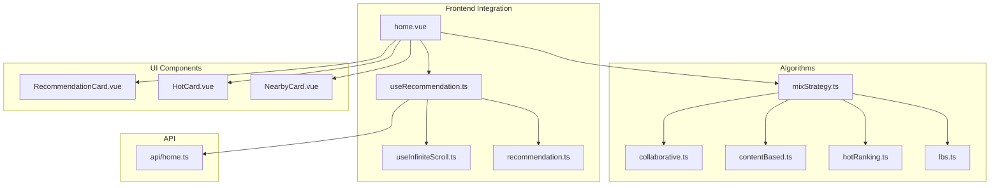
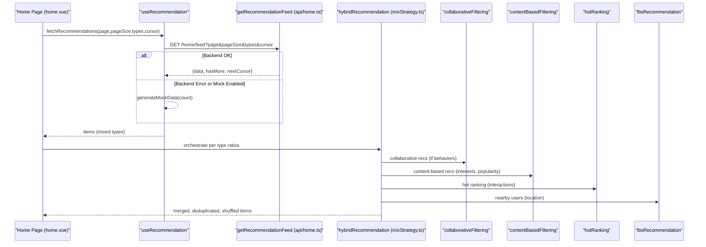
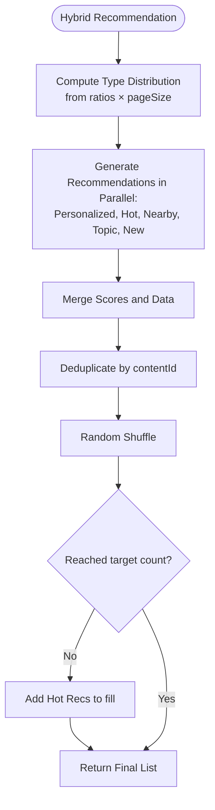
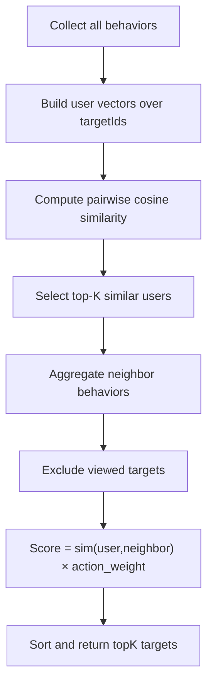
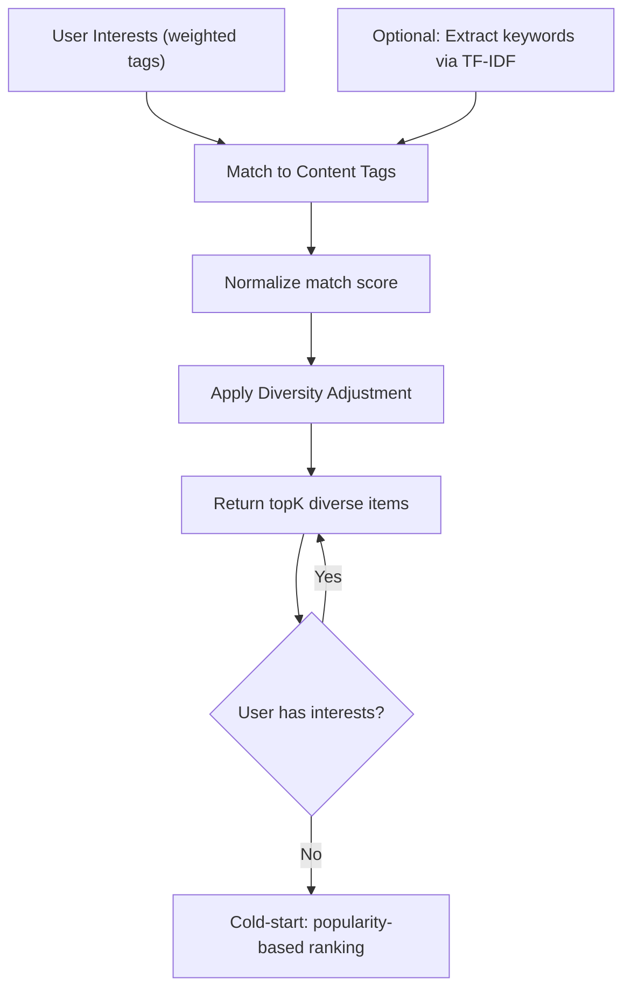
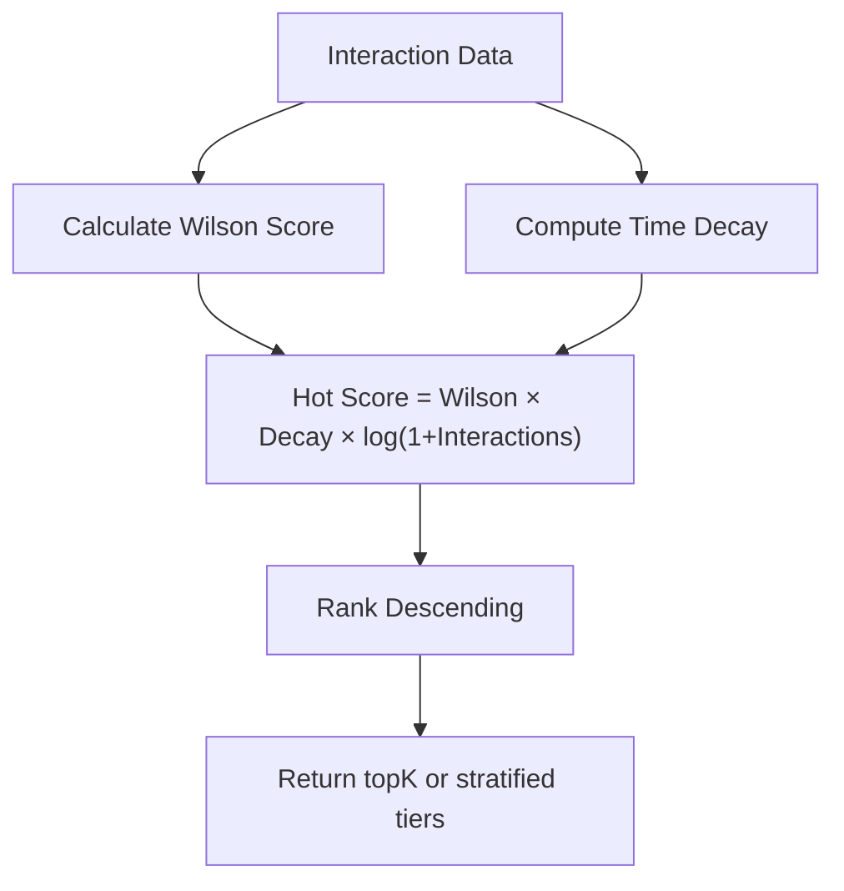
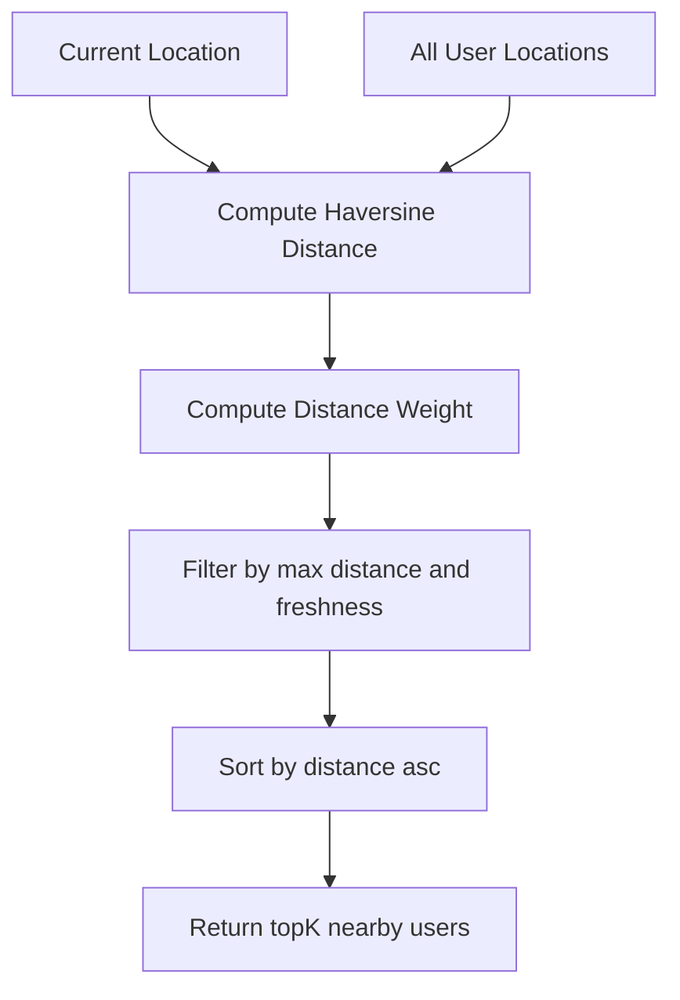
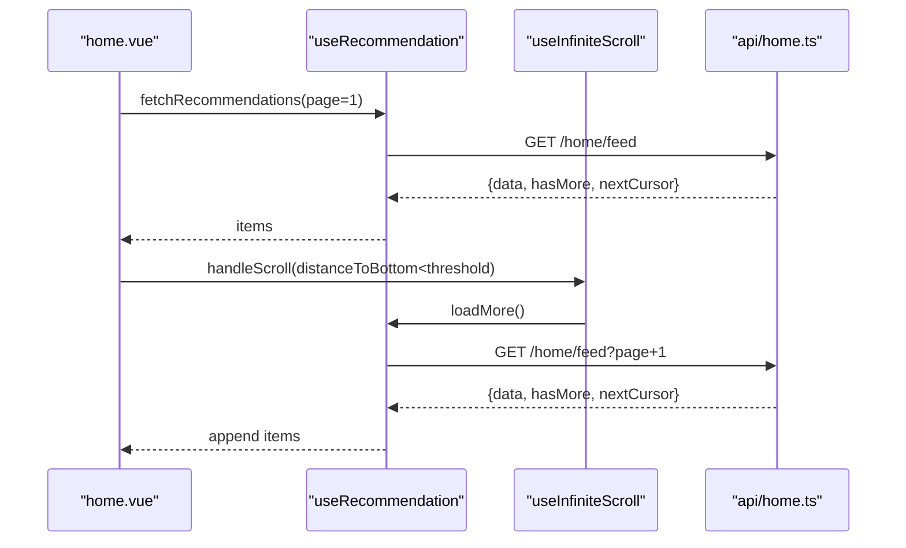
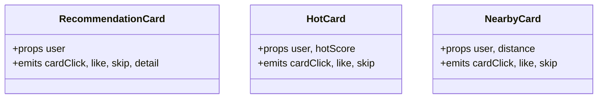
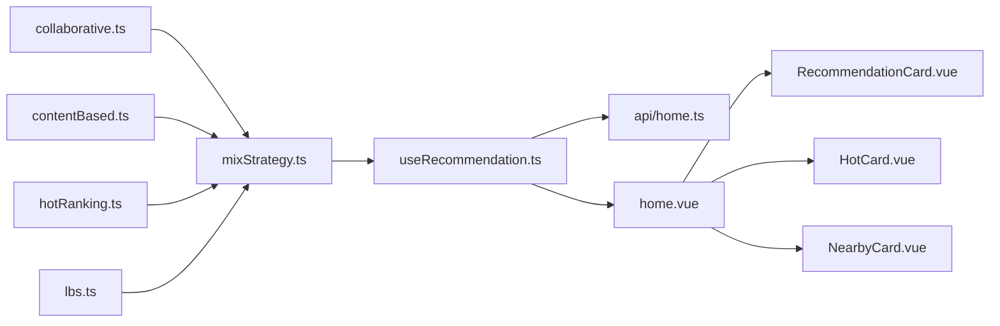

# Recommendation Engine

<cite>
**Referenced Files in This Document**
- [collaborative.ts](file://src/pages/tabbar/home/algorithms/collaborative.ts)
- [contentBased.ts](file://src/pages/tabbar/home/algorithms/contentBased.ts)
- [hotRanking.ts](file://src/pages/tabbar/home/algorithms/hotRanking.ts)
- [lbs.ts](file://src/pages/tabbar/home/algorithms/lbs.ts)
- [mixStrategy.ts](file://src/pages/tabbar/home/algorithms/mixStrategy.ts)
- [useRecommendation.ts](file://src/pages/tabbar/home/composables/useRecommendation.ts)
- [useInfiniteScroll.ts](file://src/pages/tabbar/home/composables/useInfiniteScroll.ts)
- [recommendation.ts](file://src/pages/tabbar/home/types/recommendation.ts)
- [home.ts](file://src/pages/tabbar/home.vue)
- [home.ts](file://src/api/home.ts)
- [RecommendationCard.vue](file://src/pages/tabbar/home/components/RecommendationCard.vue)
- [HotCard.vue](file://src/pages/tabbar/home/components/HotCard.vue)
- [NearbyCard.vue](file://src/pages/tabbar/home/components/NearbyCard.vue)
</cite>

## Table of Contents
1. [Introduction](#introduction)
2. [Project Structure](#project-structure)
3. [Core Components](#core-components)
4. [Architecture Overview](#architecture-overview)
5. [Detailed Component Analysis](#detailed-component-analysis)
6. [Dependency Analysis](#dependency-analysis)
7. [Performance Considerations](#performance-considerations)
8. [Troubleshooting Guide](#troubleshooting-guide)
9. [Conclusion](#conclusion)
10. [Appendices](#appendices)

## Introduction
This document describes the recommendation engine powering the WeTogether platform’s Home feed. It covers a multi-algorithm system integrating collaborative filtering, content-based filtering, hot ranking, and location-based services (LBS), orchestrated by a hybrid strategy that merges signals, scores, and personalization. It also documents the frontend integration via composable hooks for fetching, pagination, and infinite scrolling, plus the UI components rendering different recommendation types. Guidance is included for customizing recommendation parameters, A/B testing strategies, measuring effectiveness, mitigating cold start and bias, and handling fallbacks.

## Project Structure
The recommendation system is organized around:
- Algorithms: collaborative filtering, content-based filtering, hot ranking, LBS, and a hybrid strategy orchestrator.
- Frontend integration: composable hooks for recommendation lifecycle and infinite scroll.
- Types: shared data contracts for recommendation items and related entities.
- UI components: cards for displaying personalized, hot, nearby, topic, and new-user recommendations.
- API module: backend contract for recommendation feed, user actions, and configuration.

**Diagram sources**
- [mixStrategy.ts:1-482](file://src/pages/tabbar/home/algorithms/mixStrategy.ts#L1-L482)
- [collaborative.ts:1-222](file://src/pages/tabbar/home/algorithms/collaborative.ts#L1-L222)
- [contentBased.ts:1-297](file://src/pages/tabbar/home/algorithms/contentBased.ts#L1-L297)
- [hotRanking.ts:1-329](file://src/pages/tabbar/home/algorithms/hotRanking.ts#L1-L329)
- [lbs.ts:1-381](file://src/pages/tabbar/home/algorithms/lbs.ts#L1-L381)
- [useRecommendation.ts:1-202](file://src/pages/tabbar/home/composables/useRecommendation.ts#L1-L202)
- [useInfiniteScroll.ts:1-71](file://src/pages/tabbar/home/composables/useInfiniteScroll.ts#L1-L71)
- [recommendation.ts:1-119](file://src/pages/tabbar/home/types/recommendation.ts#L1-L119)
- [home.vue:1-489](file://src/pages/tabbar/home.vue#L1-L489)
- [home.ts:1-195](file://src/api/home.ts#L1-L195)
- [RecommendationCard.vue:1-260](file://src/pages/tabbar/home/components/RecommendationCard.vue#L1-L260)
- [HotCard.vue:1-287](file://src/pages/tabbar/home/components/HotCard.vue#L1-L287)
- [NearbyCard.vue:1-234](file://src/pages/tabbar/home/components/NearbyCard.vue#L1-L234)

**Section sources**
- [mixStrategy.ts:1-482](file://src/pages/tabbar/home/algorithms/mixStrategy.ts#L1-L482)
- [useRecommendation.ts:1-202](file://src/pages/tabbar/home/composables/useRecommendation.ts#L1-L202)
- [recommendation.ts:1-119](file://src/pages/tabbar/home/types/recommendation.ts#L1-L119)
- [home.vue:1-489](file://src/pages/tabbar/home.vue#L1-L489)
- [home.ts:1-195](file://src/api/home.ts#L1-L195)

## Core Components
- Hybrid strategy orchestrator: coordinates personalized, hot, nearby, topic, and new-user recommendations, applies ratio distribution, merges scores, deduplicates, and randomizes order.
- Collaborative filtering: builds user vectors from behavior, computes cosine similarity, and generates scored recommendations weighted by action importance.
- Content-based filtering: matches user interests to content tags, supports TF-IDF extraction for text, diversity adjustment, and cold-start via popularity.
- Hot ranking: computes a composite hot score using Wilson score, time decay, and interaction weights, with optional trend and stratification.
- LBS: computes distances via Haversine, applies distance-based weights, and filters nearby users with freshness constraints.
- Frontend integration: composable for fetching recommendation feed (with mock fallback), pagination, refresh, and action tracking; infinite scroll composable; UI cards per recommendation type.

**Section sources**
- [mixStrategy.ts:363-416](file://src/pages/tabbar/home/algorithms/mixStrategy.ts#L363-L416)
- [collaborative.ts:170-222](file://src/pages/tabbar/home/algorithms/collaborative.ts#L170-L222)
- [contentBased.ts:259-297](file://src/pages/tabbar/home/algorithms/contentBased.ts#L259-L297)
- [hotRanking.ts:290-329](file://src/pages/tabbar/home/algorithms/hotRanking.ts#L290-L329)
- [lbs.ts:357-381](file://src/pages/tabbar/home/algorithms/lbs.ts#L357-L381)
- [useRecommendation.ts:14-202](file://src/pages/tabbar/home/composables/useRecommendation.ts#L14-L202)
- [useInfiniteScroll.ts:1-71](file://src/pages/tabbar/home/composables/useInfiniteScroll.ts#L1-L71)

## Architecture Overview
The recommendation pipeline integrates frontend and algorithmic layers:

**Diagram sources**
- [home.vue:164-178](file://src/pages/tabbar/home.vue#L164-L178)
- [useRecommendation.ts:32-82](file://src/pages/tabbar/home/composables/useRecommendation.ts#L32-L82)
- [home.ts:68-75](file://src/api/home.ts#L68-L75)
- [mixStrategy.ts:363-416](file://src/pages/tabbar/home/algorithms/mixStrategy.ts#L363-L416)
- [collaborative.ts:170-222](file://src/pages/tabbar/home/algorithms/collaborative.ts#L170-L222)
- [contentBased.ts:259-297](file://src/pages/tabbar/home/algorithms/contentBased.ts#L259-L297)
- [hotRanking.ts:290-329](file://src/pages/tabbar/home/algorithms/hotRanking.ts#L290-L329)
- [lbs.ts:357-381](file://src/pages/tabbar/home/algorithms/lbs.ts#L357-L381)

## Detailed Component Analysis

### Hybrid Strategy Orchestrator
- Purpose: Distribute a fixed page size across recommendation types according to configured ratios, generate per-type lists, merge, deduplicate, and randomize.
- Key behaviors:
  - Ratio distribution: personalized (40%), hot (20%), nearby (15%), topic (15%), new (10%).
  - Parallel generation: runs all five recommendation generators concurrently.
  - Merging and scoring: combines collaborative and content-based scores with weights; hot and nearby use algorithm-derived weights; topic and new use content metadata.
  - Deduplication: removes repeated contentIds within a batch.
  - Randomization: shuffles to avoid sequential patterns.
  - Fallback: if insufficient items, fills with hot recommendations.

**Diagram sources**
- [mixStrategy.ts:92-102](file://src/pages/tabbar/home/algorithms/mixStrategy.ts#L92-L102)
- [mixStrategy.ts:372-378](file://src/pages/tabbar/home/algorithms/mixStrategy.ts#L372-L378)
- [mixStrategy.ts:389-416](file://src/pages/tabbar/home/algorithms/mixStrategy.ts#L389-L416)

**Section sources**
- [mixStrategy.ts:30-58](file://src/pages/tabbar/home/algorithms/mixStrategy.ts#L30-L58)
- [mixStrategy.ts:111-162](file://src/pages/tabbar/home/algorithms/mixStrategy.ts#L111-L162)
- [mixStrategy.ts:171-210](file://src/pages/tabbar/home/algorithms/mixStrategy.ts#L171-L210)
- [mixStrategy.ts:219-258](file://src/pages/tabbar/home/algorithms/mixStrategy.ts#L219-L258)
- [mixStrategy.ts:267-293](file://src/pages/tabbar/home/algorithms/mixStrategy.ts#L267-L293)
- [mixStrategy.ts:302-340](file://src/pages/tabbar/home/algorithms/mixStrategy.ts#L302-L340)
- [mixStrategy.ts:363-416](file://src/pages/tabbar/home/algorithms/mixStrategy.ts#L363-L416)

### Collaborative Filtering
- User-item matrix representation: implicit via user behavior vectors built from targetIds and action weights.
- Similarity: cosine similarity between user vectors.
- Recommendation generation: sums similarity-weighted actions from similar users, excluding items the current user has interacted with.

**Diagram sources**
- [collaborative.ts:36-51](file://src/pages/tabbar/home/algorithms/collaborative.ts#L36-L51)
- [collaborative.ts:59-79](file://src/pages/tabbar/home/algorithms/collaborative.ts#L59-L79)
- [collaborative.ts:88-111](file://src/pages/tabbar/home/algorithms/collaborative.ts#L88-L111)
- [collaborative.ts:121-161](file://src/pages/tabbar/home/algorithms/collaborative.ts#L121-L161)
- [collaborative.ts:170-222](file://src/pages/tabbar/home/algorithms/collaborative.ts#L170-L222)

**Section sources**
- [collaborative.ts:6-28](file://src/pages/tabbar/home/algorithms/collaborative.ts#L6-L28)
- [collaborative.ts:36-51](file://src/pages/tabbar/home/algorithms/collaborative.ts#L36-L51)
- [collaborative.ts:59-79](file://src/pages/tabbar/home/algorithms/collaborative.ts#L59-L79)
- [collaborative.ts:88-111](file://src/pages/tabbar/home/algorithms/collaborative.ts#L88-L111)
- [collaborative.ts:121-161](file://src/pages/tabbar/home/algorithms/collaborative.ts#L121-L161)
- [collaborative.ts:170-222](file://src/pages/tabbar/home/algorithms/collaborative.ts#L170-L222)

### Content-Based Filtering
- User interest model: weighted tags per user.
- Content model: weighted tags per content item; optional TF-IDF extraction for textual content.
- Matching: computes a normalized score for matched tags; diversity adjustment greedily selects varied content; cold-start fallback to popularity-based ranking.

**Diagram sources**
- [contentBased.ts:34-70](file://src/pages/tabbar/home/algorithms/contentBased.ts#L34-L70)
- [contentBased.ts:104-130](file://src/pages/tabbar/home/algorithms/contentBased.ts#L104-L130)
- [contentBased.ts:171-226](file://src/pages/tabbar/home/algorithms/contentBased.ts#L171-L226)
- [contentBased.ts:235-250](file://src/pages/tabbar/home/algorithms/contentBased.ts#L235-L250)
- [contentBased.ts:259-297](file://src/pages/tabbar/home/algorithms/contentBased.ts#L259-L297)

**Section sources**
- [contentBased.ts:6-26](file://src/pages/tabbar/home/algorithms/contentBased.ts#L6-L26)
- [contentBased.ts:34-70](file://src/pages/tabbar/home/algorithms/contentBased.ts#L34-L70)
- [contentBased.ts:79-95](file://src/pages/tabbar/home/algorithms/contentBased.ts#L79-L95)
- [contentBased.ts:104-130](file://src/pages/tabbar/home/algorithms/contentBased.ts#L104-L130)
- [contentBased.ts:171-226](file://src/pages/tabbar/home/algorithms/contentBased.ts#L171-L226)
- [contentBased.ts:235-250](file://src/pages/tabbar/home/algorithms/contentBased.ts#L235-L250)
- [contentBased.ts:259-297](file://src/pages/tabbar/home/algorithms/contentBased.ts#L259-L297)

### Hot Ranking
- Composite hot score: Wilson score for quality, exponential time decay for recency, and log bonus for interaction volume.
- Optional analytics: trend analysis, stratification into hot/trending/normal/cold.

**Diagram sources**
- [hotRanking.ts:27-48](file://src/pages/tabbar/home/algorithms/hotRanking.ts#L27-L48)
- [hotRanking.ts:59-69](file://src/pages/tabbar/home/algorithms/hotRanking.ts#L59-L69)
- [hotRanking.ts:80-135](file://src/pages/tabbar/home/algorithms/hotRanking.ts#L80-L135)
- [hotRanking.ts:144-173](file://src/pages/tabbar/home/algorithms/hotRanking.ts#L144-L173)
- [hotRanking.ts:227-250](file://src/pages/tabbar/home/algorithms/hotRanking.ts#L227-L250)
- [hotRanking.ts:259-282](file://src/pages/tabbar/home/algorithms/hotRanking.ts#L259-L282)
- [hotRanking.ts:290-329](file://src/pages/tabbar/home/algorithms/hotRanking.ts#L290-L329)

**Section sources**
- [hotRanking.ts:6-16](file://src/pages/tabbar/home/algorithms/hotRanking.ts#L6-L16)
- [hotRanking.ts:27-48](file://src/pages/tabbar/home/algorithms/hotRanking.ts#L27-L48)
- [hotRanking.ts:59-69](file://src/pages/tabbar/home/algorithms/hotRanking.ts#L59-L69)
- [hotRanking.ts:80-135](file://src/pages/tabbar/home/algorithms/hotRanking.ts#L80-L135)
- [hotRanking.ts:144-173](file://src/pages/tabbar/home/algorithms/hotRanking.ts#L144-L173)
- [hotRanking.ts:227-250](file://src/pages/tabbar/home/algorithms/hotRanking.ts#L227-L250)
- [hotRanking.ts:259-282](file://src/pages/tabbar/home/algorithms/hotRanking.ts#L259-L282)
- [hotRanking.ts:290-329](file://src/pages/tabbar/home/algorithms/hotRanking.ts#L290-L329)

### Location-Based Services (LBS)
- Distance computation: Haversine formula for accurate earth-distance.
- Weighting: inverse-proportional weight capped by max distance.
- Nearby discovery: filters by freshness, sorts by distance, and supports grid indexing for scalability.

**Diagram sources**
- [lbs.ts:39-53](file://src/pages/tabbar/home/algorithms/lbs.ts#L39-L53)
- [lbs.ts:63-77](file://src/pages/tabbar/home/algorithms/lbs.ts#L63-L77)
- [lbs.ts:101-158](file://src/pages/tabbar/home/algorithms/lbs.ts#L101-L158)
- [lbs.ts:357-381](file://src/pages/tabbar/home/algorithms/lbs.ts#L357-L381)

**Section sources**
- [lbs.ts:6-20](file://src/pages/tabbar/home/algorithms/lbs.ts#L6-L20)
- [lbs.ts:39-53](file://src/pages/tabbar/home/algorithms/lbs.ts#L39-L53)
- [lbs.ts:63-77](file://src/pages/tabbar/home/algorithms/lbs.ts#L63-L77)
- [lbs.ts:101-158](file://src/pages/tabbar/home/algorithms/lbs.ts#L101-L158)
- [lbs.ts:357-381](file://src/pages/tabbar/home/algorithms/lbs.ts#L357-L381)

### Frontend Integration: Composables and Hooks
- useRecommendation: manages items, pagination, refresh, cursor, and mock fallback; exposes trackAction for behavior reporting.
- useInfiniteScroll: generic infinite scroll controller with thresholds, refresh, and load-more gating.

**Diagram sources**
- [useRecommendation.ts:32-82](file://src/pages/tabbar/home/composables/useRecommendation.ts#L32-L82)
- [useInfiniteScroll.ts:17-40](file://src/pages/tabbar/home/composables/useInfiniteScroll.ts#L17-L40)
- [home.vue:175-178](file://src/pages/tabbar/home.vue#L175-L178)
- [home.ts:68-75](file://src/api/home.ts#L68-L75)

**Section sources**
- [useRecommendation.ts:14-202](file://src/pages/tabbar/home/composables/useRecommendation.ts#L14-L202)
- [useInfiniteScroll.ts:1-71](file://src/pages/tabbar/home/composables/useInfiniteScroll.ts#L1-L71)
- [home.vue:164-178](file://src/pages/tabbar/home.vue#L164-L178)
- [home.ts:68-75](file://src/api/home.ts#L68-L75)

### UI Components for Recommendation Types
- RecommendationCard: renders personalized user profiles with actions.
- HotCard: highlights popular users with interaction stats.
- NearbyCard: shows nearby users with formatted distance.

**Diagram sources**
- [RecommendationCard.vue:55-94](file://src/pages/tabbar/home/components/RecommendationCard.vue#L55-L94)
- [HotCard.vue:65-102](file://src/pages/tabbar/home/components/HotCard.vue#L65-L102)
- [NearbyCard.vue:50-74](file://src/pages/tabbar/home/components/NearbyCard.vue#L50-L74)

**Section sources**
- [RecommendationCard.vue:1-260](file://src/pages/tabbar/home/components/RecommendationCard.vue#L1-L260)
- [HotCard.vue:1-287](file://src/pages/tabbar/home/components/HotCard.vue#L1-L287)
- [NearbyCard.vue:1-234](file://src/pages/tabbar/home/components/NearbyCard.vue#L1-L234)

## Dependency Analysis
- Algorithm-to-mix dependencies:
  - Collaborative filtering depends on user behavior vectors and cosine similarity.
  - Content-based filtering depends on user interests and content tags; optionally TF-IDF and popularity.
  - Hot ranking depends on interaction data and time decay.
  - LBS depends on location data and distance computations.
- Frontend-to-backend dependencies:
  - useRecommendation consumes getRecommendationFeed and trackUserAction.
  - home.vue integrates UI components and composable hooks.

**Diagram sources**
- [mixStrategy.ts:6-9](file://src/pages/tabbar/home/algorithms/mixStrategy.ts#L6-L9)
- [useRecommendation.ts:1-6](file://src/pages/tabbar/home/composables/useRecommendation.ts#L1-L6)
- [home.vue:144-145](file://src/pages/tabbar/home.vue#L144-L145)
- [home.ts:68-104](file://src/api/home.ts#L68-L104)

**Section sources**
- [mixStrategy.ts:6-9](file://src/pages/tabbar/home/algorithms/mixStrategy.ts#L6-L9)
- [useRecommendation.ts:1-6](file://src/pages/tabbar/home/composables/useRecommendation.ts#L1-L6)
- [home.vue:144-145](file://src/pages/tabbar/home.vue#L144-L145)
- [home.ts:68-104](file://src/api/home.ts#L68-L104)

## Performance Considerations
- Vector operations: collaborative filtering scales with number of users and items; consider limiting topK and precomputing user vectors.
- Content matching: content-based filtering benefits from indexed tags and optional TF-IDF caching.
- Hot ranking: batch compute scores and cache results to reduce recomputation.
- LBS: use grid indexing and bounding boxes to limit distance checks; cap maxResults and freshness windows.
- Frontend: infinite scroll throttles loads; mock fallback prevents UI stalls; image lazy-loading reduces payload.

[No sources needed since this section provides general guidance]

## Troubleshooting Guide
- Backend errors: useRecommendation falls back to mock data and sets hasMore appropriately.
- Action tracking failures: trackAction logs errors and continues gracefully.
- Infinite scroll issues: ensure threshold and hasMore are correctly managed; verify onLoadMore and onRefresh handlers.
- UI rendering: confirm item.type dispatches to correct card component and that data shapes match expectations.

**Section sources**
- [useRecommendation.ts:66-81](file://src/pages/tabbar/home/composables/useRecommendation.ts#L66-L81)
- [useRecommendation.ts:99-119](file://src/pages/tabbar/home/composables/useRecommendation.ts#L99-L119)
- [useInfiniteScroll.ts:17-54](file://src/pages/tabbar/home/composables/useInfiniteScroll.ts#L17-L54)
- [home.vue:339-347](file://src/pages/tabbar/home.vue#L339-L347)

## Conclusion
The WeTogether recommendation engine blends collaborative filtering, content-based matching, hot ranking, and LBS into a cohesive hybrid strategy. The frontend composable hooks provide robust pagination, refresh, and fallback behavior, while UI components render distinct recommendation types. The modular design enables easy customization of ratios, A/B testing, and measurement of effectiveness.

[No sources needed since this section summarizes without analyzing specific files]

## Appendices

### Customizing Recommendation Parameters
- Adjust ratios and page size in the hybrid strategy configuration to shift emphasis across recommendation types.
- Tune hot ranking decay rate, confidence, and interaction weights to reflect platform goals.
- Modify collaborative action weights to emphasize stronger signals.
- Adjust content-based diversity factor and popularity influence for variety vs. relevance.

**Section sources**
- [mixStrategy.ts:30-58](file://src/pages/tabbar/home/algorithms/mixStrategy.ts#L30-L58)
- [hotRanking.ts:83-103](file://src/pages/tabbar/home/algorithms/hotRanking.ts#L83-L103)
- [collaborative.ts:22-28](file://src/pages/tabbar/home/algorithms/collaborative.ts#L22-L28)
- [contentBased.ts:262-274](file://src/pages/tabbar/home/algorithms/contentBased.ts#L262-L274)

### A/B Testing Different Algorithms
- Toggle useMockData in useRecommendation to compare backend vs. mock behavior.
- Expose getRecommendationConfig via API to dynamically adjust ratios per variant.
- Track user actions with trackUserAction to measure engagement differences across variants.

**Section sources**
- [useRecommendation.ts:14-15](file://src/pages/tabbar/home/composables/useRecommendation.ts#L14-L15)
- [home.ts:168-181](file://src/api/home.ts#L168-L181)
- [home.ts:98-113](file://src/api/home.ts#L98-L113)

### Measuring Recommendation Effectiveness
- Use feedbackRecommendation to collect explicit ratings.
- Monitor click-through rates and engagement metrics per recommendation type.
- Track user retention and time-on-task after exposure to different mixes.

**Section sources**
- [home.ts:188-194](file://src/api/home.ts#L188-L194)

### Cold Start Mitigation
- Content-based cold start: fall back to popularity scores when user interests are absent.
- New user recommendation: surface recently joined users as a separate stream.

**Section sources**
- [contentBased.ts:277-279](file://src/pages/tabbar/home/algorithms/contentBased.ts#L277-L279)
- [contentBased.ts:302-340](file://src/pages/tabbar/home/algorithms/mixStrategy.ts#L302-L340)

### Bias Mitigation
- Diversity adjustment in content-based filtering encourages varied recommendations.
- Randomization in hybrid strategy avoids sequential bias.
- Thresholding in hot ranking (minInteractions) reduces noise from low-traffic items.

**Section sources**
- [contentBased.ts:171-226](file://src/pages/tabbar/home/algorithms/contentBased.ts#L171-L226)
- [mixStrategy.ts:401-402](file://src/pages/tabbar/home/algorithms/mixStrategy.ts#L401-L402)
- [hotRanking.ts:306-316](file://src/pages/tabbar/home/algorithms/hotRanking.ts#L306-L316)