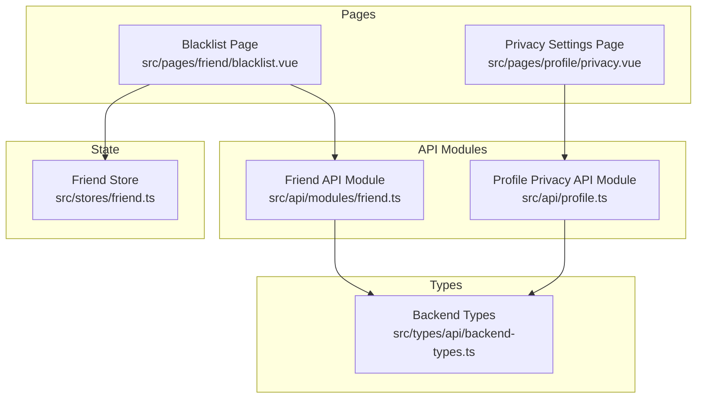
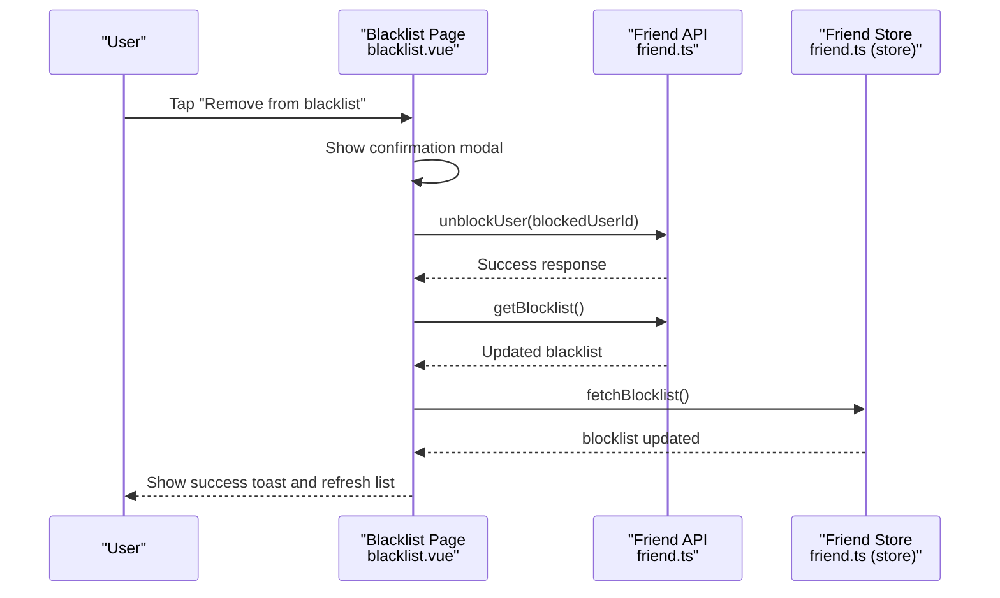
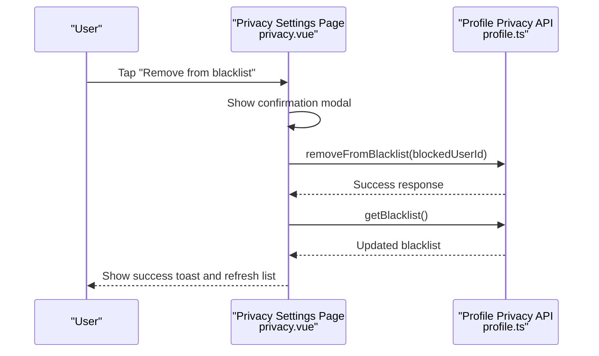
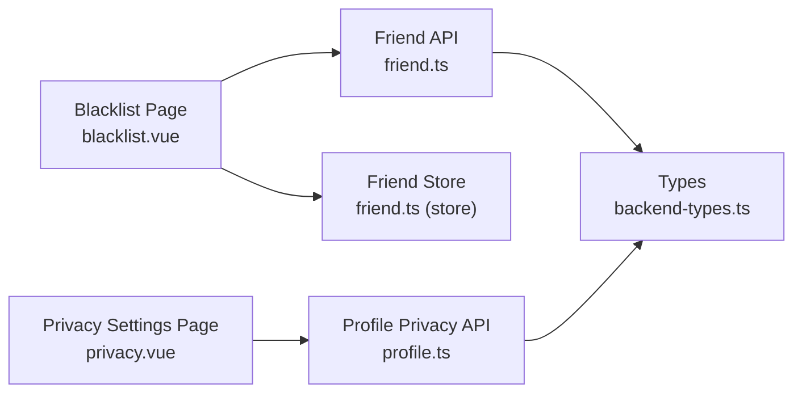

# Blocking & Blacklist System

<cite>
**Referenced Files in This Document**
- [blacklist.vue](file://src/pages/friend/blacklist.vue)
- [privacy.vue](file://src/pages/profile/privacy.vue)
- [friend.ts](file://src/api/modules/friend.ts)
- [profile.ts](file://src/api/profile.ts)
- [friend.ts (store)](file://src/stores/friend.ts)
- [backend-types.ts](file://src/types/api/backend-types.ts)
</cite>

## Table of Contents
1. [Introduction](#introduction)
2. [Project Structure](#project-structure)
3. [Core Components](#core-components)
4. [Architecture Overview](#architecture-overview)
5. [Detailed Component Analysis](#detailed-component-analysis)
6. [Dependency Analysis](#dependency-analysis)
7. [Performance Considerations](#performance-considerations)
8. [Troubleshooting Guide](#troubleshooting-guide)
9. [Conclusion](#conclusion)
10. [Appendices](#appendices)

## Introduction
This document explains the blocking and blacklist system implemented in the frontend. It covers:
- The blockUser and unblockUser API endpoints and their security implications
- The UserBlacklist model and how blocked users are represented
- How the system restricts user interactions, controls content visibility, and suppresses notifications for blocked users
- Examples for block reason selection, appeal processes, and moderation workflows
- Privacy considerations, data retention policies, and administrative controls for platform moderation

## Project Structure
The blocking and blacklist system spans three primary areas:
- Frontend pages for managing blacklists
- API modules for friend-related and profile-related privacy operations
- Store module for centralized friend-related state (including blocklist)
- Type definitions for the UserBlacklist model

**Diagram sources**
- [blacklist.vue:1-148](file://src/pages/friend/blacklist.vue#L1-L148)
- [privacy.vue:1-312](file://src/pages/profile/privacy.vue#L1-L312)
- [friend.ts:1-61](file://src/api/modules/friend.ts#L1-L61)
- [profile.ts:241-259](file://src/api/profile.ts#L241-L259)
- [friend.ts (store):1-70](file://src/stores/friend.ts#L1-L70)
- [backend-types.ts:321-339](file://src/types/api/backend-types.ts#L321-L339)

**Section sources**
- [blacklist.vue:1-148](file://src/pages/friend/blacklist.vue#L1-L148)
- [privacy.vue:1-312](file://src/pages/profile/privacy.vue#L1-L312)
- [friend.ts:1-61](file://src/api/modules/friend.ts#L1-L61)
- [profile.ts:241-259](file://src/api/profile.ts#L241-L259)
- [friend.ts (store):1-70](file://src/stores/friend.ts#L1-L70)
- [backend-types.ts:321-339](file://src/types/api/backend-types.ts#L321-L339)

## Core Components
- BlockUser endpoint (friend module): Adds a user to the blacklist with optional reason.
- UnblockUser endpoint (friend module): Removes a user from the blacklist.
- GetBlocklist endpoint (friend module): Retrieves the current blacklist entries.
- Profile privacy blacklist APIs: Retrieve, add, and remove users from the privacy-managed blacklist.
- UserBlacklist model: Defines the shape of a blacklist entry, including identifiers, reason, timestamps, and associated user objects.
- Friend store: Centralized state for friend-related lists, including blocklist.

Security and validation highlights:
- Endpoint parameters: Both blockUser and unblockUser accept a blockedUserId (number) and optionally a reason (string) for blockUser.
- Data representation: The UserBlacklist model includes user and blockedUser references, enabling UI rendering of avatar, nickname, and metadata.
- UI behavior: The blacklist pages provide removal actions and formatted timestamps.

**Section sources**
- [friend.ts:53-60](file://src/api/modules/friend.ts#L53-L60)
- [profile.ts:249-259](file://src/api/profile.ts#L249-L259)
- [backend-types.ts:321-339](file://src/types/api/backend-types.ts#L321-L339)
- [friend.ts (store):51-54](file://src/stores/friend.ts#L51-L54)
- [blacklist.vue:69-103](file://src/pages/friend/blacklist.vue#L69-L103)
- [privacy.vue:250-277](file://src/pages/profile/privacy.vue#L250-L277)

## Architecture Overview
The blocking system is composed of two complementary pathways:
- Friend-based blocking via the friend module
- Privacy-managed blocking via the profile privacy module

**Diagram sources**
- [blacklist.vue:69-103](file://src/pages/friend/blacklist.vue#L69-L103)
- [friend.ts:56-60](file://src/api/modules/friend.ts#L56-L60)
- [friend.ts (store):51-54](file://src/stores/friend.ts#L51-L54)

**Diagram sources**
- [privacy.vue:250-277](file://src/pages/profile/privacy.vue#L250-L277)
- [profile.ts:257-259](file://src/api/profile.ts#L257-L259)

## Detailed Component Analysis

### BlockUser and UnblockUser API Endpoints
- blockUser(blockedUserId: number, reason?: string): POST /friend/block
  - Purpose: Add a user to the blacklist with an optional reason.
  - Validation: Expects a numeric blockedUserId; reason is optional.
  - Response: Returns a UserBlacklist object representing the newly created blacklist entry.
- unblockUser(blockedUserId: number): POST /friend/unblock
  - Purpose: Remove a user from the blacklist.
  - Validation: Expects a numeric blockedUserId.
  - Response: Returns a success indicator.
- getBlocklist(): GET /friend/blocklist
  - Purpose: Retrieve the current blacklist entries.
  - Response: Returns an array of UserBlacklist objects.

Security implications:
- Authentication and authorization: These endpoints are protected by the application’s authentication layer; callers must be authenticated.
- Parameter sanitization: The backend should validate that blockedUserId is a positive integer and that reason conforms to configured length and content policies.
- Idempotency: Unblocking a user who is not on the list should succeed without error.

Data validation:
- blockedUserId must be present and numeric.
- reason should be sanitized and bounded (e.g., max length) to prevent abuse.

**Section sources**
- [friend.ts:53-60](file://src/api/modules/friend.ts#L53-L60)
- [backend-types.ts:321-339](file://src/types/api/backend-types.ts#L321-L339)

### UserBlacklist Model
The UserBlacklist model defines the structure of a blacklist entry:
- id: Unique identifier for the blacklist record
- userId: The identifier of the user who created the blacklist entry
- blockedUserId: The identifier of the user being blocked
- reason: Optional reason for the block
- createdAt: Timestamp when the entry was created
- user: Reference to the user who created the entry
- blockedUser: Reference to the user being blocked

Usage in UI:
- The blacklist pages render blockedUser avatar, nickname, and creation time.
- The privacy page also renders blockedUser metadata such as age and city.

**Section sources**
- [backend-types.ts:321-339](file://src/types/api/backend-types.ts#L321-L339)
- [blacklist.vue:15-28](file://src/pages/friend/blacklist.vue#L15-L28)
- [privacy.vue:66-83](file://src/pages/profile/privacy.vue#L66-L83)

### Privacy-Managed Blacklist APIs
The profile privacy module exposes:
- getBlacklist(): GET /profile/privacy/block
- addToBlacklist(blockedUserId: number, reason?: string): POST /profile/privacy/block/{userId}
- removeFromBlacklist(blockedUserId: number): DELETE /profile/privacy/block/{userId}

These APIs mirror the friend module but are scoped under privacy settings. They enable users to manage a separate blacklist with potentially different semantics (e.g., privacy-focused vs. friendship-focused).

**Section sources**
- [profile.ts:249-259](file://src/api/profile.ts#L249-L259)

### Friend Store Integration
The friend store centralizes friend-related state and includes:
- blocklist: Reactive array of blocked users
- fetchBlocklist(): Loads the blacklist via getBlocklist()
- blockUser(userId, reason?): Calls blockUser() and then refreshes blocklist

This ensures UI components can rely on a single source of truth for blacklist data.

**Section sources**
- [friend.ts (store):51-54](file://src/stores/friend.ts#L51-L54)

### UI Behavior and User Experience
- Blacklist Page (friend):
  - Displays blocked users with avatar, nickname, optional reason, and formatted creation time.
  - Provides “Remove” action per entry with confirmation modal and success feedback.
  - Refreshes both the local list and the store after successful unblock.
- Privacy Settings Page:
  - Presents a similar blacklist list with metadata and “Remove” action.
  - Uses a picker for visibility settings and switches for permissions.

**Section sources**
- [blacklist.vue:1-148](file://src/pages/friend/blacklist.vue#L1-L148)
- [privacy.vue:1-312](file://src/pages/profile/privacy.vue#L1-L312)

### Implementation of Interaction Restrictions, Content Visibility Controls, and Notification Suppression
While the frontend provides UI for managing blacklists, enforcement of restrictions typically occurs server-side. Typical enforcement mechanisms include:
- Interaction restrictions:
  - Hide posts, comments, and messages from blocked users
  - Prevent adding blocked users as friends or followers
  - Disable private messaging and direct communication
- Content visibility controls:
  - Filter out blocked users’ profiles and content from feeds and recommendations
  - Respect privacy visibility settings for blocked users
- Notification suppression:
  - Suppress notifications triggered by blocked users (likes, comments, follows)

Note: The frontend does not expose explicit APIs for these enforcement actions; they are part of the backend’s filtering and authorization logic.

[No sources needed since this section explains general enforcement concepts not tied to specific source files]

### Examples: Block Reason Selection, Appeal Processes, and Moderation Workflows
- Block reason selection:
  - The blockUser endpoint accepts an optional reason. The UI can present predefined reasons (e.g., harassment, spam, inappropriate content) and allow free-text input for others.
- Appeal process:
  - Users flagged for blocking can submit appeals via a dedicated form. Moderators review and decide whether to lift the block. The backend should expose endpoints to query appeal status and update block records accordingly.
- Moderation workflows:
  - Administrators can view and manage blocks across users, enforce global blocks, and audit block reasons and timestamps.

[No sources needed since this section proposes workflows and does not analyze specific files]

## Dependency Analysis
The following diagram shows how the blacklist-related components depend on each other and on shared types.

**Diagram sources**
- [blacklist.vue:1-148](file://src/pages/friend/blacklist.vue#L1-L148)
- [privacy.vue:1-312](file://src/pages/profile/privacy.vue#L1-L312)
- [friend.ts:1-61](file://src/api/modules/friend.ts#L1-L61)
- [profile.ts:241-259](file://src/api/profile.ts#L241-L259)
- [friend.ts (store):1-70](file://src/stores/friend.ts#L1-L70)
- [backend-types.ts:321-339](file://src/types/api/backend-types.ts#L321-L339)

**Section sources**
- [blacklist.vue:1-148](file://src/pages/friend/blacklist.vue#L1-L148)
- [privacy.vue:1-312](file://src/pages/profile/privacy.vue#L1-L312)
- [friend.ts:1-61](file://src/api/modules/friend.ts#L1-L61)
- [profile.ts:241-259](file://src/api/profile.ts#L241-L259)
- [friend.ts (store):1-70](file://src/stores/friend.ts#L1-L70)
- [backend-types.ts:321-339](file://src/types/api/backend-types.ts#L321-L339)

## Performance Considerations
- Minimize redundant network requests:
  - After unblocking, refresh the blacklist once and update the store to avoid multiple re-renders.
- Virtualization and pagination:
  - For large blacklists, consider virtual scrolling and pagination to reduce DOM overhead.
- Caching:
  - Cache blacklist entries locally to improve responsiveness during frequent refreshes.

[No sources needed since this section provides general guidance]

## Troubleshooting Guide
Common issues and resolutions:
- Unblocking fails silently:
  - Verify that the blockedUserId is correct and that the endpoint returns success. Ensure UI handles errors and shows appropriate toasts.
- Blacklist not updating after unblock:
  - Confirm that getBlocklist() is called and the store’s fetchBlocklist() is invoked to synchronize state.
- Removing from privacy-managed blacklist:
  - Use removeFromBlacklist() and then reload the blacklist to reflect changes.

**Section sources**
- [blacklist.vue:69-103](file://src/pages/friend/blacklist.vue#L69-L103)
- [privacy.vue:250-277](file://src/pages/profile/privacy.vue#L250-L277)
- [friend.ts (store):51-54](file://src/stores/friend.ts#L51-L54)

## Conclusion
The blocking and blacklist system integrates UI pages, API modules, and a centralized store to provide a cohesive user experience for managing blocks. The UserBlacklist model standardizes data representation, while endpoints enable adding and removing users from blacklists. Enforcing interaction restrictions, content visibility controls, and notification suppression is primarily handled by the backend. Administrators can leverage moderation workflows to maintain platform safety and privacy.

[No sources needed since this section summarizes without analyzing specific files]

## Appendices

### API Definitions
- POST /friend/block
  - Request body: { friendId: number, reason?: string }
  - Response: UserBlacklist
- POST /friend/unblock
  - Request body: { friendId: number }
  - Response: { success: boolean }
- GET /friend/blocklist
  - Response: UserBlacklist[]
- GET /profile/privacy/block
  - Response: BlacklistUser[]
- POST /profile/privacy/block/{userId}
  - Request body: { reason?: string }
  - Response: BlacklistUser
- DELETE /profile/privacy/block/{userId}
  - Response: { success: boolean }

**Section sources**
- [friend.ts:53-60](file://src/api/modules/friend.ts#L53-L60)
- [profile.ts:249-259](file://src/api/profile.ts#L249-L259)

### Data Model: UserBlacklist
- Fields: id, userId, blockedUserId, reason, createdAt, user, blockedUser
- Notes: blockedUser includes avatar, nickname, and optional metadata (age, city) for UI rendering.

**Section sources**
- [backend-types.ts:321-339](file://src/types/api/backend-types.ts#L321-L339)
- [privacy.vue:66-83](file://src/pages/profile/privacy.vue#L66-L83)