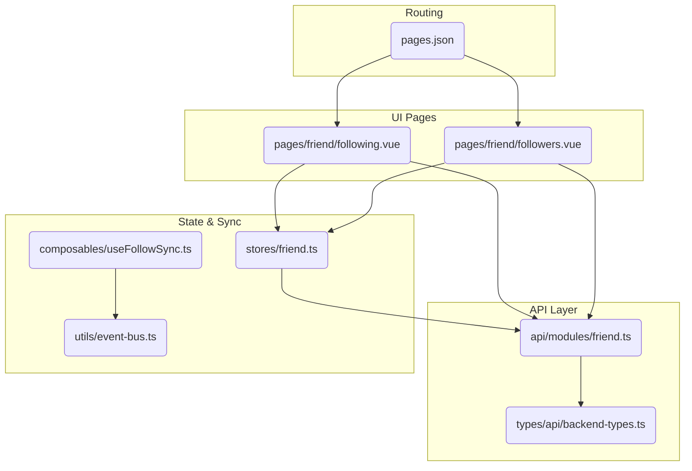
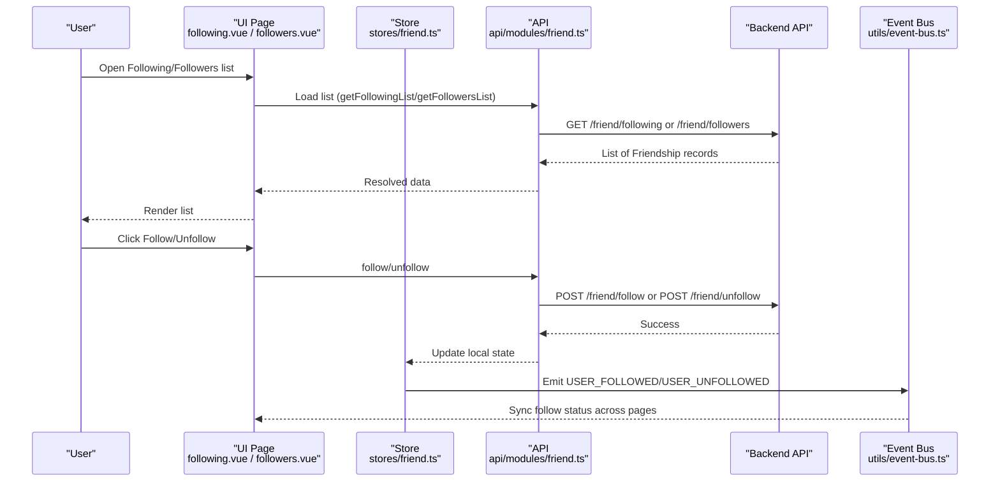
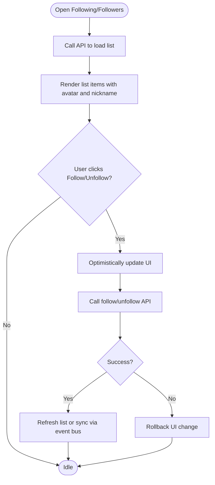
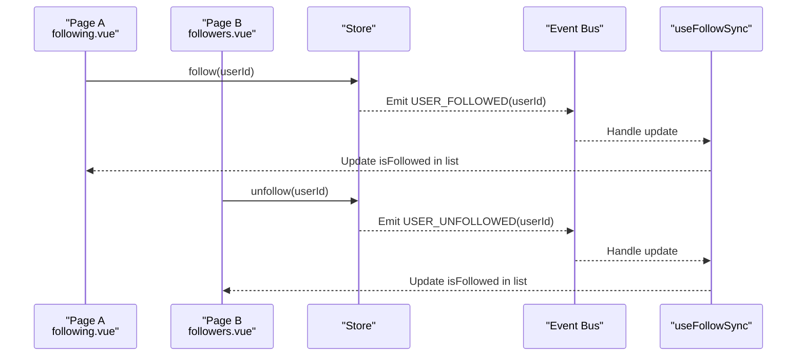
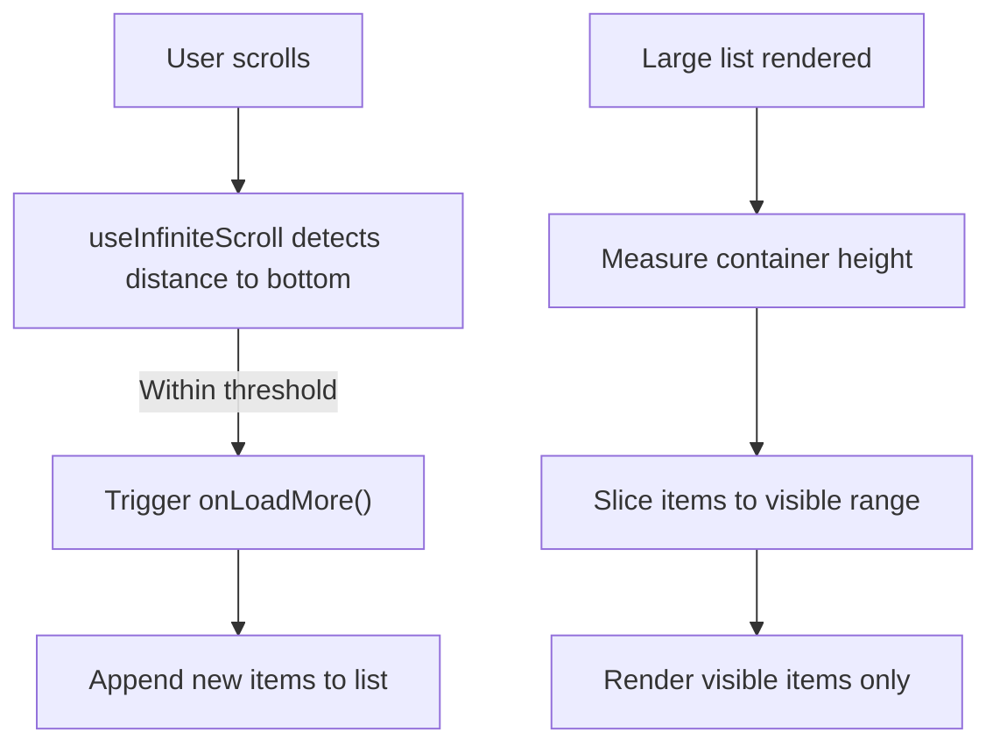
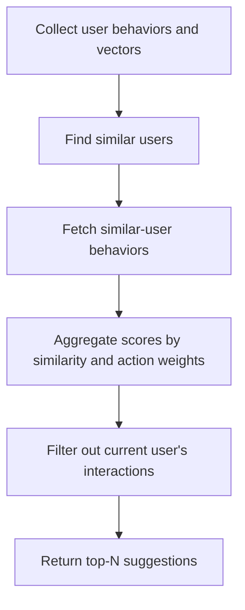
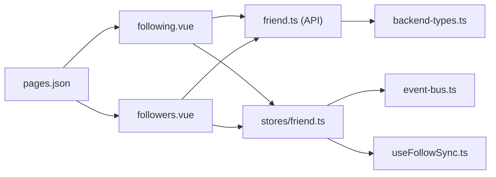

# Following & Followers System

<cite>
**Referenced Files in This Document**
- [following.vue](file://src/pages/friend/following.vue)
- [followers.vue](file://src/pages/friend/followers.vue)
- [friend.ts](file://src/stores/friend.ts)
- [friend.ts](file://src/api/modules/friend.ts)
- [backend-types.ts](file://src/types/api/backend-types.ts)
- [useFollowSync.ts](file://src/composables/useFollowSync.ts)
- [event-bus.ts](file://src/utils/event-bus.ts)
- [useInfiniteScroll.ts](file://src/pages/tabbar/home/composables/useInfiniteScroll.ts)
- [useVirtualScroll.ts](file://src/composables/useVirtualScroll.ts)
- [collaborative.ts](file://src/pages/tabbar/home/algorithms/collaborative.ts)
- [mixStrategy.ts](file://src/pages/tabbar/home/algorithms/mixStrategy.ts)
- [pages.json](file://src/pages.json)
- [main.ts](file://src/main.ts)
</cite>

## Table of Contents
1. [Introduction](#introduction)
2. [Project Structure](#project-structure)
3. [Core Components](#core-components)
4. [Architecture Overview](#architecture-overview)
5. [Detailed Component Analysis](#detailed-component-analysis)
6. [Dependency Analysis](#dependency-analysis)
7. [Performance Considerations](#performance-considerations)
8. [Troubleshooting Guide](#troubleshooting-guide)
9. [Conclusion](#conclusion)
10. [Appendices](#appendices)

## Introduction
This document explains the following and followers system implemented in the frontend. It distinguishes between following and friendship relationships, documents the APIs for managing follow relationships, describes the UI components for displaying follow lists, and outlines practical approaches for generating follow suggestions. It also covers performance considerations for large follow graphs and mechanisms for real-time updates.

## Project Structure
The system spans three primary areas:
- API module that defines endpoints and response models for friends and follow relationships
- Store that centralizes state and actions for friend-related operations
- Pages that render follow lists and manage user interactions

**Diagram sources**
- [following.vue:1-160](file://src/pages/friend/following.vue#L1-L160)
- [followers.vue:1-178](file://src/pages/friend/followers.vue#L1-L178)
- [friend.ts:1-61](file://src/api/modules/friend.ts#L1-L61)
- [backend-types.ts:292-339](file://src/types/api/backend-types.ts#L292-L339)
- [friend.ts:1-70](file://src/stores/friend.ts#L1-L70)
- [useFollowSync.ts:1-57](file://src/composables/useFollowSync.ts#L1-L57)
- [event-bus.ts:1-49](file://src/utils/event-bus.ts#L1-L49)
- [pages.json:64-86](file://src/pages.json#L64-L86)

**Section sources**
- [following.vue:1-160](file://src/pages/friend/following.vue#L1-L160)
- [followers.vue:1-178](file://src/pages/friend/followers.vue#L1-L178)
- [friend.ts:1-61](file://src/api/modules/friend.ts#L1-L61)
- [backend-types.ts:292-339](file://src/types/api/backend-types.ts#L292-L339)
- [friend.ts:1-70](file://src/stores/friend.ts#L1-L70)
- [useFollowSync.ts:1-57](file://src/composables/useFollowSync.ts#L1-L57)
- [event-bus.ts:1-49](file://src/utils/event-bus.ts#L1-L49)
- [pages.json:64-86](file://src/pages.json#L64-L86)

## Core Components
- API module for friends and follow relationships
- Pinia store for friend/follow state
- UI pages for following and followers lists
- Real-time synchronization via event bus
- Infinite scrolling and virtual scrolling utilities

**Section sources**
- [friend.ts:1-61](file://src/api/modules/friend.ts#L1-L61)
- [friend.ts:1-70](file://src/stores/friend.ts#L1-L70)
- [following.vue:1-160](file://src/pages/friend/following.vue#L1-L160)
- [followers.vue:1-178](file://src/pages/friend/followers.vue#L1-L178)
- [useFollowSync.ts:1-57](file://src/composables/useFollowSync.ts#L1-L57)
- [useInfiniteScroll.ts:1-71](file://src/pages/tabbar/home/composables/useInfiniteScroll.ts#L1-L71)
- [useVirtualScroll.ts:1-245](file://src/composables/useVirtualScroll.ts#L1-L245)

## Architecture Overview
The system follows a layered architecture:
- UI pages trigger actions and render lists
- API module encapsulates HTTP requests to backend endpoints
- Store manages state and exposes convenience methods
- Event bus synchronizes follow state across pages
- Utilities support performance and UX (infinite scroll, virtual scroll)

**Diagram sources**
- [following.vue:51-73](file://src/pages/friend/following.vue#L51-L73)
- [followers.vue:81-117](file://src/pages/friend/followers.vue#L81-L117)
- [friend.ts:20-36](file://src/api/modules/friend.ts#L20-L36)
- [friend.ts:17-35](file://src/stores/friend.ts#L17-L35)
- [event-bus.ts:41-48](file://src/utils/event-bus.ts#L41-L48)

## Detailed Component Analysis

### Relationship Types: Following vs Friendship
- Following relationship:
  - Unidirectional follow
  - Used for public profiles and discoverability
  - Supports viewing others’ public content/feed
- Friendship relationship:
  - Typically implies mutual connection and often unlocks private features (e.g., private chat)
  - Defined by a separate model with mutual indicators and additional fields

These distinctions are reflected in the backend types and the presence of dedicated endpoints for each.

**Section sources**
- [backend-types.ts:292-319](file://src/types/api/backend-types.ts#L292-L319)
- [friend.ts:17-48](file://src/api/modules/friend.ts#L17-L48)

### API Endpoints for Managing Follow Relationships
- Get current user’s following list
  - Method: GET
  - Path: /friend/following
  - Response: Array of Friendship
- Get a specific user’s following list
  - Method: GET
  - Path: /friend/following/{userId}
  - Response: Array of Friendship
- Get current user’s followers list
  - Method: GET
  - Path: /friend/followers
  - Response: Array of Friendship
- Get a specific user’s followers list
  - Method: GET
  - Path: /friend/followers/{userId}
  - Response: Array of Friendship
- Follow a user
  - Method: POST
  - Path: /friend/follow
  - Body: { friendId: number }
  - Response: Friendship
- Unfollow a user
  - Method: POST
  - Path: /friend/unfollow
  - Body: { friendId: number }
  - Response: { success: boolean }
- Get friendship status for a user
  - Method: GET
  - Path: /friend/status/{userId}
  - Response: FriendshipStatus (includes isFriend, isFollowing, etc.)

Data models:
- Friendship: includes identifiers, status, mutual flag, timestamps, and associated users
- FriendshipStatus: includes booleans and thresholds for private features

**Section sources**
- [friend.ts:16-61](file://src/api/modules/friend.ts#L16-L61)
- [backend-types.ts:292-339](file://src/types/api/backend-types.ts#L292-L339)

### UI Components for Following/Followers Lists
- Following list page
  - Loads own or another user’s following list
  - Renders avatars and nicknames
  - Allows unfollowing when viewing self
  - Uses optimistic UI for unfollow action
- Followers list page
  - Loads own or another user’s followers list
  - Renders avatars and nicknames
  - Provides follow/unfollow toggle per follower
  - Performs per-item status checks for “+ Follow” vs “Unfollow”
  - Uses optimistic UI for follow/unfollow actions

**Diagram sources**
- [following.vue:51-99](file://src/pages/friend/following.vue#L51-L99)
- [followers.vue:81-117](file://src/pages/friend/followers.vue#L81-L117)
- [event-bus.ts:41-48](file://src/utils/event-bus.ts#L41-L48)

**Section sources**
- [following.vue:1-160](file://src/pages/friend/following.vue#L1-L160)
- [followers.vue:1-178](file://src/pages/friend/followers.vue#L1-L178)

### Real-Time Updates and Cross-Page Synchronization
- Event bus emits USER_FOLLOWED and USER_UNFOLLOWED events after successful follow/unfollow
- useFollowSync listens to these events and updates follow status in lists
- Works for both nested user objects and flat user IDs

**Diagram sources**
- [friend.ts:29-35](file://src/stores/friend.ts#L29-L35)
- [event-bus.ts:41-48](file://src/utils/event-bus.ts#L41-L48)
- [useFollowSync.ts:22-45](file://src/composables/useFollowSync.ts#L22-L45)

**Section sources**
- [friend.ts:1-70](file://src/stores/friend.ts#L1-L70)
- [useFollowSync.ts:1-57](file://src/composables/useFollowSync.ts#L1-L57)
- [event-bus.ts:1-49](file://src/utils/event-bus.ts#L1-L49)

### User Interface Components: Infinite Scrolling and Virtual Scrolling
- Infinite scroll composable
  - Detects proximity to bottom and triggers load-more
  - Supports refresh and pagination flags
- Virtual scroll composable
  - Renders only visible items to improve performance on large lists
  - Supports fixed and dynamic heights

**Diagram sources**
- [useInfiniteScroll.ts:17-40](file://src/pages/tabbar/home/composables/useInfiniteScroll.ts#L17-L40)
- [useVirtualScroll.ts:15-79](file://src/composables/useVirtualScroll.ts#L15-L79)

**Section sources**
- [useInfiniteScroll.ts:1-71](file://src/pages/tabbar/home/composables/useInfiniteScroll.ts#L1-L71)
- [useVirtualScroll.ts:1-245](file://src/composables/useVirtualScroll.ts#L1-L245)

### Implementing Follow Suggestions
The codebase includes recommendation utilities that can inspire follow suggestions:
- Collaborative filtering: compute user similarities and recommend accounts liked by similar users but not yet interacted with by the current user
- Mixed strategy: combine hot, nearby, topic, and new user signals

**Diagram sources**
- [collaborative.ts:121-221](file://src/pages/tabbar/home/algorithms/collaborative.ts#L121-L221)
- [mixStrategy.ts:219-340](file://src/pages/tabbar/home/algorithms/mixStrategy.ts#L219-L340)

**Section sources**
- [collaborative.ts:110-221](file://src/pages/tabbar/home/algorithms/collaborative.ts#L110-L221)
- [mixStrategy.ts:195-340](file://src/pages/tabbar/home/algorithms/mixStrategy.ts#L195-L340)

## Dependency Analysis
- UI pages depend on the API module for data fetching
- Store depends on API module for network calls and revalidates state
- Real-time synchronization relies on event bus and a shared composable
- Routing configuration exposes the follow list pages

**Diagram sources**
- [pages.json:64-86](file://src/pages.json#L64-L86)
- [following.vue:27-30](file://src/pages/friend/following.vue#L27-L30)
- [followers.vue:27-30](file://src/pages/friend/followers.vue#L27-L30)
- [friend.ts:1-61](file://src/api/modules/friend.ts#L1-L61)
- [backend-types.ts:292-339](file://src/types/api/backend-types.ts#L292-L339)
- [friend.ts:1-70](file://src/stores/friend.ts#L1-L70)
- [useFollowSync.ts:1-57](file://src/composables/useFollowSync.ts#L1-L57)
- [event-bus.ts:1-49](file://src/utils/event-bus.ts#L1-L49)

**Section sources**
- [pages.json:64-86](file://src/pages.json#L64-L86)
- [friend.ts:1-61](file://src/api/modules/friend.ts#L1-L61)
- [friend.ts:1-70](file://src/stores/friend.ts#L1-L70)
- [useFollowSync.ts:1-57](file://src/composables/useFollowSync.ts#L1-L57)
- [event-bus.ts:1-49](file://src/utils/event-bus.ts#L1-L49)

## Performance Considerations
- Large follow graphs
  - Use virtual scrolling to render only visible items
  - Apply infinite scroll to paginate large lists
- Real-time updates
  - Use optimistic UI for immediate feedback during follow/unfollow
  - Reconcile with server responses and roll back on failure
- Cross-page synchronization
  - Use event bus to keep lists consistent without redundant network calls
- Backend pagination
  - Prefer paginated endpoints for followers and following lists to avoid heavy payloads

[No sources needed since this section provides general guidance]

## Troubleshooting Guide
- Follow/Unfollow fails
  - Verify API responses and handle errors gracefully
  - Roll back UI state on failure
- Status mismatch in lists
  - Ensure event bus listeners are registered and that items expose either nested user objects or flat user IDs
- Infinite scroll not triggering
  - Confirm scroll threshold and container sizing
- Virtual scroll rendering issues
  - For dynamic heights, measure item heights and recalculate offsets

**Section sources**
- [followers.vue:109-116](file://src/pages/friend/followers.vue#L109-L116)
- [useFollowSync.ts:22-45](file://src/composables/useFollowSync.ts#L22-L45)
- [useInfiniteScroll.ts:17-27](file://src/pages/tabbar/home/composables/useInfiniteScroll.ts#L17-L27)
- [useVirtualScroll.ts:103-120](file://src/composables/useVirtualScroll.ts#L103-L120)

## Conclusion
The system cleanly separates following from friendship, exposes robust APIs for managing follow relationships, and provides responsive UIs with infinite/virtual scrolling. Real-time synchronization ensures consistency across pages, while suggestion algorithms offer scalable ways to grow a user’s network.

[No sources needed since this section summarizes without analyzing specific files]

## Appendices

### API Definitions Summary
- GET /friend/following → Array of Friendship
- GET /friend/following/{userId} → Array of Friendship
- GET /friend/followers → Array of Friendship
- GET /friend/followers/{userId} → Array of Friendship
- POST /friend/follow { friendId } → Friendship
- POST /friend/unfollow { friendId } → { success: boolean }
- GET /friend/status/{userId} → FriendshipStatus

**Section sources**
- [friend.ts:16-61](file://src/api/modules/friend.ts#L16-L61)

### Data Models Summary
- Friendship: identifiers, status, mutual flag, timestamps, user objects
- FriendshipStatus: booleans and thresholds for private features

**Section sources**
- [backend-types.ts:292-339](file://src/types/api/backend-types.ts#L292-L339)