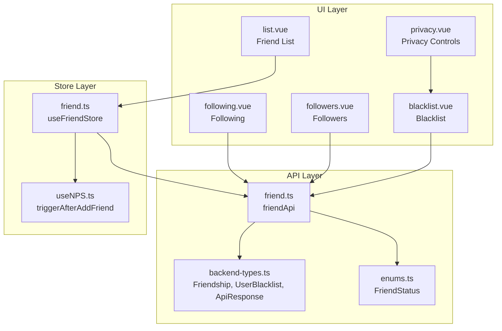
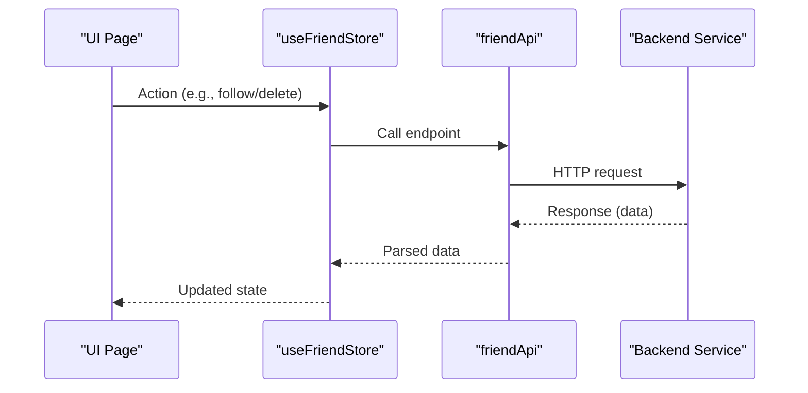
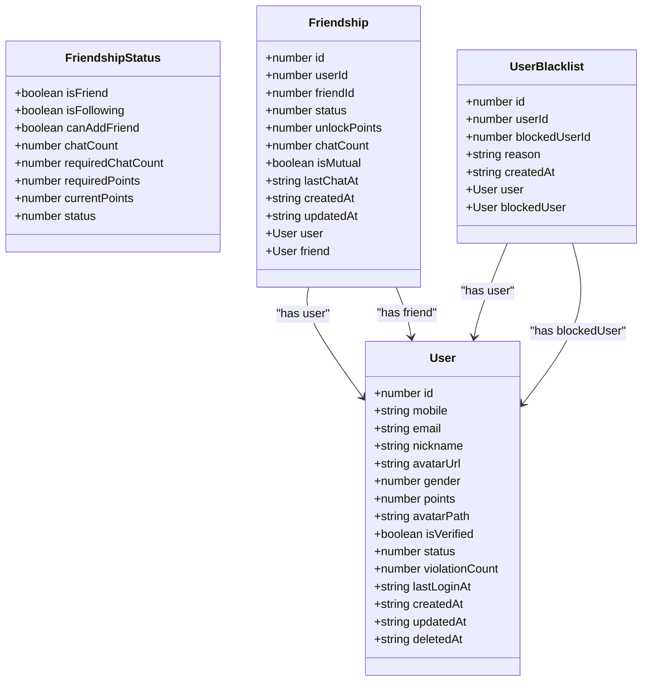
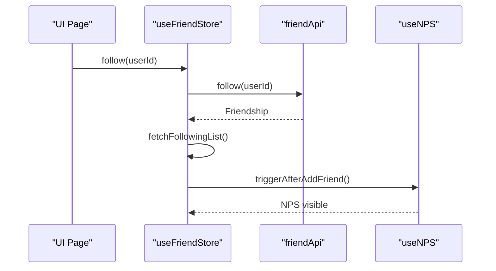
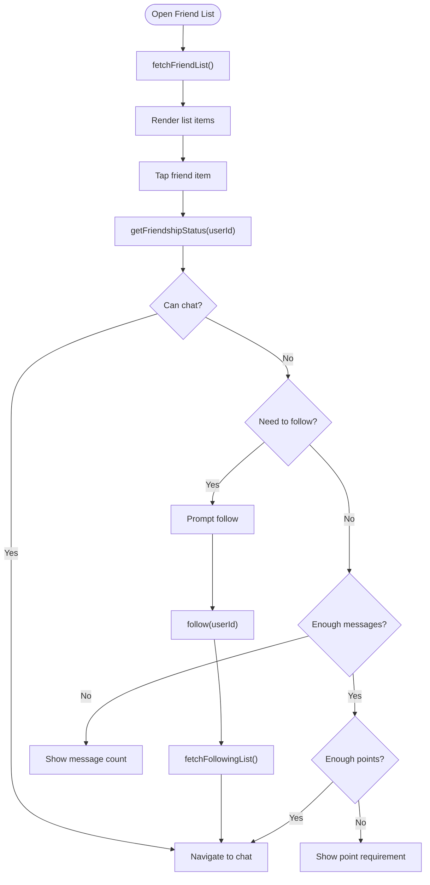
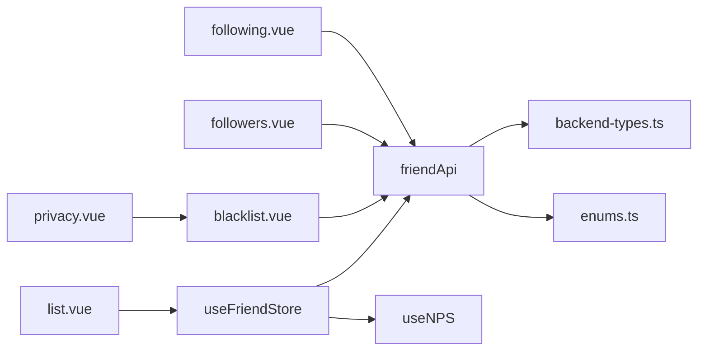

# Friend Management System

<cite>
**Referenced Files in This Document**
- [friend.ts](file://src/api/modules/friend.ts)
- [friend.ts](file://src/stores/friend.ts)
- [backend-types.ts](file://src/types/api/backend-types.ts)
- [enums.ts](file://src/types/enums.ts)
- [list.vue](file://src/pages/friend/list.vue)
- [following.vue](file://src/pages/friend/following.vue)
- [followers.vue](file://src/pages/friend/followers.vue)
- [blacklist.vue](file://src/pages/friend/blacklist.vue)
- [privacy.vue](file://src/pages/profile/privacy.vue)
- [useNPS.ts](file://src/composables/useNPS.ts)
- [websocket.ts](file://src/utils/websocket.ts)
</cite>

## Table of Contents
1. [Introduction](#introduction)
2. [Project Structure](#project-structure)
3. [Core Components](#core-components)
4. [Architecture Overview](#architecture-overview)
5. [Detailed Component Analysis](#detailed-component-analysis)
6. [Dependency Analysis](#dependency-analysis)
7. [Performance Considerations](#performance-considerations)
8. [Troubleshooting Guide](#troubleshooting-guide)
9. [Conclusion](#conclusion)
10. [Appendices](#appendices)

## Introduction
This document describes the friend management system, covering the complete friend workflow: friend requests, acceptance, deletion, and friendship status tracking. It documents the API endpoints for friend operations, the FriendshipStatus model, and how friendship states are managed. It also explains implementation examples for friend search functionality, mutual friends calculation, and friend suggestion algorithms. Privacy controls, notification systems, and friend list synchronization across devices are addressed.

## Project Structure
The friend management system spans three layers:
- API module: Declares typed endpoints for friend operations and FriendshipStatus model.
- Store: Centralizes state for friend lists and blocklist, and orchestrates UI actions.
- Pages: UI components for friend list, following, followers, and blacklist screens.

**Diagram sources**
- [friend.ts:1-61](file://src/api/modules/friend.ts#L1-L61)
- [backend-types.ts:292-339](file://src/types/api/backend-types.ts#L292-L339)
- [enums.ts:38-41](file://src/types/enums.ts#L38-L41)
- [friend.ts:1-70](file://src/stores/friend.ts#L1-L70)
- [useNPS.ts:127-133](file://src/composables/useNPS.ts#L127-L133)
- [list.vue:1-184](file://src/pages/friend/list.vue#L1-L184)
- [following.vue:1-160](file://src/pages/friend/following.vue#L1-L160)
- [followers.vue:1-178](file://src/pages/friend/followers.vue#L1-L178)
- [blacklist.vue:1-261](file://src/pages/friend/blacklist.vue#L1-L261)
- [privacy.vue:1-494](file://src/pages/profile/privacy.vue#L1-L494)

**Section sources**
- [friend.ts:1-61](file://src/api/modules/friend.ts#L1-L61)
- [friend.ts:1-70](file://src/stores/friend.ts#L1-L70)
- [list.vue:1-184](file://src/pages/friend/list.vue#L1-L184)
- [following.vue:1-160](file://src/pages/friend/following.vue#L1-L160)
- [followers.vue:1-178](file://src/pages/friend/followers.vue#L1-L178)
- [blacklist.vue:1-261](file://src/pages/friend/blacklist.vue#L1-L261)
- [privacy.vue:1-494](file://src/pages/profile/privacy.vue#L1-L494)

## Core Components
- API module: Exposes typed endpoints for friend operations and FriendshipStatus model.
- Store: Manages friend lists, blocklist, and triggers NPS after friend actions.
- UI pages: Implement friend list, following, followers, and blacklist screens with privacy controls.

Key responsibilities:
- API module: Define endpoint signatures and response types.
- Store: Fetch and update lists, expose friendship status queries, and integrate notifications.
- Pages: Drive user interactions, enforce privacy rules, and manage navigation.

**Section sources**
- [friend.ts:1-61](file://src/api/modules/friend.ts#L1-L61)
- [friend.ts:1-70](file://src/stores/friend.ts#L1-L70)
- [backend-types.ts:292-339](file://src/types/api/backend-types.ts#L292-L339)
- [enums.ts:38-41](file://src/types/enums.ts#L38-L41)

## Architecture Overview
The system follows a layered architecture:
- API layer defines endpoints and models.
- Store layer encapsulates state and side effects.
- UI layer handles user interactions and renders lists.

**Diagram sources**
- [friend.ts:16-61](file://src/api/modules/friend.ts#L16-L61)
- [friend.ts:12-67](file://src/stores/friend.ts#L12-L67)

## Detailed Component Analysis

### API Module: Friend Endpoints and FriendshipStatus Model
The API module exposes typed endpoints for friend operations and defines the FriendshipStatus model used by the UI.

Endpoints:
- GET /friend/list → returns array of Friendship
- GET /friend/following → returns array of Friendship
- GET /friend/following/:userId → returns array of Friendship
- GET /friend/followers → returns array of Friendship
- GET /friend/followers/:userId → returns array of Friendship
- POST /friend/follow → body: { friendId }, returns Friendship
- POST /friend/unfollow → body: { friendId }, returns { success: boolean }
- POST /friend/request → body: { friendId, message? }, returns Friendship
- POST /friend/accept → body: { friendId }, returns { success: boolean }
- POST /friend/add-friend → body: { friendId }, returns { success: boolean, pointsConsumed: number }
- GET /friend/status/:userId → returns FriendshipStatus
- DELETE /friend/:userId → returns { success: boolean }
- POST /friend/block → body: { friendId: blockedUserId, reason? }, returns UserBlacklist
- POST /friend/unblock → body: { friendId: blockedUserId }, returns { success: boolean }
- GET /friend/blocklist → returns array of UserBlacklist

FriendshipStatus model:
- isFriend: boolean
- isFollowing: boolean
- canAddFriend: boolean
- chatCount: number
- requiredChatCount: number
- requiredPoints: number
- currentPoints: number
- status: number

Friendship model:
- id, userId, friendId, status (FriendshipStatus), unlockPoints, chatCount, isMutual, lastChatAt, createdAt, updatedAt
- user, friend: User

UserBlacklist model:
- id, userId, blockedUserId, reason, createdAt
- user, blockedUser: User

FriendStatus enum:
- FOLLOWING = 0
- FRIEND = 1

**Diagram sources**
- [backend-types.ts:292-339](file://src/types/api/backend-types.ts#L292-L339)
- [backend-types.ts:94-131](file://src/types/api/backend-types.ts#L94-L131)
- [backend-types.ts:324-339](file://src/types/api/backend-types.ts#L324-L339)

**Section sources**
- [friend.ts:5-61](file://src/api/modules/friend.ts#L5-L61)
- [backend-types.ts:292-339](file://src/types/api/backend-types.ts#L292-L339)
- [enums.ts:38-41](file://src/types/enums.ts#L38-L41)

### Store: Friend State Management and Notifications
The store manages friend lists, blocklist, and friendship status. It also integrates with the NPS system to trigger surveys after friend actions.

Key store methods:
- fetchFriendList(): loads friend list
- fetchFollowingList(): loads following list
- getFriendshipStatus(userId): returns FriendshipStatus
- follow(userId): posts follow, refreshes following list, triggers NPS
- deleteFriend(userId): deletes friend and refreshes friend list
- blockUser(userId, reason?): blocks user and refreshes blocklist
- fetchBlocklist(): loads blocklist

**Diagram sources**
- [friend.ts:29-35](file://src/stores/friend.ts#L29-L35)
- [useNPS.ts:127-133](file://src/composables/useNPS.ts#L127-L133)

**Section sources**
- [friend.ts:1-70](file://src/stores/friend.ts#L1-L70)
- [useNPS.ts:127-133](file://src/composables/useNPS.ts#L127-L133)

### UI Pages: Friend Operations and Privacy Controls
- Friend list page: displays friend list, checks FriendshipStatus before allowing chat, supports deletion.
- Following page: shows following list, allows unfollow.
- Followers page: shows followers list, supports follow/unfollow with optimistic updates.
- Blacklist page: shows blocked users, supports unblocking and refreshes store.
- Privacy page: manages visibility and permissions affecting discoverability and interactions.

**Diagram sources**
- [list.vue:48-109](file://src/pages/friend/list.vue#L48-L109)
- [friend.ts:12-20](file://src/stores/friend.ts#L12-L20)

**Section sources**
- [list.vue:1-184](file://src/pages/friend/list.vue#L1-L184)
- [following.vue:1-160](file://src/pages/friend/following.vue#L1-L160)
- [followers.vue:1-178](file://src/pages/friend/followers.vue#L1-L178)
- [blacklist.vue:1-261](file://src/pages/friend/blacklist.vue#L1-L261)
- [privacy.vue:1-494](file://src/pages/profile/privacy.vue#L1-L494)

### Implementation Examples

#### Friend Search Functionality
- Use privacy settings to filter discoverable users.
- Combine search with location data for nearby users.
- Respect allowSearch and visibility settings.

Example steps:
- Query privacy settings to determine who is searchable.
- Filter user list by visibility level and location freshness.
- Exclude users on blacklist.

**Section sources**
- [privacy.vue:168-173](file://src/pages/profile/privacy.vue#L168-L173)
- [backend-types.ts:292-339](file://src/types/api/backend-types.ts#L292-L339)

#### Mutual Friends Calculation
- Compare two users’ friend lists to compute intersection.
- Use Friendship arrays returned by GET /friend/list for both users.

Algorithm outline:
- Fetch friend lists for user A and user B.
- Compute intersection of friend IDs.
- Resolve user details via client-side mapping or server-side endpoint.

**Section sources**
- [friend.ts:17-18](file://src/api/modules/friend.ts#L17-L18)
- [friend.ts:23-24](file://src/api/modules/friend.ts#L23-L24)

#### Friend Suggestions
- Nearby users: Use LBS algorithms to find users within a radius.
- Interest/topic alignment: Integrate with topic recommendation pipeline.
- Personalized ranking: Weight by distance, mutual connections, and activity.

Note: LBS utilities exist in the codebase for nearby user discovery.

**Section sources**
- [lbs.ts:94-380](file://src/pages/tabbar/home/algorithms/lbs.ts#L94-L380)

### Privacy Controls
- Visibility levels: public, friends, certified, private.
- Permissions: allowSearch, allowRecommend, allowStrangerMessage, onlyCertifiedUser.
- Blacklist: manage blocked users and remove from blacklist.

Integration points:
- Privacy settings influence who appears in search and recommendations.
- Blacklist affects visibility and messaging.

**Section sources**
- [privacy.vue:150-173](file://src/pages/profile/privacy.vue#L150-L173)
- [privacy.vue:250-277](file://src/pages/profile/privacy.vue#L250-L277)
- [blacklist.vue:69-103](file://src/pages/friend/blacklist.vue#L69-L103)

### Notification Systems
- NPS triggers after adding a friend.
- WebSocket support exists for real-time messaging; friend operations do not currently emit WS events.

Integration points:
- After successful follow, trigger NPS check.
- Chat messages are handled via WebSocket; friend list sync can be achieved by refreshing lists after operations.

**Section sources**
- [useNPS.ts:127-133](file://src/composables/useNPS.ts#L127-L133)
- [websocket.ts:1-171](file://src/utils/websocket.ts#L1-L171)

### Friend List Synchronization Across Devices
- Use optimistic UI updates for immediate feedback.
- Refresh friend lists after operations to reflect server state.
- For real-time updates, leverage WebSocket for chat; for friend list changes, poll or refetch.

Best practices:
- On follow/unfollow/delete, immediately update local lists and then refetch to reconcile server state.
- For blacklist changes, refresh blocklist store and UI.

**Section sources**
- [followers.vue:90-117](file://src/pages/friend/followers.vue#L90-L117)
- [blacklist.vue:77-92](file://src/pages/friend/blacklist.vue#L77-L92)
- [friend.ts:31-35](file://src/stores/friend.ts#L31-L35)

## Dependency Analysis
The system exhibits clean separation of concerns:
- API module depends on backend types and enums.
- Store depends on API module and NPS composable.
- UI pages depend on store and privacy controls.

**Diagram sources**
- [friend.ts:1-61](file://src/api/modules/friend.ts#L1-L61)
- [friend.ts:1-70](file://src/stores/friend.ts#L1-L70)
- [backend-types.ts:292-339](file://src/types/api/backend-types.ts#L292-L339)
- [enums.ts:38-41](file://src/types/enums.ts#L38-L41)
- [list.vue:1-184](file://src/pages/friend/list.vue#L1-L184)
- [following.vue:1-160](file://src/pages/friend/following.vue#L1-L160)
- [followers.vue:1-178](file://src/pages/friend/followers.vue#L1-L178)
- [blacklist.vue:1-261](file://src/pages/friend/blacklist.vue#L1-L261)
- [privacy.vue:1-494](file://src/pages/profile/privacy.vue#L1-L494)

**Section sources**
- [friend.ts:1-61](file://src/api/modules/friend.ts#L1-L61)
- [friend.ts:1-70](file://src/stores/friend.ts#L1-L70)
- [backend-types.ts:292-339](file://src/types/api/backend-types.ts#L292-L339)
- [enums.ts:38-41](file://src/types/enums.ts#L38-L41)

## Performance Considerations
- Optimize list rendering by virtualizing long friend lists.
- Debounce search/filter operations when implementing friend search.
- Cache FriendshipStatus locally to reduce repeated network calls.
- Batch refresh operations to avoid redundant fetches after multiple actions.

## Troubleshooting Guide
Common issues and resolutions:
- FriendshipStatus checks fail: ensure getFriendshipStatus is called with a valid userId and that the endpoint returns expected fields.
- Follow/unfollow not reflected: verify fetchFollowingList is invoked after follow/unfollow.
- Delete friend does nothing: confirm deleteFriend resolves and fetchFriendList is called afterward.
- Blacklist changes not visible: ensure fetchBlocklist is called after block/unblock operations.
- Privacy settings not applied: check that privacy settings are saved and reloaded on page mount.

**Section sources**
- [list.vue:61-109](file://src/pages/friend/list.vue#L61-L109)
- [followers.vue:90-117](file://src/pages/friend/followers.vue#L90-L117)
- [blacklist.vue:77-103](file://src/pages/friend/blacklist.vue#L77-L103)
- [privacy.vue:231-248](file://src/pages/profile/privacy.vue#L231-L248)

## Conclusion
The friend management system provides a robust foundation for friend operations, status tracking, privacy controls, and list synchronization. By leveraging typed models, centralized store logic, and modular UI pages, the system supports scalable enhancements such as friend suggestions, advanced privacy policies, and real-time synchronization.

## Appendices

### API Endpoint Reference
- GET /friend/list → array of Friendship
- GET /friend/following → array of Friendship
- GET /friend/following/{userId} → array of Friendship
- GET /friend/followers → array of Friendship
- GET /friend/followers/{userId} → array of Friendship
- POST /friend/follow → Friendship
- POST /friend/unfollow → { success: boolean }
- POST /friend/request → Friendship
- POST /friend/accept → { success: boolean }
- POST /friend/add-friend → { success: boolean, pointsConsumed: number }
- GET /friend/status/{userId} → FriendshipStatus
- DELETE /friend/{userId} → { success: boolean }
- POST /friend/block → UserBlacklist
- POST /friend/unblock → { success: boolean }
- GET /friend/blocklist → array of UserBlacklist

**Section sources**
- [friend.ts:17-61](file://src/api/modules/friend.ts#L17-L61)