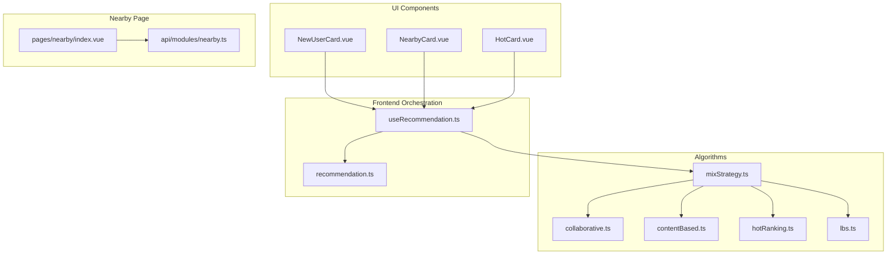
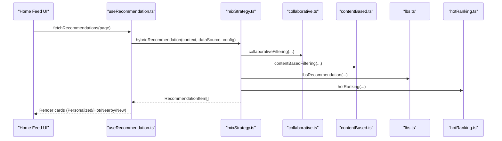
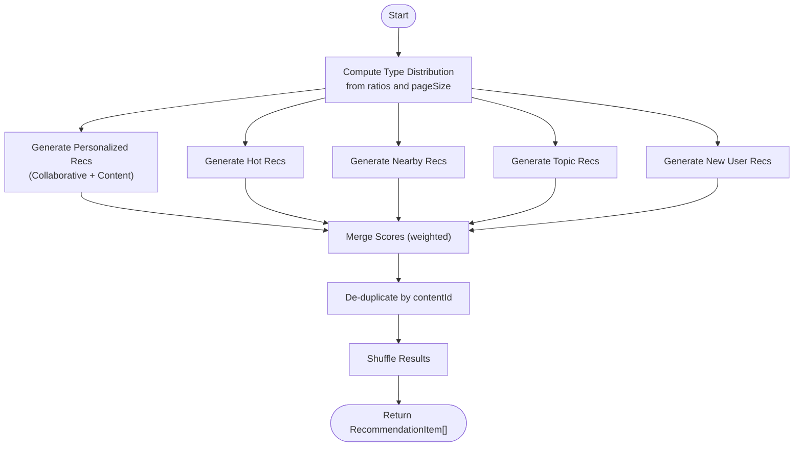
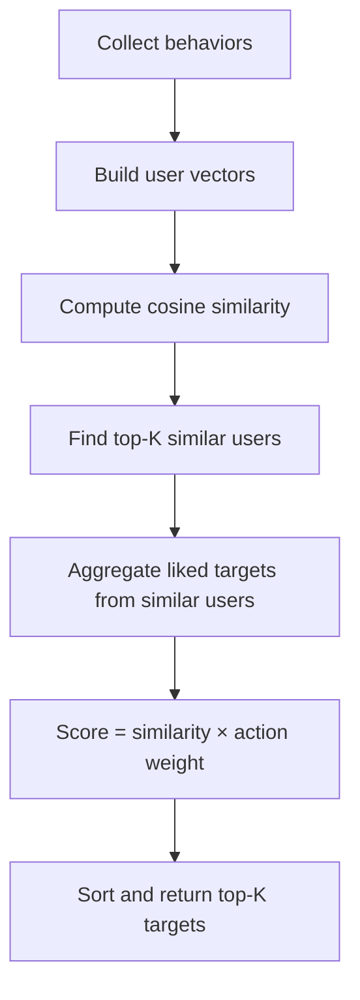
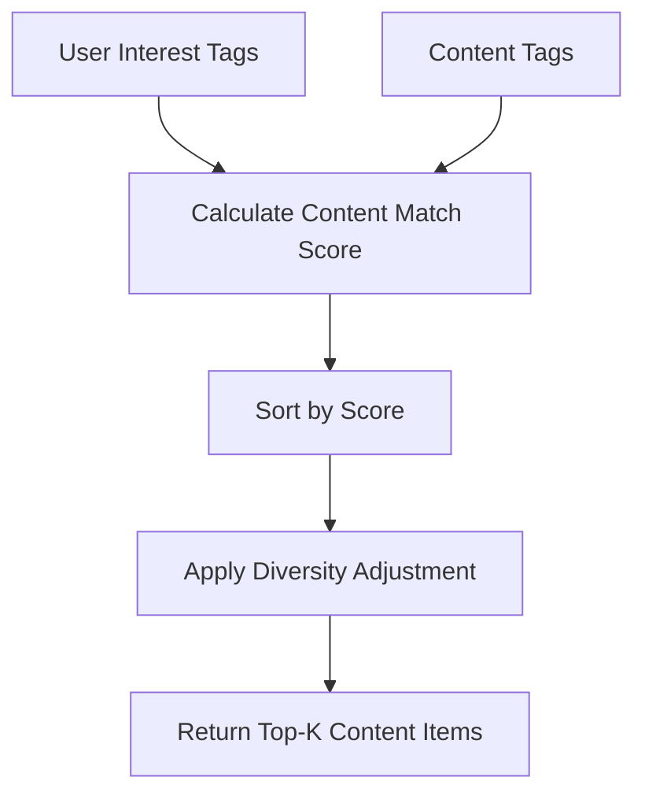
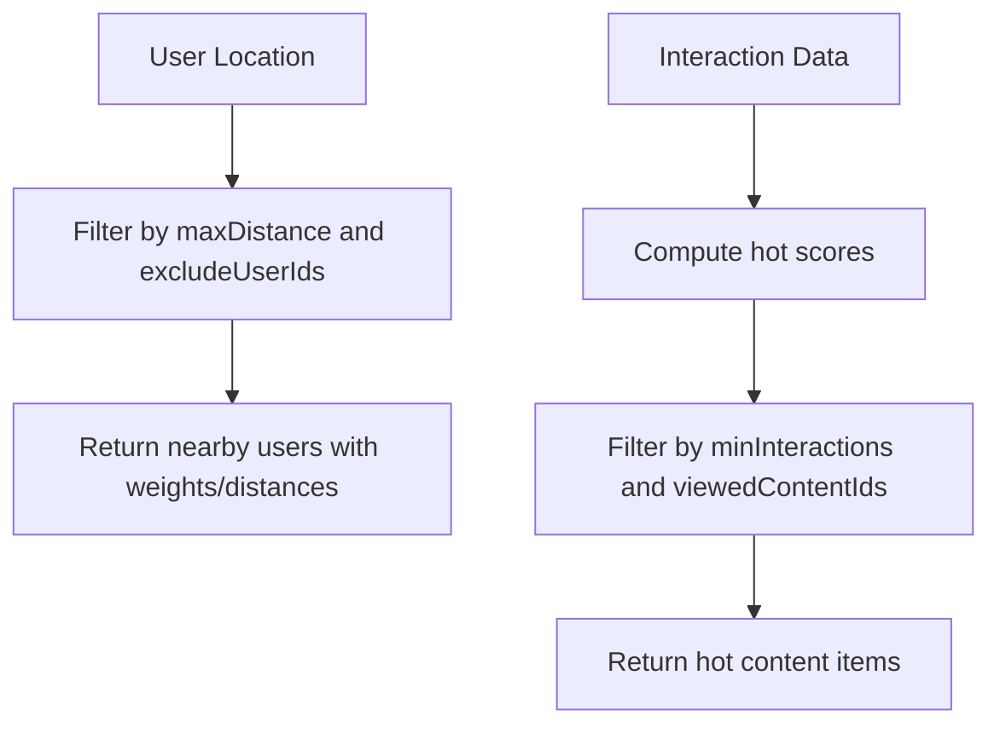
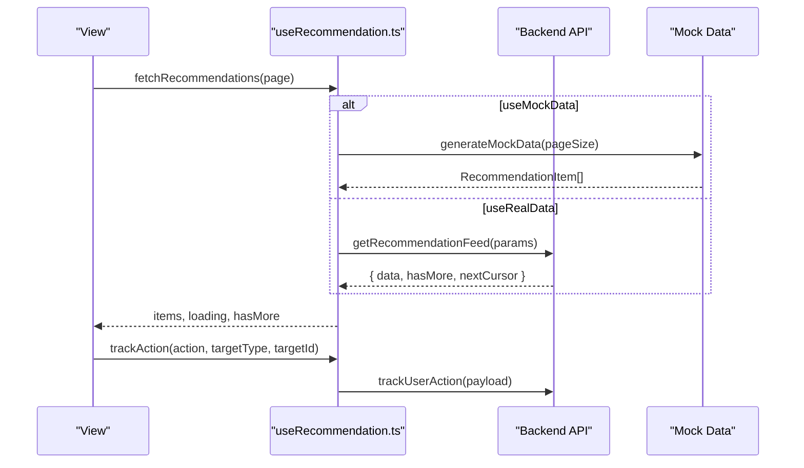
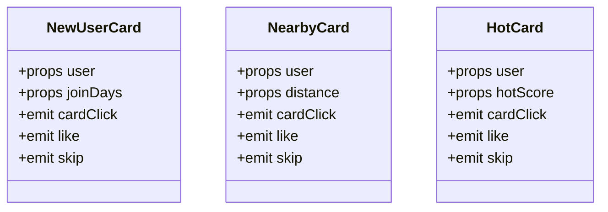
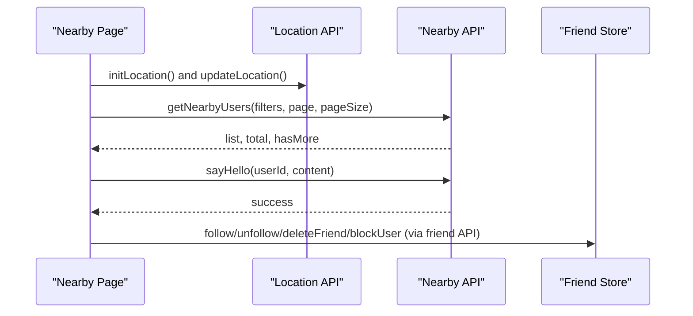
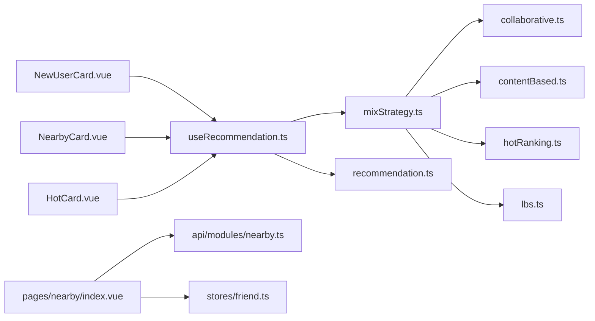

# Social Discovery & Suggestions

<cite>
**Referenced Files in This Document**
- [collaborative.ts](file://src/pages/tabbar/home/algorithms/collaborative.ts)
- [contentBased.ts](file://src/pages/tabbar/home/algorithms/contentBased.ts)
- [mixStrategy.ts](file://src/pages/tabbar/home/algorithms/mixStrategy.ts)
- [lbs.ts](file://src/pages/tabbar/home/algorithms/lbs.ts)
- [hotRanking.ts](file://src/pages/tabbar/home/algorithms/hotRanking.ts)
- [useRecommendation.ts](file://src/pages/tabbar/home/composables/useRecommendation.ts)
- [recommendation.ts](file://src/pages/tabbar/home/types/recommendation.ts)
- [NewUserCard.vue](file://src/pages/tabbar/home/components/NewUserCard.vue)
- [NearbyCard.vue](file://src/pages/tabbar/home/components/NearbyCard.vue)
- [HotCard.vue](file://src/pages/tabbar/home/components/HotCard.vue)
- [index.vue](file://src/pages/nearby/index.vue)
- [nearby.ts](file://src/api/modules/nearby.ts)
- [friend.ts](file://src/api/modules/friend.ts)
- [friend.ts](file://src/stores/friend.ts)
</cite>

## Table of Contents
1. [Introduction](#introduction)
2. [Project Structure](#project-structure)
3. [Core Components](#core-components)
4. [Architecture Overview](#architecture-overview)
5. [Detailed Component Analysis](#detailed-component-analysis)
6. [Dependency Analysis](#dependency-analysis)
7. [Performance Considerations](#performance-considerations)
8. [Troubleshooting Guide](#troubleshooting-guide)
9. [Privacy Controls and Consent Management](#privacy-controls-and-consent-management)
10. [Conclusion](#conclusion)

## Introduction
This document explains the social discovery and user suggestion features implemented in the project. It covers:
- Algorithms for discovering new connections via mutual friends, shared interests, location proximity, and activity patterns
- Implementation of recommendation engines: collaborative filtering, content-based matching, and hybrid strategies
- UI components for displaying suggested users, including approval workflows and contextual information cards
- Examples of discovery filters, preference-based matching, and engagement-based ranking
- Privacy controls for suggestion algorithms and user consent management

## Project Structure
The discovery and suggestions feature spans three layers:
- Algorithms: collaborative filtering, content-based matching, hot ranking, and LBS proximity
- Composables and Types: frontend orchestration, pagination, and typed recommendation payloads
- UI Cards and Pages: user-facing cards for “New,” “Nearby,” and “Hot” suggestions, plus the “Nearby People” page

**Diagram sources**
- [mixStrategy.ts:1-482](file://src/pages/tabbar/home/algorithms/mixStrategy.ts#L1-L482)
- [collaborative.ts:1-222](file://src/pages/tabbar/home/algorithms/collaborative.ts#L1-L222)
- [contentBased.ts:1-297](file://src/pages/tabbar/home/algorithms/contentBased.ts#L1-L297)
- [hotRanking.ts](file://src/pages/tabbar/home/algorithms/hotRanking.ts)
- [lbs.ts](file://src/pages/tabbar/home/algorithms/lbs.ts)
- [useRecommendation.ts:1-202](file://src/pages/tabbar/home/composables/useRecommendation.ts#L1-L202)
- [recommendation.ts:1-119](file://src/pages/tabbar/home/types/recommendation.ts#L1-L119)
- [NewUserCard.vue:1-260](file://src/pages/tabbar/home/components/NewUserCard.vue#L1-L260)
- [NearbyCard.vue:1-234](file://src/pages/tabbar/home/components/NearbyCard.vue#L1-L234)
- [HotCard.vue:1-287](file://src/pages/tabbar/home/components/HotCard.vue#L1-L287)
- [index.vue:1-712](file://src/pages/nearby/index.vue#L1-L712)
- [nearby.ts:1-82](file://src/api/modules/nearby.ts#L1-L82)

**Section sources**
- [mixStrategy.ts:1-482](file://src/pages/tabbar/home/algorithms/mixStrategy.ts#L1-L482)
- [useRecommendation.ts:1-202](file://src/pages/tabbar/home/composables/useRecommendation.ts#L1-L202)
- [recommendation.ts:1-119](file://src/pages/tabbar/home/types/recommendation.ts#L1-L119)
- [NewUserCard.vue:1-260](file://src/pages/tabbar/home/components/NewUserCard.vue#L1-L260)
- [NearbyCard.vue:1-234](file://src/pages/tabbar/home/components/NearbyCard.vue#L1-L234)
- [HotCard.vue:1-287](file://src/pages/tabbar/home/components/HotCard.vue#L1-L287)
- [index.vue:1-712](file://src/pages/nearby/index.vue#L1-L712)
- [nearby.ts:1-82](file://src/api/modules/nearby.ts#L1-L82)

## Core Components
- Hybrid recommendation engine: orchestrates personalized, hot, nearby, topic, and new user recommendations with configurable ratios and de-duplication
- Collaborative filtering: builds user behavior vectors and finds similar users to surface novel targets
- Content-based filtering: matches user interest tags against content tags with TF-IDF keyword extraction and diversity adjustment
- LBS proximity: recommends nearby users based on distance thresholds and exclusions
- Frontend composable: manages pagination, fallback to mock data, and user action tracking
- UI cards: render contextual suggestions with actionable buttons and rich metadata
- Nearby page: real-time discovery with filters, online presence, and greeting actions

**Section sources**
- [mixStrategy.ts:1-482](file://src/pages/tabbar/home/algorithms/mixStrategy.ts#L1-L482)
- [collaborative.ts:1-222](file://src/pages/tabbar/home/algorithms/collaborative.ts#L1-L222)
- [contentBased.ts:1-297](file://src/pages/tabbar/home/algorithms/contentBased.ts#L1-L297)
- [lbs.ts](file://src/pages/tabbar/home/algorithms/lbs.ts)
- [useRecommendation.ts:1-202](file://src/pages/tabbar/home/composables/useRecommendation.ts#L1-L202)
- [recommendation.ts:1-119](file://src/pages/tabbar/home/types/recommendation.ts#L1-L119)
- [NewUserCard.vue:1-260](file://src/pages/tabbar/home/components/NewUserCard.vue#L1-L260)
- [NearbyCard.vue:1-234](file://src/pages/tabbar/home/components/NearbyCard.vue#L1-L234)
- [HotCard.vue:1-287](file://src/pages/tabbar/home/components/HotCard.vue#L1-L287)
- [index.vue:1-712](file://src/pages/nearby/index.vue#L1-L712)
- [nearby.ts:1-82](file://src/api/modules/nearby.ts#L1-L82)

## Architecture Overview
The system combines offline algorithms with frontend orchestration and backend APIs. Recommendations are generated either via local hybrid strategy or fetched from the backend feed endpoint. The UI renders contextual cards and triggers user actions that can be tracked.

**Diagram sources**
- [useRecommendation.ts:32-82](file://src/pages/tabbar/home/composables/useRecommendation.ts#L32-L82)
- [mixStrategy.ts:363-416](file://src/pages/tabbar/home/algorithms/mixStrategy.ts#L363-L416)
- [collaborative.ts:170-222](file://src/pages/tabbar/home/algorithms/collaborative.ts#L170-L222)
- [contentBased.ts:259-297](file://src/pages/tabbar/home/algorithms/contentBased.ts#L259-L297)
- [lbs.ts](file://src/pages/tabbar/home/algorithms/lbs.ts)
- [hotRanking.ts](file://src/pages/tabbar/home/algorithms/hotRanking.ts)

## Detailed Component Analysis

### Hybrid Recommendation Engine
The hybrid strategy integrates multiple recommendation types with configurable ratios and page size. It:
- Computes type distribution from ratios and page size
- Generates recommendations in parallel for personalized, hot, nearby, topic, and new user
- Merges personalized results with weighted scores
- Applies de-duplication by content ID and randomizes order
- Provides a stream generator for pagination with a viewed-content tracker

**Diagram sources**
- [mixStrategy.ts:92-162](file://src/pages/tabbar/home/algorithms/mixStrategy.ts#L92-L162)
- [mixStrategy.ts:171-210](file://src/pages/tabbar/home/algorithms/mixStrategy.ts#L171-L210)
- [mixStrategy.ts:219-258](file://src/pages/tabbar/home/algorithms/mixStrategy.ts#L219-L258)
- [mixStrategy.ts:267-293](file://src/pages/tabbar/home/algorithms/mixStrategy.ts#L267-L293)
- [mixStrategy.ts:302-340](file://src/pages/tabbar/home/algorithms/mixStrategy.ts#L302-L340)
- [mixStrategy.ts:363-416](file://src/pages/tabbar/home/algorithms/mixStrategy.ts#L363-L416)

**Section sources**
- [mixStrategy.ts:1-482](file://src/pages/tabbar/home/algorithms/mixStrategy.ts#L1-L482)

### Collaborative Filtering
The collaborative filtering module:
- Defines user behavior and vector structures
- Assigns weights to actions (view, like, comment, favorite, follow)
- Builds user vectors over target IDs and computes cosine similarity
- Identifies similar users and generates scored recommendations for novel targets

**Diagram sources**
- [collaborative.ts:36-51](file://src/pages/tabbar/home/algorithms/collaborative.ts#L36-L51)
- [collaborative.ts:59-79](file://src/pages/tabbar/home/algorithms/collaborative.ts#L59-L79)
- [collaborative.ts:88-111](file://src/pages/tabbar/home/algorithms/collaborative.ts#L88-L111)
- [collaborative.ts:121-161](file://src/pages/tabbar/home/algorithms/collaborative.ts#L121-L161)
- [collaborative.ts:170-222](file://src/pages/tabbar/home/algorithms/collaborative.ts#L170-L222)

**Section sources**
- [collaborative.ts:1-222](file://src/pages/tabbar/home/algorithms/collaborative.ts#L1-L222)

### Content-Based Matching
The content-based module:
- Matches user interest tags to content tags with weighted scores
- Uses TF-IDF extraction for keyword-based content
- Applies diversity adjustment to avoid repetitive categories
- Supports cold-start via popularity-based recommendations

**Diagram sources**
- [contentBased.ts:34-70](file://src/pages/tabbar/home/algorithms/contentBased.ts#L34-L70)
- [contentBased.ts:79-95](file://src/pages/tabbar/home/algorithms/contentBased.ts#L79-L95)
- [contentBased.ts:104-130](file://src/pages/tabbar/home/algorithms/contentBased.ts#L104-L130)
- [contentBased.ts:171-226](file://src/pages/tabbar/home/algorithms/contentBased.ts#L171-L226)
- [contentBased.ts:235-250](file://src/pages/tabbar/home/algorithms/contentBased.ts#L235-L250)
- [contentBased.ts:259-297](file://src/pages/tabbar/home/algorithms/contentBased.ts#L259-L297)

**Section sources**
- [contentBased.ts:1-297](file://src/pages/tabbar/home/algorithms/contentBased.ts#L1-L297)

### LBS Proximity and Hot Ranking
- LBS recommendation selects nearby users within a distance threshold, excluding current user and previously viewed targets
- Hot ranking computes popularity scores from interaction data and filters by minimum interactions and viewed content

**Diagram sources**
- [mixStrategy.ts:232-258](file://src/pages/tabbar/home/algorithms/mixStrategy.ts#L232-L258)
- [hotRanking.ts](file://src/pages/tabbar/home/algorithms/hotRanking.ts)

**Section sources**
- [mixStrategy.ts:219-258](file://src/pages/tabbar/home/algorithms/mixStrategy.ts#L219-L258)

### Frontend Recommendation Orchestration
The composable manages:
- Pagination and infinite scroll
- Mock data fallback and backend API integration
- Action tracking for user interactions
- Typed recommendation payloads and runtime type guards

**Diagram sources**
- [useRecommendation.ts:32-82](file://src/pages/tabbar/home/composables/useRecommendation.ts#L32-L82)
- [useRecommendation.ts:99-119](file://src/pages/tabbar/home/composables/useRecommendation.ts#L99-L119)

**Section sources**
- [useRecommendation.ts:1-202](file://src/pages/tabbar/home/composables/useRecommendation.ts#L1-L202)
- [recommendation.ts:1-119](file://src/pages/tabbar/home/types/recommendation.ts#L1-L119)

### UI Cards for Suggestions
- NewUserCard: displays new user info, join duration, and actions (skip/welcome)
- NearbyCard: shows nearby user with distance and actions (skip/greet)
- HotCard: presents popular user with like/comment/favorite counts and actions (skip/like)

**Diagram sources**
- [NewUserCard.vue:55-79](file://src/pages/tabbar/home/components/NewUserCard.vue#L55-L79)
- [NearbyCard.vue:50-74](file://src/pages/tabbar/home/components/NearbyCard.vue#L50-L74)
- [HotCard.vue:71-102](file://src/pages/tabbar/home/components/HotCard.vue#L71-L102)

**Section sources**
- [NewUserCard.vue:1-260](file://src/pages/tabbar/home/components/NewUserCard.vue#L1-L260)
- [NearbyCard.vue:1-234](file://src/pages/tabbar/home/components/NearbyCard.vue#L1-L234)
- [HotCard.vue:1-287](file://src/pages/tabbar/home/components/HotCard.vue#L1-L287)

### Nearby People Discovery Page
The nearby page supports:
- Distance and gender filters
- Online presence indicators and last active timestamps
- Hello actions with server-side persistence
- Stats for visited and visitor counts

**Diagram sources**
- [index.vue:202-244](file://src/pages/nearby/index.vue#L202-L244)
- [index.vue:257-298](file://src/pages/nearby/index.vue#L257-L298)
- [index.vue:365-391](file://src/pages/nearby/index.vue#L365-L391)
- [nearby.ts:41-82](file://src/api/modules/nearby.ts#L41-L82)
- [friend.ts](file://src/api/modules/friend.ts)
- [friend.ts](file://src/stores/friend.ts)

**Section sources**
- [index.vue:1-712](file://src/pages/nearby/index.vue#L1-L712)
- [nearby.ts:1-82](file://src/api/modules/nearby.ts#L1-L82)
- [friend.ts](file://src/api/modules/friend.ts)
- [friend.ts](file://src/stores/friend.ts)

## Dependency Analysis
Key dependencies and coupling:
- Hybrid strategy depends on collaborative, content-based, hot ranking, and LBS modules
- Frontend composable depends on typed recommendation payloads and backend APIs
- UI cards depend on typed recommendation data and emit actions consumed by parent containers
- Nearby page depends on location updates and nearby APIs; integrates friend actions

**Diagram sources**
- [useRecommendation.ts:1-202](file://src/pages/tabbar/home/composables/useRecommendation.ts#L1-L202)
- [mixStrategy.ts:1-482](file://src/pages/tabbar/home/algorithms/mixStrategy.ts#L1-L482)
- [collaborative.ts:1-222](file://src/pages/tabbar/home/algorithms/collaborative.ts#L1-L222)
- [contentBased.ts:1-297](file://src/pages/tabbar/home/algorithms/contentBased.ts#L1-L297)
- [hotRanking.ts](file://src/pages/tabbar/home/algorithms/hotRanking.ts)
- [lbs.ts](file://src/pages/tabbar/home/algorithms/lbs.ts)
- [recommendation.ts:1-119](file://src/pages/tabbar/home/types/recommendation.ts#L1-L119)
- [NewUserCard.vue:1-260](file://src/pages/tabbar/home/components/NewUserCard.vue#L1-L260)
- [NearbyCard.vue:1-234](file://src/pages/tabbar/home/components/NearbyCard.vue#L1-L234)
- [HotCard.vue:1-287](file://src/pages/tabbar/home/components/HotCard.vue#L1-L287)
- [index.vue:1-712](file://src/pages/nearby/index.vue#L1-L712)
- [nearby.ts:1-82](file://src/api/modules/nearby.ts#L1-L82)
- [friend.ts](file://src/stores/friend.ts)

**Section sources**
- [mixStrategy.ts:1-482](file://src/pages/tabbar/home/algorithms/mixStrategy.ts#L1-L482)
- [useRecommendation.ts:1-202](file://src/pages/tabbar/home/composables/useRecommendation.ts#L1-L202)
- [recommendation.ts:1-119](file://src/pages/tabbar/home/types/recommendation.ts#L1-L119)
- [index.vue:1-712](file://src/pages/nearby/index.vue#L1-L712)
- [nearby.ts:1-82](file://src/api/modules/nearby.ts#L1-L82)
- [friend.ts](file://src/stores/friend.ts)

## Performance Considerations
- Parallel generation: hybrid strategy computes recommendations concurrently for each type to reduce latency
- Vectorization and similarity: collaborative filtering uses cosine similarity; consider normalization and sparsity handling for scalability
- Diversity adjustment: greedy selection improves variety but adds computational overhead; tune factor and topK accordingly
- Pagination and de-duplication: stream generator tracks viewed content to prevent repetition and maintains page boundaries
- UI virtualization: consider virtual scrolling for long lists of suggestions to reduce DOM overhead

[No sources needed since this section provides general guidance]

## Troubleshooting Guide
Common issues and remedies:
- Backend API failures: composable falls back to mock data and logs errors; verify network connectivity and endpoint availability
- Location permission denied: nearby page handles authorization denial and sets default coordinates; prompt users to enable location services
- Empty nearby results: adjust distance filter or remove gender restrictions; ensure location is updated before querying
- Action tracking failures: ensure action reporting is enabled and payload conforms to backend expectations

**Section sources**
- [useRecommendation.ts:66-82](file://src/pages/tabbar/home/composables/useRecommendation.ts#L66-L82)
- [index.vue:225-244](file://src/pages/nearby/index.vue#L225-L244)
- [index.vue:282-298](file://src/pages/nearby/index.vue#L282-L298)

## Privacy Controls and Consent Management
Privacy and consent considerations:
- Location-based discovery requires explicit user permission; the nearby page handles permission denial gracefully and defaults to a predefined coordinate
- Recommendation data should be aggregated locally when possible; avoid sending sensitive behavioral signals unless consented
- Users should be able to opt out of discovery features; expose toggles in privacy settings to disable collaborative filtering or LBS proximity
- Friend actions (follow/unfollow/block) require explicit user intent; ensure workflows include confirmation steps and audit logs

**Section sources**
- [index.vue:214-244](file://src/pages/nearby/index.vue#L214-L244)
- [friend.ts](file://src/api/modules/friend.ts)
- [friend.ts](file://src/stores/friend.ts)

## Conclusion
The system integrates collaborative filtering, content-based matching, hot ranking, and LBS proximity into a cohesive hybrid recommendation pipeline. The frontend composable and typed payloads ensure robust pagination and action tracking, while UI cards deliver contextual suggestions with clear approval workflows. The nearby page complements discovery with real-time proximity features and privacy-aware location handling. Extending the system involves tuning hybrid ratios, adding preference-based filters, and enforcing user consent for data collection.