# Social Networking

<cite>
**Referenced Files in This Document**
- [friend.ts](file://src/api/modules/friend.ts)
- [friend.ts](file://src/stores/friend.ts)
- [list.vue](file://src/pages/friend/list.vue)
- [blacklist.vue](file://src/pages/friend/blacklist.vue)
- [following.vue](file://src/pages/friend/following.vue)
- [followers.vue](file://src/pages/friend/followers.vue)
- [backend-types.ts](file://src/types/api/backend-types.ts)
- [useFollowSync.ts](file://src/composables/useFollowSync.ts)
- [privacy.vue](file://src/pages/profile/privacy.vue)
- [index.vue](file://src/pages/nearby/index.vue)
- [nearby-people-development.md](file://docs/refactry/nearby-people-development.md)
</cite>

## Table of Contents
1. [Introduction](#introduction)
2. [Project Structure](#project-structure)
3. [Core Components](#core-components)
4. [Architecture Overview](#architecture-overview)
5. [Detailed Component Analysis](#detailed-component-analysis)
6. [Dependency Analysis](#dependency-analysis)
7. [Performance Considerations](#performance-considerations)
8. [Troubleshooting Guide](#troubleshooting-guide)
9. [Conclusion](#conclusion)
10. [Appendices](#appendices)

## Introduction
This document describes the social networking subsystem of the WeTogether platform, focusing on the friend system, social graph management, and discovery features. It covers friend requests, follow/unfollow, blocking, privacy controls, and social discovery via “nearby people.” The documentation explains data models, API endpoints, state management, UI components, and practical examples for friend suggestions, mutual connections, and analytics-ready patterns.

## Project Structure
The social networking features are organized around:
- API module for friend operations
- Pinia store for client-side state
- Page components for friend lists, followers, following, and blacklist
- Privacy settings and blocking management
- Nearby people discovery and social interaction hooks

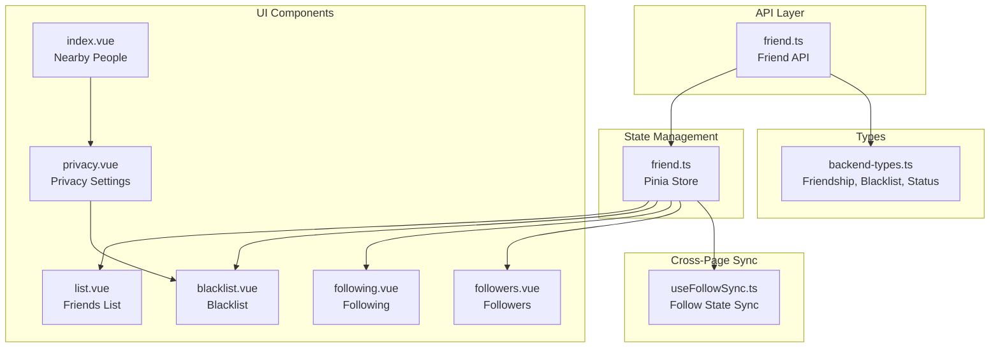

**Diagram sources**
- [friend.ts:1-61](file://src/api/modules/friend.ts#L1-L61)
- [friend.ts:1-70](file://src/stores/friend.ts#L1-L70)
- [list.vue:1-184](file://src/pages/friend/list.vue#L1-L184)
- [blacklist.vue:1-261](file://src/pages/friend/blacklist.vue#L1-L261)
- [following.vue:1-160](file://src/pages/friend/following.vue#L1-L160)
- [followers.vue:1-178](file://src/pages/friend/followers.vue#L1-L178)
- [privacy.vue:1-494](file://src/pages/profile/privacy.vue#L1-L494)
- [index.vue:1-762](file://src/pages/nearby/index.vue#L1-L762)
- [backend-types.ts:292-339](file://src/types/api/backend-types.ts#L292-L339)
- [useFollowSync.ts:1-57](file://src/composables/useFollowSync.ts#L1-L57)

**Section sources**
- [friend.ts:1-61](file://src/api/modules/friend.ts#L1-L61)
- [friend.ts:1-70](file://src/stores/friend.ts#L1-L70)
- [list.vue:1-184](file://src/pages/friend/list.vue#L1-L184)
- [blacklist.vue:1-261](file://src/pages/friend/blacklist.vue#L1-L261)
- [following.vue:1-160](file://src/pages/friend/following.vue#L1-L160)
- [followers.vue:1-178](file://src/pages/friend/followers.vue#L1-L178)
- [privacy.vue:1-494](file://src/pages/profile/privacy.vue#L1-L494)
- [index.vue:1-762](file://src/pages/nearby/index.vue#L1-L762)
- [backend-types.ts:292-339](file://src/types/api/backend-types.ts#L292-L339)
- [useFollowSync.ts:1-57](file://src/composables/useFollowSync.ts#L1-L57)

## Core Components
- Friend API module exposes endpoints for friend lists, follow/unfollow, friend requests, friendship status, and blocking.
- Pinia store manages friend list, following list, and blocklist state, and orchestrates optimistic updates and sync triggers.
- UI pages implement friend list, followers, following, and blacklist views with privacy-aware actions.
- Types define Friendship, UserBlacklist, and FriendshipStatus for consistent data modeling.

Key capabilities:
- Friend requests and acceptance
- Follow/unfollow with mutual indicators
- Blocking and unblocking with reasons
- Privacy controls affecting discoverability and interactions
- Social discovery via nearby people with greeting interactions

**Section sources**
- [friend.ts:16-61](file://src/api/modules/friend.ts#L16-L61)
- [friend.ts:7-69](file://src/stores/friend.ts#L7-L69)
- [backend-types.ts:292-339](file://src/types/api/backend-types.ts#L292-L339)

## Architecture Overview
The social networking subsystem follows a layered architecture:
- API layer encapsulates HTTP calls to backend endpoints
- Store layer centralizes state and side effects
- UI layer renders lists and handles user interactions
- Types layer defines shared data contracts
- Composables provide cross-page synchronization

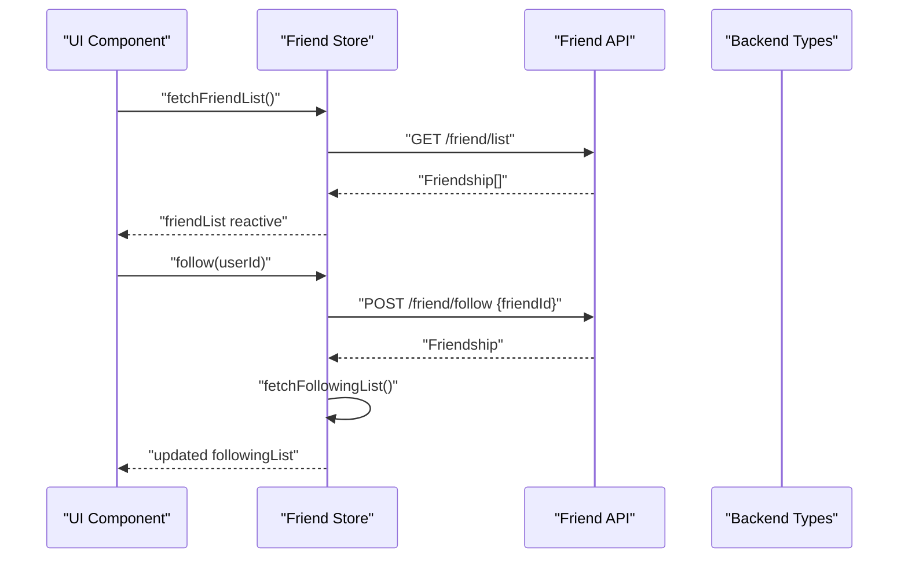

**Diagram sources**
- [friend.ts:12-35](file://src/stores/friend.ts#L12-L35)
- [friend.ts:17-36](file://src/api/modules/friend.ts#L17-L36)
- [backend-types.ts:292-319](file://src/types/api/backend-types.ts#L292-L319)

**Section sources**
- [friend.ts:12-35](file://src/stores/friend.ts#L12-L35)
- [friend.ts:17-36](file://src/api/modules/friend.ts#L17-L36)
- [backend-types.ts:292-319](file://src/types/api/backend-types.ts#L292-L319)

## Detailed Component Analysis

### Friend API Module
The friend API module defines typed endpoints for:
- Retrieving friend list, following list, followers list
- Getting user-specific lists
- Following and unfollowing
- Sending friend requests and accepting
- Adding friends with points consumption
- Checking friendship status (including chat unlock conditions)
- Deleting friends
- Blocking and unblocking users with optional reasons
- Fetching blocklist

```mermaid
classDiagram
class FriendAPI {
+getFriendList() Friendship[]
+getFollowingList() Friendship[]
+getUserFollowingList(userId) Friendship[]
+getFollowersList() Friendship[]
+getUserFollowersList(userId) Friendship[]
+follow(friendId) Friendship
+unfollow(friendId) { success }
+friendRequest(friendId, message?) Friendship
+acceptFriend(friendId) { success }
+addFriend(friendId) { success, pointsConsumed }
+getFriendshipStatus(userId) FriendshipStatus
+deleteFriend(userId) { success }
+blockUser(blockedUserId, reason?) UserBlacklist
+unblockUser(blockedUserId) { success }
+getBlocklist() UserBlacklist[]
}
class Friendship {
+number id
+number userId
+number friendId
+FriendshipStatus status
+number unlockPoints
+number chatCount
+boolean isMutual
+string lastChatAt
+string createdAt
+string updatedAt
+User user
+User friend
}
class UserBlacklist {
+number id
+number userId
+number blockedUserId
+string reason
+string createdAt
+User user
+User blockedUser
}
class FriendshipStatus {
+boolean isFriend
+boolean isFollowing
+boolean canAddFriend
+number chatCount
+number requiredChatCount
+number requiredPoints
+number currentPoints
+number status
}
FriendAPI --> Friendship : "returns"
FriendAPI --> UserBlacklist : "returns"
FriendAPI --> FriendshipStatus : "returns"
```

**Diagram sources**
- [friend.ts:5-61](file://src/api/modules/friend.ts#L5-L61)
- [backend-types.ts:292-339](file://src/types/api/backend-types.ts#L292-L339)

**Section sources**
- [friend.ts:5-61](file://src/api/modules/friend.ts#L5-L61)
- [backend-types.ts:292-339](file://src/types/api/backend-types.ts#L292-L339)

### Friend Store (State Management)
The friend store maintains:
- Reactive friendList, followingList, blocklist
- Async operations to fetch lists and update state
- Optimistic UI updates after follow/unfollow
- Triggers for analytics and cross-page sync

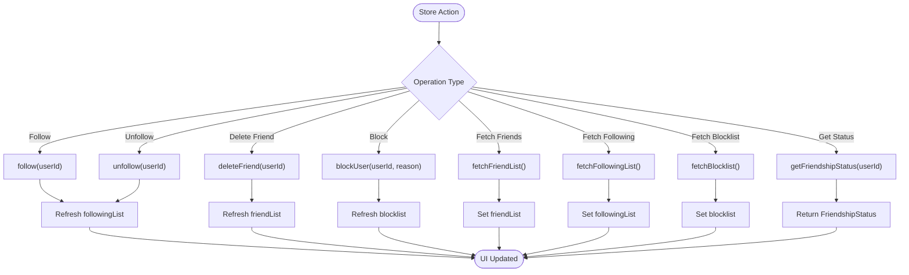

**Diagram sources**
- [friend.ts:12-69](file://src/stores/friend.ts#L12-L69)

**Section sources**
- [friend.ts:7-69](file://src/stores/friend.ts#L7-L69)

### Friends List Page
The friends list page displays the user’s friends, supports deleting friends, and enforces chat unlock rules via friendship status checks before navigating to chat.

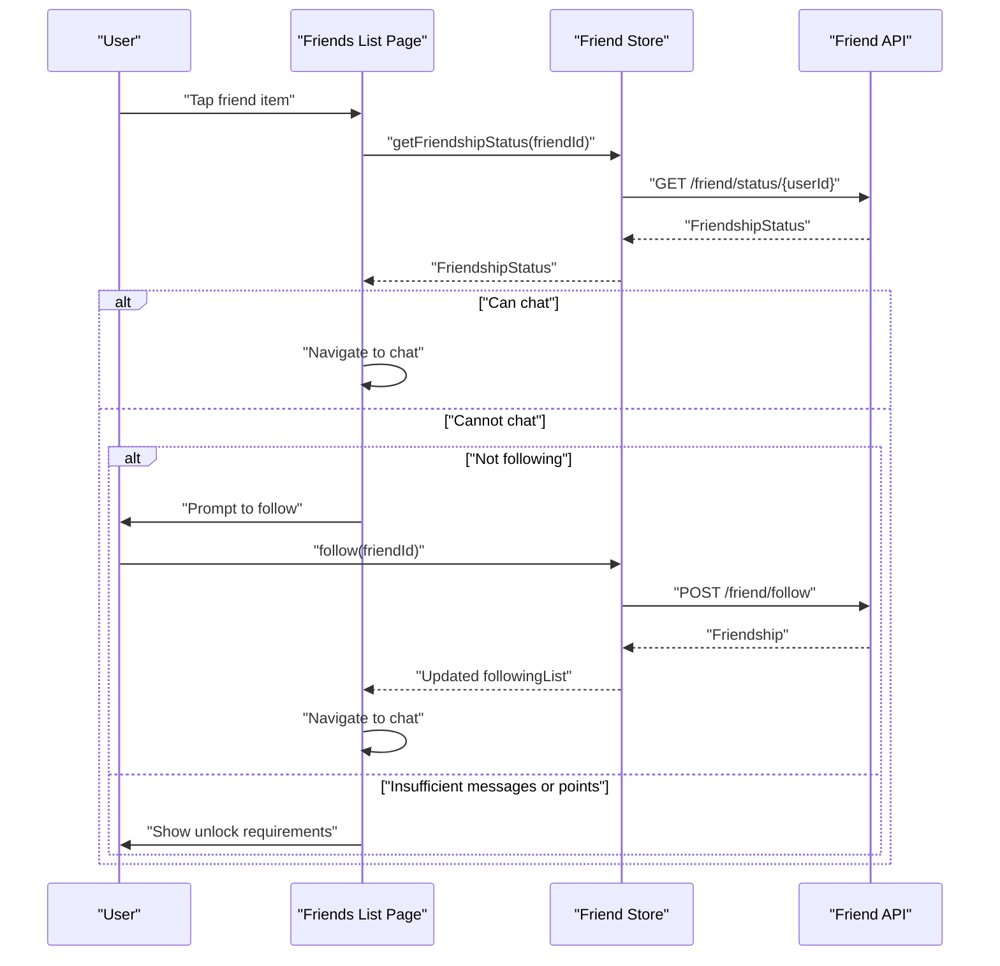

**Diagram sources**
- [list.vue:59-109](file://src/pages/friend/list.vue#L59-L109)
- [friend.ts:47-48](file://src/api/modules/friend.ts#L47-L48)

**Section sources**
- [list.vue:1-184](file://src/pages/friend/list.vue#L1-L184)

### Followers and Following Pages
These pages manage follow/unfollow actions and mutual-follow indicators:
- Followers page allows switching follow state with optimistic updates and rollback on failure
- Following page supports viewing own or another user’s following list and unfollowing

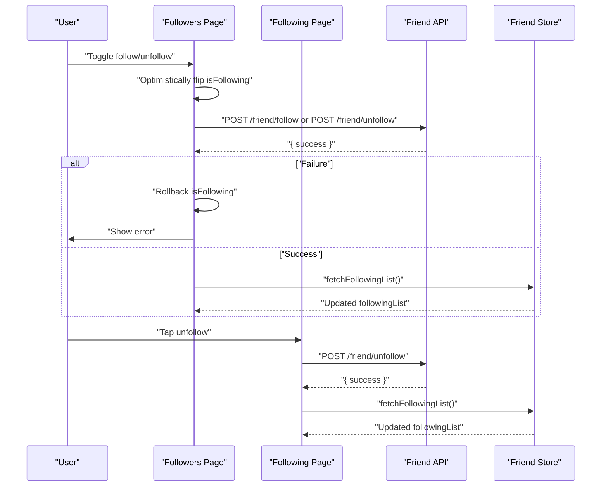

**Diagram sources**
- [followers.vue:81-117](file://src/pages/friend/followers.vue#L81-L117)
- [following.vue:75-99](file://src/pages/friend/following.vue#L75-L99)
- [friend.ts:32-36](file://src/api/modules/friend.ts#L32-L36)

**Section sources**
- [followers.vue:1-178](file://src/pages/friend/followers.vue#L1-L178)
- [following.vue:1-160](file://src/pages/friend/following.vue#L1-L160)

### Blacklist Management
The blacklist page lists blocked users with reasons and timestamps, supports unblocking, and refreshes both UI and store state.

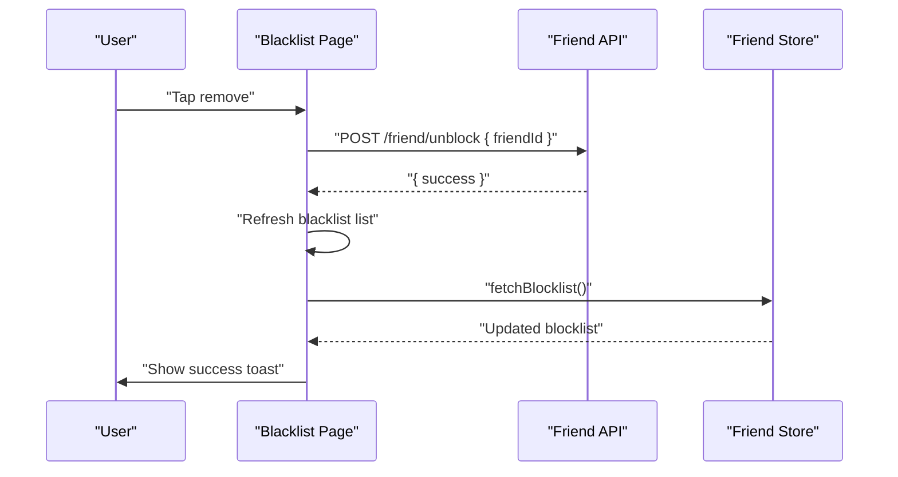

**Diagram sources**
- [blacklist.vue:69-103](file://src/pages/friend/blacklist.vue#L69-L103)
- [friend.ts:56-60](file://src/api/modules/friend.ts#L56-L60)

**Section sources**
- [blacklist.vue:1-261](file://src/pages/friend/blacklist.vue#L1-L261)

### Privacy Controls and Blocking
Privacy settings allow controlling who can see personal info, whether strangers can message, and whether to accept only certified users. The privacy page also lists and removes users from the blacklist.

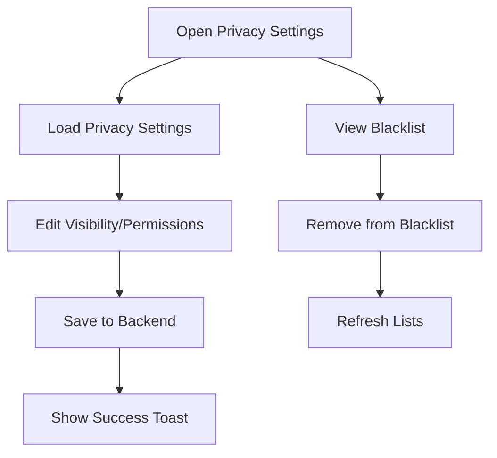

**Diagram sources**
- [privacy.vue:280-312](file://src/pages/profile/privacy.vue#L280-L312)
- [privacy.vue:250-277](file://src/pages/profile/privacy.vue#L250-L277)

**Section sources**
- [privacy.vue:1-494](file://src/pages/profile/privacy.vue#L1-L494)

### Social Graph Management and Relationship Types
Relationships are modeled as Friendship with fields for status, mutual indicator, chat metrics, and timestamps. Blocking is modeled as UserBlacklist with reason and creation time.

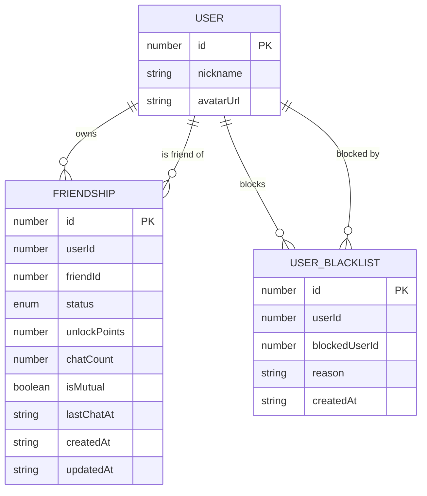

**Diagram sources**
- [backend-types.ts:292-339](file://src/types/api/backend-types.ts#L292-L339)

**Section sources**
- [backend-types.ts:292-339](file://src/types/api/backend-types.ts#L292-L339)

### Social Discovery: Nearby People
The nearby people feature enables geo-based discovery, filtering by distance/gender/sort order, and sending “hello” interactions. It integrates with privacy settings and can be extended to suggest friends based on proximity and mutual interests.

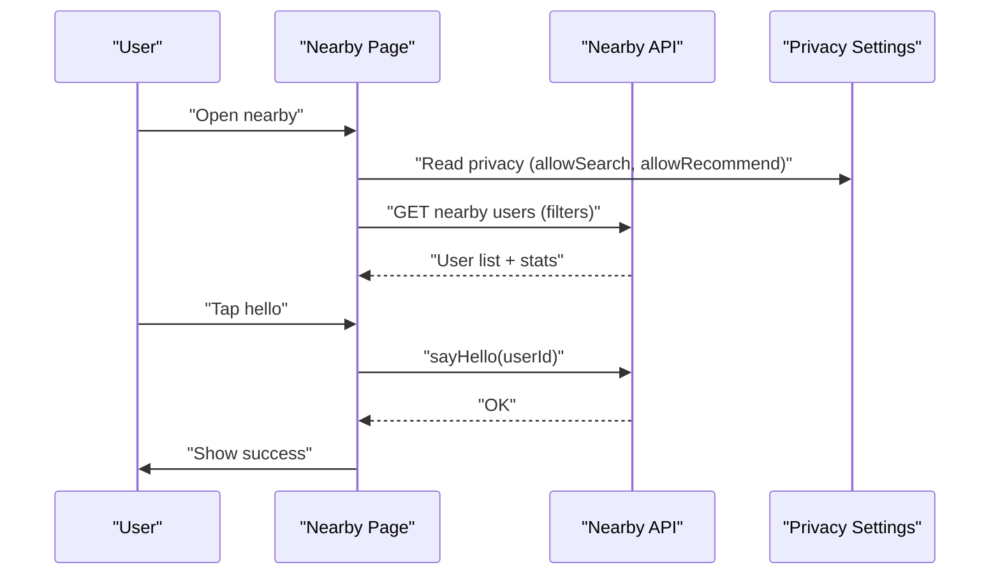

**Diagram sources**
- [index.vue:236-441](file://src/pages/nearby/index.vue#L236-L441)
- [privacy.vue:168-173](file://src/pages/profile/privacy.vue#L168-L173)

**Section sources**
- [index.vue:1-762](file://src/pages/nearby/index.vue#L1-L762)
- [privacy.vue:157-173](file://src/pages/profile/privacy.vue#L157-L173)
- [nearby-people-development.md:1-800](file://docs/refactry/nearby-people-development.md#L1-L800)

### Cross-Page Follow State Synchronization
A composable listens to follow events and updates isFollowed flags in lists, enabling consistent UI across pages.

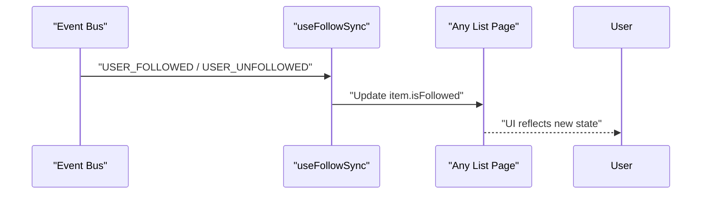

**Diagram sources**
- [useFollowSync.ts:22-45](file://src/composables/useFollowSync.ts#L22-L45)

**Section sources**
- [useFollowSync.ts:1-57](file://src/composables/useFollowSync.ts#L1-L57)

## Dependency Analysis
- UI components depend on the friend store for state and on the friend API for data fetching.
- The friend store depends on the friend API and emits analytics triggers.
- Privacy settings influence discovery and messaging behavior.
- Nearby people interacts with privacy settings and can be extended to suggest friends.

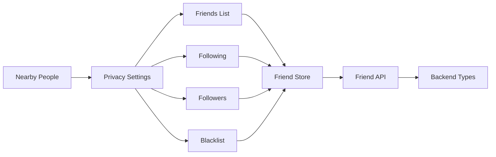

**Diagram sources**
- [friend.ts:1-70](file://src/stores/friend.ts#L1-L70)
- [friend.ts:1-61](file://src/api/modules/friend.ts#L1-L61)
- [backend-types.ts:292-339](file://src/types/api/backend-types.ts#L292-L339)
- [privacy.vue:1-494](file://src/pages/profile/privacy.vue#L1-L494)
- [index.vue:1-762](file://src/pages/nearby/index.vue#L1-L762)

**Section sources**
- [friend.ts:1-70](file://src/stores/friend.ts#L1-L70)
- [friend.ts:1-61](file://src/api/modules/friend.ts#L1-L61)
- [backend-types.ts:292-339](file://src/types/api/backend-types.ts#L292-L339)
- [privacy.vue:1-494](file://src/pages/profile/privacy.vue#L1-L494)
- [index.vue:1-762](file://src/pages/nearby/index.vue#L1-L762)

## Performance Considerations
- Prefer optimistic UI updates for follow/unfollow to reduce perceived latency.
- Use parallel loading for statistics and lists when re-filtering.
- Debounce or throttle frequent operations like scrolling and filtering.
- Cache frequently accessed lists locally with appropriate TTLs.
- Lazy-load avatars and use placeholders to improve rendering performance.

## Troubleshooting Guide
Common issues and resolutions:
- Follow/Unfollow fails: Rollback local state and notify user; verify network connectivity.
- Chat navigation blocked: Check friendship status and unlock conditions; prompt user to follow or meet requirements.
- Blacklist removal fails: Confirm backend response and retry; refresh blocklist after success.
- Privacy settings not applied: Ensure settings are saved server-side and reloaded on change.
- Nearby people empty: Verify location permissions and fallback coordinates; adjust filters.

**Section sources**
- [followers.vue:109-116](file://src/pages/friend/followers.vue#L109-L116)
- [list.vue:63-98](file://src/pages/friend/list.vue#L63-L98)
- [blacklist.vue:92-99](file://src/pages/friend/blacklist.vue#L92-L99)
- [privacy.vue:231-248](file://src/pages/profile/privacy.vue#L231-L248)
- [index.vue:250-281](file://src/pages/nearby/index.vue#L250-L281)

## Conclusion
WeTogether’s social networking subsystem provides a robust foundation for friend management, social graph operations, privacy controls, and discovery. The layered design ensures clear separation of concerns, while typed APIs and stores enable predictable state management. Extending the system with friend suggestions, mutual connections, and analytics-ready metrics is straightforward given the existing data models and UI patterns.

## Appendices

### API Endpoints Summary
- GET /friend/list
- GET /friend/following
- GET /friend/following/:userId
- GET /friend/followers
- GET /friend/followers/:userId
- POST /friend/follow
- POST /friend/unfollow
- POST /friend/request
- POST /friend/accept
- POST /friend/add-friend
- GET /friend/status/:userId
- DELETE /friend/:userId
- POST /friend/block
- POST /friend/unblock
- GET /friend/blocklist

**Section sources**
- [friend.ts:16-61](file://src/api/modules/friend.ts#L16-L61)

### Data Models Summary
- Friendship: relationship record with status, mutual flag, chat metrics, and user references
- UserBlacklist: blocked user record with reason and timestamps
- FriendshipStatus: per-user relationship state and unlock conditions

**Section sources**
- [backend-types.ts:292-339](file://src/types/api/backend-types.ts#L292-L339)

### Examples and Patterns
- Friend suggestions: Combine nearby people with shared tags or interests; surface mutual connections from Friendship records.
- Mutual connections: Compute intersection of friend lists for two users via Friendship queries.
- Social discovery: Use NearbyPeople filters and privacy settings to limit exposure; implement greeting interactions to seed connections.
- Analytics-ready patterns: Track follow/unfollow, chat unlocks, and blacklist actions; expose counters for insights.

[No sources needed since this section provides general guidance]