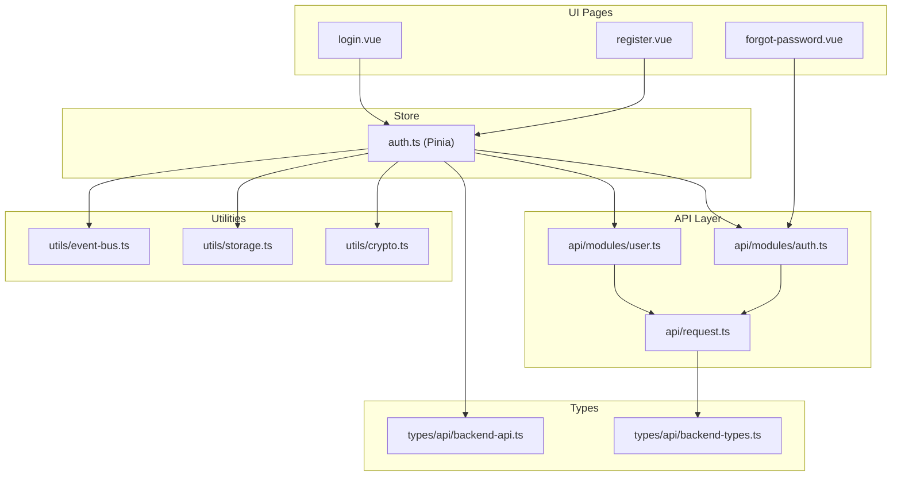
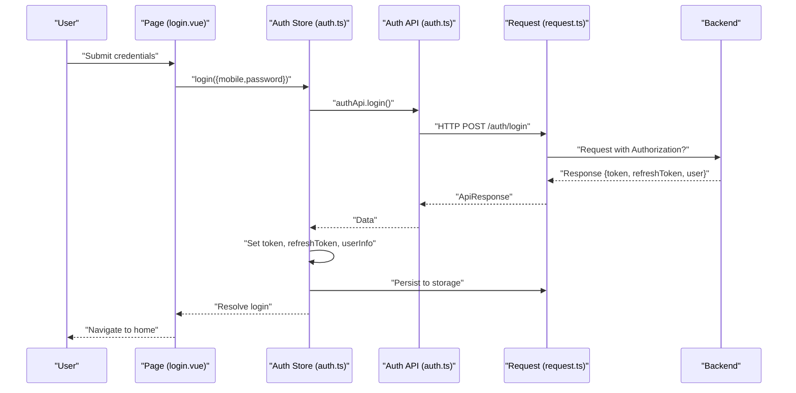
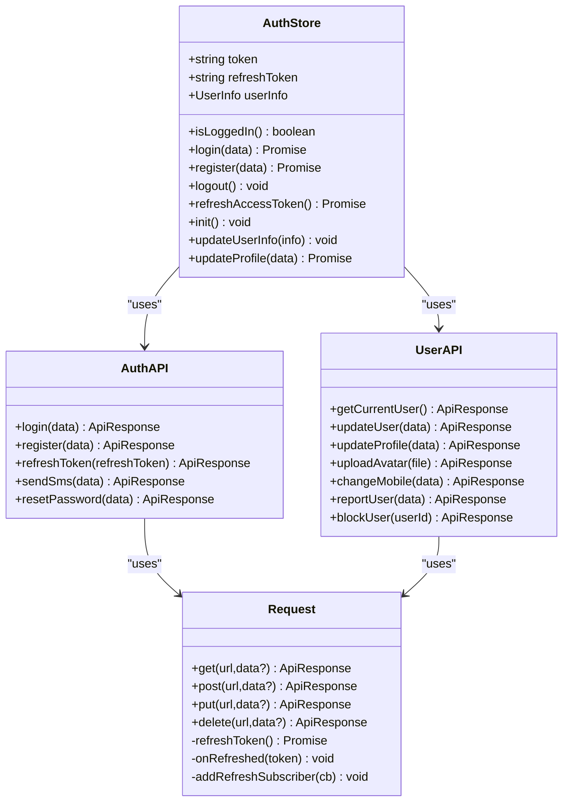
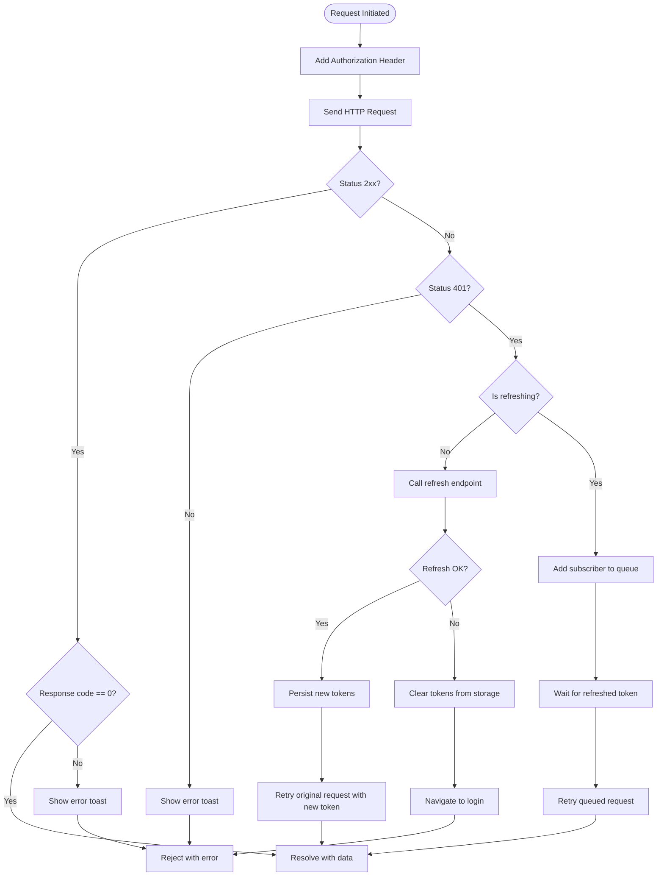
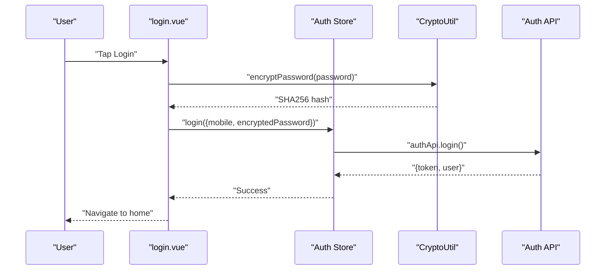
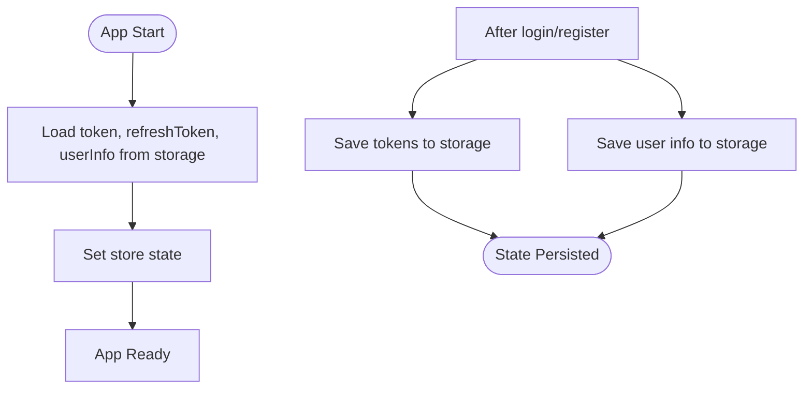
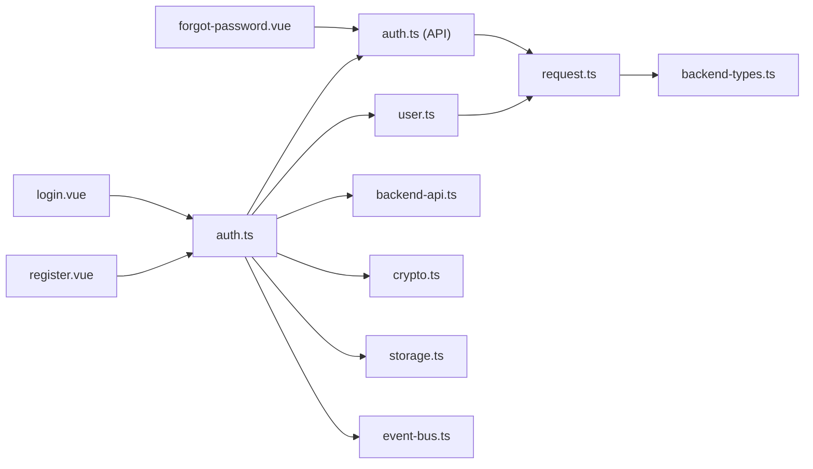

# Authentication Store

<cite>
**Referenced Files in This Document**
- [auth.ts](file://src/stores/auth.ts)
- [auth.ts](file://src/api/modules/auth.ts)
- [user.ts](file://src/api/modules/user.ts)
- [request.ts](file://src/api/request.ts)
- [login.vue](file://src/pages/auth/login.vue)
- [register.vue](file://src/pages/auth/register.vue)
- [forgot-password.vue](file://src/pages/auth/forgot-password.vue)
- [storage.ts](file://src/utils/storage.ts)
- [crypto.ts](file://src/utils/crypto.ts)
- [event-bus.ts](file://src/utils/event-bus.ts)
- [backend-types.ts](file://src/types/api/backend-types.ts)
- [backend-api.ts](file://src/types/api/backend-api.ts)
- [main.ts](file://src/main.ts)
</cite>

## Table of Contents
1. [Introduction](#introduction)
2. [Project Structure](#project-structure)
3. [Core Components](#core-components)
4. [Architecture Overview](#architecture-overview)
5. [Detailed Component Analysis](#detailed-component-analysis)
6. [Dependency Analysis](#dependency-analysis)
7. [Performance Considerations](#performance-considerations)
8. [Troubleshooting Guide](#troubleshooting-guide)
9. [Conclusion](#conclusion)

## Introduction
This document provides comprehensive documentation for the authentication store implementation in a Vue.js + UniApp project. It explains the user authentication state model (login status, user profile data, and session management), authentication actions (login, logout, registration, and token refresh), state persistence strategy, and security considerations. It also covers error handling patterns, loading states, authentication flow management, and practical examples for guards, route protection, and state synchronization.

## Project Structure
The authentication system spans several layers:
- Pinia store for state management and persistence
- API modules for authentication and user operations
- Request wrapper for HTTP communication and automatic token refresh
- UI pages for login, registration, and password reset
- Utilities for encryption, storage, and global events
- Type definitions for backend contracts

**Diagram sources**
- [auth.ts:1-137](file://src/stores/auth.ts#L1-L137)
- [auth.ts:1-57](file://src/api/modules/auth.ts#L1-L57)
- [user.ts:1-97](file://src/api/modules/user.ts#L1-L97)
- [request.ts:1-228](file://src/api/request.ts#L1-L228)
- [login.vue:1-227](file://src/pages/auth/login.vue#L1-L227)
- [register.vue:1-501](file://src/pages/auth/register.vue#L1-L501)
- [forgot-password.vue:1-440](file://src/pages/auth/forgot-password.vue#L1-L440)
- [crypto.ts:1-18](file://src/utils/crypto.ts#L1-L18)
- [storage.ts:1-26](file://src/utils/storage.ts#L1-L26)
- [event-bus.ts:1-49](file://src/utils/event-bus.ts#L1-L49)
- [backend-types.ts:1-764](file://src/types/api/backend-types.ts#L1-L764)
- [backend-api.ts:1-641](file://src/types/api/backend-api.ts#L1-L641)

**Section sources**
- [auth.ts:1-137](file://src/stores/auth.ts#L1-L137)
- [auth.ts:1-57](file://src/api/modules/auth.ts#L1-L57)
- [user.ts:1-97](file://src/api/modules/user.ts#L1-L97)
- [request.ts:1-228](file://src/api/request.ts#L1-L228)
- [login.vue:1-227](file://src/pages/auth/login.vue#L1-L227)
- [register.vue:1-501](file://src/pages/auth/register.vue#L1-L501)
- [forgot-password.vue:1-440](file://src/pages/auth/forgot-password.vue#L1-L440)
- [crypto.ts:1-18](file://src/utils/crypto.ts#L1-L18)
- [storage.ts:1-26](file://src/utils/storage.ts#L1-L26)
- [event-bus.ts:1-49](file://src/utils/event-bus.ts#L1-L49)
- [backend-types.ts:1-764](file://src/types/api/backend-types.ts#L1-L764)
- [backend-api.ts:1-641](file://src/types/api/backend-api.ts#L1-L641)

## Core Components
- Authentication store (Pinia):
  - State: token, refreshToken, userInfo
  - Computed: isLoggedIn
  - Actions: login, register, logout, refreshAccessToken, init, updateUserInfo, updateProfile
  - Persistence: enabled via Pinia plugin persisted state
- API modules:
  - authApi: login, register, refreshToken, sendSms, resetPassword
  - userApi: updateProfile, getCurrentUser, uploadAvatar, changeMobile, reportUser, blockUser
- Request wrapper:
  - Automatic Authorization header injection
  - Token refresh on 401 Unauthorized
  - Queue pending requests during refresh
- UI pages:
  - login.vue, register.vue, forgot-password.vue
- Utilities:
  - CryptoUtil for password hashing
  - storage utility for JSON-safe storage
  - event bus for avatar updates

**Section sources**
- [auth.ts:1-137](file://src/stores/auth.ts#L1-L137)
- [auth.ts:1-57](file://src/api/modules/auth.ts#L1-L57)
- [user.ts:1-97](file://src/api/modules/user.ts#L1-L97)
- [request.ts:1-228](file://src/api/request.ts#L1-L228)
- [login.vue:1-227](file://src/pages/auth/login.vue#L1-L227)
- [register.vue:1-501](file://src/pages/auth/register.vue#L1-L501)
- [forgot-password.vue:1-440](file://src/pages/auth/forgot-password.vue#L1-L440)
- [crypto.ts:1-18](file://src/utils/crypto.ts#L1-L18)
- [storage.ts:1-26](file://src/utils/storage.ts#L1-L26)
- [event-bus.ts:1-49](file://src/utils/event-bus.ts#L1-L49)

## Architecture Overview
The authentication flow integrates UI pages, the Pinia store, API modules, and a shared request client. The request client handles token refresh automatically and retries failed requests. The store persists tokens and user info locally and synchronizes avatar updates globally.

**Diagram sources**
- [login.vue:68-103](file://src/pages/auth/login.vue#L68-L103)
- [auth.ts:18-29](file://src/stores/auth.ts#L18-L29)
- [auth.ts:40-41](file://src/api/modules/auth.ts#L40-L41)
- [request.ts:75-208](file://src/api/request.ts#L75-L208)

## Detailed Component Analysis

### Authentication Store (Pinia)
The store encapsulates authentication state and actions:
- State
  - token: current access token
  - refreshToken: refresh token for renewal
  - userInfo: logged-in user profile
- Computed
  - isLoggedIn: derived from token presence
- Actions
  - login(data): posts credentials, sets tokens and user, persists to storage
  - register(data): similar to login but via registration endpoint
  - logout(): clears tokens and user, removes from storage
  - refreshAccessToken(): calls refresh endpoint, updates tokens, persists
  - init(): hydrates state from storage on app start
  - updateUserInfo(info): updates local user info and emits avatar update event
  - updateProfile(data): updates profile via user API, merges changes, persists, emits avatar update event

**Diagram sources**
- [auth.ts:1-137](file://src/stores/auth.ts#L1-L137)
- [auth.ts:33-56](file://src/api/modules/auth.ts#L33-L56)
- [user.ts:23-96](file://src/api/modules/user.ts#L23-L96)
- [request.ts:4-228](file://src/api/request.ts#L4-L228)

**Section sources**
- [auth.ts:1-137](file://src/stores/auth.ts#L1-L137)

### API Modules
- authApi
  - Endpoints: /auth/login, /auth/register, /auth/refresh, /auth/sms/send, /auth/reset-password
  - Returns typed ApiResponse with token, refreshToken, and user
- userApi
  - Endpoints: /user/me, /user/profile, /user/avatar, /user/mobile, /user/report, /user/block/{userId}
  - Supports profile updates, avatar upload, mobile change, reporting, and blocking

**Section sources**
- [auth.ts:33-56](file://src/api/modules/auth.ts#L33-L56)
- [user.ts:23-96](file://src/api/modules/user.ts#L23-L96)
- [backend-api.ts:326-373](file://src/types/api/backend-api.ts#L326-L373)
- [backend-api.ts:378-390](file://src/types/api/backend-api.ts#L378-L390)

### Request Wrapper and Token Refresh
The request client:
- Injects Authorization header when token exists
- On 401 Unauthorized:
  - Prevents concurrent refresh attempts
  - Queues pending requests
  - Calls refresh endpoint using stored refreshToken
  - Replaces token and retries queued requests
  - Clears storage and navigates to login on refresh failure

**Diagram sources**
- [request.ts:75-208](file://src/api/request.ts#L75-L208)

**Section sources**
- [request.ts:1-228](file://src/api/request.ts#L1-L228)

### UI Pages and Authentication Actions
- login.vue
  - Validates form fields
  - Encrypts password using CryptoUtil
  - Calls authStore.login and navigates on success
  - Shows toasts for errors and loading states
- register.vue
  - Sends SMS verification, validates inputs
  - Encrypts password and calls authStore.register
  - Navigates to home after successful registration
- forgot-password.vue
  - Sends SMS verification, validates inputs
  - Encrypts new password and calls authApi.resetPassword
  - Navigates to login after success

**Diagram sources**
- [login.vue:68-103](file://src/pages/auth/login.vue#L68-L103)
- [crypto.ts:14-16](file://src/utils/crypto.ts#L14-L16)
- [auth.ts:40-41](file://src/api/modules/auth.ts#L40-L41)

**Section sources**
- [login.vue:68-103](file://src/pages/auth/login.vue#L68-L103)
- [register.vue:235-302](file://src/pages/auth/register.vue#L235-L302)
- [forgot-password.vue:203-299](file://src/pages/auth/forgot-password.vue#L203-L299)
- [crypto.ts:1-18](file://src/utils/crypto.ts#L1-L18)

### State Persistence and Hydration
- Pinia persistence:
  - Enabled via piniaPluginPersistedstate in main.ts
  - Persists auth store state across app restarts
- Local storage:
  - Tokens and user info are persisted via uni.setStorageSync
  - Hydrated on app init via authStore.init()

**Diagram sources**
- [main.ts:3-10](file://src/main.ts#L3-L10)
- [auth.ts:73-77](file://src/stores/auth.ts#L73-L77)
- [auth.ts:24-26](file://src/stores/auth.ts#L24-L26)
- [auth.ts:37-39](file://src/stores/auth.ts#L37-L39)

**Section sources**
- [main.ts:1-18](file://src/main.ts#L1-L18)
- [auth.ts:73-77](file://src/stores/auth.ts#L73-L77)
- [auth.ts:133-136](file://src/stores/auth.ts#L133-L136)

### Security Considerations
- Password hashing:
  - Frontend SHA256 hashing before transmission
  - Backend PBKDF2 secondary hashing for secure storage
- Token handling:
  - Access token stored in memory and persistent storage
  - Refresh token used for renewal; may be rotated by backend
- Request security:
  - Authorization header injected only when token exists
  - Automatic refresh on 401 prevents manual token management
- UI safeguards:
  - Form validation and masking for sensitive fields
  - Toast notifications for errors and loading states

**Section sources**
- [crypto.ts:8-16](file://src/utils/crypto.ts#L8-L16)
- [request.ts:15-24](file://src/api/request.ts#L15-L24)
- [request.ts:100-147](file://src/api/request.ts#L100-L147)
- [login.vue:68-103](file://src/pages/auth/login.vue#L68-L103)
- [register.vue:235-302](file://src/pages/auth/register.vue#L235-L302)
- [forgot-password.vue:203-299](file://src/pages/auth/forgot-password.vue#L203-L299)

### Error Handling Patterns and Loading States
- UI pages manage loading flags and show toasts for errors
- Request wrapper centralizes error handling and user feedback
- Token refresh failures trigger logout and navigation to login

**Section sources**
- [login.vue:68-103](file://src/pages/auth/login.vue#L68-L103)
- [register.vue:235-302](file://src/pages/auth/register.vue#L235-L302)
- [forgot-password.vue:203-299](file://src/pages/auth/forgot-password.vue#L203-L299)
- [request.ts:94-147](file://src/api/request.ts#L94-L147)

### Authentication Guards and Route Protection
- Recommended guard pattern:
  - Before navigating to protected routes, check authStore.isLoggedIn
  - If false, redirect to login and optionally store intended route
  - After successful login, navigate to stored route or default home
- Implementation approach:
  - Use router beforeEach hooks to enforce guard logic
  - Leverage authStore.init() on app start to restore session state

[No sources needed since this section provides conceptual guidance]

### State Synchronization Examples
- Avatar updates:
  - updateUserInfo and updateProfile emit AVATAR_UPDATED event
  - Components listen to event to refresh avatar display
- Global state:
  - Pinia persistence ensures state survives app restarts
  - Local storage mirrors store state for immediate hydration

**Section sources**
- [auth.ts:79-88](file://src/stores/auth.ts#L79-L88)
- [auth.ts:95-117](file://src/stores/auth.ts#L95-L117)
- [event-bus.ts:41-48](file://src/utils/event-bus.ts#L41-L48)

## Dependency Analysis
The authentication subsystem exhibits clear separation of concerns:
- UI pages depend on the auth store
- Auth store depends on API modules
- API modules depend on the request wrapper
- Request wrapper depends on backend types and environment configuration
- Utilities (crypto, storage, event-bus) support store and API layers

**Diagram sources**
- [login.vue:55-58](file://src/pages/auth/login.vue#L55-L58)
- [register.vue:149-153](file://src/pages/auth/register.vue#L149-L153)
- [forgot-password.vue:125-126](file://src/pages/auth/forgot-password.vue#L125-L126)
- [auth.ts:1-137](file://src/stores/auth.ts#L1-L137)
- [auth.ts:1-57](file://src/api/modules/auth.ts#L1-L57)
- [user.ts:1-97](file://src/api/modules/user.ts#L1-L97)
- [request.ts:1-228](file://src/api/request.ts#L1-L228)
- [backend-types.ts:1-764](file://src/types/api/backend-types.ts#L1-L764)
- [backend-api.ts:1-641](file://src/types/api/backend-api.ts#L1-L641)
- [crypto.ts:1-18](file://src/utils/crypto.ts#L1-L18)
- [storage.ts:1-26](file://src/utils/storage.ts#L1-L26)
- [event-bus.ts:1-49](file://src/utils/event-bus.ts#L1-L49)

**Section sources**
- [auth.ts:1-137](file://src/stores/auth.ts#L1-L137)
- [auth.ts:1-57](file://src/api/modules/auth.ts#L1-L57)
- [user.ts:1-97](file://src/api/modules/user.ts#L1-L97)
- [request.ts:1-228](file://src/api/request.ts#L1-L228)
- [backend-types.ts:1-764](file://src/types/api/backend-types.ts#L1-L764)
- [backend-api.ts:1-641](file://src/types/api/backend-api.ts#L1-L641)
- [crypto.ts:1-18](file://src/utils/crypto.ts#L1-L18)
- [storage.ts:1-26](file://src/utils/storage.ts#L1-L26)
- [event-bus.ts:1-49](file://src/utils/event-bus.ts#L1-L49)

## Performance Considerations
- Minimize redundant network calls by checking authStore.isLoggedIn before navigation
- Debounce or throttle repeated login/register attempts
- Persist only essential data to reduce storage overhead
- Avoid heavy computations in watchers; rely on computed properties and store actions

[No sources needed since this section provides general guidance]

## Troubleshooting Guide
Common issues and resolutions:
- Login fails with 401:
  - Verify credentials and network connectivity
  - Check if refreshToken is present; if not, re-authenticate
- Token refresh fails:
  - Ensure refreshToken is valid and not revoked
  - Confirm backend endpoint availability
  - Review console logs for detailed error messages
- Avatar not updating:
  - Confirm updateUserInfo/updateProfile is called
  - Verify AVATAR_UPDATED event listeners are registered
- Session not restored:
  - Confirm piniaPluginPersistedstate is initialized
  - Verify uni storage keys exist and are readable

**Section sources**
- [request.ts:100-147](file://src/api/request.ts#L100-L147)
- [auth.ts:67-71](file://src/stores/auth.ts#L67-L71)
- [event-bus.ts:26-31](file://src/utils/event-bus.ts#L26-L31)
- [main.ts:3-10](file://src/main.ts#L3-L10)

## Conclusion
The authentication store provides a robust, modular foundation for managing user sessions, tokens, and profile data. Its integration with API modules, request wrapper, and UI pages ensures consistent behavior, automatic token refresh, and reliable state persistence. By following the recommended guard patterns, error handling strategies, and security practices outlined here, developers can build secure and maintainable authentication flows tailored to the application’s needs.