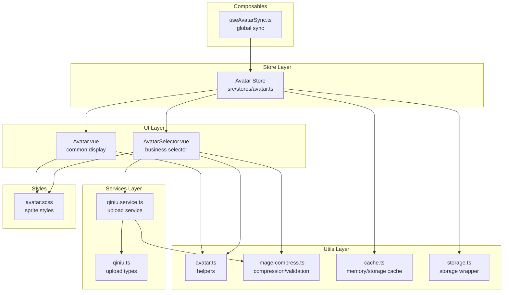
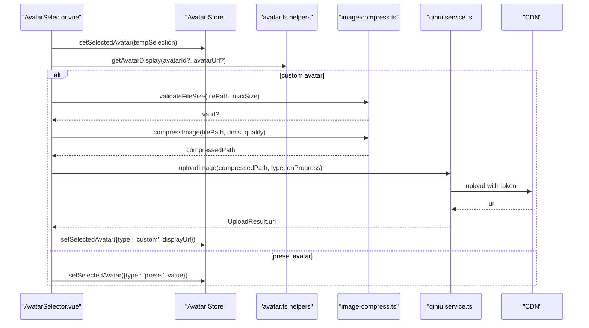
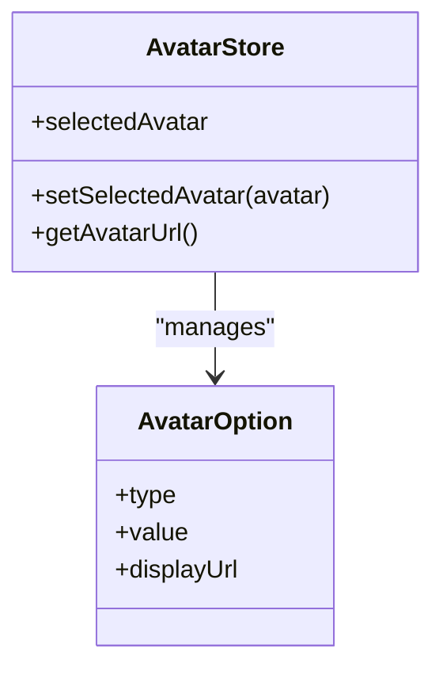
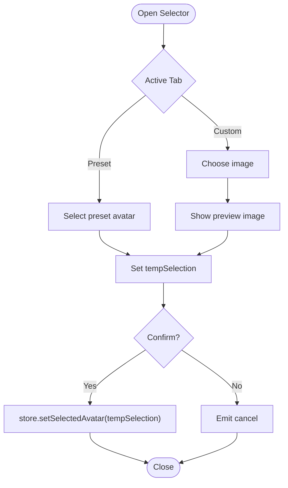
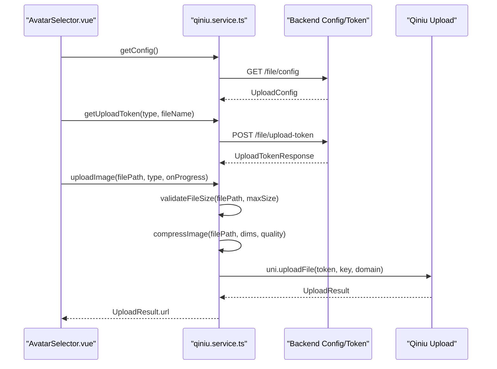
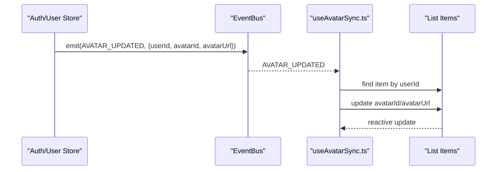
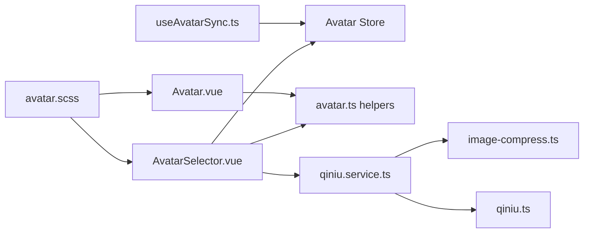

# Avatar Store

<cite>
**Referenced Files in This Document**
- [avatar.ts](file://src/stores/avatar.ts)
- [AvatarSelector.vue](file://src/components/business/AvatarSelector.vue)
- [Avatar.vue](file://src/components/common/Avatar.vue)
- [avatar.ts](file://src/utils/avatar.ts)
- [useAvatarSync.ts](file://src/composables/useAvatarSync.ts)
- [avatar.ts](file://src/types/avatar.ts)
- [qiniu.service.ts](file://src/services/qiniu.service.ts)
- [image-compress.ts](file://src/utils/image-compress.ts)
- [avatar.scss](file://src/assets/styles/avatar.scss)
- [cache.ts](file://src/utils/cache.ts)
- [storage.ts](file://src/utils/storage.ts)
- [AVATAR_PLAN.md](file://docs/AVATAR_PLAN.md)
- [avatar-sync-solution.md](file://docs/fix-deploy/avatar-sync-solution.md)
- [qiniu.ts](file://src/types/qiniu.ts)
</cite>

## Table of Contents
1. [Introduction](#introduction)
2. [Project Structure](#project-structure)
3. [Core Components](#core-components)
4. [Architecture Overview](#architecture-overview)
5. [Detailed Component Analysis](#detailed-component-analysis)
6. [Dependency Analysis](#dependency-analysis)
7. [Performance Considerations](#performance-considerations)
8. [Troubleshooting Guide](#troubleshooting-guide)
9. [Conclusion](#conclusion)

## Introduction
This document describes the avatar management store and related systems in the frontend. It covers:
- Avatar selection state and persistence
- Upload progress tracking and CDN integration
- Avatar synchronization across devices and lists
- Actions for avatar upload, selection, and preview
- Validation, size constraints, and format requirements
- Caching strategies, CDN integration, and fallback mechanisms
- Integration with media services, moderation workflows, and user preference storage
- Performance optimization and storage efficiency considerations

## Project Structure
The avatar feature spans several modules:
- Store: manages current avatar selection and persistence
- Components: selection UI and display UI
- Utilities: avatar helpers, compression/validation, caching, and storage
- Services: cloud upload integration (Qiniu)
- Styles: sprite-based avatar rendering
- Composables: global avatar sync across lists

**Diagram sources**
- [avatar.ts:1-52](file://src/stores/avatar.ts#L1-L52)
- [AvatarSelector.vue:1-286](file://src/components/business/AvatarSelector.vue#L1-L286)
- [Avatar.vue:1-95](file://src/components/common/Avatar.vue#L1-L95)
- [avatar.ts:1-93](file://src/utils/avatar.ts#L1-L93)
- [image-compress.ts:1-87](file://src/utils/image-compress.ts#L1-L87)
- [cache.ts:1-359](file://src/utils/cache.ts#L1-L359)
- [storage.ts:1-26](file://src/utils/storage.ts#L1-L26)
- [qiniu.service.ts:1-126](file://src/services/qiniu.service.ts#L1-L126)
- [qiniu.ts:1-38](file://src/types/qiniu.ts#L1-L38)
- [avatar.scss:1-753](file://src/assets/styles/avatar.scss#L1-L753)
- [useAvatarSync.ts:1-72](file://src/composables/useAvatarSync.ts#L1-L72)

**Section sources**
- [avatar.ts:1-52](file://src/stores/avatar.ts#L1-L52)
- [AvatarSelector.vue:1-286](file://src/components/business/AvatarSelector.vue#L1-L286)
- [Avatar.vue:1-95](file://src/components/common/Avatar.vue#L1-L95)
- [avatar.ts:1-93](file://src/utils/avatar.ts#L1-L93)
- [image-compress.ts:1-87](file://src/utils/image-compress.ts#L1-L87)
- [cache.ts:1-359](file://src/utils/cache.ts#L1-L359)
- [storage.ts:1-26](file://src/utils/storage.ts#L1-L26)
- [qiniu.service.ts:1-126](file://src/services/qiniu.service.ts#L1-L126)
- [qiniu.ts:1-38](file://src/types/qiniu.ts#L1-L38)
- [avatar.scss:1-753](file://src/assets/styles/avatar.scss#L1-L753)
- [useAvatarSync.ts:1-72](file://src/composables/useAvatarSync.ts#L1-L72)

## Core Components
- Avatar Store: holds the currently selected avatar and exposes selection and display helpers. It persists state across sessions.
- Avatar Selector: allows choosing a preset sprite avatar or uploading a custom image with preview.
- Avatar Display: renders either a sprite-based avatar or a custom uploaded image.
- Helpers: compute display metadata for presets vs. custom avatars.
- Upload Service: integrates with a CDN provider to upload images with token-based auth and progress callbacks.
- Compression/Validation: validates file size and compresses images before upload.
- Caching/Storage: provides memory and persistent caches plus a storage wrapper.
- Global Sync: listens for avatar updates and synchronizes avatar fields across lists.

**Section sources**
- [avatar.ts:1-52](file://src/stores/avatar.ts#L1-L52)
- [AvatarSelector.vue:1-286](file://src/components/business/AvatarSelector.vue#L1-L286)
- [Avatar.vue:1-95](file://src/components/common/Avatar.vue#L1-L95)
- [avatar.ts:1-93](file://src/utils/avatar.ts#L1-L93)
- [qiniu.service.ts:1-126](file://src/services/qiniu.service.ts#L1-L126)
- [image-compress.ts:1-87](file://src/utils/image-compress.ts#L1-L87)
- [cache.ts:1-359](file://src/utils/cache.ts#L1-L359)
- [storage.ts:1-26](file://src/utils/storage.ts#L1-L26)
- [useAvatarSync.ts:1-72](file://src/composables/useAvatarSync.ts#L1-L72)

## Architecture Overview
The avatar lifecycle:
- Selection: user picks a preset or uploads a custom image via the selector.
- Preview: local preview is shown immediately.
- Upload (optional): if custom, the image is validated/compressed and uploaded to CDN.
- Persistence: store updates with the resolved display URL.
- Synchronization: global event triggers updates across lists.

**Diagram sources**
- [AvatarSelector.vue:98-144](file://src/components/business/AvatarSelector.vue#L98-L144)
- [avatar.ts:53-92](file://src/utils/avatar.ts#L53-L92)
- [image-compress.ts:80-86](file://src/utils/image-compress.ts#L80-L86)
- [image-compress.ts:10-49](file://src/utils/image-compress.ts#L10-L49)
- [qiniu.service.ts:42-87](file://src/services/qiniu.service.ts#L42-L87)
- [avatar.ts:26-28](file://src/stores/avatar.ts#L26-L28)

## Detailed Component Analysis

### Avatar Store
Responsibilities:
- Track the currently selected avatar (preset or custom)
- Expose a method to compute the display identifier (CSS class for sprites, URL for custom)
- Persist selection across sessions

Key behaviors:
- Default selection is a preset avatar
- getAvatarUrl returns a CSS class for preset avatars and the full URL for custom ones
- Store is configured to persist state

**Diagram sources**
- [avatar.ts:9-51](file://src/stores/avatar.ts#L9-L51)
- [avatar.ts:9-16](file://src/types/avatar.ts#L9-L16)

**Section sources**
- [avatar.ts:1-52](file://src/stores/avatar.ts#L1-L52)
- [avatar.ts:1-34](file://src/types/avatar.ts#L1-L34)

### Avatar Selector
Responsibilities:
- Present preset avatars in a grid
- Allow custom image selection with preview
- Emit confirm/cancel events
- Save selection to the store on confirm

Preview and selection flow:
- Preset: clicking an item sets a temporary selection
- Custom: chooseImage opens the device picker, previews the image, and sets a temporary selection

**Diagram sources**
- [AvatarSelector.vue:74-152](file://src/components/business/AvatarSelector.vue#L74-L152)
- [avatar.ts:26-28](file://src/stores/avatar.ts#L26-L28)

**Section sources**
- [AvatarSelector.vue:1-286](file://src/components/business/AvatarSelector.vue#L1-L286)
- [avatar.ts:1-52](file://src/stores/avatar.ts#L1-L52)

### Avatar Display
Responsibilities:
- Render either a sprite-based avatar or a custom image
- Support multiple sizes
- Emit click events

Rendering logic:
- Uses helper to compute display metadata
- For preset avatars, renders a sprite container
- For custom avatars, renders an image with aspect-fill

**Section sources**
- [Avatar.vue:1-95](file://src/components/common/Avatar.vue#L1-L95)
- [avatar.ts:53-92](file://src/utils/avatar.ts#L53-L92)
- [avatar.scss:1-753](file://src/assets/styles/avatar.scss#L1-L753)

### Helpers: Avatar Display Resolution
Responsibilities:
- Resolve display metadata for avatar rendering
- Fallback to a default static asset when no avatar is provided

Behavior:
- Prefer custom avatar URL if present
- Otherwise map a numeric ID to a sprite class
- Default to a static default avatar

**Section sources**
- [avatar.ts:53-92](file://src/utils/avatar.ts#L53-L92)

### Upload Service and Media Integration
Responsibilities:
- Fetch upload configuration and tokens
- Validate file size and compress images
- Upload to CDN and record file metadata

Upload flow:
- Get upload config
- Validate file size
- Compress image to target dimensions and quality
- Request upload token
- Perform upload with token and key
- On success, return CDN URL

**Diagram sources**
- [qiniu.service.ts:15-87](file://src/services/qiniu.service.ts#L15-L87)
- [image-compress.ts:80-86](file://src/utils/image-compress.ts#L80-L86)
- [image-compress.ts:10-49](file://src/utils/image-compress.ts#L10-L49)
- [qiniu.ts:1-38](file://src/types/qiniu.ts#L1-L38)

**Section sources**
- [qiniu.service.ts:1-126](file://src/services/qiniu.service.ts#L1-L126)
- [image-compress.ts:1-87](file://src/utils/image-compress.ts#L1-L87)
- [qiniu.ts:1-38](file://src/types/qiniu.ts#L1-L38)

### Validation, Size Constraints, and Format Requirements
- File size validation: compares actual file size against configured max size
- Compression: scales down to configured max dimensions and applies quality
- Allowed types: configured in upload config (service-side enforcement recommended)

Constraints:
- Max size enforced before upload
- Max dimensions enforced during compression
- Quality factor applied during compression

**Section sources**
- [image-compress.ts:80-86](file://src/utils/image-compress.ts#L80-L86)
- [image-compress.ts:10-49](file://src/utils/image-compress.ts#L10-L49)
- [qiniu.service.ts:42-58](file://src/services/qiniu.service.ts#L42-L58)
- [qiniu.ts:15-25](file://src/types/qiniu.ts#L15-L25)

### Avatar Synchronization Across Devices
Mechanism:
- After updating user info, emit a global avatar update event
- Composable hook subscribes to the event and updates matching items in lists
- Supports both flat and nested user structures

**Diagram sources**
- [useAvatarSync.ts:27-58](file://src/composables/useAvatarSync.ts#L27-L58)
- [avatar-sync-solution.md:42-60](file://docs/fix-deploy/avatar-sync-solution.md#L42-L60)

**Section sources**
- [useAvatarSync.ts:1-72](file://src/composables/useAvatarSync.ts#L1-L72)
- [avatar-sync-solution.md:1-159](file://docs/fix-deploy/avatar-sync-solution.md#L1-L159)

### Caching Strategies, CDN Integration, and Fallbacks
Caching:
- MemoryCache: in-memory cache with TTL and max size
- StorageCache: persisted cache with TTL and max size
- CacheManager: factory providing shared instances

CDN Integration:
- Upload service obtains token and uploads to CDN domain
- Returns CDN URL for avatar display

Fallbacks:
- Default static avatar when no avatar is set
- Sprite-based rendering for preset avatars

**Section sources**
- [cache.ts:1-359](file://src/utils/cache.ts#L1-L359)
- [qiniu.service.ts:63-87](file://src/services/qiniu.service.ts#L63-L87)
- [avatar.ts:86-92](file://src/utils/avatar.ts#L86-L92)
- [avatar.scss:1-753](file://src/assets/styles/avatar.scss#L1-L753)

### User Preference Storage
- Avatar selection is persisted in the store
- Additional user preferences can be stored via the storage utility

**Section sources**
- [avatar.ts:49-50](file://src/stores/avatar.ts#L49-L50)
- [storage.ts:1-26](file://src/utils/storage.ts#L1-L26)

## Dependency Analysis
Key dependencies and coupling:
- AvatarSelector depends on Avatar Store and helpers; optionally on upload service
- Avatar component depends on helpers for display resolution
- Upload service depends on compression utilities and upload types
- Global sync composable depends on event bus and auth store
- Styles depend on sprite assets

**Diagram sources**
- [AvatarSelector.vue:61-62](file://src/components/business/AvatarSelector.vue#L61-L62)
- [Avatar.vue:19-32](file://src/components/common/Avatar.vue#L19-L32)
- [qiniu.service.ts:1-126](file://src/services/qiniu.service.ts#L1-L126)
- [image-compress.ts:1-87](file://src/utils/image-compress.ts#L1-L87)
- [qiniu.ts:1-38](file://src/types/qiniu.ts#L1-L38)
- [useAvatarSync.ts:1-72](file://src/composables/useAvatarSync.ts#L1-L72)
- [avatar.scss:1-753](file://src/assets/styles/avatar.scss#L1-L753)

**Section sources**
- [AvatarSelector.vue:1-286](file://src/components/business/AvatarSelector.vue#L1-L286)
- [Avatar.vue:1-95](file://src/components/common/Avatar.vue#L1-L95)
- [qiniu.service.ts:1-126](file://src/services/qiniu.service.ts#L1-L126)
- [image-compress.ts:1-87](file://src/utils/image-compress.ts#L1-L87)
- [qiniu.ts:1-38](file://src/types/qiniu.ts#L1-L38)
- [useAvatarSync.ts:1-72](file://src/composables/useAvatarSync.ts#L1-L72)
- [avatar.scss:1-753](file://src/assets/styles/avatar.scss#L1-L753)

## Performance Considerations
- Use sprite sheets for preset avatars to reduce HTTP requests and improve rendering performance
- Compress images before upload to minimize bandwidth and storage costs
- Persist avatar selection to avoid re-fetching on app restart
- Use memory and storage caches for frequently accessed data to reduce redundant network calls
- Keep avatar dimensions reasonable to balance quality and performance
- Debounce or throttle preview updates during selection to prevent excessive recomputation

## Troubleshooting Guide
Common issues and resolutions:
- Upload fails due to size: ensure file size validation passes before upload
- Upload fails due to invalid token: verify token retrieval and expiration
- Avatar not updating across lists: ensure global sync hook is attached and listening for avatar update events
- Incorrect display URL: verify the helper resolves to a CDN URL after upload
- Static fallback not showing: check default avatar path and sprite asset availability

**Section sources**
- [image-compress.ts:80-86](file://src/utils/image-compress.ts#L80-L86)
- [qiniu.service.ts:29-40](file://src/services/qiniu.service.ts#L29-L40)
- [useAvatarSync.ts:60-66](file://src/composables/useAvatarSync.ts#L60-L66)
- [avatar.ts:86-92](file://src/utils/avatar.ts#L86-L92)
- [avatar.scss:1-753](file://src/assets/styles/avatar.scss#L1-L753)

## Conclusion
The avatar management system combines a simple, persistent store with a flexible selector and display components. It integrates with a CDN-backed upload service, enforces client-side validation and compression, and synchronizes avatar updates globally across lists. With sprite-based rendering, caching utilities, and robust fallbacks, the solution balances performance, maintainability, and user experience.