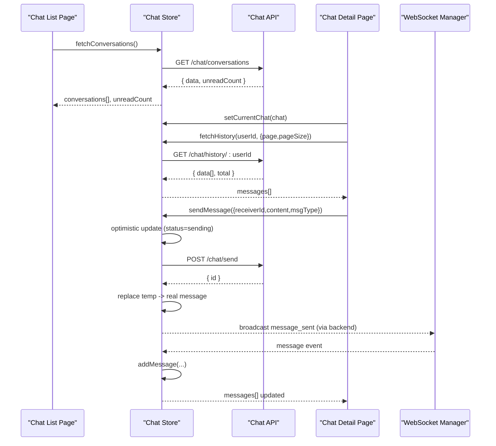
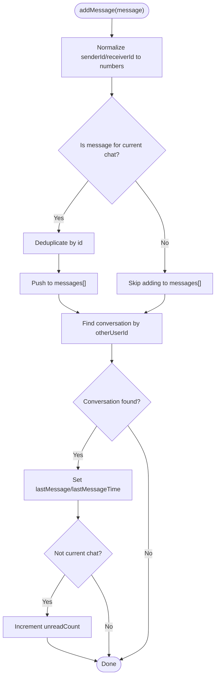
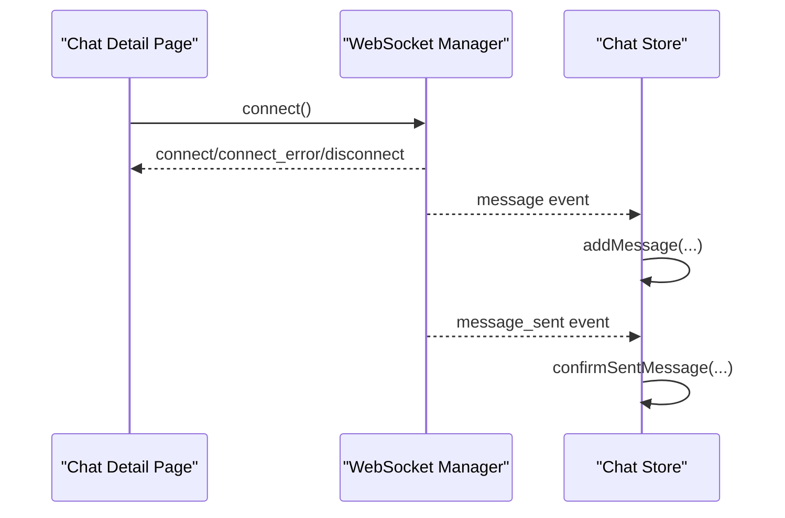
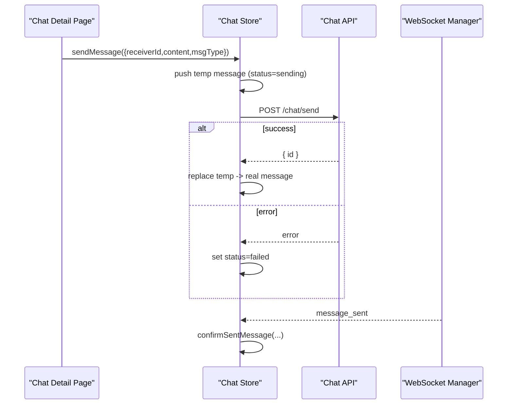
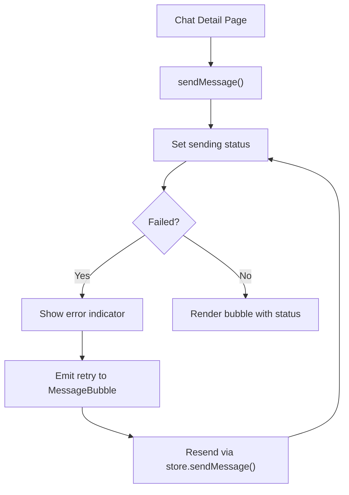
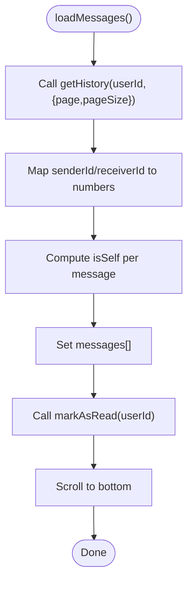
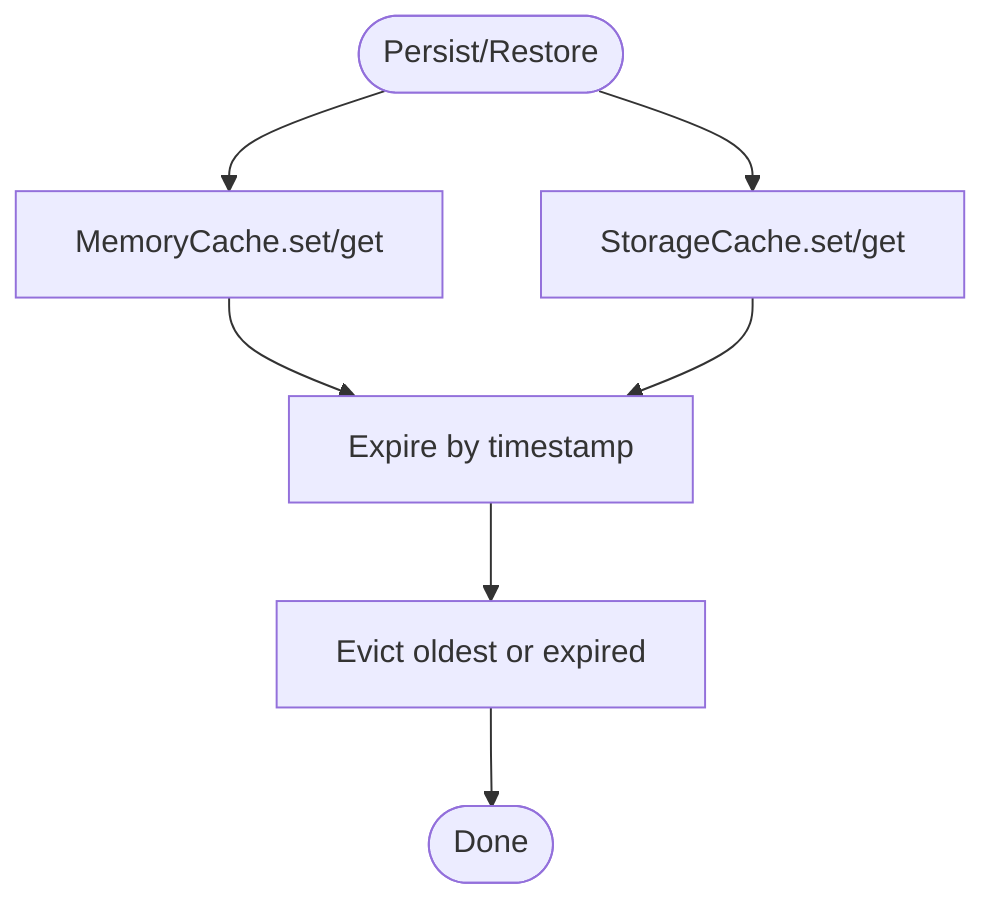
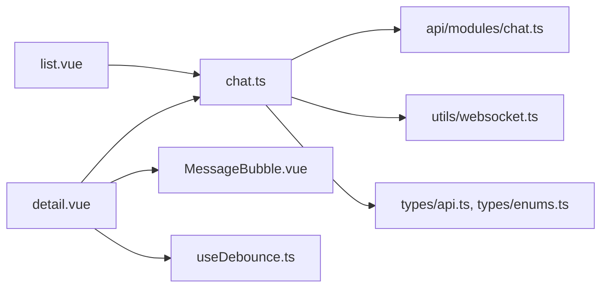

# Chat Store

<cite>
**Referenced Files in This Document**
- [chat.ts](file://src/stores/chat.ts)
- [chat.ts](file://src/api/modules/chat.ts)
- [websocket.ts](file://src/utils/websocket.ts)
- [detail.vue](file://src/pages/chat/detail.vue)
- [list.vue](file://src/pages/chat/list.vue)
- [MessageBubble.vue](file://src/components/business/MessageBubble.vue)
- [backend-types.ts](file://src/types/api/backend-types.ts)
- [api.ts](file://src/types/api.ts)
- [enums.ts](file://src/types/enums.ts)
- [useDebounce.ts](file://src/composables/useDebounce.ts)
- [cache.ts](file://src/utils/cache.ts)
- [storage.ts](file://src/utils/storage.ts)
</cite>

## Table of Contents
1. [Introduction](#introduction)
2. [Project Structure](#project-structure)
3. [Core Components](#core-components)
4. [Architecture Overview](#architecture-overview)
5. [Detailed Component Analysis](#detailed-component-analysis)
6. [Dependency Analysis](#dependency-analysis)
7. [Performance Considerations](#performance-considerations)
8. [Troubleshooting Guide](#troubleshooting-guide)
9. [Conclusion](#conclusion)

## Introduction
This document explains the chat store and real-time messaging implementation in the uni-app TypeScript project. It covers conversation state, message threading, participant management, chat actions (sending, listing, real-time updates), WebSocket integration patterns, message synchronization, UI state management (typing indicators and status tracking), pagination and history handling, offline storage, and performance optimization strategies for large histories and efficient real-time updates.

## Project Structure
The chat system spans three layers:
- Store: centralized state for conversations, current chat, and messages
- Pages: chat list and chat detail screens
- Utilities: WebSocket manager and API module

```mermaid
graph TB
subgraph "UI"
List["Chat List Page<br/>list.vue"]
Detail["Chat Detail Page<br/>detail.vue"]
Bubble["MessageBubble Component<br/>MessageBubble.vue"]
end
subgraph "Store"
Store["Chat Store<br/>chat.ts"]
end
subgraph "API"
Api["Chat API Module<br/>api/modules/chat.ts"]
Types["Types & Enums<br/>types/api.ts, types/enums.ts, types/api/backend-types.ts"]
end
subgraph "Realtime"
WS["WebSocket Manager<br/>utils/websocket.ts"]
end
List --> Store
Detail --> Store
Store --> Api
Store --> WS
Detail --> Bubble
Api --> Types
```

**Diagram sources**
- [chat.ts:1-234](file://src/stores/chat.ts#L1-L234)
- [chat.ts:1-42](file://src/api/modules/chat.ts#L1-L42)
- [websocket.ts:1-171](file://src/utils/websocket.ts#L1-L171)
- [detail.vue:1-299](file://src/pages/chat/detail.vue#L1-L299)
- [list.vue:1-311](file://src/pages/chat/list.vue#L1-L311)
- [MessageBubble.vue:1-309](file://src/components/business/MessageBubble.vue#L1-L309)
- [api.ts:26-43](file://src/types/api.ts#L26-L43)
- [enums.ts:7-11](file://src/types/enums.ts#L7-L11)
- [backend-types.ts:538-547](file://src/types/api/backend-types.ts#L538-L547)

**Section sources**
- [chat.ts:1-234](file://src/stores/chat.ts#L1-L234)
- [chat.ts:1-42](file://src/api/modules/chat.ts#L1-L42)
- [websocket.ts:1-171](file://src/utils/websocket.ts#L1-L171)
- [detail.vue:1-299](file://src/pages/chat/detail.vue#L1-L299)
- [list.vue:1-311](file://src/pages/chat/list.vue#L1-L311)
- [MessageBubble.vue:1-309](file://src/components/business/MessageBubble.vue#L1-L309)
- [api.ts:26-43](file://src/types/api.ts#L26-L43)
- [enums.ts:7-11](file://src/types/enums.ts#L7-L11)
- [backend-types.ts:538-547](file://src/types/api/backend-types.ts#L538-L547)

## Core Components
- Chat Store
  - Maintains conversations, current chat, messages, and unread count
  - Provides actions: fetch conversations, fetch history, send message, mark as read, add/receive messages, confirm sent message, set current chat, clear messages
- Chat API Module
  - Exposes endpoints for sending messages, fetching history, fetching conversations, fetching paginated messages, marking as read
- WebSocket Manager
  - Handles connection lifecycle, authentication, event listeners, heartbeat, and reconnection
- Chat List Page
  - Renders conversation list with unread counts and last messages
- Chat Detail Page
  - Renders message list, handles input, sends messages, scrolls to bottom, retries failed messages
- MessageBubble Component
  - Renders individual message bubbles, shows status indicators (sending, failed), and optional retry action
- Types and Enums
  - Defines Message, Conversation, and MsgType for type safety

**Section sources**
- [chat.ts:8-234](file://src/stores/chat.ts#L8-L234)
- [chat.ts:18-41](file://src/api/modules/chat.ts#L18-L41)
- [websocket.ts:6-171](file://src/utils/websocket.ts#L6-L171)
- [list.vue:1-98](file://src/pages/chat/list.vue#L1-L98)
- [detail.vue:1-172](file://src/pages/chat/detail.vue#L1-L172)
- [MessageBubble.vue:1-115](file://src/components/business/MessageBubble.vue#L1-L115)
- [api.ts:26-43](file://src/types/api.ts#L26-L43)
- [enums.ts:7-11](file://src/types/enums.ts#L7-L11)

## Architecture Overview
The chat store orchestrates state and integrates with the backend via API and with real-time events via WebSocket. The UI pages subscribe to store state and trigger actions.



**Diagram sources**
- [chat.ts:14-98](file://src/stores/chat.ts#L14-L98)
- [chat.ts:18-41](file://src/api/modules/chat.ts#L18-L41)
- [websocket.ts:93-111](file://src/utils/websocket.ts#L93-L111)
- [detail.vue:116-148](file://src/pages/chat/detail.vue#L116-L148)

## Detailed Component Analysis

### Chat Store: State and Actions
- Conversations
  - Holds list of conversations with normalized fields (avatar, lastMessageTime)
  - Unread count aggregated from backend
- Current Chat
  - Tracks the active conversation participant for filtering incoming messages
- Messages
  - Thread of messages for the current chat session
  - Adds isSelf flag derived from senderId vs current user
- Actions
  - fetchConversations: normalize backend fields and set unreadCount
  - fetchHistory: map senderId/receiverId to numbers, compute isSelf
  - sendMessage: optimistic UI update with temporary id and sending status, replace with server response, mark failure on error
  - markAsRead: update unread count for a conversation
  - addMessage: deduplicate by id, add to current chat, update conversation lastMessage/lastMessageTime, increment unread if not current chat
  - confirmSentMessage: replace temporary message with server-confirmed message, update conversation lastMessage/lastMessageTime
  - setCurrentChat/clearMessages: manage current chat context and cleanup



**Diagram sources**
- [chat.ts:100-158](file://src/stores/chat.ts#L100-L158)

**Section sources**
- [chat.ts:8-234](file://src/stores/chat.ts#L8-L234)

### Real-Time Messaging and WebSocket Integration
- Connection
  - Manager authenticates with token and connects to wsURL with path /api/v1/ws
  - Heartbeat ping every 25 seconds
  - Automatic reconnection up to max attempts
- Event Handling
  - message: dispatches to addMessage
  - message_sent: dispatches to confirmSentMessage
  - Unknown payload: logged and ignored
- UI Integration
  - Chat detail page connects on mount and scrolls to bottom after loading



**Diagram sources**
- [websocket.ts:15-111](file://src/utils/websocket.ts#L15-L111)
- [detail.vue:97-101](file://src/pages/chat/detail.vue#L97-L101)

**Section sources**
- [websocket.ts:6-171](file://src/utils/websocket.ts#L6-L171)
- [detail.vue:56-101](file://src/pages/chat/detail.vue#L56-L101)

### Chat Actions: Sending, Listing, and Updates
- Send Message
  - Optimistic update: push a temporary message with status=sending
  - Call backend API; replace temp with server response; on error, set status=failed
- Fetch History
  - Load messages for a conversation with pagination params
  - Normalize ids and compute isSelf
- Mark As Read
  - PUT endpoint to mark a conversation’s unread count as 0
- Receive and Confirm
  - addMessage: dedupe, update current chat or conversation list, increment unread if needed
  - confirmSentMessage: replace temporary message with server-confirmed message



**Diagram sources**
- [chat.ts:50-90](file://src/stores/chat.ts#L50-L90)
- [chat.ts:18-20](file://src/api/modules/chat.ts#L18-L20)
- [websocket.ts:93-111](file://src/utils/websocket.ts#L93-L111)

**Section sources**
- [chat.ts:50-210](file://src/stores/chat.ts#L50-L210)
- [chat.ts:18-41](file://src/api/modules/chat.ts#L18-L41)

### UI State Management: Typing Indicators and Status Tracking
- MessageBubble
  - Shows sending dots for own messages with status=sending
  - Shows error indicator for failed messages with retry action
  - Emits retry event to parent for re-sending
- Chat Detail
  - Uses a debounced button composable to prevent rapid sends
  - Scrolls to bottom after new messages arrive
  - Retries failed messages by resending via store



**Diagram sources**
- [MessageBubble.vue:30-44](file://src/components/business/MessageBubble.vue#L30-L44)
- [MessageBubble.vue:112-114](file://src/components/business/MessageBubble.vue#L112-L114)
- [detail.vue:131-148](file://src/pages/chat/detail.vue#L131-L148)
- [useDebounce.ts:63-73](file://src/composables/useDebounce.ts#L63-L73)

**Section sources**
- [MessageBubble.vue:1-115](file://src/components/business/MessageBubble.vue#L1-L115)
- [detail.vue:131-163](file://src/pages/chat/detail.vue#L131-L163)
- [useDebounce.ts:1-153](file://src/composables/useDebounce.ts#L1-L153)

### Pagination and Chat History Management
- Pagination Params
  - getHistory supports page, pageSize, beforeId
  - getMessages supports page, pageSize
- History Loading
  - Chat detail loads initial history and marks as read
- Conversation List
  - Lists conversations with lastMessage, lastMessageTime, and unreadCount



**Diagram sources**
- [chat.ts:12-16](file://src/api/modules/chat.ts#L12-L16)
- [chat.ts:27-48](file://src/stores/chat.ts#L27-L48)
- [detail.vue:116-129](file://src/pages/chat/detail.vue#L116-L129)

**Section sources**
- [chat.ts:12-16](file://src/api/modules/chat.ts#L12-L16)
- [chat.ts:27-48](file://src/stores/chat.ts#L27-L48)
- [detail.vue:116-129](file://src/pages/chat/detail.vue#L116-L129)
- [list.vue:78-91](file://src/pages/chat/list.vue#L78-L91)

### Offline Message Storage and Caching
- Local Storage Utilities
  - storage helper wraps uni storage APIs for key-value persistence
- Cache Manager
  - MemoryCache and StorageCache provide TTL and eviction policies
  - Can be used to persist chat metadata or partial histories across sessions
- Recommendations
  - Persist small subsets of recent messages or conversation previews
  - Use StorageCache for long-lived entries; MemoryCache for short-lived UI state



**Diagram sources**
- [storage.ts:1-26](file://src/utils/storage.ts#L1-L26)
- [cache.ts:20-139](file://src/utils/cache.ts#L20-L139)
- [cache.ts:144-268](file://src/utils/cache.ts#L144-L268)

**Section sources**
- [storage.ts:1-26](file://src/utils/storage.ts#L1-L26)
- [cache.ts:1-359](file://src/utils/cache.ts#L1-L359)

## Dependency Analysis
- Store depends on:
  - API module for network requests
  - Auth store for current user context
  - WebSocket manager for real-time updates
- Pages depend on:
  - Chat store for reactive state
  - MessageBubble for rendering
  - Debounce composable for send button
- Types define Message and Conversation shapes and MsgType



**Diagram sources**
- [chat.ts:1-6](file://src/stores/chat.ts#L1-L6)
- [chat.ts:1-4](file://src/api/modules/chat.ts#L1-L4)
- [websocket.ts:1-4](file://src/utils/websocket.ts#L1-L4)
- [detail.vue:50-57](file://src/pages/chat/detail.vue#L50-L57)
- [list.vue:59-64](file://src/pages/chat/list.vue#L59-L64)
- [MessageBubble.vue:68-72](file://src/components/business/MessageBubble.vue#L68-L72)
- [useDebounce.ts:1-4](file://src/composables/useDebounce.ts#L1-L4)
- [api.ts:26-43](file://src/types/api.ts#L26-L43)
- [enums.ts:7-11](file://src/types/enums.ts#L7-L11)

**Section sources**
- [chat.ts:1-6](file://src/stores/chat.ts#L1-L6)
- [chat.ts:1-4](file://src/api/modules/chat.ts#L1-L4)
- [websocket.ts:1-4](file://src/utils/websocket.ts#L1-L4)
- [detail.vue:50-57](file://src/pages/chat/detail.vue#L50-L57)
- [list.vue:59-64](file://src/pages/chat/list.vue#L59-L64)
- [MessageBubble.vue:68-72](file://src/components/business/MessageBubble.vue#L68-L72)
- [useDebounce.ts:1-4](file://src/composables/useDebounce.ts#L1-L4)
- [api.ts:26-43](file://src/types/api.ts#L26-L43)
- [enums.ts:7-11](file://src/types/enums.ts#L7-L11)

## Performance Considerations
- Large Conversation Histories
  - Use pagination (page, pageSize, beforeId) to limit initial load
  - Consider virtual scrolling for message lists to render only visible items
  - Debounce scroll-to-bottom to avoid excessive reflows
- Real-Time Update Efficiency
  - Deduplicate incoming messages by id
  - Only append to current chat messages when applicable; otherwise update conversation list counters
  - Heartbeat keeps connection alive; avoid unnecessary polling
- UI Responsiveness
  - Use optimistic updates for immediate feedback
  - Debounce send actions to prevent duplicate submissions
  - Avoid heavy computations in watchers; rely on reactive refs

[No sources needed since this section provides general guidance]

## Troubleshooting Guide
- WebSocket Not Connecting
  - Verify token availability and URL/path configuration
  - Check connect/connect_error/disconnect logs
- Messages Not Updating
  - Ensure addMessage/confirmSentMessage are invoked with normalized ids
  - Confirm currentChat is set when expecting real-time updates
- Sending Failures
  - Observe status=failed and retry via retry handler
  - Validate backend response shape matches expected fields
- Pagination Issues
  - Confirm beforeId/page/pageSize usage aligns with backend expectations
  - Ensure unread counters are reset on markAsRead

**Section sources**
- [websocket.ts:15-91](file://src/utils/websocket.ts#L15-L91)
- [chat.ts:100-210](file://src/stores/chat.ts#L100-L210)
- [detail.vue:150-163](file://src/pages/chat/detail.vue#L150-L163)
- [chat.ts:12-16](file://src/api/modules/chat.ts#L12-L16)

## Conclusion
The chat store provides a robust foundation for real-time messaging with optimistic UI updates, deduplication, and seamless integration with WebSocket events. By leveraging pagination, normalization, and caching utilities, the system remains responsive and scalable. The UI components clearly reflect message status and enable reliable retry behavior, while the store’s actions encapsulate best practices for conversation and message management.