# Friend Store

<cite>
**Referenced Files in This Document**
- [friend.ts](file://src/stores/friend.ts)
- [friend.ts](file://src/api/modules/friend.ts)
- [backend-types.ts](file://src/types/api/backend-types.ts)
- [list.vue](file://src/pages/friend/list.vue)
- [blacklist.vue](file://src/pages/friend/blacklist.vue)
- [following.vue](file://src/pages/friend/following.vue)
- [followers.vue](file://src/pages/friend/followers.vue)
- [privacy.vue](file://src/pages/profile/privacy.vue)
- [profile.ts](file://src/api/profile.ts)
- [useNPS.ts](file://src/composables/useNPS.ts)
- [index.vue](file://src/pages/nearby/index.vue)
- [lbs.ts](file://src/pages/tabbar/home/algorithms/lbs.ts)
</cite>

## Table of Contents
1. [Introduction](#introduction)
2. [Project Structure](#project-structure)
3. [Core Components](#core-components)
4. [Architecture Overview](#architecture-overview)
5. [Detailed Component Analysis](#detailed-component-analysis)
6. [Dependency Analysis](#dependency-analysis)
7. [Performance Considerations](#performance-considerations)
8. [Troubleshooting Guide](#troubleshooting-guide)
9. [Conclusion](#conclusion)
10. [Appendices](#appendices)

## Introduction
This document describes the friend management store and related features in the frontend. It covers the friendship state model (friend lists, following/followers, blocked users), friend actions (follow/unfollow, add friend, delete friend, block/unblock), state synchronization patterns, real-time notification triggers, privacy settings integration, friend discovery mechanisms, and relationship status tracking. It also includes examples of friend search, mutual friend calculation, and friend ranking algorithms, along with performance considerations for large friend networks.

## Project Structure
The friend management functionality spans three layers:
- Store layer: centralized state and actions for friends, following, and blocklist
- API layer: typed HTTP client for friend endpoints
- Pages layer: UI components that consume the store and API

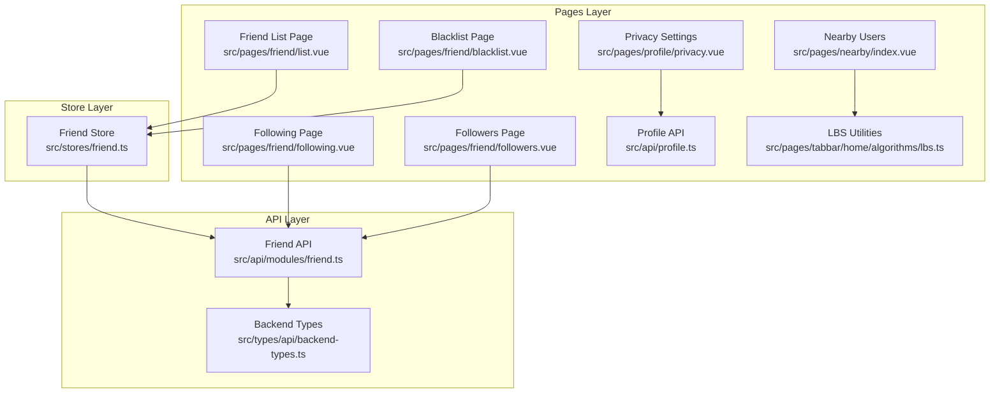

**Diagram sources**
- [friend.ts:1-70](file://src/stores/friend.ts#L1-L70)
- [friend.ts:1-61](file://src/api/modules/friend.ts#L1-L61)
- [backend-types.ts:292-339](file://src/types/api/backend-types.ts#L292-L339)
- [list.vue:1-184](file://src/pages/friend/list.vue#L1-L184)
- [blacklist.vue:1-261](file://src/pages/friend/blacklist.vue#L1-L261)
- [following.vue:1-160](file://src/pages/friend/following.vue#L1-L160)
- [followers.vue:1-178](file://src/pages/friend/followers.vue#L1-L178)
- [privacy.vue:157-186](file://src/pages/profile/privacy.vue#L157-L186)
- [profile.ts:204-243](file://src/api/profile.ts#L204-L243)
- [index.vue:1-712](file://src/pages/nearby/index.vue#L1-L712)
- [lbs.ts:94-278](file://src/pages/tabbar/home/algorithms/lbs.ts#L94-L278)

**Section sources**
- [friend.ts:1-70](file://src/stores/friend.ts#L1-L70)
- [friend.ts:1-61](file://src/api/modules/friend.ts#L1-L61)
- [backend-types.ts:292-339](file://src/types/api/backend-types.ts#L292-L339)
- [list.vue:1-184](file://src/pages/friend/list.vue#L1-L184)
- [blacklist.vue:1-261](file://src/pages/friend/blacklist.vue#L1-L261)
- [following.vue:1-160](file://src/pages/friend/following.vue#L1-L160)
- [followers.vue:1-178](file://src/pages/friend/followers.vue#L1-L178)
- [privacy.vue:157-186](file://src/pages/profile/privacy.vue#L157-L186)
- [profile.ts:204-243](file://src/api/profile.ts#L204-L243)
- [index.vue:1-712](file://src/pages/nearby/index.vue#L1-L712)
- [lbs.ts:94-278](file://src/pages/tabbar/home/algorithms/lbs.ts#L94-L278)

## Core Components
- Friend Store: exposes reactive friend lists (friends, following, blocklist) and actions to mutate and synchronize state via the API.
- Friend API: typed HTTP client for friend endpoints (list, follow/unfollow, add friend, delete friend, block/unblock, blocklist, status).
- Backend Types: shared types for Friendship, UserBlacklist, and FriendshipStatus used across the store and pages.
- Pages: friend list, blacklist, following, followers, privacy settings, and nearby users.

Key responsibilities:
- State: maintain friendList, followingList, blocklist as reactive arrays.
- Actions: fetch lists, compute friendship status, follow/unfollow, add/delete friend, block/unblock, unlock chat.
- Synchronization: refresh lists after mutations; optimistic updates where appropriate.

**Section sources**
- [friend.ts:7-69](file://src/stores/friend.ts#L7-L69)
- [friend.ts:16-61](file://src/api/modules/friend.ts#L16-L61)
- [backend-types.ts:292-339](file://src/types/api/backend-types.ts#L292-L339)

## Architecture Overview
The friend store integrates with the API layer and UI pages. The store encapsulates state and exposes actions that call the API and update local state. Pages subscribe to store state and trigger actions on user interactions.

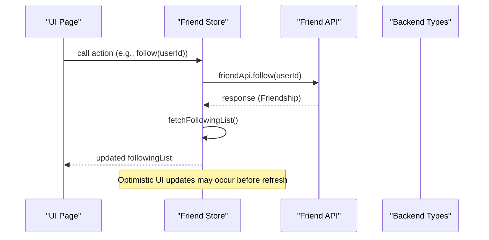

**Diagram sources**
- [friend.ts:29-35](file://src/stores/friend.ts#L29-L35)
- [friend.ts:32-36](file://src/api/modules/friend.ts#L32-L36)
- [backend-types.ts:292-319](file://src/types/api/backend-types.ts#L292-L319)

**Section sources**
- [friend.ts:29-35](file://src/stores/friend.ts#L29-L35)
- [friend.ts:32-36](file://src/api/modules/friend.ts#L32-L36)
- [backend-types.ts:292-319](file://src/types/api/backend-types.ts#L292-L319)

## Detailed Component Analysis

### Friend Store State Model
- friendList: array of confirmed friends (Friendship)
- followingList: array of followed users (Friendship)
- blocklist: array of blocked users (UserBlacklist)

Relationships:
- Friendship includes user and friend details, status, mutual flag, and timestamps.
- UserBlacklist includes blocked user info and reason.

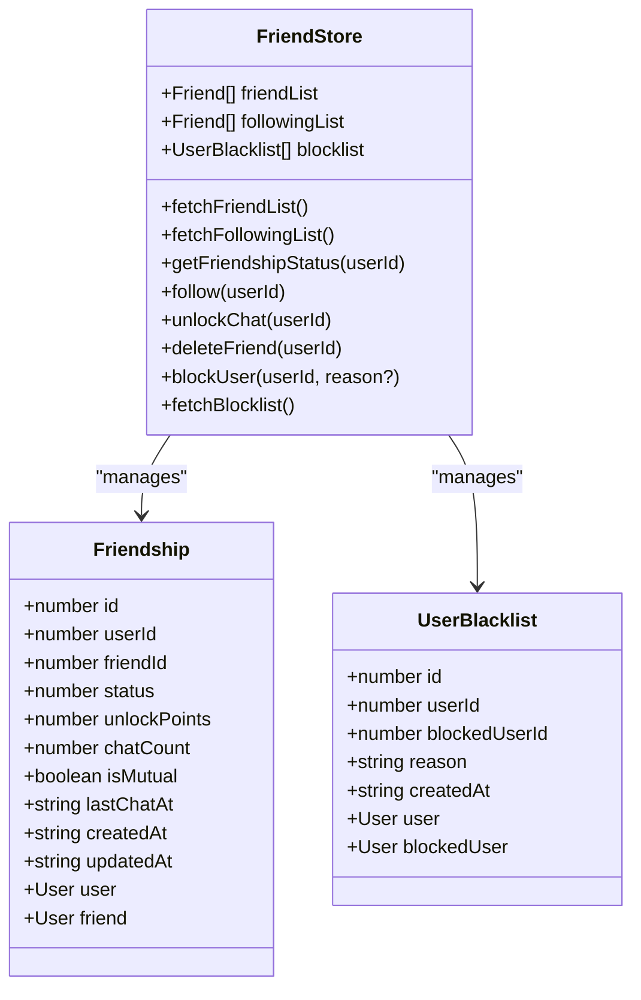

**Diagram sources**
- [backend-types.ts:292-339](file://src/types/api/backend-types.ts#L292-L339)
- [friend.ts:7-69](file://src/stores/friend.ts#L7-L69)

**Section sources**
- [backend-types.ts:292-339](file://src/types/api/backend-types.ts#L292-L339)
- [friend.ts:7-69](file://src/stores/friend.ts#L7-L69)

### Friend Actions and State Synchronization
- Fetch lists: fetchFriendList, fetchFollowingList, fetchBlocklist
- Relationship actions: follow, unfollow, addFriend, deleteFriend, blockUser, unblockUser
- Status checks: getFriendshipStatus
- Real-time triggers: triggerAfterAddFriend after successful follow

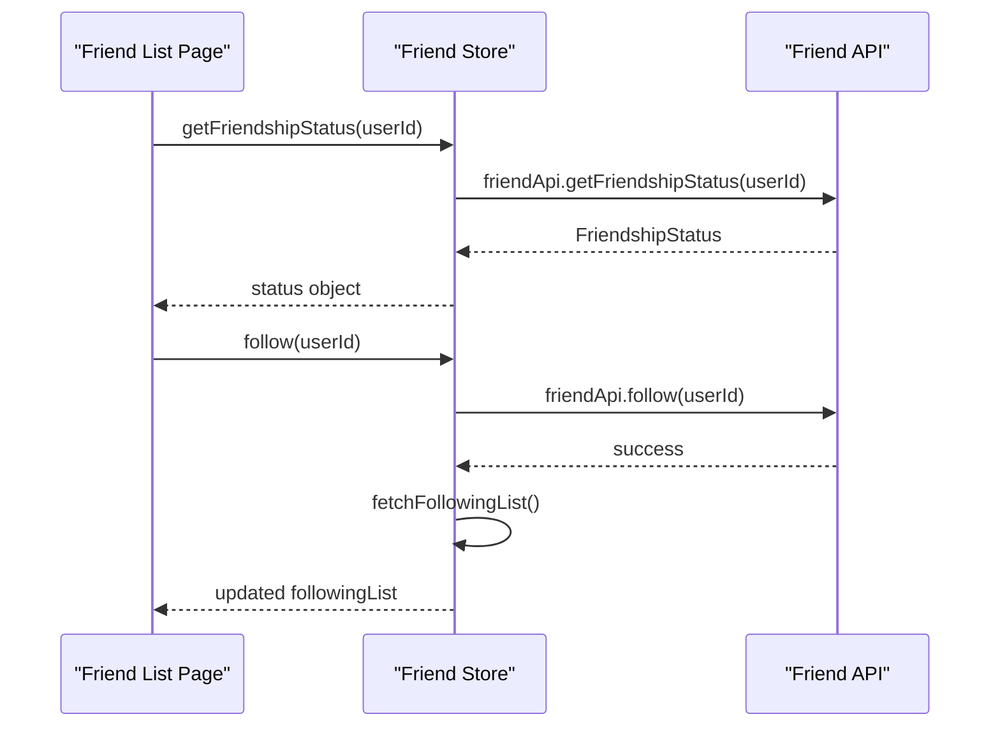

**Diagram sources**
- [list.vue:59-109](file://src/pages/friend/list.vue#L59-L109)
- [friend.ts:22-35](file://src/stores/friend.ts#L22-L35)
- [friend.ts:32-48](file://src/api/modules/friend.ts#L32-L48)

**Section sources**
- [list.vue:59-109](file://src/pages/friend/list.vue#L59-L109)
- [friend.ts:22-35](file://src/stores/friend.ts#L22-L35)
- [friend.ts:32-48](file://src/api/modules/friend.ts#L32-L48)

### Blacklist Management
- Load blocklist via API and store
- Unblocking updates both API and store state

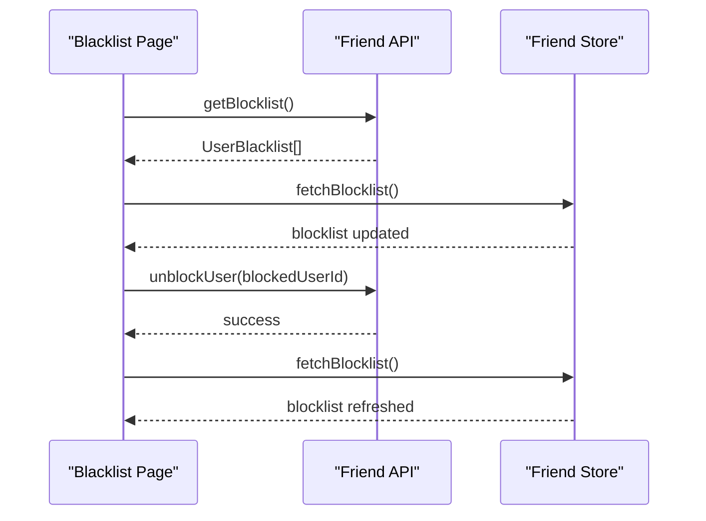

**Diagram sources**
- [blacklist.vue:52-103](file://src/pages/friend/blacklist.vue#L52-L103)
- [friend.ts:59-60](file://src/api/modules/friend.ts#L59-L60)
- [friend.ts:51-54](file://src/stores/friend.ts#L51-L54)

**Section sources**
- [blacklist.vue:52-103](file://src/pages/friend/blacklist.vue#L52-L103)
- [friend.ts:59-60](file://src/api/modules/friend.ts#L59-L60)
- [friend.ts:51-54](file://src/stores/friend.ts#L51-L54)

### Following and Followers
- Following page supports viewing self or another user’s following list and unfollowing
- Followers page supports viewing self or another user’s followers and following/unfollowing with optimistic UI updates

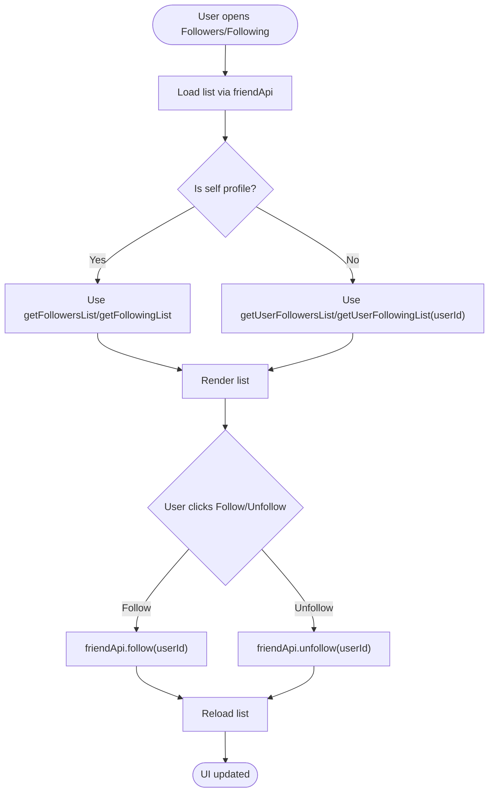

**Diagram sources**
- [following.vue:41-99](file://src/pages/friend/following.vue#L41-L99)
- [followers.vue:37-117](file://src/pages/friend/followers.vue#L37-L117)
- [friend.ts:20-36](file://src/api/modules/friend.ts#L20-L36)

**Section sources**
- [following.vue:41-99](file://src/pages/friend/following.vue#L41-L99)
- [followers.vue:37-117](file://src/pages/friend/followers.vue#L37-L117)
- [friend.ts:20-36](file://src/api/modules/friend.ts#L20-L36)

### Privacy Settings Integration
- Privacy settings include toggles for allowing search, recommendation, stranger messages, and requiring certification
- These settings influence discoverability and interaction permissions

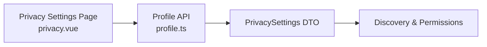

**Diagram sources**
- [privacy.vue:157-186](file://src/pages/profile/privacy.vue#L157-L186)
- [profile.ts:204-243](file://src/api/profile.ts#L204-L243)

**Section sources**
- [privacy.vue:157-186](file://src/pages/profile/privacy.vue#L157-L186)
- [profile.ts:204-243](file://src/api/profile.ts#L204-L243)

### Friend Discovery Mechanisms
- Nearby users discovery: location-based user finding with distance and gender filters
- LBS utilities support grid-based fast neighbor lookup

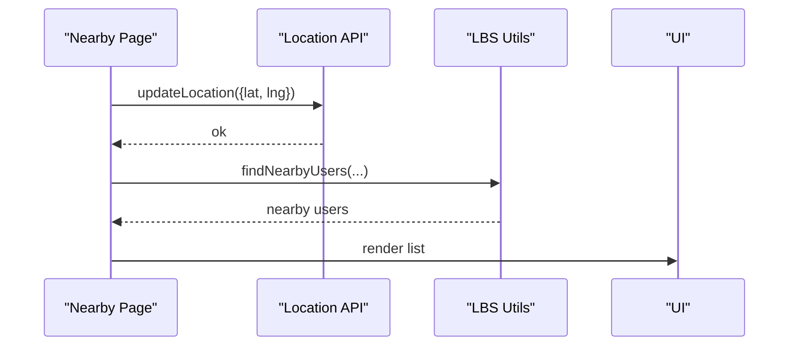

**Diagram sources**
- [index.vue:214-244](file://src/pages/nearby/index.vue#L214-L244)
- [lbs.ts:94-278](file://src/pages/tabbar/home/algorithms/lbs.ts#L94-L278)

**Section sources**
- [index.vue:214-244](file://src/pages/nearby/index.vue#L214-L244)
- [lbs.ts:94-278](file://src/pages/tabbar/home/algorithms/lbs.ts#L94-L278)

### Relationship Status Tracking
- getFriendshipStatus returns:
  - isFriend, isFollowing, canAddFriend
  - chatCount vs requiredChatCount
  - currentPoints vs requiredPoints
  - status enum

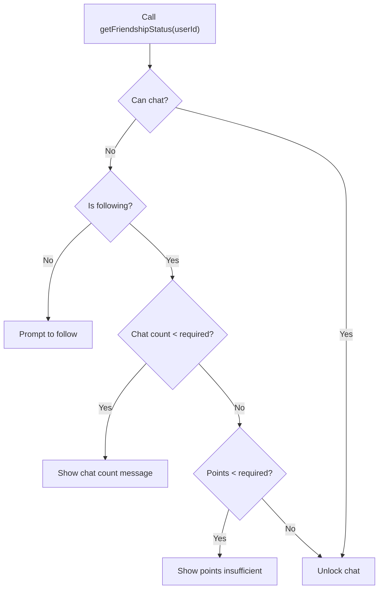

**Diagram sources**
- [list.vue:59-109](file://src/pages/friend/list.vue#L59-L109)
- [friend.ts:4-14](file://src/api/modules/friend.ts#L4-L14)

**Section sources**
- [list.vue:59-109](file://src/pages/friend/list.vue#L59-L109)
- [friend.ts:4-14](file://src/api/modules/friend.ts#L4-L14)

### Examples

#### Friend Search Functionality
- Not implemented in the store or pages; however, privacy settings allow/disallow being found by others. Integration would require adding a search endpoint and UI.

#### Mutual Friend Calculation
- Given two users’ friend lists, mutual friends are the intersection of their friend arrays. This can be computed client-side by comparing friendId sets.

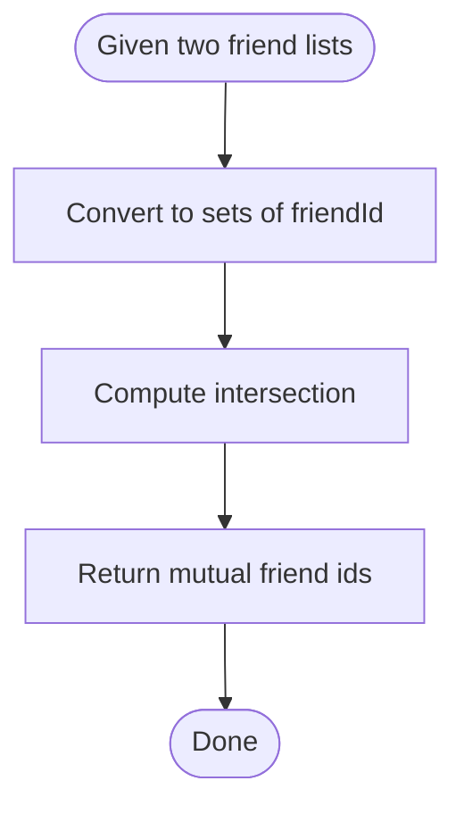

[No sources needed since this diagram shows conceptual workflow, not actual code structure]

#### Friend Ranking Algorithms
- Ranking by mutual connections and engagement is supported conceptually; the codebase includes a hot ranking algorithm suitable for content but not directly for friend ranking. A friend-specific ranking could combine:
  - Number of mutual friends
  - Engagement metrics (posts, likes, comments)
  - Recency of interaction
  - Privacy settings compatibility (visible, searchable)

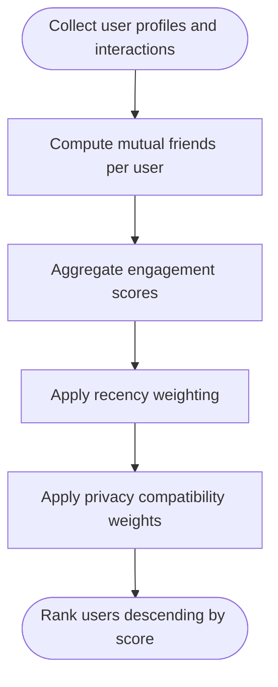

[No sources needed since this diagram shows conceptual workflow, not actual code structure]

## Dependency Analysis
- Store depends on API module for network calls and on backend types for typing.
- Pages depend on the store for state and on API for direct calls where needed.
- Privacy settings integrate with profile API to enforce discoverability and interaction policies.

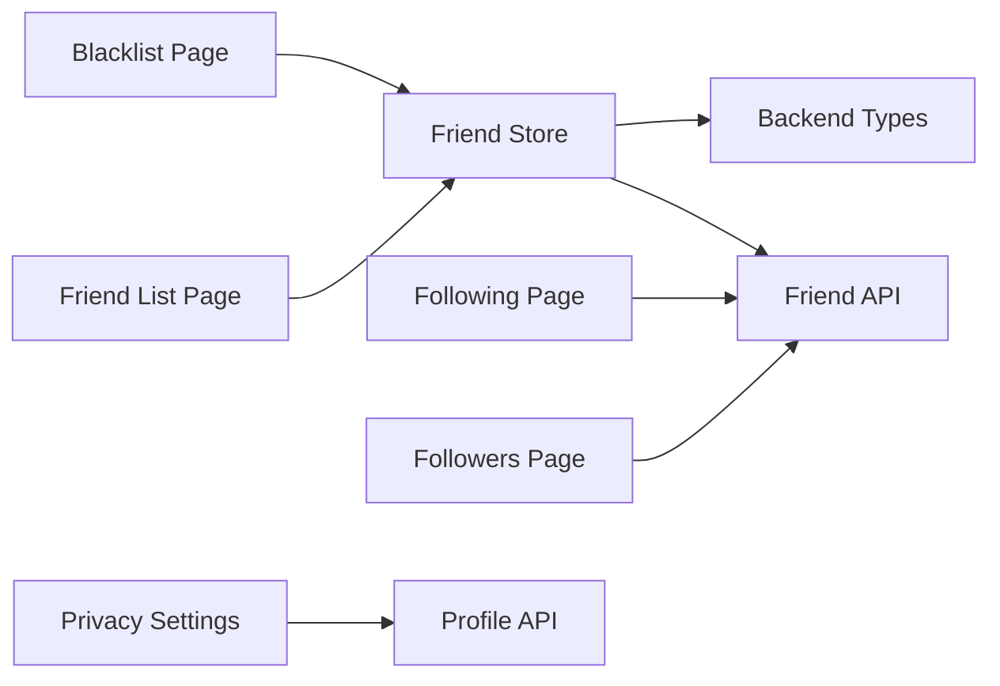

**Diagram sources**
- [friend.ts:1-70](file://src/stores/friend.ts#L1-L70)
- [friend.ts:1-61](file://src/api/modules/friend.ts#L1-L61)
- [backend-types.ts:292-339](file://src/types/api/backend-types.ts#L292-L339)
- [list.vue:1-184](file://src/pages/friend/list.vue#L1-L184)
- [blacklist.vue:1-261](file://src/pages/friend/blacklist.vue#L1-L261)
- [following.vue:1-160](file://src/pages/friend/following.vue#L1-L160)
- [followers.vue:1-178](file://src/pages/friend/followers.vue#L1-L178)
- [privacy.vue:157-186](file://src/pages/profile/privacy.vue#L157-L186)
- [profile.ts:204-243](file://src/api/profile.ts#L204-L243)

**Section sources**
- [friend.ts:1-70](file://src/stores/friend.ts#L1-L70)
- [friend.ts:1-61](file://src/api/modules/friend.ts#L1-L61)
- [backend-types.ts:292-339](file://src/types/api/backend-types.ts#L292-L339)
- [list.vue:1-184](file://src/pages/friend/list.vue#L1-L184)
- [blacklist.vue:1-261](file://src/pages/friend/blacklist.vue#L1-L261)
- [following.vue:1-160](file://src/pages/friend/following.vue#L1-L160)
- [followers.vue:1-178](file://src/pages/friend/followers.vue#L1-L178)
- [privacy.vue:157-186](file://src/pages/profile/privacy.vue#L157-L186)
- [profile.ts:204-243](file://src/api/profile.ts#L204-L243)

## Performance Considerations
- Prefer optimistic UI updates for follow/unfollow to reduce perceived latency; rollback on failure.
- Batch refreshes: after block/unblock, refresh blocklist; after follow, refresh following list.
- Pagination and virtualization for large lists (followers/following).
- Debounce or throttle frequent status checks (getFriendshipStatus) to avoid excessive network calls.
- Use grid-based spatial indexing for nearby users to limit candidate sets before distance computation.

[No sources needed since this section provides general guidance]

## Troubleshooting Guide
Common issues and remedies:
- Follow fails: verify network connectivity and handle error messages; revert optimistic state if unfollow succeeds.
- Chat unlock conditions: present clear messages for chat count and points requirements.
- Blocklist not updating: ensure fetchBlocklist is called after unblock; check API response.
- Privacy settings not taking effect: confirm profile API updates and re-fetch privacy settings.

**Section sources**
- [list.vue:59-109](file://src/pages/friend/list.vue#L59-L109)
- [blacklist.vue:76-102](file://src/pages/friend/blacklist.vue#L76-L102)
- [followers.vue:95-116](file://src/pages/friend/followers.vue#L95-L116)

## Conclusion
The friend store provides a clean separation of concerns between state, API, and UI. It supports essential friend actions, maintains synchronized lists, and integrates with privacy controls and discovery features. Extending the system with friend search, mutual friend computation, and friend ranking can leverage existing privacy and LBS utilities while maintaining performance through optimistic updates and efficient data structures.

## Appendices

### API Definitions Summary
- Friend endpoints: list, following, followers, follow, unfollow, request, accept, add-friend, status, delete, block, unblock, blocklist
- Types: Friendship, UserBlacklist, FriendshipStatus

**Section sources**
- [friend.ts:16-61](file://src/api/modules/friend.ts#L16-L61)
- [backend-types.ts:292-339](file://src/types/api/backend-types.ts#L292-L339)