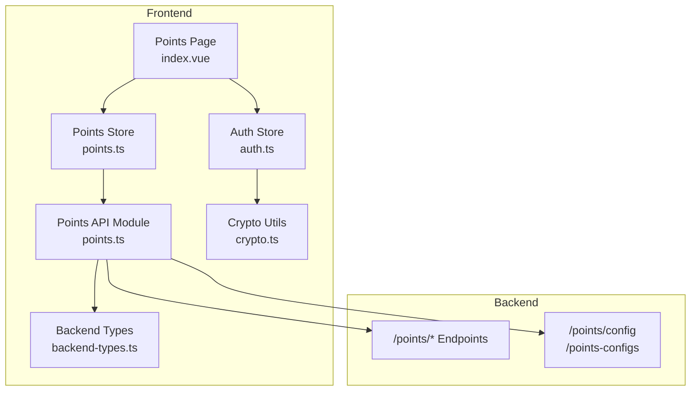
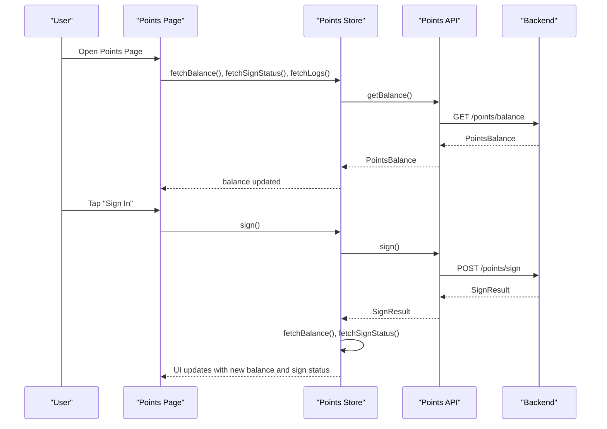
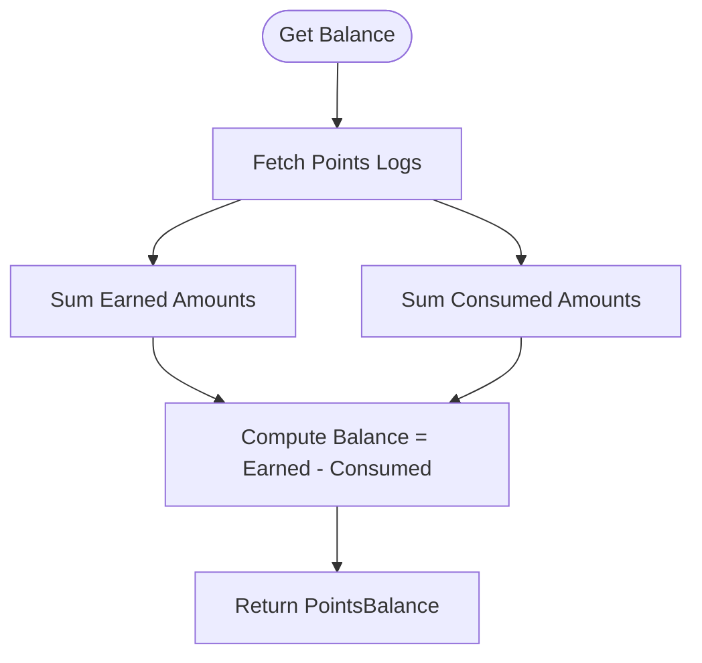
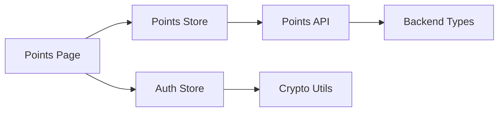

# Points Store

<cite>
**Referenced Files in This Document**
- [points.ts](file://src/stores/points.ts)
- [points.ts](file://src/api/modules/points.ts)
- [index.vue](file://src/pages/points/index.vue)
- [backend-types.ts](file://src/types/api/backend-types.ts)
- [auth.ts](file://src/stores/auth.ts)
- [crypto.ts](file://src/utils/crypto.ts)
- [points-balance-fix.md](file://docs/points-balance-fix.md)
- [API_FIX_REPORT.md](file://API_FIX_REPORT.md)
</cite>

## Table of Contents
1. [Introduction](#introduction)
2. [Project Structure](#project-structure)
3. [Core Components](#core-components)
4. [Architecture Overview](#architecture-overview)
5. [Detailed Component Analysis](#detailed-component-analysis)
6. [Dependency Analysis](#dependency-analysis)
7. [Performance Considerations](#performance-considerations)
8. [Troubleshooting Guide](#troubleshooting-guide)
9. [Conclusion](#conclusion)

## Introduction
This document describes the points and rewards management store, focusing on the points balance state, transaction history, and reward redemption system. It explains how points accumulate, spend, and are tracked, details the reward catalog management capabilities exposed by the API, and documents the points calculation algorithms and balance synchronization. It also covers examples of points activity feeds, reward validation, points transfer operations, integration with payment systems, points expiration handling, reward fulfillment tracking, fraud prevention measures, and points system security considerations.

## Project Structure
The points store is implemented as a Pinia store with a dedicated API module and a UI page. Supporting types define the data contracts for balances, logs, configurations, and sign-in activities. Authentication and cryptography utilities support secure user sessions and password handling.



**Diagram sources**
- [index.vue:1-347](file://src/pages/points/index.vue#L1-L347)
- [points.ts:1-72](file://src/stores/points.ts#L1-L72)
- [points.ts:1-55](file://src/api/modules/points.ts#L1-L55)
- [backend-types.ts:342-359](file://src/types/api/backend-types.ts#L342-L359)
- [auth.ts:1-137](file://src/stores/auth.ts#L1-L137)
- [crypto.ts:1-18](file://src/utils/crypto.ts#L1-L18)

**Section sources**
- [points.ts:1-72](file://src/stores/points.ts#L1-L72)
- [points.ts:1-55](file://src/api/modules/points.ts#L1-L55)
- [index.vue:1-347](file://src/pages/points/index.vue#L1-L347)
- [backend-types.ts:342-359](file://src/types/api/backend-types.ts#L342-L359)
- [auth.ts:1-137](file://src/stores/auth.ts#L1-L137)
- [crypto.ts:1-18](file://src/utils/crypto.ts#L1-L18)

## Core Components
- Points Store: Manages balance, sign-in status, and paginated logs. Provides actions to fetch balance, sign-in status, and logs, and to perform sign-in.
- Points API Module: Defines typed contracts for balance, sign status, sign result, logs, and configuration endpoints.
- Points Page: Renders current balance, cumulative earned/consumed, sign-in status, and paginated logs with filtering by type.
- Backend Types: Defines PointsConfig and related structures for reward catalog and configuration retrieval.
- Auth Store and Crypto Utilities: Provide secure session management and password encryption.

Key responsibilities:
- Balance synchronization: Balance is fetched from the backend and displayed; the backend computes balance from logs to ensure consistency.
- Transaction tracking: Logs include type, source, amount, balance after transaction, remark, and creation time.
- Reward catalog: Configuration endpoints expose reward-related settings and lists.
- Security: Password hashing via SHA256 on the frontend and refresh token handling for session continuity.

**Section sources**
- [points.ts:1-72](file://src/stores/points.ts#L1-L72)
- [points.ts:1-55](file://src/api/modules/points.ts#L1-L55)
- [index.vue:1-347](file://src/pages/points/index.vue#L1-L347)
- [backend-types.ts:342-359](file://src/types/api/backend-types.ts#L342-L359)
- [auth.ts:1-137](file://src/stores/auth.ts#L1-L137)
- [crypto.ts:1-18](file://src/utils/crypto.ts#L1-L18)

## Architecture Overview
The points store follows a unidirectional data flow: UI triggers actions in the store, which call the API module to fetch or mutate data. The API module encapsulates HTTP requests and typed responses. The backend exposes endpoints for balance, sign-in, logs, and configuration.



**Diagram sources**
- [index.vue:84-136](file://src/pages/points/index.vue#L84-L136)
- [points.ts:13-41](file://src/stores/points.ts#L13-L41)
- [points.ts:32-47](file://src/api/modules/points.ts#L32-L47)

## Detailed Component Analysis

### Points Store
The store holds reactive state for balance, sign-in status, logs, and total logs count. It exposes actions to fetch balance, sign-in status, logs, and to perform sign-in. On successful sign-in, it refreshes balance and sign status.

```mermaid
classDiagram
class PointsStore {
+balance : PointsBalance
+signStatus : SignStatus
+logs : PointsLog[]
+totalLogs : number
+fetchBalance() : Promise<void>
+fetchSignStatus() : Promise<void>
+sign() : Promise<SignResult|null>
+fetchLogs(page, pageSize, type?) : Promise<void>
}
class PointsAPI {
+getBalance() : Promise<PointsBalance>
+getSignStatus() : Promise<SignStatus>
+sign() : Promise<SignResult>
+getLogs(page, pageSize, type?) : Promise<{list,total}>
+getConfig() : Promise<PointsConfig[]>
+getConfigList() : Promise<PointsConfig[]>
}
PointsStore --> PointsAPI : "calls"
```

**Diagram sources**
- [points.ts:5-71](file://src/stores/points.ts#L5-L71)
- [points.ts:32-54](file://src/api/modules/points.ts#L32-L54)

**Section sources**
- [points.ts:1-72](file://src/stores/points.ts#L1-L72)

### Points API Module
Defines typed contracts for:
- PointsBalance: current balance and totals
- SignStatus: daily sign-in state and streak
- SignResult: result of a sign-in action
- PointsLog: per-transaction record
- Configuration endpoints for points configs and lists

Endpoints:
- GET /points/balance
- POST /points/sign
- GET /points/sign/status
- GET /points/logs
- GET /points/config
- GET /points-configs

**Section sources**
- [points.ts:1-55](file://src/api/modules/points.ts#L1-L55)

### Points Page
The page renders:
- Current points, total earned, total consumed
- Sign-in status and button
- Tabbed transaction logs (all/income/expenses)
- Infinite scroll with pagination and loading indicators

Behavior:
- Validates authentication before rendering
- Loads balance, sign status, and logs on mount
- Supports tab switching and infinite scroll loading

**Section sources**
- [index.vue:1-347](file://src/pages/points/index.vue#L1-L347)

### Backend Types and Reward Catalog
PointsConfig defines reward-related configuration entries. The API exposes:
- getConfig: returns PointsConfig[]
- getConfigList: returns PointsConfig[]

These endpoints enable reward catalog management and dynamic configuration of reward thresholds, categories, and availability.

**Section sources**
- [backend-types.ts:342-359](file://src/types/api/backend-types.ts#L342-L359)
- [points.ts:49-54](file://src/api/modules/points.ts#L49-L54)

### Balance Synchronization and Calculation
The backend calculates balance from logs to ensure consistency between the user’s points field and the audit trail. The frontend displays the backend-provided balance and totals.



**Diagram sources**
- [points-balance-fix.md:25-47](file://docs/points-balance-fix.md#L25-L47)
- [points-balance-fix.md:100-127](file://docs/points-balance-fix.md#L100-L127)

**Section sources**
- [points-balance-fix.md:1-195](file://docs/points-balance-fix.md#L1-L195)

### Points Activity Feed
The logs list shows:
- Source or remark
- Creation time
- Amount with sign indicating income (+) or expense (-)
- Type filtering (all/income/expenses)

Pagination is supported with page and pageSize parameters.

**Section sources**
- [index.vue:41-68](file://src/pages/points/index.vue#L41-L68)
- [points.ts:42-47](file://src/api/modules/points.ts#L42-L47)

### Reward Validation and Redemption
Reward validation and redemption are supported by:
- Reward catalog retrieval via getConfig and getConfigList
- Points configuration structures enabling threshold checks and eligibility

Note: The current frontend does not implement a dedicated reward redemption UI; the configuration endpoints provide the data needed to build reward selection and validation logic.

**Section sources**
- [points.ts:49-54](file://src/api/modules/points.ts#L49-L54)
- [backend-types.ts:342-359](file://src/types/api/backend-types.ts#L342-L359)

### Points Transfer Operations
There is no explicit transfer endpoint in the current API module. If transfers are required, they would need to be added to the API module and implemented consistently with logging and balance updates.

[No sources needed since this section proposes future extension]

### Integration with Payment Systems
Payment integration is not present in the current codebase. If payments are introduced, they should:
- Trigger points additions via controlled backend APIs
- Log each transaction with source, amount, and balance
- Update balance and logs atomically

[No sources needed since this section proposes future extension]

### Points Expiration Handling
There is no expiration logic in the current codebase. If expiration is introduced:
- Backend should compute expiring balances based on configured policies
- Frontend should surface expiration dates and remaining validity periods
- Logs should reflect expiration events

[No sources needed since this section proposes future extension]

### Reward Fulfillment Tracking
Fulfillment tracking requires:
- A fulfillment status field in reward records
- A dedicated endpoint to query fulfillment status
- UI to display fulfillment progress and outcomes

[No sources needed since this section proposes future extension]

### Fraud Prevention and Security Considerations
Security measures observed:
- Password encryption on the frontend using SHA256 before transmission
- Refresh token handling to maintain sessions securely
- Persistent auth store with secure storage of tokens and user info

Recommendations:
- Enforce rate limits on sign-in and balance queries
- Add input validation and sanitization for all mutation endpoints
- Implement server-side concurrency control for points updates
- Use signed URLs and scopes for sensitive operations
- Monitor suspicious activities and enforce IP/device binding where appropriate

**Section sources**
- [crypto.ts:1-18](file://src/utils/crypto.ts#L1-L18)
- [auth.ts:1-137](file://src/stores/auth.ts#L1-L137)

## Dependency Analysis
The points store depends on the points API module, which in turn depends on the shared request utility and backend endpoints. The UI depends on the store and auth store for authentication gating.



**Diagram sources**
- [index.vue:72-78](file://src/pages/points/index.vue#L72-L78)
- [points.ts:1-3](file://src/stores/points.ts#L1-L3)
- [points.ts:1-2](file://src/api/modules/points.ts#L1-L2)
- [auth.ts:1-8](file://src/stores/auth.ts#L1-L8)
- [crypto.ts:1-1](file://src/utils/crypto.ts#L1-L1)

**Section sources**
- [points.ts:1-72](file://src/stores/points.ts#L1-L72)
- [points.ts:1-55](file://src/api/modules/points.ts#L1-L55)
- [index.vue:72-78](file://src/pages/points/index.vue#L72-L78)
- [auth.ts:1-137](file://src/stores/auth.ts#L1-L137)
- [crypto.ts:1-18](file://src/utils/crypto.ts#L1-L18)

## Performance Considerations
- Balance computation: The backend aggregates logs to compute balance, ensuring consistency but potentially impacting performance. Consider caching computed balances with invalidation on write.
- Logs pagination: The frontend supports pagination; ensure backend enforces reasonable page sizes and provides efficient indexing on logs.
- UI rendering: Virtualized lists or optimized list rendering can improve performance for long histories.

[No sources needed since this section provides general guidance]

## Troubleshooting Guide
Common issues and resolutions:
- Balance mismatch: If total earned minus total consumed does not equal current balance, verify backend balance calculation and data consistency across user points and logs.
- Sign-in failures: Ensure sign-in endpoint is reachable and credentials are valid; check network errors and retry logic.
- Logs not loading: Verify pagination parameters and endpoint availability; confirm authentication state.

**Section sources**
- [points-balance-fix.md:1-195](file://docs/points-balance-fix.md#L1-L195)
- [points.ts:13-41](file://src/stores/points.ts#L13-L41)
- [index.vue:84-136](file://src/pages/points/index.vue#L84-L136)

## Conclusion
The points store provides a robust foundation for balance display, sign-in tracking, and transaction logging. The backend ensures balance consistency by computing it from logs, while the frontend offers a responsive UI with pagination and filtering. Reward catalog exposure via configuration endpoints enables future reward management. Security is addressed through frontend password hashing and secure token handling. Extending the system with reward redemption, fulfillment tracking, expiration handling, and payment integration will require adding new endpoints and UI components aligned with existing patterns.