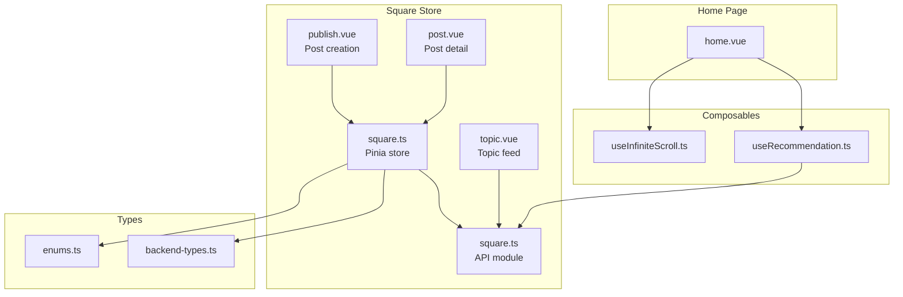
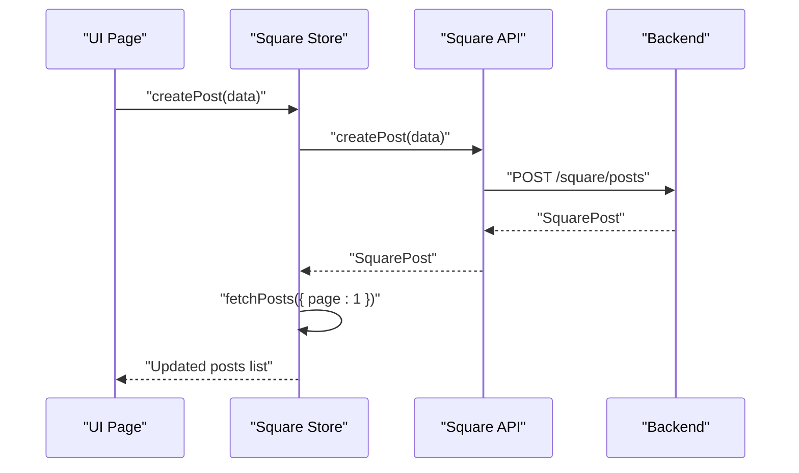
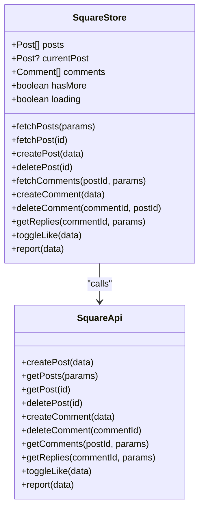
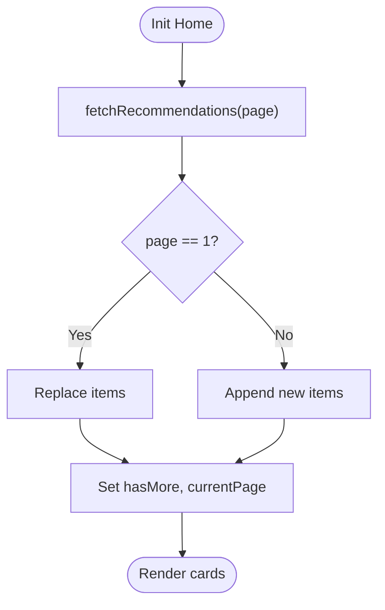
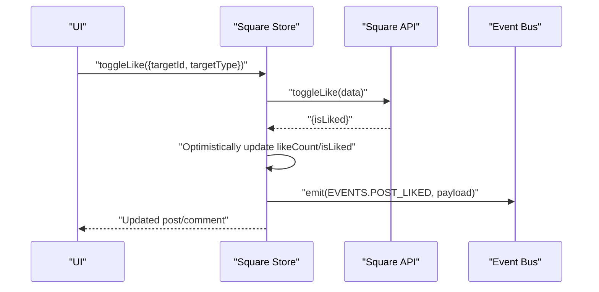
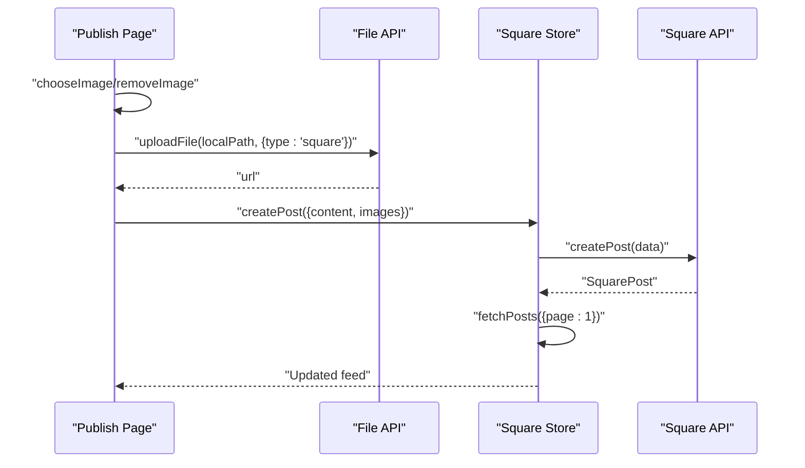
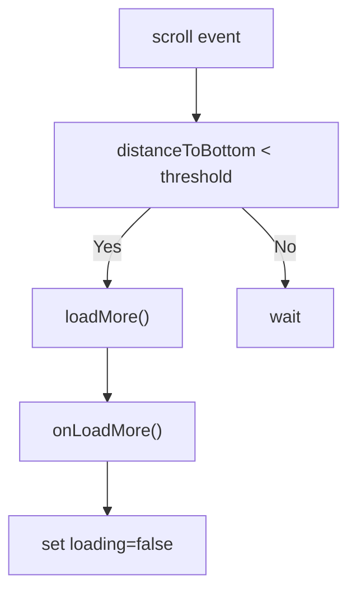
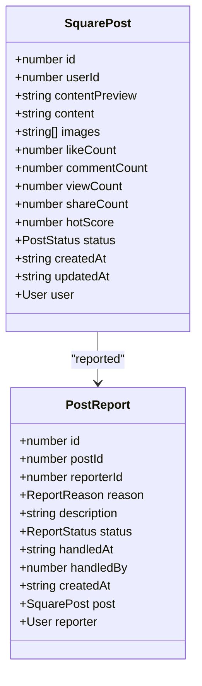
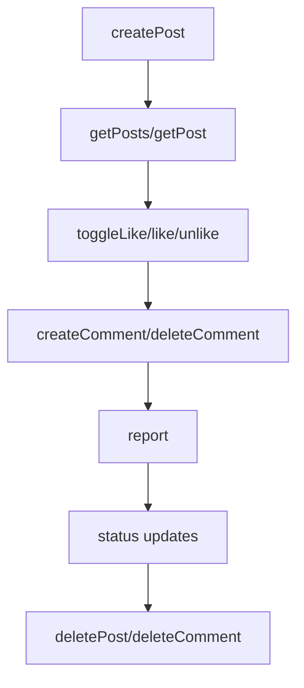
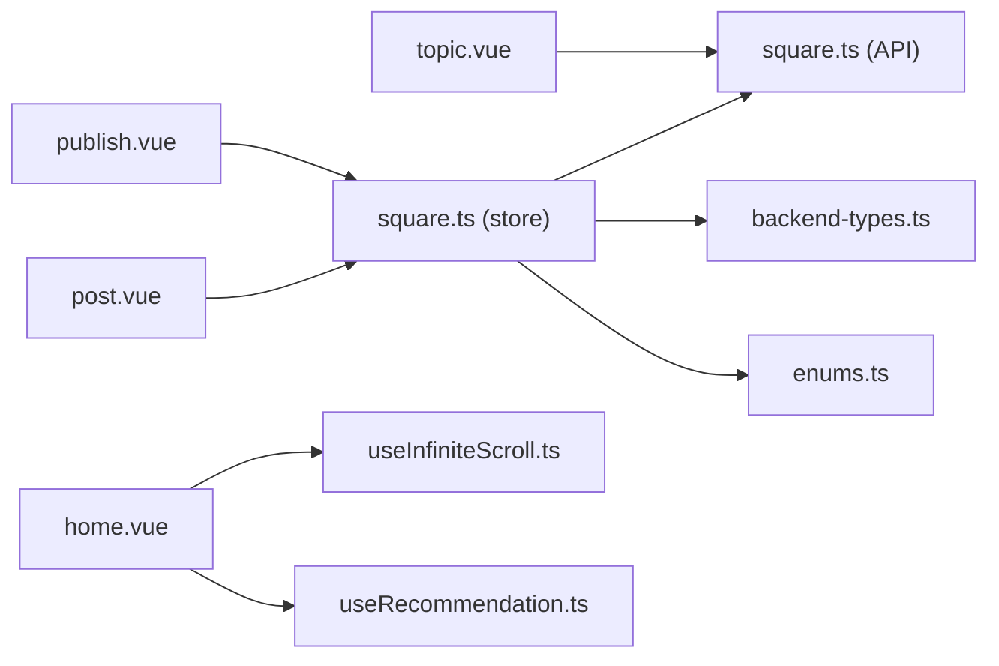

# Square Store

<cite>
**Referenced Files in This Document**
- [square.ts](file://src/stores/square.ts)
- [square.ts](file://src/api/modules/square.ts)
- [backend-types.ts](file://src/types/api/backend-types.ts)
- [enums.ts](file://src/types/enums.ts)
- [home.vue](file://src/pages/tabbar/home.vue)
- [useInfiniteScroll.ts](file://src/pages/tabbar/home/composables/useInfiniteScroll.ts)
- [useRecommendation.ts](file://src/pages/tabbar/home/composables/useRecommendation.ts)
- [publish.vue](file://src/pages/square/publish.vue)
- [post.vue](file://src/pages/square/post.vue)
- [topic.vue](file://src/pages/square/topic.vue)
</cite>

## Table of Contents
1. [Introduction](#introduction)
2. [Project Structure](#project-structure)
3. [Core Components](#core-components)
4. [Architecture Overview](#architecture-overview)
5. [Detailed Component Analysis](#detailed-component-analysis)
6. [Dependency Analysis](#dependency-analysis)
7. [Performance Considerations](#performance-considerations)
8. [Troubleshooting Guide](#troubleshooting-guide)
9. [Conclusion](#conclusion)

## Introduction
This document describes the Square Store, the content management subsystem responsible for publishing, discovering, and interacting with social posts. It covers:
- Post feed state structure and pagination
- Content categorization and recommendation integration
- User engagement tracking and optimistic updates
- Actions for post creation, feed updates, likes, comments, and shares
- Infinite scroll implementation and content filtering
- Recommendation strategies and content lifecycle management
- Moderation states, reporting workflows, and content moderation
- Performance optimization, caching, and real-time update strategies
- Personalization and engagement metrics tracking

## Project Structure
The Square Store spans stores, APIs, pages, composables, and types:
- Stores manage reactive state and orchestrate API calls
- APIs define typed DTOs and HTTP endpoints
- Pages implement UI flows for publishing, viewing, and interacting with posts
- Composables encapsulate reusable logic for infinite scroll and recommendations
- Types define backend models and enums for statuses and targets

**Diagram sources**
- [square.ts:1-152](file://src/stores/square.ts#L1-L152)
- [square.ts:1-98](file://src/api/modules/square.ts#L1-L98)
- [backend-types.ts:427-535](file://src/types/api/backend-types.ts#L427-L535)
- [enums.ts:1-41](file://src/types/enums.ts#L1-L41)
- [home.vue:1-489](file://src/pages/tabbar/home.vue#L1-L489)
- [useInfiniteScroll.ts:1-71](file://src/pages/tabbar/home/composables/useInfiniteScroll.ts#L1-L71)
- [useRecommendation.ts:1-202](file://src/pages/tabbar/home/composables/useRecommendation.ts#L1-L202)
- [publish.vue:1-239](file://src/pages/square/publish.vue#L1-L239)
- [post.vue:1-318](file://src/pages/square/post.vue#L1-L318)
- [topic.vue:1-755](file://src/pages/square/topic.vue#L1-L755)

**Section sources**
- [square.ts:1-152](file://src/stores/square.ts#L1-L152)
- [square.ts:1-98](file://src/api/modules/square.ts#L1-L98)
- [backend-types.ts:427-535](file://src/types/api/backend-types.ts#L427-L535)
- [enums.ts:1-41](file://src/types/enums.ts#L1-L41)
- [home.vue:1-489](file://src/pages/tabbar/home.vue#L1-L489)
- [useInfiniteScroll.ts:1-71](file://src/pages/tabbar/home/composables/useInfiniteScroll.ts#L1-L71)
- [useRecommendation.ts:1-202](file://src/pages/tabbar/home/composables/useRecommendation.ts#L1-L202)
- [publish.vue:1-239](file://src/pages/square/publish.vue#L1-L239)
- [post.vue:1-318](file://src/pages/square/post.vue#L1-L318)
- [topic.vue:1-755](file://src/pages/square/topic.vue#L1-L755)

## Core Components
- Square Store: central state for posts, current post, comments, pagination flags, and actions for CRUD, likes, comments, replies, and reporting
- Square API Module: typed DTOs and HTTP endpoints for posts, comments, likes, reports, and replies
- Home Page: integrates recommendation feed, infinite scroll, and skeleton loaders
- Composables: reusable hooks for infinite scroll and recommendation fetching
- Pages: publish, post detail, and topic feed UI flows

Key responsibilities:
- Feed state: posts array, currentPost, comments, hasMore, loading
- Actions: fetchPosts, fetchPost, createPost, deletePost, fetchComments, createComment, deleteComment, getReplies, toggleLike, report
- Recommendation integration: ratio-driven composition, pagination, and action tracking
- Infinite scroll: threshold-based loading and refresh

**Section sources**
- [square.ts:13-151](file://src/stores/square.ts#L13-L151)
- [square.ts:43-97](file://src/api/modules/square.ts#L43-L97)
- [useRecommendation.ts:14-201](file://src/pages/tabbar/home/composables/useRecommendation.ts#L14-L201)
- [useInfiniteScroll.ts:9-70](file://src/pages/tabbar/home/composables/useInfiniteScroll.ts#L9-L70)
- [home.vue:129-439](file://src/pages/tabbar/home.vue#L129-L439)

## Architecture Overview
The Square Store follows a layered architecture:
- UI Pages trigger actions via composables and store
- Store orchestrates API calls and updates local state
- API module defines DTOs and endpoint contracts
- Types define backend models and enums for statuses and targets

**Diagram sources**
- [publish.vue:84-134](file://src/pages/square/publish.vue#L84-L134)
- [square.ts:42-45](file://src/stores/square.ts#L42-L45)
- [square.ts:44-45](file://src/api/modules/square.ts#L44-L45)

**Section sources**
- [publish.vue:84-134](file://src/pages/square/publish.vue#L84-L134)
- [square.ts:42-45](file://src/stores/square.ts#L42-L45)
- [square.ts:44-45](file://src/api/modules/square.ts#L44-L45)

## Detailed Component Analysis

### Square Store State and Actions
The Square Store manages:
- Reactive state: posts, currentPost, comments, hasMore, loading
- Feed actions: fetchPosts, fetchPost, createPost, deletePost
- Comments: fetchComments, createComment, deleteComment, getReplies
- Engagement: toggleLike, report
- Optimistic updates for likes and counts

**Diagram sources**
- [square.ts:13-151](file://src/stores/square.ts#L13-L151)
- [square.ts:43-97](file://src/api/modules/square.ts#L43-L97)

**Section sources**
- [square.ts:13-151](file://src/stores/square.ts#L13-L151)

### Post Feed State Structure
- posts: array of posts returned by getPosts
- currentPost: single post loaded by fetchPost
- comments: list of comments for a post
- hasMore: indicates whether more pages are available
- loading: prevents concurrent loads

Pagination behavior:
- fetchPosts(page, pageSize) merges new items for page > 1 or replaces for page === 1
- hasMore is derived from list length vs pageSize

**Section sources**
- [square.ts:20-35](file://src/stores/square.ts#L20-L35)

### Content Categorization and Recommendation Integration
The Home page integrates a recommendation feed with:
- Ratio-driven composition: personalized, hot, nearby, topic, new
- Infinite scroll: threshold-based loading and refresh
- Skeleton loaders during initial load
- Action tracking for views, likes, skips, shares, comments, favorites

**Diagram sources**
- [useRecommendation.ts:32-87](file://src/pages/tabbar/home/composables/useRecommendation.ts#L32-L87)
- [home.vue:164-172](file://src/pages/tabbar/home.vue#L164-L172)

**Section sources**
- [useRecommendation.ts:14-201](file://src/pages/tabbar/home/composables/useRecommendation.ts#L14-L201)
- [home.vue:129-439](file://src/pages/tabbar/home.vue#L129-L439)

### User Engagement Tracking
Engagement tracking includes:
- Like toggling with optimistic UI updates and event emission
- Comment creation/deletion updates counts locally
- Recommendation action tracking (view, like, skip, share, comment, favorite)
- Event bus emits POST_LIKED and COMMENT_LIKED events after toggling

**Diagram sources**
- [square.ts:95-128](file://src/stores/square.ts#L95-L128)
- [square.ts:86-87](file://src/api/modules/square.ts#L86-L87)

**Section sources**
- [square.ts:95-128](file://src/stores/square.ts#L95-L128)

### Post Creation Workflow
- Publish page collects content and optional images
- Images are uploaded via file API, then createPost is called
- After successful creation, the feed is refreshed by re-fetching page 1

**Diagram sources**
- [publish.vue:55-134](file://src/pages/square/publish.vue#L55-L134)
- [square.ts:42-45](file://src/stores/square.ts#L42-L45)
- [square.ts:44-45](file://src/api/modules/square.ts#L44-L45)

**Section sources**
- [publish.vue:55-134](file://src/pages/square/publish.vue#L55-L134)
- [square.ts:42-45](file://src/stores/square.ts#L42-L45)

### Infinite Scroll Implementation
- useInfiniteScroll provides loadMore, refresh, and scroll handling
- Threshold-based detection triggers loadMore when near bottom
- Prevents concurrent loads and respects hasMore flag

**Diagram sources**
- [useInfiniteScroll.ts:17-40](file://src/pages/tabbar/home/composables/useInfiniteScroll.ts#L17-L40)

**Section sources**
- [useInfiniteScroll.ts:9-70](file://src/pages/tabbar/home/composables/useInfiniteScroll.ts#L9-L70)

### Content Filtering and Sorting
- Posts: getPosts supports page, pageSize, sort (hot, latest)
- Comments: getComments supports page, pageSize, sort (time, hot)
- Topic feed: getTopicPosts supports page, pageSize, sort (latest, hot)
- Topic page also supports tab switching and abortable requests

**Section sources**
- [square.ts:37-41](file://src/api/modules/square.ts#L37-L41)
- [square.ts:62-74](file://src/api/modules/square.ts#L62-L74)
- [topic.vue:241-311](file://src/pages/square/topic.vue#L241-L311)

### Recommendations and Personalization
- useRecommendation composes items according to configured ratios
- Supports mock data fallback and production API integration
- Tracks user actions for analytics and personalization

**Section sources**
- [useRecommendation.ts:24-30](file://src/pages/tabbar/home/composables/useRecommendation.ts#L24-L30)
- [useRecommendation.ts:122-189](file://src/pages/tabbar/home/composables/useRecommendation.ts#L122-L189)

### Content Moderation States and Reporting
- Post model includes status field (normal, deleted, violation)
- Report DTO includes reason and description
- Report action posts to /square/report

**Diagram sources**
- [backend-types.ts:429-459](file://src/types/api/backend-types.ts#L429-L459)
- [backend-types.ts:509-535](file://src/types/api/backend-types.ts#L509-L535)
- [enums.ts:32-36](file://src/types/enums.ts#L32-L36)

**Section sources**
- [backend-types.ts:429-459](file://src/types/api/backend-types.ts#L429-L459)
- [backend-types.ts:509-535](file://src/types/api/backend-types.ts#L509-L535)
- [enums.ts:32-36](file://src/types/enums.ts#L32-L36)
- [square.ts:31-35](file://src/api/modules/square.ts#L31-L35)
- [square.ts:95-96](file://src/api/modules/square.ts#L95-L96)

### Content Lifecycle Management
- Create: createPost
- Read: getPosts, getPost, getComments, getReplies
- Update: toggleLike, like/unlike endpoints
- Delete: deletePost, deleteComment
- Report: report

**Diagram sources**
- [square.ts:44-96](file://src/api/modules/square.ts#L44-L96)
- [square.ts:42-50](file://src/stores/square.ts#L42-L50)

**Section sources**
- [square.ts:44-96](file://src/api/modules/square.ts#L44-L96)
- [square.ts:42-50](file://src/stores/square.ts#L42-L50)

### Real-time Updates and Sync
- Optimistic UI updates for likes and counts
- Event bus emits POST_LIKED/COMMENT_LIKED for downstream sync
- Comment likes synchronization via useLikeSync

**Section sources**
- [post.vue:44-46](file://src/pages/square/post.vue#L44-L46)
- [square.ts:95-128](file://src/stores/square.ts#L95-L128)

## Dependency Analysis
- Square Store depends on Square API module and event bus
- Pages depend on Square Store and API modules
- Home page composes recommendation and infinite scroll logic
- Types define shared models and enums across modules

**Diagram sources**
- [publish.vue:42-46](file://src/pages/square/publish.vue#L42-L46)
- [post.vue:34-42](file://src/pages/square/post.vue#L34-L42)
- [topic.vue:151-154](file://src/pages/square/topic.vue#L151-L154)
- [square.ts:1-12](file://src/stores/square.ts#L1-L12)
- [square.ts:1-11](file://src/api/modules/square.ts#L1-L11)
- [backend-types.ts:1-9](file://src/types/api/backend-types.ts#L1-L9)
- [enums.ts:1-41](file://src/types/enums.ts#L1-L41)
- [home.vue:144-147](file://src/pages/tabbar/home.vue#L144-L147)

**Section sources**
- [publish.vue:42-46](file://src/pages/square/publish.vue#L42-L46)
- [post.vue:34-42](file://src/pages/square/post.vue#L34-L42)
- [topic.vue:151-154](file://src/pages/square/topic.vue#L151-L154)
- [square.ts:1-12](file://src/stores/square.ts#L1-L12)
- [square.ts:1-11](file://src/api/modules/square.ts#L1-L11)
- [backend-types.ts:1-9](file://src/types/api/backend-types.ts#L1-L9)
- [enums.ts:1-41](file://src/types/enums.ts#L1-L41)
- [home.vue:144-147](file://src/pages/tabbar/home.vue#L144-L147)

## Performance Considerations
- Infinite scroll thresholds prevent unnecessary loads
- Skeleton loaders improve perceived performance
- Image lazy loading and preloading strategies reduce render blocking
- Mock data fallback ensures resilience during backend outages
- Local optimistic updates minimize perceived latency
- Cache manager and banner caching reduce redundant network calls

Recommendations:
- Use virtualized lists for very large feeds
- Implement request deduplication for concurrent identical requests
- Add debounced search filters for topic feeds
- Introduce background sync for stale engagement metrics

**Section sources**
- [home.vue:155-161](file://src/pages/tabbar/home.vue#L155-L161)
- [home.vue:238-284](file://src/pages/tabbar/home.vue#L238-L284)
- [useInfiniteScroll.ts:17-27](file://src/pages/tabbar/home/composables/useInfiniteScroll.ts#L17-L27)
- [useRecommendation.ts:66-79](file://src/pages/tabbar/home/composables/useRecommendation.ts#L66-L79)

## Troubleshooting Guide
Common issues and resolutions:
- Network failures: useRecommendation falls back to mock data and logs errors
- Duplicate loads: loading flags guard against concurrent requests
- Request cancellation: topic feed uses AbortController to cancel stale requests
- UI rollback: optimistic updates revert on API failure

**Section sources**
- [useRecommendation.ts:66-79](file://src/pages/tabbar/home/composables/useRecommendation.ts#L66-L79)
- [useInfiniteScroll.ts:29-40](file://src/pages/tabbar/home/composables/useInfiniteScroll.ts#L29-L40)
- [topic.vue:167-169](file://src/pages/square/topic.vue#L167-L169)
- [topic.vue:240-311](file://src/pages/square/topic.vue#L240-L311)
- [post.vue:72-99](file://src/pages/square/post.vue#L72-L99)

## Conclusion
The Square Store provides a cohesive foundation for content creation, discovery, and engagement. Its state-driven design, optimistic updates, and modular composables enable scalable and responsive user experiences. By leveraging recommendation strategies, robust pagination, and resilient fallbacks, the system supports both performance and reliability at scale.