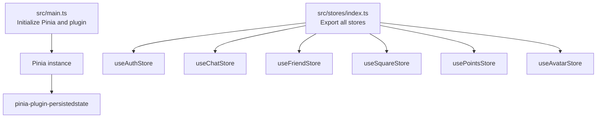
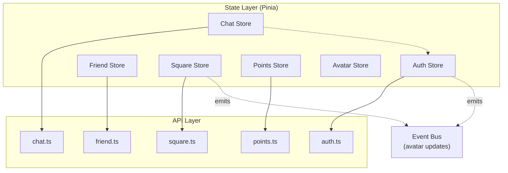
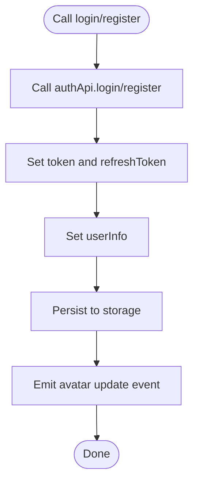
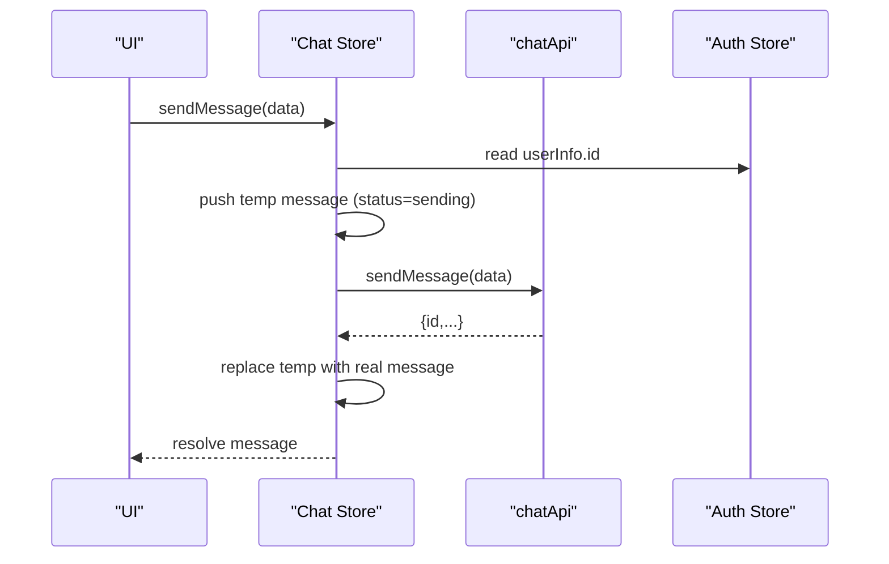
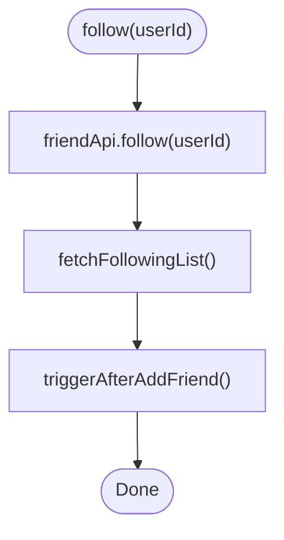
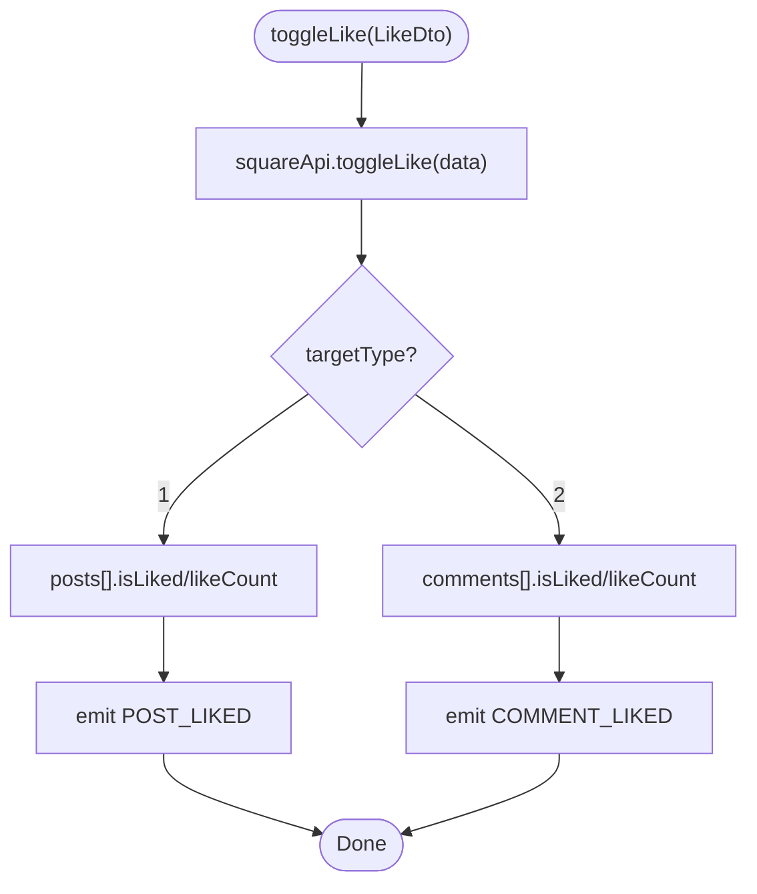
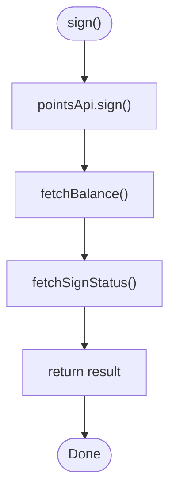
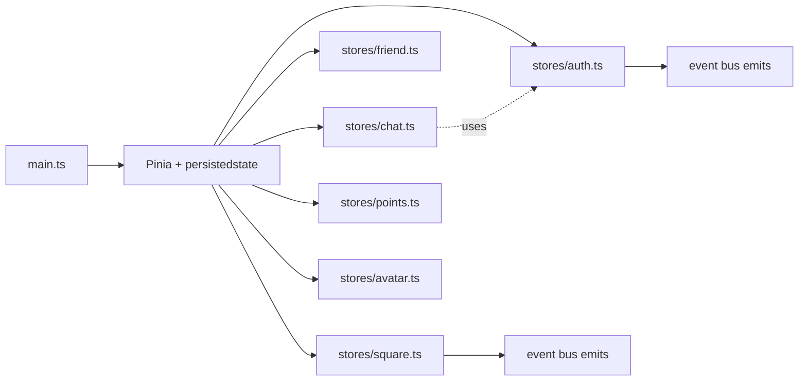

# State Management

<cite>
**Referenced Files in This Document**
- [main.ts](file://src/main.ts)
- [stores/index.ts](file://src/stores/index.ts)
- [stores/auth.ts](file://src/stores/auth.ts)
- [stores/chat.ts](file://src/stores/chat.ts)
- [stores/friend.ts](file://src/stores/friend.ts)
- [stores/square.ts](file://src/stores/square.ts)
- [stores/points.ts](file://src/stores/points.ts)
- [stores/avatar.ts](file://src/stores/avatar.ts)
- [api/modules/auth.ts](file://src/api/modules/auth.ts)
- [api/modules/chat.ts](file://src/api/modules/chat.ts)
- [api/modules/friend.ts](file://src/api/modules/friend.ts)
- [api/modules/square.ts](file://src/api/modules/square.ts)
- [api/modules/points.ts](file://src/api/modules/points.ts)
- [types/api/backend-types.ts](file://src/types/api/backend-types.ts)
</cite>

## Table of Contents
1. [Introduction](#introduction)
2. [Project Structure](#project-structure)
3. [Core Components](#core-components)
4. [Architecture Overview](#architecture-overview)
5. [Detailed Component Analysis](#detailed-component-analysis)
6. [Dependency Analysis](#dependency-analysis)
7. [Performance Considerations](#performance-considerations)
8. [Troubleshooting Guide](#troubleshooting-guide)
9. [Conclusion](#conclusion)
10. [Appendices](#appendices)

## Introduction
This document explains the centralized state management architecture of the WeTogether platform built with Pinia. It covers store organization, responsibilities, state structure, actions, and reactivity patterns. It also documents persistence strategies, composition examples, async action patterns, subscriptions, debugging tips, performance optimization, and testing strategies. The stores covered include authentication, chat, friends, square (community), points, and avatar management.

## Project Structure
The state layer is organized under src/stores with a single barrel export for convenience. Pinia is initialized in the application bootstrap with persisted state enabled via a plugin.

**Diagram sources**
- [main.ts:1-18](file://src/main.ts#L1-L18)
- [stores/index.ts:1-5](file://src/stores/index.ts#L1-L5)

**Section sources**
- [main.ts:1-18](file://src/main.ts#L1-L18)
- [stores/index.ts:1-5](file://src/stores/index.ts#L1-L5)

## Core Components
- Authentication store: Manages tokens, refresh tokens, user info, login/logout, profile updates, and persistence.
- Chat store: Manages conversations, messages, unread counts, optimistic sends, and WebSocket-driven updates.
- Friends store: Manages friend lists, following lists, blocklist, friendship status, and actions like follow/unlock/delete/block.
- Square store: Manages posts, comments, pagination flags, likes, reports, and optimistic UI updates.
- Points store: Manages balance, sign-in status, logs, and pagination of log entries.
- Avatar store: Manages selected avatar option and persistence for user’s chosen avatar.

Persistence is enabled per-store using the persisted state plugin. Stores are composed and used across pages and components.

**Section sources**
- [stores/auth.ts:1-137](file://src/stores/auth.ts#L1-L137)
- [stores/chat.ts:1-234](file://src/stores/chat.ts#L1-L234)
- [stores/friend.ts:1-70](file://src/stores/friend.ts#L1-L70)
- [stores/square.ts:1-152](file://src/stores/square.ts#L1-L152)
- [stores/points.ts:1-72](file://src/stores/points.ts#L1-L72)
- [stores/avatar.ts:1-52](file://src/stores/avatar.ts#L1-L52)

## Architecture Overview
The stores integrate with API modules to fetch and mutate data. Reactive state updates drive UI rendering. Some stores depend on others (e.g., chat store depends on auth store for user identity). Persistence is configured per store.

**Diagram sources**
- [stores/auth.ts:1-137](file://src/stores/auth.ts#L1-L137)
- [stores/chat.ts:1-234](file://src/stores/chat.ts#L1-L234)
- [stores/friend.ts:1-70](file://src/stores/friend.ts#L1-L70)
- [stores/square.ts:1-152](file://src/stores/square.ts#L1-L152)
- [stores/points.ts:1-72](file://src/stores/points.ts#L1-L72)
- [api/modules/auth.ts:1-57](file://src/api/modules/auth.ts#L1-L57)
- [api/modules/chat.ts:1-42](file://src/api/modules/chat.ts#L1-L42)
- [api/modules/friend.ts:1-61](file://src/api/modules/friend.ts#L1-L61)
- [api/modules/square.ts:1-98](file://src/api/modules/square.ts#L1-L98)
- [api/modules/points.ts:1-55](file://src/api/modules/points.ts#L1-L55)

## Detailed Component Analysis

### Authentication Store
Responsibilities:
- Manage tokens and refresh tokens.
- Persist and initialize user session from storage.
- Perform login, registration, logout, and token refresh.
- Update user info and broadcast avatar-related events.

State structure:
- token: string
- refreshToken: string
- userInfo: UserInfo | null
- Computed: isLoggedIn

Actions:
- login(data): asynchronous login, persists tokens and user info.
- register(data): asynchronous registration, persists tokens and user info.
- logout(): clears tokens and user info from state and storage.
- refreshAccessToken(): refreshes access token and updates storage.
- init(): initializes state from persisted storage.
- updateUserInfo(info): updates local user info and emits avatar update event.
- updateProfile(data): updates profile and merges into local user info.

Persistence:
- Enabled via plugin configuration.

**Diagram sources**
- [stores/auth.ts:18-42](file://src/stores/auth.ts#L18-L42)
- [stores/auth.ts:79-117](file://src/stores/auth.ts#L79-L117)

**Section sources**
- [stores/auth.ts:1-137](file://src/stores/auth.ts#L1-L137)
- [api/modules/auth.ts:1-57](file://src/api/modules/auth.ts#L1-L57)

### Chat Store
Responsibilities:
- Manage conversations, current chat, messages, and unread count.
- Fetch conversations and message history.
- Optimistic send with temporary message replacement upon server confirmation.
- Handle incoming WebSocket messages and sent confirmations.
- Mark chats as read and maintain conversation metadata.

State structure:
- conversations: Conversation[]
- currentChat: Conversation | null
- messages: Message[]
- unreadCount: number

Actions:
- fetchConversations(): load conversations and normalize avatar fields.
- fetchHistory(userId, params?): load message history and flag isSelf.
- sendMessage(data): optimistic update, replace temp message with server response.
- markAsRead(userId): mark unread as read and reset conversation unread count.
- addMessage(message): add received message to current chat and update conversation metadata.
- confirmSentMessage(message): replace temporary message with confirmed message.
- setCurrentChat(chat): set current chat context.
- clearMessages(): clear message list.

**Diagram sources**
- [stores/chat.ts:50-90](file://src/stores/chat.ts#L50-L90)
- [stores/chat.ts:28-48](file://src/stores/chat.ts#L28-L48)
- [stores/chat.ts:160-210](file://src/stores/chat.ts#L160-L210)

**Section sources**
- [stores/chat.ts:1-234](file://src/stores/chat.ts#L1-L234)
- [api/modules/chat.ts:1-42](file://src/api/modules/chat.ts#L1-L42)

### Friends Store
Responsibilities:
- Maintain friend list, following list, and blocklist.
- Determine friendship status for a user.
- Follow/unfollow, unlock chat, delete friend, and manage blocklist.
- Trigger NPS after adding a friend.

State structure:
- friendList: Friend[]
- followingList: Friend[]
- blocklist: Friend[]

Actions:
- fetchFriendList(): load friend list.
- fetchFollowingList(): load following list.
- getFriendshipStatus(userId): query friendship status DTO.
- follow(userId): follow and refresh following list; trigger NPS.
- unlockChat(userId): unlock private chat.
- deleteFriend(userId): remove friend and refresh list.
- blockUser(userId, reason?): block user and refresh blocklist.
- fetchBlocklist(): load blocklist.

**Diagram sources**
- [stores/friend.ts:29-35](file://src/stores/friend.ts#L29-L35)

**Section sources**
- [stores/friend.ts:1-70](file://src/stores/friend.ts#L1-L70)
- [api/modules/friend.ts:1-61](file://src/api/modules/friend.ts#L1-L61)

### Square Store
Responsibilities:
- Manage posts feed, current post, comments, pagination flags, and loading state.
- Create/delete posts and comments.
- Fetch comments and replies.
- Toggle likes and emit like events.
- Report posts.

State structure:
- posts: Post[]
- currentPost: Post | null
- comments: Comment[]
- hasMore: boolean
- loading: boolean

Actions:
- fetchPosts(params?): load posts with pagination-aware merge.
- fetchPost(id): load a single post.
- createPost(data): create post and refresh feed.
- deletePost(id): remove post and update feed.
- fetchComments(postId, params?): load comments.
- createComment(data): create comment and increment comment counts.
- deleteComment(commentId, postId): delete comment and decrement counts.
- getReplies(commentId, params?): fetch replies.
- toggleLike(data): toggle like and update counts; emit events.
- report(data): submit report.

**Diagram sources**
- [stores/square.ts:95-128](file://src/stores/square.ts#L95-L128)

**Section sources**
- [stores/square.ts:1-152](file://src/stores/square.ts#L1-L152)
- [api/modules/square.ts:1-98](file://src/api/modules/square.ts#L1-L98)

### Points Store
Responsibilities:
- Track points balance, sign-in status, and logs.
- Fetch balance, sign-in status, sign-in, and paginated logs.

State structure:
- balance: PointsBalance
- signStatus: SignStatus
- logs: PointsLog[]
- totalLogs: number

Actions:
- fetchBalance(): load balance.
- fetchSignStatus(): load sign-in status.
- sign(): perform sign-in and refresh balance/status.
- fetchLogs(page, pageSize, type?): load logs with page-aware merge.

**Diagram sources**
- [stores/points.ts:31-41](file://src/stores/points.ts#L31-L41)

**Section sources**
- [stores/points.ts:1-72](file://src/stores/points.ts#L1-L72)
- [api/modules/points.ts:1-55](file://src/api/modules/points.ts#L1-L55)

### Avatar Store
Responsibilities:
- Manage selected avatar option (preset vs custom).
- Provide avatar display identifier (CSS class or URL).
- Persist selected avatar across sessions.

State structure:
- selectedAvatar: AvatarOption

Actions:
- setSelectedAvatar(avatar): set selected avatar.
- getAvatarUrl(): compute display identifier.

Persistence:
- Enabled via plugin configuration.

**Section sources**
- [stores/avatar.ts:1-52](file://src/stores/avatar.ts#L1-L52)

## Dependency Analysis
- Initialization: Pinia is installed in the app and the persisted state plugin is registered globally.
- Store exports: A barrel export aggregates all stores for convenient imports.
- Cross-store dependencies:
  - Chat store reads auth store for user identity to compute isSelf flags and route messages.
  - Auth store emits avatar update events consumed by other parts of the app.
  - Square store emits like events consumed by other parts of the app.

**Diagram sources**
- [main.ts:1-18](file://src/main.ts#L1-L18)
- [stores/index.ts:1-5](file://src/stores/index.ts#L1-L5)
- [stores/chat.ts:6](file://src/stores/chat.ts#L6)
- [stores/auth.ts:82-87](file://src/stores/auth.ts#L82-L87)
- [stores/square.ts:105-111](file://src/stores/square.ts#L105-L111)

**Section sources**
- [main.ts:1-18](file://src/main.ts#L1-L18)
- [stores/index.ts:1-5](file://src/stores/index.ts#L1-L5)
- [stores/chat.ts:6](file://src/stores/chat.ts#L6)
- [stores/auth.ts:82-87](file://src/stores/auth.ts#L82-L87)
- [stores/square.ts:105-111](file://src/stores/square.ts#L105-L111)

## Performance Considerations
- Prefer optimistic updates for immediate feedback (e.g., chat store pushes temporary messages and replaces them upon confirmation).
- Normalize and deduplicate data (e.g., chat store checks existing message IDs before adding).
- Paginate and merge lists carefully (e.g., square store appends or replaces depending on page).
- Debounce or throttle frequent UI updates (e.g., infinite scroll and feed refresh).
- Minimize reactive writes: batch updates when possible (e.g., update counters and flags together).
- Use computed derived state to avoid recomputing expensive values.
- Persist only necessary state to reduce storage overhead (e.g., avatar and auth stores are persisted).

[No sources needed since this section provides general guidance]

## Troubleshooting Guide
Common issues and remedies:
- Token refresh failures: The auth store’s refresh action catches errors and logs out the user; ensure refresh tokens are persisted and valid.
- Message duplication in chat: The chat store checks for existing message IDs before adding; verify IDs are unique and normalized.
- isSelf mismatch: The chat store converts sender/receiver IDs to numbers for comparison; ensure backend IDs are handled consistently.
- Like counts inconsistencies: The square store updates counts locally after toggling likes; verify target type and IDs match.
- Avatar not updating across the app: The auth store emits avatar update events; ensure listeners are attached and event names match.

**Section sources**
- [stores/auth.ts:54-71](file://src/stores/auth.ts#L54-L71)
- [stores/chat.ts:123-128](file://src/stores/chat.ts#L123-L128)
- [stores/chat.ts:36-47](file://src/stores/chat.ts#L36-L47)
- [stores/square.ts:99-104](file://src/stores/square.ts#L99-L104)
- [stores/auth.ts:82-87](file://src/stores/auth.ts#L82-L87)

## Conclusion
WeTogether’s state management leverages Pinia for centralized, reactive state with explicit stores for authentication, chat, friends, square, points, and avatar. Persistence is configured per store to optimize UX and reliability. Stores are designed around clear responsibilities, async actions, and optimistic updates where appropriate. Composition patterns and event emissions enable decoupled interactions across modules.

[No sources needed since this section summarizes without analyzing specific files]

## Appendices

### Store Composition Examples
- Using multiple stores in a component:
  - Import and use the auth store to guard routes and render user info.
  - Use the chat store to render conversations and handle sending messages.
  - Use the square store to render posts and handle likes and comments.
  - Use the points store to display balance and handle sign-ins.
  - Use the avatar store to select and display avatars.

- Async action patterns:
  - Wrap API calls in try/catch blocks and update state accordingly.
  - Use optimistic updates for immediate UI feedback, then reconcile with server responses.
  - Paginate lists by merging or replacing based on page number.

- Subscriptions and events:
  - Listen to avatar update events from the auth store to refresh avatar displays.
  - Listen to like events from the square store to update counters and animations.

[No sources needed since this section provides general guidance]

### Naming Conventions and Best Practices
- Store naming: use imperative verbs for actions (e.g., fetchX, createX, updateX, deleteX).
- State naming: use plural nouns for arrays (e.g., posts, comments) and singular for single entities (e.g., currentPost).
- Action naming: keep actions focused and atomic; expose only necessary methods.
- Persistence: enable persistence selectively for user preferences and session data.
- Type safety: align store state with backend DTOs and enums for compile-time safety.
- Cohesion: keep each store focused on a single domain area.

[No sources needed since this section provides general guidance]