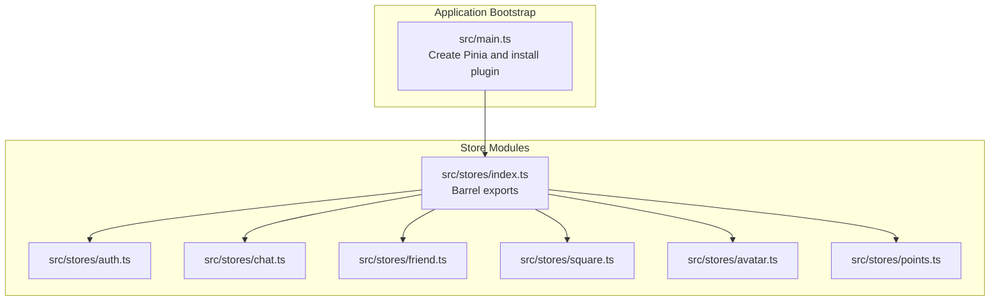
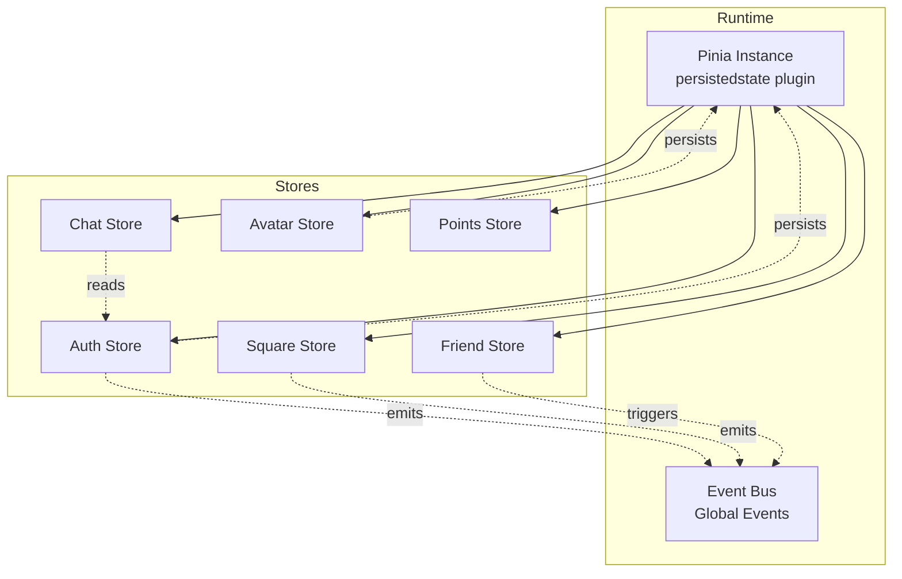
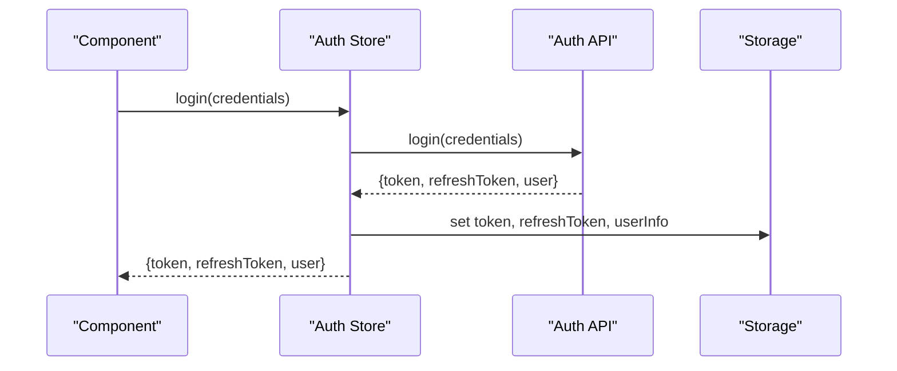
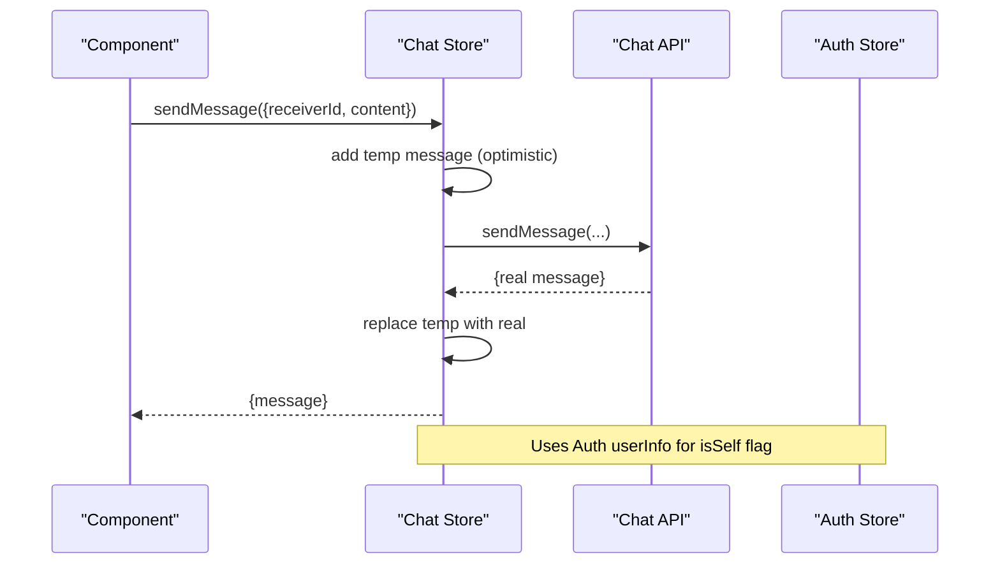
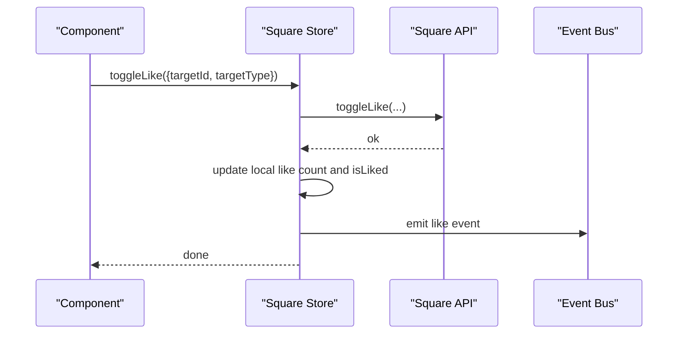
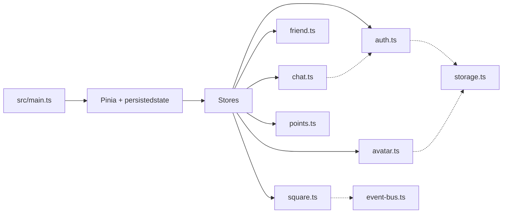

# Store Architecture Overview

<cite>
**Referenced Files in This Document**
- [main.ts](file://src/main.ts)
- [stores/index.ts](file://src/stores/index.ts)
- [auth.ts](file://src/stores/auth.ts)
- [chat.ts](file://src/stores/chat.ts)
- [friend.ts](file://src/stores/friend.ts)
- [square.ts](file://src/stores/square.ts)
- [avatar.ts](file://src/stores/avatar.ts)
- [points.ts](file://src/stores/points.ts)
- [event-bus.ts](file://src/utils/event-bus.ts)
- [storage.ts](file://src/utils/storage.ts)
</cite>

## Table of Contents
1. [Introduction](#introduction)
2. [Project Structure](#project-structure)
3. [Core Components](#core-components)
4. [Architecture Overview](#architecture-overview)
5. [Detailed Component Analysis](#detailed-component-analysis)
6. [Dependency Analysis](#dependency-analysis)
7. [Performance Considerations](#performance-considerations)
8. [Troubleshooting Guide](#troubleshooting-guide)
9. [Conclusion](#conclusion)
10. [Appendices](#appendices)

## Introduction
This document explains the Pinia store architecture used in the WeTogether platform. It covers centralized state management, store organization, inter-store communication, registration and persistence, reactive patterns, action composition, getter optimization, initialization and persistence mechanisms, debugging techniques, testing methodologies, performance considerations, and best practices for maintainable state management.

## Project Structure
Stores are organized under a dedicated folder and exported via a barrel index for convenient imports across the application. The Pinia instance is configured in the application bootstrap to enable persisted state support.

**Diagram sources**
- [main.ts:6-12](file://src/main.ts#L6-L12)
- [stores/index.ts:1-5](file://src/stores/index.ts#L1-L5)

**Section sources**
- [main.ts:1-18](file://src/main.ts#L1-L18)
- [stores/index.ts:1-5](file://src/stores/index.ts#L1-L5)

## Core Components
- Centralized state via Pinia with persisted state support.
- Modular stores per domain: authentication, chat, friends, social square, avatar selection, and points.
- Reactive state with actions for asynchronous updates and optimistic UI patterns.
- Inter-store communication via event bus and shared utilities.

Key store modules:
- Authentication store manages tokens, user info, login/register/logout, token refresh, and persistence.
- Chat store handles conversations, message history, real-time messaging, and unread counters.
- Friends store manages friend lists, follow/unfollow, blocklist, and unlock chat.
- Square store manages posts, comments, likes, and reporting.
- Avatar store manages selected avatar and persistence.
- Points store manages balance, sign-in status, logs pagination.

**Section sources**
- [auth.ts:9-136](file://src/stores/auth.ts#L9-L136)
- [chat.ts:8-233](file://src/stores/chat.ts#L8-L233)
- [friend.ts:7-69](file://src/stores/friend.ts#L7-L69)
- [square.ts:13-151](file://src/stores/square.ts#L13-L151)
- [avatar.ts:9-51](file://src/stores/avatar.ts#L9-L51)
- [points.ts:5-71](file://src/stores/points.ts#L5-L71)

## Architecture Overview
The store architecture follows a centralized, modular design:
- Application bootstraps Pinia and registers the persisted state plugin.
- Stores are defined with composable-style APIs using refs for state and functions for actions.
- Persistence is enabled per store using the persisted state plugin configuration.
- Cross-store communication leverages a global event bus and shared utilities.

**Diagram sources**
- [main.ts:8-10](file://src/main.ts#L8-L10)
- [auth.ts:133-135](file://src/stores/auth.ts#L133-L135)
- [avatar.ts:48-50](file://src/stores/avatar.ts#L48-L50)
- [event-bus.ts:40-48](file://src/utils/event-bus.ts#L40-L48)

## Detailed Component Analysis

### Authentication Store
- Purpose: Manage authentication lifecycle, user info, and persistence.
- Reactive state: token, refreshToken, userInfo.
- Actions: login, register, logout, refreshAccessToken, init, updateUserInfo, updateProfile.
- Persistence: enabled via persisted state configuration.
- Interactions: emits avatar update events; persists to storage; integrates with chat store via user info.

**Diagram sources**
- [auth.ts:18-42](file://src/stores/auth.ts#L18-L42)
- [auth.ts:24-26](file://src/stores/auth.ts#L24-L26)

**Section sources**
- [auth.ts:9-136](file://src/stores/auth.ts#L9-L136)

### Chat Store
- Purpose: Manage conversations, message history, and real-time messaging.
- Reactive state: conversations, currentChat, messages, unreadCount.
- Actions: fetchConversations, fetchHistory, sendMessage (optimistic), markAsRead, addMessage, confirmSentMessage, setCurrentChat, clearMessages.
- Interactions: depends on Auth store for user identity; updates unread counts and conversation metadata.

**Diagram sources**
- [chat.ts:50-90](file://src/stores/chat.ts#L50-L90)
- [chat.ts:28-47](file://src/stores/chat.ts#L28-L47)

**Section sources**
- [chat.ts:8-233](file://src/stores/chat.ts#L8-L233)

### Friends Store
- Purpose: Manage friend-related operations and lists.
- Reactive state: friendList, followingList, blocklist.
- Actions: fetchFriendList, fetchFollowingList, getFriendshipStatus, follow, unlockChat, deleteFriend, blockUser, fetchBlocklist.
- Interactions: triggers NPS after adding a friend.

**Section sources**
- [friend.ts:7-69](file://src/stores/friend.ts#L7-L69)

### Square Store
- Purpose: Manage posts, comments, likes, and reports.
- Reactive state: posts, currentPost, comments, hasMore, loading.
- Actions: fetchPosts, fetchPost, createPost, deletePost, fetchComments, createComment, deleteComment, getReplies, toggleLike, report.
- Interactions: emits like events; updates local counts for immediate UI feedback.

**Diagram sources**
- [square.ts:95-128](file://src/stores/square.ts#L95-L128)
- [event-bus.ts:40-48](file://src/utils/event-bus.ts#L40-L48)

**Section sources**
- [square.ts:13-151](file://src/stores/square.ts#L13-L151)

### Avatar Store
- Purpose: Manage selected avatar for registration/profile flows.
- Reactive state: selectedAvatar.
- Actions: setSelectedAvatar, getAvatarUrl.
- Persistence: enabled via persisted state configuration.

**Section sources**
- [avatar.ts:9-51](file://src/stores/avatar.ts#L9-L51)

### Points Store
- Purpose: Manage points balance, sign-in status, and logs.
- Reactive state: balance, signStatus, logs, totalLogs.
- Actions: fetchBalance, fetchSignStatus, sign, fetchLogs.
- Interactions: logs pagination with page-aware updates.

**Section sources**
- [points.ts:5-71](file://src/stores/points.ts#L5-L71)

## Dependency Analysis
- Registration: Pinia is installed in the application bootstrap and the persisted state plugin is registered.
- Barrel export: stores/index.ts re-exports all stores for easy consumption.
- Inter-store coupling:
  - Chat store depends on Auth store for user identity.
  - Square store emits events consumed by other parts of the app.
  - Avatar store and Auth store persist to storage for cross-session continuity.

**Diagram sources**
- [main.ts:8-10](file://src/main.ts#L8-L10)
- [stores/index.ts:1-5](file://src/stores/index.ts#L1-L5)
- [chat.ts:6](file://src/stores/chat.ts#L6)
- [event-bus.ts:40-48](file://src/utils/event-bus.ts#L40-L48)
- [storage.ts:1-26](file://src/utils/storage.ts#L1-L26)

**Section sources**
- [main.ts:1-18](file://src/main.ts#L1-L18)
- [stores/index.ts:1-5](file://src/stores/index.ts#L1-L5)

## Performance Considerations
- Reactive updates: Prefer minimal reactive state and batch updates to reduce reactivity overhead.
- Pagination: Square store uses page-aware log fetching to avoid large arrays; similar patterns can be applied elsewhere.
- Optimistic UI: Chat store adds temporary messages immediately and replaces them upon server confirmation to improve perceived latency.
- Debouncing and throttling: While not part of stores, components commonly use debounced actions to reduce redundant API calls.
- Persistence: Persisted state reduces cold-start reload work but consider selective persistence to minimize storage footprint.

[No sources needed since this section provides general guidance]

## Troubleshooting Guide
- Debugging state changes:
  - Use browser devtools to inspect Pinia state and actions.
  - Add targeted logging in store actions for visibility during development.
- Persistence issues:
  - Verify persisted state keys and migration strategies if schema changes occur.
  - Confirm storage availability and quota limits.
- Inter-store communication:
  - Ensure event bus listeners are registered before emitting events.
  - Validate event names and payload shapes.
- Error handling:
  - Wrap store actions in try/catch blocks and surface errors to components.
  - Log meaningful context alongside errors for faster diagnosis.

**Section sources**
- [auth.ts:113-117](file://src/stores/auth.ts#L113-L117)
- [points.ts:17-28](file://src/stores/points.ts#L17-L28)
- [event-bus.ts:6-36](file://src/utils/event-bus.ts#L6-L36)

## Conclusion
The WeTogether platform employs a clean, modular Pinia architecture with persisted state, reactive actions, and explicit inter-store communication via events. This design improves maintainability, enables predictable state transitions, and supports scalable growth across domains like authentication, chat, friends, social square, avatar selection, and points.

[No sources needed since this section summarizes without analyzing specific files]

## Appendices

### Store Registration and Naming Conventions
- Registration: Pinia instance is created and the persisted state plugin is installed in the application bootstrap.
- Naming: Store identifiers are lowercase and descriptive (e.g., “auth”, “chat”, “friend”, “square”, “avatar”, “points”).
- Exporting: A barrel index exports all stores for unified imports.

**Section sources**
- [main.ts:6-12](file://src/main.ts#L6-L12)
- [stores/index.ts:1-5](file://src/stores/index.ts#L1-L5)

### Reactive State Patterns and Action Composition
- Reactive state: Each store defines refs for state and returns them alongside actions.
- Action composition: Actions encapsulate API calls, update local state, and optionally emit events or persist data.
- Example patterns:
  - Authentication: login/update profile updates reactive state and persists to storage.
  - Chat: sendMessage performs optimistic UI updates and reconciles with server response.
  - Square: toggleLike updates local counts and emits events for global listeners.

**Section sources**
- [auth.ts:18-42](file://src/stores/auth.ts#L18-L42)
- [chat.ts:50-90](file://src/stores/chat.ts#L50-L90)
- [square.ts:95-128](file://src/stores/square.ts#L95-L128)

### Getter Optimization Strategies
- Computed getters: Prefer computed properties for derived data to minimize recomputation.
- Memoization: For expensive computations, cache results keyed by inputs.
- Selective updates: Keep state granular to limit the scope of reactive invalidations.

[No sources needed since this section provides general guidance]

### Store Initialization and Persistence Mechanisms
- Initialization: Stores can initialize from persisted storage on app start.
- Persistence: Enabled per store via persisted state configuration; storage utilities handle serialization.

**Section sources**
- [auth.ts:73-77](file://src/stores/auth.ts#L73-L77)
- [avatar.ts:48-50](file://src/stores/avatar.ts#L48-L50)
- [storage.ts:1-26](file://src/utils/storage.ts#L1-L26)

### Inter-Store Communication Patterns
- Event-driven: Emit and listen to global events for decoupled updates across stores.
- Shared utilities: Use shared utilities for cross-cutting concerns.

**Section sources**
- [event-bus.ts:40-48](file://src/utils/event-bus.ts#L40-L48)
- [auth.ts:79-88](file://src/stores/auth.ts#L79-L88)
- [square.ts:105-126](file://src/stores/square.ts#L105-L126)

### Testing Methodologies
- Unit tests for stores:
  - Mock API modules and assert state mutations and side effects.
  - Test action sequences (e.g., login -> persist -> update state).
- Integration tests:
  - Simulate cross-store interactions via event bus mocks.
- Snapshot persistence tests:
  - Verify persisted state is restored on initialization.

[No sources needed since this section provides general guidance]