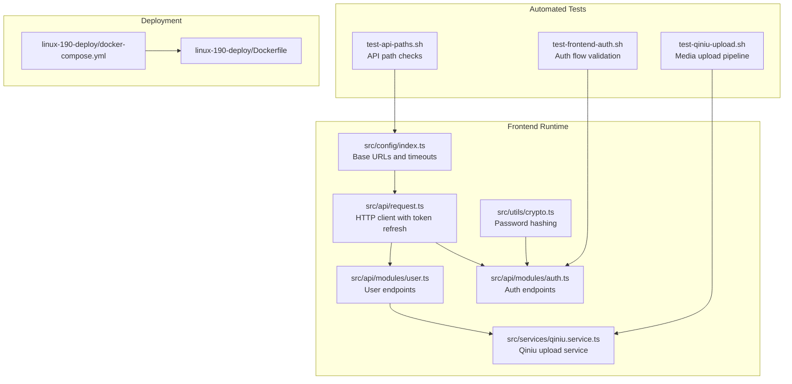
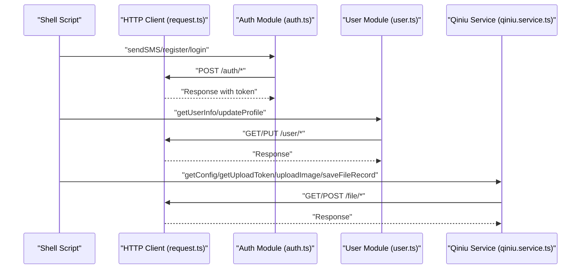
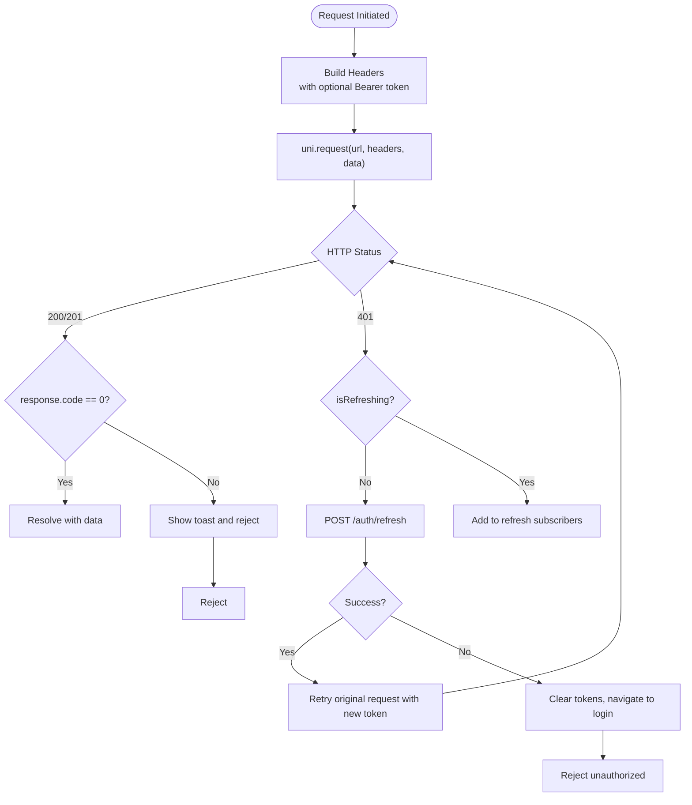
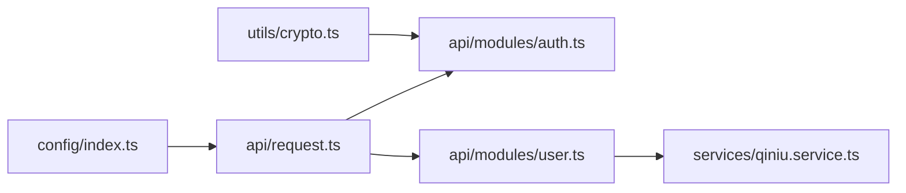

# Testing & Quality Assurance

<cite>
**Referenced Files in This Document**
- [package.json](file://package.json)
- [src/config/index.ts](file://src/config/index.ts)
- [src/api/request.ts](file://src/api/request.ts)
- [src/api/modules/auth.ts](file://src/api/modules/auth.ts)
- [src/api/modules/user.ts](file://src/api/modules/user.ts)
- [src/services/qiniu.service.ts](file://src/services/qiniu.service.ts)
- [src/utils/crypto.ts](file://src/utils/crypto.ts)
- [test-api-paths.sh](file://test-api-paths.sh)
- [test-frontend-auth.sh](file://test-frontend-auth.sh)
- [test-qiniu-upload.sh](file://test-qiniu-upload.sh)
- [linux-190-deploy/docker-compose.yml](file://linux-190-deploy/docker-compose.yml)
- [linux-190-deploy/Dockerfile](file://linux-190-deploy/Dockerfile)
</cite>

## Table of Contents
1. [Introduction](#introduction)
2. [Project Structure](#project-structure)
3. [Core Components](#core-components)
4. [Architecture Overview](#architecture-overview)
5. [Detailed Component Analysis](#detailed-component-analysis)
6. [Dependency Analysis](#dependency-analysis)
7. [Performance Considerations](#performance-considerations)
8. [Troubleshooting Guide](#troubleshooting-guide)
9. [Conclusion](#conclusion)
10. [Appendices](#appendices)

## Introduction
This document defines the testing and quality assurance strategy for the WeTogether platform. It covers unit tests, integration tests, and end-to-end testing approaches, and documents the automated testing scripts for API validation, frontend authentication, and media upload functionality. It also outlines quality assurance processes, code review standards, continuous integration practices, testing environment setup, test data management, performance testing procedures, accessibility and cross-platform compatibility considerations, and security vulnerability assessment.

## Project Structure
The frontend is a Vue 3 + UniApp project configured via Vite. The testing ecosystem leverages:
- Automated shell scripts for API and media upload validation
- Environment-driven base URLs and timeouts
- Centralized HTTP client with token refresh and retry logic
- Dedicated API modules for auth and user operations
- Media upload service integrating with Qiniu Cloud
- Crypto utilities for frontend password hashing

**Diagram sources**
- [src/config/index.ts:1-11](file://src/config/index.ts#L1-L11)
- [src/api/request.ts:1-228](file://src/api/request.ts#L1-L228)
- [src/api/modules/auth.ts:1-57](file://src/api/modules/auth.ts#L1-L57)
- [src/api/modules/user.ts:1-97](file://src/api/modules/user.ts#L1-L97)
- [src/services/qiniu.service.ts:1-126](file://src/services/qiniu.service.ts#L1-L126)
- [src/utils/crypto.ts:1-18](file://src/utils/crypto.ts#L1-L18)
- [test-api-paths.sh:1-35](file://test-api-paths.sh#L1-L35)
- [test-frontend-auth.sh:1-142](file://test-frontend-auth.sh#L1-L142)
- [test-qiniu-upload.sh:1-84](file://test-qiniu-upload.sh#L1-L84)
- [linux-190-deploy/docker-compose.yml:1-40](file://linux-190-deploy/docker-compose.yml#L1-L40)
- [linux-190-deploy/Dockerfile:1-18](file://linux-190-deploy/Dockerfile#L1-L18)

**Section sources**
- [package.json:1-100](file://package.json#L1-L100)
- [src/config/index.ts:1-11](file://src/config/index.ts#L1-L11)
- [src/api/request.ts:1-228](file://src/api/request.ts#L1-L228)
- [src/api/modules/auth.ts:1-57](file://src/api/modules/auth.ts#L1-L57)
- [src/api/modules/user.ts:1-97](file://src/api/modules/user.ts#L1-L97)
- [src/services/qiniu.service.ts:1-126](file://src/services/qiniu.service.ts#L1-L126)
- [src/utils/crypto.ts:1-18](file://src/utils/crypto.ts#L1-L18)
- [test-api-paths.sh:1-35](file://test-api-paths.sh#L1-L35)
- [test-frontend-auth.sh:1-142](file://test-frontend-auth.sh#L1-L142)
- [test-qiniu-upload.sh:1-84](file://test-qiniu-upload.sh#L1-L84)
- [linux-190-deploy/docker-compose.yml:1-40](file://linux-190-deploy/docker-compose.yml#L1-L40)
- [linux-190-deploy/Dockerfile:1-18](file://linux-190-deploy/Dockerfile#L1-L18)

## Core Components
- HTTP client with automatic token refresh and unified error handling
- Auth module exposing SMS, registration, login, password reset, refresh, and profile update APIs
- User module exposing profile, avatar upload, points, and blocking/reporting endpoints
- Qiniu service orchestrating upload token retrieval, compression/validation, upload, and record saving
- Crypto utility for frontend SHA256 password hashing prior to transport

Key testing touchpoints:
- API base URL correctness and duplication prevention
- Authentication flow with encrypted passwords and bearer tokens
- Media upload pipeline including token acquisition, upload, and record persistence

**Section sources**
- [src/api/request.ts:1-228](file://src/api/request.ts#L1-L228)
- [src/api/modules/auth.ts:1-57](file://src/api/modules/auth.ts#L1-L57)
- [src/api/modules/user.ts:1-97](file://src/api/modules/user.ts#L1-L97)
- [src/services/qiniu.service.ts:1-126](file://src/services/qiniu.service.ts#L1-L126)
- [src/utils/crypto.ts:1-18](file://src/utils/crypto.ts#L1-L18)

## Architecture Overview
The testing architecture integrates automated scripts with the runtime components to validate end-to-end flows.

**Diagram sources**
- [src/api/request.ts:1-228](file://src/api/request.ts#L1-L228)
- [src/api/modules/auth.ts:1-57](file://src/api/modules/auth.ts#L1-L57)
- [src/api/modules/user.ts:1-97](file://src/api/modules/user.ts#L1-L97)
- [src/services/qiniu.service.ts:1-126](file://src/services/qiniu.service.ts#L1-L126)

## Detailed Component Analysis

### API Path Validation Script
Purpose:
- Verify backend availability
- Inspect frontend API usage patterns
- Confirm baseURL configuration and avoid duplicated prefixes

Behavior highlights:
- Checks public endpoint reachability
- Grep-based inspection of request usage across auth, user, and points modules
- Validates base URL precedence and environment variable overrides

Operational guidance:
- Run after local backend is up
- Review logs for repeated base prefixes and correct expected concatenation

**Section sources**
- [test-api-paths.sh:1-35](file://test-api-paths.sh#L1-L35)
- [src/config/index.ts:1-11](file://src/config/index.ts#L1-L11)

### Frontend Authentication Flow Script
Purpose:
- Validate frontend password encryption and backend decryption
- End-to-end registration, login, and token validation
- Negative case handling for wrong credentials

Behavior highlights:
- Computes SHA256 locally and sends to backend
- Uses curl to trigger SMS, register, login, and fetch user info
- Verifies token validity via protected endpoint

Operational guidance:
- Requires a test phone number and backend reachable at configured base URL
- Ensure environment variables are set for the script’s base URL

**Section sources**
- [test-frontend-auth.sh:1-142](file://test-frontend-auth.sh#L1-L142)
- [src/utils/crypto.ts:1-18](file://src/utils/crypto.ts#L1-L18)
- [src/api/modules/auth.ts:1-57](file://src/api/modules/auth.ts#L1-L57)

### Qiniu Media Upload Pipeline Script
Purpose:
- Validate end-to-end media upload flow
- Obtain upload token, upload to cloud, and persist record

Behavior highlights:
- Logs in to obtain a bearer token
- Requests upload token and domain
- Saves file metadata and prints resulting URL composition

Operational guidance:
- Requires valid credentials and configured Qiniu backend endpoints
- Ensures proper cleanup and error reporting on failure

**Section sources**
- [test-qiniu-upload.sh:1-84](file://test-qiniu-upload.sh#L1-L84)
- [src/services/qiniu.service.ts:1-126](file://src/services/qiniu.service.ts#L1-L126)

### HTTP Client and Token Refresh
Key behaviors:
- Centralized headers injection including Authorization Bearer token
- Automatic token refresh on 401 with subscriber queueing to prevent concurrent refreshes
- Unified success/failure handling and toast feedback
- GET vs POST parameter handling

Testing implications:
- Unit tests should mock uni.request and token storage
- Integration tests should simulate network errors and 401 scenarios
- Coverage should include retry paths and subscriber queue behavior

**Diagram sources**
- [src/api/request.ts:1-228](file://src/api/request.ts#L1-L228)

**Section sources**
- [src/api/request.ts:1-228](file://src/api/request.ts#L1-L228)

### Auth Module Endpoints
Endpoints covered:
- SMS sending
- Registration
- Login
- Password reset
- Token refresh
- Current user update

Testing guidance:
- Validate request shapes and response codes
- Test invalid inputs and boundary conditions
- Verify token propagation in subsequent requests

**Section sources**
- [src/api/modules/auth.ts:1-57](file://src/api/modules/auth.ts#L1-L57)

### User Module Endpoints
Endpoints covered:
- Get current user
- Update user
- Update profile
- Get user points
- Get user profile by ID
- Upload avatar
- Change mobile
- Report user
- Block user

Testing guidance:
- Avatar upload requires multipart/form-data handling
- Profile updates should validate partial field updates
- Mobile change should enforce verification flow

**Section sources**
- [src/api/modules/user.ts:1-97](file://src/api/modules/user.ts#L1-L97)

### Qiniu Service
Key steps:
- Fetch upload configuration
- Validate file size and compress if needed
- Retrieve upload token and key
- Perform upload via uni.uploadFile
- Save file record to backend

Testing guidance:
- Mock uni.uploadFile and request calls
- Simulate upload failures and backend save errors
- Validate URL composition and returned keys

**Section sources**
- [src/services/qiniu.service.ts:1-126](file://src/services/qiniu.service.ts#L1-L126)

### Crypto Utility
Behavior:
- SHA256 hashing of plaintext password before transmission

Testing guidance:
- Compare hashed outputs against known vectors
- Validate backend decryption path

**Section sources**
- [src/utils/crypto.ts:1-18](file://src/utils/crypto.ts#L1-L18)

## Dependency Analysis
Runtime dependencies relevant to QA:
- HTTP client depends on environment-provided base URLs and timeouts
- Auth and user modules depend on the HTTP client
- Qiniu service depends on the HTTP client and image compression utilities
- Scripts depend on environment variables and external services

**Diagram sources**
- [src/config/index.ts:1-11](file://src/config/index.ts#L1-L11)
- [src/api/request.ts:1-228](file://src/api/request.ts#L1-L228)
- [src/api/modules/auth.ts:1-57](file://src/api/modules/auth.ts#L1-L57)
- [src/api/modules/user.ts:1-97](file://src/api/modules/user.ts#L1-L97)
- [src/services/qiniu.service.ts:1-126](file://src/services/qiniu.service.ts#L1-L126)
- [src/utils/crypto.ts:1-18](file://src/utils/crypto.ts#L1-L18)

**Section sources**
- [src/config/index.ts:1-11](file://src/config/index.ts#L1-L11)
- [src/api/request.ts:1-228](file://src/api/request.ts#L1-L228)
- [src/api/modules/auth.ts:1-57](file://src/api/modules/auth.ts#L1-L57)
- [src/api/modules/user.ts:1-97](file://src/api/modules/user.ts#L1-L97)
- [src/services/qiniu.service.ts:1-126](file://src/services/qiniu.service.ts#L1-L126)
- [src/utils/crypto.ts:1-18](file://src/utils/crypto.ts#L1-L18)

## Performance Considerations
- Network latency and timeout tuning: adjust timeout in configuration for slow environments
- Token refresh concurrency: ensure single refresh operation prevents thundering herd
- Image compression and upload retries: configure retry policies and progress callbacks
- Load testing: simulate concurrent users for auth and upload endpoints

[No sources needed since this section provides general guidance]

## Troubleshooting Guide
Common issues and resolutions:
- Duplicate base URL prefixes: scripts flag repeated base paths; ensure baseURL does not include trailing slash and endpoint paths do not start with slash
- Authentication failures: verify encrypted password matches backend expectations and bearer token is attached to requests
- Upload failures: confirm upload token validity, domain correctness, and successful backend record save
- Health checks: deployment compose exposes health check for frontend container readiness

**Section sources**
- [test-api-paths.sh:31-34](file://test-api-paths.sh#L31-L34)
- [test-frontend-auth.sh:105-111](file://test-frontend-auth.sh#L105-L111)
- [test-qiniu-upload.sh:42-46](file://test-qiniu-upload.sh#L42-L46)
- [linux-190-deploy/docker-compose.yml:18-23](file://linux-190-deploy/docker-compose.yml#L18-L23)

## Conclusion
The WeTogether platform employs a pragmatic testing strategy combining automated scripts with centralized HTTP client logic and dedicated service modules. By validating API paths, authentication flows, and media uploads, teams can maintain reliability across environments. Continuous improvement should focus on expanding unit and integration tests, establishing CI pipelines, and incorporating accessibility and security assessments.

[No sources needed since this section summarizes without analyzing specific files]

## Appendices

### Testing Strategy Overview
- Unit tests: Validate individual modules (crypto, upload service, request client)
- Integration tests: Validate module interactions (auth + request, user + request, qiniu + request)
- End-to-end tests: Automate real user journeys using scripts and CI jobs

[No sources needed since this section provides general guidance]

### Automated Testing Scripts Reference
- API path validation: [test-api-paths.sh](file://test-api-paths.sh)
- Frontend authentication: [test-frontend-auth.sh](file://test-frontend-auth.sh)
- Qiniu upload pipeline: [test-qiniu-upload.sh](file://test-qiniu-upload.sh)

**Section sources**
- [test-api-paths.sh:1-35](file://test-api-paths.sh#L1-L35)
- [test-frontend-auth.sh:1-142](file://test-frontend-auth.sh#L1-L142)
- [test-qiniu-upload.sh:1-84](file://test-qiniu-upload.sh#L1-L84)

### Environment Setup and CI Practices
- Environment variables: VITE_APP_API_BASE_URL, VITE_APP_WS_BASE_URL, VITE_APP_BASE_URL
- Build and dev scripts: see package.json scripts for platform targets
- Deployment: Nginx containerization with health checks

**Section sources**
- [src/config/index.ts:1-11](file://src/config/index.ts#L1-L11)
- [package.json:1-100](file://package.json#L1-L100)
- [linux-190-deploy/docker-compose.yml:1-40](file://linux-190-deploy/docker-compose.yml#L1-L40)
- [linux-190-deploy/Dockerfile:1-18](file://linux-190-deploy/Dockerfile#L1-L18)

### Accessibility and Cross-Platform Compatibility
- Accessibility: Validate keyboard navigation, screen reader support, and color contrast in target platforms
- Cross-platform: Test on supported UniApp targets (H5, mini-programs) and devices/emulators

[No sources needed since this section provides general guidance]

### Security Vulnerability Assessment
- Transport security: HTTPS enforcement in deployment and environment variables
- Input sanitization: Validate all endpoints and enforce strict schemas
- Secrets management: Avoid embedding secrets in scripts or configs

**Section sources**
- [linux-190-deploy/docker-compose.yml:18-23](file://linux-190-deploy/docker-compose.yml#L18-L23)