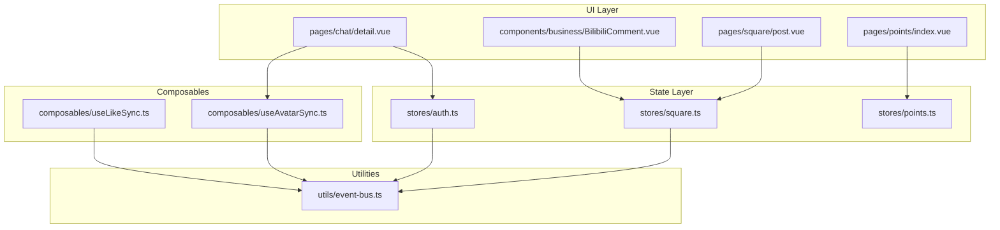
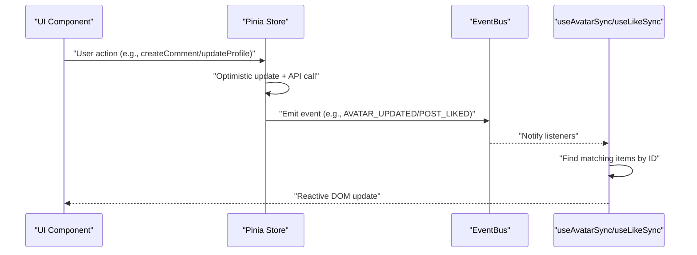
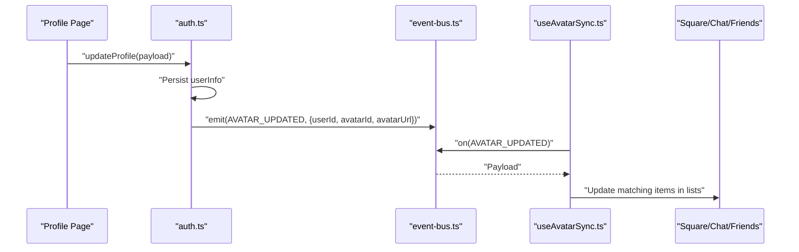
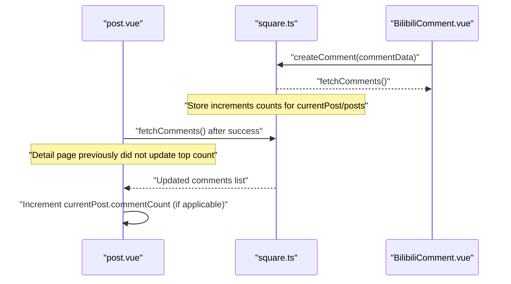
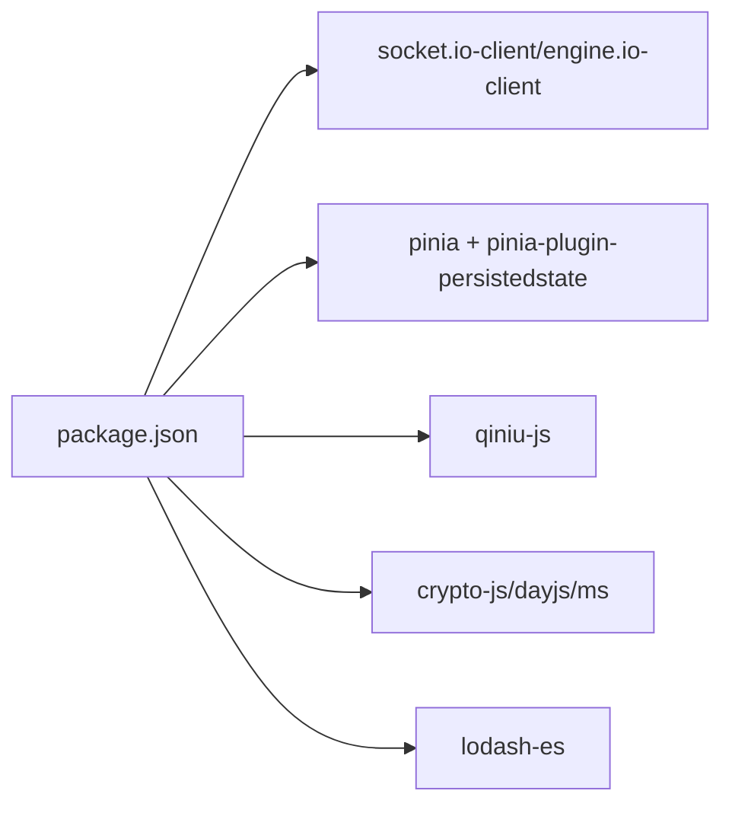

# Troubleshooting & FAQ

<cite>
**Referenced Files in This Document**
- [avatar-sync-solution.md](file://docs/fix-deploy/avatar-sync-solution.md)
- [comment-count-sync.md](file://docs/fix-deploy/comment-count-sync.md)
- [points-list-pagination.md](file://docs/fix-deploy/points-list-pagination.md)
- [AVATAR_PLAN.md](file://docs/AVATAR_PLAN.md)
- [scrollbar-fix-final.md](file://docs/scrollbar-fix-final.md)
- [send-button-optimization.md](file://docs/send-button-optimization.md)
- [useAvatarSync.ts](file://src/composables/useAvatarSync.ts)
- [event-bus.ts](file://src/utils/event-bus.ts)
- [auth.ts](file://src/stores/auth.ts)
- [square.ts](file://src/stores/square.ts)
- [points.ts](file://src/stores/points.ts)
- [post.vue](file://src/pages/square/post.vue)
- [index.vue (points)](file://src/pages/points/index.vue)
- [BilibiliComment.vue](file://src/components/business/BilibiliComment.vue)
- [detail.vue (chat)](file://src/pages/chat/detail.vue)
- [useLikeSync.ts](file://src/composables/useLikeSync.ts)
- [package.json](file://package.json)
</cite>

## Table of Contents
1. [Introduction](#introduction)
2. [Project Structure](#project-structure)
3. [Core Components](#core-components)
4. [Architecture Overview](#architecture-overview)
5. [Detailed Component Analysis](#detailed-component-analysis)
6. [Dependency Analysis](#dependency-analysis)
7. [Performance Considerations](#performance-considerations)
8. [Troubleshooting Guide](#troubleshooting-guide)
9. [FAQ](#faq)
10. [Conclusion](#conclusion)

## Introduction
This document provides comprehensive troubleshooting and FAQ guidance for the WeTogether platform. It focuses on resolving common issues around avatar synchronization, comment count synchronization, points list pagination, and UI optimization. It also covers debugging techniques, error diagnosis, resolution strategies for development and production, performance optimization, memory leak prevention, cross-platform compatibility, logging strategies, error monitoring, and user support procedures.

## Project Structure
The platform is a Vue 3 + UniApp project using Pinia for state management, with modularized stores, composables, and business components. Key areas relevant to troubleshooting:
- Stores: auth, square, points, chat
- Composables: useAvatarSync, useLikeSync, useDebounce, useNetworkStatus
- Utilities: event bus, websocket, format/validation/storage
- Pages: square/post, points/index, chat/detail
- Business components: BilibiliComment, MessageBubble, AvatarDisplay, AvatarSelector



**Diagram sources**
- [post.vue:1-318](file://src/pages/square/post.vue#L1-L318)
- [index.vue (points):1-347](file://src/pages/points/index.vue#L1-L347)
- [detail.vue (chat):1-299](file://src/pages/chat/detail.vue#L1-L299)
- [BilibiliComment.vue:1-741](file://src/components/business/BilibiliComment.vue#L1-L741)
- [auth.ts:1-137](file://src/stores/auth.ts#L1-L137)
- [square.ts:1-152](file://src/stores/square.ts#L1-L152)
- [points.ts:1-72](file://src/stores/points.ts#L1-L72)
- [useAvatarSync.ts:1-72](file://src/composables/useAvatarSync.ts#L1-L72)
- [useLikeSync.ts:1-49](file://src/composables/useLikeSync.ts#L1-L49)
- [event-bus.ts:1-49](file://src/utils/event-bus.ts#L1-L49)

**Section sources**
- [post.vue:1-318](file://src/pages/square/post.vue#L1-L318)
- [index.vue (points):1-347](file://src/pages/points/index.vue#L1-L347)
- [detail.vue (chat):1-299](file://src/pages/chat/detail.vue#L1-L299)
- [BilibiliComment.vue:1-741](file://src/components/business/BilibiliComment.vue#L1-L741)
- [auth.ts:1-137](file://src/stores/auth.ts#L1-L137)
- [square.ts:1-152](file://src/stores/square.ts#L1-L152)
- [points.ts:1-72](file://src/stores/points.ts#L1-L72)
- [useAvatarSync.ts:1-72](file://src/composables/useAvatarSync.ts#L1-L72)
- [useLikeSync.ts:1-49](file://src/composables/useLikeSync.ts#L1-L49)
- [event-bus.ts:1-49](file://src/utils/event-bus.ts#L1-L49)

## Core Components
- Global event bus: centralized pub/sub for cross-component updates (avatar, likes, follows).
- Avatar sync composable: listens to global avatar updates and synchronizes user avatars across lists.
- Square store: manages posts, comments, likes, and comment count updates.
- Points store: manages balance, sign status, and paginated logs.
- Chat page: integrates avatar sync for sender avatars and handles message scrolling and retry.

Key implementation references:
- Avatar sync hook and event emission: [useAvatarSync.ts:1-72](file://src/composables/useAvatarSync.ts#L1-L72), [event-bus.ts:1-49](file://src/utils/event-bus.ts#L1-L49), [auth.ts:79-117](file://src/stores/auth.ts#L79-L117)
- Comment count sync and optimistic updates: [square.ts:61-88](file://src/stores/square.ts#L61-L88), [post.vue:105-132](file://src/pages/square/post.vue#L105-L132), [BilibiliComment.vue:240-283](file://src/components/business/BilibiliComment.vue#L240-L283)
- Points logs pagination: [points.ts:43-58](file://src/stores/points.ts#L43-L58), [index.vue (points):95-125](file://src/pages/points/index.vue#L95-L125)

**Section sources**
- [useAvatarSync.ts:1-72](file://src/composables/useAvatarSync.ts#L1-L72)
- [event-bus.ts:1-49](file://src/utils/event-bus.ts#L1-L49)
- [auth.ts:79-117](file://src/stores/auth.ts#L79-L117)
- [square.ts:61-88](file://src/stores/square.ts#L61-L88)
- [post.vue:105-132](file://src/pages/square/post.vue#L105-L132)
- [BilibiliComment.vue:240-283](file://src/components/business/BilibiliComment.vue#L240-L283)
- [points.ts:43-58](file://src/stores/points.ts#L43-L58)
- [index.vue (points):95-125](file://src/pages/points/index.vue#L95-L125)

## Architecture Overview
The platform uses a unidirectional data flow with optimistic UI updates and centralized event-driven synchronization:
- UI triggers actions (e.g., comment creation, avatar update).
- Stores orchestrate API calls and local state updates.
- Event bus broadcasts changes to subscribed components.
- Composables listen to events and update lists reactively.



**Diagram sources**
- [square.ts:95-128](file://src/stores/square.ts#L95-L128)
- [auth.ts:79-117](file://src/stores/auth.ts#L79-L117)
- [event-bus.ts:1-49](file://src/utils/event-bus.ts#L1-L49)
- [useAvatarSync.ts:1-72](file://src/composables/useAvatarSync.ts#L1-L72)
- [useLikeSync.ts:1-49](file://src/composables/useLikeSync.ts#L1-L49)

## Detailed Component Analysis

### Avatar Synchronization
Problem: After uploading a new avatar, only the logged-in user’s profile updates locally; other lists (posts, chats, friends) still show cached avatars.
Solution: Centralized event-driven avatar sync via a composable and event bus.



- Implementation references:
  - Emitting avatar updates: [auth.ts:79-117](file://src/stores/auth.ts#L79-L117)
  - Listening and updating lists: [useAvatarSync.ts:1-72](file://src/composables/useAvatarSync.ts#L1-L72)
  - Event constants: [event-bus.ts:40-48](file://src/utils/event-bus.ts#L40-L48)
  - Chat avatar sync usage: [detail.vue (chat):64-69](file://src/pages/chat/detail.vue#L64-L69)

**Diagram sources**
- [auth.ts:79-117](file://src/stores/auth.ts#L79-L117)
- [useAvatarSync.ts:1-72](file://src/composables/useAvatarSync.ts#L1-L72)
- [event-bus.ts:40-48](file://src/utils/event-bus.ts#L40-L48)
- [detail.vue (chat):64-69](file://src/pages/chat/detail.vue#L64-L69)

**Section sources**
- [avatar-sync-solution.md:1-159](file://docs/fix-deploy/avatar-sync-solution.md#L1-L159)
- [AVATAR_PLAN.md:1-475](file://docs/AVATAR_PLAN.md#L1-L475)
- [auth.ts:79-117](file://src/stores/auth.ts#L79-L117)
- [useAvatarSync.ts:1-72](file://src/composables/useAvatarSync.ts#L1-L72)
- [event-bus.ts:40-48](file://src/utils/event-bus.ts#L40-L48)
- [detail.vue (chat):64-69](file://src/pages/chat/detail.vue#L64-L69)

### Comment Count Synchronization
Problem: After posting a comment, the top-level comment count does not update until refresh.
Fix: Optimistically increment the comment count in the post detail and ensure store-level updates are consistent.



- Implementation references:
  - Store comment count updates: [square.ts:61-88](file://src/stores/square.ts#L61-L88)
  - Detail page comment success handler: [post.vue:105-132](file://src/pages/square/post.vue#L105-L132)
  - Comment component submission: [BilibiliComment.vue:240-283](file://src/components/business/BilibiliComment.vue#L240-L283)

**Diagram sources**
- [post.vue:105-132](file://src/pages/square/post.vue#L105-L132)
- [square.ts:61-88](file://src/stores/square.ts#L61-L88)
- [BilibiliComment.vue:240-283](file://src/components/business/BilibiliComment.vue#L240-L283)

**Section sources**
- [comment-count-sync.md:1-266](file://docs/fix-deploy/comment-count-sync.md#L1-L266)
- [post.vue:105-132](file://src/pages/square/post.vue#L105-L132)
- [square.ts:61-88](file://src/stores/square.ts#L61-L88)
- [BilibiliComment.vue:240-283](file://src/components/business/BilibiliComment.vue#L240-L283)

### Points List Pagination
Problem: Only the latest 20 logs were shown; historical records were missing, causing discrepancy between “all logs sum” and “total earned.”
Fix: Add pagination controls and append-mode loading for logs.

```mermaid
flowchart TD
Start(["Open Points Logs"]) --> LoadFirst["Load page 1, size 20"]
LoadFirst --> HasMore{"Has more data?"}
HasMore --> |Yes| ScrollToLower["User scrolls to bottom"]
ScrollToLower --> IncPage["currentPage++"]
IncPage --> LoadNext["Load next page (append)"]
LoadNext --> HasMore
HasMore --> |No| Done(["Show 'no more']")
style Done fill:#fff,stroke:#333,color:#000
```

- Implementation references:
  - Store pagination logic: [points.ts:43-58](file://src/stores/points.ts#L43-L58)
  - UI pagination and scroll handling: [index.vue (points):41-125](file://src/pages/points/index.vue#L41-L125)

**Diagram sources**
- [points.ts:43-58](file://src/stores/points.ts#L43-L58)
- [index.vue (points):41-125](file://src/pages/points/index.vue#L41-L125)

**Section sources**
- [points-list-pagination.md:1-346](file://docs/fix-deploy/points-list-pagination.md#L1-L346)
- [points.ts:43-58](file://src/stores/points.ts#L43-L58)
- [index.vue (points):41-125](file://src/pages/points/index.vue#L41-L125)

### UI Optimization Challenges
- Scrollbars reappearing after fixes: ensure `:show-scrollbar="false"` on scroll containers.
- Inconsistent send button styles: unify gradient, radius, shadow, and press animations.
- Chat layout fixed header/footer with scrollable middle area.

References:
- Scrollbar fixes: [scrollbar-fix-final.md:1-68](file://docs/scrollbar-fix-final.md#L1-L68)
- Send button optimization: [send-button-optimization.md:1-358](file://docs/send-button-optimization.md#L1-L358)
- Chat layout and send button: [detail.vue (chat):1-299](file://src/pages/chat/detail.vue#L1-L299)

**Section sources**
- [scrollbar-fix-final.md:1-68](file://docs/scrollbar-fix-final.md#L1-L68)
- [send-button-optimization.md:1-358](file://docs/send-button-optimization.md#L1-L358)
- [detail.vue (chat):1-299](file://src/pages/chat/detail.vue#L1-L299)

## Dependency Analysis
External libraries and integrations relevant to troubleshooting:
- Socket.IO/WebSocket for real-time messaging
- Pinia with persisted state
- Qiniu SDK for image uploads
- Crypto, dayjs, debug, lodash-es



**Diagram sources**
- [package.json:45-98](file://package.json#L45-L98)

**Section sources**
- [package.json:45-98](file://package.json#L45-L98)

## Performance Considerations
- Prefer optimistic UI updates with rollback on failure to reduce perceived latency.
- Use event-driven synchronization (event bus) to avoid redundant network requests.
- Virtualize long lists (future enhancement) and implement skeleton screens for initial loads.
- Debounce rapid actions (e.g., send buttons) to prevent duplicate submissions.
- Minimize deep reactivity updates by targeting only changed fields.

[No sources needed since this section provides general guidance]

## Troubleshooting Guide

### Avatar Not Updating Across Lists
Symptoms:
- Uploading a new avatar updates profile but not posts, chats, or friends.

Steps:
1. Verify avatar update emits event:
   - Check [auth.ts:79-117](file://src/stores/auth.ts#L79-L117) for event emission.
2. Confirm listeners are attached:
   - Ensure [useAvatarSync.ts:60-66](file://src/composables/useAvatarSync.ts#L60-L66) registers on mount.
3. Validate payload fields:
   - Confirm [event-bus.ts:40-48](file://src/utils/event-bus.ts#L40-L48) constants match emitted payload.
4. Test on affected pages:
   - Posts: [post.vue:67-71](file://src/pages/square/post.vue#L67-L71)
   - Chat: [detail.vue (chat):64-69](file://src/pages/chat/detail.vue#L64-L69)
   - Friends: [useAvatarSync.ts:18-23](file://src/composables/useAvatarSync.ts#L18-L23) options mapping.

Resolution:
- Apply the unified avatar sync pattern described in [avatar-sync-solution.md:1-159](file://docs/fix-deploy/avatar-sync-solution.md#L1-L159).

**Section sources**
- [auth.ts:79-117](file://src/stores/auth.ts#L79-L117)
- [useAvatarSync.ts:1-72](file://src/composables/useAvatarSync.ts#L1-L72)
- [event-bus.ts:40-48](file://src/utils/event-bus.ts#L40-L48)
- [post.vue:67-71](file://src/pages/square/post.vue#L67-L71)
- [detail.vue (chat):64-69](file://src/pages/chat/detail.vue#L64-L69)
- [avatar-sync-solution.md:1-159](file://docs/fix-deploy/avatar-sync-solution.md#L1-L159)

### Comment Count Not Incrementing
Symptoms:
- After commenting, top-level comment count remains unchanged.

Steps:
1. Confirm store increments counts:
   - See [square.ts:61-88](file://src/stores/square.ts#L61-L88).
2. Ensure detail page updates top count:
   - Review [post.vue:105-132](file://src/pages/square/post.vue#L105-L132).
3. Validate comment component emits success:
   - See [BilibiliComment.vue:240-283](file://src/components/business/BilibiliComment.vue#L240-L283).

Resolution:
- Follow the fix documented in [comment-count-sync.md:1-266](file://docs/fix-deploy/comment-count-sync.md#L1-L266).

**Section sources**
- [square.ts:61-88](file://src/stores/square.ts#L61-L88)
- [post.vue:105-132](file://src/pages/square/post.vue#L105-L132)
- [BilibiliComment.vue:240-283](file://src/components/business/BilibiliComment.vue#L240-L283)
- [comment-count-sync.md:1-266](file://docs/fix-deploy/comment-count-sync.md#L1-L266)

### Points Logs Missing History
Symptoms:
- Only latest 20 logs appear; totals mismatch.

Steps:
1. Check pagination logic:
   - [points.ts:43-58](file://src/stores/points.ts#L43-L58)
2. Verify UI scroll and load-more:
   - [index.vue (points):41-125](file://src/pages/points/index.vue#L41-L125)

Resolution:
- Apply pagination fix per [points-list-pagination.md:1-346](file://docs/fix-deploy/points-list-pagination.md#L1-L346).

**Section sources**
- [points.ts:43-58](file://src/stores/points.ts#L43-L58)
- [index.vue (points):41-125](file://src/pages/points/index.vue#L41-L125)
- [points-list-pagination.md:1-346](file://docs/fix-deploy/points-list-pagination.md#L1-L346)

### Scrollbar Reappears or Chat Layout Issues
Symptoms:
- Scrollbars visible again after fixes.
- Chat header/footer fixed with scrollable middle.

Steps:
1. Ensure `:show-scrollbar="false"` on scroll containers:
   - Refer to [scrollbar-fix-final.md:1-68](file://docs/scrollbar-fix-final.md#L1-L68).
2. Confirm chat layout uses fixed header/footer with scrollable middle:
   - See [detail.vue (chat):1-299](file://src/pages/chat/detail.vue#L1-L299).

**Section sources**
- [scrollbar-fix-final.md:1-68](file://docs/scrollbar-fix-final.md#L1-L68)
- [detail.vue (chat):1-299](file://src/pages/chat/detail.vue#L1-L299)

### Inconsistent Send Button Styles
Symptoms:
- Different send button visuals across components.

Steps:
1. Unify styles using the standard specification:
   - See [send-button-optimization.md:1-358](file://docs/send-button-optimization.md#L1-L358).
2. Apply to components:
   - BilibiliComment: [BilibiliComment.vue:480-514](file://src/components/business/BilibiliComment.vue#L480-L514)
   - CommentInput: [BilibiliComment.vue:518-576](file://src/components/business/BilibiliComment.vue#L518-L576)
   - Chat detail: [detail.vue (chat):260-284](file://src/pages/chat/detail.vue#L260-L284)

**Section sources**
- [send-button-optimization.md:1-358](file://docs/send-button-optimization.md#L1-L358)
- [BilibiliComment.vue:480-514](file://src/components/business/BilibiliComment.vue#L480-L514)
- [BilibiliComment.vue:518-576](file://src/components/business/BilibiliComment.vue#L518-L576)
- [detail.vue (chat):260-284](file://src/pages/chat/detail.vue#L260-L284)

### Debugging Techniques and Error Diagnosis
- Logging:
  - Use console.error for failed API calls and UI errors (e.g., [post.vue:118-124](file://src/pages/square/post.vue#L118-L124), [index.vue (points):110-114](file://src/pages/points/index.vue#L110-L114)).
- Rollback on failure:
  - Implement optimistic updates with rollback (e.g., [post.vue:84-98](file://src/pages/square/post.vue#L84-L98), [BilibiliComment.vue:360-384](file://src/components/business/BilibiliComment.vue#L360-L384)).
- Network checks:
  - Use composables for pre-action checks (e.g., [BilibiliComment.vue:241-243](file://src/components/business/BilibiliComment.vue#L241-L243)).
- Event-driven verification:
  - Confirm event emission and listener registration (e.g., [auth.ts:79-117](file://src/stores/auth.ts#L79-L117), [useAvatarSync.ts:60-66](file://src/composables/useAvatarSync.ts#L60-L66)).

**Section sources**
- [post.vue:84-124](file://src/pages/square/post.vue#L84-L124)
- [BilibiliComment.vue:241-384](file://src/components/business/BilibiliComment.vue#L241-L384)
- [auth.ts:79-117](file://src/stores/auth.ts#L79-L117)
- [useAvatarSync.ts:60-66](file://src/composables/useAvatarSync.ts#L60-L66)

### Resolution Strategies for Dev and Production
- Development:
  - Enable verbose logging and breakpoints around store actions and event emissions.
  - Use optimistic updates with immediate rollback to simulate failures.
- Production:
  - Centralize error reporting via toast notifications and structured logs.
  - Monitor event bus subscribers to prevent orphaned listeners.
  - Validate pagination and count updates server-side to ensure correctness.

[No sources needed since this section provides general guidance]

### Cross-Platform Compatibility
- UniApp targets multiple platforms; ensure platform-specific code paths are guarded (e.g., share APIs in [post.vue:194-231](file://src/pages/square/post.vue#L194-L231)).
- Styles and scroll behavior may vary; test on target platforms and adjust scroll configurations accordingly.

**Section sources**
- [post.vue:194-231](file://src/pages/square/post.vue#L194-L231)

### Logging Strategies and Error Monitoring
- Console logging for failed operations (e.g., [post.vue:118-124](file://src/pages/square/post.vue#L118-L124), [index.vue (points):110-114](file://src/pages/points/index.vue#L110-L114)).
- Toast notifications for user-visible errors (e.g., [post.vue:148-153](file://src/pages/square/post.vue#L148-L153), [BilibiliComment.vue:413-422](file://src/components/business/BilibiliComment.vue#L413-L422)).
- Consider integrating structured logging and error telemetry for production monitoring.

**Section sources**
- [post.vue:118-153](file://src/pages/square/post.vue#L118-L153)
- [BilibiliComment.vue:413-422](file://src/components/business/BilibiliComment.vue#L413-L422)
- [index.vue (points):110-114](file://src/pages/points/index.vue#L110-L114)

### User Support Procedures
- Reproduce the issue with exact steps (e.g., avatar update, comment posting, pagination).
- Collect logs and screenshots.
- Verify environment (platform, app version).
- Escalate to developers with reproducible evidence and console logs.

[No sources needed since this section provides general guidance]

## FAQ

Q1: Why does my avatar change in profile but not in posts/chats?
- Ensure the avatar update emits a global event and that lists subscribe to avatar updates via the composable.

Q2: Why does the comment count not increase after posting?
- The store increments counts; verify the detail page updates the top count and that the comment component emits success.

Q3: Why do I only see the latest 20 points logs?
- Pagination was fixed to append-mode loading; ensure you scroll to bottom to load more.

Q4: How do I fix inconsistent send button styles?
- Adopt the unified style specification and apply it across components.

Q5: How can I improve performance for long lists?
- Use virtualization (future), skeleton screens, and minimize unnecessary reactivity updates.

Q6: How do I diagnose UI sync issues?
- Check event bus emission and listener registration; confirm payload fields and list matching logic.

Q7: Are there platform-specific caveats?
- Guard platform-specific APIs and test scroll behavior across targets.

Q8: How should I handle memory leaks?
- Ensure composables unregister listeners on unmount and avoid retaining large arrays unnecessarily.

**Section sources**
- [avatar-sync-solution.md:1-159](file://docs/fix-deploy/avatar-sync-solution.md#L1-L159)
- [comment-count-sync.md:1-266](file://docs/fix-deploy/comment-count-sync.md#L1-L266)
- [points-list-pagination.md:1-346](file://docs/fix-deploy/points-list-pagination.md#L1-L346)
- [send-button-optimization.md:1-358](file://docs/send-button-optimization.md#L1-L358)
- [useAvatarSync.ts:60-66](file://src/composables/useAvatarSync.ts#L60-L66)
- [post.vue:105-132](file://src/pages/square/post.vue#L105-L132)
- [index.vue (points):41-125](file://src/pages/points/index.vue#L41-L125)

## Conclusion
By adopting event-driven synchronization, optimistic UI updates, and consistent pagination and styling, the platform achieves reliable cross-page updates and improved user experience. Use the provided troubleshooting steps and FAQs to quickly diagnose and resolve common issues, and follow the performance and monitoring recommendations for robust operation across environments.