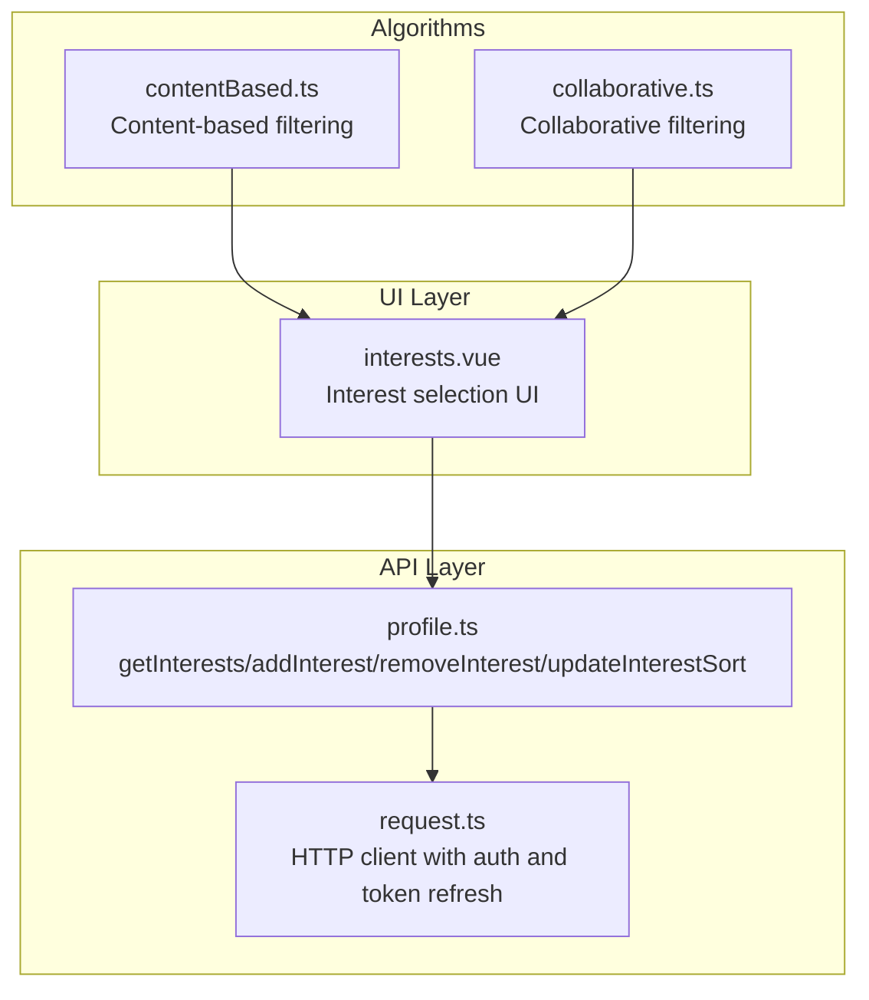
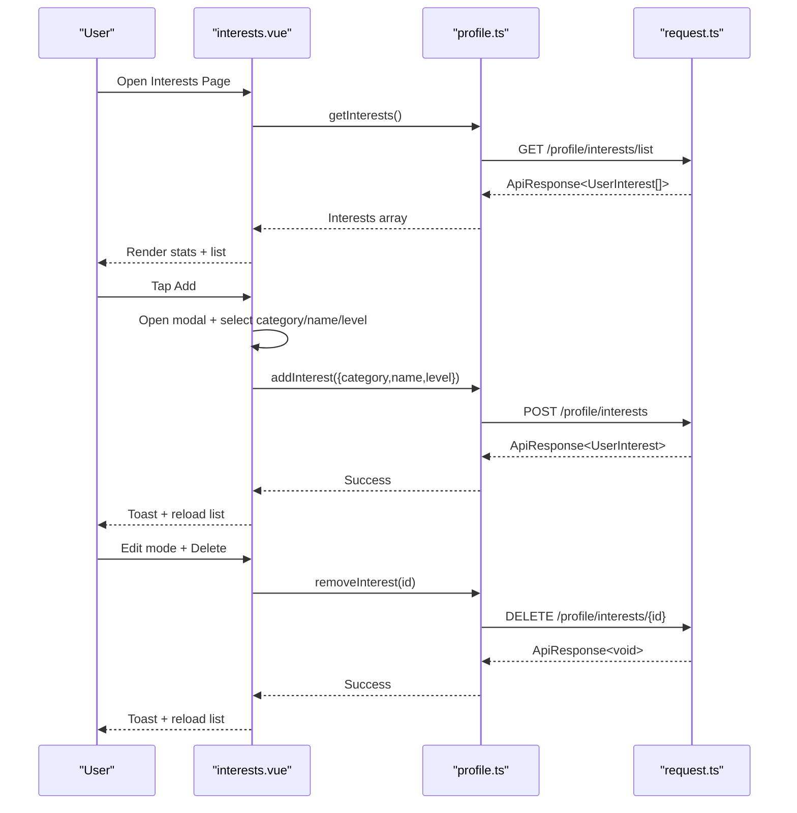
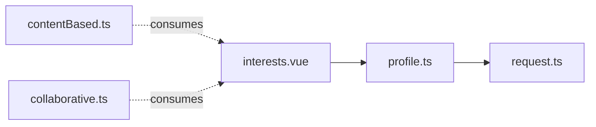

# Interest Management

<cite>
**Referenced Files in This Document**
- [interests.vue](file://src/pages/profile/interests.vue)
- [profile.ts](file://src/api/profile.ts)
- [request.ts](file://src/api/request.ts)
- [contentBased.ts](file://src/pages/tabbar/home/algorithms/contentBased.ts)
- [collaborative.ts](file://src/pages/tabbar/home/algorithms/collaborative.ts)
- [edit.vue](file://src/pages/profile/edit.vue)
</cite>

## Table of Contents
1. [Introduction](#introduction)
2. [Project Structure](#project-structure)
3. [Core Components](#core-components)
4. [Architecture Overview](#architecture-overview)
5. [Detailed Component Analysis](#detailed-component-analysis)
6. [Dependency Analysis](#dependency-analysis)
7. [Performance Considerations](#performance-considerations)
8. [Troubleshooting Guide](#troubleshooting-guide)
9. [Conclusion](#conclusion)

## Introduction
This document describes the interest management system, covering the interest selection interface, category-based grouping, user preference management, validation and limits, API integration, and the relationship between interests and matching algorithms. It also explains interest count tracking, visual representation, and how interests influence profile completeness and recommendations.

## Project Structure
The interest management feature spans three primary areas:
- UI page: interest selection and editing
- API module: typed requests for interests CRUD and completeness metrics
- Recommendation algorithms: content-based and collaborative filtering that consume interest data

**Diagram sources**
- [interests.vue:155-266](file://src/pages/profile/interests.vue#L155-L266)
- [profile.ts:152-167](file://src/api/profile.ts#L152-L167)
- [request.ts:15-228](file://src/api/request.ts#L15-L228)
- [contentBased.ts:1-297](file://src/pages/tabbar/home/algorithms/contentBased.ts#L1-L297)
- [collaborative.ts:1-222](file://src/pages/tabbar/home/algorithms/collaborative.ts#L1-L222)

**Section sources**
- [interests.vue:155-266](file://src/pages/profile/interests.vue#L155-L266)
- [profile.ts:152-167](file://src/api/profile.ts#L152-L167)
- [request.ts:15-228](file://src/api/request.ts#L15-L228)
- [contentBased.ts:1-297](file://src/pages/tabbar/home/algorithms/contentBased.ts#L1-L297)
- [collaborative.ts:1-222](file://src/pages/tabbar/home/algorithms/collaborative.ts#L1-L222)

## Core Components
- Interest selection UI: displays statistics, allows adding/removing interests, and shows category-tagged items with star ratings.
- API module: provides typed endpoints for listing, adding, removing, and sorting interests, plus completeness details.
- Recommendation algorithms: content-based and collaborative filtering that leverage interest data for matching and recommendations.

Key capabilities:
- Category-based grouping: predefined categories are presented for selection.
- Preference strength: star-based level selection (1–5) per interest.
- Validation and limits: form submission is validated; completion threshold is enforced at 3 interests.
- Integration: UI integrates with API via a typed HTTP client supporting token refresh.

**Section sources**
- [interests.vue:4-28](file://src/pages/profile/interests.vue#L4-L28)
- [interests.vue:95-137](file://src/pages/profile/interests.vue#L95-L137)
- [interests.vue:180-182](file://src/pages/profile/interests.vue#L180-L182)
- [profile.ts:72-80](file://src/api/profile.ts#L72-L80)
- [profile.ts:152-167](file://src/api/profile.ts#L152-L167)

## Architecture Overview
The interest management flow connects UI, API, and algorithms:

**Diagram sources**
- [interests.vue:184-265](file://src/pages/profile/interests.vue#L184-L265)
- [profile.ts:152-163](file://src/api/profile.ts#L152-L163)
- [request.ts:75-208](file://src/api/request.ts#L75-L208)

## Detailed Component Analysis

### Interest Selection Interface
- Statistics card: shows count added, remaining slots, and completion indicator.
- Tips card: encourages adding at least 3 interests for rewards and improved matching.
- List view: renders each interest with name, category badge, and star rating.
- Edit mode: toggled to enable item deletion actions.
- Empty state: friendly prompt to add the first interest.
- Add modal: category selector, interest name input, and star-based level picker.
- Submission guard: form is disabled until category and non-empty name are provided.

Validation and limits:
- Form validation checks category presence and non-empty trimmed name.
- Completion threshold: UI indicates completion when 3 or more interests are present.

Visual representation:
- Stars reflect the user’s stated preference level (1–5 stars).
- Category is shown as a small badge on each interest item.

Interaction patterns:
- Tap “编辑” to enter delete mode; tap “完成” to exit.
- Tap category chips to select; tap star positions to set level.
- Confirm add/remove actions via toasts and modal confirmations.

**Section sources**
- [interests.vue:4-28](file://src/pages/profile/interests.vue#L4-L28)
- [interests.vue:31-68](file://src/pages/profile/interests.vue#L31-L68)
- [interests.vue:70-76](file://src/pages/profile/interests.vue#L70-L76)
- [interests.vue:77-82](file://src/pages/profile/interests.vue#L77-L82)
- [interests.vue:83-151](file://src/pages/profile/interests.vue#L83-L151)
- [interests.vue:180-182](file://src/pages/profile/interests.vue#L180-L182)

### Category-Based Interest Grouping
- Predefined categories are rendered as selectable chips in the add modal.
- Each interest item displays its category as a badge for quick scanning.
- The model supports free-text names with categorical context, enabling both structured categorization and flexible naming.

Examples of categories:
- Sports, Music, Movies, Travel, Food, Reading, Games, Art, Other

**Section sources**
- [interests.vue:176-177](file://src/pages/profile/interests.vue#L176-L177)
- [interests.vue:95-105](file://src/pages/profile/interests.vue#L95-L105)
- [interests.vue:47-48](file://src/pages/profile/interests.vue#L47-L48)

### User Preference Management
- Preference strength: star-based level selection (1–5) stored per interest.
- Sorting support: API exposes an endpoint to update sort order for interests.
- Deletion: removes an interest by ID after confirmation.

Note: Duplicate prevention and maximum limit enforcement are not implemented in the UI or API in the current codebase snapshot. The UI enforces a minimum completion threshold (≥3 interests) for profile completion indicators, but does not prevent duplicates or enforce a hard cap.

**Section sources**
- [interests.vue:122-137](file://src/pages/profile/interests.vue#L122-L137)
- [interests.vue:238-265](file://src/pages/profile/interests.vue#L238-L265)
- [profile.ts:165-167](file://src/api/profile.ts#L165-L167)

### Interest Validation, Duplicate Prevention, and Maximum Limit Enforcement
- Validation: form submission requires category and a non-empty interest name.
- Duplicate prevention: not implemented in the current codebase.
- Maximum limit: not implemented in the current codebase; UI shows remaining slots but does not enforce a hard cap.

Recommendations:
- Enforce a maximum interest count server-side and surface errors to the UI.
- Normalize names (trim, lowercase) and normalize categories to reduce near-duplicates.
- Add server-side uniqueness checks by normalized name within a category.

**Section sources**
- [interests.vue:180-182](file://src/pages/profile/interests.vue#L180-L182)
- [interests.vue:10-12](file://src/pages/profile/interests.vue#L10-L12)

### API Integration for Loading, Adding, and Removing Interests
Endpoints:
- GET /profile/interests/list → returns array of UserInterest
- POST /profile/interests → creates a new interest
- DELETE /profile/interests/{id} → removes an interest
- PUT /profile/interests/sort → updates sort order

Data model:
- UserInterest includes id, userId, category, name, level, sortOrder, createdAt.

HTTP client:
- request.ts handles base URL, headers, token injection, and automatic token refresh on 401.

**Section sources**
- [profile.ts:72-80](file://src/api/profile.ts#L72-L80)
- [profile.ts:152-163](file://src/api/profile.ts#L152-L163)
- [request.ts:15-228](file://src/api/request.ts#L15-L228)

### Relationship Between Interests and Matching Algorithms
- Content-based filtering: matches user interests (tags with weights) against content tags to compute a similarity score. Interest strength (1–5) is used as a weight multiplier.
- Collaborative filtering: computes user similarity based on behavior vectors and recommends unseen targets liked by similar users.

How interests influence recommendations:
- Content-based: richer and more granular interest tags improve match quality; star levels act as weights.
- Collaborative: interests indirectly influence recommendations through user behavior alignment with similar users.

Cold start:
- When no interests exist, content-based falls back to popularity scores.

**Section sources**
- [contentBased.ts:6-12](file://src/pages/tabbar/home/algorithms/contentBased.ts#L6-L12)
- [contentBased.ts:34-70](file://src/pages/tabbar/home/algorithms/contentBased.ts#L34-L70)
- [contentBased.ts:259-296](file://src/pages/tabbar/home/algorithms/contentBased.ts#L259-L296)
- [collaborative.ts:6-17](file://src/pages/tabbar/home/algorithms/collaborative.ts#L6-L17)
- [collaborative.ts:121-161](file://src/pages/tabbar/home/algorithms/collaborative.ts#L121-L161)

### Interest Count Tracking and Profile Completeness
- The interests page shows:
  - Count added
  - Remaining slots (up to a configurable maximum)
  - Completion indicator (≥3 interests)
- Profile edit page aggregates completeness metrics and counts interests, photos, and mate preferences to inform users about progress and potential rewards.

Impact on recommendations:
- Minimum interest count improves completion and may unlock rewards and higher matching visibility.

**Section sources**
- [interests.vue:4-18](file://src/pages/profile/interests.vue#L4-L18)
- [edit.vue:221-275](file://src/pages/profile/edit.vue#L221-L275)

## Dependency Analysis

**Diagram sources**
- [interests.vue:157-158](file://src/pages/profile/interests.vue#L157-L158)
- [profile.ts:152-167](file://src/api/profile.ts#L152-L167)
- [request.ts:15-228](file://src/api/request.ts#L15-L228)
- [contentBased.ts:1-297](file://src/pages/tabbar/home/algorithms/contentBased.ts#L1-L297)
- [collaborative.ts:1-222](file://src/pages/tabbar/home/algorithms/collaborative.ts#L1-L222)

**Section sources**
- [interests.vue:157-158](file://src/pages/profile/interests.vue#L157-L158)
- [profile.ts:152-167](file://src/api/profile.ts#L152-L167)
- [request.ts:15-228](file://src/api/request.ts#L15-L228)
- [contentBased.ts:1-297](file://src/pages/tabbar/home/algorithms/contentBased.ts#L1-L297)
- [collaborative.ts:1-222](file://src/pages/tabbar/home/algorithms/collaborative.ts#L1-L222)

## Performance Considerations
- Minimize re-renders: keep interest lists reactive and avoid unnecessary deep watchers.
- Debounce inputs: consider debouncing long text inputs in forms.
- Efficient rendering: use keys on list items and virtualize long lists if needed.
- Network efficiency: batch updates (e.g., sort order) when multiple changes occur in short time.

## Troubleshooting Guide
Common issues and resolutions:
- Load failures: UI shows toast with error message; check network connectivity and server availability.
- Add failures: ensure category and non-empty name are provided; verify server-side validation and rate limits.
- Remove failures: confirm deletion via modal; ensure the interest exists and belongs to the current user.
- Token expiration: request.ts automatically refreshes tokens; if refresh fails, user is redirected to login.

**Section sources**
- [interests.vue:193-199](file://src/pages/profile/interests.vue#L193-L199)
- [interests.vue:229-235](file://src/pages/profile/interests.vue#L229-L235)
- [interests.vue:255-261](file://src/pages/profile/interests.vue#L255-L261)
- [request.ts:100-147](file://src/api/request.ts#L100-L147)

## Conclusion
The interest management system provides a user-friendly interface for selecting and managing personal interests with category tagging and star-based preference strength. While the UI enforces a minimum completion threshold, duplication prevention and strict maximum limits are not currently implemented. The API supports robust CRUD operations and sorting, and the recommendation algorithms can leverage interest data to improve matching. Future enhancements should focus on stricter validation, deduplication, and maximum limit enforcement to ensure data integrity and optimal recommendation quality.