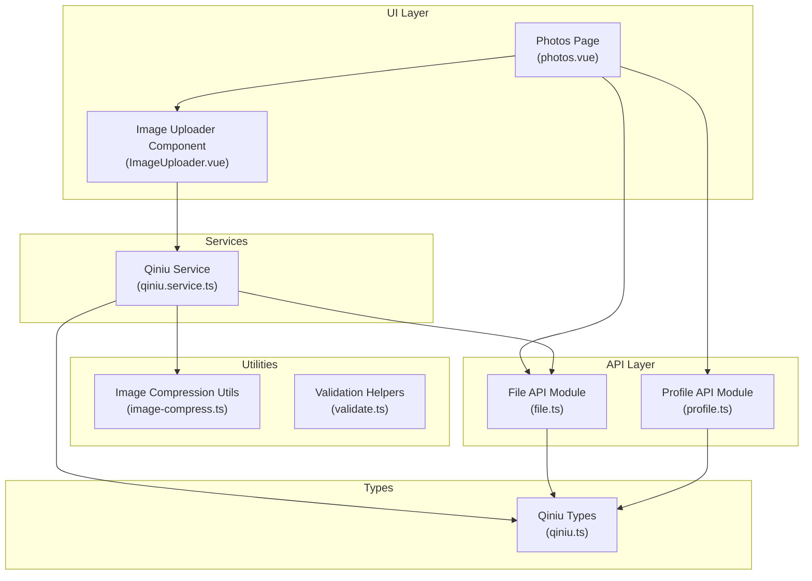
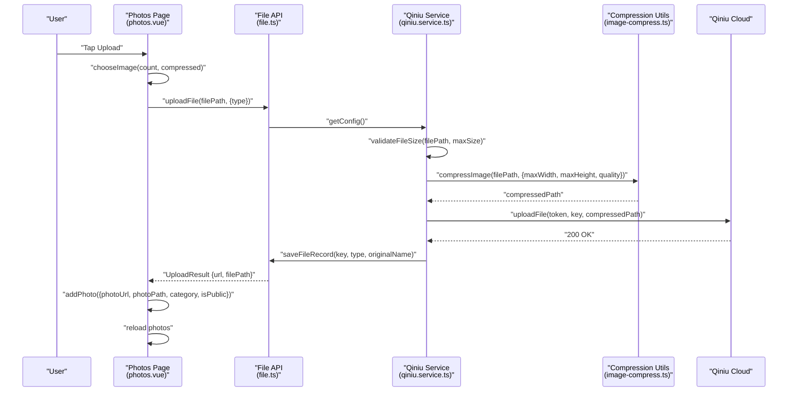
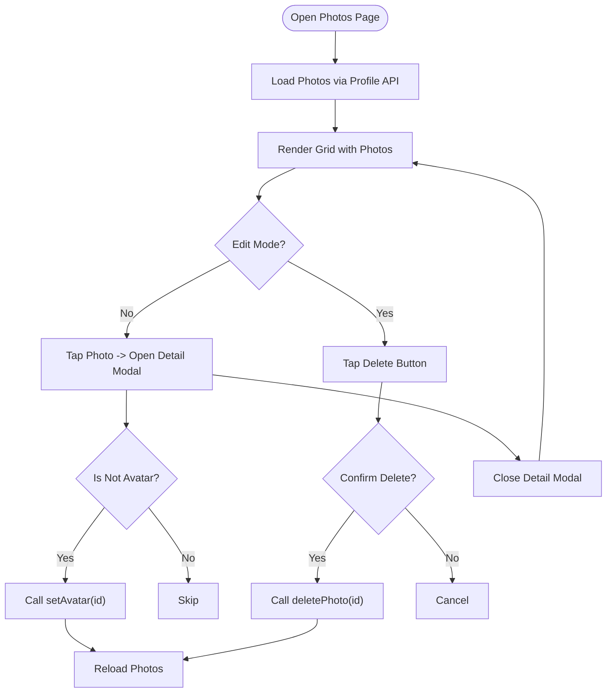
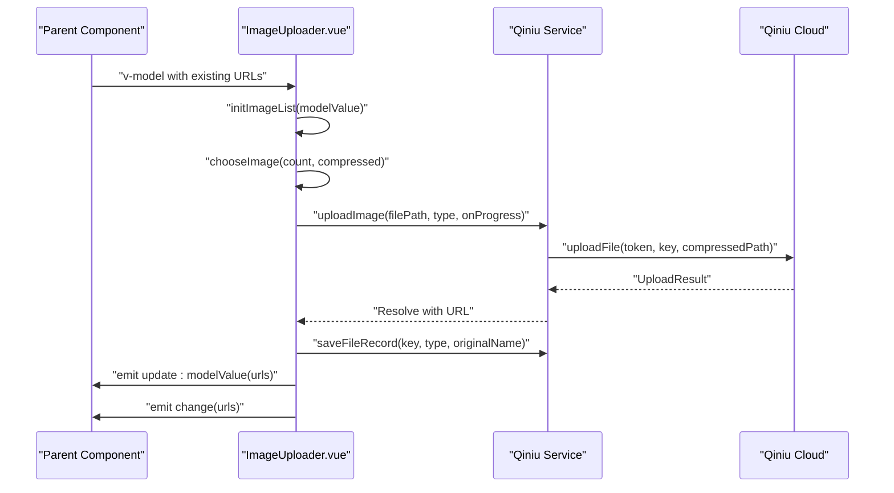
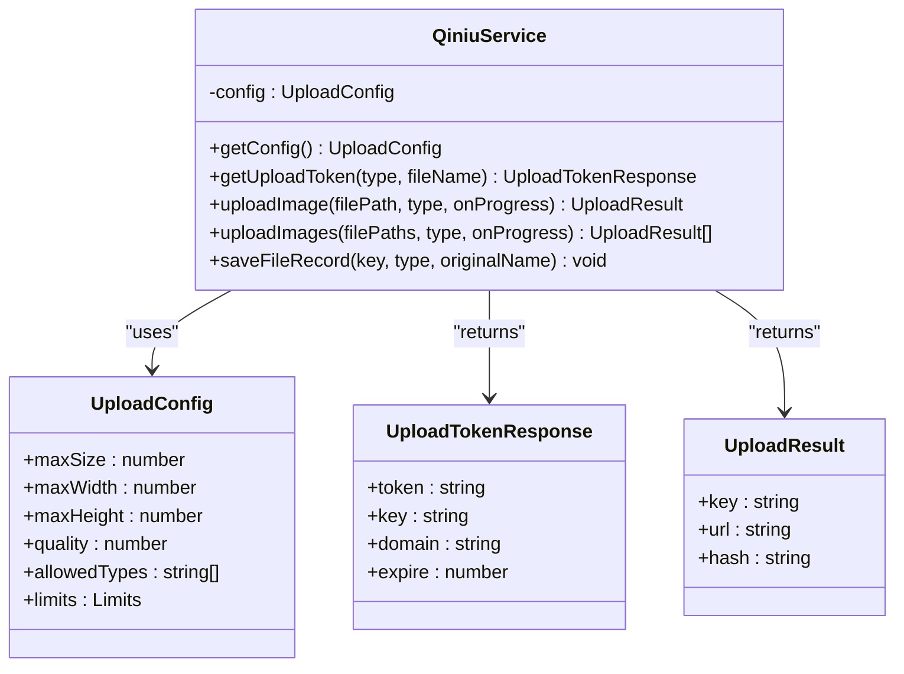
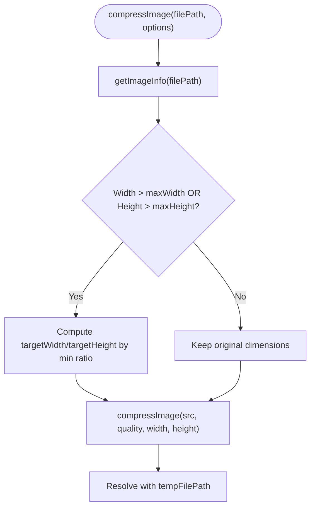
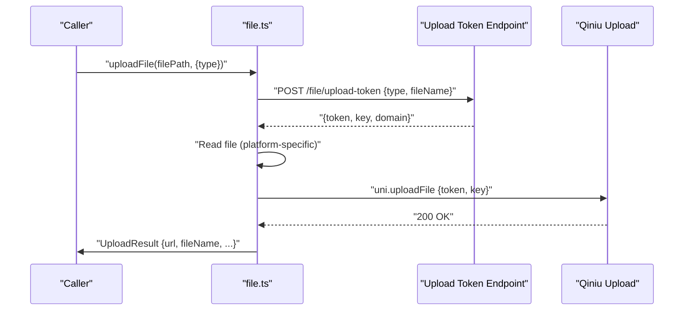
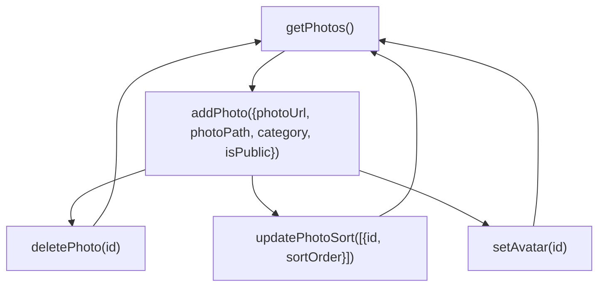
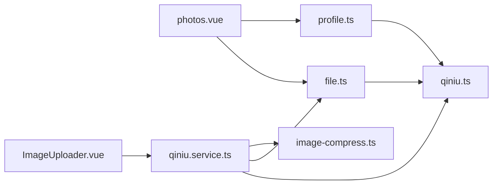

# Photo Gallery System

<cite>
**Referenced Files in This Document**
- [photos.vue](file://src/pages/profile/photos.vue)
- [ImageUploader.vue](file://src/components/ImageUploader.vue)
- [qiniu.service.ts](file://src/services/qiniu.service.ts)
- [image-compress.ts](file://src/utils/image-compress.ts)
- [file.ts](file://src/api/modules/file.ts)
- [profile.ts](file://src/api/profile.ts)
- [qiniu.ts](file://src/types/qiniu.ts)
- [validate.ts](file://src/utils/validate.ts)
- [index.ts](file://src/config/index.ts)
</cite>

## Table of Contents
1. [Introduction](#introduction)
2. [Project Structure](#project-structure)
3. [Core Components](#core-components)
4. [Architecture Overview](#architecture-overview)
5. [Detailed Component Analysis](#detailed-component-analysis)
6. [Dependency Analysis](#dependency-analysis)
7. [Performance Considerations](#performance-considerations)
8. [Troubleshooting Guide](#troubleshooting-guide)
9. [Conclusion](#conclusion)

## Introduction
This document describes the photo gallery system, covering the upload workflow, compression handling, Qiniu Cloud integration, and the photo management interface. It explains viewing, reordering, and deletion capabilities, details the image processing pipeline, quality optimization, and thumbnail generation. It also documents supported formats, size limits, upload progress tracking, validation rules, duplicate detection, privacy settings, and the impact on profile visibility and matching algorithms.

## Project Structure
The photo gallery system spans several layers:
- UI pages for photo management and editing
- Reusable image uploader component
- Qiniu service abstraction for cloud storage
- Compression utilities and validation helpers
- API modules for file operations and profile photo management
- Type definitions for upload configurations and results

**Diagram sources**
- [photos.vue:1-505](file://src/pages/profile/photos.vue#L1-L505)
- [ImageUploader.vue:1-242](file://src/components/ImageUploader.vue#L1-L242)
- [qiniu.service.ts:1-126](file://src/services/qiniu.service.ts#L1-L126)
- [image-compress.ts:1-87](file://src/utils/image-compress.ts#L1-L87)
- [file.ts:1-335](file://src/api/modules/file.ts#L1-L335)
- [profile.ts:1-311](file://src/api/profile.ts#L1-L311)
- [qiniu.ts:1-38](file://src/types/qiniu.ts#L1-L38)

**Section sources**
- [photos.vue:1-505](file://src/pages/profile/photos.vue#L1-L505)
- [ImageUploader.vue:1-242](file://src/components/ImageUploader.vue#L1-L242)
- [qiniu.service.ts:1-126](file://src/services/qiniu.service.ts#L1-L126)
- [image-compress.ts:1-87](file://src/utils/image-compress.ts#L1-L87)
- [file.ts:1-335](file://src/api/modules/file.ts#L1-L335)
- [profile.ts:1-311](file://src/api/profile.ts#L1-L311)
- [qiniu.ts:1-38](file://src/types/qiniu.ts#L1-L38)

## Core Components
- Photo Management Page: Provides statistics, tips, grid layout, edit mode, detail modal, and actions (upload, delete, set avatar).
- Image Uploader Component: Reusable component supporting multiple uploads, progress tracking, and deletion.
- Qiniu Service: Centralizes upload configuration retrieval, token acquisition, compression, and upload to Qiniu.
- Compression Utilities: Handles resizing and quality adjustment for optimal performance and storage.
- File API: Manages upload tokens, saving records, and avatar-specific upload flows.
- Profile API: Manages photo CRUD operations, sorting, and avatar assignment.
- Types: Defines upload types, configuration, progress, and result structures.

**Section sources**
- [photos.vue:100-251](file://src/pages/profile/photos.vue#L100-L251)
- [ImageUploader.vue:32-153](file://src/components/ImageUploader.vue#L32-L153)
- [qiniu.service.ts:12-126](file://src/services/qiniu.service.ts#L12-L126)
- [image-compress.ts:10-87](file://src/utils/image-compress.ts#L10-L87)
- [file.ts:90-230](file://src/api/modules/file.ts#L90-L230)
- [profile.ts:169-193](file://src/api/profile.ts#L169-L193)
- [qiniu.ts:1-38](file://src/types/qiniu.ts#L1-L38)

## Architecture Overview
The system integrates local selection, client-side compression, Qiniu token-based upload, and backend persistence. The flow ensures size validation, compression, and atomic file record creation after successful upload.

**Diagram sources**
- [photos.vue:134-179](file://src/pages/profile/photos.vue#L134-L179)
- [file.ts:90-230](file://src/api/modules/file.ts#L90-L230)
- [qiniu.service.ts:42-87](file://src/services/qiniu.service.ts#L42-L87)
- [image-compress.ts:10-49](file://src/utils/image-compress.ts#L10-L49)

## Detailed Component Analysis

### Photo Management Page (photos.vue)
- Displays photo statistics, completion indicator, and tips.
- Grid layout for uploaded photos with optional avatar badge.
- Edit mode enables delete actions; detail modal supports set-as-avatar and delete.
- Upload flow uses uni.chooseImage with compressed images, then uploads via file API and persists photo metadata.

**Diagram sources**
- [photos.vue:116-251](file://src/pages/profile/photos.vue#L116-L251)

**Section sources**
- [photos.vue:1-96](file://src/pages/profile/photos.vue#L1-L96)
- [photos.vue:116-251](file://src/pages/profile/photos.vue#L116-L251)

### Image Uploader Component (ImageUploader.vue)
- Supports multiple image selection up to a configurable limit.
- Tracks upload progress per image and displays a progress overlay.
- Integrates with Qiniu service for token-based upload and record saving.
- Emits updates to parent components via v-model and change events.

**Diagram sources**
- [ImageUploader.vue:78-153](file://src/components/ImageUploader.vue#L78-L153)
- [qiniu.service.ts:42-122](file://src/services/qiniu.service.ts#L42-L122)

**Section sources**
- [ImageUploader.vue:1-242](file://src/components/ImageUploader.vue#L1-L242)

### Qiniu Service (qiniu.service.ts)
- Retrieves upload configuration (size limits, dimensions, quality, allowed types, limits).
- Validates file size against configured maximum.
- Compresses images using client-side resizing and quality adjustment.
- Requests upload tokens, performs upload via uni.uploadFile, and saves file records.

**Diagram sources**
- [qiniu.service.ts:12-126](file://src/services/qiniu.service.ts#L12-L126)
- [qiniu.ts:15-38](file://src/types/qiniu.ts#L15-L38)

**Section sources**
- [qiniu.service.ts:12-126](file://src/services/qiniu.service.ts#L12-L126)
- [qiniu.ts:1-38](file://src/types/qiniu.ts#L1-L38)

### Compression and Validation (image-compress.ts)
- Resizes images to fit within configured maxWidth/maxHeight while preserving aspect ratio.
- Applies quality factor to reduce file size.
- Validates file size against a configurable maximum.

**Diagram sources**
- [image-compress.ts:10-49](file://src/utils/image-compress.ts#L10-L49)

**Section sources**
- [image-compress.ts:10-87](file://src/utils/image-compress.ts#L10-L87)

### File Upload API (file.ts)
- Provides uploadFile for album-type photos with token-based upload.
- Handles platform-specific file reading (mini-program vs H5).
- Saves file records with metadata and returns full URL.

**Diagram sources**
- [file.ts:90-230](file://src/api/modules/file.ts#L90-L230)

**Section sources**
- [file.ts:90-230](file://src/api/modules/file.ts#L90-L230)

### Profile Photo Management (profile.ts)
- Lists, adds, deletes, sorts, and sets avatar photos.
- Exposes photo visibility and privacy settings.

**Diagram sources**
- [profile.ts:169-193](file://src/api/profile.ts#L169-L193)

**Section sources**
- [profile.ts:169-193](file://src/api/profile.ts#L169-L193)

### Privacy Settings Impact
- Photo visibility is controlled via privacy settings; affects who can see photos.
- Lowering photo visibility reduces exposure and may impact matching visibility depending on system logic.

**Section sources**
- [profile.ts:204-247](file://src/api/profile.ts#L204-L247)

## Dependency Analysis
- photos.vue depends on profile API for photo CRUD and file API for upload.
- ImageUploader.vue depends on qiniu.service.ts for upload orchestration.
- qiniu.service.ts depends on image-compress.ts for preprocessing and file.ts for token and record operations.
- qiniu.ts defines shared types used across services and APIs.

**Diagram sources**
- [photos.vue:100-103](file://src/pages/profile/photos.vue#L100-L103)
- [ImageUploader.vue:34-35](file://src/components/ImageUploader.vue#L34-L35)
- [qiniu.service.ts:1-10](file://src/services/qiniu.service.ts#L1-L10)
- [file.ts:1-12](file://src/api/modules/file.ts#L1-L12)
- [profile.ts:1-1](file://src/api/profile.ts#L1-L1)
- [qiniu.ts:1-38](file://src/types/qiniu.ts#L1-L38)

**Section sources**
- [photos.vue:100-103](file://src/pages/profile/photos.vue#L100-L103)
- [ImageUploader.vue:34-35](file://src/components/ImageUploader.vue#L34-L35)
- [qiniu.service.ts:1-10](file://src/services/qiniu.service.ts#L1-L10)
- [file.ts:1-12](file://src/api/modules/file.ts#L1-L12)
- [profile.ts:1-1](file://src/api/profile.ts#L1-L1)
- [qiniu.ts:1-38](file://src/types/qiniu.ts#L1-L38)

## Performance Considerations
- Client-side compression reduces payload size and improves upload speed.
- Progress tracking enhances UX during multi-file uploads.
- Configurable limits (max size, dimensions, quality) balance quality and performance.
- Batch uploads are sequential in the current implementation; consider parallel uploads with concurrency limits for improved throughput.

## Troubleshooting Guide
- Upload fails due to size: Verify file size validation and adjust client-side compression parameters.
- Upload token errors: Ensure backend endpoints for token retrieval are reachable and returning valid tokens.
- Duplicate uploads: No explicit duplicate detection logic was found; consider adding server-side uniqueness checks for keys or hashes.
- Progress not updating: Confirm onProgress callback wiring in the uploader component and Qiniu service.
- Privacy visibility mismatch: Review privacy settings and ensure they align with intended visibility.

**Section sources**
- [qiniu.service.ts:42-87](file://src/services/qiniu.service.ts#L42-L87)
- [ImageUploader.vue:96-128](file://src/components/ImageUploader.vue#L96-L128)
- [file.ts:259-262](file://src/api/modules/file.ts#L259-L262)

## Conclusion
The photo gallery system provides a robust, modular solution for uploading, managing, and displaying user photos with Qiniu Cloud integration. It emphasizes compression, progress tracking, and backend persistence while offering flexible privacy controls. Extending support for duplicate detection, batch parallel uploads, and configurable thumbnail generation would further enhance reliability and performance.