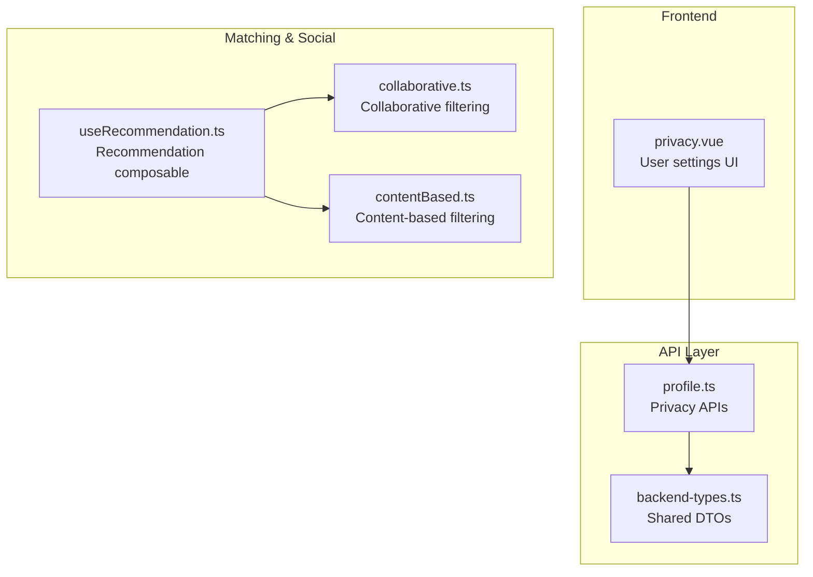
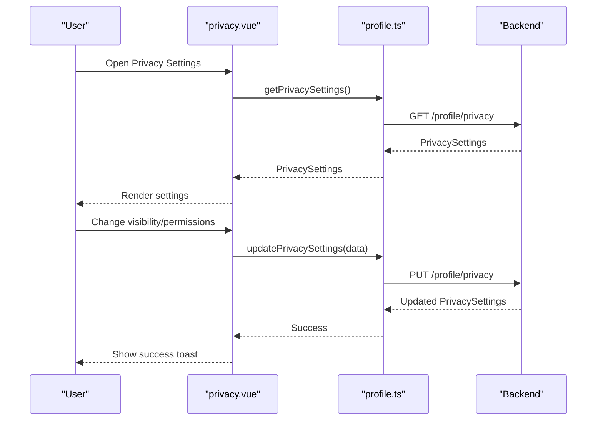
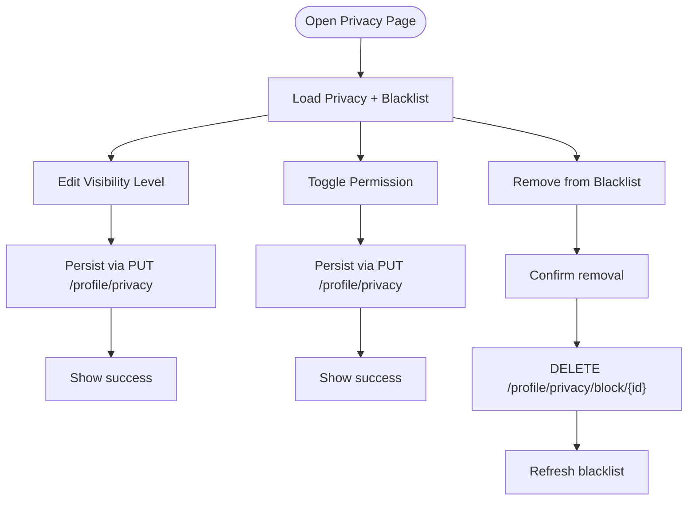
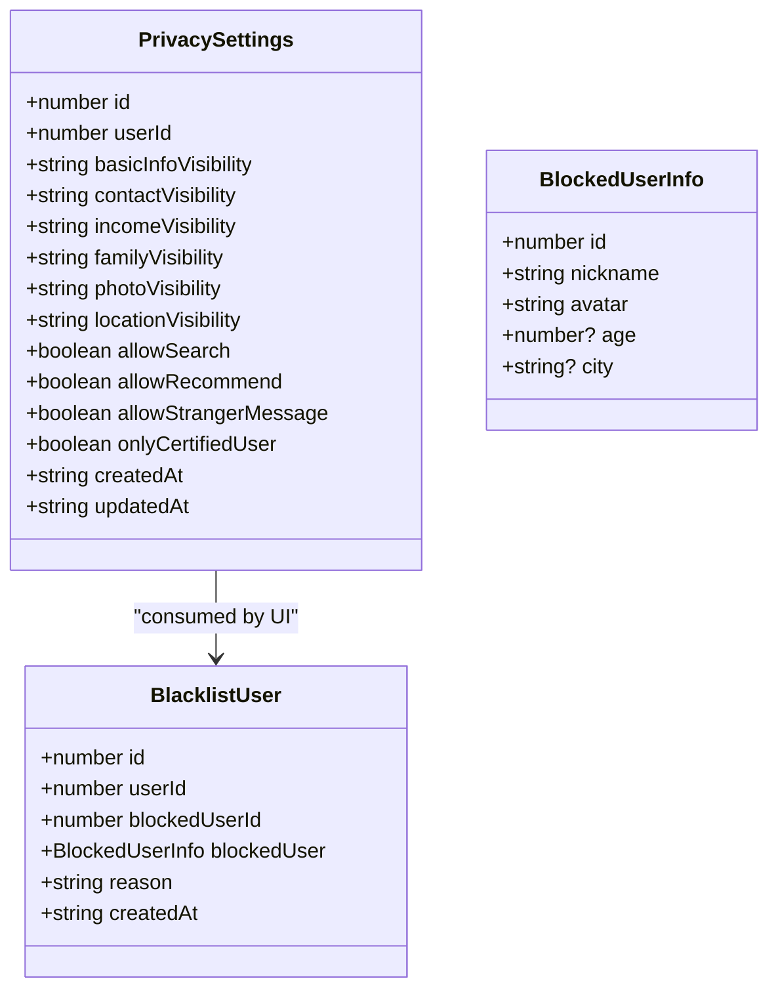
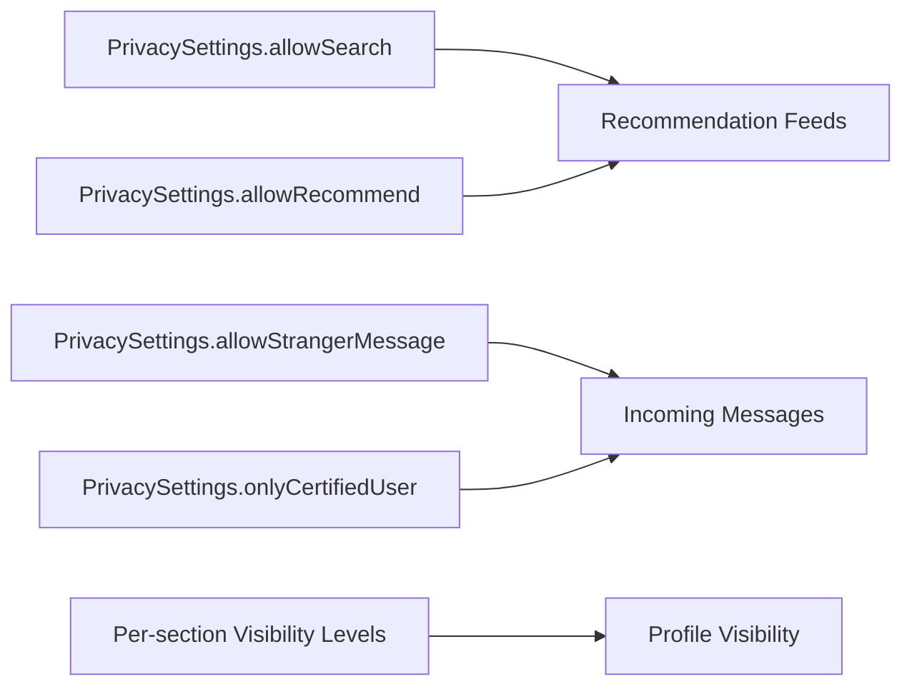
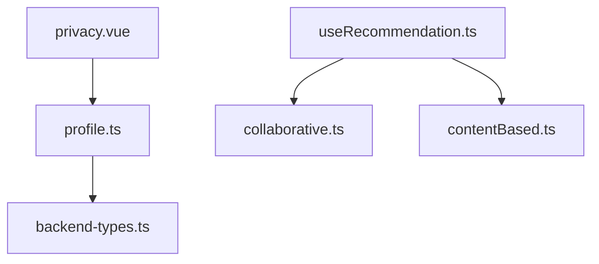

# Privacy Settings

<cite>
**Referenced Files in This Document**
- [privacy.vue](file://src/pages/profile/privacy.vue)
- [profile.ts](file://src/api/profile.ts)
- [backend-types.ts](file://src/types/api/backend-types.ts)
- [collaborative.ts](file://src/pages/tabbar/home/algorithms/collaborative.ts)
- [contentBased.ts](file://src/pages/tabbar/home/algorithms/contentBased.ts)
- [useRecommendation.ts](file://src/pages/tabbar/home/composables/useRecommendation.ts)
</cite>

## Table of Contents
1. [Introduction](#introduction)
2. [Project Structure](#project-structure)
3. [Core Components](#core-components)
4. [Architecture Overview](#architecture-overview)
5. [Detailed Component Analysis](#detailed-component-analysis)
6. [Dependency Analysis](#dependency-analysis)
7. [Performance Considerations](#performance-considerations)
8. [Troubleshooting Guide](#troubleshooting-guide)
9. [Conclusion](#conclusion)
10. [Appendices](#appendices)

## Introduction
This document describes the privacy settings system, covering the user-facing controls, backend data model, API surface, and how privacy configurations influence matching and social features. It also outlines scenarios, defaults, granular controls per profile section, and operational considerations for auditing and compliance.

## Project Structure
The privacy settings feature spans a frontend page and a dedicated API module:
- Frontend page: renders and manages privacy preferences, blacklist, and visibility choices.
- API module: defines the privacy data model and exposes endpoints for fetching/updating privacy settings and managing the blacklist.

**Diagram sources**
- [privacy.vue:1-312](file://src/pages/profile/privacy.vue#L1-L312)
- [profile.ts:204-259](file://src/api/profile.ts#L204-L259)
- [backend-types.ts:1-764](file://src/types/api/backend-types.ts#L1-L764)
- [collaborative.ts:1-222](file://src/pages/tabbar/home/algorithms/collaborative.ts#L1-L222)
- [contentBased.ts:1-297](file://src/pages/tabbar/home/algorithms/contentBased.ts#L1-L297)
- [useRecommendation.ts:1-202](file://src/pages/tabbar/home/composables/useRecommendation.ts#L1-L202)

**Section sources**
- [privacy.vue:1-312](file://src/pages/profile/privacy.vue#L1-L312)
- [profile.ts:204-259](file://src/api/profile.ts#L204-L259)

## Core Components
- Privacy settings UI: allows users to adjust visibility levels for profile sections and manage interaction permissions and blacklist.
- Privacy data model: typed definition of privacy settings and blacklist entries.
- Privacy APIs: endpoints to fetch/update privacy settings and manage blacklist.

Key capabilities:
- Per-section visibility: basic info, contact, income, family, photos, location.
- Interaction permissions: allow search, allow recommendation, allow stranger messages, only certified users.
- Blacklist management: view, remove blocked users.
- Persistence: updates saved via PUT to privacy endpoint; blacklist managed via block endpoints.

**Section sources**
- [privacy.vue:108-312](file://src/pages/profile/privacy.vue#L108-L312)
- [profile.ts:204-259](file://src/api/profile.ts#L204-L259)

## Architecture Overview
The privacy UI interacts with privacy APIs, which encapsulate shared backend DTOs. Matching and recommendation logic consume user data and behavior; privacy settings influence discoverability and visibility.

**Diagram sources**
- [privacy.vue:279-312](file://src/pages/profile/privacy.vue#L279-L312)
- [profile.ts:241-247](file://src/api/profile.ts#L241-L247)

## Detailed Component Analysis

### Privacy Settings UI (privacy.vue)
Responsibilities:
- Load initial privacy settings and blacklist.
- Present two major categories:
  - Information visibility: per-section visibility levels.
  - Interaction permissions: toggles for search, recommendation, stranger messaging, and certified-user-only.
- Manage blacklist: list blocked users and remove them.
- Persist changes immediately upon toggle or selection.

User flows:
- Selecting a visibility item opens a sheet with options ordered from most to least restrictive.
- Switching a permission updates the local state and persists immediately.
- Removing a user from the blacklist triggers a confirmation modal and removes via DELETE.

**Diagram sources**
- [privacy.vue:181-312](file://src/pages/profile/privacy.vue#L181-L312)

**Section sources**
- [privacy.vue:1-312](file://src/pages/profile/privacy.vue#L1-L312)

### Privacy Data Model and Types (profile.ts, backend-types.ts)
PrivacySettings fields:
- Per-section visibility: basicInfoVisibility, contactVisibility, incomeVisibility, familyVisibility, photoVisibility, locationVisibility.
- Interaction permissions: allowSearch, allowRecommend, allowStrangerMessage, onlyCertifiedUser.
- Timestamps: createdAt, updatedAt.

Visibility levels:
- public: visible to everyone.
- friends: visible to contacts/friends.
- certified: visible to verified/authenticated users.
- private: visible only to the user.

BlacklistUser:
- References blocked user’s id, nickname, avatar, optional age/city.
- Reason and timestamps.

**Diagram sources**
- [profile.ts:207-239](file://src/api/profile.ts#L207-L239)
- [backend-types.ts:322-339](file://src/types/api/backend-types.ts#L322-L339)

**Section sources**
- [profile.ts:204-259](file://src/api/profile.ts#L204-L259)
- [backend-types.ts:322-339](file://src/types/api/backend-types.ts#L322-L339)

### Privacy API Surface (profile.ts)
Endpoints:
- GET /profile/privacy → PrivacySettings
- PUT /profile/privacy → PrivacySettings
- GET /profile/privacy/block → BlacklistUser[]
- POST /profile/privacy/block/{blockedUserId} → add to blacklist
- DELETE /profile/privacy/block/{blockedUserId} → remove from blacklist

These endpoints underpin the UI flows and enable immediate persistence of user choices.

**Section sources**
- [profile.ts:241-259](file://src/api/profile.ts#L241-L259)

### Impact on Matching and Social Features
Privacy settings influence:
- Discoverability: allowSearch and allowRecommend gate whether a user appears in search and recommendation feeds.
- Who can initiate contact: allowStrangerMessage and onlyCertifiedUser restrict incoming messages.
- Profile visibility: per-section visibility levels determine what others see when viewing profiles.

Matching algorithms (collaborative and content-based) operate on user behavior and content similarity. Privacy settings do not alter the algorithmic computation itself but constrain the data exposed to other users, indirectly affecting:
- How many users can be recommended (discoverability).
- How many users can interact (message permissions).
- Which profile data is visible during interactions.

**Diagram sources**
- [collaborative.ts:1-222](file://src/pages/tabbar/home/algorithms/collaborative.ts#L1-L222)
- [contentBased.ts:1-297](file://src/pages/tabbar/home/algorithms/contentBased.ts#L1-L297)
- [profile.ts:207-224](file://src/api/profile.ts#L207-L224)

**Section sources**
- [collaborative.ts:1-222](file://src/pages/tabbar/home/algorithms/collaborative.ts#L1-L222)
- [contentBased.ts:1-297](file://src/pages/tabbar/home/algorithms/contentBased.ts#L1-L297)
- [profile.ts:207-224](file://src/api/profile.ts#L207-L224)

## Dependency Analysis
- privacy.vue depends on profile.ts for API calls and on backend-types.ts for shared DTOs.
- Matching logic (collaborative.ts, contentBased.ts) and recommendation composable (useRecommendation.ts) are independent of privacy settings but rely on user data availability influenced by privacy choices.

**Diagram sources**
- [privacy.vue:108-118](file://src/pages/profile/privacy.vue#L108-L118)
- [profile.ts:1-311](file://src/api/profile.ts#L1-L311)
- [useRecommendation.ts:1-202](file://src/pages/tabbar/home/composables/useRecommendation.ts#L1-L202)
- [collaborative.ts:1-222](file://src/pages/tabbar/home/algorithms/collaborative.ts#L1-L222)
- [contentBased.ts:1-297](file://src/pages/tabbar/home/algorithms/contentBased.ts#L1-L297)

**Section sources**
- [privacy.vue:108-118](file://src/pages/profile/privacy.vue#L108-L118)
- [profile.ts:1-311](file://src/api/profile.ts#L1-L311)
- [useRecommendation.ts:1-202](file://src/pages/tabbar/home/composables/useRecommendation.ts#L1-L202)

## Performance Considerations
- Immediate persistence: UI saves changes on each toggle/selection, reducing round-trips but increasing API calls. Consider debouncing for bulk changes if needed.
- Batch updates: If future enhancements allow editing multiple settings at once, batch them into a single PUT to reduce server load.
- UI responsiveness: Keep visibility selection lightweight; avoid heavy computations on the client side.

## Troubleshooting Guide
Common issues and resolutions:
- Save failures: The UI shows an error toast and reloads settings to restore consistency. Verify network connectivity and backend endpoint availability.
- Blacklist removal errors: Confirmation modal precedes deletion; on failure, the UI shows an error and suggests retrying.
- Visibility not updating: Ensure the selected visibility level is persisted via PUT and that the UI re-fetches settings if the save fails.

Operational checks:
- Confirm GET /profile/privacy returns the expected PrivacySettings.
- Confirm PUT /profile/privacy updates the record and reflects in subsequent GET calls.
- Confirm blacklist endpoints return and mutate the expected BlacklistUser list.

**Section sources**
- [privacy.vue:230-312](file://src/pages/profile/privacy.vue#L230-L312)
- [profile.ts:241-259](file://src/api/profile.ts#L241-L259)

## Conclusion
The privacy settings system provides granular control over profile visibility and social interactions, with immediate persistence and a straightforward UI. Privacy choices directly impact discoverability and messaging, influencing recommendation and matching outcomes by limiting exposure rather than altering algorithmic behavior. Robust error handling and consistent API usage ensure reliability.

## Appendices

### Privacy Level Hierarchy and Defaults
- Visibility levels (from most to least restrictive):
  - public
  - friends
  - certified
  - private
- Default settings observed in the UI initialization:
  - basicInfoVisibility: friends
  - contactVisibility: friends
  - incomeVisibility: private
  - familyVisibility: friends
  - photoVisibility: friends
  - locationVisibility: certified
  - allowSearch: true
  - allowRecommend: true
  - allowStrangerMessage: false
  - onlyCertifiedUser: false

**Section sources**
- [privacy.vue:121-136](file://src/pages/profile/privacy.vue#L121-L136)
- [profile.ts:205-224](file://src/api/profile.ts#L205-L224)

### API Definitions
- GET /profile/privacy
  - Purpose: Retrieve current privacy settings.
  - Response: PrivacySettings.
- PUT /profile/privacy
  - Purpose: Update one or more privacy settings.
  - Request body: Partial<PrivacySettings>.
  - Response: PrivacySettings.
- GET /profile/privacy/block
  - Purpose: List users on the blacklist.
  - Response: BlacklistUser[].
- POST /profile/privacy/block/{blockedUserId}
  - Purpose: Add a user to the blacklist.
  - Request body: { reason?: string }.
  - Response: Success indicator.
- DELETE /profile/privacy/block/{blockedUserId}
  - Purpose: Remove a user from the blacklist.
  - Response: Success indicator.

**Section sources**
- [profile.ts:241-259](file://src/api/profile.ts#L241-L259)

### Examples of Privacy Scenarios
- Scenario A: User wants minimal exposure
  - Set per-section visibility to private.
  - Disable allowSearch and allowRecommend.
  - Enable onlyCertifiedUser.
- Scenario B: User is open but cautious
  - Set per-section visibility to friends.
  - Allow strangers to message; keep onlyCertifiedUser disabled.
- Scenario C: User participates in discovery
  - Keep allowSearch and allowRecommend enabled.
  - Restrict sensitive sections to friends or certified.

[No sources needed since this section synthesizes scenarios based on documented fields]

### Privacy Audit and Compliance Considerations
- Data minimization: Encourage users to set least-common-denominator visibility for sensitive fields.
- Transparency: Maintain logs of privacy setting changes if required by policy.
- Access control: Enforce visibility levels server-side when rendering profile data to third-party consumers.
- Right to erasure: Ensure blacklist removal and visibility changes propagate across systems promptly.

[No sources needed since this section provides general guidance]