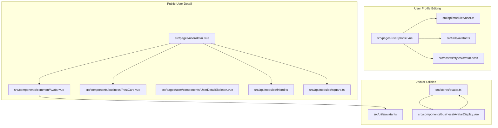
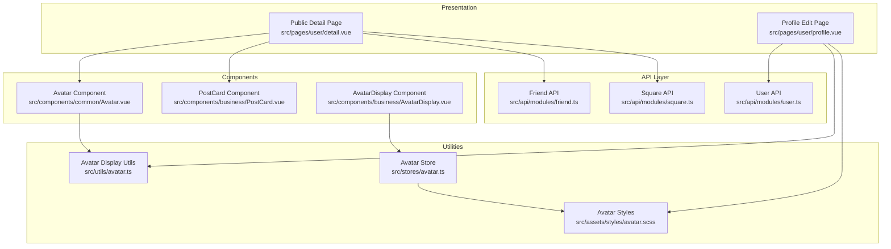
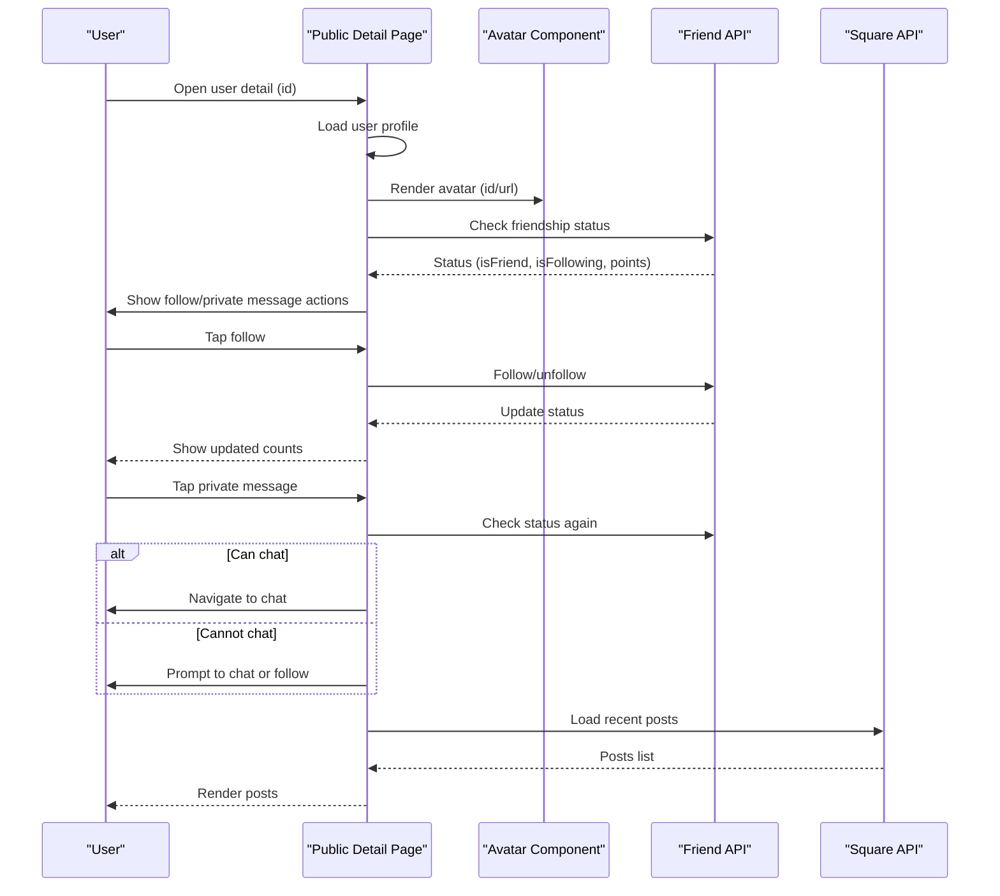
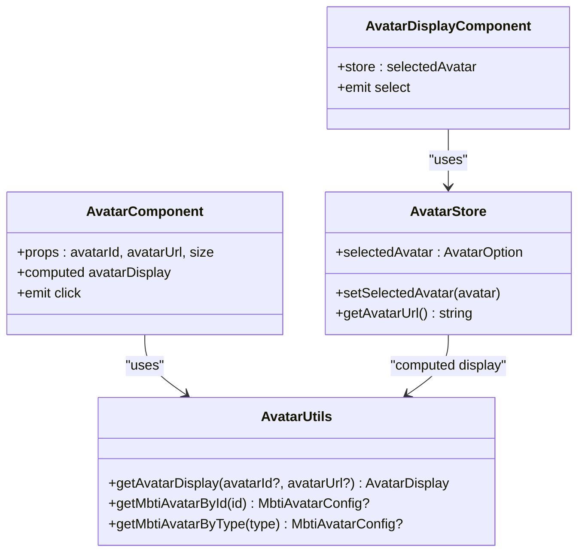
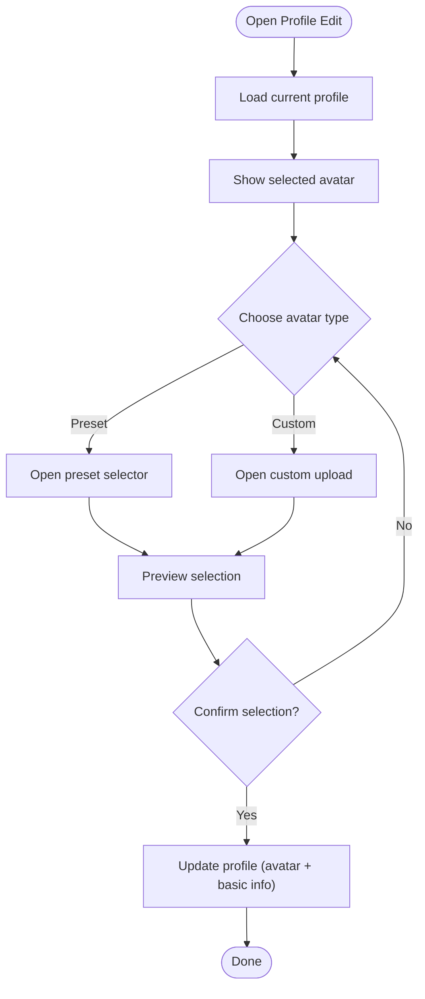
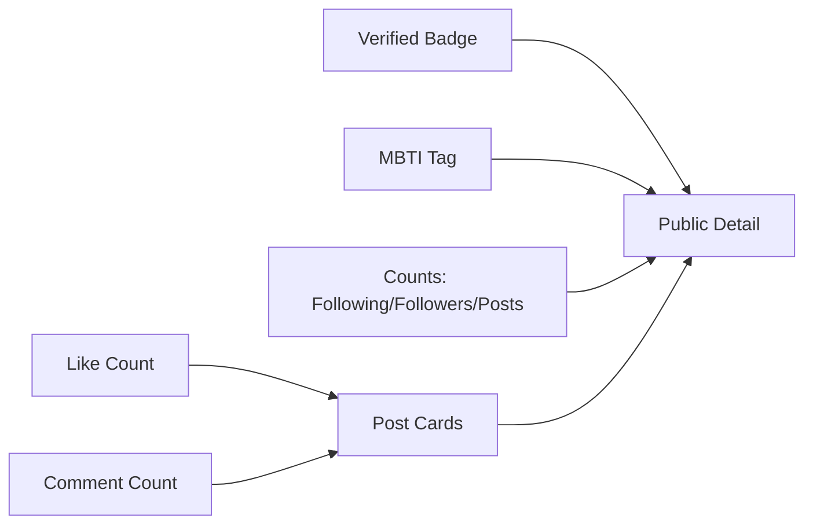
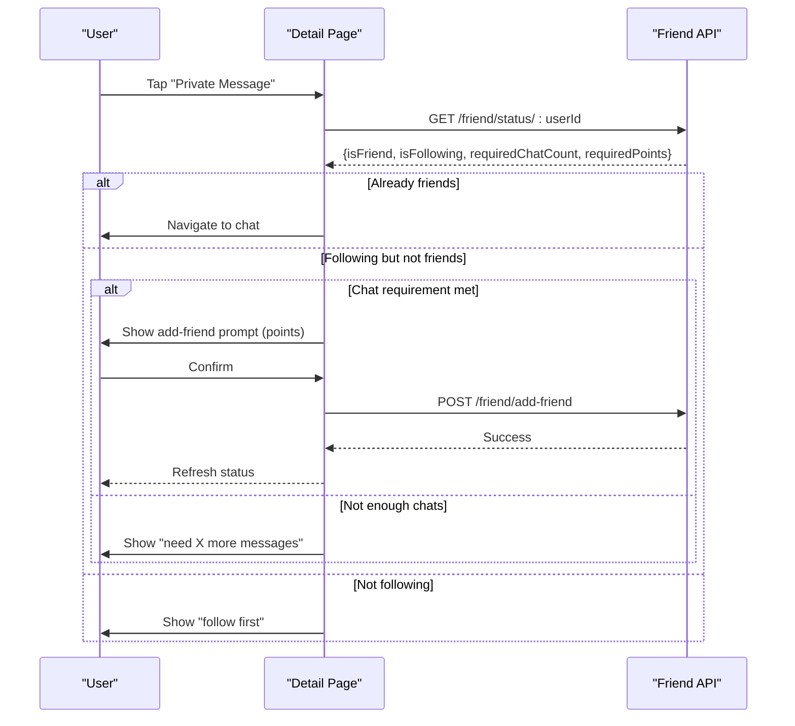
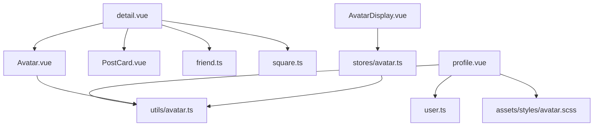

# Profile Display & Public View

<cite>
**Referenced Files in This Document**
- [profile.vue](file://src/pages/user/profile.vue)
- [detail.vue](file://src/pages/user/detail.vue)
- [Avatar.vue](file://src/components/common/Avatar.vue)
- [AvatarDisplay.vue](file://src/components/business/AvatarDisplay.vue)
- [avatar.ts](file://src/stores/avatar.ts)
- [avatar.ts](file://src/utils/avatar.ts)
- [avatar.scss](file://src/assets/styles/avatar.scss)
- [UserDetailSkeleton.vue](file://src/pages/user/components/UserDetailSkeleton.vue)
- [PostCard.vue](file://src/components/business/PostCard.vue)
- [user.ts](file://src/api/modules/user.ts)
- [friend.ts](file://src/api/modules/friend.ts)
- [square.ts](file://src/api/modules/square.ts)
- [friend.ts](file://src/stores/friend.ts)
</cite>

## Table of Contents
1. [Introduction](#introduction)
2. [Project Structure](#project-structure)
3. [Core Components](#core-components)
4. [Architecture Overview](#architecture-overview)
5. [Detailed Component Analysis](#detailed-component-analysis)
6. [Dependency Analysis](#dependency-analysis)
7. [Performance Considerations](#performance-considerations)
8. [Troubleshooting Guide](#troubleshooting-guide)
9. [Conclusion](#conclusion)

## Introduction
This document describes the profile display system, covering the public profile view, user detail page, and profile presentation components. It explains how profile data is aggregated, privacy-aware rendering is applied, and responsive design is implemented. It also documents the avatar display system, profile statistics, social proof elements, messaging and friendship integration, analytics and visitor tracking considerations, and mobile-first design approaches for cross-platform consistency.

## Project Structure
The profile system spans three primary areas:
- User profile editing and avatar selection
- Public user detail view with stats and social actions
- Reusable avatar components and utilities

**Diagram sources**
- [profile.vue:133-349](file://src/pages/user/profile.vue#L133-L349)
- [detail.vue:93-408](file://src/pages/user/detail.vue#L93-L408)
- [Avatar.vue:17-42](file://src/components/common/Avatar.vue#L17-L42)
- [AvatarDisplay.vue:24-42](file://src/components/business/AvatarDisplay.vue#L24-L42)
- [avatar.ts:9-51](file://src/stores/avatar.ts#L9-L51)
- [avatar.ts:53-92](file://src/utils/avatar.ts#L53-L92)
- [avatar.scss:1-753](file://src/assets/styles/avatar.scss#L1-L753)
- [UserDetailSkeleton.vue:1-216](file://src/pages/user/components/UserDetailSkeleton.vue#L1-L216)
- [PostCard.vue:96-290](file://src/components/business/PostCard.vue#L96-L290)
- [user.ts:23-100](file://src/api/modules/user.ts#L23-L100)
- [friend.ts:16-61](file://src/api/modules/friend.ts#L16-L61)
- [square.ts:43-97](file://src/api/modules/square.ts#L43-L97)

**Section sources**
- [profile.vue:1-717](file://src/pages/user/profile.vue#L1-L717)
- [detail.vue:1-569](file://src/pages/user/detail.vue#L1-L569)
- [Avatar.vue:1-95](file://src/components/common/Avatar.vue#L1-L95)
- [AvatarDisplay.vue:1-87](file://src/components/business/AvatarDisplay.vue#L1-L87)
- [avatar.ts:1-52](file://src/stores/avatar.ts#L1-L52)
- [avatar.ts:1-93](file://src/utils/avatar.ts#L1-L93)
- [avatar.scss:1-753](file://src/assets/styles/avatar.scss#L1-L753)
- [UserDetailSkeleton.vue:1-216](file://src/pages/user/components/UserDetailSkeleton.vue#L1-L216)
- [PostCard.vue:1-628](file://src/components/business/PostCard.vue#L1-L628)
- [user.ts:1-101](file://src/api/modules/user.ts#L1-L101)
- [friend.ts:1-61](file://src/api/modules/friend.ts#L1-L61)
- [square.ts:1-98](file://src/api/modules/square.ts#L1-L98)

## Core Components
- Public user detail page: renders avatar, verification badge, MBTI tag, stats, action buttons, and user posts.
- Avatar components: centralized display logic for MBTI sprite-based and custom avatar rendering.
- Avatar utilities: compute display URLs and MBTI metadata.
- Profile editing page: allows changing nickname, gender, and selecting avatar (preset or custom).
- Social integration: follow, chat, report, and block flows with optimistic updates and modal prompts.
- Skeleton loader: smooth loading experience while fetching user data.

**Section sources**
- [detail.vue:1-569](file://src/pages/user/detail.vue#L1-L569)
- [Avatar.vue:1-95](file://src/components/common/Avatar.vue#L1-L95)
- [AvatarDisplay.vue:1-87](file://src/components/business/AvatarDisplay.vue#L1-L87)
- [avatar.ts:53-92](file://src/utils/avatar.ts#L53-L92)
- [profile.vue:1-717](file://src/pages/user/profile.vue#L1-L717)
- [UserDetailSkeleton.vue:1-216](file://src/pages/user/components/UserDetailSkeleton.vue#L1-L216)

## Architecture Overview
The profile system follows a layered architecture:
- Presentation layer: Vue Single File Components for profile editing and public detail views.
- Component layer: reusable Avatar and PostCard components.
- Utility layer: avatar display computation and SCSS sprite styles.
- API layer: user, friend, and square APIs for profile data, social actions, and posts.
- State layer: Pinia stores for avatar and friendship state.

**Diagram sources**
- [detail.vue:93-408](file://src/pages/user/detail.vue#L93-L408)
- [profile.vue:133-349](file://src/pages/user/profile.vue#L133-L349)
- [Avatar.vue:17-42](file://src/components/common/Avatar.vue#L17-L42)
- [PostCard.vue:96-290](file://src/components/business/PostCard.vue#L96-L290)
- [AvatarDisplay.vue:24-42](file://src/components/business/AvatarDisplay.vue#L24-L42)
- [avatar.ts:53-92](file://src/utils/avatar.ts#L53-L92)
- [avatar.ts:9-51](file://src/stores/avatar.ts#L9-L51)
- [avatar.scss:1-753](file://src/assets/styles/avatar.scss#L1-L753)
- [user.ts:23-100](file://src/api/modules/user.ts#L23-L100)
- [friend.ts:16-61](file://src/api/modules/friend.ts#L16-L61)
- [square.ts:43-97](file://src/api/modules/square.ts#L43-L97)

## Detailed Component Analysis

### Public User Detail Page
The public detail page aggregates user info, stats, and posts. It supports:
- Avatar display with MBTI sprite fallback and verification badge.
- Stats: following, followers, and post counts.
- Actions: follow/unfollow, private message with friendship gating, report, and block.
- Posts: list of user’s posts rendered via PostCard.

**Diagram sources**
- [detail.vue:117-155](file://src/pages/user/detail.vue#L117-L155)
- [detail.vue:157-195](file://src/pages/user/detail.vue#L157-L195)
- [detail.vue:197-286](file://src/pages/user/detail.vue#L197-L286)
- [detail.vue:144-155](file://src/pages/user/detail.vue#L144-L155)
- [friend.ts:47-48](file://src/api/modules/friend.ts#L47-L48)
- [square.ts:47-48](file://src/api/modules/square.ts#L47-L48)

**Section sources**
- [detail.vue:1-569](file://src/pages/user/detail.vue#L1-L569)
- [Avatar.vue:1-95](file://src/components/common/Avatar.vue#L1-L95)
- [PostCard.vue:1-628](file://src/components/business/PostCard.vue#L1-L628)
- [friend.ts:1-61](file://src/api/modules/friend.ts#L1-L61)
- [square.ts:1-98](file://src/api/modules/square.ts#L1-L98)

### Avatar Display System
Avatar rendering is centralized:
- MBTI sprite-based avatars use a CSS sprite sheet with 49 positions.
- Custom avatars are displayed via image URLs.
- Utilities compute display metadata and sizes.
- Stores manage selected avatar state and persistence.

**Diagram sources**
- [avatar.ts:53-92](file://src/utils/avatar.ts#L53-L92)
- [Avatar.vue:17-42](file://src/components/common/Avatar.vue#L17-L42)
- [AvatarDisplay.vue:24-42](file://src/components/business/AvatarDisplay.vue#L24-L42)
- [avatar.ts:9-51](file://src/stores/avatar.ts#L9-L51)

**Section sources**
- [avatar.ts:1-93](file://src/utils/avatar.ts#L1-L93)
- [Avatar.vue:1-95](file://src/components/common/Avatar.vue#L1-L95)
- [AvatarDisplay.vue:1-87](file://src/components/business/AvatarDisplay.vue#L1-L87)
- [avatar.ts:1-52](file://src/stores/avatar.ts#L1-L52)
- [avatar.scss:1-753](file://src/assets/styles/avatar.scss#L1-L753)

### Profile Editing and Avatar Selection
The profile editing page allows:
- Editing nickname and gender.
- Selecting an avatar via preset MBTI or custom upload.
- Uploading custom avatar and updating user profile.

**Diagram sources**
- [profile.vue:165-177](file://src/pages/user/profile.vue#L165-L177)
- [profile.vue:182-278](file://src/pages/user/profile.vue#L182-L278)
- [profile.vue:299-348](file://src/pages/user/profile.vue#L299-L348)
- [user.ts:36-46](file://src/api/modules/user.ts#L36-L46)

**Section sources**
- [profile.vue:1-717](file://src/pages/user/profile.vue#L1-L717)
- [user.ts:1-101](file://src/api/modules/user.ts#L1-L101)

### Social Proof Elements and Engagement
Social proof includes:
- Verified badge for identity verification.
- MBTI tag derived from avatar metadata.
- Following/follower counts and post counts.
- Interaction counts on posts (likes, comments).

**Diagram sources**
- [detail.vue:17-25](file://src/pages/user/detail.vue#L17-L25)
- [detail.vue:32-46](file://src/pages/user/detail.vue#L32-L46)
- [PostCard.vue:48-66](file://src/components/business/PostCard.vue#L48-L66)

**Section sources**
- [detail.vue:1-569](file://src/pages/user/detail.vue#L1-L569)
- [PostCard.vue:1-628](file://src/components/business/PostCard.vue#L1-L628)

### Messaging and Friendship Integration
Messaging and friendship flows:
- Check friendship status before enabling chat.
- Enforce chat count and points requirements for adding friends.
- Optimistic UI updates for follow/unfollow.
- Report and block actions with confirmation modals.

**Diagram sources**
- [detail.vue:197-286](file://src/pages/user/detail.vue#L197-L286)
- [friend.ts:47-48](file://src/api/modules/friend.ts#L47-L48)
- [friend.ts:44-45](file://src/api/modules/friend.ts#L44-L45)

**Section sources**
- [detail.vue:1-569](file://src/pages/user/detail.vue#L1-L569)
- [friend.ts:1-61](file://src/api/modules/friend.ts#L1-L61)

## Dependency Analysis
Key dependencies and coupling:
- Public detail depends on Avatar, PostCard, friend, and square APIs.
- Avatar components depend on avatar utilities for display metadata.
- Profile editing depends on user API and avatar utilities.
- Avatar store persists selected avatar across sessions.

**Diagram sources**
- [detail.vue:93-408](file://src/pages/user/detail.vue#L93-L408)
- [profile.vue:133-349](file://src/pages/user/profile.vue#L133-L349)
- [Avatar.vue:17-42](file://src/components/common/Avatar.vue#L17-L42)
- [AvatarDisplay.vue:24-42](file://src/components/business/AvatarDisplay.vue#L24-L42)
- [avatar.ts:53-92](file://src/utils/avatar.ts#L53-L92)
- [avatar.ts:9-51](file://src/stores/avatar.ts#L9-L51)
- [avatar.scss:1-753](file://src/assets/styles/avatar.scss#L1-L753)
- [user.ts:23-100](file://src/api/modules/user.ts#L23-L100)
- [friend.ts:16-61](file://src/api/modules/friend.ts#L16-L61)
- [square.ts:43-97](file://src/api/modules/square.ts#L43-L97)

**Section sources**
- [detail.vue:1-569](file://src/pages/user/detail.vue#L1-L569)
- [profile.vue:1-717](file://src/pages/user/profile.vue#L1-L717)
- [Avatar.vue:1-95](file://src/components/common/Avatar.vue#L1-L95)
- [AvatarDisplay.vue:1-87](file://src/components/business/AvatarDisplay.vue#L1-L87)
- [avatar.ts:1-93](file://src/utils/avatar.ts#L1-L93)
- [avatar.ts:1-52](file://src/stores/avatar.ts#L1-L52)
- [avatar.scss:1-753](file://src/assets/styles/avatar.scss#L1-L753)
- [user.ts:1-101](file://src/api/modules/user.ts#L1-L101)
- [friend.ts:1-61](file://src/api/modules/friend.ts#L1-L61)
- [square.ts:1-98](file://src/api/modules/square.ts#L1-L98)

## Performance Considerations
- Lazy loading and placeholders for post images reduce initial payload and improve perceived performance.
- Optimistic UI updates for follow and like actions provide immediate feedback.
- Skeleton loaders prevent layout shift during data fetch.
- CSS sprites minimize HTTP requests for MBTI avatars.
- Persistent avatar store avoids recomputation and re-fetching.

[No sources needed since this section provides general guidance]

## Troubleshooting Guide
Common issues and resolutions:
- Avatar not updating after selection: ensure custom avatar upload completes and response URL is set; verify profile save payload includes correct avatar fields.
- Follow/unfollow state mismatch: check optimistic update rollback on failure and confirm server response.
- Private message disabled: verify friendship status checks and chat count/points thresholds.
- Post likes not reflected: ensure toggleLike endpoint is called and optimistic counters are rolled back on error.
- Skeleton not hiding: confirm loading flag transitions to false after successful fetch.

**Section sources**
- [profile.vue:299-348](file://src/pages/user/profile.vue#L299-L348)
- [detail.vue:157-195](file://src/pages/user/detail.vue#L157-L195)
- [detail.vue:197-286](file://src/pages/user/detail.vue#L197-L286)
- [PostCard.vue:162-178](file://src/components/business/PostCard.vue#L162-L178)

## Conclusion
The profile display system integrates avatar management, public user detail rendering, and social features cohesively. It emphasizes responsive design, optimistic UI updates, and reusable components. The architecture supports cross-platform consistency through shared utilities and styles, while privacy-aware rendering ensures appropriate presentation of verified badges and MBTI tags. Future enhancements could include visitor tracking and engagement metrics display at the profile level, complementing existing post-level interactions.