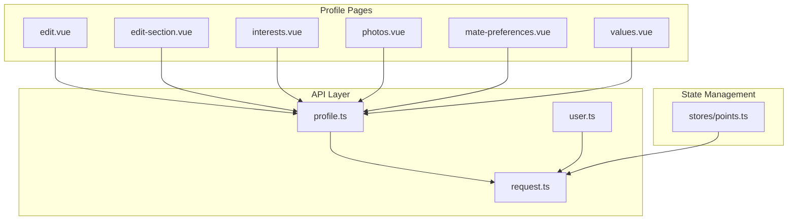
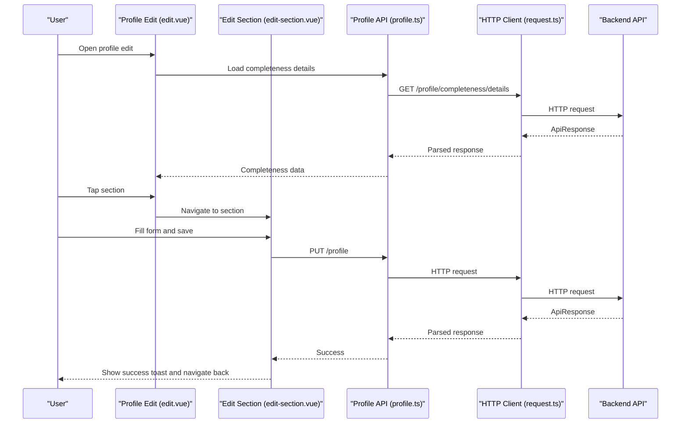
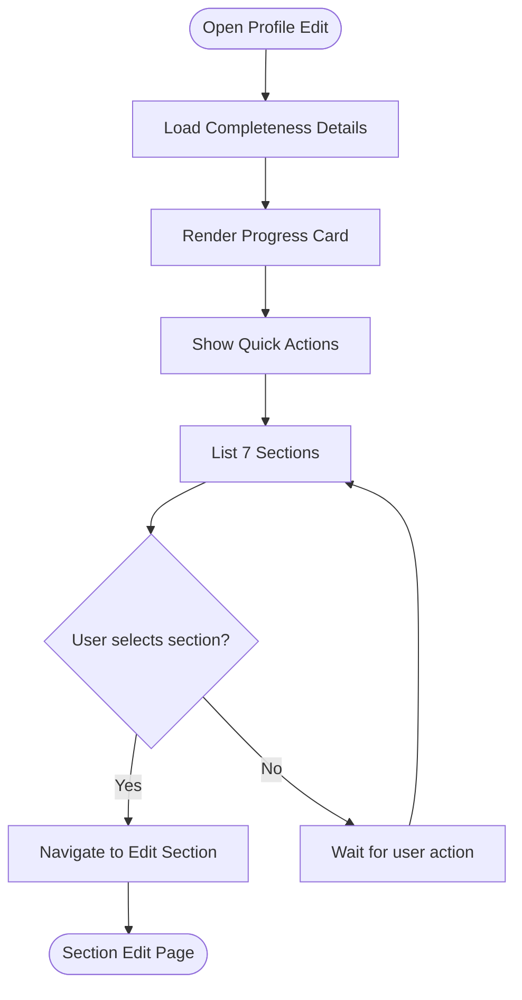
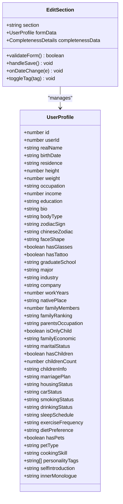
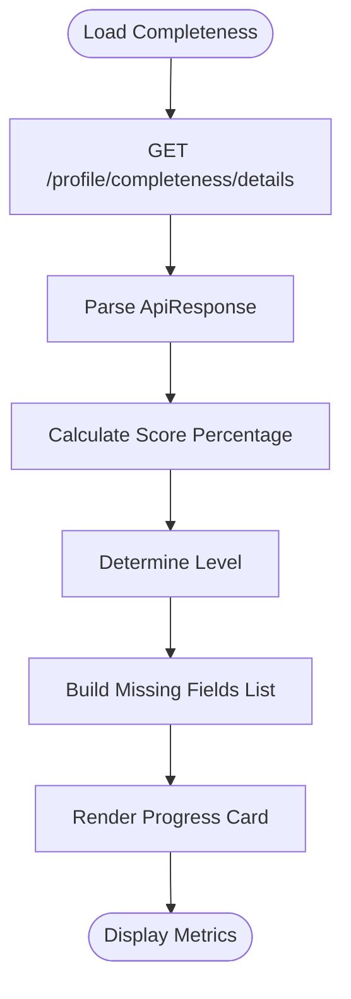
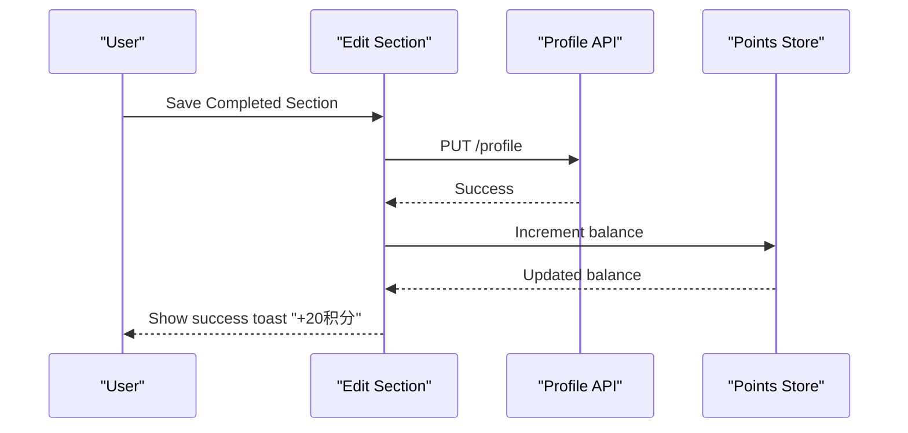
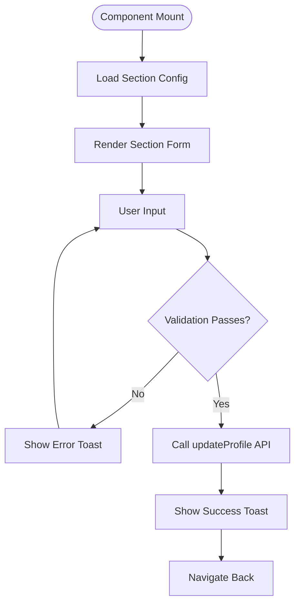
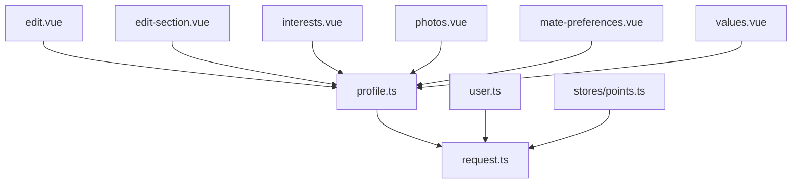

# Profile Editing System

<cite>
**Referenced Files in This Document**
- [edit-section.vue](file://src/pages/profile/edit-section.vue)
- [edit.vue](file://src/pages/profile/edit.vue)
- [profile.ts](file://src/api/profile.ts)
- [backend-types.ts](file://src/types/api/backend-types.ts)
- [request.ts](file://src/api/request.ts)
- [points.ts](file://src/stores/points.ts)
- [user.ts](file://src/api/modules/user.ts)
- [interests.vue](file://src/pages/profile/interests.vue)
- [photos.vue](file://src/pages/profile/photos.vue)
- [mate-preferences.vue](file://src/pages/profile/mate-preferences.vue)
- [values.vue](file://src/pages/profile/values.vue)
</cite>

## Table of Contents
1. [Introduction](#introduction)
2. [Project Structure](#project-structure)
3. [Core Components](#core-components)
4. [Architecture Overview](#architecture-overview)
5. [Detailed Component Analysis](#detailed-component-analysis)
6. [Dependency Analysis](#dependency-analysis)
7. [Performance Considerations](#performance-considerations)
8. [Troubleshooting Guide](#troubleshooting-guide)
9. [Conclusion](#conclusion)

## Introduction
This document describes the profile editing system in WeTogether, focusing on the 7-section profile completion workflow, the profile completeness scoring system, the reward mechanism for completing sections, visual indicators for section status, the edit-section component implementation, form validation, and data persistence. It also documents the integration with the points system and the user experience flow for profile updates.

## Project Structure
The profile editing system is organized around several Vue Single File Components (SFCs) under the profile pages directory, with dedicated API modules for profile data and a shared HTTP client. The system follows a modular architecture:
- Edit profile overview page orchestrates the 7-section workflow and displays completeness metrics
- Edit section page handles individual section forms with validation and persistence
- Supporting pages manage related profile features (interests, photos, mate preferences, values)
- API modules encapsulate backend communication and data typing
- Shared request client manages authentication, token refresh, and error handling

**Diagram sources**
- [edit.vue:1-567](file://src/pages/profile/edit.vue#L1-L567)
- [edit-section.vue:1-785](file://src/pages/profile/edit-section.vue#L1-L785)
- [profile.ts:1-311](file://src/api/profile.ts#L1-L311)
- [user.ts:1-97](file://src/api/modules/user.ts#L1-L97)
- [request.ts:1-228](file://src/api/request.ts#L1-L228)
- [points.ts:1-72](file://src/stores/points.ts#L1-L72)

**Section sources**
- [edit.vue:1-567](file://src/pages/profile/edit.vue#L1-L567)
- [edit-section.vue:1-785](file://src/pages/profile/edit-section.vue#L1-L785)
- [profile.ts:1-311](file://src/api/profile.ts#L1-L311)
- [user.ts:1-97](file://src/api/modules/user.ts#L1-L97)
- [request.ts:1-228](file://src/api/request.ts#L1-L228)
- [points.ts:1-72](file://src/stores/points.ts#L1-L72)

## Core Components
- Profile edit overview: Displays profile completeness progress, missing fields, quick actions, and the 7-section workflow with reward indicators
- Edit section: Handles individual section forms, validation, and persistence for each of the 7 sections
- Supporting pages: Interests, photos, mate preferences, and values management
- API modules: Define typed requests for profile data, user data, and points
- Request client: Centralized HTTP client with token management and automatic refresh

Key responsibilities:
- Orchestrate the 7-section profile completion workflow
- Validate form inputs according to business rules
- Persist profile data to backend APIs
- Integrate with points system for rewards
- Provide visual feedback for section status and completeness

**Section sources**
- [edit.vue:1-567](file://src/pages/profile/edit.vue#L1-L567)
- [edit-section.vue:1-785](file://src/pages/profile/edit-section.vue#L1-L785)
- [profile.ts:1-311](file://src/api/profile.ts#L1-L311)
- [user.ts:1-97](file://src/api/modules/user.ts#L1-L97)
- [request.ts:1-228](file://src/api/request.ts#L1-L228)

## Architecture Overview
The profile editing system follows a layered architecture:
- Presentation layer: Vue SFCs render forms and manage user interactions
- Business logic: Validation, state updates, and navigation logic
- Data access layer: API modules encapsulate HTTP requests
- Infrastructure: Shared request client handles authentication and token refresh

**Diagram sources**
- [edit.vue:234-275](file://src/pages/profile/edit.vue#L234-L275)
- [edit-section.vue:592-620](file://src/pages/profile/edit-section.vue#L592-L620)
- [profile.ts:144-150](file://src/api/profile.ts#L144-L150)
- [request.ts:75-208](file://src/api/request.ts#L75-L208)

## Detailed Component Analysis

### Profile Edit Overview (edit.vue)
The overview page serves as the central hub for profile completion:
- Displays profile completeness score, level, and missing fields
- Provides quick actions to manage interests, photos, and mate preferences
- Presents the 7-section workflow with icons, field lists, and reward indicators
- Contains placeholders for section status and completion checks

**Diagram sources**
- [edit.vue:234-275](file://src/pages/profile/edit.vue#L234-L275)
- [edit.vue:277-287](file://src/pages/profile/edit.vue#L277-L287)
- [edit.vue:289-294](file://src/pages/profile/edit.vue#L289-L294)

**Section sources**
- [edit.vue:1-567](file://src/pages/profile/edit.vue#L1-L567)

### Edit Section Component (edit-section.vue)
The edit-section component implements the 7-section profile editing workflow:
- Section configuration with titles and descriptions
- Form rendering for each section (basic, appearance, education, lifestyle, personality, family, marital)
- Dynamic option lists for pickers and toggles
- Real-time validation with user-friendly error messages
- Persistence via API calls with loading states and success feedback

**Diagram sources**
- [edit-section.vue:416-625](file://src/pages/profile/edit-section.vue#L416-L625)
- [profile.ts:5-70](file://src/api/profile.ts#L5-L70)

**Section sources**
- [edit-section.vue:1-785](file://src/pages/profile/edit-section.vue#L1-L785)
- [profile.ts:5-70](file://src/api/profile.ts#L5-L70)

### Profile Completeness Scoring System
The completeness scoring system evaluates profile sections and calculates:
- Total score percentage based on completed fields
- Level classification (e.g., Basic)
- Missing fields list for targeted completion prompts
- Integration with the points system for rewards

**Diagram sources**
- [edit.vue:239-246](file://src/pages/profile/edit.vue#L239-L246)
- [profile.ts:148-150](file://src/api/profile.ts#L148-L150)

**Section sources**
- [edit.vue:221-246](file://src/pages/profile/edit.vue#L221-L246)
- [profile.ts:131-135](file://src/api/profile.ts#L131-L135)

### Reward Mechanism for Completing Sections
Each completed section provides a reward of +20积分 (points):
- Visual reward indicators (+20积分) displayed next to each section
- Automatic points increment upon successful section save
- Integration with points store for balance updates

**Diagram sources**
- [edit-section.vue:592-620](file://src/pages/profile/edit-section.vue#L592-L620)
- [points.ts:1-72](file://src/stores/points.ts#L1-L72)

**Section sources**
- [edit-section.vue:85-86](file://src/pages/profile/edit-section.vue#L85-L86)
- [edit-section.vue:603-607](file://src/pages/profile/edit-section.vue#L603-L607)
- [points.ts:1-72](file://src/stores/points.ts#L1-L72)

### Edit-Section Component Implementation Details
The edit-section component implements:
- Section routing via URL parameters (section query)
- Reactive form data binding with UserProfile interface
- Comprehensive validation rules for each section
- Dynamic option lists for pickers and toggles
- Conditional UI elements (e.g., child info visibility)
- Success feedback with navigation back

**Diagram sources**
- [edit-section.vue:422-424](file://src/pages/profile/edit-section.vue#L422-L424)
- [edit-section.vue:531-590](file://src/pages/profile/edit-section.vue#L531-L590)
- [edit-section.vue:592-620](file://src/pages/profile/edit-section.vue#L592-L620)

**Section sources**
- [edit-section.vue:416-625](file://src/pages/profile/edit-section.vue#L416-L625)
- [profile.ts:144-146](file://src/api/profile.ts#L144-L146)

### Form Validation and Data Persistence
Form validation enforces business rules:
- Basic section: Required fields, numeric ranges, date constraints
- Education section: Work years and income validation
- Family section: Family members count validation
- Marital section: Children count validation

Data persistence uses typed API calls:
- updateProfile for partial profile updates
- getCompletenessDetails for progress tracking
- Integration with request client for authentication and error handling

**Section sources**
- [edit-section.vue:531-590](file://src/pages/profile/edit-section.vue#L531-L590)
- [profile.ts:144-150](file://src/api/profile.ts#L144-L150)
- [request.ts:1-228](file://src/api/request.ts#L1-L228)

### Supporting Profile Features
The system includes complementary pages for comprehensive profile management:
- Interests: Manage hobby categories, levels, and completion metrics
- Photos: Upload, manage, and set avatar photos with completion tracking
- Mate Preferences: Define partner requirements with validation
- Values: Answer categorized questions about life philosophy with privacy controls

**Section sources**
- [interests.vue:1-645](file://src/pages/profile/interests.vue#L1-L645)
- [photos.vue:1-505](file://src/pages/profile/photos.vue#L1-L505)
- [mate-preferences.vue:1-559](file://src/pages/profile/mate-preferences.vue#L1-L559)
- [values.vue:1-599](file://src/pages/profile/values.vue#L1-L599)

## Dependency Analysis
The profile editing system exhibits clear separation of concerns:
- edit.vue depends on profile API for completeness data
- edit-section.vue depends on profile API for section persistence
- All API modules depend on the shared request client
- Points store integrates with points API for reward tracking

**Diagram sources**
- [edit.vue:217-219](file://src/pages/profile/edit.vue#L217-L219)
- [edit-section.vue:417-419](file://src/pages/profile/edit-section.vue#L417-L419)
- [profile.ts:1-311](file://src/api/profile.ts#L1-L311)
- [user.ts:1-97](file://src/api/modules/user.ts#L1-L97)
- [request.ts:1-228](file://src/api/request.ts#L1-L228)
- [points.ts:1-72](file://src/stores/points.ts#L1-L72)

**Section sources**
- [edit.vue:217-219](file://src/pages/profile/edit.vue#L217-L219)
- [edit-section.vue:417-419](file://src/pages/profile/edit-section.vue#L417-L419)
- [profile.ts:1-311](file://src/api/profile.ts#L1-L311)
- [user.ts:1-97](file://src/api/modules/user.ts#L1-L97)
- [request.ts:1-228](file://src/api/request.ts#L1-L228)
- [points.ts:1-72](file://src/stores/points.ts#L1-L72)

## Performance Considerations
- Form validation occurs locally before API calls to minimize network requests
- Loading states and toasts provide immediate user feedback during persistence
- Token refresh mechanism prevents frequent re-authentication
- Lazy loading of supporting features (interests, photos, preferences, values) reduces initial bundle size

## Troubleshooting Guide
Common issues and resolutions:
- Authentication failures: The request client automatically attempts token refresh; if unsuccessful, users are redirected to login
- Network errors: Toast notifications display error messages; users can retry after checking connectivity
- Validation errors: Specific field-level error messages guide users to correct inputs
- API response parsing: All responses are validated against ApiResponse structure before processing

**Section sources**
- [request.ts:100-147](file://src/api/request.ts#L100-L147)
- [edit-section.vue:612-619](file://src/pages/profile/edit-section.vue#L612-L619)

## Conclusion
The WeTogether profile editing system provides a comprehensive, user-friendly workflow for completing personal profiles across 7 distinct sections. The system balances usability with robust validation, integrates seamlessly with the points system for rewards, and maintains clear separation of concerns through its layered architecture. The combination of visual completeness indicators, contextual validation, and immediate feedback creates an efficient user experience for profile completion.