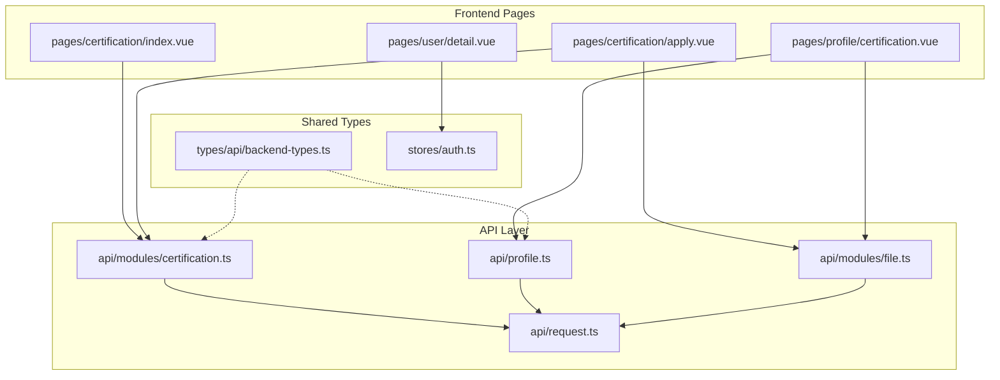
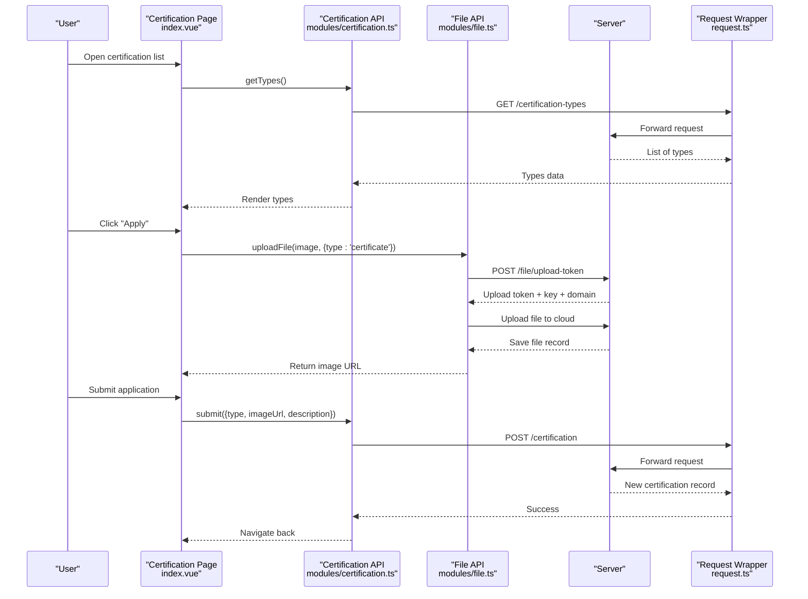
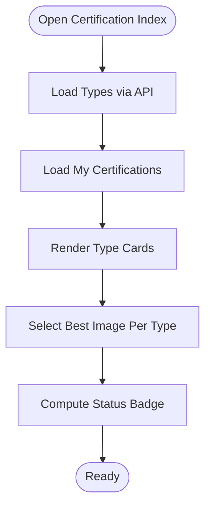
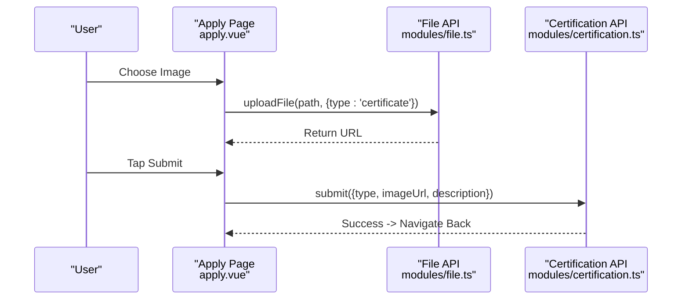
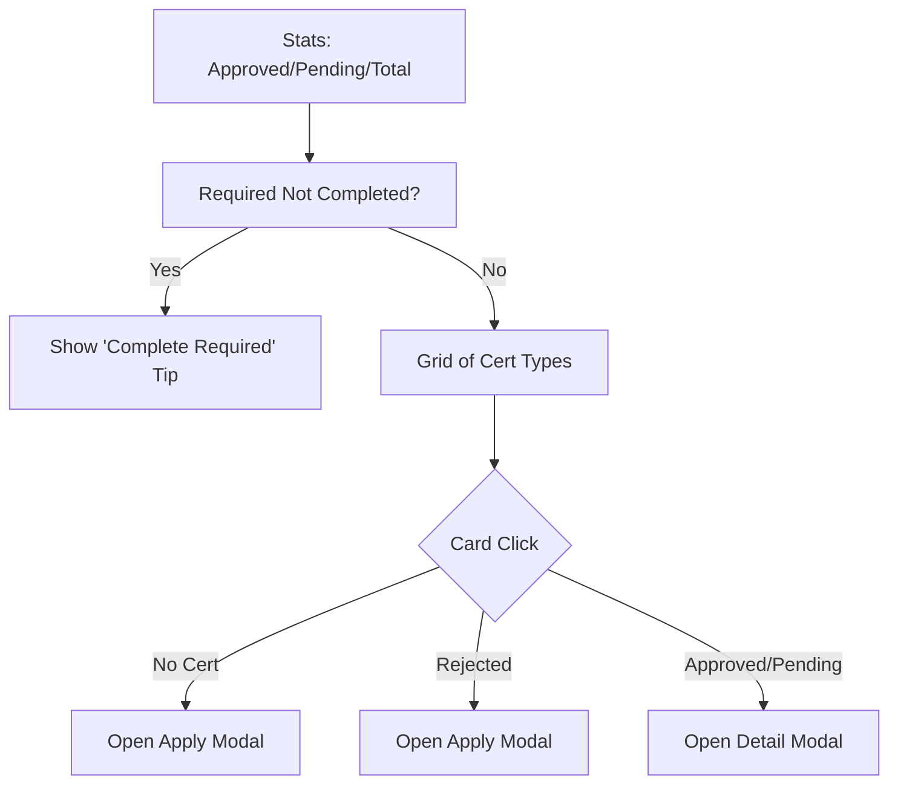
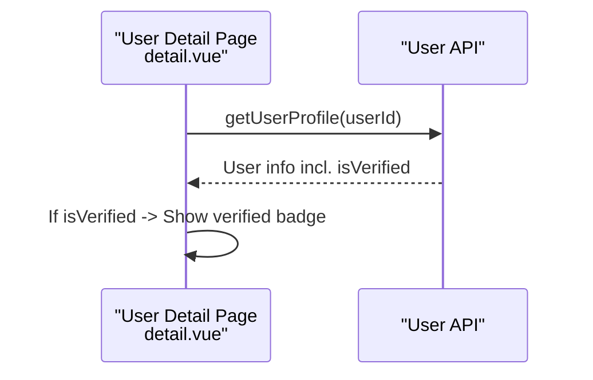
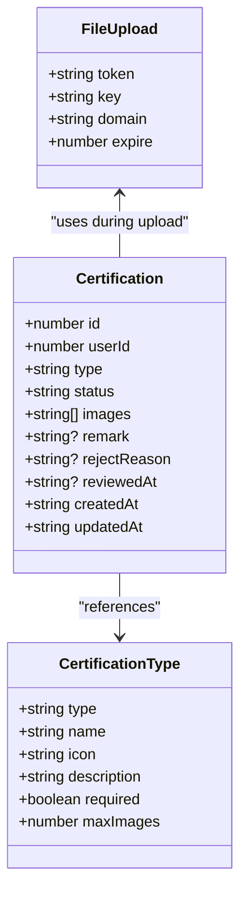
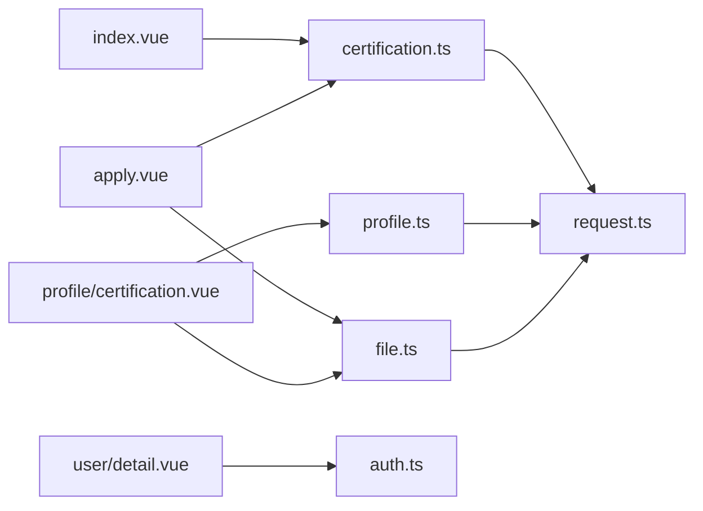

# Profile Verification System

<cite>
**Referenced Files in This Document**
- [certification.ts](file://src/api/modules/certification.ts)
- [profile.ts](file://src/api/profile.ts)
- [backend-types.ts](file://src/types/api/backend-types.ts)
- [file.ts](file://src/api/modules/file.ts)
- [request.ts](file://src/api/request.ts)
- [index.vue](file://src/pages/certification/index.vue)
- [apply.vue](file://src/pages/certification/apply.vue)
- [certification.vue](file://src/pages/profile/certification.vue)
- [detail.vue](file://src/pages/user/detail.vue)
- [auth.ts](file://src/stores/auth.ts)
</cite>

## Table of Contents
1. [Introduction](#introduction)
2. [Project Structure](#project-structure)
3. [Core Components](#core-components)
4. [Architecture Overview](#architecture-overview)
5. [Detailed Component Analysis](#detailed-component-analysis)
6. [Dependency Analysis](#dependency-analysis)
7. [Performance Considerations](#performance-considerations)
8. [Troubleshooting Guide](#troubleshooting-guide)
9. [Conclusion](#conclusion)

## Introduction
This document describes the profile verification system, covering the complete workflow from document submission to badge display, certification types and criteria, approval processes, API integrations, supported verification documents, processing indicators, and the relationship between verified profiles and platform benefits. It also outlines compliance considerations and the user onboarding experience.

## Project Structure
The verification system spans three primary areas:
- API layer: certification endpoints and file upload integration
- Frontend pages: certification listing, application form, and profile management
- Types and stores: shared type definitions and authentication state

**Diagram sources**
- [index.vue:1-358](file://src/pages/certification/index.vue#L1-L358)
- [apply.vue:1-276](file://src/pages/certification/apply.vue#L1-L276)
- [certification.vue:1-968](file://src/pages/profile/certification.vue#L1-L968)
- [certification.ts:1-55](file://src/api/modules/certification.ts#L1-L55)
- [profile.ts:279-311](file://src/api/profile.ts#L279-L311)
- [file.ts:1-335](file://src/api/modules/file.ts#L1-L335)
- [request.ts:1-228](file://src/api/request.ts#L1-L228)
- [backend-types.ts:549-587](file://src/types/api/backend-types.ts#L549-L587)
- [auth.ts:1-137](file://src/stores/auth.ts#L1-L137)

**Section sources**
- [index.vue:1-358](file://src/pages/certification/index.vue#L1-L358)
- [apply.vue:1-276](file://src/pages/certification/apply.vue#L1-L276)
- [certification.vue:1-968](file://src/pages/profile/certification.vue#L1-L968)
- [certification.ts:1-55](file://src/api/modules/certification.ts#L1-L55)
- [profile.ts:279-311](file://src/api/profile.ts#L279-L311)
- [file.ts:1-335](file://src/api/modules/file.ts#L1-L335)
- [request.ts:1-228](file://src/api/request.ts#L1-L228)
- [backend-types.ts:549-587](file://src/types/api/backend-types.ts#L549-L587)
- [auth.ts:1-137](file://src/stores/auth.ts#L1-L137)

## Core Components
- Certification API module: exposes endpoints to list certification types, submit applications, and fetch details.
- Profile certification management: centralized UI for viewing stats, required certifications, applying, and reviewing details.
- File upload integration: handles secure token acquisition, upload to cloud storage, and saving records.
- Authentication store: manages session state and ensures protected routes.
- Backend type definitions: standardized DTOs and enums for certification types and statuses.

Key responsibilities:
- Document submission via image upload and optional description.
- Real-time status tracking (pending/approved/rejected).
- Badge display on user profiles upon successful verification.
- Required certification enforcement for platform benefits.

**Section sources**
- [certification.ts:34-54](file://src/api/modules/certification.ts#L34-L54)
- [profile.ts:296-310](file://src/api/profile.ts#L296-L310)
- [file.ts:90-230](file://src/api/modules/file.ts#L90-L230)
- [auth.ts:16-29](file://src/stores/auth.ts#L16-L29)

## Architecture Overview
The verification workflow integrates frontend pages with API modules and cloud file storage:

**Diagram sources**
- [index.vue:90-120](file://src/pages/certification/index.vue#L90-L120)
- [certification.ts:34-54](file://src/api/modules/certification.ts#L34-L54)
- [file.ts:90-230](file://src/api/modules/file.ts#L90-L230)
- [request.ts:75-208](file://src/api/request.ts#L75-L208)

## Detailed Component Analysis

### Certification Listing and Status Display
- Lists available certification types with icons and descriptions.
- Shows user’s own certifications with status badges and timestamps.
- Uses priority logic to select the most relevant image per type for display.

**Diagram sources**
- [index.vue:90-170](file://src/pages/certification/index.vue#L90-L170)

**Section sources**
- [index.vue:1-358](file://src/pages/certification/index.vue#L1-L358)

### Application Form and Upload Workflow
- Supports choosing images from album or camera.
- Immediately uploads to cloud storage and obtains a URL.
- Submits certification application with type, image URL, and optional description.

**Diagram sources**
- [apply.vue:70-153](file://src/pages/certification/apply.vue#L70-L153)
- [file.ts:90-230](file://src/api/modules/file.ts#L90-L230)
- [certification.ts:41-42](file://src/api/modules/certification.ts#L41-L42)

**Section sources**
- [apply.vue:1-276](file://src/pages/certification/apply.vue#L1-L276)
- [file.ts:1-335](file://src/api/modules/file.ts#L1-L335)
- [certification.ts:1-55](file://src/api/modules/certification.ts#L1-L55)

### Profile-Level Certification Management
- Centralized dashboard showing statistics (approved, pending, total).
- Enforces required certifications (identity and photo).
- Allows multi-image uploads per certification type with modal UI.
- Provides detail view with rejection reason and timestamps.

**Diagram sources**
- [certification.vue:288-306](file://src/pages/profile/certification.vue#L288-L306)
- [certification.vue:371-391](file://src/pages/profile/certification.vue#L371-L391)
- [certification.vue:393-420](file://src/pages/profile/certification.vue#L393-L420)

**Section sources**
- [certification.vue:1-968](file://src/pages/profile/certification.vue#L1-L968)
- [profile.ts:279-311](file://src/api/profile.ts#L279-L311)

### Badge Display on User Profiles
- Verified users display a badge next to their nickname.
- The badge is shown when the user profile indicates verification.

**Diagram sources**
- [detail.vue:15-25](file://src/pages/user/detail.vue#L15-L25)

**Section sources**
- [detail.vue:1-569](file://src/pages/user/detail.vue#L1-L569)

### API Definitions and Types
- Certification types and statuses are defined centrally.
- Endpoints support listing, applying, and retrieving details.
- File upload uses typed upload tokens and records.

**Diagram sources**
- [profile.ts:283-294](file://src/api/profile.ts#L283-L294)
- [profile.ts:212-269](file://src/api/profile.ts#L212-L269)
- [file.ts:259-262](file://src/api/modules/file.ts#L259-L262)

**Section sources**
- [profile.ts:279-311](file://src/api/profile.ts#L279-L311)
- [backend-types.ts:549-587](file://src/types/api/backend-types.ts#L549-L587)
- [file.ts:259-262](file://src/api/modules/file.ts#L259-L262)

## Dependency Analysis
- Pages depend on API modules for data fetching and mutations.
- File uploads depend on a token endpoint and cloud upload service.
- Authentication store ensures protected access to certification features.
- Type definitions unify backend contracts across modules.

**Diagram sources**
- [index.vue:63-67](file://src/pages/certification/index.vue#L63-L67)
- [apply.vue:38-39](file://src/pages/certification/apply.vue#L38-L39)
- [certification.vue:204-209](file://src/pages/profile/certification.vue#L204-L209)
- [certification.ts:1-7](file://src/api/modules/certification.ts#L1-L7)
- [profile.ts:1-3](file://src/api/profile.ts#L1-L3)
- [file.ts:1-2](file://src/api/modules/file.ts#L1-L2)
- [request.ts:1-3](file://src/api/request.ts#L1-L3)
- [auth.ts:1-7](file://src/stores/auth.ts#L1-L7)

**Section sources**
- [index.vue:59-88](file://src/pages/certification/index.vue#L59-L88)
- [apply.vue:36-68](file://src/pages/certification/apply.vue#L36-L68)
- [certification.vue:201-209](file://src/pages/profile/certification.vue#L201-L209)
- [request.ts:1-228](file://src/api/request.ts#L1-L228)

## Performance Considerations
- Immediate upload after selection reduces UI latency; ensure progress feedback and error handling remain responsive.
- Batch image uploads in the profile-level UI should be optimized to avoid overwhelming the server.
- Token-based uploads minimize server-side processing overhead by delegating to cloud providers.

## Troubleshooting Guide
Common issues and resolutions:
- Upload failures: Verify token acquisition and network connectivity; confirm file type and size constraints.
- Authentication errors: Refresh token flow handles 401 responses; ensure storage keys are present.
- Missing verification badge: Confirm backend user profile reflects verification status.

Operational checks:
- Network requests: Inspect request wrapper logs for 401/403 responses and automatic retry behavior.
- File uploads: Validate upload token validity and cloud provider response codes.

**Section sources**
- [request.ts:100-147](file://src/api/request.ts#L100-L147)
- [file.ts:164-230](file://src/api/modules/file.ts#L164-L230)

## Conclusion
The profile verification system provides a robust, user-friendly pathway for identity and supporting document verification. It integrates secure file uploads, clear status tracking, and visible badges on user profiles. The modular API design and centralized type definitions enable maintainable enhancements while preserving a consistent user experience across certification types and platforms.