# User Profiles

<cite>
**Referenced Files in This Document**
- [profile.ts](file://src/api/profile.ts)
- [file.ts](file://src/api/modules/file.ts)
- [qiniu.service.ts](file://src/services/qiniu.service.ts)
- [edit.vue](file://src/pages/profile/edit.vue)
- [edit-section.vue](file://src/pages/profile/edit-section.vue)
- [interests.vue](file://src/pages/profile/interests.vue)
- [photos.vue](file://src/pages/profile/photos.vue)
- [privacy.vue](file://src/pages/profile/privacy.vue)
- [mate-preferences.vue](file://src/pages/profile/mate-preferences.vue)
- [values.vue](file://src/pages/profile/values.vue)
- [certification.vue](file://src/pages/profile/certification.vue)
- [auth.ts](file://src/stores/auth.ts)
- [validate.ts](file://src/utils/validate.ts)
</cite>

## Table of Contents
1. [Introduction](#introduction)
2. [Project Structure](#project-structure)
3. [Core Components](#core-components)
4. [Architecture Overview](#architecture-overview)
5. [Detailed Component Analysis](#detailed-component-analysis)
6. [Dependency Analysis](#dependency-analysis)
7. [Performance Considerations](#performance-considerations)
8. [Troubleshooting Guide](#troubleshooting-guide)
9. [Conclusion](#conclusion)

## Introduction
This document describes the WeTogether user profile system comprehensively. It covers profile editing, interest management, photo galleries, privacy settings, values management, certification, and the profile completion workflow. It also documents the API surface for profile operations, client-side state management, validation, and image upload handling. The goal is to provide both technical depth and practical guidance for developers and product teams building or maintaining the profile experience.

## Project Structure
The profile system spans API definitions, page components, image upload services, and state management:
- API layer: centralized profile API module defines typed models and endpoints for profile, interests, photos, privacy, values, and certifications.
- Page components: Vue single-file components implement the UI for editing, interests, photos, privacy, mate preferences, values, and certification.
- Image upload: file API and Qiniu service integrate cloud storage for photos and certificates.
- State management: Pinia store manages authentication and user info updates.

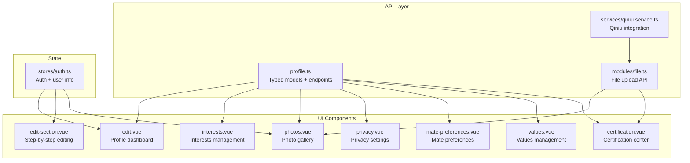

**Diagram sources**
- [profile.ts:1-311](file://src/api/profile.ts#L1-L311)
- [file.ts:1-335](file://src/api/modules/file.ts#L1-L335)
- [qiniu.service.ts:1-126](file://src/services/qiniu.service.ts#L1-L126)
- [edit.vue:1-567](file://src/pages/profile/edit.vue#L1-L567)
- [edit-section.vue:1-785](file://src/pages/profile/edit-section.vue#L1-L785)
- [interests.vue:1-645](file://src/pages/profile/interests.vue#L1-L645)
- [photos.vue:1-505](file://src/pages/profile/photos.vue#L1-L505)
- [privacy.vue:1-494](file://src/pages/profile/privacy.vue#L1-L494)
- [mate-preferences.vue:1-559](file://src/pages/profile/mate-preferences.vue#L1-L559)
- [values.vue:1-599](file://src/pages/profile/values.vue#L1-L599)
- [certification.vue:1-968](file://src/pages/profile/certification.vue#L1-L968)
- [auth.ts:1-137](file://src/stores/auth.ts#L1-L137)

**Section sources**
- [profile.ts:1-311](file://src/api/profile.ts#L1-L311)
- [file.ts:1-335](file://src/api/modules/file.ts#L1-L335)
- [qiniu.service.ts:1-126](file://src/services/qiniu.service.ts#L1-L126)
- [edit.vue:1-567](file://src/pages/profile/edit.vue#L1-L567)
- [edit-section.vue:1-785](file://src/pages/profile/edit-section.vue#L1-L785)
- [interests.vue:1-645](file://src/pages/profile/interests.vue#L1-L645)
- [photos.vue:1-505](file://src/pages/profile/photos.vue#L1-L505)
- [privacy.vue:1-494](file://src/pages/profile/privacy.vue#L1-L494)
- [mate-preferences.vue:1-559](file://src/pages/profile/mate-preferences.vue#L1-L559)
- [values.vue:1-599](file://src/pages/profile/values.vue#L1-L599)
- [certification.vue:1-968](file://src/pages/profile/certification.vue#L1-L968)
- [auth.ts:1-137](file://src/stores/auth.ts#L1-L137)

## Core Components
- Profile API module: defines typed models (UserProfile, UserInterest, UserPhoto, UserMatePreference, UserValue, PrivacySettings, Certification) and endpoints for CRUD operations across profile sections.
- Page components: implement user-facing flows for editing, interests, photos, privacy, mate preferences, values, and certification.
- Image upload: file API integrates with Qiniu for secure, scalable uploads with token-based authentication and optional compression.
- State management: Pinia store centralizes auth and user info updates, emitting avatar change events.

Key capabilities:
- Profile editing with step-by-step guided completion and reward messaging.
- Interest management with categorization, levels, and sorting.
- Photo gallery with upload, deletion, avatar selection, and public/private toggles.
- Privacy controls for visibility and permissions.
- Values management with category-based questions and public/private toggles.
- Certification center with multiple types, upload, review, and reapply flows.
- Validation helpers and robust error handling.

**Section sources**
- [profile.ts:1-311](file://src/api/profile.ts#L1-L311)
- [file.ts:1-335](file://src/api/modules/file.ts#L1-L335)
- [qiniu.service.ts:1-126](file://src/services/qiniu.service.ts#L1-L126)
- [auth.ts:1-137](file://src/stores/auth.ts#L1-L137)

## Architecture Overview
The profile system follows a layered architecture:
- Presentation layer: Vue components render forms, lists, and modals.
- Domain layer: API module encapsulates typed requests and responses.
- Infrastructure layer: file upload service and Qiniu SDK handle media persistence.
- State layer: Pinia store maintains user session and profile-related state.

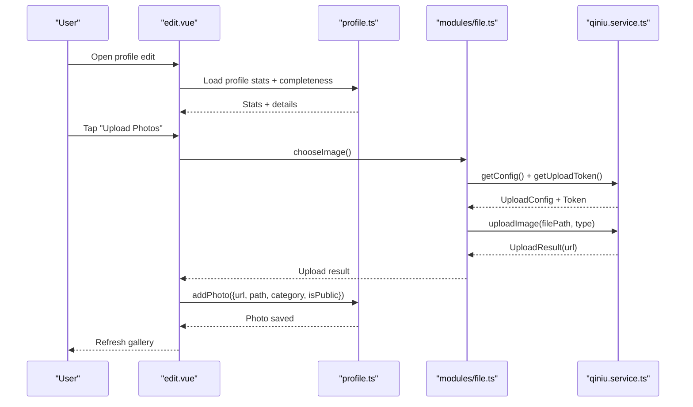

**Diagram sources**
- [edit.vue:1-567](file://src/pages/profile/edit.vue#L1-L567)
- [profile.ts:169-194](file://src/api/profile.ts#L169-L194)
- [file.ts:90-230](file://src/api/modules/file.ts#L90-L230)
- [qiniu.service.ts:12-87](file://src/services/qiniu.service.ts#L12-L87)

## Detailed Component Analysis

### Profile Editing Workflow
The edit dashboard aggregates completion metrics, quick actions, and step-by-step editing. It loads completeness details and statistics for interests, photos, and mate preferences, then routes users to dedicated editors.

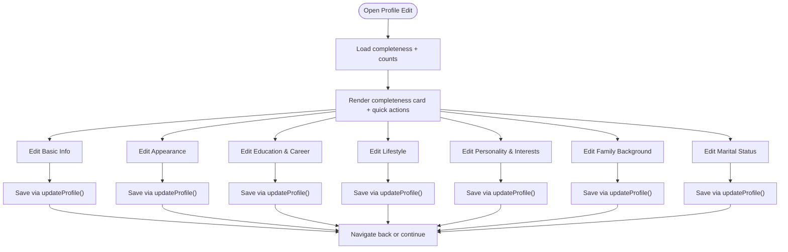

**Diagram sources**
- [edit.vue:1-567](file://src/pages/profile/edit.vue#L1-L567)
- [edit-section.vue:1-785](file://src/pages/profile/edit-section.vue#L1-L785)
- [profile.ts:140-146](file://src/api/profile.ts#L140-L146)

**Section sources**
- [edit.vue:1-567](file://src/pages/profile/edit.vue#L1-L567)
- [edit-section.vue:1-785](file://src/pages/profile/edit-section.vue#L1-L785)
- [profile.ts:140-146](file://src/api/profile.ts#L140-L146)

### Interest Management
Users can add, rate, and manage interests with category selection and star-based levels. The component enforces minimum counts and provides an edit mode for bulk actions.

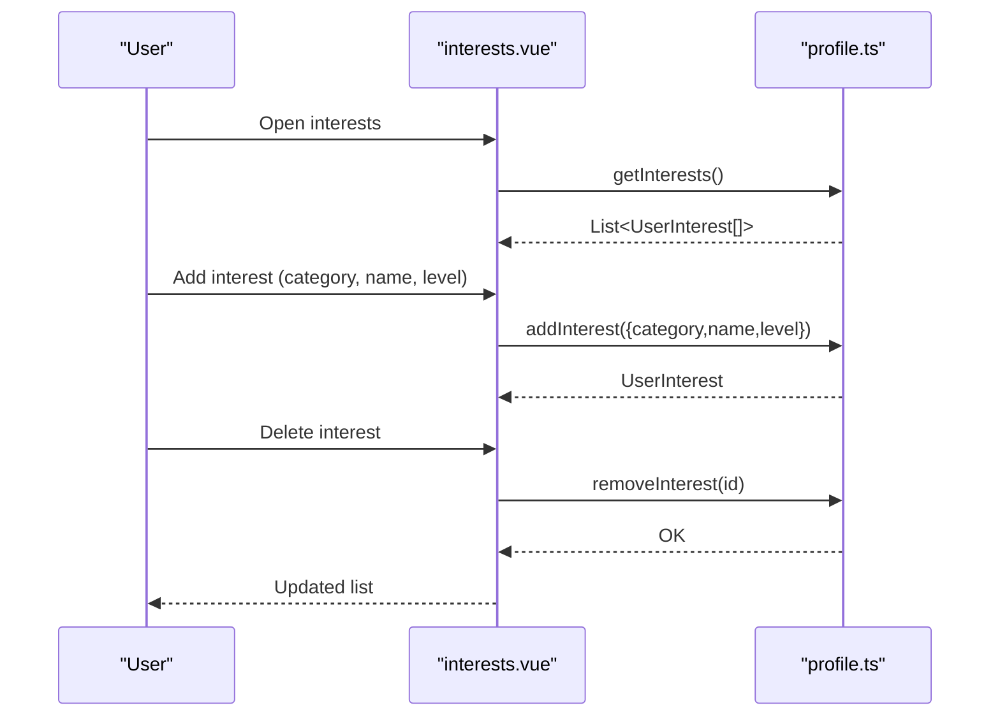

**Diagram sources**
- [interests.vue:1-645](file://src/pages/profile/interests.vue#L1-L645)
- [profile.ts:153-167](file://src/api/profile.ts#L153-L167)

**Section sources**
- [interests.vue:1-645](file://src/pages/profile/interests.vue#L1-L645)
- [profile.ts:72-80](file://src/api/profile.ts#L72-L80)
- [profile.ts:153-167](file://src/api/profile.ts#L153-L167)

### Photo Gallery and Upload
The photo gallery supports viewing, uploading, setting avatars, and deleting images. Images are uploaded via the file API to Qiniu with token-based authentication.

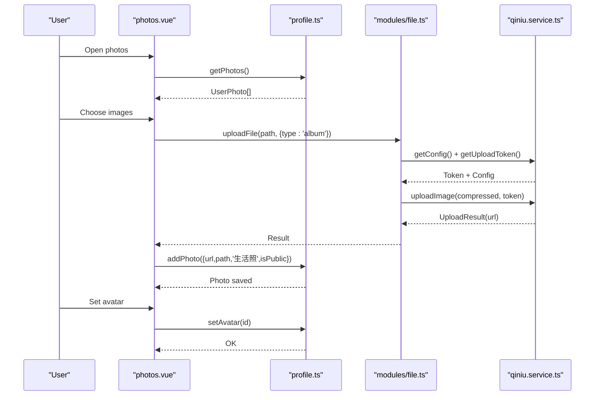

**Diagram sources**
- [photos.vue:1-505](file://src/pages/profile/photos.vue#L1-L505)
- [profile.ts:170-194](file://src/api/profile.ts#L170-L194)
- [file.ts:90-230](file://src/api/modules/file.ts#L90-L230)
- [qiniu.service.ts:12-87](file://src/services/qiniu.service.ts#L12-L87)

**Section sources**
- [photos.vue:1-505](file://src/pages/profile/photos.vue#L1-L505)
- [profile.ts:82-95](file://src/api/profile.ts#L82-L95)
- [file.ts:90-230](file://src/api/modules/file.ts#L90-L230)
- [qiniu.service.ts:12-87](file://src/services/qiniu.service.ts#L12-L87)

### Privacy Settings
Privacy settings control who sees personal information and what interactions are allowed. Users can adjust visibility levels and toggles, with immediate server sync and local feedback.

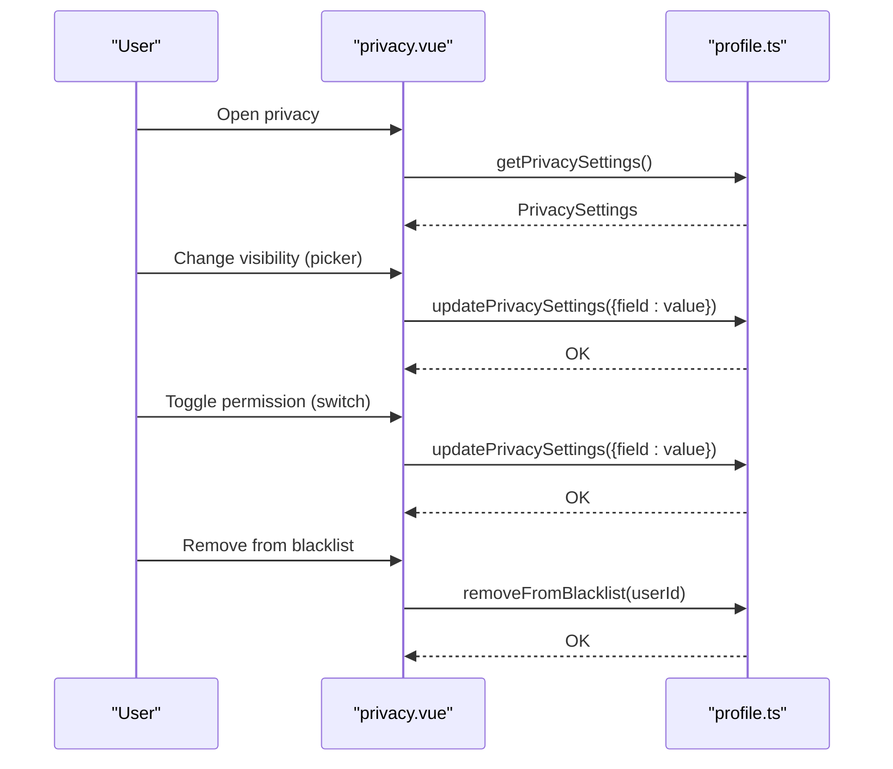

**Diagram sources**
- [privacy.vue:1-494](file://src/pages/profile/privacy.vue#L1-L494)
- [profile.ts:241-259](file://src/api/profile.ts#L241-L259)

**Section sources**
- [privacy.vue:1-494](file://src/pages/profile/privacy.vue#L1-L494)
- [profile.ts:207-239](file://src/api/profile.ts#L207-L239)
- [profile.ts:241-259](file://src/api/profile.ts#L241-L259)

### Mate Preferences
Users configure partner requirements across demographics, lifestyle, and relationship expectations. The component validates ranges and persists preferences.

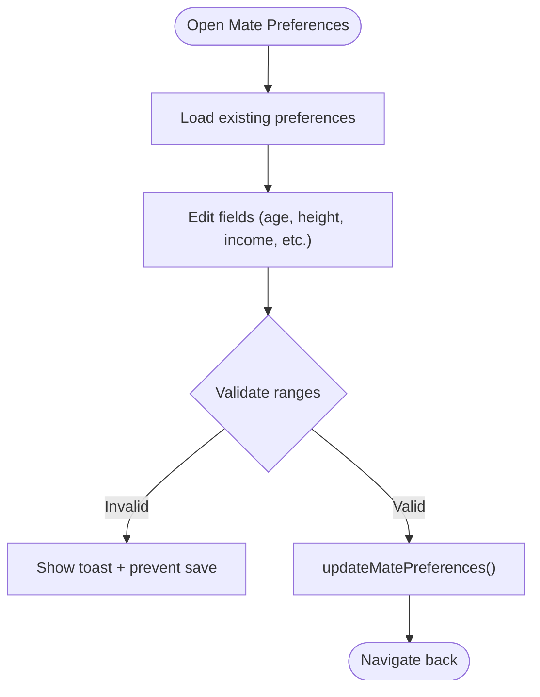

**Diagram sources**
- [mate-preferences.vue:1-559](file://src/pages/profile/mate-preferences.vue#L1-L559)
- [profile.ts:196-202](file://src/api/profile.ts#L196-L202)

**Section sources**
- [mate-preferences.vue:1-559](file://src/pages/profile/mate-preferences.vue#L1-L559)
- [profile.ts:97-118](file://src/api/profile.ts#L97-L118)
- [profile.ts:200-202](file://src/api/profile.ts#L200-L202)

### Values Management
Values are organized by categories with predefined questions. Users can answer, toggle public visibility, and benefit from auto-save with debounced persistence.

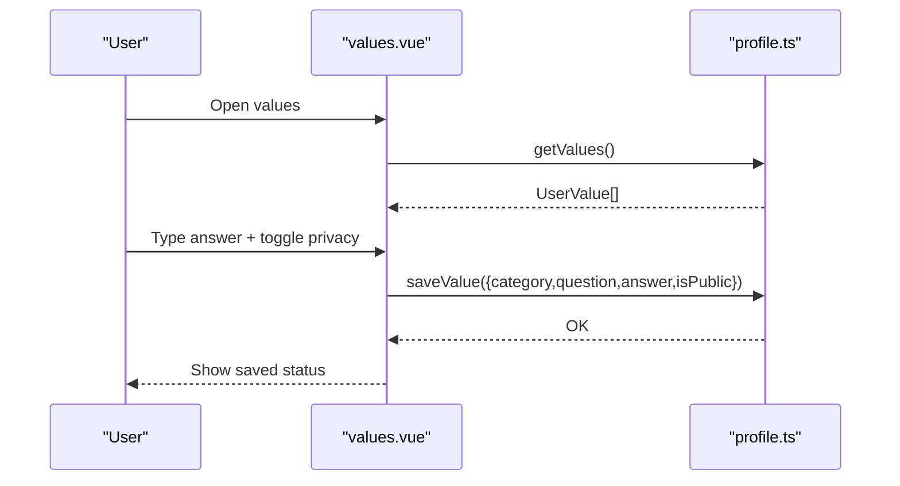

**Diagram sources**
- [values.vue:1-599](file://src/pages/profile/values.vue#L1-L599)
- [profile.ts:262-277](file://src/api/profile.ts#L262-L277)

**Section sources**
- [values.vue:1-599](file://src/pages/profile/values.vue#L1-L599)
- [profile.ts:120-129](file://src/api/profile.ts#L120-L129)
- [profile.ts:266-277](file://src/api/profile.ts#L266-L277)

### Certification Center
The certification center lists supported types, tracks statuses, and enables uploads with image previews and reapply flows.

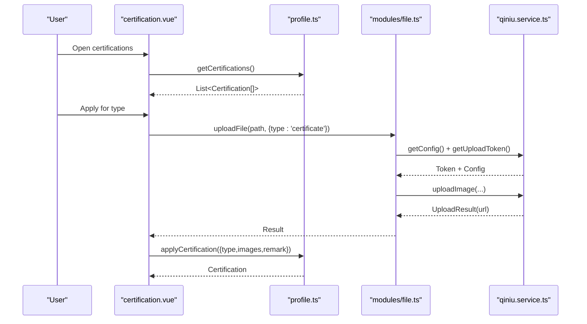

**Diagram sources**
- [certification.vue:1-968](file://src/pages/profile/certification.vue#L1-L968)
- [profile.ts:296-310](file://src/api/profile.ts#L296-L310)
- [file.ts:90-230](file://src/api/modules/file.ts#L90-L230)
- [qiniu.service.ts:12-87](file://src/services/qiniu.service.ts#L12-L87)

**Section sources**
- [certification.vue:1-968](file://src/pages/profile/certification.vue#L1-L968)
- [profile.ts:283-294](file://src/api/profile.ts#L283-L294)
- [profile.ts:296-310](file://src/api/profile.ts#L296-L310)
- [file.ts:90-230](file://src/api/modules/file.ts#L90-L230)
- [qiniu.service.ts:12-87](file://src/services/qiniu.service.ts#L12-L87)

### State Management and Events
The auth store manages logged-in state, tokens, and user info. It emits avatar update events to keep UI synchronized after profile changes.

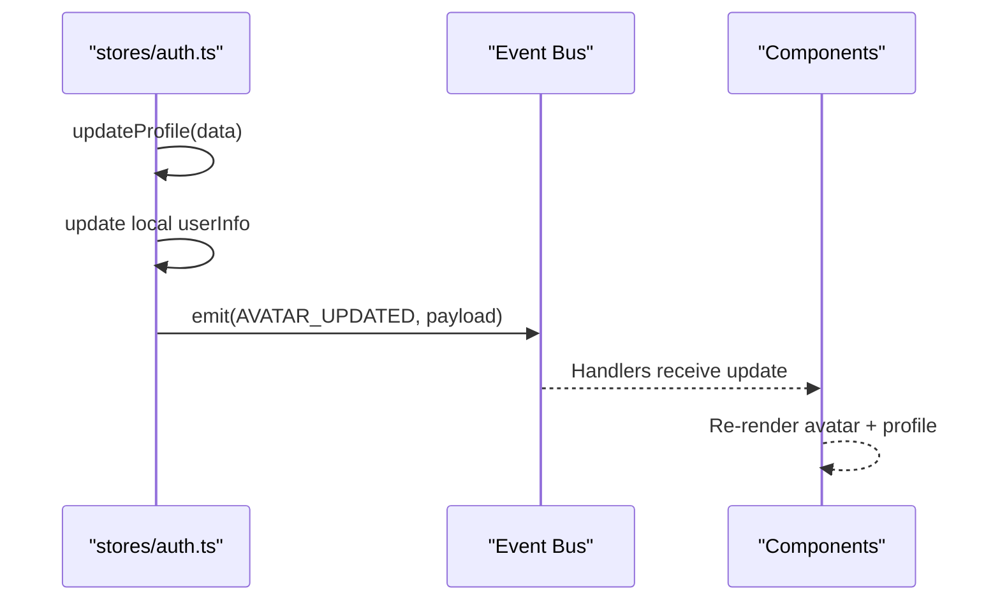

**Diagram sources**
- [auth.ts:95-117](file://src/stores/auth.ts#L95-L117)

**Section sources**
- [auth.ts:1-137](file://src/stores/auth.ts#L1-L137)

## Dependency Analysis
- Components depend on the profile API module for data operations.
- Photo and certificate flows depend on the file API and Qiniu service.
- The auth store coordinates user info updates and avatar synchronization.
- Validation utilities support form validation across components.

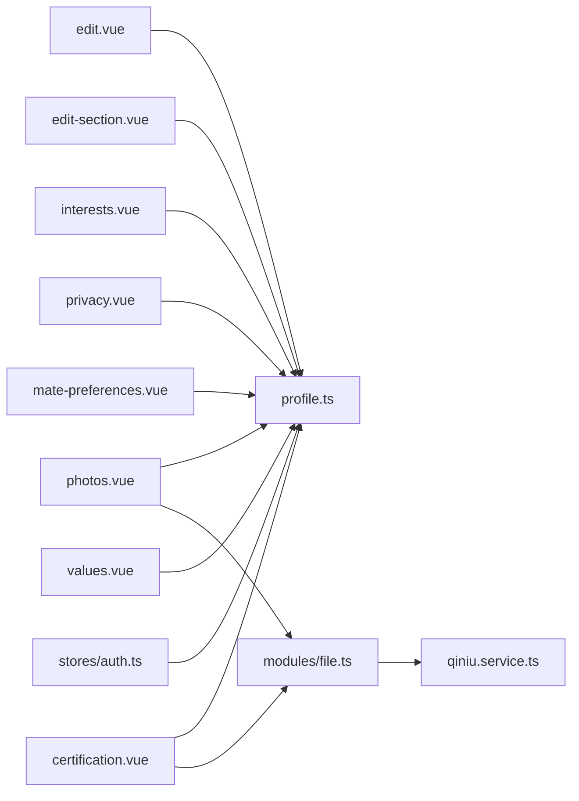

**Diagram sources**
- [profile.ts:1-311](file://src/api/profile.ts#L1-L311)
- [file.ts:1-335](file://src/api/modules/file.ts#L1-L335)
- [qiniu.service.ts:1-126](file://src/services/qiniu.service.ts#L1-L126)
- [edit.vue:1-567](file://src/pages/profile/edit.vue#L1-L567)
- [edit-section.vue:1-785](file://src/pages/profile/edit-section.vue#L1-L785)
- [interests.vue:1-645](file://src/pages/profile/interests.vue#L1-L645)
- [photos.vue:1-505](file://src/pages/profile/photos.vue#L1-L505)
- [privacy.vue:1-494](file://src/pages/profile/privacy.vue#L1-L494)
- [mate-preferences.vue:1-559](file://src/pages/profile/mate-preferences.vue#L1-L559)
- [values.vue:1-599](file://src/pages/profile/values.vue#L1-L599)
- [certification.vue:1-968](file://src/pages/profile/certification.vue#L1-L968)
- [auth.ts:1-137](file://src/stores/auth.ts#L1-L137)

**Section sources**
- [profile.ts:1-311](file://src/api/profile.ts#L1-L311)
- [file.ts:1-335](file://src/api/modules/file.ts#L1-L335)
- [qiniu.service.ts:1-126](file://src/services/qiniu.service.ts#L1-L126)
- [auth.ts:1-137](file://src/stores/auth.ts#L1-L137)

## Performance Considerations
- Debounced saves: values management uses a 1-second debounce to reduce network calls while typing.
- Batched operations: photo upload loops sequentially; consider parallelizing with concurrency limits for large batches.
- Image compression: Qiniu service compresses images to configured max dimensions and quality to reduce payload sizes.
- Local caching: profile completeness and privacy settings are cached locally; invalidate on successful updates.
- Pagination: file listings support pagination; apply pagination for large photo or file libraries.

[No sources needed since this section provides general guidance]

## Troubleshooting Guide
Common issues and resolutions:
- Upload failures: Verify upload token validity and file size limits; check Qiniu service logs and retry.
- Save conflicts: Debounced saves may race; ensure UI reflects latest server state after save.
- Validation errors: Form components display targeted toasts for invalid ranges or required fields.
- Privacy sync: Picker changes immediately call update; if UI lags, reload settings on mount.
- Avatar updates: After avatar changes, rely on auth store event emission to refresh UI.

**Section sources**
- [values.vue:260-280](file://src/pages/profile/values.vue#L260-L280)
- [photos.vue:134-179](file://src/pages/profile/photos.vue#L134-L179)
- [privacy.vue:181-212](file://src/pages/profile/privacy.vue#L181-L212)
- [auth.ts:79-88](file://src/stores/auth.ts#L79-L88)

## Conclusion
The WeTogether profile system provides a comprehensive, modular solution for user self-expression and discoverability. It balances rich functionality (interests, photos, values, certifications) with strong privacy controls and efficient image handling. The layered architecture ensures maintainability, while the UI components deliver a smooth, guided experience. Future enhancements could focus on parallelized uploads, richer analytics, and advanced search optimization signals derived from profile completeness and verified attributes.